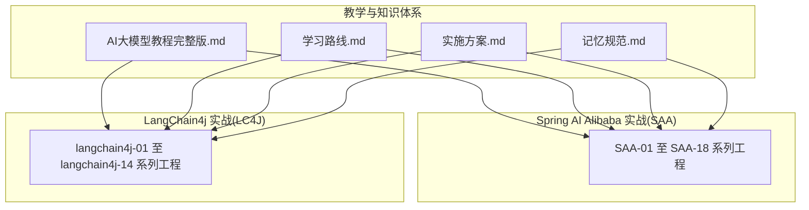
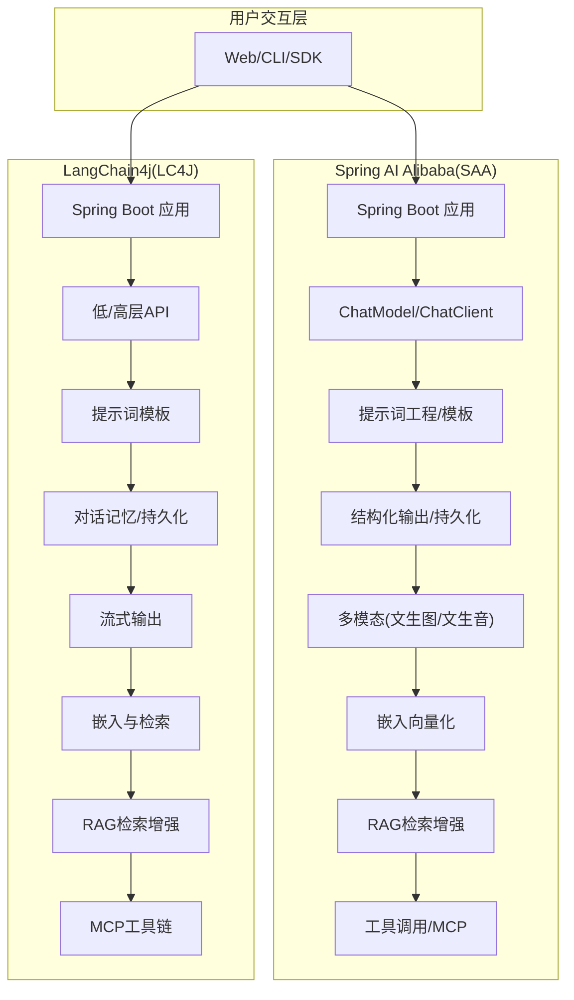
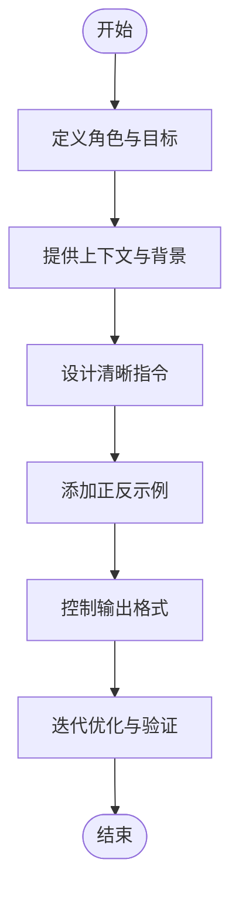
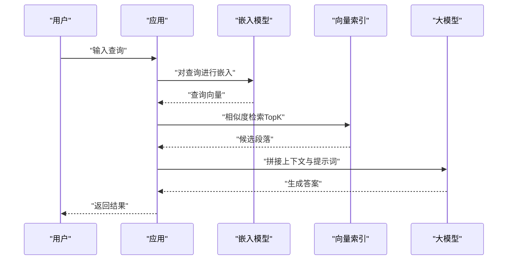
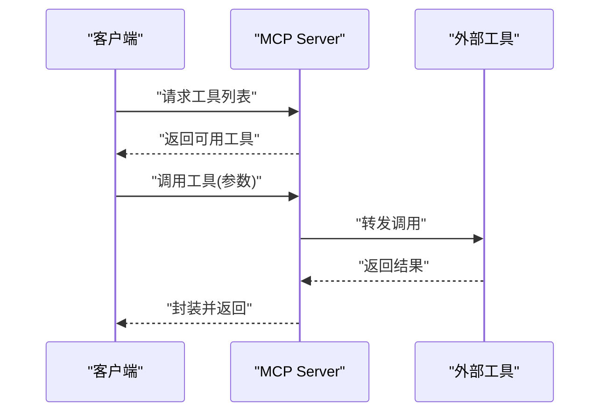
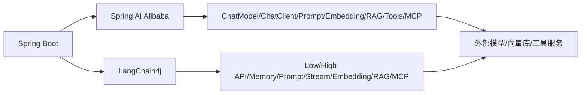

# AI大模型教程

<cite>
**本文引用的文件**
- [AI大模型教程完整版.md](file://【0】AI大模型教程（指导手册）/AI大模型教程完整版.md)
- [SpringAIAlibaba-完整学习总结笔记.md](file://3、SpringAIAlibaba-完整学习总结笔记.md)
- [LangChain4j-完整学习总结笔记.md](file://4、LangChain4j-完整学习总结笔记.md)
- [AI智能体完整学习与实施方案.md](file://5、AI智能体完整学习与实施方案.md)
- [AI智能体—技能全景与学习路线.md](file://6、AI智能体—技能全景与学习路线.md)
- [AI助手全局通用记忆规范.md](file://8、AI助手全局通用记忆规范.md)
- [SAA-01HelloWorld](file://【1】SpringAIAlibaba-atguiguV1/SAA-01HelloWorld)
- [SAA-02Ollama](file://【1】SpringAIAlibaba-atguiguV1/SAA-02Ollama)
- [SAA-03ChatModelChatClient](file://【1】SpringAIAlibaba-atguiguV1/SAA-03ChatModelChatClient)
- [SAA-04StreamingOutput](file://【1】SpringAIAlibaba-atguiguV1/SAA-04StreamingOutput)
- [SAA-05Prompt](file://【1】SpringAIAlibaba-atguiguV1/SAA-05Prompt)
- [SAA-06PromptTemplate](file://【1】SpringAIAlibaba-atguiguV1/SAA-06PromptTemplate)
- [SAA-07StructuredOutput](file://【1】SpringAIAlibaba-atguiguV1/SAA-07StructuredOutput)
- [SAA-08Persistent](file://【1】SpringAIAlibaba-atguiguV1/SAA-08Persistent)
- [SAA-09Text2image](file://【1】SpringAIAlibaba-atguiguV1/SAA-09Text2image)
- [SAA-10Text2voice](file://【1】SpringAIAlibaba-atguiguV1/SAA-10Text2voice)
- [SAA-11Embed2vector](file://【1】SpringAIAlibaba-atguiguV1/SAA-11Embed2vector)
- [SAA-12RAG4AiOps](file://【1】SpringAIAlibaba-atguiguV1/SAA-12RAG4AiOps)
- [SAA-13ToolCalling](file://【1】SpringAIAlibaba-atguiguV1/SAA-13ToolCalling)
- [SAA-14LocalMcpServer](file://【1】SpringAIAlibaba-atguiguV1/SAA-14LocalMcpServer)
- [SAA-15LocalMcpClient](file://【1】SpringAIAlibaba-atguiguV1/SAA-15LocalMcpClient)
- [SAA-16ClientCallBaiduMcpServer](file://【1】SpringAIAlibaba-atguiguV1/SAA-16ClientCallBaiduMcpServer)
- [SAA-17BailianRAG](file://【1】SpringAIAlibaba-atguiguV1/SAA-17BailianRAG)
- [SAA-18TodayMenu](file://【1】SpringAIAlibaba-atguiguV1/SAA-18TodayMenu)
- [langchain4j-01helloworld](file://【2】langchain4j-atguiguV5/langchain4j-01helloworld)
- [langchain4j-02multi-model-together](file://【2】langchain4j-atguiguV5/langchain4j-02multi-model-together)
- [langchain4j-03boot-integration](file://【2】langchain4j-atguiguV5/langchain4j-03boot-integration)
- [langchain4j-04low-high-api](file://【2】langchain4j-atguiguV1/SAA-04StreamingOutput)
- [langchain4j-05model-parameters](file://【2】langchain4j-atguiguV5/langchain4j-05model-parameters)
- [langchain4j-06chat-image](file://【2】langchain4j-atguiguV5/langchain4j-06chat-image)
- [langchain4j-07chat-stream](file://【2】langchain4j-atguiguV5/langchain4j-07chat-stream)
- [langchain4j-08chat-memory](file://【2】langchain4j-atguiguV5/langchain4j-08chat-memory)
- [langchain4j-09chat-prompt](file://【2】langchain4j-atguiguV5/langchain4j-09chat-prompt)
- [langchain4j-10chat-persistence](file://【2】langchain4j-atguiguV5/langchain4j-10chat-persistence)
- [langchain4j-11chat-functioncalling](file://【2】langchain4j-atguiguV5/langchain4j-11chat-functioncalling)
- [langchain4j-12chat-embedding](file://【2】langchain4j-atguiguV5/langchain4j-12chat-embedding)
- [langchain4j-13chat-rag01](file://【2】langchain4j-atguiguV5/langchain4j-13chat-rag01)
- [langchain4j-14chat-mcp](file://【2】langchain4j-atguiguV5/langchain4j-14chat-mcp)
</cite>

## 目录
1. [引言](#引言)
2. [项目结构](#项目结构)
3. [核心组件](#核心组件)
4. [架构总览](#架构总览)
5. [详细组件分析](#详细组件分析)
6. [依赖分析](#依赖分析)
7. [性能考虑](#性能考虑)
8. [故障排查指南](#故障排查指南)
9. [结论](#结论)
10. [附录](#附录)

## 引言
本教程面向希望系统掌握AI大模型应用开发的学习者，围绕以下主线展开：基础概念与原理、提示词工程、RAG检索增强生成、MCP协议与工具调用、以及在Spring AI Alibaba与LangChain4j中的实践路径。教程提供从入门到精通的学习蓝图，并结合仓库中的真实项目案例，帮助读者将理论转化为可运行的应用能力。

## 项目结构
该仓库由三大板块构成：
- 教学与知识体系：包含完整的AI大模型教程、学习路线、实施方案与记忆规范等文档。
- Spring AI Alibaba 实战系列：以“SAA-”命名的一系列示例工程，覆盖从Hello World到RAG、工具调用、MCP协议等主题。
- LangChain4j 实战系列：以“langchain4j-”命名的一系列示例工程，覆盖多模态、流式输出、函数调用、嵌入与RAG等主题。

下图给出一个概览性结构视图（概念示意，非具体代码映射）：

## 核心组件
本节聚焦于两大技术栈的核心能力与对应的教学目标：
- Spring AI Alibaba（SAA）：强调与本地或云端大模型的集成、提示词工程、结构化输出、持久化、多模态（文生图/文生音）、嵌入向量化、RAG、工具调用与MCP协议。
- LangChain4j（LC4J）：强调与Spring Boot集成、低/高层API、模型参数、流式输出、对话记忆、提示词模板、持久化、函数调用、嵌入与RAG、MCP工具链。

为便于学习，建议按如下顺序推进：
- 基础入门：SAA-01/SAA-02 或 LC4J-01/LC4J-02
- 提示词工程：SAA-05/SAA-06 或 LC4J-09
- 结构化输出与持久化：SAA-07/SAA-08 或 LC4J-10
- 多模态：SAA-09/SAA-10 或 LC4J-06
- 嵌入与RAG：SAA-11/SAA-12/SAA-17 或 LC4J-12/LC4J-13
- 工具调用与MCP：SAA-13/SAA-14/SAA-15/SAA-16 或 LC4J-11/LC4J-14

章节来源
- [SpringAIAlibaba-完整学习总结笔记.md](file://3、SpringAIAlibaba-完整学习总结笔记.md)
- [LangChain4j-完整学习总结笔记.md](file://4、LangChain4j-完整学习总结笔记.md)

## 架构总览
下图展示了两类技术栈在典型场景下的整体架构关系（概念图）：

## 详细组件分析

### 组件A：提示词工程（Prompt Engineering）
- 目标：通过精心设计的提示词与模板，提升模型输出质量与可控性。
- 在SAA中体现为SAA-05（提示词）与SAA-06（提示词模板）；在LC4J中体现为LC4J-09（提示词模板）。
- 关键实践：
  - 明确角色与上下文
  - 使用结构化指令与示例
  - 控制输出格式（如JSON/表格）
  - 迭代优化与A/B测试

章节来源
- [SAA-05Prompt](file://【1】SpringAIAlibaba-atguiguV1/SAA-05Prompt)
- [SAA-06PromptTemplate](file://【1】SpringAIAlibaba-atguiguV1/SAA-06PromptTemplate)
- [langchain4j-09chat-prompt](file://【2】langchain4j-atguiguV5/langchain4j-09chat-prompt)

### 组件B：RAG（检索增强生成）
- 目标：将外部知识库与模型推理结合，提升准确性与时效性。
- 在SAA中体现为SAA-12（AiOps）、SAA-17（百炼RAG）；在LC4J中体现为LC4J-12（嵌入）、LC4J-13（RAG）。
- 关键实践：
  - 文档分块与去重
  - 向量化与索引构建
  - 查询嵌入与相似度检索
  - 上下文拼接与重排序
  - 评估指标（准确率、相关性、覆盖率）

章节来源
- [SAA-12RAG4AiOps](file://【1】SpringAIAlibaba-atguiguV1/SAA-12RAG4AiOps)
- [SAA-17BailianRAG](file://【1】SpringAIAlibaba-atguiguV1/SAA-17BailianRAG)
- [langchain4j-12chat-embedding](file://【2】langchain4j-atguiguV5/langchain4j-12chat-embedding)
- [langchain4j-13chat-rag01](file://【2】langchain4j-atguiguV5/langchain4j-13chat-rag01)

### 组件C：工具调用与MCP协议
- 目标：通过MCP（Model Context Protocol）实现模型与外部工具/服务的标准化协作。
- 在SAA中体现为SAA-13（工具调用）、SAA-14（本地MCP Server）、SAA-15（本地MCP Client）、SAA-16（调用百度MCP Server）；在LC4J中体现为LC4J-11（函数调用）、LC4J-14（MCP）。
- 关键实践：
  - 定义工具接口与参数
  - 实现MCP Server/Client
  - 安全与鉴权策略
  - 错误处理与重试

章节来源
- [SAA-13ToolCalling](file://【1】SpringAIAlibaba-atguiguV1/SAA-13ToolCalling)
- [SAA-14LocalMcpServer](file://【1】SpringAIAlibaba-atguiguV1/SAA-14LocalMcpServer)
- [SAA-15LocalMcpClient](file://【1】SpringAIAlibaba-atguiguV1/SAA-15LocalMcpClient)
- [SAA-16ClientCallBaiduMcpServer](file://【1】SpringAIAlibaba-atguiguV1/SAA-16ClientCallBaiduMcpServer)
- [langchain4j-11chat-functioncalling](file://【2】langchain4j-atguiguV5/langchain4j-11chat-functioncalling)
- [langchain4j-14chat-mcp](file://【2】langchain4j-atguiguV5/langchain4j-14chat-mcp)

### 组件D：多模态（文生图/文生音）
- 目标：扩展模型能力至图像与语音，满足更丰富的交互场景。
- 在SAA中体现为SAA-09（文生图）、SAA-10（文生音）；在LC4J中体现为LC4J-06（图文对话）。
- 关键实践：
  - 图像生成/编辑接口调用
  - 语音合成与播放
  - 跨模态提示词设计
  - 输出后处理与缓存

章节来源
- [SAA-09Text2image](file://【1】SpringAIAlibaba-atguiguV1/SAA-09Text2image)
- [SAA-10Text2voice](file://【1】SpringAIAlibaba-atguiguV1/SAA-10Text2voice)
- [langchain4j-06chat-image](file://【2】langchain4j-atguiguV5/langchain4j-06chat-image)

### 组件E：结构化输出与持久化
- 目标：确保模型输出可解析、可存储、可回放。
- 在SAA中体现为SAA-07（结构化输出）、SAA-08（持久化）；在LC4J中体现为LC4J-10（持久化）。
- 关键实践：
  - 预定义输出模式（JSON/表格）
  - 数据清洗与校验
  - 会话与消息持久化
  - 回放与审计

章节来源
- [SAA-07StructuredOutput](file://【1】SpringAIAlibaba-atguiguV1/SAA-07StructuredOutput)
- [SAA-08Persistent](file://【1】SpringAIAlibaba-atguiguV1/SAA-08Persistent)
- [langchain4j-10chat-persistence](file://【2】langchain4j-atguiguV5/langchain4j-10chat-persistence)

### 组件F：嵌入与向量化
- 目标：将文本转换为稠密向量，支撑检索与聚类等任务。
- 在SAA中体现为SAA-11；在LC4J中体现为LC4J-12。
- 关键实践：
  - 文本预处理与分块
  - 向量模型选择与调参
  - 向量索引构建与查询
  - 性能与精度平衡

章节来源
- [SAA-11Embed2vector](file://【1】SpringAIAlibaba-atguiguV1/SAA-11Embed2vector)
- [langchain4j-12chat-embedding](file://【2】langchain4j-atguiguV5/langchain4j-12chat-embedding)

### 组件G：流式输出与对话记忆
- 目标：提供更自然的交互体验，支持长对话与上下文管理。
- 在SAA中体现为SAA-04；在LC4J中体现为LC4J-07（流式输出）、LC4J-08（对话记忆）。
- 关键实践：
  - 流式响应与前端渲染
  - 记忆窗口与压缩策略
  - 会话状态管理与恢复

章节来源
- [SAA-04StreamingOutput](file://【1】SpringAIAlibaba-atguiguV1/SAA-04StreamingOutput)
- [langchain4j-07chat-stream](file://【2】langchain4j-atguiguV5/langchain4j-07chat-stream)
- [langchain4j-08chat-memory](file://【2】langchain4j-atguiguV5/langchain4j-08chat-memory)

## 依赖分析
两类技术栈均基于Spring Boot生态，依赖关系如下（概念示意）：

章节来源
- [SpringAIAlibaba-完整学习总结笔记.md](file://3、SpringAIAlibaba-完整学习总结笔记.md)
- [LangChain4j-完整学习总结笔记.md](file://4、LangChain4j-完整学习总结笔记.md)

## 性能考虑
- 模型调用成本控制：合理设置温度、最大令牌数；使用缓存与批处理。
- 网络与延迟：就近部署、连接池复用、超时与重试策略。
- 向量检索：索引规模与维度权衡；布隆过滤与预过滤。
- 流式输出：前端渲染与背压处理；分片与合并策略。
- 工具调用：并发限制与熔断；幂等性与事务一致性。

## 故障排查指南
- 提示词无效：检查角色设定、上下文长度、输出格式约束是否明确。
- RAG召回不足：检查分块策略、嵌入质量、相似度阈值与TopK设置。
- 工具调用失败：核对MCP协议版本、鉴权头、网络连通性与超时。
- 多模态异常：确认模型支持的模态类型与参数格式。
- 持久化问题：检查数据库连接、序列化/反序列化兼容性与索引完整性。
- 流式输出卡顿：排查后端吞吐与前端渲染性能瓶颈。

章节来源
- [AI智能体完整学习与实施方案.md](file://5、AI智能体完整学习与实施方案.md)
- [AI助手全局通用记忆规范.md](file://8、AI助手全局通用记忆规范.md)

## 结论
通过本教程与实战工程，学习者可以系统掌握大模型的核心能力与工程化方法，从提示词设计到RAG检索，从工具调用到MCP协议，最终具备独立开发高质量AI应用的能力。建议以“理论-实践-项目”的节奏推进，并结合仓库中的SAA与LC4J工程进行动手练习。

## 附录
- 学习路径参考：见“AI智能体—技能全景与学习路线.md”
- 实施方案参考：见“AI智能体完整学习与实施方案.md”
- 教学主文档：见“AI大模型教程完整版.md”

章节来源
- [AI智能体—技能全景与学习路线.md](file://6、AI智能体—技能全景与学习路线.md)
- [AI智能体完整学习与实施方案.md](file://5、AI智能体完整学习与实施方案.md)
- [AI大模型教程完整版.md](file://【0】AI大模型教程（指导手册）/AI大模型教程完整版.md)