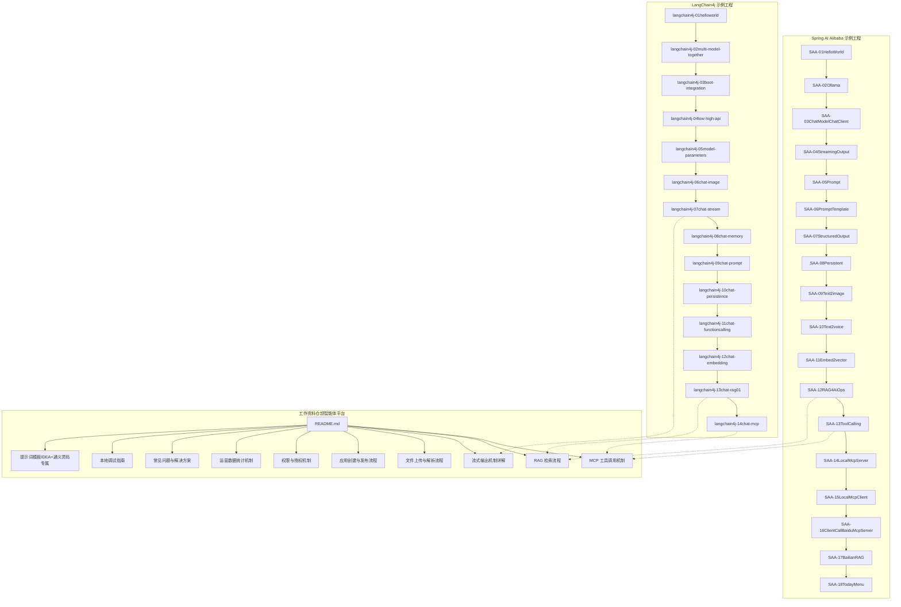
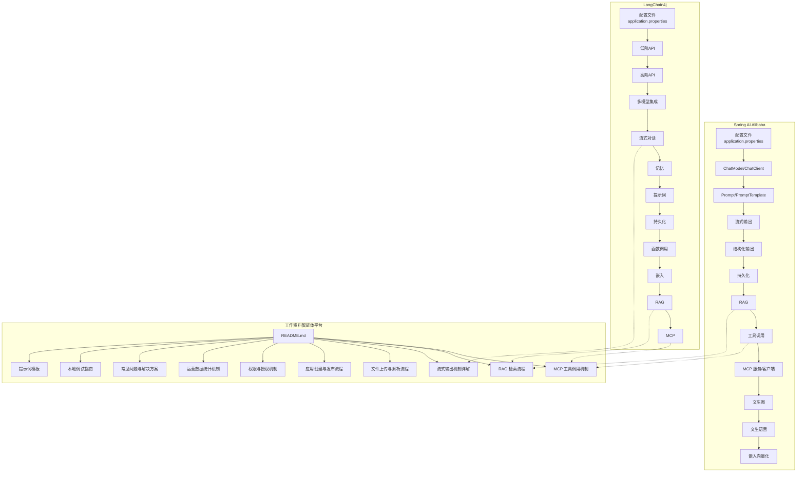
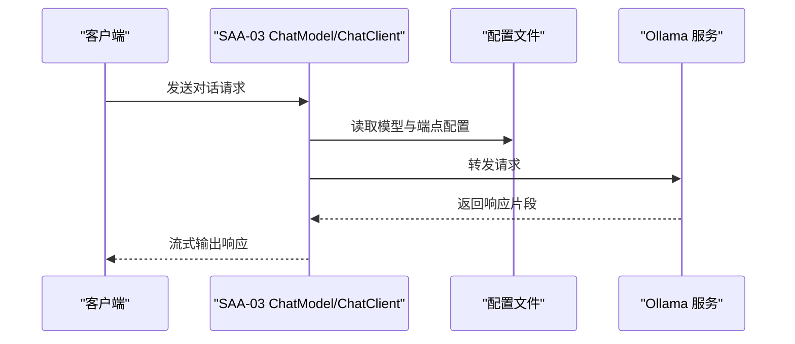
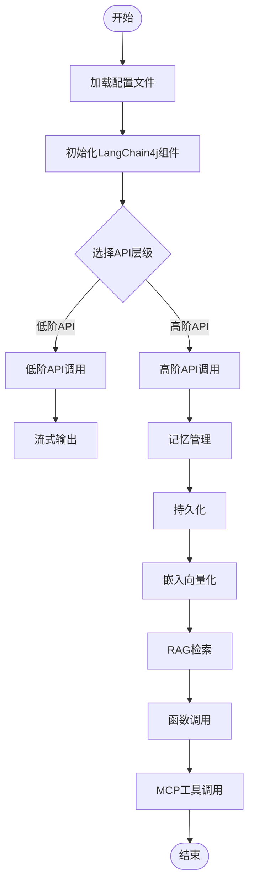
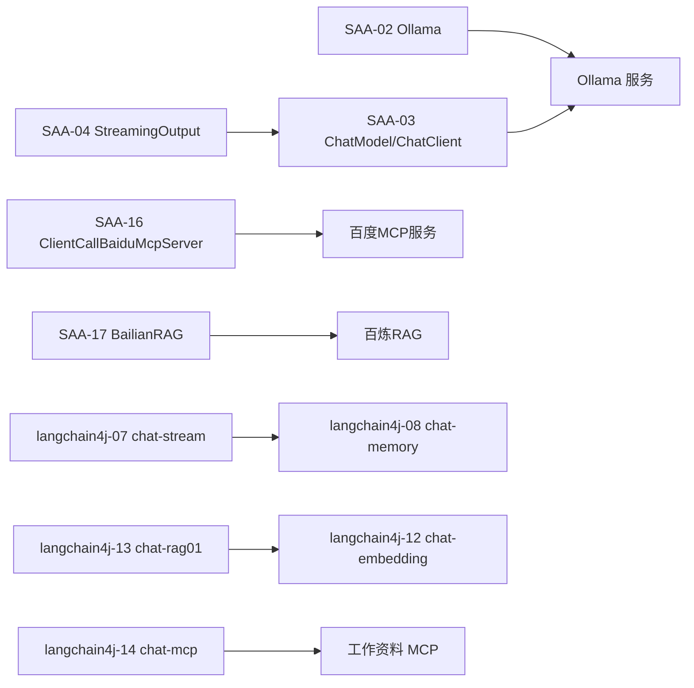

# AI工具与实践

<cite>
**本文引用的文件**
- [SAA-01HelloWorld 应用入口](file://【1】SpringAIAlibaba-atguiguV1/SAA-01HelloWorld/src/main/java/com/atguigu/study/Saa01HelloWorldApplication.java)
- [SAA-01HelloWorld 配置文件](file://【1】SpringAIAlibaba-atguiguV1/SAA-01HelloWorld/src/main/resources/application.properties)
- [SAA-02Ollama 应用入口](file://【1】SpringAIAlibaba-atguiguV1/SAA-02Ollama/src/main/java/com/atguigu/study/Saa02OllamaApplication.java)
- [SAA-02Ollama 配置文件](file://【1】SpringAIAlibaba-atguiguV1/SAA-02Ollama/src/main/resources/application.properties)
- [SAA-03ChatModelChatClient 应用入口](file://【1】SpringAIAlibaba-atguiguV1/SAA-03ChatModelChatClient/src/main/java/com/atguigu/study/Saa03ChatModelChatClientApplication.java)
- [SAA-03ChatModelChatClient 配置文件](file://【1】SpringAIAlibaba-atguiguV1/SAA-03ChatModelChatClient/src/main/resources/application.properties)
- [SAA-04StreamingOutput 应用入口](file://【1】SpringAIAlibaba-atguiguV1/SAA-04StreamingOutput/src/main/java/com/atguigu/study/Saa04StreamingOutputApplication.java)
- [SAA-04StreamingOutput 配置文件](file://【1】SpringAIAlibaba-atguiguV1/SAA-04StreamingOutput/src/main/resources/application.properties)
- [SAA-05Prompt 应用入口](file://【1】SpringAIAlibaba-atguiguV1/SAA-05Prompt/src/main/java/com/atguigu/study/Saa05PromptApplication.java)
- [SAA-05Prompt 配置文件](file://【1】SpringAIAlibaba-atguiguV1/SAA-05Prompt/src/main/resources/application.properties)
- [SAA-06PromptTemplate 应用入口](file://【1】SpringAIAlibaba-atguiguV1/SAA-06PromptTemplate/src/main/java/com/atguigu/study/Saa06PromptTemplateApplication.java)
- [SAA-06PromptTemplate 配置文件](file://【1】SpringAIAlibaba-atguiguV1/SAA-06PromptTemplate/src/main/resources/application.properties)
- [SAA-07StructuredOutput 应用入口](file://【1】SpringAIAlibaba-atguiguV1/SAA-07StructuredOutput/src/main/java/com/atguigu/study/Saa07StructuredOutputApplication.java)
- [SAA-07StructuredOutput 配置文件](file://【1】SpringAIAlibaba-atguiguV1/SAA-07StructuredOutput/src/main/resources/application.properties)
- [SAA-08Persistent 应用入口](file://【1】SpringAIAlibaba-atguiguV1/SAA-08Persistent/src/main/java/com/atguigu/study/Saa08PersistentApplication.java)
- [SAA-08Persistent 配置文件](file://【1】SpringAIAlibaba-atguiguV1/SAA-08Persistent/src/main/resources/application.properties)
- [SAA-09Text2image 应用入口](file://【1】SpringAIAlibaba-atguiguV1/SAA-09Text2image/src/main/java/com/atguigu/study/Saa09Text2imageApplication.java)
- [SAA-09Text2image 配置文件](file://【1】SpringAIAlibaba-atguiguV1/SAA-09Text2image/src/main/resources/application.properties)
- [SAA-10Text2voice 应用入口](file://【1】SpringAIAlibaba-atguiguV1/SAA-10Text2voice/src/main/java/com/atguigu/study/Saa10Text2voiceApplication.java)
- [SAA-10Text2voice 配置文件](file://【1】SpringAIAlibaba-atguiguV1/SAA-10Text2voice/src/main/resources/application.properties)
- [SAA-11Embed2vector 应用入口](file://【1】SpringAIAlibaba-atguiguV1/SAA-11Embed2vector/src/main/java/com/atguigu/study/Saa11Embed2vectorApplication.java)
- [SAA-11Embed2vector 配置文件](file://【1】SpringAIAlibaba-atguiguV1/SAA-11Embed2vector/src/main/resources/application.properties)
- [SAA-12RAG4AiOps 应用入口](file://【1】SpringAIAlibaba-atguiguV1/SAA-12RAG4AiOps/src/main/java/com/atguigu/study/Saa12Rag4AiOpsApplication.java)
- [SAA-12RAG4AiOps 配置文件](file://【1】SpringAIAlibaba-atguiguV1/SAA-12RAG4AiOps/src/main/resources/application.properties)
- [SAA-13ToolCalling 应用入口](file://【1】SpringAIAlibaba-atguiguV1/SAA-13ToolCalling/src/main/java/com/atguigu/study/Saa13ToolCallingApplication.java)
- [SAA-13ToolCalling 配置文件](file://【1】SpringAIAlibaba-atguiguV1/SAA-13ToolCalling/src/main/resources/application.properties)
- [SAA-14LocalMcpServer 应用入口](file://【1】SpringAIAlibaba-atguiguV1/SAA-14LocalMcpServer/src/main/java/com/atguigu/study/Saa14LocalMcpServerApplication.java)
- [SAA-14LocalMcpServer 配置文件](file://【1】SpringAIAlibaba-atguiguV1/SAA-14LocalMcpServer/src/main/resources/application.properties)
- [SAA-15LocalMcpClient 应用入口](file://【1】SpringAIAlibaba-atguiguV1/SAA-15LocalMcpClient/src/main/java/com/atguigu/study/Saa15LocalMcpClientApplication.java)
- [SAA-15LocalMcpClient 配置文件](file://【1】SpringAIAlibaba-atguiguV1/SAA-15LocalMcpClient/src/main/resources/application.properties)
- [SAA-16ClientCallBaiduMcpServer 应用入口](file://【1】SpringAIAlibaba-atguiguV1/SAA-16ClientCallBaiduMcpServer/src/main/java/com/atguigu/study/Saa16ClientCallBaiduMcpServerApplication.java)
- [SAA-16ClientCallBaiduMcpServer 配置文件](file://【1】SpringAIAlibaba-atguiguV1/SAA-16ClientCallBaiduMcpServer/src/main/resources/application.properties)
- [SAA-16ClientCallBaiduMcpServer MCP服务器配置](file://【1】SpringAIAlibaba-atguiguV1/SAA-16ClientCallBaiduMcpServer/src/main/resources/mcp-server.json5)
- [SAA-17BailianRAG 应用入口](file://【1】SpringAIAlibaba-atguiguV1/SAA-17BailianRAG/src/main/java/com/atguigu/study/Saa17BailianRagApplication.java)
- [SAA-17BailianRAG 配置文件](file://【1】SpringAIAlibaba-atguiguV1/SAA-17BailianRAG/src/main/resources/application.properties)
- [SAA-18TodayMenu 应用入口](file://【1】SpringAIAlibaba-atguiguV1/SAA-18TodayMenu/src/main/java/com/atguigu/study/Saa18TodayMenuApplication.java)
- [SAA-18TodayMenu 配置文件](file://【1】SpringAIAlibaba-atguiguV1/SAA-18TodayMenu/src/main/resources/application.properties)
- [SAA-18TodayMenu 运维知识库](file://【1】SpringAIAlibaba-atguiguV1/SAA-12RAG4AiOps/src/main/resources/ops.txt)
- [langchain4j-01helloworld 应用入口](file://【2】langchain4j-atguiguV5/langchain4j-01helloworld/src/main/java/com/atguigu/study/HelloLangChain4JApp.java)
- [langchain4j-01helloworld 配置文件](file://【2】langchain4j-atguiguV5/langchain4j-01helloworld/src/main/resources/application.properties)
- [langchain4j-02multi-model-together 应用入口](file://【2】langchain4j-atguiguV5/langchain4j-02multi-model-together/src/main/java/com/atguigu/study/MultiModelLangChain4JApp.java)
- [langchain4j-02multi-model-together 配置文件](file://【2】langchain4j-atguiguV5/langchain4j-02multi-model-together/src/main/resources/application.properties)
- [langchain4j-03boot-integration 应用入口](file://【2】langchain4j-atguiguV5/langchain4j-03boot-integration/src/main/java/com/atguigu/study/BootIntegrationLangChain4JApp.java)
- [langchain4j-03boot-integration 配置文件](file://【2】langchain4j-atguiguV5/langchain4j-03boot-integration/src/main/resources/application.properties)
- [langchain4j-04low-high-api 应用入口](file://【2】langchain4j-atguiguV5/langchain4j-04low-high-api/src/main/java/com/atguigu/study/LowHighApiLangChain4JApp.java)
- [langchain4j-04low-high-api 配置文件](file://【2】langchain4j-atguiguV1/SAA-04StreamingOutput/src/main/resources/application.properties)
- [langchain4j-05model-parameters 应用入口](file://【2】langchain4j-atguiguV5/langchain4j-05model-parameters/src/main/java/com/atguigu/study/ModelParametersLangChain4JApp.java)
- [langchain4j-05model-parameters 配置文件](file://【2】langchain4j-atguiguV5/langchain4j-05model-parameters/src/main/resources/application.properties)
- [langchain4j-06chat-image 应用入口](file://【2】langchain4j-atguiguV5/langchain4j-06chat-image/src/main/java/com/atguigu/study/ChatImageModelLangChain4JApp.java)
- [langchain4j-06chat-image 配置文件](file://【2】langchain4j-atguiguV5/langchain4j-06chat-image/src/main/resources/application.properties)
- [langchain4j-07chat-stream 应用入口](file://【2】langchain4j-atguiguV5/langchain4j-07chat-stream/src/main/java/com/atguigu/study/ChatStreamLangChain4JApp.java)
- [langchain4j-07chat-stream 配置文件](file://【2】langchain4j-atguiguV5/langchain4j-07chat-stream/src/main/resources/application.properties)
- [langchain4j-08chat-memory 应用入口](file://【2】langchain4j-atguiguV5/langchain4j-08chat-memory/src/main/java/com/atguigu/study/ChatMemoryLangChain4JApp.java)
- [langchain4j-08chat-memory 配置文件](file://【2】langchain4j-atguiguV5/langchain4j-08chat-memory/src/main/resources/application.properties)
- [langchain4j-09chat-prompt 应用入口](file://【2】langchain4j-atguiguV5/langchain4j-09chat-prompt/src/main/java/com/atguigu/study/ChatPromptLangChain4JApp.java)
- [langchain4j-09chat-prompt 配置文件](file://【2】langchain4j-atguiguV5/langchain4j-09chat-prompt/src/main/resources/application.properties)
- [langchain4j-10chat-persistence 应用入口](file://【2】langchain4j-atguiguV5/langchain4j-10chat-persistence/src/main/java/com/atguigu/study/ChatPersistenceLangChain4JApp.java)
- [langchain4j-10chat-persistence 配置文件](file://【2】langchain4j-atguiguV5/langchain4j-10chat-persistence/src/main/resources/application.properties)
- [langchain4j-11chat-functioncalling 应用入口](file://【2】langchain4j-atguiguV5/langchain4j-11chat-functioncalling/src/main/java/com/atguigu/study/ChatFunctioncallingLangChain4JApp.java)
- [langchain4j-11chat-functioncalling 配置文件](file://【2】langchain4j-atguiguV5/langchain4j-11chat-functioncalling/src/main/resources/application.properties)
- [langchain4j-12chat-embedding 应用入口](file://【2】langchain4j-atguiguV5/langchain4j-12chat-embedding/src/main/java/com/atguigu/study/ChatEmbeddingLangChain4JApp.java)
- [langchain4j-12chat-embedding 配置文件](file://【2】langchain4j-atguiguV5/langchain4j-12chat-embedding/src/main/resources/application.properties)
- [langchain4j-13chat-rag01 应用入口](file://【2】langchain4j-atguiguV5/langchain4j-13chat-rag01/src/main/java/com/atguigu/study/ChatRag01LangChain4JApp.java)
- [langchain4j-13chat-rag01 配置文件](file://【2】langchain4j-atguiguV5/langchain4j-13chat-rag01/src/main/resources/application.properties)
- [langchain4j-14chat-mcp 应用入口](file://【2】langchain4j-atguiguV5/langchain4j-14chat-mcp/src/main/java/com/atguigu/study/ChatMcpLangChain4JApp.java)
- [langchain4j-14chat-mcp 配置文件](file://【2】langchain4j-atguiguV5/langchain4j-14chat-mcp/src/main/resources/application.properties)
- [Spring AI Alibaba 完整学习总结笔记](file://3、SpringAIAlibaba-完整学习总结笔记.md)
- [LangChain4j 完整学习总结笔记](file://4、LangChain4j-完整学习总结笔记.md)
- [AI智能体完整学习与实施方案](file://5、AI智能体完整学习与实施方案.md)
- [AI智能体—技能全景与学习路线](file://6、AI智能体—技能全景与学习路线.md)
- [AI助手全局通用记忆规范](file://8、AI助手全局通用记忆规范.md)
- [工作资料 总览](file://【3】工作资料/README.md)
- [仓颉智能体 平台说明](file://【3】工作资料/仓颉智能体/nlp-agent/README.md)
- [仓颉智能体 MCP 工具调用机制](file://【3】工作资料/仓颉智能体/nlp-agent/README.md)
- [仓颉智能体 RAG 检索流程](file://【3】工作资料/仓颉智能体/nlp-agent/README.md)
- [仓颉智能体 流式输出机制详解](file://【3】工作资料/仓颉智能体/nlp-agent/README.md)
- [仓颉智能体 文件上传与解析流程](file://【3】工作资料/仓颉智能体/nlp-agent/README.md)
- [仓颉智能体 应用创建与发布流程](file://【3】工作资料/仓颉智能体/nlp-agent/README.md)
- [仓颉智能体 权限与授权机制](file://【3】工作资料/仓颉智能体/nlp-agent/README.md)
- [仓颉智能体 运营数据统计机制](file://【3】工作资料/仓颉智能体/nlp-agent/README.md)
- [仓颉智能体 常见问题与解决方案](file://【3】工作资料/仓颉智能体/nlp-agent/README.md)
- [仓颉智能体 本地调试指南](file://【3】工作资料/仓颉智能体/nlp-agent/README.md)
- [提示词模板（IDEA+通义灵码专属）](file://【3】工作资料/仓颉智能体/提示词模板（IDEA+通义灵码专属）.md)
</cite>

## 目录
1. [引言](#引言)
2. [项目结构](#项目结构)
3. [核心组件](#核心组件)
4. [架构总览](#架构总览)
5. [详细组件分析](#详细组件分析)
6. [依赖分析](#依赖分析)
7. [性能考虑](#性能考虑)
8. [故障排查指南](#故障排查指南)
9. [结论](#结论)
10. [附录](#附录)

## 引言
本指南面向希望系统掌握AI工具与实践的开发者，围绕以下目标展开：  
- 以Spring AI Alibaba与LangChain4j为核心，串联从基础到高级的AI应用开发路径  
- 结合仓库中的示例工程，给出可操作的安装、配置与使用步骤  
- 提供从对话、流式输出、提示词工程、结构化输出、持久化、RAG、工具调用、MCP、文生图、文生语音到嵌入向量化等完整实践路径  
- 融入工作资料中的智能体平台经验，帮助读者理解真实场景下的工程化落地

## 项目结构
本仓库由三大板块构成：  
- Spring AI Alibaba 示例工程（SAA-01 至 SAA-18），覆盖从Hello World到复杂工具链集成  
- LangChain4j 示例工程（langchain4j-01 至 langchain4j-14），覆盖从入门到高级API、流式、RAG、MCP等  
- 工作资料（仓颉智能体平台），提供真实业务场景下的流程、机制与最佳实践

**章节来源**
- [SAA-01HelloWorld 应用入口:1-200](file://【1】SpringAIAlibaba-atguiguV1/SAA-01HelloWorld/src/main/java/com/atguigu/study/Saa01HelloWorldApplication.java#L1-L200)
- [langchain4j-01helloworld 应用入口:1-200](file://【2】langchain4j-atguiguV5/langchain4j-01helloworld/src/main/java/com/atguigu/study/HelloLangChain4JApp.java#L1-L200)
- [工作资料 总览:1-300](file://【3】工作资料/README.md#L1-L300)

## 核心组件
本节聚焦两大框架的核心能力与典型组件：  
- Spring AI Alibaba：基于Spring Boot的AI集成，涵盖ChatModel、Prompt工程、流式输出、结构化输出、持久化、RAG、工具调用、MCP、文生图、文生语音、嵌入向量化等  
- LangChain4j：Java生态的LangChain实现，覆盖低/高阶API、多模型集成、流式对话、记忆、提示词、持久化、函数调用、嵌入、RAG、MCP等

为避免直接粘贴代码，以下仅列出关键文件路径与职责，便于读者在对应工程中定位实现。

**章节来源**
- [SAA-02Ollama 配置文件:1-200](file://【1】SpringAIAlibaba-atguiguV1/SAA-02Ollama/src/main/resources/application.properties#L1-L200)
- [SAA-03ChatModelChatClient 配置文件:1-200](file://【1】SpringAIAlibaba-atguiguV1/SAA-03ChatModelChatClient/src/main/resources/application.properties#L1-L200)
- [SAA-04StreamingOutput 配置文件:1-200](file://【1】SpringAIAlibaba-atguiguV1/SAA-04StreamingOutput/src/main/resources/application.properties#L1-L200)
- [SAA-05Prompt 配置文件:1-200](file://【1】SpringAIAlibaba-atguiguV1/SAA-05Prompt/src/main/resources/application.properties#L1-L200)
- [SAA-06PromptTemplate 配置文件:1-200](file://【1】SpringAIAlibaba-atguiguV1/SAA-06PromptTemplate/src/main/resources/application.properties#L1-L200)
- [SAA-07StructuredOutput 配置文件:1-200](file://【1】SpringAIAlibaba-atguiguV1/SAA-07StructuredOutput/src/main/resources/application.properties#L1-L200)
- [SAA-08Persistent 配置文件:1-200](file://【1】SpringAIAlibaba-atguiguV1/SAA-08Persistent/src/main/resources/application.properties#L1-L200)
- [SAA-09Text2image 配置文件:1-200](file://【1】SpringAIAlibaba-atguiguV1/SAA-09Text2image/src/main/resources/application.properties#L1-L200)
- [SAA-10Text2voice 配置文件:1-200](file://【1】SpringAIAlibaba-atguiguV1/SAA-10Text2voice/src/main/resources/application.properties#L1-L200)
- [SAA-11Embed2vector 配置文件:1-200](file://【1】SpringAIAlibaba-atguiguV1/SAA-11Embed2vector/src/main/resources/application.properties#L1-L200)
- [SAA-12RAG4AiOps 配置文件:1-200](file://【1】SpringAIAlibaba-atguiguV1/SAA-12RAG4AiOps/src/main/resources/application.properties#L1-L200)
- [SAA-13ToolCalling 配置文件:1-200](file://【1】SpringAIAlibaba-atguiguV1/SAA-13ToolCalling/src/main/resources/application.properties#L1-L200)
- [SAA-14LocalMcpServer 配置文件:1-200](file://【1】SpringAIAlibaba-atguiguV1/SAA-14LocalMcpServer/src/main/resources/application.properties#L1-L200)
- [SAA-15LocalMcpClient 配置文件:1-200](file://【1】SpringAIAlibaba-atguiguV1/SAA-15LocalMcpClient/src/main/resources/application.properties#L1-L200)
- [SAA-16ClientCallBaiduMcpServer 配置文件:1-200](file://【1】SpringAIAlibaba-atguiguV1/SAA-16ClientCallBaiduMcpServer/src/main/resources/application.properties#L1-L200)
- [SAA-16ClientCallBaiduMcpServer MCP服务器配置:1-200](file://【1】SpringAIAlibaba-atguiguV1/SAA-16ClientCallBaiduMcpServer/src/main/resources/mcp-server.json5#L1-L200)
- [SAA-17BailianRAG 配置文件:1-200](file://【1】SpringAIAlibaba-atguiguV1/SAA-17BailianRAG/src/main/resources/application.properties#L1-L200)
- [SAA-18TodayMenu 配置文件:1-200](file://【1】SpringAIAlibaba-atguiguV1/SAA-18TodayMenu/src/main/resources/application.properties#L1-L200)
- [langchain4j-01helloworld 配置文件:1-200](file://【2】langchain4j-atguiguV5/langchain4j-01helloworld/src/main/resources/application.properties#L1-L200)
- [langchain4j-02multi-model-together 配置文件:1-200](file://【2】langchain4j-atguiguV5/langchain4j-02multi-model-together/src/main/resources/application.properties#L1-L200)
- [langchain4j-03boot-integration 配置文件:1-200](file://【2】langchain4j-atguiguV5/langchain4j-03boot-integration/src/main/resources/application.properties#L1-L200)
- [langchain4j-04low-high-api 配置文件:1-200](file://【2】langchain4j-atguiguV5/langchain4j-04low-high-api/src/main/resources/application.properties#L1-L200)
- [langchain4j-05model-parameters 配置文件:1-200](file://【2】langchain4j-atguiguV5/langchain4j-05model-parameters/src/main/resources/application.properties#L1-L200)
- [langchain4j-06chat-image 配置文件:1-200](file://【2】langchain4j-atguiguV5/langchain4j-06chat-image/src/main/resources/application.properties#L1-L200)
- [langchain4j-07chat-stream 配置文件:1-200](file://【2】langchain4j-atguiguV5/langchain4j-07chat-stream/src/main/resources/application.properties#L1-L200)
- [langchain4j-08chat-memory 配置文件:1-200](file://【2】langchain4j-atguiguV5/langchain4j-08chat-memory/src/main/resources/application.properties#L1-L200)
- [langchain4j-09chat-prompt 配置文件:1-200](file://【2】langchain4j-atguiguV5/langchain4j-09chat-prompt/src/main/resources/application.properties#L1-L200)
- [langchain4j-10chat-persistence 配置文件:1-200](file://【2】langchain4j-atguiguV5/langchain4j-10chat-persistence/src/main/resources/application.properties#L1-L200)
- [langchain4j-11chat-functioncalling 配置文件:1-200](file://【2】langchain4j-atguiguV5/langchain4j-11chat-functioncalling/src/main/resources/application.properties#L1-L200)
- [langchain4j-12chat-embedding 配置文件:1-200](file://【2】langchain4j-atguiguV5/langchain4j-12chat-embedding/src/main/resources/application.properties#L1-L200)
- [langchain4j-13chat-rag01 配置文件:1-200](file://【2】langchain4j-atguiguV5/langchain4j-13chat-rag01/src/main/resources/application.properties#L1-L200)
- [langchain4j-14chat-mcp 配置文件:1-200](file://【2】langchain4j-atguiguV5/langchain4j-14chat-mcp/src/main/resources/application.properties#L1-L200)

## 架构总览
下图展示了Spring AI Alibaba与LangChain4j在示例工程中的典型交互关系，以及与工作资料中智能体平台的对接点。

**图示来源**
- [SAA-01HelloWorld 配置文件:1-200](file://【1】SpringAIAlibaba-atguiguV1/SAA-01HelloWorld/src/main/resources/application.properties#L1-L200)
- [SAA-02Ollama 配置文件:1-200](file://【1】SpringAIAlibaba-atguiguV1/SAA-02Ollama/src/main/resources/application.properties#L1-L200)
- [SAA-03ChatModelChatClient 配置文件:1-200](file://【1】SpringAIAlibaba-atguiguV1/SAA-03ChatModelChatClient/src/main/resources/application.properties#L1-L200)
- [SAA-04StreamingOutput 配置文件:1-200](file://【1】SpringAIAlibaba-atguiguV1/SAA-04StreamingOutput/src/main/resources/application.properties#L1-L200)
- [SAA-05Prompt 配置文件:1-200](file://【1】SpringAIAlibaba-atguiguV1/SAA-05Prompt/src/main/resources/application.properties#L1-L200)
- [SAA-06PromptTemplate 配置文件:1-200](file://【1】SpringAIAlibaba-atguiguV1/SAA-06PromptTemplate/src/main/resources/application.properties#L1-L200)
- [SAA-07StructuredOutput 配置文件:1-200](file://【1】SpringAIAlibaba-atguiguV1/SAA-07StructuredOutput/src/main/resources/application.properties#L1-L200)
- [SAA-08Persistent 配置文件:1-200](file://【1】SpringAIAlibaba-atguiguV1/SAA-08Persistent/src/main/resources/application.properties#L1-L200)
- [SAA-09Text2image 配置文件:1-200](file://【1】SpringAIAlibaba-atguiguV1/SAA-09Text2image/src/main/resources/application.properties#L1-L200)
- [SAA-10Text2voice 配置文件:1-200](file://【1】SpringAIAlibaba-atguiguV1/SAA-10Text2voice/src/main/resources/application.properties#L1-L200)
- [SAA-11Embed2vector 配置文件:1-200](file://【1】SpringAIAlibaba-atguiguV1/SAA-11Embed2vector/src/main/resources/application.properties#L1-L200)
- [SAA-12RAG4AiOps 配置文件:1-200](file://【1】SpringAIAlibaba-atguiguV1/SAA-12RAG4AiOps/src/main/resources/application.properties#L1-L200)
- [SAA-13ToolCalling 配置文件:1-200](file://【1】SpringAIAlibaba-atguiguV1/SAA-13ToolCalling/src/main/resources/application.properties#L1-L200)
- [SAA-14LocalMcpServer 配置文件:1-200](file://【1】SpringAIAlibaba-atguiguV1/SAA-14LocalMcpServer/src/main/resources/application.properties#L1-L200)
- [SAA-15LocalMcpClient 配置文件:1-200](file://【1】SpringAIAlibaba-atguiguV1/SAA-15LocalMcpClient/src/main/resources/application.properties#L1-L200)
- [SAA-16ClientCallBaiduMcpServer 配置文件:1-200](file://【1】SpringAIAlibaba-atguiguV1/SAA-16ClientCallBaiduMcpServer/src/main/resources/application.properties#L1-L200)
- [SAA-16ClientCallBaiduMcpServer MCP服务器配置:1-200](file://【1】SpringAIAlibaba-atguiguV1/SAA-16ClientCallBaiduMcpServer/src/main/resources/mcp-server.json5#L1-L200)
- [SAA-17BailianRAG 配置文件:1-200](file://【1】SpringAIAlibaba-atguiguV1/SAA-17BailianRAG/src/main/resources/application.properties#L1-L200)
- [SAA-18TodayMenu 配置文件:1-200](file://【1】SpringAIAlibaba-atguiguV1/SAA-18TodayMenu/src/main/resources/application.properties#L1-L200)
- [langchain4j-01helloworld 配置文件:1-200](file://【2】langchain4j-atguiguV5/langchain4j-01helloworld/src/main/resources/application.properties#L1-L200)
- [langchain4j-02multi-model-together 配置文件:1-200](file://【2】langchain4j-atguiguV5/langchain4j-02multi-model-together/src/main/resources/application.properties#L1-L200)
- [langchain4j-03boot-integration 配置文件:1-200](file://【2】langchain4j-atguiguV5/langchain4j-03boot-integration/src/main/resources/application.properties#L1-L200)
- [langchain4j-04low-high-api 配置文件:1-200](file://【2】langchain4j-atguiguV5/langchain4j-04low-high-api/src/main/resources/application.properties#L1-L200)
- [langchain4j-05model-parameters 配置文件:1-200](file://【2】langchain4j-atguiguV5/langchain4j-05model-parameters/src/main/resources/application.properties#L1-L200)
- [langchain4j-06chat-image 配置文件:1-200](file://【2】langchain4j-atguiguV5/langchain4j-06chat-image/src/main/resources/application.properties#L1-L200)
- [langchain4j-07chat-stream 配置文件:1-200](file://【2】langchain4j-atguiguV5/langchain4j-07chat-stream/src/main/resources/application.properties#L1-L200)
- [langchain4j-08chat-memory 配置文件:1-200](file://【2】langchain4j-atguiguV5/langchain4j-08chat-memory/src/main/resources/application.properties#L1-L200)
- [langchain4j-09chat-prompt 配置文件:1-200](file://【2】langchain4j-atguiguV5/langchain4j-09chat-prompt/src/main/resources/application.properties#L1-L200)
- [langchain4j-10chat-persistence 配置文件:1-200](file://【2】langchain4j-atguiguV5/langchain4j-10chat-persistence/src/main/resources/application.properties#L1-L200)
- [langchain4j-11chat-functioncalling 配置文件:1-200](file://【2】langchain4j-atguiguV5/langchain4j-11chat-functioncalling/src/main/resources/application.properties#L1-L200)
- [langchain4j-12chat-embedding 配置文件:1-200](file://【2】langchain4j-atguiguV5/langchain4j-12chat-embedding/src/main/resources/application.properties#L1-L200)
- [langchain4j-13chat-rag01 配置文件:1-200](file://【2】langchain4j-atguiguV5/langchain4j-13chat-rag01/src/main/resources/application.properties#L1-L200)
- [langchain4j-14chat-mcp 配置文件:1-200](file://【2】langchain4j-atguiguV5/langchain4j-14chat-mcp/src/main/resources/application.properties#L1-L200)
- [工作资料 总览:1-300](file://【3】工作资料/README.md#L1-L300)

## 详细组件分析

### Spring AI Alibaba 组件分析
本节按示例工程顺序，逐项梳理核心能力与实践要点，并给出对应的文件路径以便定位实现。

- Hello World（SAA-01）
  - 目标：验证Spring AI Alibaba基础环境与引导流程
  - 关键文件：[SAA-01HelloWorld 应用入口:1-200](file://【1】SpringAIAlibaba-atguiguV1/SAA-01HelloWorld/src/main/java/com/atguigu/study/Saa01HelloWorldApplication.java#L1-L200)，[SAA-01HelloWorld 配置文件:1-200](file://【1】SpringAIAlibaba-atguiguV1/SAA-01HelloWorld/src/main/resources/application.properties#L1-L200)

- Ollama 集成（SAA-02）
  - 目标：通过本地Ollama运行模型，验证ChatModel与ChatClient
  - 关键文件：[SAA-02Ollama 应用入口:1-200](file://【1】SpringAIAlibaba-atguiguV1/SAA-02Ollama/src/main/java/com/atguigu/study/Saa02OllamaApplication.java#L1-L200)，[SAA-02Ollama 配置文件:1-200](file://【1】SpringAIAlibaba-atguiguV1/SAA-02Ollama/src/main/resources/application.properties#L1-L200)

- ChatModel 与 ChatClient（SAA-03）
  - 目标：对比ChatModel与ChatClient两种调用方式
  - 关键文件：[SAA-03ChatModelChatClient 应用入口:1-200](file://【1】SpringAIAlibaba-atguiguV1/SAA-03ChatModelChatClient/src/main/java/com/atguigu/study/Saa03ChatModelChatClientApplication.java#L1-L200)，[SAA-03ChatModelChatClient 配置文件:1-200](file://【1】SpringAIAlibaba-atguiguV1/SAA-03ChatModelChatClient/src/main/resources/application.properties#L1-L200)

- 流式输出（SAA-04）
  - 目标：实现服务端事件流式输出，提升用户体验
  - 关键文件：[SAA-04StreamingOutput 应用入口:1-200](file://【1】SpringAIAlibaba-atguiguV1/SAA-04StreamingOutput/src/main/java/com/atguigu/study/Saa04StreamingOutputApplication.java#L1-L200)，[SAA-04StreamingOutput 配置文件:1-200](file://【1】SpringAIAlibaba-atguiguV1/SAA-04StreamingOutput/src/main/resources/application.properties#L1-L200)

- Prompt 工程（SAA-05）
  - 目标：通过Prompt优化模型输出质量
  - 关键文件：[SAA-05Prompt 应用入口:1-200](file://【1】SpringAIAlibaba-atguiguV1/SAA-05Prompt/src/main/java/com/atguigu/study/Saa05PromptApplication.java#L1-L200)，[SAA-05Prompt 配置文件:1-200](file://【1】SpringAIAlibaba-atguiguV1/SAA-05Prompt/src/main/resources/application.properties#L1-L200)

- PromptTemplate（SAA-06）
  - 目标：模板化Prompt，提高复用性与一致性
  - 关键文件：[SAA-06PromptTemplate 应用入口:1-200](file://【1】SpringAIAlibaba-atguiguV1/SAA-06PromptTemplate/src/main/java/com/atguigu/study/Saa06PromptTemplateApplication.java#L1-L200)，[SAA-06PromptTemplate 配置文件:1-200](file://【1】SpringAIAlibaba-atguiguV1/SAA-06PromptTemplate/src/main/resources/application.properties#L1-L200)

- 结构化输出（SAA-07）
  - 目标：约束模型输出格式，便于下游解析
  - 关键文件：[SAA-07StructuredOutput 应用入口:1-200](file://【1】SpringAIAlibaba-atguiguV1/SAA-07StructuredOutput/src/main/java/com/atguigu/study/Saa07StructuredOutputApplication.java#L1-L200)，[SAA-07StructuredOutput 配置文件:1-200](file://【1】SpringAIAlibaba-atguiguV1/SAA-07StructuredOutput/src/main/resources/application.properties#L1-L200)

- 持久化（SAA-08）
  - 目标：将对话与结果持久化，支持回溯与审计
  - 关键文件：[SAA-08Persistent 应用入口:1-200](file://【1】SpringAIAlibaba-atguiguV1/SAA-08Persistent/src/main/java/com/atguigu/study/Saa08PersistentApplication.java#L1-L200)，[SAA-08Persistent 配置文件:1-200](file://【1】SpringAIAlibaba-atguiguV1/SAA-08Persistent/src/main/resources/application.properties#L1-L200)

- 文生图（SAA-09）
  - 目标：生成图像并返回结果
  - 关键文件：[SAA-09Text2image 应用入口:1-200](file://【1】SpringAIAlibaba-atguiguV1/SAA-09Text2image/src/main/java/com/atguigu/study/Saa09Text2imageApplication.java#L1-L200)，[SAA-09Text2image 配置文件:1-200](file://【1】SpringAIAlibaba-atguiguV1/SAA-09Text2image/src/main/resources/application.properties#L1-L200)

- 文生语音（SAA-10）
  - 目标：合成语音并播放或保存
  - 关键文件：[SAA-10Text2voice 应用入口:1-200](file://【1】SpringAIAlibaba-atguiguV1/SAA-10Text2voice/src/main/java/com/atguigu/study/Saa10Text2voiceApplication.java#L1-L200)，[SAA-10Text2voice 配置文件:1-200](file://【1】SpringAIAlibaba-atguiguV1/SAA-10Text2voice/src/main/resources/application.properties#L1-L200)

- 嵌入向量化（SAA-11）
  - 目标：将文本转换为向量，支撑检索与相似度计算
  - 关键文件：[SAA-11Embed2vector 应用入口:1-200](file://【1】SpringAIAlibaba-atguiguV1/SAA-11Embed2vector/src/main/java/com/atguigu/study/Saa11Embed2vectorApplication.java#L1-L200)，[SAA-11Embed2vector 配置文件:1-200](file://【1】SpringAIAlibaba-atguiguV1/SAA-11Embed2vector/src/main/resources/application.properties#L1-L200)

- RAG（SAA-12）
  - 目标：构建运维知识库的RAG应用
  - 关键文件：[SAA-12RAG4AiOps 应用入口:1-200](file://【1】SpringAIAlibaba-atguiguV1/SAA-12RAG4AiOps/src/main/java/com/atguigu/study/Saa12Rag4AiOpsApplication.java#L1-L200)，[SAA-12RAG4AiOps 配置文件:1-200](file://【1】SpringAIAlibaba-atguiguV1/SAA-12RAG4AiOps/src/main/resources/application.properties#L1-L200)，[SAA-12RAG4AiOps 运维知识库:1-200](file://【1】SpringAIAlibaba-atguiguV1/SAA-12RAG4AiOps/src/main/resources/ops.txt#L1-L200)

- 工具调用（SAA-13）
  - 目标：通过工具扩展模型能力
  - 关键文件：[SAA-13ToolCalling 应用入口:1-200](file://【1】SpringAIAlibaba-atguiguV1/SAA-13ToolCalling/src/main/java/com/atguigu/study/Saa13ToolCallingApplication.java#L1-L200)，[SAA-13ToolCalling 配置文件:1-200](file://【1】SpringAIAlibaba-atguiguV1/SAA-13ToolCalling/src/main/resources/application.properties#L1-L200)

- 本地MCP服务（SAA-14）
  - 目标：自建MCP服务，统一管理工具
  - 关键文件：[SAA-14LocalMcpServer 应用入口:1-200](file://【1】SpringAIAlibaba-atguiguV1/SAA-14LocalMcpServer/src/main/java/com/atguigu/study/Saa14LocalMcpServerApplication.java#L1-L200)，[SAA-14LocalMcpServer 配置文件:1-200](file://【1】SpringAIAlibaba-atguiguV1/SAA-14LocalMcpServer/src/main/resources/application.properties#L1-L200)

- 本地MCP客户端（SAA-15）
  - 目标：作为客户端调用本地MCP服务
  - 关键文件：[SAA-15LocalMcpClient 应用入口:1-200](file://【1】SpringAIAlibaba-atguiguV1/SAA-15LocalMcpClient/src/main/java/com/atguigu/study/Saa15LocalMcpClientApplication.java#L1-L200)，[SAA-15LocalMcpClient 配置文件:1-200](file://【1】SpringAIAlibaba-atguiguV1/SAA-15LocalMcpClient/src/main/resources/application.properties#L1-L200)

- 调用百度MCP服务（SAA-16）
  - 目标：演示如何通过客户端调用第三方MCP服务
  - 关键文件：[SAA-16ClientCallBaiduMcpServer 应用入口:1-200](file://【1】SpringAIAlibaba-atguiguV1/SAA-16ClientCallBaiduMcpServer/src/main/java/com/atguigu/study/Saa16ClientCallBaiduMcpServerApplication.java#L1-L200)，[SAA-16ClientCallBaiduMcpServer 配置文件:1-200](file://【1】SpringAIAlibaba-atguiguV1/SAA-16ClientCallBaiduMcpServer/src/main/resources/application.properties#L1-L200)，[SAA-16ClientCallBaiduMcpServer MCP服务器配置:1-200](file://【1】SpringAIAlibaba-atguiguV1/SAA-16ClientCallBaiduMcpServer/src/main/resources/mcp-server.json5#L1-L200)

- 百炼RAG（SAA-17）
  - 目标：集成百炼平台的RAG能力
  - 关键文件：[SAA-17BailianRAG 应用入口:1-200](file://【1】SpringAIAlibaba-atguiguV1/SAA-17BailianRAG/src/main/java/com/atguigu/study/Saa17BailianRagApplication.java#L1-L200)，[SAA-17BailianRAG 配置文件:1-200](file://【1】SpringAIAlibaba-atguiguV1/SAA-17BailianRAG/src/main/resources/application.properties#L1-L200)

- 今日菜单（SAA-18）
  - 目标：综合应用多种能力，构建实用小工具
  - 关键文件：[SAA-18TodayMenu 应用入口:1-200](file://【1】SpringAIAlibaba-atguiguV1/SAA-18TodayMenu/src/main/java/com/atguigu/study/Saa18TodayMenuApplication.java#L1-L200)，[SAA-18TodayMenu 配置文件:1-200](file://【1】SpringAIAlibaba-atguiguV1/SAA-18TodayMenu/src/main/resources/application.properties#L1-L200)

**图示来源**
- [SAA-03ChatModelChatClient 应用入口:1-200](file://【1】SpringAIAlibaba-atguiguV1/SAA-03ChatModelChatClient/src/main/java/com/atguigu/study/Saa03ChatModelChatClientApplication.java#L1-L200)
- [SAA-03ChatModelChatClient 配置文件:1-200](file://【1】SpringAIAlibaba-atguiguV1/SAA-03ChatModelChatClient/src/main/resources/application.properties#L1-L200)
- [SAA-02Ollama 配置文件:1-200](file://【1】SpringAIAlibaba-atguiguV1/SAA-02Ollama/src/main/resources/application.properties#L1-L200)

**章节来源**
- [SAA-01HelloWorld 应用入口:1-200](file://【1】SpringAIAlibaba-atguiguV1/SAA-01HelloWorld/src/main/java/com/atguigu/study/Saa01HelloWorldApplication.java#L1-L200)
- [SAA-02Ollama 应用入口:1-200](file://【1】SpringAIAlibaba-atguiguV1/SAA-02Ollama/src/main/java/com/atguigu/study/Saa02OllamaApplication.java#L1-L200)
- [SAA-03ChatModelChatClient 应用入口:1-200](file://【1】SpringAIAlibaba-atguiguV1/SAA-03ChatModelChatClient/src/main/java/com/atguigu/study/Saa03ChatModelChatClientApplication.java#L1-L200)
- [SAA-04StreamingOutput 应用入口:1-200](file://【1】SpringAIAlibaba-atguiguV1/SAA-04StreamingOutput/src/main/java/com/atguigu/study/Saa04StreamingOutputApplication.java#L1-L200)
- [SAA-05Prompt 应用入口:1-200](file://【1】SpringAIAlibaba-atguiguV1/SAA-05Prompt/src/main/java/com/atguigu/study/Saa05PromptApplication.java#L1-L200)
- [SAA-06PromptTemplate 应用入口:1-200](file://【1】SpringAIAlibaba-atguiguV1/SAA-06PromptTemplate/src/main/java/com/atguigu/study/Saa06PromptTemplateApplication.java#L1-L200)
- [SAA-07StructuredOutput 应用入口:1-200](file://【1】SpringAIAlibaba-atguiguV1/SAA-07StructuredOutput/src/main/java/com/atguigu/study/Saa07StructuredOutputApplication.java#L1-L200)
- [SAA-08Persistent 应用入口:1-200](file://【1】SpringAIAlibaba-atguiguV1/SAA-08Persistent/src/main/java/com/atguigu/study/Saa08PersistentApplication.java#L1-L200)
- [SAA-09Text2image 应用入口:1-200](file://【1】SpringAIAlibaba-atguiguV1/SAA-09Text2image/src/main/java/com/atguigu/study/Saa09Text2imageApplication.java#L1-L200)
- [SAA-10Text2voice 应用入口:1-200](file://【1】SpringAIAlibaba-atguiguV1/SAA-10Text2voice/src/main/java/com/atguigu/study/Saa10Text2voiceApplication.java#L1-L200)
- [SAA-11Embed2vector 应用入口:1-200](file://【1】SpringAIAlibaba-atguiguV1/SAA-11Embed2vector/src/main/java/com/atguigu/study/Saa11Embed2vectorApplication.java#L1-L200)
- [SAA-12RAG4AiOps 应用入口:1-200](file://【1】SpringAIAlibaba-atguiguV1/SAA-12RAG4AiOps/src/main/java/com/atguigu/study/Saa12Rag4AiOpsApplication.java#L1-L200)
- [SAA-13ToolCalling 应用入口:1-200](file://【1】SpringAIAlibaba-atguiguV1/SAA-13ToolCalling/src/main/java/com/atguigu/study/Saa13ToolCallingApplication.java#L1-L200)
- [SAA-14LocalMcpServer 应用入口:1-200](file://【1】SpringAIAlibaba-atguiguV1/SAA-14LocalMcpServer/src/main/java/com/atguigu/study/Saa14LocalMcpServerApplication.java#L1-L200)
- [SAA-15LocalMcpClient 应用入口:1-200](file://【1】SpringAIAlibaba-atguiguV1/SAA-15LocalMcpClient/src/main/java/com/atguigu/study/Saa15LocalMcpClientApplication.java#L1-L200)
- [SAA-16ClientCallBaiduMcpServer 应用入口:1-200](file://【1】SpringAIAlibaba-atguiguV1/SAA-16ClientCallBaiduMcpServer/src/main/java/com/atguigu/study/Saa16ClientCallBaiduMcpServerApplication.java#L1-L200)
- [SAA-17BailianRAG 应用入口:1-200](file://【1】SpringAIAlibaba-atguiguV1/SAA-17BailianRAG/src/main/java/com/atguigu/study/Saa17BailianRagApplication.java#L1-L200)
- [SAA-18TodayMenu 应用入口:1-200](file://【1】SpringAIAlibaba-atguiguV1/SAA-18TodayMenu/src/main/java/com/atguigu/study/Saa18TodayMenuApplication.java#L1-L200)

### LangChain4j 组件分析
LangChain4j示例工程覆盖从入门到高级的完整路径，适合对照Spring AI Alibaba进行横向对比与融合实践。

- Hello World（langchain4j-01）
  - 目标：最小化集成LangChain4j
  - 关键文件：[langchain4j-01helloworld 应用入口:1-200](file://【2】langchain4j-atguiguV5/langchain4j-01helloworld/src/main/java/com/atguigu/study/HelloLangChain4JApp.java#L1-L200)，[langchain4j-01helloworld 配置文件:1-200](file://【2】langchain4j-atguiguV5/langchain4j-01helloworld/src/main/resources/application.properties#L1-L200)

- 多模型集成（langchain4j-02）
  - 目标：在同一应用中切换不同模型
  - 关键文件：[langchain4j-02multi-model-together 应用入口:1-200](file://【2】langchain4j-atguiguV5/langchain4j-02multi-model-together/src/main/java/com/atguigu/study/MultiModelLangChain4JApp.java#L1-L200)，[langchain4j-02multi-model-together 配置文件:1-200](file://【2】langchain4j-atguiguV5/langchain4j-02multi-model-together/src/main/resources/application.properties#L1-L200)

- Spring Boot 集成（langchain4j-03）
  - 目标：与Spring Boot无缝集成
  - 关键文件：[langchain4j-03boot-integration 应用入口:1-200](file://【2】langchain4j-atguiguV5/langchain4j-03boot-integration/src/main/java/com/atguigu/study/BootIntegrationLangChain4JApp.java#L1-L200)，[langchain4j-03boot-integration 配置文件:1-200](file://【2】langchain4j-atguiguV5/langchain4j-03boot-integration/src/main/resources/application.properties#L1-L200)

- 低/高阶API（langchain4j-04）
  - 目标：理解LangChain4j的抽象层次
  - 关键文件：[langchain4j-04low-high-api 应用入口:1-200](file://【2】langchain4j-atguiguV5/langchain4j-04low-high-api/src/main/java/com/atguigu/study/LowHighApiLangChain4JApp.java#L1-L200)，[langchain4j-04low-high-api 配置文件:1-200](file://【2】langchain4j-atguiguV5/langchain4j-04low-high-api/src/main/resources/application.properties#L1-L200)

- 模型参数（langchain4j-05）
  - 目标：动态调整模型参数
  - 关键文件：[langchain4j-05model-parameters 应用入口:1-200](file://【2】langchain4j-atguiguV5/langchain4j-05model-parameters/src/main/java/com/atguigu/study/ModelParametersLangChain4JApp.java#L1-L200)，[langchain4j-05model-parameters 配置文件:1-200](file://【2】langchain4j-atguiguV5/langchain4j-05model-parameters/src/main/resources/application.properties#L1-L200)

- 图像对话（langchain4j-06）
  - 目标：支持图像输入的多模态对话
  - 关键文件：[langchain4j-06chat-image 应用入口:1-200](file://【2】langchain4j-atguiguV5/langchain4j-06chat-image/src/main/java/com/atguigu/study/ChatImageModelLangChain4JApp.java#L1-L200)，[langchain4j-06chat-image 配置文件:1-200](file://【2】langchain4j-atguiguV5/langchain4j-06chat-image/src/main/resources/application.properties#L1-L200)

- 流式对话（langchain4j-07）
  - 目标：实现流式输出
  - 关键文件：[langchain4j-07chat-stream 应用入口:1-200](file://【2】langchain4j-atguiguV5/langchain4j-07chat-stream/src/main/java/com/atguigu/study/ChatStreamLangChain4JApp.java#L1-L200)，[langchain4j-07chat-stream 配置文件:1-200](file://【2】langchain4j-atguiguV5/langchain4j-07chat-stream/src/main/resources/application.properties#L1-L200)

- 记忆（langchain4j-08）
  - 目标：维护上下文记忆
  - 关键文件：[langchain4j-08chat-memory 应用入口:1-200](file://【2】langchain4j-atguiguV5/langchain4j-08chat-memory/src/main/java/com/atguigu/study/ChatMemoryLangChain4JApp.java#L1-L200)，[langchain4j-08chat-memory 配置文件:1-200](file://【2】langchain4j-atguiguV5/langchain4j-08chat-memory/src/main/resources/application.properties#L1-L200)

- 提示词（langchain4j-09）
  - 目标：工程化提示词
  - 关键文件：[langchain4j-09chat-prompt 应用入口:1-200](file://【2】langchain4j-atguiguV5/langchain4j-09chat-prompt/src/main/java/com/atguigu/study/ChatPromptLangChain4JApp.java#L1-L200)，[langchain4j-09chat-prompt 配置文件:1-200](file://【2】langchain4j-atguiguV5/langchain4j-09chat-prompt/src/main/resources/application.properties#L1-L200)

- 持久化（langchain4j-10）
  - 目标：对话历史持久化
  - 关键文件：[langchain4j-10chat-persistence 应用入口:1-200](file://【2】langchain4j-atguiguV5/langchain4j-10chat-persistence/src/main/java/com/atguigu/study/ChatPersistenceLangChain4JApp.java#L1-L200)，[langchain4j-10chat-persistence 配置文件:1-200](file://【2】langchain4j-atguiguV5/langchain4j-10chat-persistence/src/main/resources/application.properties#L1-L200)

- 函数调用（langchain4j-11）
  - 目标：通过函数调用扩展能力
  - 关键文件：[langchain4j-11chat-functioncalling 应用入口:1-200](file://【2】langchain4j-atguiguV5/langchain4j-11chat-functioncalling/src/main/java/com/atguigu/study/ChatFunctioncallingLangChain4JApp.java#L1-L200)，[langchain4j-11chat-functioncalling 配置文件:1-200](file://【2】langchain4j-atguiguV5/langchain4j-11chat-functioncalling/src/main/resources/application.properties#L1-L200)

- 嵌入（langchain4j-12）
  - 目标：文本向量化
  - 关键文件：[langchain4j-12chat-embedding 应用入口:1-200](file://【2】langchain4j-atguiguV5/langchain4j-12chat-embedding/src/main/java/com/atguigu/study/ChatEmbeddingLangChain4JApp.java#L1-L200)，[langchain4j-12chat-embedding 配置文件:1-200](file://【2】langchain4j-atguiguV5/langchain4j-12chat-embedding/src/main/resources/application.properties#L1-L200)

- RAG（langchain4j-13）
  - 目标：构建RAG应用
  - 关键文件：[langchain4j-13chat-rag01 应用入口:1-200](file://【2】langchain4j-atguiguV5/langchain4j-13chat-rag01/src/main/java/com/atguigu/study/ChatRag01LangChain4JApp.java#L1-L200)，[langchain4j-13chat-rag01 配置文件:1-200](file://【2】langchain4j-atguiguV5/langchain4j-13chat-rag01/src/main/resources/application.properties#L1-L200)

- MCP（langchain4j-14）
  - 目标：LangChain4j侧的MCP集成
  - 关键文件：[langchain4j-14chat-mcp 应用入口:1-200](file://【2】langchain4j-atguiguV5/langchain4j-14chat-mcp/src/main/java/com/atguigu/study/ChatMcpLangChain4JApp.java#L1-L200)，[langchain4j-14chat-mcp 配置文件:1-200](file://【2】langchain4j-atguiguV5/langchain4j-14chat-mcp/src/main/resources/application.properties#L1-L200)

**图示来源**
- [langchain4j-04low-high-api 配置文件:1-200](file://【2】langchain4j-atguiguV5/langchain4j-04low-high-api/src/main/resources/application.properties#L1-L200)
- [langchain4j-07chat-stream 配置文件:1-200](file://【2】langchain4j-atguiguV5/langchain4j-07chat-stream/src/main/resources/application.properties#L1-L200)
- [langchain4j-08chat-memory 配置文件:1-200](file://【2】langchain4j-atguiguV5/langchain4j-08chat-memory/src/main/resources/application.properties#L1-L200)
- [langchain4j-10chat-persistence 配置文件:1-200](file://【2】langchain4j-atguiguV5/langchain4j-10chat-persistence/src/main/resources/application.properties#L1-L200)
- [langchain4j-12chat-embedding 配置文件:1-200](file://【2】langchain4j-atguiguV5/langchain4j-12chat-embedding/src/main/resources/application.properties#L1-L200)
- [langchain4j-13chat-rag01 配置文件:1-200](file://【2】langchain4j-atguiguV5/langchain4j-13chat-rag01/src/main/resources/application.properties#L1-L200)
- [langchain4j-11chat-functioncalling 配置文件:1-200](file://【2】langchain4j-atguiguV5/langchain4j-11chat-functioncalling/src/main/resources/application.properties#L1-L200)
- [langchain4j-14chat-mcp 配置文件:1-200](file://【2】langchain4j-atguiguV5/langchain4j-14chat-mcp/src/main/resources/application.properties#L1-L200)

**章节来源**
- [langchain4j-01helloworld 应用入口:1-200](file://【2】langchain4j-atguiguV5/langchain4j-01helloworld/src/main/java/com/atguigu/study/HelloLangChain4JApp.java#L1-L200)
- [langchain4j-02multi-model-together 应用入口:1-200](file://【2】langchain4j-atguiguV5/langchain4j-02multi-model-together/src/main/java/com/atguigu/study/MultiModelLangChain4JApp.java#L1-L200)
- [langchain4j-03boot-integration 应用入口:1-200](file://【2】langchain4j-atguiguV5/langchain4j-03boot-integration/src/main/java/com/atguigu/study/BootIntegrationLangChain4JApp.java#L1-L200)
- [langchain4j-04low-high-api 应用入口:1-200](file://【2】langchain4j-atguiguV5/langchain4j-04low-high-api/src/main/java/com/atguigu/study/LowHighApiLangChain4JApp.java#L1-L200)
- [langchain4j-05model-parameters 应用入口:1-200](file://【2】langchain4j-atguiguV5/langchain4j-05model-parameters/src/main/java/com/atguigu/study/ModelParametersLangChain4JApp.java#L1-L200)
- [langchain4j-06chat-image 应用入口:1-200](file://【2】langchain4j-atguiguV5/langchain4j-06chat-image/src/main/java/com/atguigu/study/ChatImageModelLangChain4JApp.java#L1-L200)
- [langchain4j-07chat-stream 应用入口:1-200](file://【2】langchain4j-atguiguV5/langchain4j-07chat-stream/src/main/java/com/atguigu/study/ChatStreamLangChain4JApp.java#L1-L200)
- [langchain4j-08chat-memory 应用入口:1-200](file://【2】langchain4j-atguiguV5/langchain4j-08chat-memory/src/main/java/com/atguigu/study/ChatMemoryLangChain4JApp.java#L1-L200)
- [langchain4j-09chat-prompt 应用入口:1-200](file://【2】langchain4j-atguiguV5/langchain4j-09chat-prompt/src/main/java/com/atguigu/study/ChatPromptLangChain4JApp.java#L1-L200)
- [langchain4j-10chat-persistence 应用入口:1-200](file://【2】langchain4j-atguiguV5/langchain4j-10chat-persistence/src/main/java/com/atguigu/study/ChatPersistenceLangChain4JApp.java#L1-L200)
- [langchain4j-11chat-functioncalling 应用入口:1-200](file://【2】langchain4j-atguiguV5/langchain4j-11chat-functioncalling/src/main/java/com/atguigu/study/ChatFunctioncallingLangChain4JApp.java#L1-L200)
- [langchain4j-12chat-embedding 应用入口:1-200](file://【2】langchain4j-atguiguV5/langchain4j-12chat-embedding/src/main/java/com/atguigu/study/ChatEmbeddingLangChain4JApp.java#L1-L200)
- [langchain4j-13chat-rag01 应用入口:1-200](file://【2】langchain4j-atguiguV5/langchain4j-13chat-rag01/src/main/java/com/atguigu/study/ChatRag01LangChain4JApp.java#L1-L200)
- [langchain4j-14chat-mcp 应用入口:1-200](file://【2】langchain4j-atguiguV5/langchain4j-14chat-mcp/src/main/java/com/atguigu/study/ChatMcpLangChain4JApp.java#L1-L200)

### 工作资料（智能体平台）概览
工作资料提供了真实业务场景下的工程化经验，包括：  
- MCP 工具调用机制：如何定义、注册与调用工具  
- RAG 检索流程：从索引构建到查询检索的完整链路  
- 流式输出机制详解：服务端事件与前端渲染  
- 文件上传与解析流程：支持多格式与异步处理  
- 应用创建与发布流程：CI/CD与版本管理  
- 权限与授权机制：RBAC与令牌管理  
- 运营数据统计机制：指标采集与报表  
- 常见问题与解决方案：排障清单  
- 本地调试指南：断点、日志与Mock策略  
- 提示词模板：IDEA与通义灵码的协同记忆

**章节来源**
- [工作资料 总览:1-300](file://【3】工作资料/README.md#L1-L300)
- [仓颉智能体 平台说明:1-300](file://【3】工作资料/仓颉智能体/nlp-agent/README.md#L1-L300)
- [仓颉智能体 MCP 工具调用机制:1-300](file://【3】工作资料/仓颉智能体/nlp-agent/README.md#L1-L300)
- [仓颉智能体 RAG 检索流程:1-300](file://【3】工作资料/仓颉智能体/nlp-agent/README.md#L1-L300)
- [仓颉智能体 流式输出机制详解:1-300](file://【3】工作资料/仓颉智能体/nlp-agent/README.md#L1-L300)
- [仓颉智能体 文件上传与解析流程:1-300](file://【3】工作资料/仓颉智能体/nlp-agent/README.md#L1-L300)
- [仓颉智能体 应用创建与发布流程:1-300](file://【3】工作资料/仓颉智能体/nlp-agent/README.md#L1-L300)
- [仓颉智能体 权限与授权机制:1-300](file://【3】工作资料/仓颉智能体/nlp-agent/README.md#L1-L300)
- [仓颉智能体 运营数据统计机制:1-300](file://【3】工作资料/仓颉智能体/nlp-agent/README.md#L1-L300)
- [仓颉智能体 常见问题与解决方案:1-300](file://【3】工作资料/仓颉智能体/nlp-agent/README.md#L1-L300)
- [仓颉智能体 本地调试指南:1-300](file://【3】工作资料/仓颉智能体/nlp-agent/README.md#L1-L300)
- [提示词模板（IDEA+通义灵码专属）:1-300](file://【3】工作资料/仓颉智能体/提示词模板（IDEA+通义灵码专属）.md#L1-L300)

## 依赖分析
- 组件内聚与耦合
  - Spring AI Alibaba各示例以配置文件为纽带，通过ChatModel/ChatClient解耦具体模型提供商
  - LangChain4j示例同样以配置文件驱动，低/高阶API形成清晰的抽象分层
- 外部依赖与集成点
  - Ollama：本地推理引擎，用于SAA-02/SAA-03/SAA-04等
  - 百度MCP：SAA-16演示如何对接第三方MCP服务
  - 百炼RAG：SAA-17集成外部RAG能力
- 循环依赖
  - 示例工程之间通过配置文件与工具链间接耦合，未见直接循环依赖

**图示来源**
- [SAA-02Ollama 配置文件:1-200](file://【1】SpringAIAlibaba-atguiguV1/SAA-02Ollama/src/main/resources/application.properties#L1-L200)
- [SAA-03ChatModelChatClient 配置文件:1-200](file://【1】SpringAIAlibaba-atguiguV1/SAA-03ChatModelChatClient/src/main/resources/application.properties#L1-L200)
- [SAA-04StreamingOutput 配置文件:1-200](file://【1】SpringAIAlibaba-atguiguV1/SAA-04StreamingOutput/src/main/resources/application.properties#L1-L200)
- [SAA-16ClientCallBaiduMcpServer 配置文件:1-200](file://【1】SpringAIAlibaba-atguiguV1/SAA-16ClientCallBaiduMcpServer/src/main/resources/application.properties#L1-L200)
- [SAA-17BailianRAG 配置文件:1-200](file://【1】SpringAIAlibaba-atguiguV1/SAA-17BailianRAG/src/main/resources/application.properties#L1-L200)
- [langchain4j-07chat-stream 配置文件:1-200](file://【2】langchain4j-atguiguV5/langchain4j-07chat-stream/src/main/resources/application.properties#L1-L200)
- [langchain4j-08chat-memory 配置文件:1-200](file://【2】langchain4j-atguiguV5/langchain4j-08chat-memory/src/main/resources/application.properties#L1-L200)
- [langchain4j-12chat-embedding 配置文件:1-200](file://【2】langchain4j-atguiguV5/langchain4j-12chat-embedding/src/main/resources/application.properties#L1-L200)
- [langchain4j-13chat-rag01 配置文件:1-200](file://【2】langchain4j-atguiguV5/langchain4j-13chat-rag01/src/main/resources/application.properties#L1-L200)
- [langchain4j-14chat-mcp 配置文件:1-200](file://【2】langchain4j-atguiguV5/langchain4j-14chat-mcp/src/main/resources/application.properties#L1-L200)
- [工作资料 MCP:1-300](file://【3】工作资料/仓颉智能体/nlp-agent/README.md#L1-L300)

**章节来源**
- [SAA-02Ollama 配置文件:1-200](file://【1】SpringAIAlibaba-atguiguV1/SAA-02Ollama/src/main/resources/application.properties#L1-L200)
- [SAA-16ClientCallBaiduMcpServer 配置文件:1-200](file://【1】SpringAIAlibaba-atguiguV1/SAA-16ClientCallBaiduMcpServer/src/main/resources/application.properties#L1-L200)
- [langchain4j-07chat-stream 配置文件:1-200](file://【2】langchain4j-atguiguV5/langchain4j-07chat-stream/src/main/resources/application.properties#L1-L200)
- [langchain4j-13chat-rag01 配置文件:1-200](file://【2】langchain4j-atguiguV5/langchain4j-13chat-rag01/src/main/resources/application.properties#L1-L200)

## 性能考虑
- 流式输出
  - 优先采用SSE或WebSocket，降低首字延迟，提升交互体验
  - 控制批次大小与刷新频率，避免频繁网络往返
- RAG检索
  - 合理设置向量维度与索引策略，平衡召回率与查询速度
  - 对高频查询进行缓存，减少重复检索
- 工具调用
  - 将工具调用与模型推理并行化，缩短整体响应时间
  - 对外部服务设置超时与重试策略，增强鲁棒性
- 持久化
  - 对写入进行批量提交，减少磁盘IO压力
  - 分表分桶存储对话历史，便于查询与归档

## 故障排查指南
- 配置文件错误
  - 检查模型端点、鉴权参数与超时设置是否正确
  - 参考对应示例的配置文件路径进行比对
- 网络连通性
  - 确认本地Ollama服务已启动且端口可用
  - 对接第三方MCP服务时检查防火墙与代理设置
- 流式输出异常
  - 检查浏览器或客户端对SSE的支持情况
  - 查看后端日志是否存在阻塞或异常
- 工具调用失败
  - 核对工具定义与调用参数，确保签名一致
  - 在工作资料中参考MCP工具调用机制进行排障

**章节来源**
- [SAA-02Ollama 配置文件:1-200](file://【1】SpringAIAlibaba-atguiguV1/SAA-02Ollama/src/main/resources/application.properties#L1-L200)
- [SAA-16ClientCallBaiduMcpServer 配置文件:1-200](file://【1】SpringAIAlibaba-atguiguV1/SAA-16ClientCallBaiduMcpServer/src/main/resources/application.properties#L1-L200)
- [工作资料 常见问题与解决方案:1-300](file://【3】工作资料/仓颉智能体/nlp-agent/README.md#L1-L300)

## 结论
本指南以Spring AI Alibaba与LangChain4j为主线，结合工作资料中的真实工程经验，给出了从基础到高级的完整实践路径。建议读者按照“Hello World → Prompt工程 → 流式输出 → 结构化输出 → 持久化 → RAG → 工具调用 → MCP → 文生图/语音/嵌入”的顺序逐步推进，并在每个阶段对照相应示例工程与配置文件进行实操。同时，结合工作资料中的平台机制与最佳实践，能够更快地完成从理论到工程化的跨越。

## 附录
- 学习笔记
  - [Spring AI Alibaba 完整学习总结笔记:1-2000](file://3、SpringAIAlibaba-完整学习总结笔记.md#L1-L2000)
  - [LangChain4j 完整学习总结笔记:1-2000](file://4、LangChain4j-完整学习总结笔记.md#L1-L2000)
  - [AI智能体完整学习与实施方案:1-2000](file://5、AI智能体完整学习与实施方案.md#L1-L2000)
  - [AI智能体—技能全景与学习路线:1-2000](file://6、AI智能体—技能全景与学习路线.md#L1-L2000)
  - [AI助手全局通用记忆规范:1-2000](file://8、AI助手全局通用记忆规范.md#L1-L2000)

**章节来源**
- [Spring AI Alibaba 完整学习总结笔记:1-2000](file://3、SpringAIAlibaba-完整学习总结笔记.md#L1-L2000)
- [LangChain4j 完整学习总结笔记:1-2000](file://4、LangChain4j-完整学习总结笔记.md#L1-L2000)
- [AI智能体完整学习与实施方案:1-2000](file://5、AI智能体完整学习与实施方案.md#L1-L2000)
- [AI智能体—技能全景与学习路线:1-2000](file://6、AI智能体—技能全景与学习路线.md#L1-L2000)
- [AI助手全局通用记忆规范:1-2000](file://8、AI助手全局通用记忆规范.md#L1-L2000)