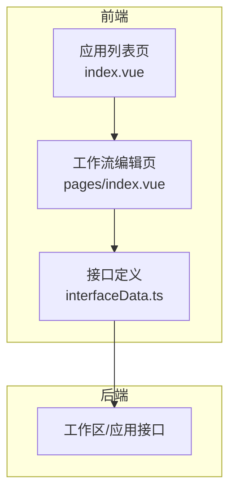
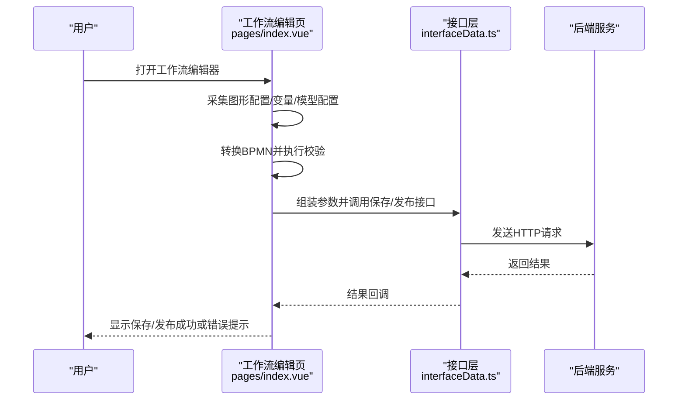
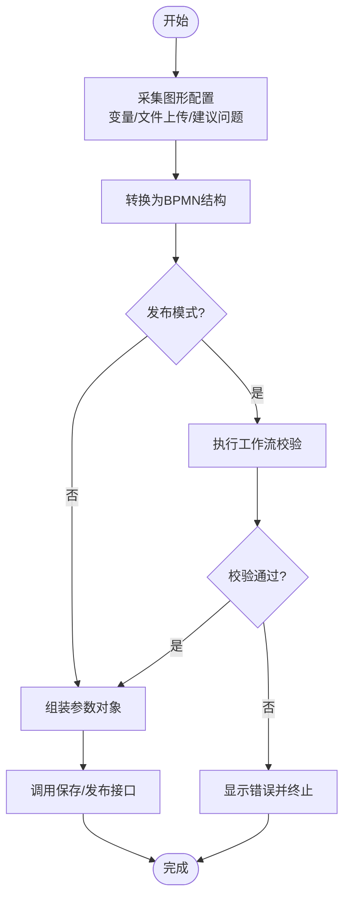
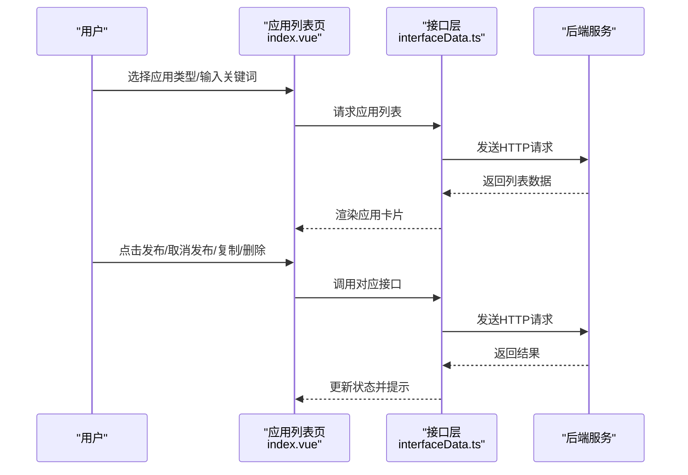
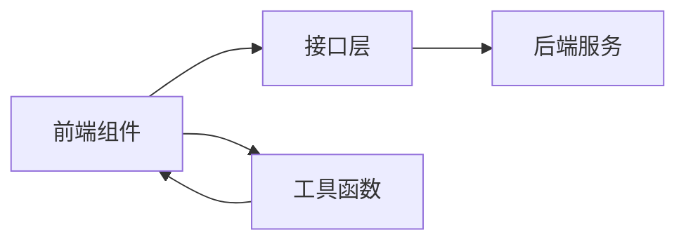

# ComfyUI工作流构建

<cite>
**本文引用的文件**
- [index.vue](file://【3】工作资料/code/仓颉智能体/nlp-frontend-web/src/views/workspace/pages/workApps/pages/index.vue)
- [index.vue](file://【3】工作资料/code/仓颉智能体/nlp-frontend-web/src/views/workspace/pages/workApps/index.vue)
- [interfaceData.ts](file://【3】工作资料/code/仓颉智能体/nlp-frontend-web/src/views/workspace/interfaceData.ts)
- [index.vue](file://【3】工作资料/code/仓颉智能体/nlp-frontend-web/src/views/workspace/index.vue)
</cite>

## 目录
1. [引言](#引言)
2. [项目结构](#项目结构)
3. [核心组件](#核心组件)
4. [架构总览](#架构总览)
5. [详细组件分析](#详细组件分析)
6. [依赖分析](#依赖分析)
7. [性能考虑](#性能考虑)
8. [故障排除指南](#故障排除指南)
9. [结论](#结论)
10. [附录](#附录)

## 引言
本指南面向希望在ComfyUI生态中构建高效AI应用工作流的工程师与设计师。通过对仓库中的工作流可视化与管理界面进行深入分析，结合Spring AI Alibaba的文本到图像能力，系统讲解从界面布局、节点系统到工作流设计理念的实践方法。内容覆盖基础节点连接、复杂AI处理流程（图像生成、文本处理、多模态任务）、参数配置、性能优化与调试技巧，并提供可操作的步骤与可视化图示，帮助读者快速上手并构建稳定高效的AI应用。

## 项目结构
该仓库以“工作空间/应用”为核心组织方式，前端通过Vue组件管理应用列表、工作流编辑器与发布流程；后端接口负责工作流配置的持久化与发布。与ComfyUI直接相关的部分体现在工作流编辑器页面对图形化配置的采集与转换，以及与后端接口的数据交互。

**图表来源**
- [index.vue:111-467](file://【3】工作资料/code/仓颉智能体/nlp-frontend-web/src/views/workspace/pages/workApps/index.vue#L111-L467)
- [index.vue:1-37](file://【3】工作资料/code/仓颉智能体/nlp-frontend-web/src/views/workspace/pages/workApps/pages/index.vue#L1-L37)
- [interfaceData.ts:1-135](file://【3】工作资料/code/仓颉智能体/nlp-frontend-web/src/views/workspace/interfaceData.ts#L1-L135)

**章节来源**
- [index.vue:111-467](file://【3】工作资料/code/仓颉智能体/nlp-frontend-web/src/views/workspace/pages/workApps/index.vue#L111-L467)
- [index.vue:1-37](file://【3】工作资料/code/仓颉智能体/nlp-frontend-web/src/views/workspace/pages/workApps/pages/index.vue#L1-L37)
- [interfaceData.ts:1-135](file://【3】工作资料/code/仓颉智能体/nlp-frontend-web/src/views/workspace/interfaceData.ts#L1-L135)

## 核心组件
- 应用列表与导航：提供应用分类（知识问答、智能问数、对话流、工作流、智能体等），支持搜索、分页与批量操作。
- 工作流编辑器：提供图形化节点编辑、变量配置、模型配置、BPMN转换与保存/发布流程。
- 接口层：封装工作区与应用的增删改查、发布/取消发布、复制等REST接口。
- 工作流工具集成：支持将工作流发布为插件或工具，便于复用与分发。

**章节来源**
- [index.vue:169-177](file://【3】工作资料/code/仓颉智能体/nlp-frontend-web/src/views/workspace/pages/workApps/index.vue#L169-L177)
- [index.vue:226-252](file://【3】工作资料/code/仓颉智能体/nlp-frontend-web/src/views/workspace/pages/workApps/pages/index.vue#L226-L252)
- [interfaceData.ts:1-135](file://【3】工作资料/code/仓颉智能体/nlp-frontend-web/src/views/workspace/interfaceData.ts#L1-L135)

## 架构总览
下图展示了从前端工作流编辑器到后端接口的整体交互流程，包括配置采集、BPMN转换、校验与保存/发布的关键步骤。

**图表来源**
- [index.vue:226-323](file://【3】工作资料/code/仓颉智能体/nlp-frontend-web/src/views/workspace/pages/workApps/pages/index.vue#L226-L323)
- [interfaceData.ts:25-135](file://【3】工作资料/code/仓颉智能体/nlp-frontend-web/src/views/workspace/interfaceData.ts#L25-L135)

## 详细组件分析

### 组件A：工作流编辑器（图形化配置采集与保存）
- 功能要点
  - 图形配置采集：从逻辑流实例中获取原始与图形数据，抽取变量、文件上传、建议问题等配置。
  - BPMN转换：将图形数据转换为BPMN结构，便于跨系统流转与执行。
  - 校验与发布：在发布模式下执行工作流校验，确保配置正确性。
  - 参数组装：将采集到的配置序列化为后端所需的参数对象。
- 关键流程
  - 获取图形数据与属性配置
  - 转换BPMN并执行校验
  - 组装参数并调用保存/发布接口
  - 成功/失败提示与状态更新

**图表来源**
- [index.vue:226-323](file://【3】工作资料/code/仓颉智能体/nlp-frontend-web/src/views/workspace/pages/workApps/pages/index.vue#L226-L323)

**章节来源**
- [index.vue:226-323](file://【3】工作资料/code/仓颉智能体/nlp-frontend-web/src/views/workspace/pages/workApps/pages/index.vue#L226-L323)

### 组件B：应用列表与操作（分类、搜索、发布/取消发布、复制）
- 功能要点
  - 分类筛选：按应用类型（知识问答、智能问数、对话流、工作流、智能体）筛选。
  - 搜索与分页：支持关键词搜索与分页加载。
  - 批量操作：支持发布/取消发布、复制、删除等操作。
- 关键流程
  - 初始化路由参数与面包屑
  - 加载应用列表并渲染卡片
  - 根据操作类型调用对应接口

**图表来源**
- [index.vue:111-467](file://【3】工作资料/code/仓颉智能体/nlp-frontend-web/src/views/workspace/pages/workApps/index.vue#L111-L467)
- [interfaceData.ts:25-135](file://【3】工作资料/code/仓颉智能体/nlp-frontend-web/src/views/workspace/interfaceData.ts#L25-L135)

**章节来源**
- [index.vue:111-467](file://【3】工作资料/code/仓颉智能体/nlp-frontend-web/src/views/workspace/pages/workApps/index.vue#L111-L467)
- [interfaceData.ts:1-135](file://【3】工作资料/code/仓颉智能体/nlp-frontend-web/src/views/workspace/interfaceData.ts#L1-L135)

### 组件C：工作区入口与页面布局
- 功能要点
  - 工作区卡片与网格布局
  - 页面级布局组件与面包屑导航
  - 创建/导入/添加用户等基础操作
- 关键流程
  - 加载工作区列表
  - 渲染卡片并支持创建新工作区
  - 导入应用配置与批量添加用户

**章节来源**
- [index.vue:71-121](file://【3】工作资料/code/仓颉智能体/nlp-frontend-web/src/views/workspace/index.vue#L71-L121)

## 依赖分析
- 前端依赖
  - Vue生态：Composition API、路由与状态管理
  - UI组件库：YD Design及其Pro扩展
  - 工具函数：防抖、节流、下载工具等
- 后端接口依赖
  - 工作区与应用的REST接口
  - 发布/取消发布、复制、删除等操作接口
- 数据流依赖
  - 图形配置 → BPMN转换 → 校验 → 保存/发布
  - 应用列表 → 卡片渲染 → 操作调用 → 接口响应

**图表来源**
- [index.vue:112-128](file://【3】工作资料/code/仓颉智能体/nlp-frontend-web/src/views/workspace/pages/workApps/pages/index.vue#L112-L128)
- [interfaceData.ts:1-135](file://【3】工作资料/code/仓颉智能体/nlp-frontend-web/src/views/workspace/interfaceData.ts#L1-L135)

**章节来源**
- [index.vue:112-128](file://【3】工作资料/code/仓颉智能体/nlp-frontend-web/src/views/workspace/pages/workApps/pages/index.vue#L112-L128)
- [interfaceData.ts:1-135](file://【3】工作资料/code/仓颉智能体/nlp-frontend-web/src/views/workspace/interfaceData.ts#L1-L135)

## 性能考虑
- 配置采集与序列化
  - 在保存前仅采集必要字段，避免冗余数据传输。
  - 对大JSON进行延迟序列化，减少主线程阻塞。
- BPMN转换
  - 将转换过程异步化，避免阻塞UI线程。
  - 对重复转换进行缓存，提升二次保存/发布的速度。
- 列表渲染
  - 使用虚拟滚动与分页，降低DOM压力。
  - 对搜索与筛选进行防抖，减少频繁请求。
- 接口调用
  - 合理设置超时与重试策略，避免长时间无响应。
  - 对批量操作采用并发限制，防止接口过载。

## 故障排除指南
- 保存/发布失败
  - 检查工作流校验是否通过（发布模式下会执行校验）。
  - 确认必要字段（如数据源、拒绝回答提示语等）已配置。
  - 查看接口返回的错误信息并根据提示修正配置。
- 应用列表加载异常
  - 检查网络请求状态与路由参数。
  - 清除缓存并重新加载，确认接口可用性。
- BPMN转换异常
  - 确认图形数据完整性与节点连接正确。
  - 检查转换逻辑是否被正确调用与捕获异常。

**章节来源**
- [index.vue:312-323](file://【3】工作资料/code/仓颉智能体/nlp-frontend-web/src/views/workspace/pages/workApps/pages/index.vue#L312-L323)
- [index.vue:360-391](file://【3】工作资料/code/仓颉智能体/nlp-frontend-web/src/views/workspace/pages/workApps/index.vue#L360-L391)

## 结论
通过将ComfyUI的图形化工作流与本仓库的前端编辑器、接口层与后端服务打通，可以实现从节点连接到复杂AI处理流程的高效构建。遵循本文提供的节点选择、参数配置、性能优化与调试技巧，能够帮助团队快速搭建稳定、可复用且易于维护的AI应用工作流。

## 附录
- 实践建议
  - 优先使用图形化编辑器进行节点连接与参数配置，减少手工编写成本。
  - 将常用流程封装为插件或工具，提升复用效率。
  - 在发布前进行充分的校验与测试，确保流程稳定性。
- 参考路径
  - [工作流编辑器主流程:226-323](file://【3】工作资料/code/仓颉智能体/nlp-frontend-web/src/views/workspace/pages/workApps/pages/index.vue#L226-L323)
  - [应用列表与操作:111-467](file://【3】工作资料/code/仓颉智能体/nlp-frontend-web/src/views/workspace/pages/workApps/index.vue#L111-L467)
  - [接口定义与调用:1-135](file://【3】工作资料/code/仓颉智能体/nlp-frontend-web/src/views/workspace/interfaceData.ts#L1-L135)