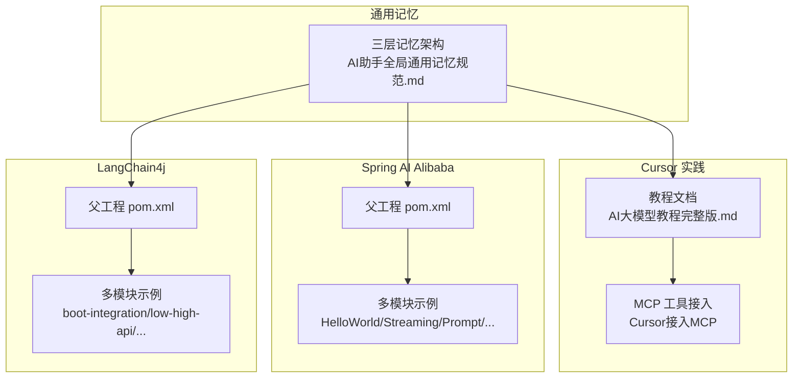
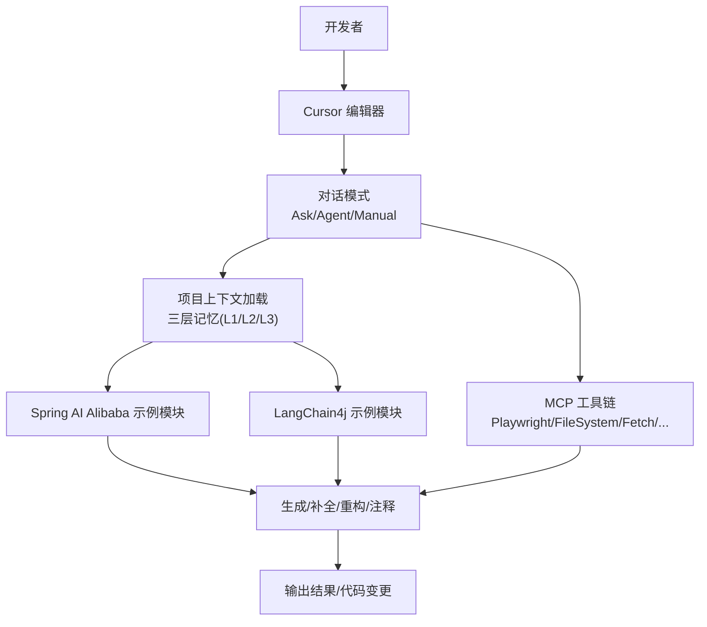
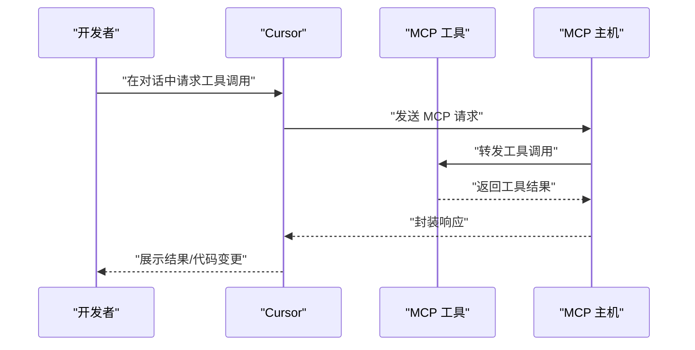
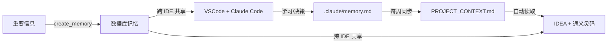
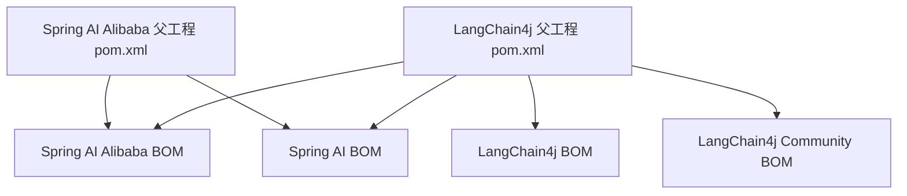

# Cursor智能代码助手

<cite>
**本文引用的文件**
- [AI大模型教程完整版.md](file://【0】AI大模型教程（指导手册）\AI大模型教程完整版.md)
- [AI助手全局通用记忆规范.md](file://8、AI助手全局通用记忆规范.md)
- [SpringAIAlibaba-atguiguV1 父工程 pom.xml](file://【1】SpringAIAlibaba-atguiguV1\pom.xml)
- [langchain4j-atguiguV5 父工程 pom.xml](file://【2】langchain4j-atguiguV5\pom.xml)
- [SAA-01HelloWorld 应用入口类](file://【1】SpringAIAlibaba-atguiguV1\SAA-01HelloWorld\src\main\java\com\atguigu\study\Saa01HelloWorldApplication.java)
- [ChatHelloController 控制器](file://【1】SpringAIAlibaba-atguiguV1\SAA-01HelloWorld\src\main\java\com\atguigu\study\controller\ChatHelloController.java)
- [BootIntegrationLangChain4JApp 应用入口类](file://【2】langchain4j-atguiguV5\langchain4j-03boot-integration\src\main\java\com\atguigu\study\BootIntegrationLangChain4JApp.java)
- [langchain4j-03 模块 application.properties](file://【2】langchain4j-atguiguV5\langchain4j-03boot-integration\src\main\resources\application.properties)
- [SAA-03ChatModelChatClient 应用入口类](file://【1】SpringAIAlibaba-atguiguV1\SAA-03ChatModelChatClient\src\main\java\com\atguigu\study\Saa03ChatModelChatClientApplication.java)
- [SAA-03ChatModelChatClient 控制器](file://【1】SpringAIAlibaba-atguiguV1\SAA-03ChatModelChatClient\src\main\java\com\atguigu\study\controller\ChatHelloController.java)
- [SAA-04StreamingOutput 应用入口类](file://【1】SpringAIAlibaba-atguiguV1\SAA-04StreamingOutput\src\main\java\com\atguigu\study\Saa04StreamingOutputApplication.java)
- [SAA-05Prompt 应用入口类](file://【1】SpringAIAlibaba-atguiguV1\SAA-05Prompt\src\main\java\com\atguigu\study\Saa05PromptApplication.java)
- [SAA-06PromptTemplate 应用入口类](file://【1】SpringAIAlibaba-atguiguV1\SAA-06PromptTemplate\src\main\java\com\atguigu\study\Saa06PromptTemplateApplication.java)
- [SAA-07StructuredOutput 应用入口类](file://【1】SpringAIAlibaba-atguiguV1\SAA-07StructuredOutput\src\main\java\com\atguigu\study\Saa07StructuredOutputApplication.java)
- [SAA-08Persistent 应用入口类](file://【1】SpringAIAlibaba-atguiguV1\SAA-08Persistent\src\main\java\com\atguigu\study\Saa08PersistentApplication.java)
- [SAA-09Text2image 应用入口类](file://【1】SpringAIAlibaba-atguiguV1\SAA-09Text2image\src\main\java\com\atguigu\study\Saa09Text2imageApplication.java)
- [SAA-10Text2voice 应用入口类](file://【1】SpringAIAlibaba-atguiguV1\SAA-10Text2voice\src\main\java\com\atguigu\study\Saa10Text2voiceApplication.java)
- [SAA-11Embed2vector 应用入口类](file://【1】SpringAIAlibaba-atguiguV1\SAA-11Embed2vector\src\main\java\com\atguigu\study\Saa11Embed2vectorApplication.java)
- [SAA-12RAG4AiOps 应用入口类](file://【1】SpringAIAlibaba-atguiguV1\SAA-12RAG4AiOps\src\main\java\com\atguigu\study\Saa12Rag4AiOpsApplication.java)
- [SAA-13ToolCalling 应用入口类](file://【1】SpringAIAlibaba-atguiguV1\SAA-13ToolCalling\src\main\java\com\atguigu\study\Saa13ToolCallingApplication.java)
- [SAA-14LocalMcpServer 应用入口类](file://【1】SpringAIAlibaba-atguiguV1\SAA-14LocalMcpServer\src\main\java\com\atguigu\study\Saa14LocalMcpServerApplication.java)
- [SAA-15LocalMcpClient 应用入口类](file://【1】SpringAIAlibaba-atguiguV1\SAA-15LocalMcpClient\src\main\java\com\atguigu\study\Saa15LocalMcpClientApplication.java)
- [SAA-16ClientCallBaiduMcpServer 应用入口类](file://【1】SpringAIAlibaba-atguiguV1\SAA-16ClientCallBaiduMcpServer\src\main\java\com\atguigu\study\Saa16ClientCallBaiduMcpServerApplication.java)
- [SAA-17BailianRAG 应用入口类](file://【1】SpringAIAlibaba-atguiguV1\SAA-17BailianRAG\src\main\java\com\atguigu\study\Saa17BailianRagApplication.java)
- [langchain4j-01helloworld 应用入口类](file://【2】langchain4j-atguiguV5\langchain4j-01helloworld\src\main\java\com\atguigu\study\HelloLangChain4JApp.java)
- [langchain4j-02multi-model-together 应用入口类](file://【2】langchain4j-atguiguV5\langchain4j-02multi-model-together\src\main\java\com\atguigu\study\MultiModelLangChain4JApp.java)
- [langchain4j-04low-high-api 应用入口类](file://【2】langchain4j-atguiguV5\langchain4j-04low-high-api\src\main\java\com\atguigu\study\LowHighApiLangChain4JApp.java)
- [langchain4j-05model-parameters 应用入口类](file://【2】langchain4j-atguiguV5\langchain4j-05model-parameters\src\main\java\com\atguigu\study\ModelParametersLangChain4JApp.java)
- [langchain4j-06chat-image 应用入口类](file://【2】langchain4j-atguiguV5\langchain4j-06chat-image\src\main\java\com\atguigu\study\ChatImageModelLangChain4JApp.java)
- [langchain4j-07chat-stream 应用入口类](file://【2】langchain4j-atguiguV5\langchain4j-07chat-stream\src\main\java\com\atguigu\study\ChatStreamLangChain4JApp.java)
- [langchain4j-08chat-memory 应用入口类](file://【2】langchain4j-atguiguV5\langchain4j-08chat-memory\src\main\java\com\atguigu\study\ChatMemoryLangChain4JApp.java)
- [langchain4j-09chat-prompt 应用入口类](file://【2】langchain4j-atguiguV5\langchain4j-09chat-prompt\src\main\java\com\atguigu\study\ChatPromptLangChain4JApp.java)
- [langchain4j-10chat-persistence 应用入口类](file://【2】langchain4j-atguiguV5\langchain4j-10chat-persistence\src\main\java\com\atguigu\study\ChatPersistenceLangChain4JApp.java)
- [langchain4j-11chat-functioncalling 应用入口类](file://【2】langchain4j-atguiguV5\langchain4j-11chat-functioncalling\src\main\java\com\atguigu\study\ChatFunctioncallingLangChain4JApp.java)
- [langchain4j-12chat-embedding 应用入口类](file://【2】langchain4j-atguiguV5\langchain4j-12chat-embedding\src\main\java\com\atguigu\study\ChatEmbeddingLangChain4JApp.java)
- [langchain4j-13chat-rag01 应用入口类](file://【2】langchain4j-atguiguV5\langchain4j-13chat-rag01\src\main\java\com\atguigu\study\ChatRag01App.java)
- [langchain4j-14chat-mcp 应用入口类](file://【2】langchain4j-atguiguV5\langchain4j-14chat-mcp\src\main\java\com\atguigu\study\ChatMcpApp.java)
- [nlp-frontend-web 接口定义](file://【3】工作资料\code\仓颉智能体\nlp-frontend-web\src\views\workspace\interfaceData.ts)
- [nlp-frontend-web 页面组件](file://【3】工作资料\code\仓颉智能体\nlp-frontend-web\src\views\workspace\pages\workApps\pages\index.vue)
- [nlp-frontend-web 工作区页面](file://【3】工作资料\code\仓颉智能体\nlp-frontend-web\src\views\workspace\index.vue)
</cite>

## 目录
1. [引言](#引言)
2. [项目结构](#项目结构)
3. [核心组件](#核心组件)
4. [架构总览](#架构总览)
5. [详细组件分析](#详细组件分析)
6. [依赖分析](#依赖分析)
7. [性能考虑](#性能考虑)
8. [故障排除指南](#故障排除指南)
9. [结论](#结论)
10. [附录](#附录)

## 引言
本指南面向希望使用 Cursor 智能代码助手加速 AI 应用开发的工程师，结合仓库内的 Spring AI Alibaba 与 LangChain4j 实践案例，系统讲解 Cursor 的核心能力（代码生成、代码补全、代码重构、注释生成）、工作原理、配置选项、快捷键与自定义设置，并提供与 MCP（Model Context Protocol）集成的实操路径，帮助你在真实项目中显著提升开发效率。

## 项目结构
本仓库围绕三大主题组织：
- Cursor 使用与 MCP 集成实践：通过教程文档与 MCP 工具接入示例，指导如何在 Cursor 中扩展外部工具链。
- Spring AI Alibaba 实战：以 Maven 多模块形式覆盖从 Hello World 到 RAG、工具调用、MCP 客户端/服务端的完整路径。
- LangChain4j 实战：涵盖多模型、流式输出、记忆、提示工程、函数调用、嵌入、RAG、MCP 等典型场景。
- 通用记忆与跨 IDE 同步：提供三层记忆架构，确保 VSCode/Claude Code 与 IDEA/通义灵码之间的上下文一致。

**章节来源**
- [AI大模型教程完整版.md: 2188-2292:2188-2292](file://【0】AI大模型教程（指导手册）\AI大模型教程完整版.md#L2188-L2292)
- [AI助手全局通用记忆规范.md: 15-42:15-42](file://8、AI助手全局通用记忆规范.md#L15-L42)
- [SpringAIAlibaba-atguiguV1 父工程 pom.xml: 1-103:1-103](file://【1】SpringAIAlibaba-atguiguV1\pom.xml#L1-L103)
- [langchain4j-atguiguV5 父工程 pom.xml: 1-201:1-201](file://【2】langchain4j-atguiguV5\pom.xml#L1-L201)

## 核心组件
- Cursor 编辑器与对话模式
  - Ask 模式：只读探索，适合理解代码库。
  - Agent 模式：具备工具访问权限，可自主探索、运行命令、编辑文件，适合复杂任务与重构。
  - Manual 模式：手动控制修改，适合精确控制的场景。
- 自动补全与快捷键
  - Tab：自动填充代码
  - Ctrl+K：针对选中代码片段进行指令式编辑
  - Ctrl+L：对单文件或整个项目进行操作
  - Ctrl+I：跨文件编辑项目
  - 快捷键 `Ctrl + .`（Windows/Linux）或 `⌘.`（Mac）：快速开启 Agent 模式
- MCP 工具链集成
  - Cursor 支持通过 MCP 协议接入外部工具（如 Playwright、FileSystem、Fetch、Sequential Thinking 等），实现网页自动化、文件系统访问、HTTP 抓取、结构化思维等能力。
- 三层通用记忆
  - L1 通用记忆：所有 AI 助手共享的核心信息（如项目上下文、快速启动模板）
  - L2 工具专用：Claude Code 的记忆与配置
  - L3 项目专用：IDEA 项目级的自定义指令

**章节来源**
- [AI大模型教程完整版.md: 2235-2292:2235-2292](file://【0】AI大模型教程（指导手册）\AI大模型教程完整版.md#L2235-L2292)
- [AI大模型教程完整版.md: 4133-4319:4133-4319](file://【0】AI大模型教程（指导手册）\AI大模型教程完整版.md#L4133-L4319)
- [AI助手全局通用记忆规范.md: 15-42:15-42](file://8、AI助手全局通用记忆规范.md#L15-L42)

## 架构总览
下图展示了 Cursor 在 AI 应用开发中的典型工作流：从项目上下文加载、Agent 模式任务编排、到与 Spring AI Alibaba/LangChain4j 项目交互，再到 MCP 工具链的扩展。

**图示来源**
- [AI助手全局通用记忆规范.md: 15-42:15-42](file://8、AI助手全局通用记忆规范.md#L15-L42)
- [AI大模型教程完整版.md: 2284-2292:2284-2292](file://【0】AI大模型教程（指导手册）\AI大模型教程完整版.md#L2284-L2292)
- [AI大模型教程完整版.md: 4133-4319:4133-4319](file://【0】AI大模型教程（指导手册）\AI大模型教程完整版.md#L4133-L4319)

## 详细组件分析

### 组件 A：Spring AI Alibaba 多模块实战
- 模块概览
  - SAA-01HelloWorld：入门示例，验证 ChatModel 与 ChatClient 基本能力
  - SAA-02Ollama：本地推理引擎对接
  - SAA-03ChatModelChatClient：ChatModel 与 ChatClient 的集成
  - SAA-04StreamingOutput：流式输出体验
  - SAA-05Prompt：提示词工程实践
  - SAA-06PromptTemplate：模板化提示词
  - SAA-07StructuredOutput：结构化输出
  - SAA-08Persistent：持久化
  - SAA-09Text2image：文生图
  - SAA-10Text2voice：文生语音
  - SAA-11Embed2vector：向量化
  - SAA-12RAG4AiOps：面向运维的 RAG
  - SAA-13ToolCalling：工具调用
  - SAA-14LocalMcpServer：本地 MCP 服务端
  - SAA-15LocalMcpClient：本地 MCP 客户端
  - SAA-16ClientCallBaiduMcpServer：客户端调用百炼 MCP 服务
  - SAA-17BailianRAG：百炼平台 RAG
- Cursor 在其中的应用
  - 使用 Agent 模式对模块进行重构与结构化输出生成
  - 通过 Ask 模式理解模块职责与依赖关系
  - 使用 Manual 模式对特定控制器或配置进行精确修改
  - 结合三层记忆，确保上下文一致，减少重复说明

```mermaid
graph TB
subgraph "Spring AI Alibaba 模块"
H1["SAA-01HelloWorld"]
H2["SAA-03ChatModelChatClient"]
H3["SAA-04StreamingOutput"]
H4["SAA-05Prompt"]
H5["SAA-06PromptTemplate"]
H6["SAA-07StructuredOutput"]
H7["SAA-08Persistent"]
H8["SAA-09Text2image"]
H9["SAA-10Text2voice"]
H10["SAA-11Embed2vector"]
H11["SAA-12RAG4AiOps"]
H12["SAA-13ToolCalling"]
H13["SAA-14LocalMcpServer"]
H14["SAA-15LocalMcpClient"]
H15["SAA-16ClientCallBaiduMcpServer"]
H16["SAA-17BailianRAG"]
end
H1 -.-> C["Cursor"]
H2 -.-> C
H3 -.-> C
H4 -.-> C
H5 -.-> C
H6 -.-> C
H7 -.-> C
H8 -.-> C
H9 -.-> C
H10 -.-> C
H11 -.-> C
H12 -.-> C
H13 -.-> C
H14 -.-> C
H15 -.-> C
H16 -.-> C
```

**图示来源**
- [SpringAIAlibaba-atguiguV1 父工程 pom.xml: 13-31:13-31](file://【1】SpringAIAlibaba-atguiguV1\pom.xml#L13-L31)

**章节来源**
- [SpringAIAlibaba-atguiguV1 父工程 pom.xml: 13-31:13-31](file://【1】SpringAIAlibaba-atguiguV1\pom.xml#L13-L31)
- [SAA-01HelloWorld 应用入口类](file://【1】SpringAIAlibaba-atguiguV1\SAA-01HelloWorld\src\main\java\com\atguigu\study\Saa01HelloWorldApplication.java)
- [SAA-03ChatModelChatClient 应用入口类](file://【1】SpringAIAlibaba-atguiguV1\SAA-03ChatModelChatClient\src\main\java\com\atguigu\study\Saa03ChatModelChatClientApplication.java)
- [SAA-04StreamingOutput 应用入口类](file://【1】SpringAIAlibaba-atguiguV1\SAA-04StreamingOutput\src\main\java\com\atguigu\study\Saa04StreamingOutputApplication.java)
- [SAA-05Prompt 应用入口类](file://【1】SpringAIAlibaba-atguiguV1\SAA-05Prompt\src\main\java\com\atguigu\study\Saa05PromptApplication.java)
- [SAA-06PromptTemplate 应用入口类](file://【1】SpringAIAlibaba-atguiguV1\SAA-06PromptTemplate\src\main\java\com\atguigu\study\Saa06PromptTemplateApplication.java)
- [SAA-07StructuredOutput 应用入口类](file://【1】SpringAIAlibaba-atguiguV1\SAA-07StructuredOutput\src\main\java\com\atguigu\study\Saa07StructuredOutputApplication.java)
- [SAA-08Persistent 应用入口类](file://【1】SpringAIAlibaba-atguiguV1\SAA-08Persistent\src\main\java\com\atguigu\study\Saa08PersistentApplication.java)
- [SAA-09Text2image 应用入口类](file://【1】SpringAIAlibaba-atguiguV1\SAA-09Text2image\src\main\java\com\atguigu\study\Saa09Text2imageApplication.java)
- [SAA-10Text2voice 应用入口类](file://【1】SpringAIAlibaba-atguiguV1\SAA-10Text2voice\src\main\java\com\atguigu\study\Saa10Text2voiceApplication.java)
- [SAA-11Embed2vector 应用入口类](file://【1】SpringAIAlibaba-atguiguV1\SAA-11Embed2vector\src\main\java\com\atguigu\study\Saa11Embed2vectorApplication.java)
- [SAA-12RAG4AiOps 应用入口类](file://【1】SpringAIAlibaba-atguiguV1\SAA-12RAG4AiOps\src\main\java\com\atguigu\study\Saa12Rag4AiOpsApplication.java)
- [SAA-13ToolCalling 应用入口类](file://【1】SpringAIAlibaba-atguiguV1\SAA-13ToolCalling\src\main\java\com\atguigu\study\Saa13ToolCallingApplication.java)
- [SAA-14LocalMcpServer 应用入口类](file://【1】SpringAIAlibaba-atguiguV1\SAA-14LocalMcpServer\src\main\java\com\atguigu\study\Saa14LocalMcpServerApplication.java)
- [SAA-15LocalMcpClient 应用入口类](file://【1】SpringAIAlibaba-atguiguV1\SAA-15LocalMcpClient\src\main\java\com\atguigu\study\Saa15LocalMcpClientApplication.java)
- [SAA-16ClientCallBaiduMcpServer 应用入口类](file://【1】SpringAIAlibaba-atguiguV1\SAA-16ClientCallBaiduMcpServer\src\main\java\com\atguigu\study\Saa16ClientCallBaiduMcpServerApplication.java)
- [SAA-17BailianRAG 应用入口类](file://【1】SpringAIAlibaba-atguiguV1\SAA-17BailianRAG\src\main\java\com\atguigu\study\Saa17BailianRagApplication.java)

### 组件 B：LangChain4j 多模块实战
- 模块概览
  - langchain4j-01helloworld：基础集成
  - langchain4j-02multi-model-together：多模型集成
  - langchain4j-03boot-integration：Spring Boot 集成
  - langchain4j-04low-high-api：低/高层 API 使用
  - langchain4j-05model-parameters：模型参数调优
  - langchain4j-06chat-image：图像对话
  - langchain4j-07chat-stream：流式对话
  - langchain4j-08chat-memory：记忆
  - langchain4j-09chat-prompt：提示词
  - langchain4j-10chat-persistence：持久化
  - langchain4j-11chat-functioncalling：函数调用
  - langchain4j-12chat-embedding：嵌入
  - langchain4j-13chat-rag01：RAG
  - langchain4j-14chat-mcp：MCP 集成
- Cursor 在其中的应用
  - 使用 Ask 模式理解模块职责
  - 使用 Agent 模式进行代码生成与重构
  - 使用 Manual 模式对提示词与函数调用进行精确调整

```mermaid
graph TB
subgraph "LangChain4j 模块"
L1["langchain4j-01helloworld"]
L2["langchain4j-02multi-model-together"]
L3["langchain4j-03boot-integration"]
L4["langchain4j-04low-high-api"]
L5["langchain4j-05model-parameters"]
L6["langchain4j-06chat-image"]
L7["langchain4j-07chat-stream"]
L8["langchain4j-08chat-memory"]
L9["langchain4j-09chat-prompt"]
L10["langchain4j-10chat-persistence"]
L11["langchain4j-11chat-functioncalling"]
L12["langchain4j-12chat-embedding"]
L13["langchain4j-13chat-rag01"]
L14["langchain4j-14chat-mcp"]
end
L1 -.-> C["Cursor"]
L2 -.-> C
L3 -.-> C
L4 -.-> C
L5 -.-> C
L6 -.-> C
L7 -.-> C
L8 -.-> C
L9 -.-> C
L10 -.-> C
L11 -.-> C
L12 -.-> C
L13 -.-> C
L14 -.-> C
```

**图示来源**
- [langchain4j-atguiguV5 父工程 pom.xml: 13-28:13-28](file://【2】langchain4j-atguiguV5\pom.xml#L13-L28)

**章节来源**
- [langchain4j-atguiguV5 父工程 pom.xml: 13-28:13-28](file://【2】langchain4j-atguiguV5\pom.xml#L13-L28)
- [langchain4j-03boot-integration 应用入口类](file://【2】langchain4j-atguiguV5\langchain4j-03boot-integration\src\main\java\com\atguigu\study\BootIntegrationLangChain4JApp.java)
- [langchain4j-03 模块 application.properties](file://【2】langchain4j-atguiguV5\langchain4j-03boot-integration\src\main\resources\application.properties)
- [langchain4j-01helloworld 应用入口类](file://【2】langchain4j-atguiguV5\langchain4j-01helloworld\src\main\java\com\atguigu\study\HelloLangChain4JApp.java)
- [langchain4j-02multi-model-together 应用入口类](file://【2】langchain4j-atguiguV5\langchain4j-02multi-model-together\src\main\java\com\atguigu\study\MultiModelLangChain4JApp.java)
- [langchain4j-04low-high-api 应用入口类](file://【2】langchain4j-atguiguV5\langchain4j-04low-high-api\src\main\java\com\atguigu\study\LowHighApiLangChain4JApp.java)
- [langchain4j-05model-parameters 应用入口类](file://【2】langchain4j-atguiguV5\langchain4j-05model-parameters\src\main\java\com\atguigu\study\ModelParametersLangChain4JApp.java)
- [langchain4j-06chat-image 应用入口类](file://【2】langchain4j-atguiguV5\langchain4j-06chat-image\src\main\java\com\atguigu\study\ChatImageModelLangChain4JApp.java)
- [langchain4j-07chat-stream 应用入口类](file://【2】langchain4j-atguiguV5\langchain4j-07chat-stream\src\main\java\com\atguigu\study\ChatStreamLangChain4JApp.java)
- [langchain4j-08chat-memory 应用入口类](file://【2】langchain4j-atguiguV5\langchain4j-08chat-memory\src\main\java\com\atguigu\study\ChatMemoryLangChain4JApp.java)
- [langchain4j-09chat-prompt 应用入口类](file://【2】langchain4j-atguiguV5\langchain4j-09chat-prompt\src\main\java\com\atguigu\study\ChatPromptLangChain4JApp.java)
- [langchain4j-10chat-persistence 应用入口类](file://【2】langchain4j-atguiguV5\langchain4j-10chat-persistence\src\main\java\com\atguigu\study\ChatPersistenceLangChain4JApp.java)
- [langchain4j-11chat-functioncalling 应用入口类](file://【2】langchain4j-atguiguV5\langchain4j-11chat-functioncalling\src\main\java\com\atguigu\study\ChatFunctioncallingLangChain4JApp.java)
- [langchain4j-12chat-embedding 应用入口类](file://【2】langchain4j-atguiguV5\langchain4j-12chat-embedding\src\main\java\com\atguigu\study\ChatEmbeddingLangChain4JApp.java)
- [langchain4j-13chat-rag01 应用入口类](file://【2】langchain4j-atguiguV5\langchain4j-13chat-rag01\src\main\java\com\atguigu\study\ChatRag01App.java)
- [langchain4j-14chat-mcp 应用入口类](file://【2】langchain4j-atguiguV5\langchain4j-14chat-mcp\src\main\java\com\atguigu\study\ChatMcpApp.java)

### 组件 C：Cursor 与 MCP 工具链集成
- Cursor 接入 MCP 的步骤
  - 选择平台：Smithery 或 GitHub
  - 安装基础依赖：Node.js、npx、uv 等
  - 添加常用工具：Sequential Thinking、Playwright、FileSystem、Fetch
  - 验证与测试：在 Cursor 中调用工具并进行问答测试
- Cursor 的 MCP 优势
  - 协议标准化：统一 JSON-RPC 2.0 消息格式
  - 即插即用：任何兼容 MCP 的主机（Claude Desktop、Cursor 等）都能使用
  - 安全与控制：远程托管与本地运行可选，满足不同安全需求

**图示来源**
- [AI大模型教程完整版.md: 4133-4319:4133-4319](file://【0】AI大模型教程（指导手册）\AI大模型教程完整版.md#L4133-L4319)

**章节来源**
- [AI大模型教程完整版.md: 4133-4319:4133-4319](file://【0】AI大模型教程（指导手册）\AI大Model教程完整版.md#L4133-L4319)

### 组件 D：三层通用记忆与跨 IDE 同步
- 三层记忆架构
  - L1 通用记忆：所有 AI 助手共享的核心信息（项目上下文、使用指南、快速启动模板）
  - L2 工具专用：Claude Code 的记忆与配置
  - L3 项目专用：IDEA 项目级的自定义指令
- 同步机制
  - 定期更新 PROJECT_CONTEXT.md，实现 VSCode + Claude Code 与 IDEA + 通义灵码之间的上下文一致
  - 使用 create_memory 工具实现数据库级记忆，跨 IDE 共享

**图示来源**
- [AI助手全局通用记忆规范.md: 125-167:125-167](file://8、AI助手全局通用记忆规范.md#L125-L167)

**章节来源**
- [AI助手全局通用记忆规范.md: 15-42:15-42](file://8、AI助手全局通用记忆规范.md#L15-L42)
- [AI助手全局通用记忆规范.md: 125-167:125-167](file://8、AI助手全局通用记忆规范.md#L125-L167)

## 依赖分析
- Spring AI Alibaba 与 LangChain4j 的依赖管理
  - 通过父工程的 dependencyManagement 统一版本，确保模块间依赖一致性
  - Spring Boot、Spring AI、Spring AI Alibaba、LangChain4j 及其社区依赖均在父工程中集中管理
- Cursor 与 MCP 的依赖
  - Cursor 通过 MCP 协议与外部工具交互，无需直接依赖具体工具实现，具备良好的扩展性

**图示来源**
- [SpringAIAlibaba-atguiguV1 父工程 pom.xml: 52-79:52-79](file://【1】SpringAIAlibaba-atguiguV1\pom.xml#L52-L79)
- [langchain4j-atguiguV5 父工程 pom.xml: 53-97:53-97](file://【2】langchain4j-atguiguV5\pom.xml#L53-L97)

**章节来源**
- [SpringAIAlibaba-atguiguV1 父工程 pom.xml: 52-79:52-79](file://【1】SpringAIAlibaba-atguiguV1\pom.xml#L52-L79)
- [langchain4j-atguiguV5 父工程 pom.xml: 53-97:53-97](file://【2】langchain4j-atguiguV5\pom.xml#L53-L97)

## 性能考虑
- 使用 Cursor 的 Agent 模式时，建议：
  - 限制一次性处理的文件数量，避免阻塞
  - 合理划分任务边界，优先处理关键模块（如控制器、配置、工具类）
  - 结合三层记忆，减少重复加载与上下文切换
- 在 Spring AI Alibaba 与 LangChain4j 项目中：
  - 启动本地推理（如 Ollama）时，注意资源占用与并发请求控制
  - 流式输出与函数调用应合理设置超时与重试策略
  - RAG 与嵌入向量检索时，关注索引构建与查询性能

## 故障排除指南
- Cursor 快捷键无效
  - 检查操作系统与 Cursor 的快捷键映射是否冲突
  - 在设置中重新绑定快捷键
- Agent 模式无法启用
  - 确认已升级到专业版或商业版
  - 检查网络与代理设置，确保 MCP 工具可用
- MCP 工具调用失败
  - 验证基础依赖（Node.js、npx、uv）是否正确安装
  - 检查 MCP 配置文件（如 mcp.json）格式与路径
  - 使用最小化示例进行测试，逐步排查
- 记忆同步不一致
  - 确保 PROJECT_CONTEXT.md 按周同步
  - 使用 `/update-memory` 命令更新 Claude 记忆
  - 在 IDEA 中验证 .lingma/instructions.md 是否被正确读取

**章节来源**
- [AI大模型教程完整版.md: 2284-2292:2284-2292](file://【0】AI大模型教程（指导手册）\AI大模型教程完整版.md#L2284-L2292)
- [AI大模型教程完整版.md: 4178-4189:4178-4189](file://【0】AI大模型教程（指导手册）\AI大模型教程完整版.md#L4178-L4189)
- [AI助手全局通用记忆规范.md: 246-262:246-262](file://8、AI助手全局通用记忆规范.md#L246-L262)

## 结论
通过将 Cursor 的智能编程能力与 Spring AI Alibaba、LangChain4j 的实战模块相结合，并借助三层通用记忆与 MCP 工具链，开发者可以在真实项目中实现从理解代码、生成与补全，到重构与注释生成的全流程加速。建议在日常开发中：
- 建立并维护三层记忆，确保上下文一致
- 使用 Cursor 的 Ask/Agent/Manual 三种模式适配不同任务
- 通过 MCP 扩展 Cursor 的工具能力，提升自动化水平
- 在模块化项目中，优先使用 Agent 模式进行结构化输出与工具调用

## 附录
- 实战场景建议
  - 使用 Ask 模式快速理解模块职责与依赖
  - 使用 Agent 模式进行代码生成与重构，结合结构化输出与函数调用
  - 使用 Manual 模式对提示词与配置进行精确调整
- MCP 工具清单
  - Sequential Thinking：结构化思维流程
  - Playwright：网页自动化与抓取
  - FileSystem：本地文件系统访问
  - Fetch：网页内容抓取与 Markdown 转换