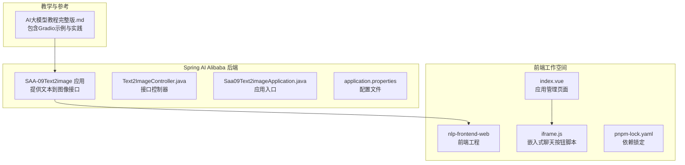
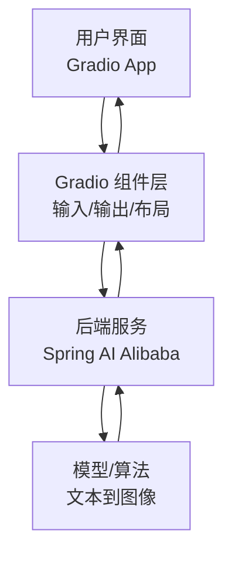
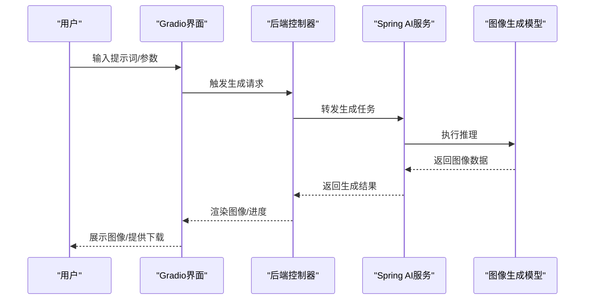
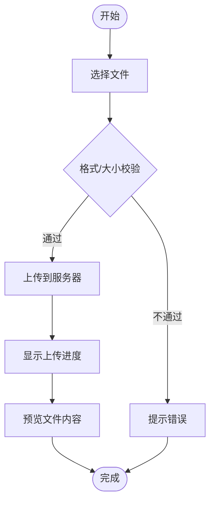
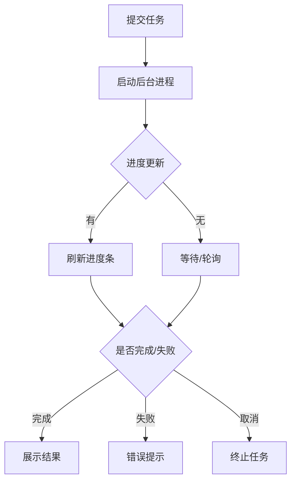
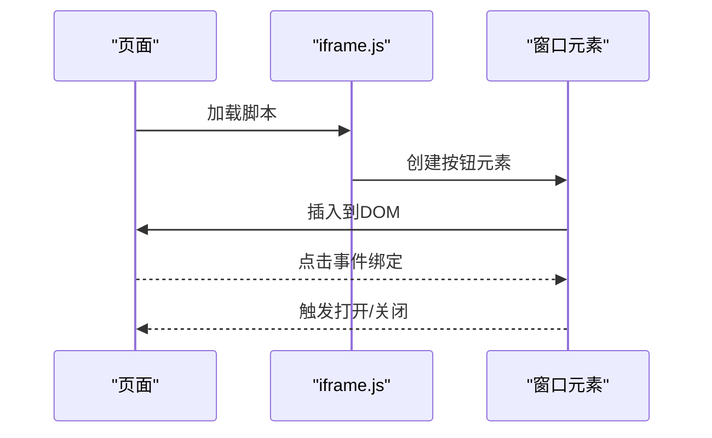
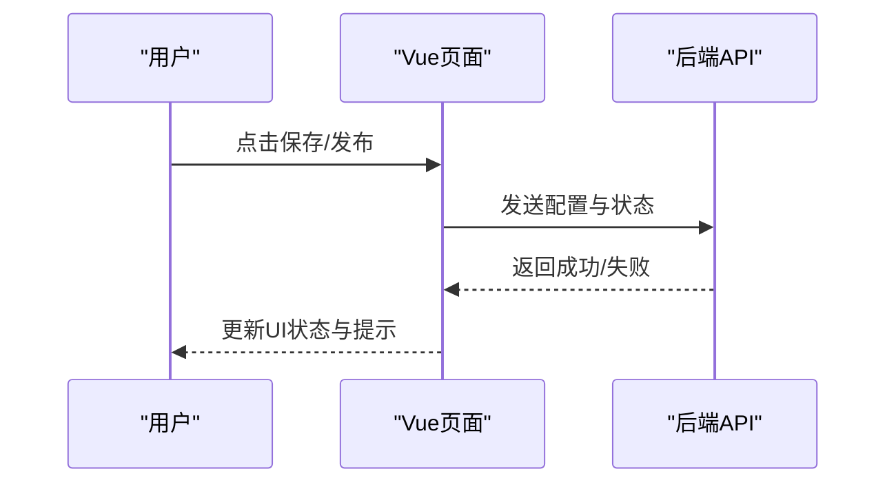
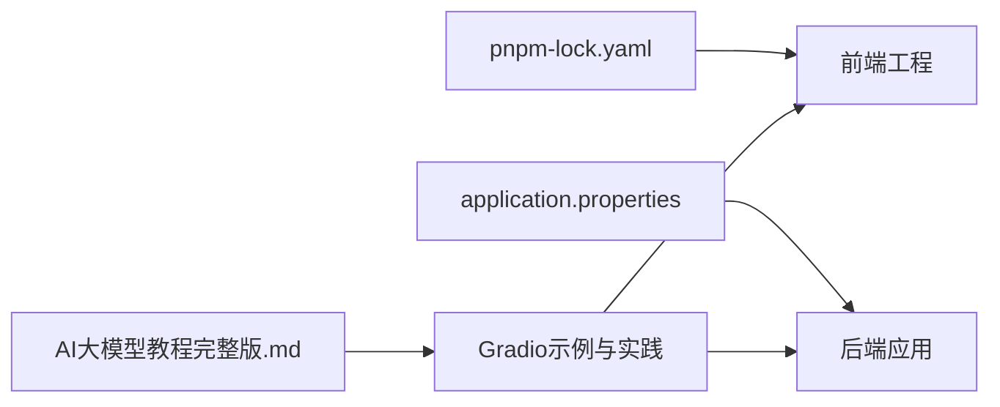

# Gradio界面开发

<cite>
**本文引用的文件**
- [AI大模型教程完整版.md](file://【0】AI大模型教程（指导手册）/AI大模型教程完整版.md)
- [Text2ImageController.java](file://【1】SpringAIAlibaba-atguiguV1/SAA-09Text2image/src/main/java/com/atguigu/study/controller/Text2ImageController.java)
- [Saa09Text2imageApplication.java](file://【1】SpringAIAlibaba-atguiguV1/SAA-09Text2image/src/main/java/com/atguigu/study/Saa09Text2imageApplication.java)
- [application.properties](file://【1】SpringAIAlibaba-atguiguV1/SAA-09Text2image/src/main/resources/application.properties)
- [index.vue](file://【3】工作资料/code/仓颉智能体/nlp-frontend-web/src/views/workspace/pages/workApps/pages/index.vue)
- [index.vue](file://【3】工作资料/code/仓颉智能体/nlp-frontend-web/src/views/workspace/pages/workApps/index.vue)
- [iframe.js](file://【3】工作资料/code/仓颉智能体/nlp-frontend-web/public/iframe.js)
- [pnpm-lock.yaml](file://【3】工作资料/code/仓颉智能体/nlp-frontend-web/pnpm-lock.yaml)
</cite>

## 目录
1. [引言](#引言)
2. [项目结构](#项目结构)
3. [核心组件](#核心组件)
4. [架构总览](#架构总览)
5. [详细组件分析](#详细组件分析)
6. [依赖分析](#依赖分析)
7. [性能考虑](#性能考虑)
8. [故障排查指南](#故障排查指南)
9. [结论](#结论)
10. [附录](#附录)

## 引言
本指南面向希望使用Gradio构建直观易用的AI应用界面的开发者，围绕从基础文本输入到复杂多模态界面（如图像生成、文件上传、进度反馈）进行系统讲解。同时结合Spring AI Alibaba的文本到图像能力，给出可落地的界面设计方案与最佳实践，覆盖样式定制、响应式布局与用户体验优化。

## 项目结构
本仓库包含三类与界面开发密切相关的资源：
- 教学与参考材料：包含大量Gradio示例与AI应用开发要点
- Spring AI Alibaba后端工程：提供文本到图像等AI能力的后端接口
- 前端工作空间：包含应用管理与集成所需的前端页面与脚本

**图表来源**
- [AI大模型教程完整版.md](file://【0】AI大模型教程（指导手册）/AI大模型教程完整版.md)
- [Text2ImageController.java](file://【1】SpringAIAlibaba-atguiguV1/SAA-09Text2image/src/main/java/com/atguigu/study/controller/Text2ImageController.java)
- [Saa09Text2imageApplication.java](file://【1】SpringAIAlibaba-atguiguV1/SAA-09Text2image/src/main/java/com/atguigu/study/Saa09Text2imageApplication.java)
- [application.properties](file://【1】SpringAIAlibaba-atguiguV1/SAA-09Text2image/src/main/resources/application.properties)
- [index.vue](file://【3】工作资料/code/仓颉智能体/nlp-frontend-web/src/views/workspace/pages/workApps/pages/index.vue)
- [iframe.js](file://【3】工作资料/code/仓颉智能体/nlp-frontend-web/public/iframe.js)
- [pnpm-lock.yaml](file://【3】工作资料/code/仓颉智能体/nlp-frontend-web/pnpm-lock.yaml)

**章节来源**
- [AI大模型教程完整版.md](file://【0】AI大模型教程（指导手册）/AI大模型教程完整版.md)
- [Text2ImageController.java](file://【1】SpringAIAlibaba-atguiguV1/SAA-09Text2image/src/main/java/com/atguigu/study/controller/Text2ImageController.java)
- [Saa09Text2imageApplication.java](file://【1】SpringAIAlibaba-atguiguV1/SAA-09Text2image/src/main/java/com/atguigu/study/Saa09Text2imageApplication.java)
- [application.properties](file://【1】SpringAIAlibaba-atguiguV1/SAA-09Text2image/src/main/resources/application.properties)
- [index.vue](file://【3】工作资料/code/仓颉智能体/nlp-frontend-web/src/views/workspace/pages/workApps/pages/index.vue)
- [iframe.js](file://【3】工作资料/code/仓颉智能体/nlp-frontend-web/public/iframe.js)
- [pnpm-lock.yaml](file://【3】工作资料/code/仓颉智能体/nlp-frontend-web/pnpm-lock.yaml)

## 核心组件
- Gradio基础组件与交互模式：文本输入、按钮、滑块、复选框、下拉选择、文件上传、图像显示、视频播放、音频播放、进度条、网格布局、标签页、折叠面板等
- 多模态界面：图像生成（文本到图像）、文件上传与预览、进度反馈与取消、结果下载
- 响应式与样式定制：容器布局、间距与对齐、主题色与字体、暗色模式适配
- 用户体验优化：加载态、错误提示、空状态、键盘快捷键、无障碍访问

**章节来源**
- [AI大模型教程完整版.md](file://【0】AI大模型教程（指导手册）/AI大模型教程完整版.md)

## 架构总览
Gradio前端通过HTTP或WebSocket与后端AI服务通信，后端负责执行AI推理（如文本到图像），并将结果返回给前端展示。前端负责用户交互、状态管理与结果渲染。

[此图为概念性架构示意，无需图表来源]

## 详细组件分析

### 文本到图像界面（基于Spring AI Alibaba）
该场景以“文本到图像”为核心，展示从输入提示词到生成图像的完整流程，包含输入校验、进度反馈、结果展示与下载。

**图表来源**
- [Text2ImageController.java](file://【1】SpringAIAlibaba-atguiguV1/SAA-09Text2image/src/main/java/com/atguigu/study/controller/Text2ImageController.java)
- [Saa09Text2imageApplication.java](file://【1】SpringAIAlibaba-atguiguV1/SAA-09Text2image/src/main/java/com/atguigu/study/Saa09Text2imageApplication.java)
- [application.properties](file://【1】SpringAIAlibaba-atguiguV1/SAA-09Text2image/src/main/resources/application.properties)

**章节来源**
- [Text2ImageController.java](file://【1】SpringAIAlibaba-atguiguV1/SAA-09Text2image/src/main/java/com/atguigu/study/controller/Text2ImageController.java)
- [Saa09Text2imageApplication.java](file://【1】SpringAIAlibaba-atguiguV1/SAA-09Text2image/src/main/java/com/atguigu/study/Saa09Text2imageApplication.java)
- [application.properties](file://【1】SpringAIAlibaba-atguiguV1/SAA-09Text2image/src/main/resources/application.properties)

### 文件上传与预览（多模态界面）
文件上传是多模态应用的常见入口，需支持格式校验、进度反馈与预览。

[此图为通用流程示意，无需图表来源]

### 进度条与取消（长耗时任务）
对于图像生成等长耗时任务，应提供实时进度与取消能力，避免阻塞UI。

[此图为通用流程示意，无需图表来源]

### 嵌入式聊天按钮（前端集成）
前端可通过脚本在任意页面注入一个固定定位的聊天按钮，用于快速唤起应用或会话。

**图表来源**
- [iframe.js](file://【3】工作资料/code/仓颉智能体/nlp-frontend-web/public/iframe.js)

**章节来源**
- [iframe.js](file://【3】工作资料/code/仓颉智能体/nlp-frontend-web/public/iframe.js)

### 应用管理页面（Vue集成）
应用管理页面展示了菜单、操作按钮、保存与发布流程等，体现了前后端协作与状态管理。

**图表来源**
- [index.vue](file://【3】工作资料/code/仓颉智能体/nlp-frontend-web/src/views/workspace/pages/workApps/pages/index.vue)
- [index.vue](file://【3】工作资料/code/仓颉智能体/nlp-frontend-web/src/views/workspace/pages/workApps/index.vue)

**章节来源**
- [index.vue](file://【3】工作资料/code/仓颉智能体/nlp-frontend-web/src/views/workspace/pages/workApps/pages/index.vue)
- [index.vue](file://【3】工作资料/code/仓颉智能体/nlp-frontend-web/src/views/workspace/pages/workApps/index.vue)

## 依赖分析
- 前端依赖：项目使用包管理器锁定依赖，确保构建一致性与可重复性
- 后端依赖：Spring Boot应用通过配置文件管理外部服务地址与参数
- 教学材料：包含丰富的Gradio示例与最佳实践，可作为开发参考

**图表来源**
- [pnpm-lock.yaml](file://【3】工作资料/code/仓颉智能体/nlp-frontend-web/pnpm-lock.yaml)
- [application.properties](file://【1】SpringAIAlibaba-atguiguV1/SAA-09Text2image/src/main/resources/application.properties)
- [AI大模型教程完整版.md](file://【0】AI大模型教程（指导手册）/AI大模型教程完整版.md)

**章节来源**
- [pnpm-lock.yaml](file://【3】工作资料/code/仓颉智能体/nlp-frontend-web/pnpm-lock.yaml)
- [application.properties](file://【1】SpringAIAlibaba-atguiguV1/SAA-09Text2image/src/main/resources/application.properties)
- [AI大模型教程完整版.md](file://【0】AI大模型教程（指导手册）/AI大模型教程完整版.md)

## 性能考虑
- 前端渲染：合理拆分组件，避免不必要的重渲染；使用虚拟滚动处理长列表
- 网络传输：压缩图片与文件，采用分片上传与断点续传；设置合理的超时与重试策略
- 后端处理：异步执行长任务，使用队列与进度回调；限制并发与内存占用
- 缓存策略：对静态资源与中间结果进行缓存，减少重复计算与网络开销

[本节为通用建议，无需章节来源]

## 故障排查指南
- 图像生成失败：检查后端日志与模型可用性，确认提示词与参数合法性
- 文件上传异常：验证文件类型与大小限制，检查网络与跨域配置
- 进度条不更新：确认后端进度回调频率与前端刷新策略
- 前端按钮不生效：检查脚本注入时机与DOM是否存在冲突

**章节来源**
- [Text2ImageController.java](file://【1】SpringAIAlibaba-atguiguV1/SAA-09Text2image/src/main/java/com/atguigu/study/controller/Text2ImageController.java)
- [iframe.js](file://【3】工作资料/code/仓颉智能体/nlp-frontend-web/public/iframe.js)

## 结论
通过Gradio与Spring AI Alibaba的结合，可以快速搭建从文本到图像的多模态界面。遵循本文的组件设计、交互流程与性能优化建议，能够帮助你构建稳定、易用且具备良好用户体验的AI应用界面。

[本节为总结性内容，无需章节来源]

## 附录
- Gradio组件速查：文本输入、按钮、滑块、复选框、下拉选择、文件上传、图像显示、视频播放、音频播放、进度条、网格布局、标签页、折叠面板
- 最佳实践清单：明确交互语义、提供加载与错误状态、保持一致的视觉风格、支持键盘与无障碍访问、合理使用进度反馈与取消机制

[本节为补充性内容，无需章节来源]