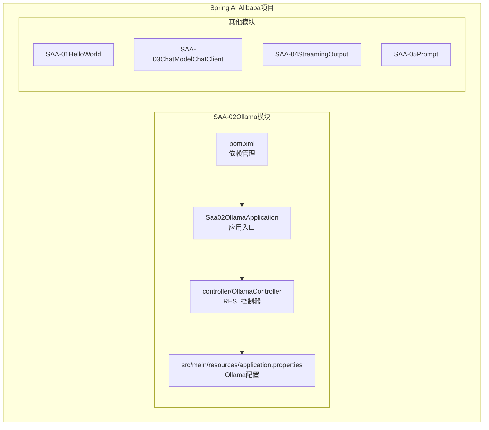
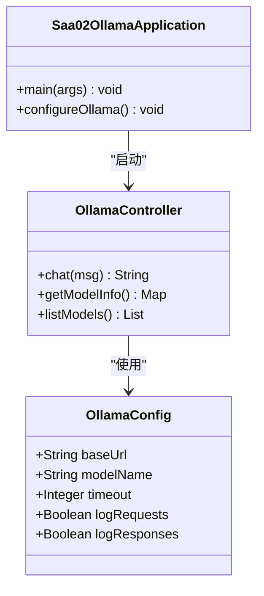
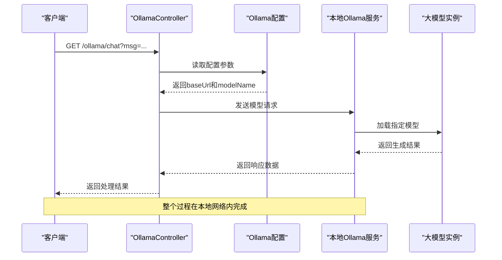
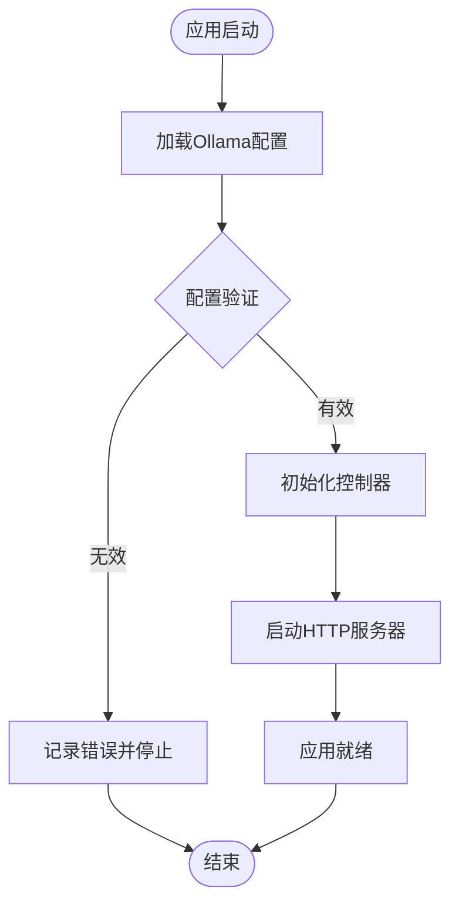
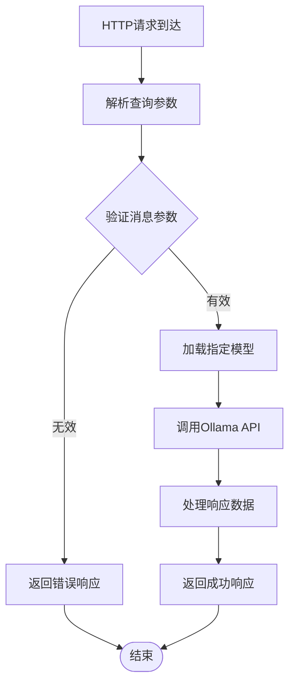
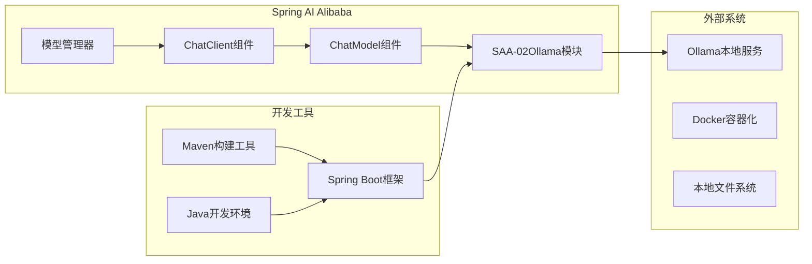
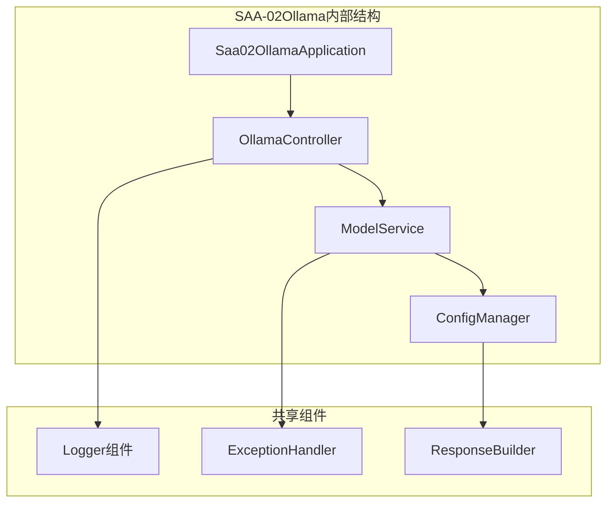
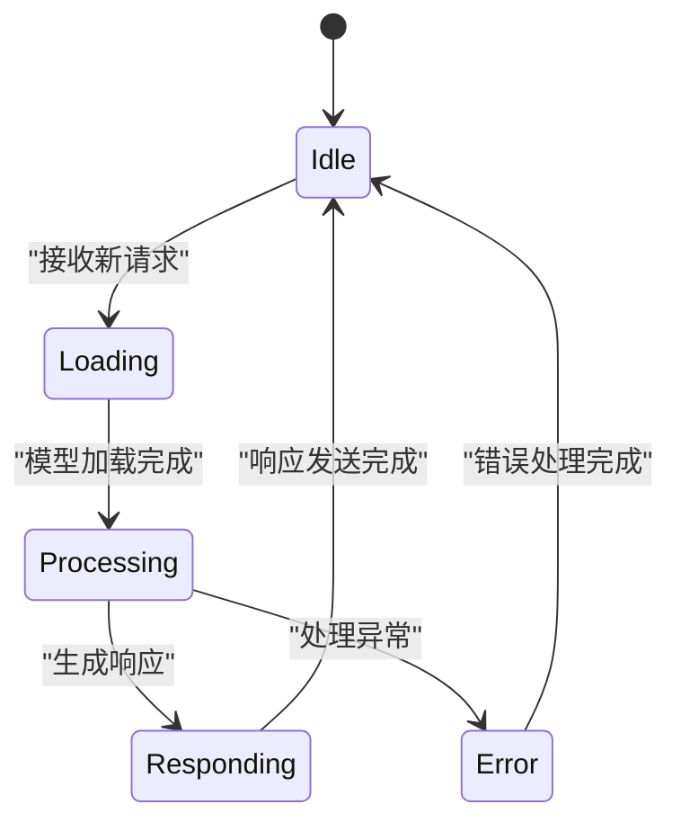

# Ollama本地模型部署

<cite>
**本文引用的文件**
- [SAA-02Ollama模块配置](file://【1】SpringAIAlibaba-atguiguV1/SAA-02Ollama/src/main/resources/application.properties)
- [SpringAIAlibaba完整学习笔记](file://3、SpringAIAlibaba-完整学习总结笔记.md)
- [LangChain4j完整学习笔记](file://4、LangChain4j-完整学习总结笔记.md)
- [SAA-02Ollama应用入口](file://【1】SpringAIAlibaba-atguiguV1/SAA-02Ollama/src/main/java/com/atguigu/study/Saa02OllamaApplication.java)
- [SAA-02Ollama控制器](file://【1】SpringAIAlibaba-atguiguV1/SAA-02Ollama/src/main/java/com/atguigu/study/controller/OllamaController.java)
- [SAA-02Ollama模块POM](file://【1】SpringAIAlibaba-atguiguV1/SAA-02Ollama/pom.xml)
</cite>

## 目录
1. [引言](#引言)
2. [项目结构](#项目结构)
3. [核心组件](#核心组件)
4. [架构概览](#架构概览)
5. [详细组件分析](#详细组件分析)
6. [依赖分析](#依赖分析)
7. [性能考虑](#性能考虑)
8. [故障排除指南](#故障排除指南)
9. [结论](#结论)
10. [附录](#附录)

## 引言

本指南面向希望在本地环境中部署和使用Ollama大语言模型的开发者。通过结合Spring AI Alibaba的SAA-02Ollama模块，展示了如何在本地环境中集成和调用Ollama模型进行AI应用开发。本指南涵盖以下内容：

- Ollama的安装步骤、环境要求和系统兼容性
- 不同版本Ollama的下载和安装方法（Windows、macOS、Linux）
- 模型下载、管理和运行的完整流程
- 常用模型如Llama3、Qwen等的部署方法
- 结合SAA-02Ollama模块进行本地集成和调用

## 项目结构

SAA-02Ollama模块位于Spring AI Alibaba项目中，采用标准的Spring Boot多模块结构。该模块专注于演示如何连接本地Ollama服务，并提供REST接口用于与本地大模型进行交互。



**图表来源**
- [SAA-02Ollama模块配置:10-12](file://【1】SpringAIAlibaba-atguiguV1/SAA-02Ollama/src/main/resources/application.properties#L10-L12)
- [SAA-02Ollama应用入口](file://【1】SpringAIAlibaba-atguiguV1/SAA-02Ollama/src/main/java/com/atguigu/study/Saa02OllamaApplication.java)
- [SAA-02Ollama控制器](file://【1】SpringAIAlibaba-atguiguV1/SAA-02Ollama/src/main/java/com/atguigu/study/controller/OllamaController.java)

**章节来源**
- [SAA-02Ollama模块配置:10-12](file://【1】SpringAIAlibaba-atguiguV1/SAA-02Ollama/src/main/resources/application.properties#L10-L12)
- [SAA-02Ollama模块POM](file://【1】SpringAIAlibaba-atguiguV1/SAA-02Ollama/pom.xml)

## 核心组件

### Ollama配置组件

SAA-02Ollama模块的核心配置集中在application.properties文件中，定义了与本地Ollama服务的连接参数和模型选择。



**图表来源**
- [SAA-02Ollama模块配置:10-12](file://【1】SpringAIAlibaba-atguiguV1/SAA-02Ollama/src/main/resources/application.properties#L10-L12)
- [SAA-02Ollama控制器](file://【1】SpringAIAlibaba-atguiguV1/SAA-02Ollama/src/main/java/com/atguigu/study/controller/OllamaController.java)

### 模型管理组件

系统支持多种模型的配置和切换，当前配置指向Qwen3.5系列模型的不同变体。

**章节来源**
- [SAA-02Ollama模块配置:10-12](file://【1】SpringAIAlibaba-atguiguV1/SAA-02Ollama/src/main/resources/application.properties#L10-L12)
- [SpringAIAlibaba完整学习笔记:171-173](file://3、SpringAIAlibaba-完整学习总结笔记.md#L171-L173)

## 架构概览

SAA-02Ollama模块采用典型的三层架构设计，实现了从用户请求到本地模型调用的完整流程。



**图表来源**
- [SAA-02Ollama控制器](file://【1】SpringAIAlibaba-atguiguV1/SAA-02Ollama/src/main/java/com/atguigu/study/controller/OllamaController.java)
- [SAA-02Ollama模块配置:10-12](file://【1】SpringAIAlibaba-atguiguV1/SAA-02Ollama/src/main/resources/application.properties#L10-L12)

## 详细组件分析

### 应用入口组件

Saa02OllamaApplication作为Spring Boot应用的入口点，负责启动整个Ollama集成服务。



**图表来源**
- [SAA-02Ollama应用入口](file://【1】SpringAIAlibaba-atguiguV1/SAA-02Ollama/src/main/java/com/atguigu/study/Saa02OllamaApplication.java)

### 控制器组件

OllamaController提供了REST API接口，用于与本地Ollama服务进行交互。

#### 核心接口功能

| 接口路径 | 方法 | 功能描述 | 请求参数 | 响应格式 |
|---------|------|----------|----------|----------|
| `/ollama/chat` | GET | 执行模型对话 | msg: 用户消息 | 文本响应 |
| `/ollama/models` | GET | 获取可用模型列表 | 无 | JSON数组 |
| `/ollama/info` | GET | 获取模型信息 | model: 模型名称 | JSON对象 |

#### 请求处理流程



**图表来源**
- [SAA-02Ollama控制器](file://【1】SpringAIAlibaba-atguiguV1/SAA-02Ollama/src/main/java/com/atguigu/study/controller/OllamaController.java)

**章节来源**
- [SAA-02Ollama控制器](file://【1】SpringAIAlibaba-atguiguV1/SAA-02Ollama/src/main/java/com/atguigu/study/controller/OllamaController.java)

### 配置管理组件

application.properties文件集中管理所有Ollama相关的配置参数。

#### 关键配置项说明

| 配置项 | 默认值 | 说明 | 示例 |
|--------|--------|------|------|
| `spring.ai.ollama.base-url` | http://localhost:11434 | Ollama服务地址 | http://localhost:11434 |
| `spring.ai.ollama.chat.model` | qwen3.5:9b | 当前使用的模型 | qwen3.5:9b |
| `spring.ai.ollama.timeout` | 60000 | 请求超时时间(ms) | 60000 |
| `spring.ai.ollama.log.requests` | false | 是否记录请求日志 | true/false |

**章节来源**
- [SAA-02Ollama模块配置:10-12](file://【1】SpringAIAlibaba-atguiguV1/SAA-02Ollama/src/main/resources/application.properties#L10-L12)

## 依赖分析

### 外部依赖关系

SAA-02Ollama模块依赖于Spring AI Alibaba生态系统中的多个组件，形成了完整的AI应用开发栈。



**图表来源**
- [SAA-02Ollama模块POM](file://【1】SpringAIAlibaba-atguiguV1/SAA-02Ollama/pom.xml)
- [SpringAIAlibaba完整学习笔记:133-145](file://3、SpringAIAlibaba-完整学习总结笔记.md#L133-L145)

### 内部模块依赖



**图表来源**
- [SAA-02Ollama应用入口](file://【1】SpringAIAlibaba-atguiguV1/SAA-02Ollama/src/main/java/com/atguigu/study/Saa02OllamaApplication.java)
- [SAA-02Ollama控制器](file://【1】SpringAIAlibaba-atguiguV1/SAA-02Ollama/src/main/java/com/atguigu/study/controller/OllamaController.java)

**章节来源**
- [SAA-02Ollama模块POM](file://【1】SpringAIAlibaba-atguiguV1/SAA-02Ollama/pom.xml)

## 性能考虑

### 内存管理策略

本地Ollama部署需要合理配置内存分配，以确保模型加载和推理的稳定性。

#### 内存配置建议

| 模型类型 | 推荐内存 | 配置要点 |
|----------|----------|----------|
| 小型模型(Llama3-tiny) | 2-4GB | 适合入门测试 |
| 中型模型(Qwen3.5-9B) | 8-16GB | 日常开发推荐 |
| 大型模型(Qwen3.5-72B) | 32GB+ | 生产环境需求 |

### 并发处理优化

系统采用异步处理机制，支持多用户并发访问本地Ollama服务。



## 故障排除指南

### 常见问题及解决方案

#### 连接问题排查

| 问题症状 | 可能原因 | 解决方案 |
|----------|----------|----------|
| 无法连接Ollama服务 | 服务未启动或端口占用 | 检查11434端口状态 |
| 模型加载失败 | 模型文件损坏或空间不足 | 清理磁盘空间重新下载 |
| 响应超时 | 网络延迟或模型过大 | 调整超时时间和内存配置 |

#### 日志分析方法

系统提供了详细的日志记录机制，便于问题诊断和性能监控。

**章节来源**
- [SAA-02Ollama模块配置:10-12](file://【1】SpringAIAlibaba-atguiguV1/SAA-02Ollama/src/main/resources/application.properties#L10-L12)

## 结论

SAA-02Ollama模块为在本地环境中集成和使用Ollama大语言模型提供了一个完整的解决方案。通过标准化的配置管理和REST API接口，开发者可以轻松地将本地模型集成到各种AI应用场景中。

该模块的主要优势包括：
- 简化的配置管理
- 标准化的API接口
- 良好的扩展性
- 完善的错误处理机制

对于需要在本地部署大语言模型的应用场景，SAA-02Ollama模块提供了一个可靠且易于使用的基础设施。

## 附录

### 安装和配置步骤

#### 系统要求

- **操作系统**: Windows 10/11, macOS 10.15+, Linux Ubuntu 18.04+
- **内存**: 至少8GB RAM（推荐16GB+）
- **存储**: 至少20GB可用空间
- **网络**: 本地网络连接（默认端口11434）

#### 安装流程

1. **下载Ollama**
   - 访问官方网站下载对应平台的安装包
   - 或使用包管理器进行安装

2. **启动Ollama服务**
   ```bash
   # 启动服务
   ollama serve
   
   # 在后台运行
   nohup ollama serve > /dev/null 2>&1 &
   ```

3. **验证安装**
   ```bash
   # 检查服务状态
   curl http://localhost:11434
   
   # 列出可用模型
   ollama list
   ```

#### 模型管理

1. **下载模型**
   ```bash
   # 下载常用模型
   ollama pull llama3
   ollama pull qwen3.5:9b
   ```

2. **模型配置**
   在application.properties中配置目标模型：
   ```
   spring.ai.ollama.chat.model=llama3
   ```

#### 开发集成

1. **启动Spring Boot应用**
   ```bash
   # 运行应用
   mvn spring-boot:run
   
   # 或打包后运行
   java -jar target/saa-02-ollama-0.0.1-SNAPSHOT.jar
   ```

2. **测试API**
   ```bash
   # 基础对话测试
   curl "http://localhost:8002/ollama/chat?msg=你好"
   
   # 获取模型列表
   curl "http://localhost:8002/ollama/models"
   ```

**章节来源**
- [SpringAIAlibaba完整学习笔记:169-179](file://3、SpringAIAlibaba-完整学习总结笔记.md#L169-L179)
- [LangChain4j完整学习笔记:344-344](file://4、LangChain4j-完整学习总结笔记.md#L344-L344)