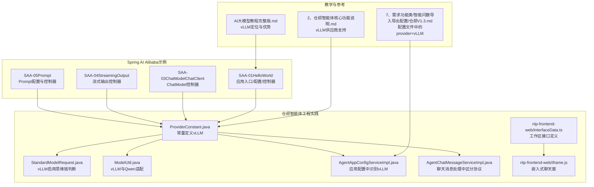
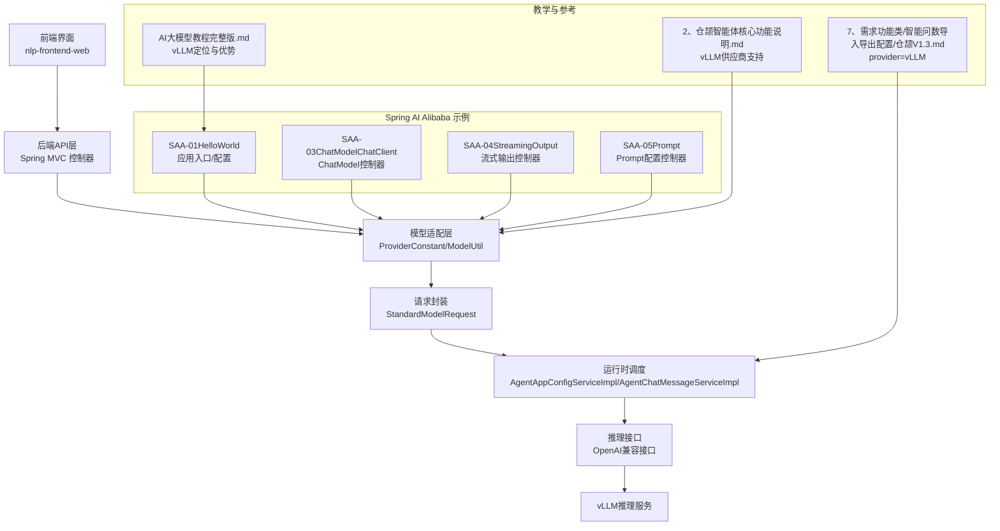
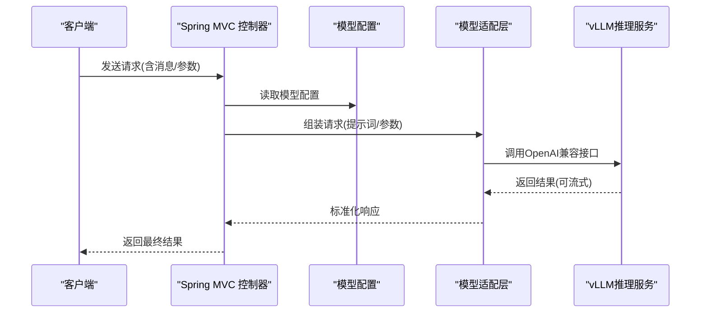
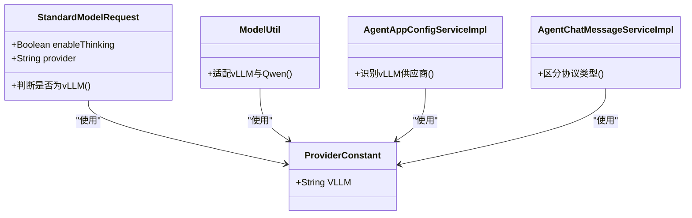
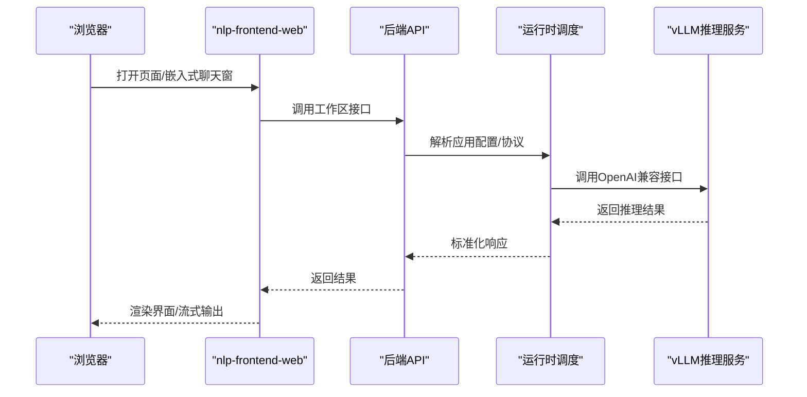
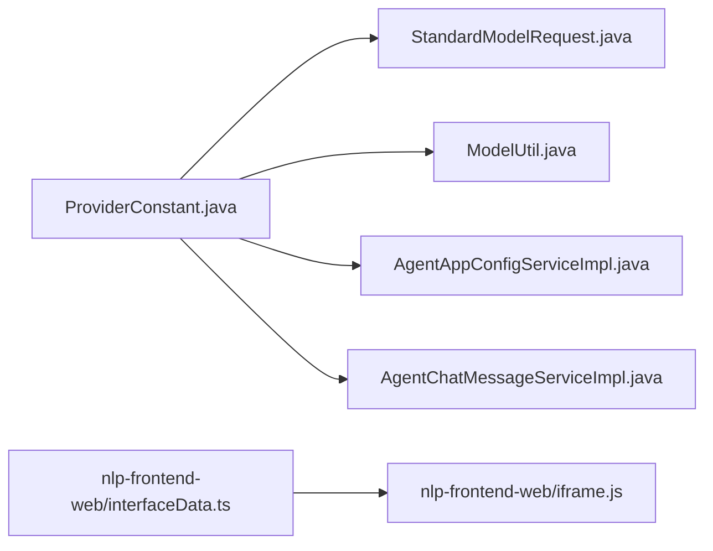

# vLLM高性能推理

<cite>
**本文引用的文件**
- [AI大模型教程完整版.md](file://【0】AI大模型教程（指导手册）/AI大模型教程完整版.md)
- [2、仓颉智能体核心功能说明.md](file://【3】工作资料/仓颉项目系统功能文档梳理/2、仓颉智能体核心功能说明.md)
- [7、需求功能类/智能问数导入导出配置/仓颉V1.3.md](file://【3】工作资料/仓颉项目系统功能文档梳理/7、需求功能类/智能问数导入导出配置/仓颉V1.3.md)
- [SAA-01HelloWorld/Saa01HelloWorldApplication.java](file://【1】SpringAIAlibaba-atguiguV1/SAA-01HelloWorld/src/main/java/com/atguigu/study/Saa01HelloWorldApplication.java)
- [SAA-01HelloWorld/config/SaaLLMConfig.java](file://【1】SpringAIAlibaba-atguiguV1/SAA-01HelloWorld/src/main/java/com/atguigu/study/config/SaaLLMConfig.java)
- [SAA-01HelloWorld/controller/ChatHelloController.java](file://【1】SpringAIAlibaba-atguiguV1/SAA-01HelloWorld/src/main/java/com/atguigu/study/controller/ChatHelloController.java)
- [SAA-03ChatModelChatClient/config/SaaLLMConfig.java](file://【1】SpringAIAlibaba-atguiguV1/SAA-03ChatModelChatClient/src/main/java/com/atguigu/study/config/SaaLLMConfig.java)
- [SAA-03ChatModelChatClient/controller/ChatModelController.java](file://【1】SpringAIAlibaba-atguiguV1/SAA-03ChatModelChatClient/src/main/java/com/atguigu/study/controller/ChatModelController.java)
- [SAA-04StreamingOutput/config/SaaLLMConfig.java](file://【1】SpringAIAlibaba-atguiguV1/SAA-04StreamingOutput/src/main/java/com/atguigu/study/config/SaaLLMConfig.java)
- [SAA-04StreamingOutput/controller/StreamOutputController.java](file://【1】SpringAIAlibaba-atguiguV1/SAA-04StreamingOutput/src/main/java/com/atguigu/study/controller/StreamOutputController.java)
- [SAA-05Prompt/config/SaaLLMConfig.java](file://【1】SpringAIAlibaba-atguiguV1/SAA-05Prompt/src/main/java/com/atguigu/study/config/SaaLLMConfig.java)
- [SAA-05Prompt/controller/PromptController.java](file://【1】SpringAIAlibaba-atguiguV1/SAA-05Prompt/src/main/java/com/atguigu/study/controller/PromptController.java)
- [agent-common/constant/ProviderConstant.java](file://【3】工作资料/code/仓颉智能体/nlp-agent/agent-common/agent-model-adapter/src/main/java/com/yundingtech/agent/sdk/common/constant/ProviderConstant.java)
- [agent-common/model/request/StandardModelRequest.java](file://【3】工作资料/code/仓颉智能体/nlp-agent/agent-common/agent-model-adapter/src/main/java/com/yundingtech/agent/sdk/common/model/request/StandardModelRequest.java)
- [agent-common/util/ModelUtil.java](file://【3】工作资料/code/仓颉智能体/nlp-agent/agent-common/agent-model-adapter/src/main/java/com/yundingtech/agent/sdk/common/util/ModelUtil.java)
- [agent-builder/service/impl/AgentAppConfigServiceImpl.java](file://【3】工作资料/code/仓颉智能体/nlp-agent/agent-builder/agent-build-core/src/main/java/com/yundingtech/agent/build/modules/appconfig/service/impl/AgentAppConfigServiceImpl.java)
- [agent-builder/service/impl/AgentChatMessageServiceImpl.java](file://【3】工作资料/code/仓颉智能体/nlp-agent/agent-builder/agent-build-core/src/main/java/com/yundingtech/agent/build/modules/chatapplication/serice/impl/AgentChatMessageServiceImpl.java)
- [nlp-frontend-web/src/views/workspace/interfaceData.ts](file://【3】工作资料/code/仓颉智能体/nlp-frontend-web/src/views/workspace/interfaceData.ts)
- [nlp-frontend-web/public/iframe.js](file://【3】工作资料/code/仓颉智能体/nlp-frontend-web/public/iframe.js)
</cite>

## 目录
1. [引言](#引言)
2. [项目结构](#项目结构)
3. [核心组件](#核心组件)
4. [架构总览](#架构总览)
5. [详细组件分析](#详细组件分析)
6. [依赖分析](#依赖分析)
7. [性能考虑](#性能考虑)
8. [故障排除指南](#故障排除指南)
9. [结论](#结论)
10. [附录](#附录)

## 引言
本技术指南面向希望在生产环境中以高性能、低延迟、高吞吐的方式进行大模型推理的工程团队。vLLM作为面向生产的高性能推理引擎，具备显存页按需分配、动态扩展、高吞吐与灵活部署等特性，适合在企业级应用与大规模并发场景中使用。本指南结合仓库中的Spring AI Alibaba示例与“仓颉智能体”项目实践，系统讲解vLLM的架构优势、安装配置、模型加载与推理优化流程，并给出注意力机制优化、分页缓存与连续批处理的关键技术要点，最后提供性能测试、资源监控与故障排除的专业建议。

## 项目结构
本仓库包含两部分与vLLM高性能推理密切相关的知识与实践：
- 教学与参考资料：系统阐述vLLM的定位、优势、部署与与OpenAI API兼容的交互方式。
- 工程化实践：Spring AI Alibaba示例展示如何在Spring生态中集成与调用模型；“仓颉智能体”项目展示了vLLM在工作流与智能问答场景中的实际配置与调用。

**图表来源**
- [AI大模型教程完整版.md](file://【0】AI大模型教程（指导手册）/AI大模型教程完整版.md)
- [2、仓颉智能体核心功能说明.md](file://【3】工作资料/仓颉项目系统功能文档梳理/2、仓颉智能体核心功能说明.md)
- [7、需求功能类/智能问数导入导出配置/仓颉V1.3.md](file://【3】工作资料/仓颉项目系统功能文档梳理/7、需求功能类/智能问数导入导出配置/仓颉V1.3.md)
- [SAA-01HelloWorld/Saa01HelloWorldApplication.java](file://【1】SpringAIAlibaba-atguiguV1/SAA-01HelloWorld/src/main/java/com/atguigu/study/Saa01HelloWorldApplication.java)
- [SAA-03ChatModelChatClient/controller/ChatModelController.java](file://【1】SpringAIAlibaba-atguiguV1/SAA-03ChatModelChatClient/src/main/java/com/atguigu/study/controller/ChatModelController.java)
- [SAA-04StreamingOutput/controller/StreamOutputController.java](file://【1】SpringAIAlibaba-atguiguV1/SAA-04StreamingOutput/src/main/java/com/atguigu/study/controller/StreamOutputController.java)
- [SAA-05Prompt/controller/PromptController.java](file://【1】SpringAIAlibaba-atguiguV1/SAA-05Prompt/src/main/java/com/atguigu/study/controller/PromptController.java)
- [agent-common/constant/ProviderConstant.java](file://【3】工作资料/code/仓颉智能体/nlp-agent/agent-common/agent-model-adapter/src/main/java/com/yundingtech/agent/sdk/common/constant/ProviderConstant.java)
- [agent-common/model/request/StandardModelRequest.java](file://【3】工作资料/code/仓颉智能体/nlp-agent/agent-common/agent-model-adapter/src/main/java/com/yundingtech/agent/sdk/common/model/request/StandardModelRequest.java)
- [agent-common/util/ModelUtil.java](file://【3】工作资料/code/仓颉智能体/nlp-agent/agent-common/agent-model-adapter/src/main/java/com/yundingtech/agent/sdk/common/util/ModelUtil.java)
- [agent-builder/service/impl/AgentAppConfigServiceImpl.java](file://【3】工作资料/code/仓颉智能体/nlp-agent/agent-builder/agent-build-core/src/main/java/com/yundingtech/agent/build/modules/appconfig/service/impl/AgentAppConfigServiceImpl.java)
- [agent-builder/service/impl/AgentChatMessageServiceImpl.java](file://【3】工作资料/code/仓颉智能体/nlp-agent/agent-builder/agent-build-core/src/main/java/com/yundingtech/agent/build/modules/chatapplication/serice/impl/AgentChatMessageServiceImpl.java)
- [nlp-frontend-web/src/views/workspace/interfaceData.ts](file://【3】工作资料/code/仓颉智能体/nlp-frontend-web/src/views/workspace/interfaceData.ts)
- [nlp-frontend-web/public/iframe.js](file://【3】工作资料/code/仓颉智能体/nlp-frontend-web/public/iframe.js)

**章节来源**
- [AI大模型教程完整版.md](file://【0】AI大模型教程（指导手册）/AI大模型教程完整版.md)
- [2、仓颉智能体核心功能说明.md](file://【3】工作资料/仓颉项目系统功能文档梳理/2、仓颉智能体核心功能说明.md)
- [7、需求功能类/智能问数导入导出配置/仓颉V1.3.md](file://【3】工作资料/仓颉项目系统功能文档梳理/7、需求功能类/智能问数导入导出配置/仓颉V1.3.md)

## 核心组件
- vLLM推理引擎：面向生产的大模型推理框架，强调显存优化、高吞吐与灵活部署，支持多节点分布式部署与OpenAI兼容接口。
- Spring AI Alibaba示例：提供在Spring Boot中集成与调用模型的最小可行示例，便于理解模型配置、请求与流式输出。
- 仓颉智能体工程：在工作流与智能问答场景中，通过配置文件指定provider为vLLM，并在后端服务中根据provider进行差异化处理（如思维链开关、模型适配等）。

**章节来源**
- [AI大模型教程完整版.md](file://【0】AI大模型教程（指导手册）/AI大模型教程完整版.md)
- [SAA-01HelloWorld/Saa01HelloWorldApplication.java](file://【1】SpringAIAlibaba-atguiguV1/SAA-01HelloWorld/src/main/java/com/atguigu/study/Saa01HelloWorldApplication.java)
- [SAA-03ChatModelChatClient/config/SaaLLMConfig.java](file://【1】SpringAIAlibaba-atguiguV1/SAA-03ChatModelChatClient/src/main/java/com/atguigu/study/config/SaaLLMConfig.java)
- [SAA-04StreamingOutput/config/SaaLLMConfig.java](file://【1】SpringAIAlibaba-atguiguV1/SAA-04StreamingOutput/src/main/java/com/atguigu/study/config/SaaLLMConfig.java)
- [SAA-05Prompt/config/SaaLLMConfig.java](file://【1】SpringAIAlibaba-atguiguV1/SAA-05Prompt/src/main/java/com/atguigu/study/config/SaaLLMConfig.java)
- [agent-common/constant/ProviderConstant.java](file://【3】工作资料/code/仓颉智能体/nlp-agent/agent-common/agent-model-adapter/src/main/java/com/yundingtech/agent/sdk/common/constant/ProviderConstant.java)
- [agent-common/model/request/StandardModelRequest.java](file://【3】工作资料/code/仓颉智能体/nlp-agent/agent-common/agent-model-adapter/src/main/java/com/yundingtech/agent/sdk/common/model/request/StandardModelRequest.java)
- [agent-common/util/ModelUtil.java](file://【3】工作资料/code/仓颉智能体/nlp-agent/agent-common/agent-model-adapter/src/main/java/com/yundingtech/agent/sdk/common/util/ModelUtil.java)
- [agent-builder/service/impl/AgentAppConfigServiceImpl.java](file://【3】工作资料/code/仓颉智能体/nlp-agent/agent-builder/agent-build-core/src/main/java/com/yundingtech/agent/build/modules/appconfig/service/impl/AgentAppConfigServiceImpl.java)
- [7、需求功能类/智能问数导入导出配置/仓颉V1.3.md](file://【3】工作资料/仓颉项目系统功能文档梳理/7、需求功能类/智能问数导入导出配置/仓颉V1.3.md)

## 架构总览
下图展示了从前端到后端再到vLLM推理服务的整体架构，以及Spring AI Alibaba示例与“仓颉智能体”工程实践的集成点。

**图表来源**
- [SAA-01HelloWorld/controller/ChatHelloController.java](file://【1】SpringAIAlibaba-atguiguV1/SAA-01HelloWorld/src/main/java/com/atguigu/study/controller/ChatHelloController.java)
- [SAA-03ChatModelChatClient/controller/ChatModelController.java](file://【1】SpringAIAlibaba-atguiguV1/SAA-03ChatModelChatClient/src/main/java/com/atguigu/study/controller/ChatModelController.java)
- [SAA-04StreamingOutput/controller/StreamOutputController.java](file://【1】SpringAIAlibaba-atguiguV1/SAA-04StreamingOutput/src/main/java/com/atguigu/study/controller/StreamOutputController.java)
- [SAA-05Prompt/controller/PromptController.java](file://【1】SpringAIAlibaba-atguiguV1/SAA-05Prompt/src/main/java/com/atguigu/study/controller/PromptController.java)
- [agent-common/constant/ProviderConstant.java](file://【3】工作资料/code/仓颉智能体/nlp-agent/agent-common/agent-model-adapter/src/main/java/com/yundingtech/agent/sdk/common/constant/ProviderConstant.java)
- [agent-common/model/request/StandardModelRequest.java](file://【3】工作资料/code/仓颉智能体/nlp-agent/agent-common/agent-model-adapter/src/main/java/com/yundingtech/agent/sdk/common/model/request/StandardModelRequest.java)
- [agent-common/util/ModelUtil.java](file://【3】工作资料/code/仓颉智能体/nlp-agent/agent-common/agent-model-adapter/src/main/java/com/yundingtech/agent/sdk/common/util/ModelUtil.java)
- [agent-builder/service/impl/AgentAppConfigServiceImpl.java](file://【3】工作资料/code/仓颉智能体/nlp-agent/agent-builder/agent-build-core/src/main/java/com/yundingtech/agent/build/modules/appconfig/service/impl/AgentAppConfigServiceImpl.java)
- [agent-builder/service/impl/AgentChatMessageServiceImpl.java](file://【3】工作资料/code/仓颉智能体/nlp-agent/agent-builder/agent-build-core/src/main/java/com/yundingtech/agent/build/modules/chatapplication/serice/impl/AgentChatMessageServiceImpl.java)
- [AI大模型教程完整版.md](file://【0】AI大模型教程（指导手册）/AI大模型教程完整版.md)
- [2、仓颉智能体核心功能说明.md](file://【3】工作资料/仓颉项目系统功能文档梳理/2、仓颉智能体核心功能说明.md)
- [7、需求功能类/智能问数导入导出配置/仓颉V1.3.md](file://【3】工作资料/仓颉项目系统功能文档梳理/7、需求功能类/智能问数导入导出配置/仓颉V1.3.md)

## 详细组件分析

### 组件A：Spring AI Alibaba示例（HelloWorld/ChatClient/Stream/Prompt）
这些示例展示了在Spring Boot中如何配置与调用模型，便于理解vLLM在Spring生态中的集成方式：
- 应用入口与配置：通过配置类加载模型参数与连接信息。
- 控制器：封装请求参数，调用模型接口并返回结果；流式输出控制器支持增量返回。
- Prompt配置：将提示词注入到请求中，形成标准的模型输入格式。

**图表来源**
- [SAA-01HelloWorld/controller/ChatHelloController.java](file://【1】SpringAIAlibaba-atguiguV1/SAA-01HelloWorld/src/main/java/com/atguigu/study/controller/ChatHelloController.java)
- [SAA-03ChatModelChatClient/controller/ChatModelController.java](file://【1】SpringAIAlibaba-atguiguV1/SAA-03ChatModelChatClient/src/main/java/com/atguigu/study/controller/ChatModelController.java)
- [SAA-04StreamingOutput/controller/StreamOutputController.java](file://【1】SpringAIAlibaba-atguiguV1/SAA-04StreamingOutput/src/main/java/com/atguigu/study/controller/StreamOutputController.java)
- [SAA-05Prompt/controller/PromptController.java](file://【1】SpringAIAlibaba-atguiguV1/SAA-05Prompt/src/main/java/com/atguigu/study/controller/PromptController.java)

**章节来源**
- [SAA-01HelloWorld/Saa01HelloWorldApplication.java](file://【1】SpringAIAlibaba-atguiguV1/SAA-01HelloWorld/src/main/java/com/atguigu/study/Saa01HelloWorldApplication.java)
- [SAA-01HelloWorld/config/SaaLLMConfig.java](file://【1】SpringAIAlibaba-atguiguV1/SAA-01HelloWorld/src/main/java/com/atguigu/study/config/SaaLLMConfig.java)
- [SAA-03ChatModelChatClient/config/SaaLLMConfig.java](file://【1】SpringAIAlibaba-atguiguV1/SAA-03ChatModelChatClient/src/main/java/com/atguigu/study/config/SaaLLMConfig.java)
- [SAA-04StreamingOutput/config/SaaLLMConfig.java](file://【1】SpringAIAlibaba-atguiguV1/SAA-04StreamingOutput/src/main/java/com/atguigu/study/config/SaaLLMConfig.java)
- [SAA-05Prompt/config/SaaLLMConfig.java](file://【1】SpringAIAlibaba-atguiguV1/SAA-05Prompt/src/main/java/com/atguigu/study/config/SaaLLMConfig.java)

### 组件B：仓颉智能体工程（模型适配与请求封装）
该工程在“应用配置”与“聊天消息处理”中对vLLM进行了识别与差异化处理：
- ProviderConstant：统一管理供应商标识，其中包含vLLM。
- StandardModelRequest：在启用思维链时对vLLM进行特殊判断。
- ModelUtil：在vLLM与Qwen之间进行适配。
- AgentAppConfigServiceImpl：在应用配置中识别vLLM供应商。
- AgentChatMessageServiceImpl：在聊天消息处理中区分协议类型。

**图表来源**
- [agent-common/constant/ProviderConstant.java](file://【3】工作资料/code/仓颉智能体/nlp-agent/agent-common/agent-model-adapter/src/main/java/com/yundingtech/agent/sdk/common/constant/ProviderConstant.java)
- [agent-common/model/request/StandardModelRequest.java](file://【3】工作资料/code/仓颉智能体/nlp-agent/agent-common/agent-model-adapter/src/main/java/com/yundingtech/agent/sdk/common/model/request/StandardModelRequest.java)
- [agent-common/util/ModelUtil.java](file://【3】工作资料/code/仓颉智能体/nlp-agent/agent-common/agent-model-adapter/src/main/java/com/yundingtech/agent/sdk/common/util/ModelUtil.java)
- [agent-builder/service/impl/AgentAppConfigServiceImpl.java](file://【3】工作资料/code/仓颉智能体/nlp-agent/agent-builder/agent-build-core/src/main/java/com/yundingtech/agent/build/modules/appconfig/service/impl/AgentAppConfigServiceImpl.java)
- [agent-builder/service/impl/AgentChatMessageServiceImpl.java](file://【3】工作资料/code/仓颉智能体/nlp-agent/agent-builder/agent-build-core/src/main/java/com/yundingtech/agent/build/modules/chatapplication/serice/impl/AgentChatMessageServiceImpl.java)

**章节来源**
- [agent-common/constant/ProviderConstant.java](file://【3】工作资料/code/仓颉智能体/nlp-agent/agent-common/agent-model-adapter/src/main/java/com/yundingtech/agent/sdk/common/constant/ProviderConstant.java)
- [agent-common/model/request/StandardModelRequest.java](file://【3】工作资料/code/仓颉智能体/nlp-agent/agent-common/agent-model-adapter/src/main/java/com/yundingtech/agent/sdk/common/model/request/StandardModelRequest.java)
- [agent-common/util/ModelUtil.java](file://【3】工作资料/code/仓颉智能体/nlp-agent/agent-common/agent-model-adapter/src/main/java/com/yundingtech/agent/sdk/common/util/ModelUtil.java)
- [agent-builder/service/impl/AgentAppConfigServiceImpl.java](file://【3】工作资料/code/仓颉智能体/nlp-agent/agent-builder/agent-build-core/src/main/java/com/yundingtech/agent/build/modules/appconfig/service/impl/AgentAppConfigServiceImpl.java)
- [agent-builder/service/impl/AgentChatMessageServiceImpl.java](file://【3】工作资料/code/仓颉智能体/nlp-agent/agent-builder/agent-build-core/src/main/java/com/yundingtech/agent/build/modules/chatapplication/serice/impl/AgentChatMessageServiceImpl.java)

### 组件C：前端与接口（工作区与嵌入式聊天窗）
前端通过接口访问后端，后端再对接vLLM推理服务。嵌入式聊天窗负责在页面中弹出与拖拽，提升用户体验。

**图表来源**
- [nlp-frontend-web/src/views/workspace/interfaceData.ts](file://【3】工作资料/code/仓颉智能体/nlp-frontend-web/src/views/workspace/interfaceData.ts)
- [nlp-frontend-web/public/iframe.js](file://【3】工作资料/code/仓颉智能体/nlp-frontend-web/public/iframe.js)
- [agent-builder/service/impl/AgentAppConfigServiceImpl.java](file://【3】工作资料/code/仓颉智能体/nlp-agent/agent-builder/agent-build-core/src/main/java/com/yundingtech/agent/build/modules/appconfig/service/impl/AgentAppConfigServiceImpl.java)
- [agent-builder/service/impl/AgentChatMessageServiceImpl.java](file://【3】工作资料/code/仓颉智能体/nlp-agent/agent-builder/agent-build-core/src/main/java/com/yundingtech/agent/build/modules/chatapplication/serice/impl/AgentChatMessageServiceImpl.java)

**章节来源**
- [nlp-frontend-web/src/views/workspace/interfaceData.ts](file://【3】工作资料/code/仓颉智能体/nlp-frontend-web/src/views/workspace/interfaceData.ts)
- [nlp-frontend-web/public/iframe.js](file://【3】工作资料/code/仓颉智能体/nlp-frontend-web/public/iframe.js)

## 依赖分析
- 供应商常量与适配：通过ProviderConstant统一管理供应商标识，StandardModelRequest与ModelUtil在不同供应商间进行差异化处理。
- 应用配置与消息处理：AgentAppConfigServiceImpl与AgentChatMessageServiceImpl在配置与运行时分别对vLLM进行识别与协议区分。
- 前后端接口：前端通过interfaceData.ts定义工作区接口，iframe.js负责嵌入式聊天窗的交互。

**图表来源**
- [agent-common/constant/ProviderConstant.java](file://【3】工作资料/code/仓颉智能体/nlp-agent/agent-common/agent-model-adapter/src/main/java/com/yundingtech/agent/sdk/common/constant/ProviderConstant.java)
- [agent-common/model/request/StandardModelRequest.java](file://【3】工作资料/code/仓颉智能体/nlp-agent/agent-common/agent-model-adapter/src/main/java/com/yundingtech/agent/sdk/common/model/request/StandardModelRequest.java)
- [agent-common/util/ModelUtil.java](file://【3】工作资料/code/仓颉智能体/nlp-agent/agent-common/agent-model-adapter/src/main/java/com/yundingtech/agent/sdk/common/util/ModelUtil.java)
- [agent-builder/service/impl/AgentAppConfigServiceImpl.java](file://【3】工作资料/code/仓颉智能体/nlp-agent/agent-builder/agent-build-core/src/main/java/com/yundingtech/agent/build/modules/appconfig/service/impl/AgentAppConfigServiceImpl.java)
- [agent-builder/service/impl/AgentChatMessageServiceImpl.java](file://【3】工作资料/code/仓颉智能体/nlp-agent/agent-builder/agent-build-core/src/main/java/com/yundingtech/agent/build/modules/chatapplication/serice/impl/AgentChatMessageServiceImpl.java)
- [nlp-frontend-web/src/views/workspace/interfaceData.ts](file://【3】工作资料/code/仓颉智能体/nlp-frontend-web/src/views/workspace/interfaceData.ts)
- [nlp-frontend-web/public/iframe.js](file://【3】工作资料/code/仓颉智能体/nlp-frontend-web/public/iframe.js)

**章节来源**
- [agent-common/constant/ProviderConstant.java](file://【3】工作资料/code/仓颉智能体/nlp-agent/agent-common/agent-model-adapter/src/main/java/com/yundingtech/agent/sdk/common/constant/ProviderConstant.java)
- [agent-common/model/request/StandardModelRequest.java](file://【3】工作资料/code/仓颉智能体/nlp-agent/agent-common/agent-model-adapter/src/main/java/com/yundingtech/agent/sdk/common/model/request/StandardModelRequest.java)
- [agent-common/util/ModelUtil.java](file://【3】工作资料/code/仓颉智能体/nlp-agent/agent-common/agent-model-adapter/src/main/java/com/yundingtech/agent/sdk/common/util/ModelUtil.java)
- [agent-builder/service/impl/AgentAppConfigServiceImpl.java](file://【3】工作资料/code/仓颉智能体/nlp-agent/agent-builder/agent-build-core/src/main/java/com/yundingtech/agent/build/modules/appconfig/service/impl/AgentAppConfigServiceImpl.java)
- [agent-builder/service/impl/AgentChatMessageServiceImpl.java](file://【3】工作资料/code/仓颉智能体/nlp-agent/agent-builder/agent-build-core/src/main/java/com/yundingtech/agent/build/modules/chatapplication/serice/impl/AgentChatMessageServiceImpl.java)
- [nlp-frontend-web/src/views/workspace/interfaceData.ts](file://【3】工作资料/code/仓颉智能体/nlp-frontend-web/src/views/workspace/interfaceData.ts)
- [nlp-frontend-web/public/iframe.js](file://【3】工作资料/code/仓颉智能体/nlp-frontend-web/public/iframe.js)

## 性能考虑
- 显存优化与分页缓存：vLLM通过显存页按需分配与动态扩展，显著提升显存利用率，适合高并发与长上下文场景。
- 连续批处理：在请求队列中合并相似请求，减少重复计算与上下文切换，提高吞吐量。
- 注意力机制优化：通过高效的注意力计算与KV缓存复用，降低每步解码的计算与内存压力。
- OpenAI兼容接口：通过统一的接口抽象，简化前后端对接，便于在Spring生态中进行横向扩展与弹性伸缩。

**章节来源**
- [AI大模型教程完整版.md](file://【0】AI大模型教程（指导手册）/AI大模型教程完整版.md)

## 故障排除指南
- 供应商识别异常：检查ProviderConstant中vLLM标识是否正确，确保AgentAppConfigServiceImpl与AgentChatMessageServiceImpl中对vLLM的识别逻辑一致。
- 请求参数不匹配：核对StandardModelRequest中的enableThinking与provider字段，确保在vLLM场景下开启正确的推理参数。
- 模型适配问题：在ModelUtil中确认vLLM与Qwen的适配逻辑，避免参数或格式差异导致的推理失败。
- 前后端接口异常：检查nlp-frontend-web的接口定义与iframe.js的嵌入逻辑，确保请求路径与参数传递正确。

**章节来源**
- [agent-common/constant/ProviderConstant.java](file://【3】工作资料/code/仓颉智能体/nlp-agent/agent-common/agent-model-adapter/src/main/java/com/yundingtech/agent/sdk/common/constant/ProviderConstant.java)
- [agent-common/model/request/StandardModelRequest.java](file://【3】工作资料/code/仓颉智能体/nlp-agent/agent-common/agent-model-adapter/src/main/java/com/yundingtech/agent/sdk/common/model/request/StandardModelRequest.java)
- [agent-common/util/ModelUtil.java](file://【3】工作资料/code/仓颉智能体/nlp-agent/agent-common/agent-model-adapter/src/main/java/com/yundingtech/agent/sdk/common/util/ModelUtil.java)
- [agent-builder/service/impl/AgentAppConfigServiceImpl.java](file://【3】工作资料/code/仓颉智能体/nlp-agent/agent-builder/agent-build-core/src/main/java/com/yundingtech/agent/build/modules/appconfig/service/impl/AgentAppConfigServiceImpl.java)
- [agent-builder/service/impl/AgentChatMessageServiceImpl.java](file://【3】工作资料/code/仓颉智能体/nlp-agent/agent-builder/agent-build-core/src/main/java/com/yundingtech/agent/build/modules/chatapplication/serice/impl/AgentChatMessageServiceImpl.java)
- [nlp-frontend-web/src/views/workspace/interfaceData.ts](file://【3】工作资料/code/仓颉智能体/nlp-frontend-web/src/views/workspace/interfaceData.ts)
- [nlp-frontend-web/public/iframe.js](file://【3】工作资料/code/仓颉智能体/nlp-frontend-web/public/iframe.js)

## 结论
vLLM凭借其在显存优化、高吞吐与灵活部署方面的优势，非常适合在企业级AI应用中承担高性能推理任务。结合Spring AI Alibaba示例与“仓颉智能体”工程实践，可以在Spring生态中快速集成vLLM，并通过统一的供应商常量、请求封装与适配层实现稳定可靠的推理服务。建议在生产环境中配合分页缓存、连续批处理与注意力机制优化，持续监控资源使用与延迟指标，以获得最佳的性能表现。

## 附录
- vLLM安装与部署参考：见教学文档中的镜像与多节点部署说明。
- OpenAI兼容接口：见教学文档中的服务交互说明。
- 配置文件示例：见“智能问数导入导出配置”中provider=vLLM的示例。

**章节来源**
- [AI大模型教程完整版.md](file://【0】AI大模型教程（指导手册）/AI大模型教程完整版.md)
- [7、需求功能类/智能问数导入导出配置/仓颉V1.3.md](file://【3】工作资料/仓颉项目系统功能文档梳理/7、需求功能类/智能问数导入导出配置/仓颉V1.3.md)