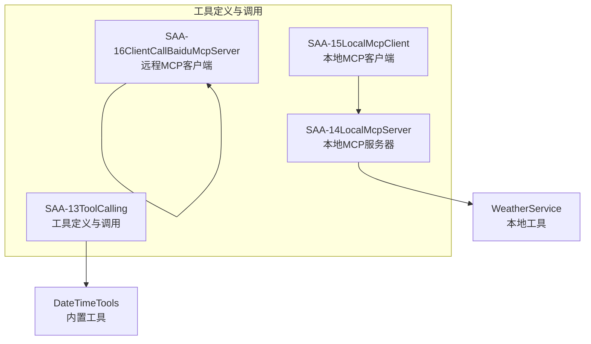
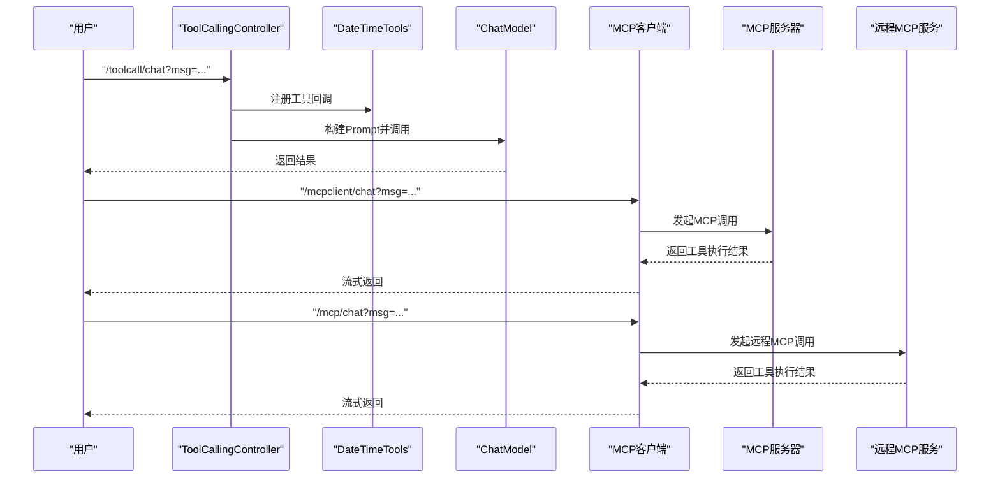
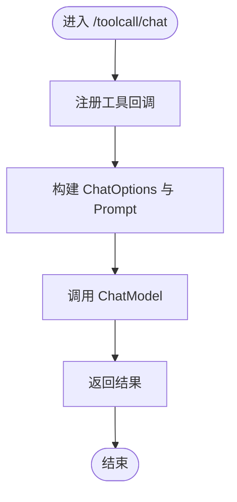
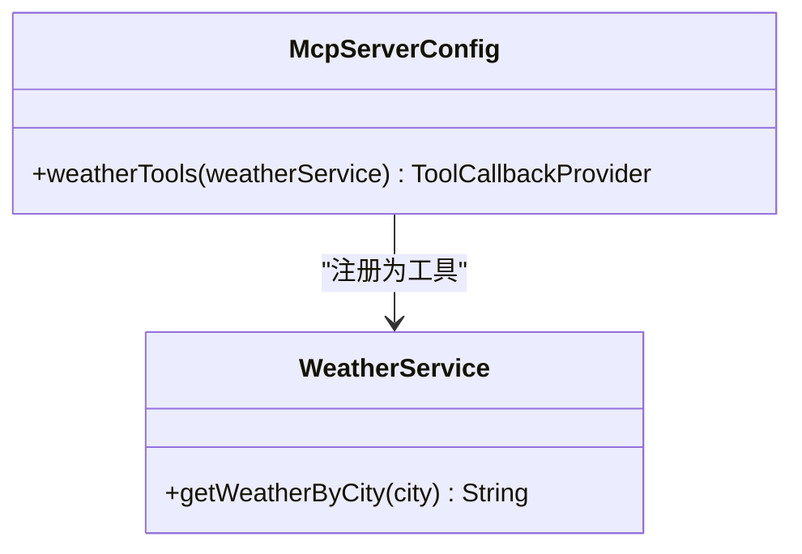
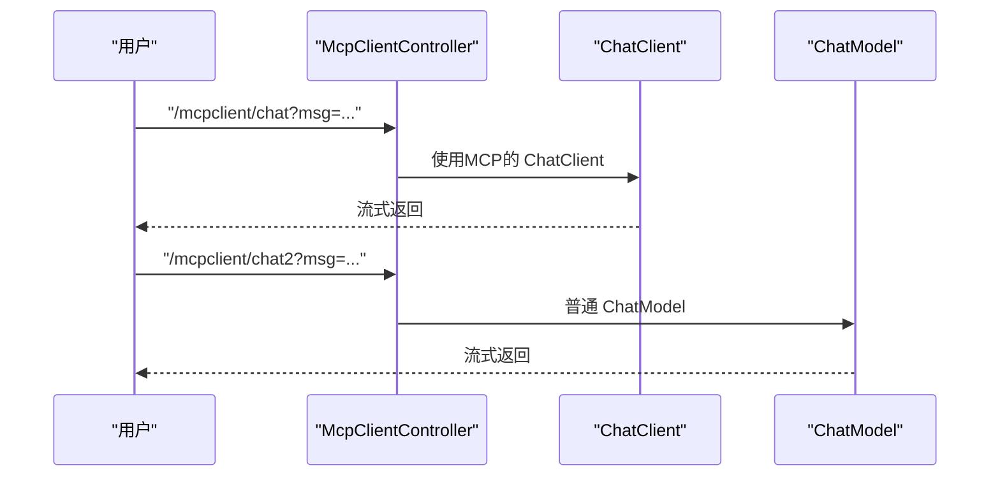
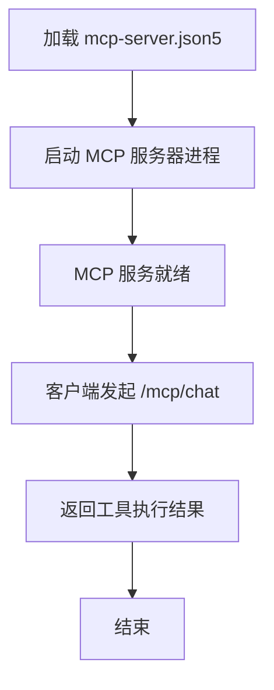
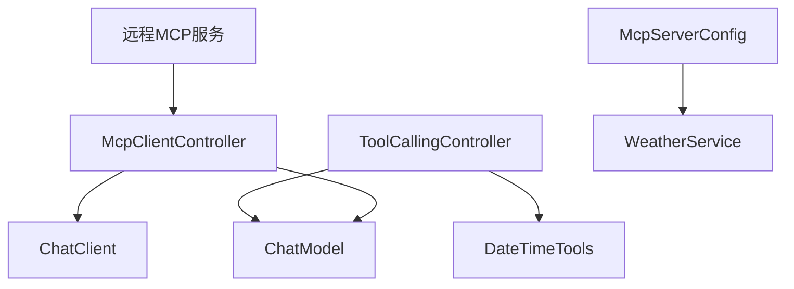

# 工具集成与自动化

<cite>
**本文引用的文件**   
- [SAA-13ToolCalling/src/main/java/com/atguigu/study/controller/ToolCallingController.java](file://【1】SpringAIAlibaba-atguiguV1/SAA-13ToolCalling/src/main/java/com/atguigu/study/controller/ToolCallingController.java)
- [SAA-13ToolCalling/src/main/java/com/atguigu/study/utils/DateTimeTools.java](file://【1】SpringAIAlibaba-atguiguV1/SAA-13ToolCalling/src/main/java/com/atguigu/study/utils/DateTimeTools.java)
- [SAA-13ToolCalling/src/main/java/com/atguigu/study/config/SaaLLMConfig.java](file://【1】SpringAIAlibaba-atguiguV1/SAA-13ToolCalling/src/main/java/com/atguigu/study/config/SaaLLMConfig.java)
- [SAA-14LocalMcpServer/src/main/java/com/atguigu/study/service/WeatherService.java](file://【1】SpringAIAlibaba-atguiguV1/SAA-14LocalMcpServer/src/main/java/com/atguigu/study/service/WeatherService.java)
- [SAA-14LocalMcpServer/src/main/java/com/atguigu/study/config/McpServerConfig.java](file://【1】SpringAIAlibaba-atguiguV1/SAA-14LocalMcpServer/src/main/java/com/atguigu/study/config/McpServerConfig.java)
- [SAA-15LocalMcpClient/src/main/java/com/atguigu/study/controller/McpClientController.java](file://【1】SpringAIAlibaba-atguiguV1/SAA-15LocalMcpClient/src/main/java/com/atguigu/study/controller/McpClientController.java)
- [SAA-16ClientCallBaiduMcpServer/src/main/resources/mcp-server.json5](file://【1】SpringAIAlibaba-atguiguV1/SAA-16ClientCallBaiduMcpServer/src/main/resources/mcp-server.json5)
- [SAA-16ClientCallBaiduMcpServer/src/main/java/com/atguigu/study/controller/McpClientCallBaiDuMcpController.java](file://【1】SpringAIAlibaba-atguiguV1/SAA-16ClientCallBaiduMcpServer/src/main/java/com/atguigu/study/controller/McpClientCallBaiDuMcpController.java)
- [SAA-13ToolCalling/src/main/resources/application.properties](file://【1】SpringAIAlibaba-atguiguV1/SAA-13ToolCalling/src/main/resources/application.properties)
- [SAA-14LocalMcpServer/src/main/resources/application.properties](file://【1】SpringAIAlibaba-atguiguV1/SAA-14LocalMcpServer/src/main/resources/application.properties)
- [SAA-15LocalMcpClient/src/main/resources/application.properties](file://【1】SpringAIAlibaba-atguiguV1/SAA-15LocalMcpClient/src/main/resources/application.properties)
- [SAA-16ClientCallBaiduMcpServer/src/main/resources/application.properties](file://【1】SpringAIAlibaba-atguiguV1/SAA-16ClientCallBaiduMcpServer/src/main/resources/application.properties)
</cite>

## 目录
1. [引言](#引言)
2. [项目结构](#项目结构)
3. [核心组件](#核心组件)
4. [架构总览](#架构总览)
5. [详细组件分析](#详细组件分析)
6. [依赖分析](#依赖分析)
7. [性能考虑](#性能考虑)
8. [故障排查指南](#故障排查指南)
9. [结论](#结论)
10. [附录](#附录)

## 引言
本指南围绕“工具集成与自动化”主题，系统讲解如何在统一开发工作流中整合多种AI工具，覆盖工具发现、调用与管理的最佳实践；从单工具使用到复杂工具链集成的完整方案；结合 Spring AI Alibaba 的工具调用能力，给出可落地的实现路径。同时，文档提供错误处理、重试机制、超时控制与监控告警的实现思路，并补充自动化脚本、批处理任务与 CI/CD 集成的实用技巧。

## 项目结构
本仓库以“Spring AI Alibaba 教学项目”为主线，围绕工具调用与 MCP（Model Context Protocol）展开，形成“工具定义-工具注册-客户端调用-远程MCP服务”的闭环。关键模块如下：
- SAA-13ToolCalling：演示基于注解的工具定义与工具回调集成，支持同步与流式响应。
- SAA-14LocalMcpServer：本地MCP服务器，将业务工具暴露为外部客户端可用的工具集。
- SAA-15LocalMcpClient：本地MCP客户端，演示通过 ChatClient 进行MCP调用与普通模型调用对比。
- SAA-16ClientCallBaiduMcpServer：演示通过配置文件启动第三方MCP服务器（如百度地图MCP），并在客户端发起调用。

**章节来源**
- [SAA-13ToolCalling/src/main/java/com/atguigu/study/controller/ToolCallingController.java:1-57](file://【1】SpringAIAlibaba-atguiguV1/SAA-13ToolCalling/src/main/java/com/atguigu/study/controller/ToolCallingController.java#L1-L57)
- [SAA-14LocalMcpServer/src/main/java/com/atguigu/study/service/WeatherService.java:1-27](file://【1】SpringAIAlibaba-atguiguV1/SAA-14LocalMcpServer/src/main/java/com/atguigu/study/service/WeatherService.java#L1-L27)
- [SAA-15LocalMcpClient/src/main/java/com/atguigu/study/controller/McpClientController.java:1-42](file://【1】SpringAIAlibaba-atguiguV1/SAA-15LocalMcpClient/src/main/java/com/atguigu/study/controller/McpClientController.java#L1-L42)
- [SAA-16ClientCallBaiduMcpServer/src/main/java/com/atguigu/study/controller/McpClientCallBaiDuMcpController.java:1-52](file://【1】SpringAIAlibaba-atguiguV1/SAA-16ClientCallBaiduMcpServer/src/main/java/com/atguigu/study/controller/McpClientCallBaiDuMcpController.java#L1-L52)

## 核心组件
- 工具定义与调用控制器（SAA-13ToolCalling）
  - 通过工具回调注册工具，支持同步与流式调用。
  - 关键点：工具注册、ChatOptions配置、Prompt构建与调用。
- 内置工具（DateTimeTools）
  - 基于注解声明工具，描述与返回策略（是否直接返回）。
- 本地MCP服务器（SAA-14LocalMcpServer）
  - 将业务服务作为工具暴露，供外部客户端调用。
  - 关键点：MethodToolCallbackProvider 注册工具对象。
- 本地MCP客户端（SAA-15LocalMcpClient）
  - 对比MCP启用与禁用两种调用方式，验证MCP能力差异。
- 远程MCP客户端（SAA-16ClientCallBaiduMcpServer）
  - 通过配置文件启动第三方MCP服务，客户端发起调用。
  - 关键点：mcp-server.json5 配置与环境变量注入。

**章节来源**
- [SAA-13ToolCalling/src/main/java/com/atguigu/study/controller/ToolCallingController.java:23-43](file://【1】SpringAIAlibaba-atguiguV1/SAA-13ToolCalling/src/main/java/com/atguigu/study/controller/ToolCallingController.java#L23-L43)
- [SAA-13ToolCalling/src/main/java/com/atguigu/study/utils/DateTimeTools.java:12-25](file://【1】SpringAIAlibaba-atguiguV1/SAA-13ToolCalling/src/main/java/com/atguigu/study/utils/DateTimeTools.java#L12-L25)
- [SAA-14LocalMcpServer/src/main/java/com/atguigu/study/config/McpServerConfig.java:16-30](file://【1】SpringAIAlibaba-atguiguV1/SAA-14LocalMcpServer/src/main/java/com/atguigu/study/config/McpServerConfig.java#L16-L30)
- [SAA-15LocalMcpClient/src/main/java/com/atguigu/study/controller/McpClientController.java:27-40](file://【1】SpringAIAlibaba-atguiguV1/SAA-15LocalMcpClient/src/main/java/com/atguigu/study/controller/McpClientController.java#L27-L40)
- [SAA-16ClientCallBaiduMcpServer/src/main/resources/mcp-server.json5:1-23](file://【1】SpringAIAlibaba-atguiguV1/SAA-16ClientCallBaiduMcpServer/src/main/resources/mcp-server.json5#L1-L23)

## 架构总览
下图展示了从工具定义到调用的端到端流程，以及本地与远程MCP的两种调用模式：

**图表来源**
- [SAA-13ToolCalling/src/main/java/com/atguigu/study/controller/ToolCallingController.java:29-55](file://【1】SpringAIAlibaba-atguiguV1/SAA-13ToolCalling/src/main/java/com/atguigu/study/controller/ToolCallingController.java#L29-L55)
- [SAA-15LocalMcpClient/src/main/java/com/atguigu/study/controller/McpClientController.java:27-40](file://【1】SpringAIAlibaba-atguiguV1/SAA-15LocalMcpClient/src/main/java/com/atguigu/study/controller/McpClientController.java#L27-L40)
- [SAA-16ClientCallBaiduMcpServer/src/main/java/com/atguigu/study/controller/McpClientCallBaiDuMcpController.java:33-49](file://【1】SpringAIAlibaba-atguiguV1/SAA-16ClientCallBaiduMcpServer/src/main/java/com/atguigu/study/controller/McpClientCallBaiDuMcpController.java#L33-L49)

## 详细组件分析

### 组件A：工具定义与调用（SAA-13ToolCalling）
- 功能要点
  - 工具注册：通过工具回调将工具加入调用上下文。
  - ChatOptions配置：设置工具回调，控制工具调用行为。
  - Prompt构建与调用：同步与流式两种调用方式。
- 数据结构与复杂度
  - 工具注册为 O(1)，调用复杂度取决于模型推理与网络延迟。
- 错误处理与边界
  - 缺省参数保障基本可用性；建议在生产环境增加输入校验与异常捕获。
- 性能影响
  - 流式输出提升交互体验；工具调用可能引入额外延迟。

**图表来源**
- [SAA-13ToolCalling/src/main/java/com/atguigu/study/controller/ToolCallingController.java:32-42](file://【1】SpringAIAlibaba-atguiguV1/SAA-13ToolCalling/src/main/java/com/atguigu/study/controller/ToolCallingController.java#L32-L42)

**章节来源**
- [SAA-13ToolCalling/src/main/java/com/atguigu/study/controller/ToolCallingController.java:23-55](file://【1】SpringAIAlibaba-atguiguV1/SAA-13ToolCalling/src/main/java/com/atguigu/study/controller/ToolCallingController.java#L23-L55)
- [SAA-13ToolCalling/src/main/java/com/atguigu/study/utils/DateTimeTools.java:12-25](file://【1】SpringAIAlibaba-atguiguV1/SAA-13ToolCalling/src/main/java/com/atguigu/study/utils/DateTimeTools.java#L12-L25)
- [SAA-13ToolCalling/src/main/java/com/atguigu/study/config/SaaLLMConfig.java:14-21](file://【1】SpringAIAlibaba-atguiguV1/SAA-13ToolCalling/src/main/java/com/atguigu/study/config/SaaLLMConfig.java#L14-L21)

### 组件B：本地MCP服务器（SAA-14LocalMcpServer）
- 功能要点
  - 将业务服务暴露为工具，供外部客户端调用。
  - 使用 MethodToolCallbackProvider 注册工具对象。
- 类关系

**图表来源**
- [SAA-14LocalMcpServer/src/main/java/com/atguigu/study/service/WeatherService.java:14-27](file://【1】SpringAIAlibaba-atguiguV1/SAA-14LocalMcpServer/src/main/java/com/atguigu/study/service/WeatherService.java#L14-L27)
- [SAA-14LocalMcpServer/src/main/java/com/atguigu/study/config/McpServerConfig.java:23-29](file://【1】SpringAIAlibaba-atguiguV1/SAA-14LocalMcpServer/src/main/java/com/atguigu/study/config/McpServerConfig.java#L23-L29)

**章节来源**
- [SAA-14LocalMcpServer/src/main/java/com/atguigu/study/service/WeatherService.java:14-27](file://【1】SpringAIAlibaba-atguiguV1/SAA-14LocalMcpServer/src/main/java/com/atguigu/study/service/WeatherService.java#L14-L27)
- [SAA-14LocalMcpServer/src/main/java/com/atguigu/study/config/McpServerConfig.java:16-30](file://【1】SpringAIAlibaba-atguiguV1/SAA-14LocalMcpServer/src/main/java/com/atguigu/study/config/McpServerConfig.java#L16-L30)

### 组件C：本地MCP客户端（SAA-15LocalMcpClient）
- 功能要点
  - 对比启用与禁用MCP两种调用路径，验证MCP能力差异。
  - 支持流式输出，改善用户体验。
- 调用序列

**图表来源**
- [SAA-15LocalMcpClient/src/main/java/com/atguigu/study/controller/McpClientController.java:27-40](file://【1】SpringAIAlibaba-atguiguV1/SAA-15LocalMcpClient/src/main/java/com/atguigu/study/controller/McpClientController.java#L27-L40)

**章节来源**
- [SAA-15LocalMcpClient/src/main/java/com/atguigu/study/controller/McpClientController.java:18-42](file://【1】SpringAIAlibaba-atguiguV1/SAA-15LocalMcpClient/src/main/java/com/atguigu/study/controller/McpClientController.java#L18-L42)

### 组件D：远程MCP客户端（SAA-16ClientCallBaiduMcpServer）
- 功能要点
  - 通过配置文件启动第三方MCP服务（如百度地图MCP）。
  - 客户端通过 ChatClient 发起调用，实现跨进程/跨服务的工具链集成。
- 配置说明
  - mcp-server.json5 中定义命令、参数与环境变量，确保MCP服务可用。
  - 客户端控制器提供两条路由：启用MCP与禁用MCP的对比。

**图表来源**
- [SAA-16ClientCallBaiduMcpServer/src/main/resources/mcp-server.json5:1-23](file://【1】SpringAIAlibaba-atguiguV1/SAA-16ClientCallBaiduMcpServer/src/main/resources/mcp-server.json5#L1-L23)
- [SAA-16ClientCallBaiduMcpServer/src/main/java/com/atguigu/study/controller/McpClientCallBaiDuMcpController.java:33-49](file://【1】SpringAIAlibaba-atguiguV1/SAA-16ClientCallBaiduMcpServer/src/main/java/com/atguigu/study/controller/McpClientCallBaiDuMcpController.java#L33-L49)

**章节来源**
- [SAA-16ClientCallBaiduMcpServer/src/main/resources/mcp-server.json5:1-23](file://【1】SpringAIAlibaba-atguiguV1/SAA-16ClientCallBaiduMcpServer/src/main/resources/mcp-server.json5#L1-L23)
- [SAA-16ClientCallBaiduMcpServer/src/main/java/com/atguigu/study/controller/McpClientCallBaiDuMcpController.java:16-52](file://【1】SpringAIAlibaba-atguiguV1/SAA-16ClientCallBaiduMcpServer/src/main/java/com/atguigu/study/controller/McpClientCallBaiDuMcpController.java#L16-L52)

## 依赖分析
- 组件内聚与耦合
  - 工具定义与调用模块内聚高，与模型层解耦，便于扩展。
  - MCP 服务与客户端通过配置文件解耦，便于替换与扩展。
- 外部依赖
  - Spring AI Alibaba 的 ChatClient、ChatModel、工具回调等组件。
  - MCP 服务器（本地或远程）的进程与环境变量配置。

**图表来源**
- [SAA-13ToolCalling/src/main/java/com/atguigu/study/controller/ToolCallingController.java:26-27](file://【1】SpringAIAlibaba-atguiguV1/SAA-13ToolCalling/src/main/java/com/atguigu/study/controller/ToolCallingController.java#L26-L27)
- [SAA-14LocalMcpServer/src/main/java/com/atguigu/study/config/McpServerConfig.java:24-28](file://【1】SpringAIAlibaba-atguiguV1/SAA-14LocalMcpServer/src/main/java/com/atguigu/study/config/McpServerConfig.java#L24-L28)
- [SAA-15LocalMcpClient/src/main/java/com/atguigu/study/controller/McpClientController.java:21-25](file://【1】SpringAIAlibaba-atguiguV1/SAA-15LocalMcpClient/src/main/java/com/atguigu/study/controller/McpClientController.java#L21-L25)

**章节来源**
- [SAA-13ToolCalling/src/main/java/com/atguigu/study/controller/ToolCallingController.java:23-55](file://【1】SpringAIAlibaba-atguiguV1/SAA-13ToolCalling/src/main/java/com/atguigu/study/controller/ToolCallingController.java#L23-L55)
- [SAA-14LocalMcpServer/src/main/java/com/atguigu/study/config/McpServerConfig.java:16-30](file://【1】SpringAIAlibaba-atguiguV1/SAA-14LocalMcpServer/src/main/java/com/atguigu/study/config/McpServerConfig.java#L16-L30)
- [SAA-15LocalMcpClient/src/main/java/com/atguigu/study/controller/McpClientController.java:18-42](file://【1】SpringAIAlibaba-atguiguV1/SAA-15LocalMcpClient/src/main/java/com/atguigu/study/controller/McpClientController.java#L18-L42)

## 性能考虑
- 流式输出
  - 使用流式接口提升交互体验，降低首字节延迟。
- 工具调用开销
  - 工具执行与模型推理叠加，建议对热点工具进行缓存与预热。
- 并发与限流
  - 在网关或控制器层实施限流与熔断，避免工具链过载。
- 资源隔离
  - MCP 服务独立部署，避免与主应用争抢资源。

## 故障排查指南
- 工具未生效
  - 检查工具是否正确注册到工具回调；确认 ChatOptions 是否包含工具配置。
- MCP 无法连接
  - 校验 mcp-server.json5 的命令、参数与环境变量；确认服务已启动且端口可用。
- 流式输出中断
  - 检查网络稳定性与超时设置；必要时增加重试与背压策略。
- 日志与监控
  - 记录工具调用耗时、失败率与重试次数；对接指标系统进行告警。

**章节来源**
- [SAA-13ToolCalling/src/main/java/com/atguigu/study/controller/ToolCallingController.java:32-42](file://【1】SpringAIAlibaba-atguiguV1/SAA-13ToolCalling/src/main/java/com/atguigu/study/controller/ToolCallingController.java#L32-L42)
- [SAA-16ClientCallBaiduMcpServer/src/main/resources/mcp-server.json5:1-23](file://【1】SpringAIAlibaba-atguiguV1/SAA-16ClientCallBaiduMcpServer/src/main/resources/mcp-server.json5#L1-L23)

## 结论
通过本指南的实践路径，可在统一工作流中高效整合多种AI工具，实现从单工具到复杂工具链的演进。借助 Spring AI Alibaba 的工具回调与 MCP 协议，既能满足本地工具的灵活扩展，也能接入远程工具服务，最终达成可维护、可观测、可扩展的自动化体系。

## 附录
- 自动化脚本与批处理
  - 利用流式接口与批量消息队列，实现异步批处理与结果聚合。
- CI/CD 集成
  - 在流水线中增加工具可用性检查与性能回归测试，确保工具链稳定性。
- 配置与环境
  - 统一管理 application.properties 与 mcp-server.json5，按环境区分配置文件。

**章节来源**
- [SAA-13ToolCalling/src/main/resources/application.properties](file://【1】SpringAIAlibaba-atguiguV1/SAA-13ToolCalling/src/main/resources/application.properties)
- [SAA-14LocalMcpServer/src/main/resources/application.properties](file://【1】SpringAIAlibaba-atguiguV1/SAA-14LocalMcpServer/src/main/resources/application.properties)
- [SAA-15LocalMcpClient/src/main/resources/application.properties](file://【1】SpringAIAlibaba-atguiguV1/SAA-15LocalMcpClient/src/main/resources/application.properties)
- [SAA-16ClientCallBaiduMcpServer/src/main/resources/application.properties](file://【1】SpringAIAlibaba-atguiguV1/SAA-16ClientCallBaiduMcpServer/src/main/resources/application.properties)