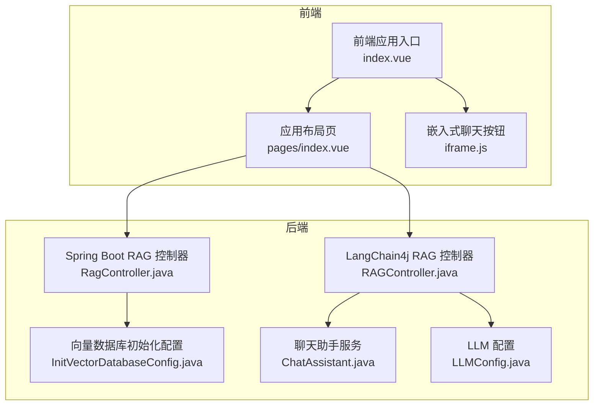
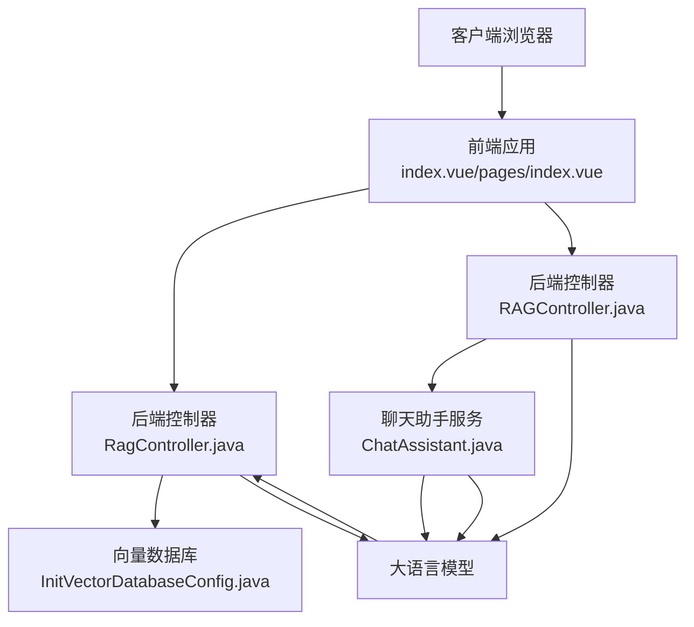
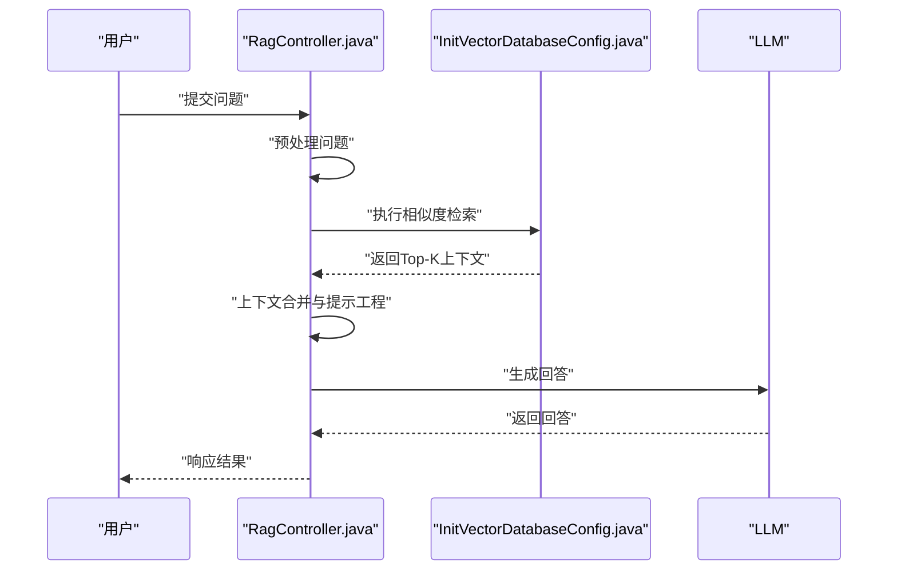
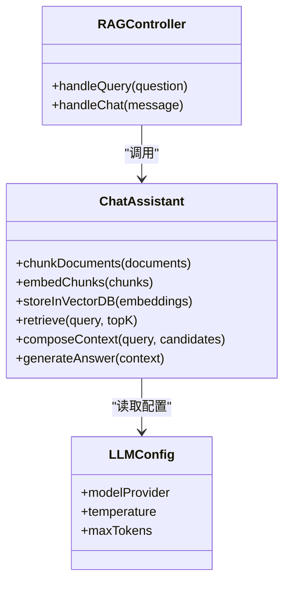
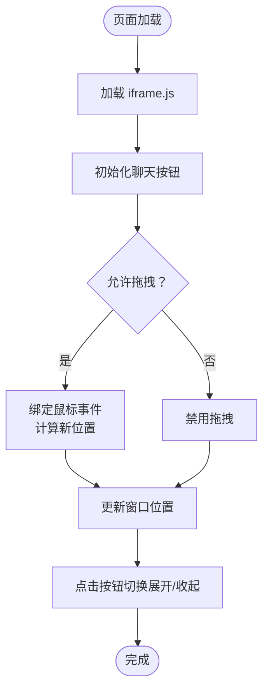
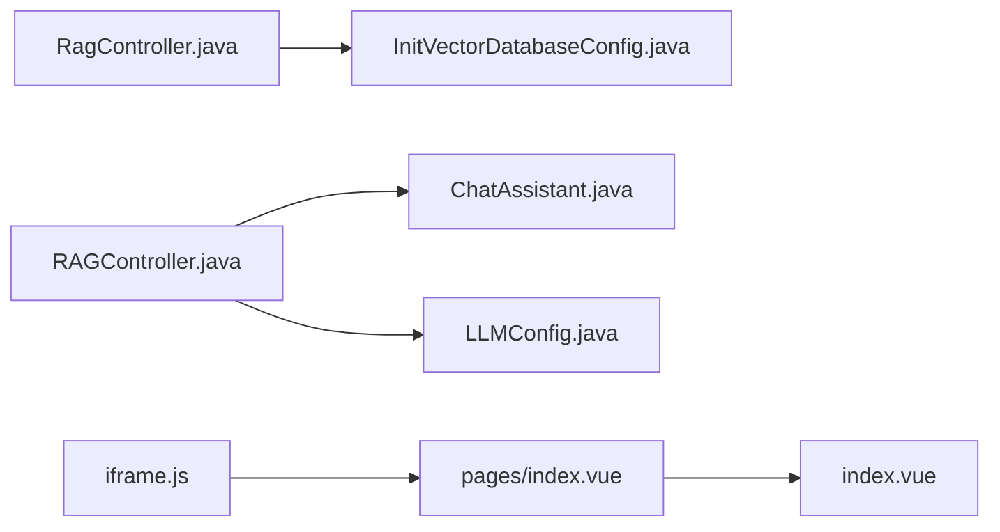

# LangChain RAG系统

<cite>
**本文引用的文件**
- [SAA-12RAG4AiOps/RagController.java](file://【1】SpringAIAlibaba-atguiguV1/SAA-12RAG4AiOps/src/main/java/com/atguigu/study/controller/RagController.java)
- [SAA-12RAG4AiOps/InitVectorDatabaseConfig.java](file://【1】SpringAIAlibaba-atguiguV1/SAA-12RAG4AiOps/src/main/java/com/atguigu/study/config/InitVectorDatabaseConfig.java)
- [SAA-12RAG4AiOps/application.properties](file://【1】SpringAIAlibaba-atguiguV1/SAA-12RAG4AiOps/src/main/resources/application.properties)
- [SAA-12RAG4AiOps/ops.txt](file://【1】SpringAIAlibaba-atguiguV1/SAA-12RAG4AiOps/src/main/resources/ops.txt)
- [langchain4j-13chat-rag01/RAGController.java](file://【2】langchain4j-atguiguV5/langchain4j-13chat-rag01/src/main/java/com/atguigu/study/controller/RAGController.java)
- [langchain4j-13chat-rag01/ChatAssistant.java](file://【2】langchain4j-atguiguV5/langchain4j-13chat-rag01/src/main/java/com/atguigu/study/service/ChatAssistant.java)
- [langchain4j-13chat-rag01/LLMConfig.java](file://【2】langchain4j-atguiguV5/langchain4j-13chat-rag01/src/main/java/com/atguigu/study/config/LLMConfig.java)
- [langchain4j-13chat-rag01/application.properties](file://【2】langchain4j-atguiguV5/langchain4j-13chat-rag01/src/main/resources/application.properties)
- [langchain4j-13chat-rag01/ops.txt](file://【2】langchain4j-atguiguV5/langchain4j-13chat-rag01/src/main/resources/ops.txt)
- [nlp-agent/RagController.java](file://【3】工作资料/code/仓颉智能体/nlp-agent/agent-worker/src/main/java/com/yundingtech/agent/work/modules/workflow/controller/RagController.java)
- [nlp-frontend/index.vue](file://【3】工作资料/code/仓颉智能体/nlp-frontend-web/src/views/workspace/pages/workApps/index.vue)
- [nlp-frontend/layout.vue](file://【3】工作资料/code/仓颉智能体/nlp-frontend-web/src/views/workspace/pages/workApps/pages/index.vue)
- [iframe.js](file://【3】工作资料/code/仓颉智能体/nlp-frontend-web/public/iframe.js)
</cite>

## 目录
1. [引言](#引言)
2. [项目结构](#项目结构)
3. [核心组件](#核心组件)
4. [架构总览](#架构总览)
5. [详细组件分析](#详细组件分析)
6. [依赖分析](#依赖分析)
7. [性能考虑](#性能考虑)
8. [故障排查指南](#故障排查指南)
9. [结论](#结论)
10. [附录](#附录)

## 引言
本技术指南围绕LangChain RAG（检索增强生成）系统，系统性阐述向量嵌入、向量数据库集成、相似度检索与上下文合并等核心技术，并结合仓库中的Spring Boot与LangChain4j实现，给出从文档预处理、向量化、索引建立到查询优化的完整RAG管道构建方法。同时提供可直接定位到源码位置的参考路径，便于读者在实际工程中落地。

## 项目结构
本仓库包含三类RAG相关实现与配套前端：
- Spring Boot + LangChain4j 实现：langchain4j-13chat-rag01
- Spring Boot + 自研向量数据库初始化：SAA-12RAG4AiOps
- 前端集成与应用布局：nlp-frontend-web
- 仓颉智能体后端RAG控制器：nlp-agent

**图表来源**
- [SAA-12RAG4AiOps/RagController.java:1-200](file://【1】SpringAIAlibaba-atguiguV1/SAA-12RAG4AiOps/src/main/java/com/atguigu/study/controller/RagController.java#L1-L200)
- [SAA-12RAG4AiOps/InitVectorDatabaseConfig.java:1-200](file://【1】SpringAIAlibaba-atguiguV1/SAA-12RAG4AiOps/src/main/java/com/atguigu/study/config/InitVectorDatabaseConfig.java#L1-L200)
- [langchain4j-13chat-rag01/RAGController.java:1-200](file://【2】langchain4j-atguiguV5/langchain4j-13chat-rag01/src/main/java/com/atguigu/study/controller/RAGController.java#L1-L200)
- [langchain4j-13chat-rag01/ChatAssistant.java:1-200](file://【2】langchain4j-atguiguV5/langchain4j-13chat-rag01/src/main/java/com/atguigu/study/service/ChatAssistant.java#L1-L200)
- [nlp-frontend/index.vue:150-200](file://【3】工作资料/code/仓颉智能体/nlp-frontend-web/src/views/workspace/pages/workApps/index.vue#L150-L200)
- [nlp-frontend/layout.vue:360-420](file://【3】工作资料/code/仓颉智能体/nlp-frontend-web/src/views/workspace/pages/workApps/pages/index.vue#L360-L420)
- [iframe.js:1-168](file://【3】工作资料/code/仓颉智能体/nlp-frontend-web/public/iframe.js#L1-L168)

**章节来源**
- [SAA-12RAG4AiOps/RagController.java:1-200](file://【1】SpringAIAlibaba-atguiguV1/SAA-12RAG4AiOps/src/main/java/com/atguigu/study/controller/RagController.java#L1-L200)
- [langchain4j-13chat-rag01/RAGController.java:1-200](file://【2】langchain4j-atguiguV5/langchain4j-13chat-rag01/src/main/java/com/atguigu/study/controller/RAGController.java#L1-L200)
- [nlp-frontend/index.vue:150-200](file://【3】工作资料/code/仓颉智能体/nlp-frontend-web/src/views/workspace/pages/workApps/index.vue#L150-L200)

## 核心组件
- 向量嵌入与向量数据库集成：通过初始化配置完成向量维度、距离度量、索引参数等设置，支撑后续相似度检索。
- 相似度检索：基于向量数据库执行近似最近邻（ANN）检索，返回Top-K候选片段。
- 上下文合并与提示工程：将检索到的上下文与用户问题组合，经由LLM生成最终回答。
- 前端嵌入与应用布局：提供可拖拽的聊天按钮、应用配置面板与检索配置项，便于RAG能力的可视化集成。

**章节来源**
- [SAA-12RAG4AiOps/InitVectorDatabaseConfig.java:1-200](file://【1】SpringAIAlibaba-atguiguV1/SAA-12RAG4AiOps/src/main/java/com/atguigu/study/config/InitVectorDatabaseConfig.java#L1-L200)
- [SAA-12RAG4AiOps/RagController.java:1-200](file://【1】SpringAIAlibaba-atguiguV1/SAA-12RAG4AiOps/src/main/java/com/atguigu/study/controller/RagController.java#L1-L200)
- [langchain4j-13chat-rag01/ChatAssistant.java:1-200](file://【2】langchain4j-atguiguV5/langchain4j-13chat-rag01/src/main/java/com/atguigu/study/service/ChatAssistant.java#L1-L200)
- [nlp-frontend/layout.vue:360-420](file://【3】工作资料/code/仓颉智能体/nlp-frontend-web/src/views/workspace/pages/workApps/pages/index.vue#L360-L420)

## 架构总览
RAG系统由“前端应用层”、“后端服务层”和“向量数据库层”构成。前端负责交互与配置；后端负责文档预处理、向量化、索引与检索；向量数据库提供高效相似度检索能力。

**图表来源**
- [SAA-12RAG4AiOps/RagController.java:1-200](file://【1】SpringAIAlibaba-atguiguV1/SAA-12RAG4AiOps/src/main/java/com/atguigu/study/controller/RagController.java#L1-L200)
- [SAA-12RAG4AiOps/InitVectorDatabaseConfig.java:1-200](file://【1】SpringAIAlibaba-atguiguV1/SAA-12RAG4AiOps/src/main/java/com/atguigu/study/config/InitVectorDatabaseConfig.java#L1-L200)
- [langchain4j-13chat-rag01/RAGController.java:1-200](file://【2】langchain4j-atguiguV5/langchain4j-13chat-rag01/src/main/java/com/atguigu/study/controller/RAGController.java#L1-L200)
- [langchain4j-13chat-rag01/ChatAssistant.java:1-200](file://【2】langchain4j-atguiguV5/langchain4j-13chat-rag01/src/main/java/com/atguigu/study/service/ChatAssistant.java#L1-L200)

## 详细组件分析

### 组件A：Spring Boot RAG控制器（SAA-12RAG4AiOps）
该组件提供RAG查询入口，负责接收用户问题，执行向量检索并返回结果。其核心职责包括：
- 接收查询请求并进行预处理
- 调用向量数据库执行相似度检索
- 将检索结果与提示模板拼接后交给LLM生成答案
- 返回最终回答

**图表来源**
- [SAA-12RAG4AiOps/RagController.java:1-200](file://【1】SpringAIAlibaba-atguiguV1/SAA-12RAG4AiOps/src/main/java/com/atguigu/study/controller/RagController.java#L1-L200)
- [SAA-12RAG4AiOps/InitVectorDatabaseConfig.java:1-200](file://【1】SpringAIAlibaba-atguiguV1/SAA-12RAG4AiOps/src/main/java/com/atguigu/study/config/InitVectorDatabaseConfig.java#L1-L200)

**章节来源**
- [SAA-12RAG4AiOps/RagController.java:1-200](file://【1】SpringAIAlibaba-atguiguV1/SAA-12RAG4AiOps/src/main/java/com/atguigu/study/controller/RagController.java#L1-L200)
- [SAA-12RAG4AiOps/InitVectorDatabaseConfig.java:1-200](file://【1】SpringAIAlibaba-atguiguV1/SAA-12RAG4AiOps/src/main/java/com/atguigu/study/config/InitVectorDatabaseConfig.java#L1-L200)

### 组件B：LangChain4j RAG控制器与聊天助手（langchain4j-13chat-rag01）
该组件以LangChain4j为核心，封装了完整的RAG流程：
- RAGController：对外提供REST接口，接收问题并委派给ChatAssistant
- ChatAssistant：负责文档分块、嵌入、检索、上下文合并与LLM调用
- LLMConfig：集中管理LLM参数与模型配置

**图表来源**
- [langchain4j-13chat-rag01/RAGController.java:1-200](file://【2】langchain4j-atguiguV5/langchain4j-13chat-rag01/src/main/java/com/atguigu/study/controller/RAGController.java#L1-L200)
- [langchain4j-13chat-rag01/ChatAssistant.java:1-200](file://【2】langchain4j-atguiguV5/langchain4j-13chat-rag01/src/main/java/com/atguigu/study/service/ChatAssistant.java#L1-L200)
- [langchain4j-13chat-rag01/LLMConfig.java:1-200](file://【2】langchain4j-atguiguV5/langchain4j-13chat-rag01/src/main/java/com/atguigu/study/config/LLMConfig.java#L1-L200)

**章节来源**
- [langchain4j-13chat-rag01/RAGController.java:1-200](file://【2】langchain4j-atguiguV5/langchain4j-13chat-rag01/src/main/java/com/atguigu/study/controller/RAGController.java#L1-L200)
- [langchain4j-13chat-rag01/ChatAssistant.java:1-200](file://【2】langchain4j-atguiguV5/langchain4j-13chat-rag01/src/main/java/com/atguigu/study/service/ChatAssistant.java#L1-L200)
- [langchain4j-13chat-rag01/LLMConfig.java:1-200](file://【2】langchain4j-atguiguV5/langchain4j-13chat-rag01/src/main/java/com/atguigu/study/config/LLMConfig.java#L1-L200)

### 组件C：前端嵌入与应用布局（nlp-frontend-web）
前端提供可拖拽的聊天按钮与应用配置面板，支持RAG能力的可视化集成：
- iframe.js：实现聊天按钮的拖拽、展开/收起与窗口尺寸控制
- index.vue：应用列表与标签页筛选
- pages/index.vue：应用布局页，承载RAG配置项（如检索配置）

**图表来源**
- [iframe.js:1-168](file://【3】工作资料/code/仓颉智能体/nlp-frontend-web/public/iframe.js#L1-L168)
- [nlp-frontend/index.vue:150-200](file://【3】工作资料/code/仓颉智能体/nlp-frontend-web/src/views/workspace/pages/workApps/index.vue#L150-L200)
- [nlp-frontend/layout.vue:360-420](file://【3】工作资料/code/仓颉智能体/nlp-frontend-web/src/views/workspace/pages/workApps/pages/index.vue#L360-L420)

**章节来源**
- [iframe.js:1-168](file://【3】工作资料/code/仓颉智能体/nlp-frontend-web/public/iframe.js#L1-L168)
- [nlp-frontend/index.vue:150-200](file://【3】工作资料/code/仓颉智能体/nlp-frontend-web/src/views/workspace/pages/workApps/index.vue#L150-L200)
- [nlp-frontend/layout.vue:360-420](file://【3】工作资料/code/仓颉智能体/nlp-frontend-web/src/views/workspace/pages/workApps/pages/index.vue#L360-L420)

### 组件D：仓颉智能体RAG控制器（nlp-agent）
该控制器位于智能体工作流模块，提供RAG能力的后端接口，便于与工具链、流程编排集成。

**章节来源**
- [nlp-agent/RagController.java:1-200](file://【3】工作资料/code/仓颉智能体/nlp-agent/agent-worker/src/main/java/com/yundingtech/agent/work/modules/workflow/controller/RagController.java#L1-L200)

## 依赖分析
- 后端依赖关系
  - Spring Boot应用通过控制器调用向量数据库初始化配置或LangChain4j服务
  - LangChain4j组件内部依赖LLM配置与聊天助手服务
- 前端依赖关系
  - 嵌入式脚本依赖浏览器环境与DOM操作
  - 应用布局依赖路由与会话存储的应用配置

**图表来源**
- [SAA-12RAG4AiOps/RagController.java:1-200](file://【1】SpringAIAlibaba-atguiguV1/SAA-12RAG4AiOps/src/main/java/com/atguigu/study/controller/RagController.java#L1-L200)
- [SAA-12RAG4AiOps/InitVectorDatabaseConfig.java:1-200](file://【1】SpringAIAlibaba-atguiguV1/SAA-12RAG4AiOps/src/main/java/com/atguigu/study/config/InitVectorDatabaseConfig.java#L1-L200)
- [langchain4j-13chat-rag01/RAGController.java:1-200](file://【2】langchain4j-atguiguV5/langchain4j-13chat-rag01/src/main/java/com/atguigu/study/controller/RAGController.java#L1-L200)
- [langchain4j-13chat-rag01/ChatAssistant.java:1-200](file://【2】langchain4j-atguiguV5/langchain4j-13chat-rag01/src/main/java/com/atguigu/study/service/ChatAssistant.java#L1-L200)
- [langchain4j-13chat-rag01/LLMConfig.java:1-200](file://【2】langchain4j-atguiguV5/langchain4j-13chat-rag01/src/main/java/com/atguigu/study/config/LLMConfig.java#L1-L200)
- [nlp-frontend/layout.vue:360-420](file://【3】工作资料/code/仓颉智能体/nlp-frontend-web/src/views/workspace/pages/workApps/pages/index.vue#L360-L420)
- [nlp-frontend/index.vue:150-200](file://【3】工作资料/code/仓颉智能体/nlp-frontend-web/src/views/workspace/pages/workApps/index.vue#L150-L200)
- [iframe.js:1-168](file://【3】工作资料/code/仓颉智能体/nlp-frontend-web/public/iframe.js#L1-L168)

**章节来源**
- [SAA-12RAG4AiOps/RagController.java:1-200](file://【1】SpringAIAlibaba-atguiguV1/SAA-12RAG4AiOps/src/main/java/com/atguigu/study/controller/RagController.java#L1-L200)
- [langchain4j-13chat-rag01/RAGController.java:1-200](file://【2】langchain4j-atguiguV5/langchain4j-13chat-rag01/src/main/java/com/atguigu/study/controller/RAGController.java#L1-L200)

## 性能考虑
- 向量维度与索引参数
  - 在向量数据库初始化配置中合理设置维度与索引参数，可显著影响检索速度与精度。建议根据数据规模与硬件资源进行权衡。
- Top-K与过滤策略
  - 检索时采用Top-K并结合阈值过滤，避免无关上下文污染回答质量。
- 缓存与批处理
  - 对高频查询结果进行缓存；对批量嵌入与检索进行批处理，减少网络往返与模型调用开销。
- 分块与重叠策略
  - 文档分块大小与重叠比例直接影响召回效果；过小导致碎片化，过大则降低检索效率。
- LLM参数调优
  - 通过温度、最大生成长度等参数平衡多样性与稳定性，避免冗长或不相关回答。

[本节为通用性能建议，无需特定文件来源]

## 故障排查指南
- 向量数据库连接失败
  - 检查初始化配置中的连接参数与索引设置是否正确，确认服务可用性与网络连通性。
- 检索结果为空
  - 核对输入问题是否经过清洗与标准化；检查向量维度与索引是否匹配；确认Top-K与阈值设置合理。
- 前端按钮无法拖拽或展开
  - 检查iframe脚本是否正确加载；确认CSS样式未覆盖拖拽区域；验证事件绑定是否生效。
- LLM响应异常
  - 查看LLM配置参数是否正确；检查提示模板与上下文拼接逻辑；关注超时与限流策略。

**章节来源**
- [SAA-12RAG4AiOps/InitVectorDatabaseConfig.java:1-200](file://【1】SpringAIAlibaba-atguiguV1/SAA-12RAG4AiOps/src/main/java/com/atguigu/study/config/InitVectorDatabaseConfig.java#L1-L200)
- [SAA-12RAG4AiOps/RagController.java:1-200](file://【1】SpringAIAlibaba-atguiguV1/SAA-12RAG4AiOps/src/main/java/com/atguigu/study/controller/RagController.java#L1-L200)
- [langchain4j-13chat-rag01/LLMConfig.java:1-200](file://【2】langchain4j-atguiguV5/langchain4j-13chat-rag01/src/main/java/com/atguigu/study/config/LLMConfig.java#L1-L200)
- [iframe.js:1-168](file://【3】工作资料/code/仓颉智能体/nlp-frontend-web/public/iframe.js#L1-L168)

## 结论
本指南基于仓库中的Spring Boot与LangChain4j实现，系统梳理了RAG的核心技术栈与工程实践。通过明确的组件划分、清晰的调用序列与可落地的性能优化策略，读者可在实际项目中快速搭建稳定高效的RAG应用。建议结合自身数据特点与业务场景，持续迭代分块策略、检索参数与提示工程，以获得更佳的准确性与性能表现。

[本节为总结性内容，无需特定文件来源]

## 附录
- 配置文件参考
  - [application.properties（SAA-12RAG4AiOps）](file://【1】SpringAIAlibaba-atguiguV1/SAA-12RAG4AiOps/src/main/resources/application.properties)
  - [application.properties（langchain4j-13chat-rag01）](file://【2】langchain4j-atguiguV5/langchain4j-13chat-rag01/src/main/resources/application.properties)
  - [ops.txt（SAA-12RAG4AiOps）](file://【1】SpringAIAlibaba-atguiguV1/SAA-12RAG4AiOps/src/main/resources/ops.txt)
  - [ops.txt（langchain4j-13chat-rag01）](file://【2】langchain4j-atguiguV5/langchain4j-13chat-rag01/src/main/resources/ops.txt)

**章节来源**
- [SAA-12RAG4AiOps/application.properties](file://【1】SpringAIAlibaba-atguiguV1/SAA-12RAG4AiOps/src/main/resources/application.properties)
- [langchain4j-13chat-rag01/application.properties](file://【2】langchain4j-atguiguV5/langchain4j-13chat-rag01/src/main/resources/application.properties)
- [SAA-12RAG4AiOps/ops.txt](file://【1】SpringAIAlibaba-atguiguV1/SAA-12RAG4AiOps/src/main/resources/ops.txt)
- [langchain4j-13chat-rag01/ops.txt](file://【2】langchain4j-atguiguV5/langchain4j-13chat-rag01/src/main/resources/ops.txt)