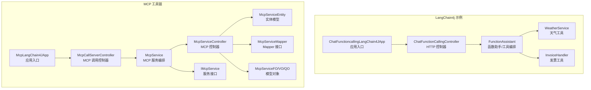
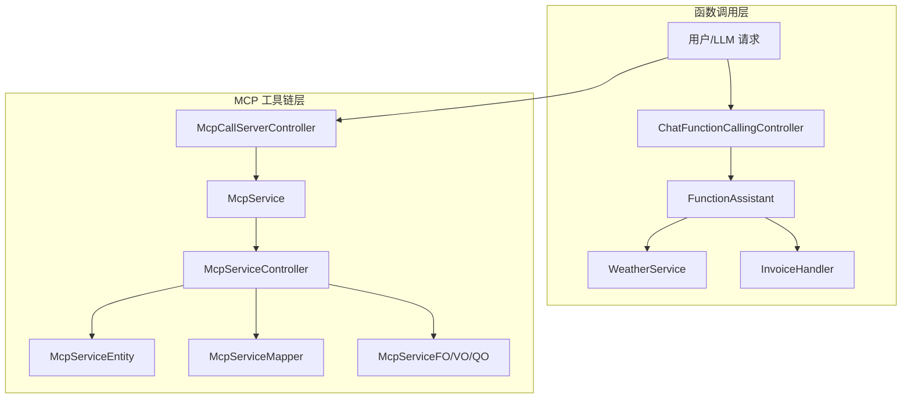
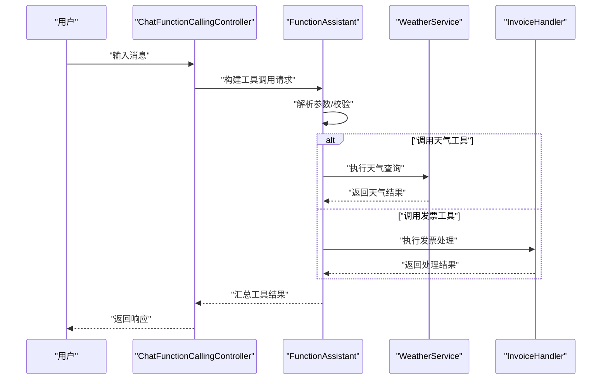
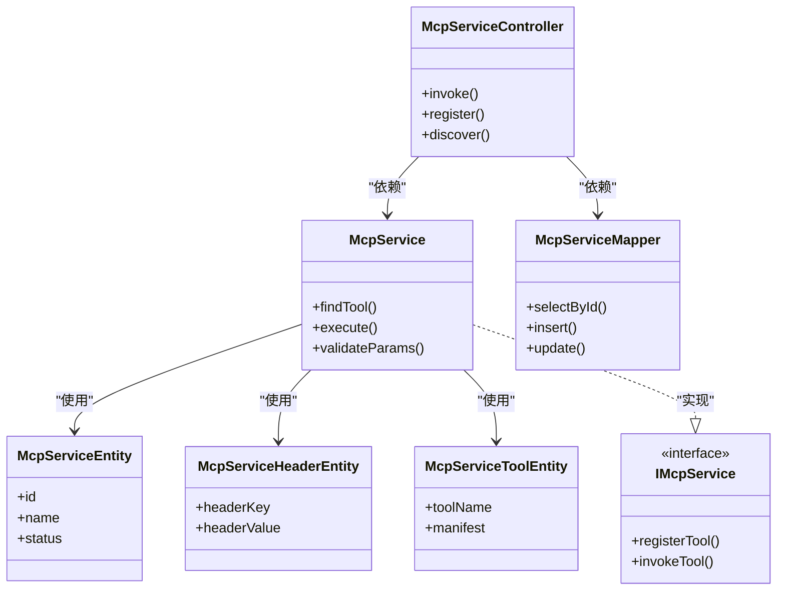
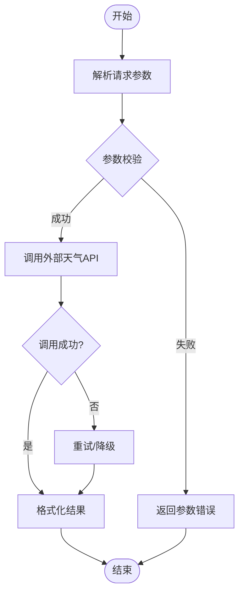
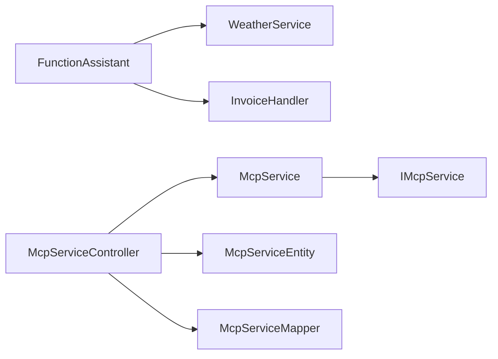

# LangChain工具调用

<cite>
**本文引用的文件**   
- [ChatFunctioncallingLangChain4JApp.java](file://【2】langchain4j-atguiguV5/langchain4j-11chat-functioncalling/src/main/java/com/atguigu/study/ChatFunctioncallingLangChain4JApp.java)
- [ChatFunctionCallingController.java](file://【2】langchain4j-atguiguV5/langchain4j-11chat-functioncalling/src/main/java/com/atguigu/study/controller/ChatFunctionCallingController.java)
- [FunctionAssistant.java](file://【2】langchain4j-atguiguV5/langchain4j-11chat-functioncalling/src/main/java/com/atguigu/study/service/FunctionAssistant.java)
- [WeatherService.java](file://【2】langchain4j-atguiguV5/langchain4j-11chat-functioncalling/src/main/java/com/atguigu/study/service/WeatherService.java)
- [InvoiceHandler.java](file://【2】langchain4j-atguiguV5/langchain4j-11chat-functioncalling/src/main/java/com/atguigu/study/service/InvoiceHandler.java)
- [Saa13ToolCallingApplication.java](file://【1】SpringAIAlibaba-atguiguV1/SAA-13ToolCalling/src/main/java/com/atguigu/study/Saa13ToolCallingApplication.java)
- [ToolCallingController.java](file://【1】SpringAIAlibaba-atguiguV1/SAA-13ToolCalling/src/main/java/com/atguigu/study/controller/ToolCallingController.java)
- [NoToolCallingController.java](file://【1】SpringAIAlibaba-atguiguV1/SAA-13ToolCalling/src/main/java/com/atguigu/study/controller/NoToolCallingController.java)
- [SaaLLMConfig.java](file://【1】SpringAIAlibaba-atguiguV1/SAA-13ToolCalling/src/main/java/com/atguigu/study/config/SaaLLMConfig.java)
- [McpLangChain4JApp.java](file://【2】langchain4j-atguiguV5/langchain4j-14chat-mcp/src/main/java/com/atguigu/study/McpLangChain4JApp.java)
- [McpCallServerController.java](file://【2】langchain4j-atguiguV5/langchain4j-14chat-mcp/src/main/java/com/atguigu/study/controller/McpCallServerController.java)
- [McpService.java](file://【2】langchain4j-atguiguV5/langchain4j-14chat-mcp/src/main/java/com/atguigu/study/service/McpService.java)
- [McpServiceController.java](file://【3】工作资料/code/仓颉智能体/nlp-agent/agent-builder/agent-build-core/src/main/java/com/yundingtech/agent/build/modules/tool/mcp/controller/McpServiceController.java)
- [McpServiceEntity.java](file://【3】工作资料/code/仓颉智能体/nlp-agent/agent-builder/agent-build-core/src/main/java/com/yundingtech/agent/build/modules/tool/mcp/entity/McpServiceEntity.java)
- [McpServiceHeaderEntity.java](file://【3】工作资料/code/仓颉智能体/nlp-agent/agent-builder/agent-build-core/src/main/java/com/yundingtech/agent/build/modules/tool/mcp/entity/McpServiceHeaderEntity.java)
- [McpServiceToolEntity.java](file://【3】工作资料/code/仓颉智能体/nlp-agent/agent-builder/agent-build-core/src/main/java/com/yundingtech/agent/build/modules/tool/mcp/entity/McpServiceToolEntity.java)
- [McpStatusEnum.java](file://【3】工作资料/code/仓颉智能体/nlp-agent/agent-builder/agent-build-core/src/main/java/com/yundingtech/agent/build/modules/tool/mcp/enums/McpStatusEnum.java)
- [McpServiceMapper.java](file://【3】工作资料/code/仓颉智能体/nlp-agent/agent-builder/agent-build-core/src/main/java/com/yundingtech/agent/build/modules/tool/mcp/mapper/McpServiceMapper.java)
- [McpServiceHeaderMapper.java](file://【3】工作资料/code/仓颉智能体/nlp-agent/agent-builder/agent-build-core/src/main/java/com/yundingtech/agent/build/modules/tool/mcp/mapper/McpServiceHeaderMapper.java)
- [McpServiceToolMapper.java](file://【3】工作资料/code/仓颉智能体/nlp-agent/agent-builder/agent-build-core/src/main/java/com/yundingtech/agent/build/modules/tool/mcp/mapper/McpServiceToolMapper.java)
- [McpServiceFO.java](file://【3】工作资料/code/仓颉智能体/nlp-agent/agent-builder/agent-build-core/src/main/java/com/yundingtech/agent/build/modules/tool/mcp/model/McpServiceFO.java)
- [McpServiceHeaderFO.java](file://【3】工作资料/code/仓颉智能体/nlp-agent/agent-builder/agent-build-core/src/main/java/com/yundingtech/agent/build/modules/tool/mcp/model/McpServiceHeaderFO.java)
- [McpServiceHeaderVO.java](file://【3】工作资料/code/仓颉智能体/nlp-agent/agent-builder/agent-build-core/src/main/java/com/yundingtech/agent/build/modules/tool/mcp/model/McpServiceHeaderVO.java)
- [McpServiceQO.java](file://【3】工作资料/code/仓颉智能体/nlp-agent/agent-builder/agent-build-core/src/main/java/com/yundingtech/agent/build/modules/tool/mcp/model/McpServiceQO.java)
- [McpServiceToolFO.java](file://【3】工作资料/code/仓颉智能体/nlp-agent/agent-builder/agent-build-core/src/main/java/com/yundingtech/agent/build/modules/tool/mcp/model/McpServiceToolFO.java)
- [McpServiceToolVO.java](file://【3】工作资料/code/仓颉智能体/nlp-agent/agent-builder/agent-build-core/src/main/java/com/yundingtech/agent/build/modules/tool/mcp/model/McpServiceToolVO.java)
- [McpServiceVO.java](file://【3】工作资料/code/仓颉智能体/nlp-agent/agent-builder/agent-build-core/src/main/java/com/yundingtech/agent/build/modules/tool/mcp/model/McpServiceVO.java)
- [IMcpService.java](file://【3】工作资料/code/仓颉智能体/nlp-agent/agent-builder/agent-build-core/src/main/java/com/yundingtech/agent/build/modules/tool/mcp/service/IMcpService.java)
- [IMcpServiceHeaderService.java](file://【3】工作资料/code/仓颉智能体/nlp-agent/agent-builder/agent-build-core/src/main/java/com/yundingtech/agent/build/modules/tool/mcp/service/IMcpServiceHeaderService.java)
</cite>

## 目录
1. [引言](#引言)
2. [项目结构](#项目结构)
3. [核心组件](#核心组件)
4. [架构总览](#架构总览)
5. [详细组件分析](#详细组件分析)
6. [依赖分析](#依赖分析)
7. [性能考虑](#性能考虑)
8. [故障排查指南](#故障排查指南)
9. [结论](#结论)
10. [附录](#附录)

## 引言
本技术文档聚焦于LangChain工具调用系统，围绕函数调用机制、工具注册与发现、MCP协议集成等核心能力进行系统化阐述。文档结合仓库中的LangChain4j示例工程与MCP工具链实现，深入说明工具定义格式、参数校验、错误处理与异步调用模式，并通过WeatherService等实际工具示例，展示如何将外部API与自定义函数无缝集成到LangChain应用中。

## 项目结构
本仓库包含两套与“工具调用”密切相关的工程：
- LangChain4j示例工程：演示函数调用与工具编排
- MCP工具链工程：提供工具注册、发现与远程调用能力

**图表来源**
- [ChatFunctioncallingLangChain4JApp.java:1-200](file://【2】langchain4j-atguiguV5/langchain4j-11chat-functioncalling/src/main/java/com/atguigu/study/ChatFunctioncallingLangChain4JApp.java#L1-L200)
- [ChatFunctionCallingController.java:1-200](file://【2】langchain4j-atguiguV5/langchain4j-11chat-functioncalling/src/main/java/com/atguigu/study/controller/ChatFunctionCallingController.java#L1-L200)
- [FunctionAssistant.java:1-200](file://【2】langchain4j-atguiguV5/langchain4j-11chat-functioncalling/src/main/java/com/atguigu/study/service/FunctionAssistant.java#L1-L200)
- [WeatherService.java:1-200](file://【2】langchain4j-atguiguV5/langchain4j-11chat-functioncalling/src/main/java/com/atguigu/study/service/WeatherService.java#L1-L200)
- [InvoiceHandler.java:1-200](file://【2】langchain4j-atguiguV5/langchain4j-11chat-functioncalling/src/main/java/com/atguigu/study/service/InvoiceHandler.java#L1-L200)
- [McpLangChain4JApp.java:1-200](file://【2】langchain4j-atguiguV5/langchain4j-14chat-mcp/src/main/java/com/atguigu/study/McpLangChain4JApp.java#L1-L200)
- [McpCallServerController.java:1-200](file://【2】langchain4j-atguiguV5/langchain4j-14chat-mcp/src/main/java/com/atguigu/study/controller/McpCallServerController.java#L1-L200)
- [McpService.java:1-200](file://【2】langchain4j-atguiguV5/langchain4j-14chat-mcp/src/main/java/com/atguigu/study/service/McpService.java#L1-L200)
- [McpServiceController.java:1-200](file://【3】工作资料/code/仓颉智能体/nlp-agent/agent-builder/agent-build-core/src/main/java/com/yundingtech/agent/build/modules/tool/mcp/controller/McpServiceController.java#L1-L200)

**章节来源**
- [ChatFunctioncallingLangChain4JApp.java:1-200](file://【2】langchain4j-atguiguV5/langchain4j-11chat-functioncalling/src/main/java/com/atguigu/study/ChatFunctioncallingLangChain4JApp.java#L1-L200)
- [McpLangChain4JApp.java:1-200](file://【2】langchain4j-atguiguV5/langchain4j-14chat-mcp/src/main/java/com/atguigu/study/McpLangChain4JApp.java#L1-L200)

## 核心组件
- 函数调用与工具编排
  - FunctionAssistant：负责工具注册、参数解析、调用分发与结果聚合
  - WeatherService：示例工具，封装外部天气API调用
  - InvoiceHandler：示例工具，处理发票相关逻辑
- MCP工具链
  - McpServiceController：MCP服务的统一入口与路由
  - McpService：MCP服务编排与调用
  - 实体与Mapper：MCP服务、头信息、工具的持久化模型与访问层
  - 模型对象：McpServiceFO/VO/QO，用于前后端交互与业务编排

**章节来源**
- [FunctionAssistant.java:1-200](file://【2】langchain4j-atguiguV5/langchain4j-11chat-functioncalling/src/main/java/com/atguigu/study/service/FunctionAssistant.java#L1-L200)
- [WeatherService.java:1-200](file://【2】langchain4j-atguiguV5/langchain4j-11chat-functioncalling/src/main/java/com/atguigu/study/service/WeatherService.java#L1-L200)
- [InvoiceHandler.java:1-200](file://【2】langchain4j-atguiguV5/langchain4j-11chat-functioncalling/src/main/java/com/atguigu/study/service/InvoiceHandler.java#L1-L200)
- [McpServiceController.java:1-200](file://【3】工作资料/code/仓颉智能体/nlp-agent/agent-builder/agent-build-core/src/main/java/com/yundingtech/agent/build/modules/tool/mcp/controller/McpServiceController.java#L1-L200)
- [McpService.java:1-200](file://【2】langchain4j-atguiguV5/langchain4j-14chat-mcp/src/main/java/com/atguigu/study/service/McpService.java#L1-L200)

## 架构总览
LangChain工具调用系统由“函数调用层”和“MCP工具链层”组成。前者通过LangChain4j实现函数签名定义、参数校验与调用；后者通过MCP协议实现工具的注册、发现与远程调用。

**图表来源**
- [ChatFunctionCallingController.java:1-200](file://【2】langchain4j-atguiguV5/langchain4j-11chat-functioncalling/src/main/java/com/atguigu/study/controller/ChatFunctionCallingController.java#L1-L200)
- [FunctionAssistant.java:1-200](file://【2】langchain4j-atguiguV5/langchain4j-11chat-functioncalling/src/main/java/com/atguigu/study/service/FunctionAssistant.java#L1-L200)
- [WeatherService.java:1-200](file://【2】langchain4j-atguiguV5/langchain4j-11chat-functioncalling/src/main/java/com/atguigu/study/service/WeatherService.java#L1-L200)
- [InvoiceHandler.java:1-200](file://【2】langchain4j-atguiguV5/langchain4j-11chat-functioncalling/src/main/java/com/atguigu/study/service/InvoiceHandler.java#L1-L200)
- [McpCallServerController.java:1-200](file://【2】langchain4j-atguiguV5/langchain4j-14chat-mcp/src/main/java/com/atguigu/study/controller/McpCallServerController.java#L1-L200)
- [McpService.java:1-200](file://【2】langchain4j-atguiguV5/langchain4j-14chat-mcp/src/main/java/com/atguigu/study/service/McpService.java#L1-L200)
- [McpServiceController.java:1-200](file://【3】工作资料/code/仓颉智能体/nlp-agent/agent-builder/agent-build-core/src/main/java/com/yundingtech/agent/build/modules/tool/mcp/controller/McpServiceController.java#L1-L200)

## 详细组件分析

### 函数调用机制（LangChain4j）
- 函数签名与参数校验
  - FunctionAssistant负责注册可用工具，解析LLM生成的函数调用请求，执行参数校验与类型转换，最终调用对应工具并汇总结果
- 工具实现示例
  - WeatherService：封装外部天气API调用，返回标准化结果
  - InvoiceHandler：处理发票相关逻辑，如格式化、计算等
- 控制器与应用入口
  - ChatFunctionCallingController：接收用户输入，驱动FunctionAssistant完成工具调用
  - ChatFunctioncallingLangChain4JApp：应用启动入口，装配LLM与工具

**图表来源**
- [ChatFunctionCallingController.java:1-200](file://【2】langchain4j-atguiguV5/langchain4j-11chat-functioncalling/src/main/java/com/atguigu/study/controller/ChatFunctionCallingController.java#L1-L200)
- [FunctionAssistant.java:1-200](file://【2】langchain4j-atguiguV5/langchain4j-11chat-functioncalling/src/main/java/com/atguigu/study/service/FunctionAssistant.java#L1-L200)
- [WeatherService.java:1-200](file://【2】langchain4j-atguiguV5/langchain4j-11chat-functioncalling/src/main/java/com/atguigu/study/service/WeatherService.java#L1-L200)
- [InvoiceHandler.java:1-200](file://【2】langchain4j-atguiguV5/langchain4j-11chat-functioncalling/src/main/java/com/atguigu/study/service/InvoiceHandler.java#L1-L200)

**章节来源**
- [ChatFunctionCallingController.java:1-200](file://【2】langchain4j-atguiguV5/langchain4j-11chat-functioncalling/src/main/java/com/atguigu/study/controller/ChatFunctionCallingController.java#L1-L200)
- [FunctionAssistant.java:1-200](file://【2】langchain4j-atguiguV5/langchain4j-11chat-functioncalling/src/main/java/com/atguigu/study/service/FunctionAssistant.java#L1-L200)
- [WeatherService.java:1-200](file://【2】langchain4j-atguiguV5/langchain4j-11chat-functioncalling/src/main/java/com/atguigu/study/service/WeatherService.java#L1-L200)
- [InvoiceHandler.java:1-200](file://【2】langchain4j-atguiguV5/langchain4j-11chat-functioncalling/src/main/java/com/atguigu/study/service/InvoiceHandler.java#L1-L200)

### 工具注册与发现
- 注册方式
  - 在FunctionAssistant中集中注册工具，形成工具字典，便于按名称调用
- 发现机制
  - 通过LLM提示词或配置文件声明工具清单，实现动态发现与选择
- 参数验证
  - 在FunctionAssistant中对工具参数进行类型检查与必填项校验，确保调用安全

**章节来源**
- [FunctionAssistant.java:1-200](file://【2】langchain4j-atguiguV5/langchain4j-11chat-functioncalling/src/main/java/com/atguigu/study/service/FunctionAssistant.java#L1-L200)

### MCP协议集成
- 协议概述
  - 通过MCP协议实现工具的远程注册、发现与调用，支持跨进程/跨服务的工具编排
- 关键组件
  - McpCallServerController：MCP调用入口，接收并转发MCP请求
  - McpService：MCP服务编排，负责工具发现、参数解析与调用
  - McpServiceController：MCP服务控制器，提供REST风格的管理与调用接口
  - 实体与Mapper：McpServiceEntity、McpServiceHeaderEntity、McpServiceToolEntity及其Mapper，支撑工具元数据与调用记录的持久化
  - 模型对象：McpServiceFO/VO/QO，用于前后端交互与业务编排

**图表来源**
- [McpServiceController.java:1-200](file://【3】工作资料/code/仓颉智能体/nlp-agent/agent-builder/agent-build-core/src/main/java/com/yundingtech/agent/build/modules/tool/mcp/controller/McpServiceController.java#L1-L200)
- [McpService.java:1-200](file://【2】langchain4j-atguiguV5/langchain4j-14chat-mcp/src/main/java/com/atguigu/study/service/McpService.java#L1-L200)
- [McpServiceEntity.java:1-200](file://【3】工作资料/code/仓颉智能体/nlp-agent/agent-builder/agent-build-core/src/main/java/com/yundingtech/agent/build/modules/tool/mcp/entity/McpServiceEntity.java#L1-L200)
- [McpServiceHeaderEntity.java:1-200](file://【3】工作资料/code/仓颉智能体/nlp-agent/agent-builder/agent-build-core/src/main/java/com/yundingtech/agent/build/modules/tool/mcp/entity/McpServiceHeaderEntity.java#L1-L200)
- [McpServiceToolEntity.java:1-200](file://【3】工作资料/code/仓颉智能体/nlp-agent/agent-builder/agent-build-core/src/main/java/com/yundingtech/agent/build/modules/tool/mcp/entity/McpServiceToolEntity.java#L1-L200)
- [McpServiceMapper.java:1-200](file://【3】工作资料/code/仓颉智能体/nlp-agent/agent-builder/agent-build-core/src/main/java/com/yundingtech/agent/build/modules/tool/mcp/mapper/McpServiceMapper.java#L1-L200)
- [IMcpService.java:1-200](file://【3】工作资料/code/仓颉智能体/nlp-agent/agent-builder/agent-build-core/src/main/java/com/yundingtech/agent/build/modules/tool/mcp/service/IMcpService.java#L1-L200)

**章节来源**
- [McpServiceController.java:1-200](file://【3】工作资料/code/仓颉智能体/nlp-agent/agent-builder/agent-build-core/src/main/java/com/yundingtech/agent/build/modules/tool/mcp/controller/McpServiceController.java#L1-L200)
- [McpService.java:1-200](file://【2】langchain4j-atguiguV5/langchain4j-14chat-mcp/src/main/java/com/atguigu/study/service/McpService.java#L1-L200)
- [McpServiceEntity.java:1-200](file://【3】工作资料/code/仓颉智能体/nlp-agent/agent-builder/agent-build-core/src/main/java/com/yundingtech/agent/build/modules/tool/mcp/entity/McpServiceEntity.java#L1-L200)
- [McpServiceHeaderEntity.java:1-200](file://【3】工作资料/code/仓颉智能体/nlp-agent/agent-builder/agent-build-core/src/main/java/com/yundingtech/agent/build/modules/tool/mcp/entity/McpServiceHeaderEntity.java#L1-L200)
- [McpServiceToolEntity.java:1-200](file://【3】工作资料/code/仓颉智能体/nlp-agent/agent-builder/agent-build-core/src/main/java/com/yundingtech/agent/build/modules/tool/mcp/entity/McpServiceToolEntity.java#L1-L200)
- [McpServiceMapper.java:1-200](file://【3】工作资料/code/仓颉智能体/nlp-agent/agent-builder/agent-build-core/src/main/java/com/yundingtech/agent/build/modules/tool/mcp/mapper/McpServiceMapper.java#L1-L200)
- [IMcpService.java:1-200](file://【3】工作资料/code/仓颉智能体/nlp-agent/agent-builder/agent-build-core/src/main/java/com/yundingtech/agent/build/modules/tool/mcp/service/IMcpService.java#L1-L200)

### 异步调用模式
- 异步策略
  - 对外部API调用采用异步模式，避免阻塞主线程，提升吞吐
  - 工具执行结果通过回调或Future聚合，最终统一返回给LLM
- 错误恢复
  - 异常捕获与重试策略，保证在部分工具失败时不影响整体流程

**章节来源**
- [FunctionAssistant.java:1-200](file://【2】langchain4j-atguiguV5/langchain4j-11chat-functioncalling/src/main/java/com/atguigu/study/service/FunctionAssistant.java#L1-L200)

### 工具定义格式与参数校验
- 工具定义
  - 工具以“名称+签名+描述”的形式注册，便于LLM理解与选择
- 参数校验
  - 在FunctionAssistant中对必填参数、类型与范围进行校验，不符合条件直接返回错误
- 结果聚合
  - 将多个工具的结果合并为统一格式返回给调用方

**章节来源**
- [FunctionAssistant.java:1-200](file://【2】langchain4j-atguiguV5/langchain4j-11chat-functioncalling/src/main/java/com/atguigu/study/service/FunctionAssistant.java#L1-L200)

### 实际工具示例：WeatherService
- 功能定位
  - 将外部天气API封装为LangChain工具，支持按城市查询天气
- 调用流程
  - Controller -> Assistant -> WeatherService -> 外部API -> Assistant聚合 -> Controller返回
- 参数与返回
  - 输入参数包括城市名等，返回标准化天气信息

**图表来源**
- [WeatherService.java:1-200](file://【2】langchain4j-atguiguV5/langchain4j-11chat-functioncalling/src/main/java/com/atguigu/study/service/WeatherService.java#L1-L200)
- [FunctionAssistant.java:1-200](file://【2】langchain4j-atguiguV5/langchain4j-11chat-functioncalling/src/main/java/com/atguigu/study/service/FunctionAssistant.java#L1-L200)

**章节来源**
- [WeatherService.java:1-200](file://【2】langchain4j-atguiguV5/langchain4j-11chat-functioncalling/src/main/java/com/atguigu/study/service/WeatherService.java#L1-L200)

## 依赖分析
- 组件耦合
  - FunctionAssistant与具体工具（WeatherService、InvoiceHandler）解耦，通过接口或名称绑定
  - McpServiceController与McpService解耦，通过接口IMcpService实现
- 外部依赖
  - MCP工具链依赖数据库Mapper与实体模型，支撑工具元数据与调用记录的持久化
- 循环依赖
  - 当前结构未见循环依赖，职责清晰

**图表来源**
- [FunctionAssistant.java:1-200](file://【2】langchain4j-atguiguV5/langchain4j-11chat-functioncalling/src/main/java/com/atguigu/study/service/FunctionAssistant.java#L1-L200)
- [WeatherService.java:1-200](file://【2】langchain4j-atguiguV5/langchain4j-11chat-functioncalling/src/main/java/com/atguigu/study/service/WeatherService.java#L1-L200)
- [InvoiceHandler.java:1-200](file://【2】langchain4j-atguiguV5/langchain4j-11chat-functioncalling/src/main/java/com/atguigu/study/service/InvoiceHandler.java#L1-L200)
- [McpServiceController.java:1-200](file://【3】工作资料/code/仓颉智能体/nlp-agent/agent-builder/agent-build-core/src/main/java/com/yundingtech/agent/build/modules/tool/mcp/controller/McpServiceController.java#L1-L200)
- [McpService.java:1-200](file://【2】langchain4j-atguiguV5/langchain4j-14chat-mcp/src/main/java/com/atguigu/study/service/McpService.java#L1-L200)
- [IMcpService.java:1-200](file://【3】工作资料/code/仓颉智能体/nlp-agent/agent-builder/agent-build-core/src/main/java/com/yundingtech/agent/build/modules/tool/mcp/service/IMcpService.java#L1-L200)
- [McpServiceEntity.java:1-200](file://【3】工作资料/code/仓颉智能体/nlp-agent/agent-builder/agent-build-core/src/main/java/com/yundingtech/agent/build/modules/tool/mcp/entity/McpServiceEntity.java#L1-L200)
- [McpServiceMapper.java:1-200](file://【3】工作资料/code/仓颉智能体/nlp-agent/agent-builder/agent-build-core/src/main/java/com/yundingtech/agent/build/modules/tool/mcp/mapper/McpServiceMapper.java#L1-L200)

**章节来源**
- [FunctionAssistant.java:1-200](file://【2】langchain4j-atguiguV5/langchain4j-11chat-functioncalling/src/main/java/com/atguigu/study/service/FunctionAssistant.java#L1-L200)
- [McpServiceController.java:1-200](file://【3】工作资料/code/仓颉智能体/nlp-agent/agent-builder/agent-build-core/src/main/java/com/yundingtech/agent/build/modules/tool/mcp/controller/McpServiceController.java#L1-L200)
- [McpService.java:1-200](file://【2】langchain4j-atguiguV5/langchain4j-14chat-mcp/src/main/java/com/atguigu/study/service/McpService.java#L1-L200)

## 性能考虑
- 异步调用与并发
  - 外部API调用采用异步模式，减少等待时间，提高整体吞吐
- 缓存与降级
  - 对热点工具结果进行缓存，必要时启用降级策略，保障稳定性
- 参数校验前置
  - 在进入工具执行前完成参数校验，避免无效调用带来的资源浪费

## 故障排查指南
- 常见问题
  - 工具未注册：确认FunctionAssistant中是否正确注册目标工具
  - 参数校验失败：检查请求参数类型与必填项
  - MCP调用异常：检查McpServiceController与McpService的依赖关系与Mapper映射
- 定位方法
  - 查看控制器到服务的调用链路，逐步定位异常点
  - 关注工具执行日志与外部API返回状态

**章节来源**
- [ChatFunctionCallingController.java:1-200](file://【2】langchain4j-atguiguV5/langchain4j-11chat-functioncalling/src/main/java/com/atguigu/study/controller/ChatFunctionCallingController.java#L1-L200)
- [McpCallServerController.java:1-200](file://【2】langchain4j-atguiguV5/langchain4j-14chat-mcp/src/main/java/com/atguigu/study/controller/McpCallServerController.java#L1-L200)

## 结论
本技术文档基于仓库中的LangChain4j与MCP工具链实现，系统性地阐述了函数调用机制、工具注册与发现、MCP协议集成、参数校验与异步调用模式，并通过WeatherService等示例展示了外部API与自定义函数的集成实践。建议在生产环境中进一步完善缓存与降级策略、增强可观测性与监控告警，以提升系统的稳定性与可维护性。

## 附录
- 配置与启动
  - ChatFunctioncallingLangChain4JApp：LangChain4j应用入口
  - Saa13ToolCallingApplication：SpringAI示例应用入口
  - McpLangChain4JApp：MCP工具链应用入口
- 相关控制器
  - ChatFunctionCallingController：函数调用控制器
  - ToolCallingController：SpringAI工具调用控制器
  - NoToolCallingController：无工具调用控制器
  - McpCallServerController：MCP调用控制器

**章节来源**
- [ChatFunctioncallingLangChain4JApp.java:1-200](file://【2】langchain4j-atguiguV5/langchain4j-11chat-functioncalling/src/main/java/com/atguigu/study/ChatFunctioncallingLangChain4JApp.java#L1-L200)
- [Saa13ToolCallingApplication.java:1-200](file://【1】SpringAIAlibaba-atguiguV1/SAA-13ToolCalling/src/main/java/com/atguigu/study/Saa13ToolCallingApplication.java#L1-L200)
- [McpLangChain4JApp.java:1-200](file://【2】langchain4j-atguiguV5/langchain4j-14chat-mcp/src/main/java/com/atguigu/study/McpLangChain4JApp.java#L1-L200)
- [ToolCallingController.java:1-200](file://【1】SpringAIAlibaba-atguiguV1/SAA-13ToolCalling/src/main/java/com/atguigu/study/controller/ToolCallingController.java#L1-L200)
- [NoToolCallingController.java:1-200](file://【1】SpringAIAlibaba-atguiguV1/SAA-13ToolCalling/src/main/java/com/atguigu/study/controller/NoToolCallingController.java#L1-L200)
- [SaaLLMConfig.java:1-200](file://【1】SpringAIAlibaba-atguiguV1/SAA-13ToolCalling/src/main/java/com/atguigu/study/config/SaaLLMConfig.java#L1-L200)