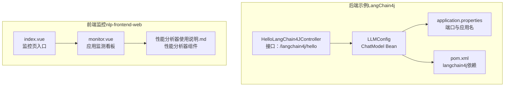
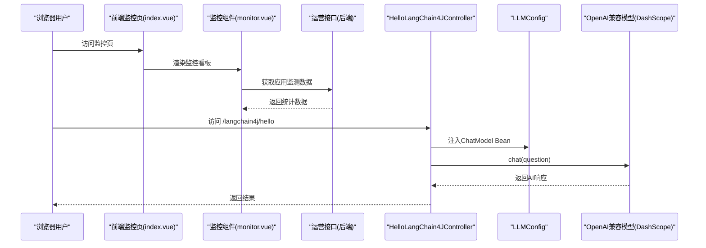
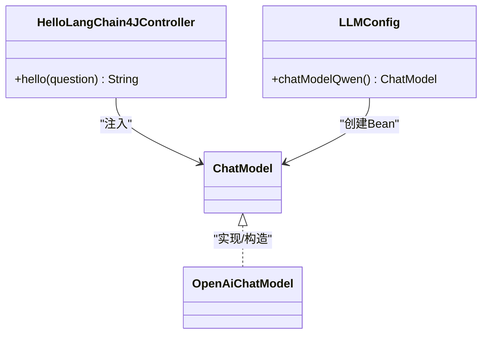
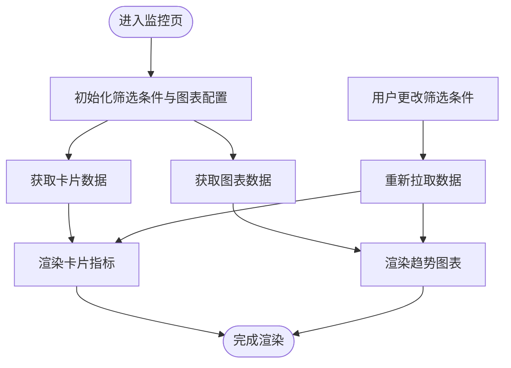
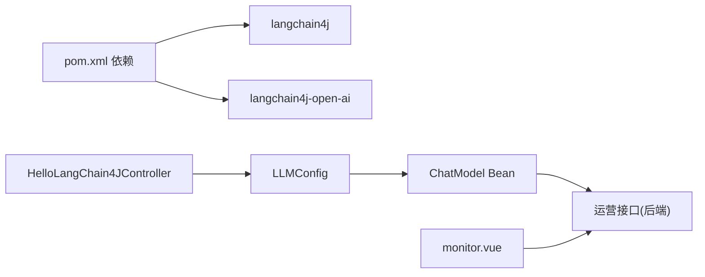

# LangChain开发工具

<cite>
**本文引用的文件**
- [LangChain4j-完整学习总结笔记.md](file://【2】langchain4j-atguiguV5/LangChain4j-完整学习总结笔记.md)
- [PROJECT.md](file://【3】工作资料/code/仓颉智能体/nlp-frontend-web/PROJECT.md)
- [monitor.vue](file://【3】工作资料/code/仓颉智能体/nlp-frontend-web/src/views/workspace/pages/workApps/pages/monitoring/component/monitor.vue)
- [index.vue](file://【3】工作资料/code/仓颉智能体/nlp-frontend-web/src/views/workspace/pages/workApps/pages/monitoring/index.vue)
- [HelloLangChain4JController.java](file://【2】langchain4j-atguiguV5/langchain4j-01helloworld/src/main/java/com/atguigu/study/controller/HelloLangChain4JController.java)
- [LLMConfig.java](file://【2】langchain4j-atguiguV5/langchain4j-01helloworld/src/main/java/com/atguigu/study/config/LLMConfig.java)
- [application.properties](file://【2】langchain4j-atguiguV5/langchain4j-01helloworld/src/main/resources/application.properties)
- [pom.xml](file://【2】langchain4j-atguiguV5/langchain4j-01helloworld/pom.xml)
- [性能分析器使用说明.md](file://【3】工作资料/code/仓颉智能体/nlp-frontend-web/src/views/workspace/pages/workApps/pages/choregraphy/workflow/性能分析器使用说明.md)
</cite>

## 目录
1. [引言](#引言)
2. [项目结构](#项目结构)
3. [核心组件](#核心组件)
4. [架构总览](#架构总览)
5. [组件详解](#组件详解)
6. [依赖关系分析](#依赖关系分析)
7. [性能与优化](#性能与优化)
8. [故障排查指南](#故障排查指南)
9. [结论](#结论)
10. [附录](#附录)

## 引言
本指南围绕LangChain生态在本仓库中的落地实践，聚焦三大开发辅助工具：LangSmith监控平台、LangServe网络服务、LangGraph可视化工具。结合仓库内的LangChain4j示例工程与前端监控页面，系统讲解如何利用这些工具进行应用调试、性能监控、链式调用优化与团队协作，并提供可操作的步骤与最佳实践。

## 项目结构
本仓库包含两部分与LangChain开发密切相关的资产：
- 后端LangChain4j示例工程：演示ChatModel、OpenAI兼容调用、依赖配置与接口暴露。
- 前端监控与工作流页面：提供应用监测看板、对话日志、运行日志与性能分析器组件。

**图表来源**
- [HelloLangChain4JController.java:362-406](file://【2】langchain4j-atguiguV5/langchain4j-01helloworld/src/main/java/com/atguigu/study/controller/HelloLangChain4JController.java#L362-L406)
- [LLMConfig.java:308-356](file://【2】langchain4j-atguiguV5/langchain4j-01helloworld/src/main/java/com/atguigu/study/config/LLMConfig.java#L308-L356)
- [application.properties:431-436](file://【2】langchain4j-atguiguV5/langchain4j-01helloworld/src/main/resources/application.properties#L431-L436)
- [pom.xml:444-458](file://【2】langchain4j-atguiguV5/langchain4j-01helloworld/pom.xml#L444-L458)
- [monitor.vue:1-291](file://【3】工作资料/code/仓颉智能体/nlp-frontend-web/src/views/workspace/pages/workApps/pages/monitoring/component/monitor.vue#L1-L291)
- [index.vue:1-132](file://【3】工作资料/code/仓颉智能体/nlp-frontend-web/src/views/workspace/pages/workApps/pages/monitoring/index.vue#L1-L132)
- [性能分析器使用说明.md:116-160](file://【3】工作资料/code/仓颉智能体/nlp-frontend-web/src/views/workspace/pages/workApps/pages/choregraphy/workflow/性能分析器使用说明.md#L116-L160)

**章节来源**
- [PROJECT.md:1-92](file://【3】工作资料/code/仓颉智能体/nlp-frontend-web/PROJECT.md#L1-L92)

## 核心组件
- LangChain4j后端示例（HelloWorld）
  - 控制器：提供基础对话接口，演示同步调用ChatModel。
  - 配置类：注册ChatModel Bean，使用OpenAI兼容模式对接阿里云DashScope。
  - 依赖与配置：pom.xml声明langchain4j与langchain4j-open-ai；application.properties设置端口与应用名。
- 前端监控看板
  - monitor.vue：封装卡片指标与图表渲染，调用后端运营接口获取统计数据。
  - index.vue：监控页入口，切换“应用监测/运行日志”“对话日志”等子页。
  - 性能分析器：提供前端侧性能采集与可视化组件说明。

**章节来源**
- [HelloLangChain4JController.java:362-406](file://【2】langchain4j-atguiguV5/langchain4j-01helloworld/src/main/java/com/atguigu/study/controller/HelloLangChain4JController.java#L362-L406)
- [LLMConfig.java:308-356](file://【2】langchain4j-atguiguV5/langchain4j-01helloworld/src/main/java/com/atguigu/study/config/LLMConfig.java#L308-L356)
- [application.properties:431-436](file://【2】langchain4j-atguiguV5/langchain4j-01helloworld/src/main/resources/application.properties#L431-L436)
- [pom.xml:444-458](file://【2】langchain4j-atguiguV5/langchain4j-01helloworld/pom.xml#L444-L458)
- [monitor.vue:1-291](file://【3】工作资料/code/仓颉智能体/nlp-frontend-web/src/views/workspace/pages/workApps/pages/monitoring/component/monitor.vue#L1-L291)
- [index.vue:1-132](file://【3】工作资料/code/仓颉智能体/nlp-frontend-web/src/views/workspace/pages/workApps/pages/monitoring/index.vue#L1-L132)
- [性能分析器使用说明.md:116-160](file://【3】工作资料/code/仓颉智能体/nlp-frontend-web/src/views/workspace/pages/workApps/pages/choregraphy/workflow/性能分析器使用说明.md#L116-L160)

## 架构总览
下图展示了从浏览器到后端LangChain4j服务，再到外部模型服务的调用链路，以及前端监控看板的数据来源与交互。

**图表来源**
- [index.vue:1-132](file://【3】工作资料/code/仓颉智能体/nlp-frontend-web/src/views/workspace/pages/workApps/pages/monitoring/index.vue#L1-L132)
- [monitor.vue:1-291](file://【3】工作资料/code/仓颉智能体/nlp-frontend-web/src/views/workspace/pages/workApps/pages/monitoring/component/monitor.vue#L1-L291)
- [HelloLangChain4JController.java:362-406](file://【2】langchain4j-atguiguV5/langchain4j-01helloworld/src/main/java/com/atguigu/study/controller/HelloLangChain4JController.java#L362-L406)
- [LLMConfig.java:308-356](file://【2】langchain4j-atguiguV5/langchain4j-01helloworld/src/main/java/com/atguigu/study/config/LLMConfig.java#L308-L356)

## 组件详解

### LangChain4j后端示例（HelloWorld）
- 控制器职责
  - 接收HTTP请求，注入ChatModel Bean，调用chat()方法，返回模型响应。
  - 接口路径与参数：/langchain4j/hello，支持question参数，默认值“你是谁”。
- 配置类职责
  - 通过OpenAiChatModel.builder()创建ChatModel Bean，设置apiKey、modelName、baseUrl。
  - baseUrl指向阿里云DashScope兼容端点，实现OpenAI协议适配。
- 依赖与配置
  - pom.xml包含langchain4j与langchain4j-open-ai依赖。
  - application.properties设置server.port与spring.application.name。

**图表来源**
- [HelloLangChain4JController.java:362-406](file://【2】langchain4j-atguiguV5/langchain4j-01helloworld/src/main/java/com/atguigu/study/controller/HelloLangChain4JController.java#L362-L406)
- [LLMConfig.java:308-356](file://【2】langchain4j-atguiguV5/langchain4j-01helloworld/src/main/java/com/atguigu/study/config/LLMConfig.java#L308-L356)

**章节来源**
- [HelloLangChain4JController.java:362-406](file://【2】langchain4j-atguiguV5/langchain4j-01helloworld/src/main/java/com/atguigu/study/controller/HelloLangChain4JController.java#L362-L406)
- [LLMConfig.java:308-356](file://【2】langchain4j-atguiguV5/langchain4j-01helloworld/src/main/java/com/atguigu/study/config/LLMConfig.java#L308-L356)
- [application.properties:431-436](file://【2】langchain4j-atguiguV5/langchain4j-01helloworld/src/main/resources/application.properties#L431-L436)
- [pom.xml:444-458](file://【2】langchain4j-atguiguV5/langchain4j-01helloworld/pom.xml#L444-L458)

### 前端监控看板（monitor.vue）
- 功能概述
  - 顶部筛选：渠道类型、日期粒度；支持按对话标题搜索。
  - 卡片指标：对话次数、对话用户数、命中率/成功率、Token消耗等。
  - 图表渲染：折线/柱状图展示趋势，支持格式化提示与颜色配置。
  - 数据来源：调用后端运营接口，传入appId、dateType、channelType等参数。
- 交互流程
  - 初始化加载卡片与图表数据。
  - 选择筛选条件后重新拉取数据并更新视图。

**图表来源**
- [monitor.vue:1-291](file://【3】工作资料/code/仓颉智能体/nlp-frontend-web/src/views/workspace/pages/workApps/pages/monitoring/component/monitor.vue#L1-L291)
- [index.vue:1-132](file://【3】工作资料/code/仓颉智能体/nlp-frontend-web/src/views/workspace/pages/workApps/pages/monitoring/index.vue#L1-L132)

**章节来源**
- [monitor.vue:1-291](file://【3】工作资料/code/仓颉智能体/nlp-frontend-web/src/views/workspace/pages/workApps/pages/monitoring/component/monitor.vue#L1-L291)
- [index.vue:1-132](file://【3】工作资料/code/仓颉智能体/nlp-frontend-web/src/views/workspace/pages/workApps/pages/monitoring/index.vue#L1-L132)

### 性能分析器组件
- 组件定位
  - 提供前端侧性能分析能力，便于在浏览器端观察内存、时间等指标。
- 使用注意
  - 需要支持performance.memory API的浏览器。
  - 组件文件位于workflow目录下，作为性能分析器组件存在。

**章节来源**
- [性能分析器使用说明.md:116-160](file://【3】工作资料/code/仓颉智能体/nlp-frontend-web/src/views/workspace/pages/workApps/pages/choregraphy/workflow/性能分析器使用说明.md#L116-L160)

## 依赖关系分析
- 后端LangChain4j依赖
  - langchain4j-open-ai：提供OpenAI兼容接口（如OpenAiChatModel、ChatModel）。
  - langchain4j：提供高级API（如AiServices、@Tool、ChatMemory等）。
- 前端监控依赖
  - 通过API接口与后端运营数据对接，实现看板渲染与筛选交互。

**图表来源**
- [pom.xml:444-458](file://【2】langchain4j-atguiguV5/langchain4j-01helloworld/pom.xml#L444-L458)
- [HelloLangChain4JController.java:362-406](file://【2】langchain4j-atguiguV5/langchain4j-01helloworld/src/main/java/com/atguigu/study/controller/HelloLangChain4JController.java#L362-L406)
- [LLMConfig.java:308-356](file://【2】langchain4j-atguiguV5/langchain4j-01helloworld/src/main/java/com/atguigu/study/config/LLMConfig.java#L308-L356)
- [monitor.vue:1-291](file://【3】工作资料/code/仓颉智能体/nlp-frontend-web/src/views/workspace/pages/workApps/pages/monitoring/component/monitor.vue#L1-L291)

**章节来源**
- [pom.xml:444-458](file://【2】langchain4j-atguiguV5/langchain4j-01helloworld/pom.xml#L444-L458)
- [monitor.vue:1-291](file://【3】工作资料/code/仓颉智能体/nlp-frontend-web/src/views/workspace/pages/workApps/pages/monitoring/component/monitor.vue#L1-L291)

## 性能与优化
- 后端调用链优化
  - 使用OpenAI兼容模式统一接入多家模型提供商，减少协议差异带来的维护成本。
  - 通过ChatModel Bean集中管理配置，避免重复初始化与分散配置。
- 前端监控与性能分析
  - 监控看板支持按渠道类型与日期粒度筛选，便于定位异常时段与渠道。
  - 性能分析器组件可用于前端侧性能观测，辅助定位前端瓶颈。
- 最佳实践
  - 将API密钥与模型配置置于安全的环境变量或配置中心，避免硬编码。
  - 对长耗时链路增加超时与重试策略，保障用户体验。
  - 在生产环境开启链路追踪与日志聚合，结合监控看板进行问题定位。

[本节为通用指导，不直接分析具体文件]

## 故障排查指南
- 接口无法访问
  - 检查后端端口与应用名配置，确认服务已启动。
  - 确认浏览器访问路径与控制器接口一致。
- 模型调用失败
  - 核对apiKey与baseUrl配置，确保OpenAI兼容端点正确。
  - 检查网络连通性与防火墙策略。
- 监控看板无数据
  - 确认筛选条件（appId、dateType、channelType）有效。
  - 检查后端运营接口返回格式与字段映射。
- 前端性能分析不可用
  - 确认浏览器支持performance.memory API。
  - 检查组件文件是否存在且路径正确。

**章节来源**
- [application.properties:431-436](file://【2】langchain4j-atguiguV5/langchain4j-01helloworld/src/main/resources/application.properties#L431-L436)
- [LLMConfig.java:308-356](file://【2】langchain4j-atguiguV5/langchain4j-01helloworld/src/main/java/com/atguigu/study/config/LLMConfig.java#L308-L356)
- [monitor.vue:1-291](file://【3】工作资料/code/仓颉智能体/nlp-frontend-web/src/views/workspace/pages/workApps/pages/monitoring/component/monitor.vue#L1-L291)
- [性能分析器使用说明.md:116-160](file://【3】工作资料/code/仓颉智能体/nlp-frontend-web/src/views/workspace/pages/workApps/pages/choregraphy/workflow/性能分析器使用说明.md#L116-L160)

## 结论
通过LangChain4j示例工程与前端监控看板的协同，开发者可以快速完成从接口调试、链路追踪到性能监控与团队协作的闭环。建议在实际项目中：
- 统一使用OpenAI兼容模式接入多模型提供商；
- 借助监控看板与性能分析器持续观测应用表现；
- 将API密钥与配置外置，配合CI/CD自动化部署与灰度发布。

[本节为总结性内容，不直接分析具体文件]

## 附录
- LangSmith监控平台
  - 用于链路追踪、调用日志与性能指标的可视化与回放，建议在后端集成追踪器并在前端埋点关键事件。
- LangServe网络服务
  - 将LangChain链路封装为可复用的服务端点，便于前后端解耦与团队协作。
- LangGraph可视化工具
  - 用于编排与调试复杂链路，建议在开发阶段以图形化方式验证节点连接与分支逻辑。

[本节为概念性内容，不直接分析具体文件]