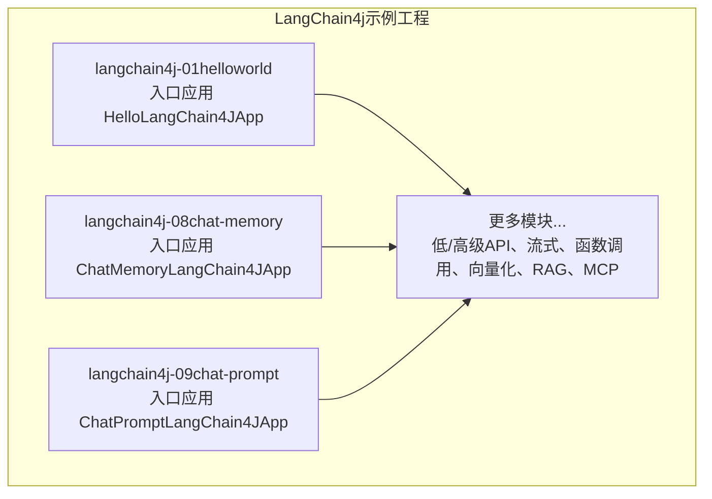
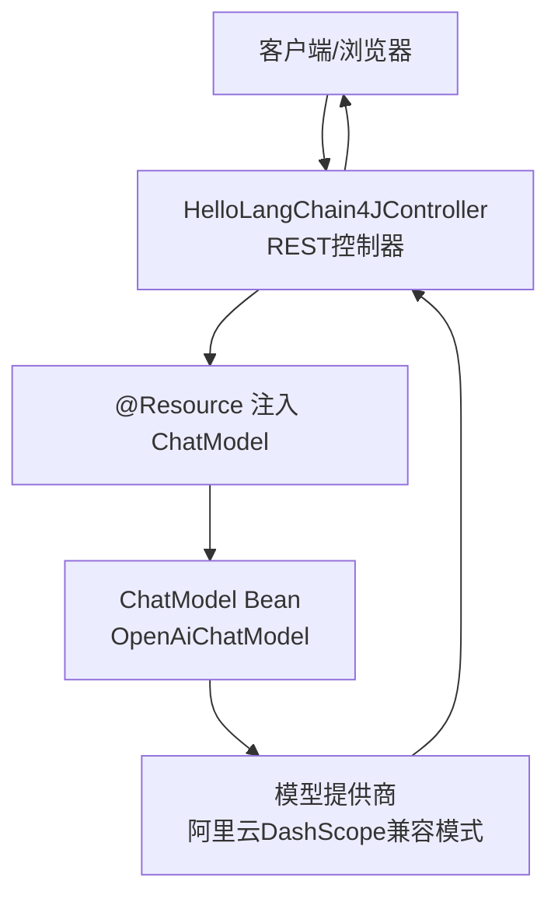
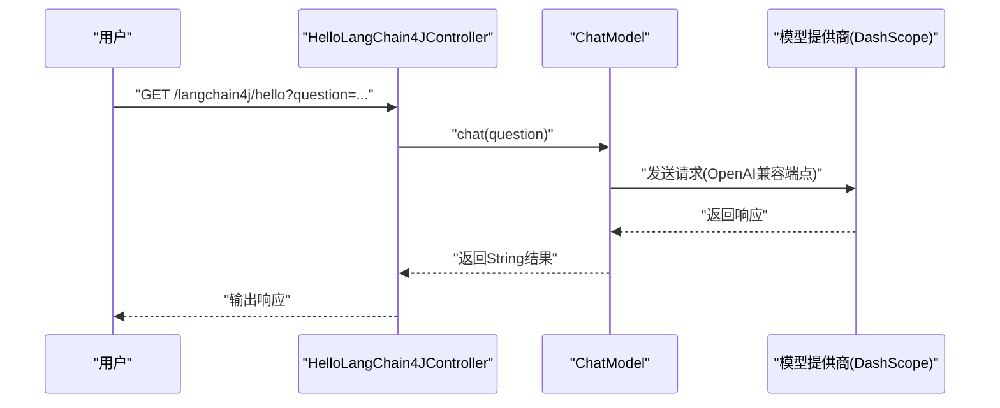
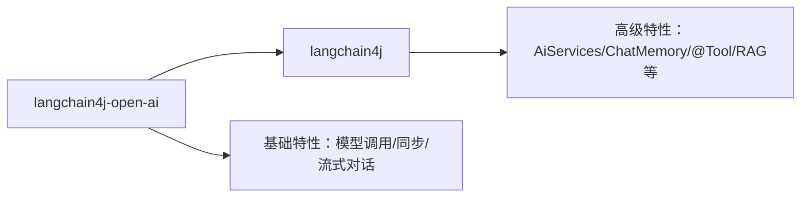

# LangChain核心概念

<cite>
**本文引用的文件**
- [LangChain4j-完整学习总结笔记.md](file://【2】langchain4j-atguiguV5/LangChain4j-完整学习总结笔记.md)
- [HelloLangChain4JApp.java](file://【2】langchain4j-atguiguV5/langchain4j-01helloworld/src/main/java/com/atguigu/study/HelloLangChain4JApp.java)
- [ChatMemoryLangChain4JApp.java](file://【2】langchain4j-atguiguV5/langchain4j-08chat-memory/src/main/java/com/atguigu/study/ChatMemoryLangChain4JApp.java)
- [ChatPromptLangChain4JApp.java](file://【2】langchain4j-atguiguV5/langchain4j-09chat-prompt/src/main/java/com/atguigu/study/ChatPromptLangChain4JApp.java)
</cite>

## 目录
1. [引言](#引言)
2. [项目结构](#项目结构)
3. [核心组件](#核心组件)
4. [架构总览](#架构总览)
5. [详细组件分析](#详细组件分析)
6. [依赖分析](#依赖分析)
7. [性能考虑](#性能考虑)
8. [故障排查指南](#故障排查指南)
9. [结论](#结论)
10. [附录](#附录)

## 引言
本指南面向初学者，系统讲解LangChain核心概念与在AI应用开发中的实践方法。围绕大语言模型（LLM）、提示词（Prompt）、链式调用（LCEL）、内存（Memory）等关键术语，结合仓库中的LangChain4j示例工程，给出可操作的架构视图、组件关系、数据与控制流，并提供最佳实践与排障建议，帮助读者快速建立对LangChain框架的全面理解。

## 项目结构
该仓库包含两部分与LangChain密切相关的学习材料：
- LangChain4j示例工程：覆盖HelloWorld、多模型、Spring Boot集成、低/高级API、流式输出、记忆、Prompt、持久化、函数调用、向量化、RAG、MCP等模块，形成完整的“从零到一”的学习路径。
- LangChain4j学习笔记：系统化整理各模块的调用流程、核心概念、API对比与三方框架对比，便于查阅与复习。

下图展示了LangChain4j示例工程的高层组织关系与入口应用：

**图表来源**
- [HelloLangChain4JApp.java:11-17](file://【2】langchain4j-atguiguV5/langchain4j-01helloworld/src/main/java/com/atguigu/study/HelloLangChain4JApp.java#L11-L17)
- [ChatMemoryLangChain4JApp.java:11-17](file://【2】langchain4j-atguiguV5/langchain4j-08chat-memory/src/main/java/com/atguigu/study/ChatMemoryLangChain4JApp.java#L11-L17)
- [ChatPromptLangChain4JApp.java:11-17](file://【2】langchain4j-atguiguV5/langchain4j-09chat-prompt/src/main/java/com/atguigu/study/ChatPromptLangChain4JApp.java#L11-L17)

**章节来源**
- [LangChain4j-完整学习总结笔记.md:15-31](file://【2】langchain4j-atguiguV5/LangChain4j-完整学习总结笔记.md#L15-L31)

## 核心组件
- 大语言模型（LLM）
  - LangChain4j通过OpenAI兼容接口统一接入多种模型提供商（如阿里云DashScope、OpenAI、Azure、本地Ollama等），只需调整baseUrl即可切换，降低供应商锁定风险。
  - 示例：在HelloWorld模块中，通过配置类创建ChatModel并注入到控制器中进行对话调用。
- 提示词（Prompt）
  - 通过Prompt模板与变量注入，实现结构化、可复用的提示词工程；在后续模块中可结合记忆、工具、RAG等能力形成更复杂的提示词链路。
- 链式调用（LCEL）
  - LangChain4j的高级API（如AiServices）支持声明式组合与链式编排，便于将LLM、Prompt、Memory、Tool等组件以可读的方式串联。
- 内存（Memory）
  - 对话记忆用于保存上下文，使多轮对话具备连贯性；可在服务层或控制器中注入并使用，结合Prompt模板实现上下文感知的回复。

**章节来源**
- [LangChain4j-完整学习总结笔记.md:262-614](file://【2】langchain4j-atguiguV5/LangChain4j-完整学习总结笔记.md#L262-L614)

## 架构总览
LangChain4j在Spring Boot生态中的典型架构由“入口应用”“配置类”“控制器/服务层”“LLM客户端”四层组成。下图展示了HelloWorld模块的调用链路与职责划分：

**图表来源**
- [LangChain4j-完整学习总结笔记.md:277-304](file://【2】langchain4j-atguiguV5/LangChain4j-完整学习总结笔记.md#L277-L304)
- [HelloLangChain4JApp.java:11-17](file://【2】langchain4j-atguiguV5/langchain4j-01helloworld/src/main/java/com/atguigu/study/HelloLangChain4JApp.java#L11-L17)

**章节来源**
- [LangChain4j-完整学习总结笔记.md:269-428](file://【2】langchain4j-atguiguV5/LangChain4j-完整学习总结笔记.md#L269-L428)

## 详细组件分析

### 组件A：LLM与ChatModel（以HelloWorld为例）
- 组件职责
  - 提供统一的ChatModel接口，屏蔽不同模型提供商的差异。
  - 通过Builder模式配置apiKey、modelName、baseUrl等参数。
- 关键流程
  - Spring启动时扫描配置类，注册ChatModel Bean。
  - 控制器通过@Resource注入ChatModel，调用chat()方法发起请求。
  - LangChain4j将请求转发至指定模型提供商（如阿里云DashScope兼容端点），解析响应并返回给控制器。
- 最佳实践
  - 将敏感配置（如apiKey）置于环境变量或配置文件，避免硬编码。
  - 使用兼容模式统一接入多家模型提供商，便于迁移与扩展。

**图表来源**
- [LangChain4j-完整学习总结笔记.md:277-304](file://【2】langchain4j-atguiguV5/LangChain4j-完整学习总结笔记.md#L277-L304)

**章节来源**
- [LangChain4j-完整学习总结笔记.md:308-428](file://【2】langchain4j-atguiguV5/LangChain4j-完整学习总结笔记.md#L308-L428)

### 组件B：提示词（Prompt）与模板
- 组件职责
  - 将固定模板与动态变量组合，形成可复用的提示词单元。
  - 与LLM、Memory、工具等组件协同，构成复杂对话链路。
- 关键流程
  - 在服务层或控制器中构造Prompt对象，注入变量后交由LLM处理。
  - 可结合历史消息与上下文，生成更贴切的回复。
- 最佳实践
  - 将提示词拆分为多个模板片段，按场景组合复用。
  - 为不同角色（系统、用户、助手）分别设计模板，明确指令边界。

**章节来源**
- [LangChain4j-完整学习总结笔记.md:262-614](file://【2】langchain4j-atguiguV5/LangChain4j-完整学习总结笔记.md#L262-L614)

### 组件C：链式调用（LCEL）与高级API
- 组件职责
  - 通过AiServices等高级API，将LLM、Prompt、Memory、Tool等以声明式方式组合，形成可读性强的“链式调用”。
- 关键流程
  - 定义接口，绑定ChatModel与工具。
  - 注册工具与记忆，构建代理服务。
  - 控制器注入服务，按需调用。
- 最佳实践
  - 将复杂业务逻辑下沉到服务层，控制器仅负责路由与参数传递。
  - 使用工具（@Tool）封装外部能力，保持链路清晰。

**章节来源**
- [LangChain4j-完整学习总结笔记.md:262-614](file://【2】langchain4j-atguiguV5/LangChain4j-完整学习总结笔记.md#L262-L614)

### 组件D：内存（Memory）与上下文管理
- 组件职责
  - 记录历史消息，维持多轮对话的上下文一致性。
- 关键流程
  - 在服务层注入ChatMemory，将用户消息与模型回复写入记忆。
  - 下次对话时将历史消息拼接到Prompt中，提升连贯性。
- 最佳实践
  - 控制历史长度与截断策略，避免上下文过长导致性能下降。
  - 结合RAG与工具调用，实现“记忆+检索+工具”的复合能力。

**章节来源**
- [LangChain4j-完整学习总结笔记.md:262-614](file://【2】langchain4j-atguiguV5/LangChain4j-完整学习总结笔记.md#L262-L614)

## 依赖分析
LangChain4j的依赖关系建议采用“基础依赖+高阶依赖”的组合：
- 基础依赖（langchain4j-open-ai）：提供OpenAI兼容接口（如OpenAiChatModel、ChatModel），适合快速原型与基础对话。
- 高阶依赖（langchain4j）：提供AiServices、ChatMemory、@Tool等高级能力，适合企业级复杂应用。

**图表来源**
- [LangChain4j-完整学习总结笔记.md:444-470](file://【2】langchain4j-atguiguV5/LangChain4j-完整学习总结笔记.md#L444-L470)

**章节来源**
- [LangChain4j-完整学习总结笔记.md:444-470](file://【2】langchain4j-atguiguV5/LangChain4j-完整学习总结笔记.md#L444-L470)

## 性能考虑
- 模型切换与网络延迟
  - 通过兼容模式统一接入多家模型提供商，减少因供应商差异带来的适配成本；但需关注不同提供商的延迟与稳定性。
- 上下文长度控制
  - 记忆与历史消息会随轮次增长，建议设置最大上下文长度与截断策略，避免性能退化。
- 流式输出
  - 在需要实时反馈的场景优先采用流式输出，改善用户体验；同时注意缓冲与错误恢复。
- 工具调用与外部依赖
  - 工具调用可能引入外部依赖（如数据库、第三方API），需做好超时与降级策略。

## 故障排查指南
- 常见问题
  - API密钥或baseUrl配置错误：检查配置文件与环境变量，确认模型提供商端点与模型名称正确。
  - 依赖缺失：确保同时引入langchain4j与langchain4j-open-ai，或根据框架选择Spring AI/Spring AI Alibaba的Starter。
  - 记忆未生效：确认ChatMemory的注入与序列化/反序列化策略，以及历史消息拼接逻辑。
- 排查步骤
  - 从入口应用启动日志开始，定位配置类是否成功注册Bean。
  - 使用最小化请求验证ChatModel能否正常返回响应。
  - 分段测试Prompt模板、工具与记忆，逐步定位问题范围。

**章节来源**
- [LangChain4j-完整学习总结笔记.md:217-231](file://【2】langchain4j-atguiguV5/LangChain4j-完整学习总结笔记.md#L217-L231)

## 结论
LangChain通过统一的LLM接口与高级API，将提示词、记忆、工具与链式编排整合为可读、可维护、可扩展的AI应用开发范式。结合本仓库的示例工程与学习笔记，初学者可以循序渐进地掌握从HelloWorld到复杂业务场景的构建方法，并在实践中不断优化性能与可靠性。

## 附录
- 入门建议
  - 先完成HelloWorld模块，理解ChatModel与配置类的协作。
  - 逐步体验低/高级API差异，掌握声明式服务的优势。
  - 引入Prompt模板、记忆与工具，构建可迭代的对话链路。
- 进阶方向
  - 结合RAG与MCP协议，探索检索增强与工具生态。
  - 在生产环境中完善监控、限流与熔断策略。