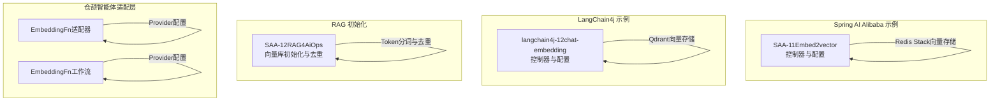
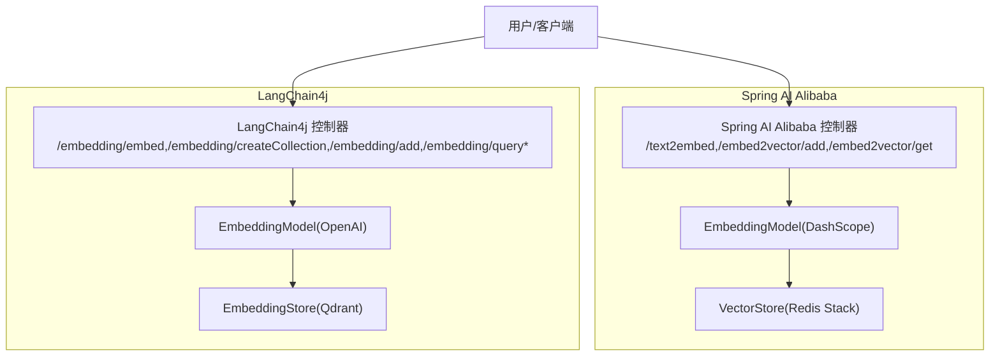
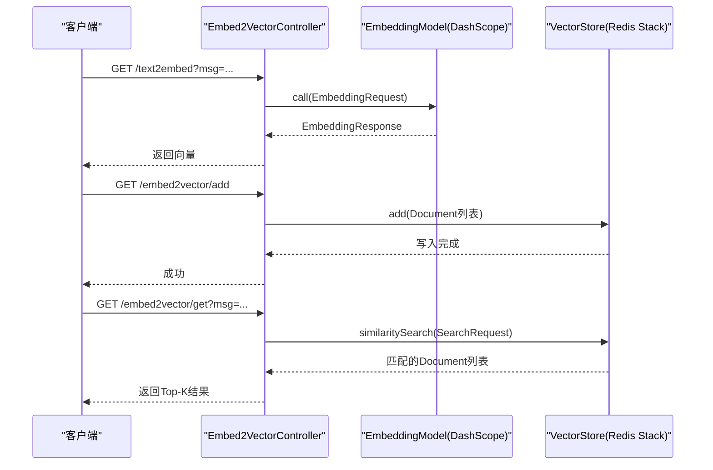
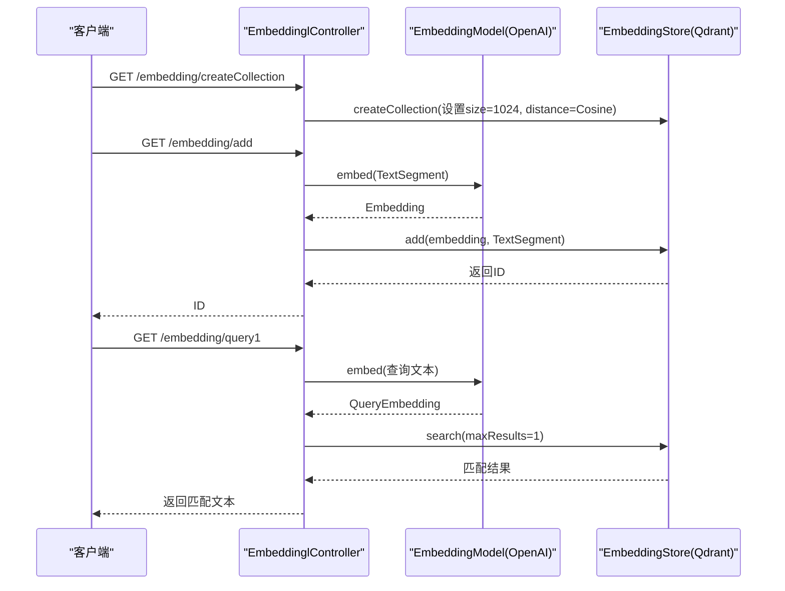
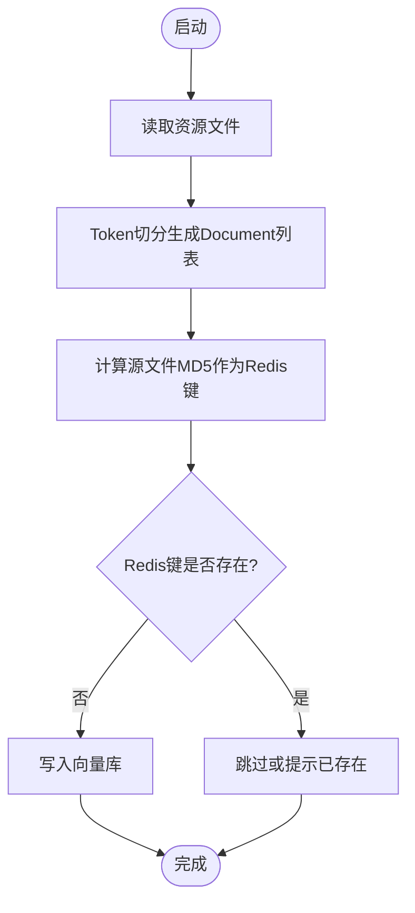
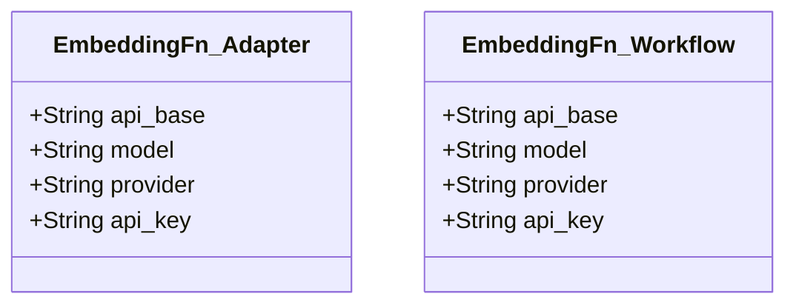
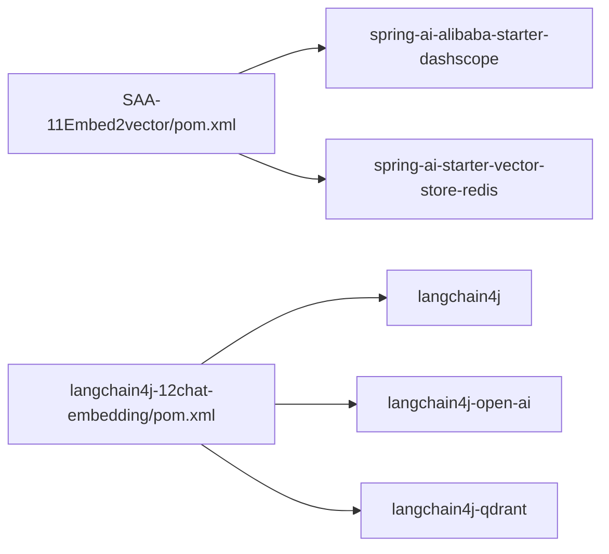

# Embedding向量组件

<cite>
**本文引用的文件**
- [Embed2VectorController.java](file://【1】SpringAIAlibaba-atguiguV1/SAA-11Embed2vector/src/main/java/com/atguigu/study/controller/Embed2VectorController.java)
- [application.properties](file://【1】SpringAIAlibaba-atguiguV1/SAA-11Embed2vector/src/main/resources/application.properties)
- [pom.xml](file://【1】SpringAIAlibaba-atguiguV1/SAA-11Embed2vector/pom.xml)
- [InitVectorDatabaseConfig.java](file://【1】SpringAIAlibaba-atguiguV1/SAA-12RAG4AiOps/src/main/java/com/atguigu/study/config/InitVectorDatabaseConfig.java)
- [EmbeddinglController.java](file://【2】langchain4j-atguiguV5/langchain4j-12chat-embedding/src/main/java/com/atguigu/study/controller/EmbeddinglController.java)
- [application.properties](file://【2】langchain4j-atguiguV5/langchain4j-12chat-embedding/src/main/resources/application.properties)
- [pom.xml](file://【2】langchain4j-atguiguV5/langchain4j-12chat-embedding/pom.xml)
- [EmbeddingFn.java（仓颉智能体-适配器）](file://【3】工作资料/code/仓颉智能体/nlp-agent/agent-common/agent-rag-adapter/src/main/java/com/yundingtech/agent/adapter/provider/model/search/EmbeddingFn.java)
- [EmbeddingFn.java（仓颉智能体-工作流）](file://【3】工作资料/code/仓颉智能体/nlp-agent/agent-worker/src/main/java/com/yundingtech/agent/work/modules/workflow/model/search/EmbeddingFn.java)
</cite>

## 目录
1. [简介](#简介)
2. [项目结构](#项目结构)
3. [核心组件](#核心组件)
4. [架构总览](#架构总览)
5. [详细组件分析](#详细组件分析)
6. [依赖分析](#依赖分析)
7. [性能考虑](#性能考虑)
8. [故障排查指南](#故障排查指南)
9. [结论](#结论)
10. [附录](#附录)

## 简介
本技术文档围绕Embedding向量组件展开，系统性介绍文本向量化的原理、嵌入模型选择与配置、向量相似度计算方法，并深入讲解EmbeddingModel的使用方式、批量处理优化、向量存储与检索策略。文档结合仓库中的Spring AI Alibaba与LangChain4j两个实现，提供构建向量数据库、实现语义搜索、文档聚类等典型应用场景的实践路径，同时给出向量维度优化、性能调优与向量质量评估的方法建议。

## 项目结构
本仓库中与Embedding向量组件直接相关的模块包括：
- Spring AI Alibaba 示例模块（SAA-11Embed2vector）：演示DashScope嵌入模型、Redis Stack向量存储与相似度检索。
- LangChain4j 示例模块（langchain4j-12chat-embedding）：演示OpenAI嵌入模型、Qdrant向量存储与过滤查询。
- RAG配置模块（SAA-12RAG4AiOps）：演示基于Token分词的文档切分与去重写入向量库的初始化流程。
- 仓颉智能体适配层：定义Embedding调用的Provider配置模型。

**图表来源**
- [Embed2VectorController.java:26-90](file://【1】SpringAIAlibaba-atguiguV1/SAA-11Embed2vector/src/main/java/com/atguigu/study/controller/Embed2VectorController.java#L26-L90)
- [application.properties:10-24](file://【1】SpringAIAlibaba-atguiguV1/SAA-11Embed2vector/src/main/resources/application.properties#L10-L24)
- [EmbeddinglController.java:26-127](file://【2】langchain4j-atguiguV5/langchain4j-12chat-embedding/src/main/java/com/atguigu/study/controller/EmbeddinglController.java#L26-L127)
- [application.properties:1-4](file://【2】langchain4j-atguiguV5/langchain4j-12chat-embedding/src/main/resources/application.properties#L1-L4)
- [InitVectorDatabaseConfig.java:26-74](file://【1】SpringAIAlibaba-atguiguV1/SAA-12RAG4AiOps/src/main/java/com/atguigu/study/config/InitVectorDatabaseConfig.java#L26-L74)
- [EmbeddingFn.java（仓颉智能体-适配器）:6-11](file://【3】工作资料/code/仓颉智能体/nlp-agent/agent-common/agent-rag-adapter/src/main/java/com/yundingtech/agent/adapter/provider/model/search/EmbeddingFn.java#L6-L11)
- [EmbeddingFn.java（仓颉智能体-工作流）:6-11](file://【3】工作资料/code/仓颉智能体/nlp-agent/agent-worker/src/main/java/com/yundingtech/agent/work/modules/workflow/model/search/EmbeddingFn.java#L6-L11)

**章节来源**
- [Embed2VectorController.java:26-90](file://【1】SpringAIAlibaba-atguiguV1/SAA-11Embed2vector/src/main/java/com/atguigu/study/controller/Embed2VectorController.java#L26-L90)
- [application.properties:10-24](file://【1】SpringAIAlibaba-atguiguV1/SAA-11Embed2vector/src/main/resources/application.properties#L10-L24)
- [EmbeddinglController.java:26-127](file://【2】langchain4j-atguiguV5/langchain4j-12chat-embedding/src/main/java/com/atguigu/study/controller/EmbeddinglController.java#L26-L127)
- [application.properties:1-4](file://【2】langchain4j-atguiguV5/langchain4j-12chat-embedding/src/main/resources/application.properties#L1-L4)
- [InitVectorDatabaseConfig.java:26-74](file://【1】SpringAIAlibaba-atguiguV1/SAA-12RAG4AiOps/src/main/java/com/atguigu/study/config/InitVectorDatabaseConfig.java#L26-L74)
- [EmbeddingFn.java（仓颉智能体-适配器）:6-11](file://【3】工作资料/code/仓颉智能体/nlp-agent/agent-common/agent-rag-adapter/src/main/java/com/yundingtech/agent/adapter/provider/model/search/EmbeddingFn.java#L6-L11)
- [EmbeddingFn.java（仓颉智能体-工作流）:6-11](file://【3】工作资料/code/仓颉智能体/nlp-agent/agent-worker/src/main/java/com/yundingtech/agent/work/modules/workflow/model/search/EmbeddingFn.java#L6-L11)

## 核心组件
- 文本向量化控制器（Spring AI Alibaba）
  - 提供文本转Embedding的REST接口，支持指定嵌入模型选项。
  - 支持将Document集合批量写入Redis Stack向量库。
  - 支持基于相似度的检索，限制返回Top-K条结果。
- 文本向量化控制器（LangChain4j）
  - 提供文本转Embedding的REST接口，支持创建Qdrant集合、写入向量并按元数据过滤查询。
- 向量库初始化配置（RAG）
  - 基于TokenTextSplitter对文档进行切分，使用MD5源标识做Redis去重，避免重复写入。
- Provider配置模型（仓颉智能体）
  - 统一描述嵌入服务的API Base、模型名、提供商与密钥，便于在不同模块间复用。

**章节来源**
- [Embed2VectorController.java:41-90](file://【1】SpringAIAlibaba-atguiguV1/SAA-11Embed2vector/src/main/java/com/atguigu/study/controller/Embed2VectorController.java#L41-L90)
- [EmbeddinglController.java:45-127](file://【2】langchain4j-atguiguV5/langchain4j-12chat-embedding/src/main/java/com/atguigu/study/controller/EmbeddinglController.java#L45-L127)
- [InitVectorDatabaseConfig.java:36-72](file://【1】SpringAIAlibaba-atguiguV1/SAA-12RAG4AiOps/src/main/java/com/atguigu/study/config/InitVectorDatabaseConfig.java#L36-L72)
- [EmbeddingFn.java（仓颉智能体-适配器）:6-11](file://【3】工作资料/code/仓颉智能体/nlp-agent/agent-common/agent-rag-adapter/src/main/java/com/yundingtech/agent/adapter/provider/model/search/EmbeddingFn.java#L6-L11)
- [EmbeddingFn.java（仓颉智能体-工作流）:6-11](file://【3】工作资料/code/仓颉智能体/nlp-agent/agent-worker/src/main/java/com/yundingtech/agent/work/modules/workflow/model/search/EmbeddingFn.java#L6-L11)

## 架构总览
下图展示了两种主流向量方案的端到端流程：Spring AI Alibaba（DashScope + Redis Stack）与LangChain4j（OpenAI + Qdrant）。两者均遵循“文本输入 → 嵌入生成 → 向量存储/检索”的通用模式。

**图表来源**
- [Embed2VectorController.java:41-90](file://【1】SpringAIAlibaba-atguiguV1/SAA-11Embed2vector/src/main/java/com/atguigu/study/controller/Embed2VectorController.java#L41-L90)
- [application.properties:10-24](file://【1】SpringAIAlibaba-atguiguV1/SAA-11Embed2vector/src/main/resources/application.properties#L10-L24)
- [EmbeddinglController.java:45-127](file://【2】langchain4j-atguiguV5/langchain4j-12chat-embedding/src/main/java/com/atguigu/study/controller/EmbeddinglController.java#L45-L127)
- [application.properties:1-4](file://【2】langchain4j-atguiguV5/langchain4j-12chat-embedding/src/main/resources/application.properties#L1-L4)

## 详细组件分析

### Spring AI Alibaba：文本向量化与Redis Stack检索
- 文本向量化
  - 使用EmbeddingModel.call发起Embedding请求，可指定DashScope模型选项。
  - 返回EmbeddingResponse，包含向量输出与元信息。
- 批量写入向量库
  - 将多个Document写入VectorStore，底层由Redis Stack承载。
- 相似度检索
  - 构造SearchRequest，设置查询文本与Top-K，调用similaritySearch执行检索。

**图表来源**
- [Embed2VectorController.java:41-90](file://【1】SpringAIAlibaba-atguiguV1/SAA-11Embed2vector/src/main/java/com/atguigu/study/controller/Embed2VectorController.java#L41-L90)

**章节来源**
- [Embed2VectorController.java:41-90](file://【1】SpringAIAlibaba-atguiguV1/SAA-11Embed2vector/src/main/java/com/atguigu/study/controller/Embed2VectorController.java#L41-L90)
- [application.properties:10-24](file://【1】SpringAIAlibaba-atguiguV1/SAA-11Embed2vector/src/main/resources/application.properties#L10-L24)

### LangChain4j：Qdrant向量存储与过滤检索
- 创建集合
  - 通过QdrantClient创建集合，设置向量维度与距离度量（余弦距离）。
- 写入向量
  - 将TextSegment及其元数据写入EmbeddingStore，返回唯一标识。
- 查询
  - 支持基于查询向量的纯量检索与带元数据过滤的检索（如按作者过滤）。

**图表来源**
- [EmbeddinglController.java:67-127](file://【2】langchain4j-atguiguV5/langchain4j-12chat-embedding/src/main/java/com/atguigu/study/controller/EmbeddinglController.java#L67-L127)

**章节来源**
- [EmbeddinglController.java:45-127](file://【2】langchain4j-atguiguV5/langchain4j-12chat-embedding/src/main/java/com/atguigu/study/controller/EmbeddinglController.java#L45-L127)
- [application.properties:1-4](file://【2】langchain4j-atguiguV5/langchain4j-12chat-embedding/src/main/resources/application.properties#L1-L4)

### RAG初始化与去重策略
- 文档读取与切分
  - 使用TextReader读取资源文件，再经TokenTextSplitter按Token切分为多个Document。
- 去重写入
  - 基于源文件元数据生成MD5作为Redis键，使用setIfAbsent确保仅首次写入，避免重复初始化。

**图表来源**
- [InitVectorDatabaseConfig.java:36-72](file://【1】SpringAIAlibaba-atguiguV1/SAA-12RAG4AiOps/src/main/java/com/atguigu/study/config/InitVectorDatabaseConfig.java#L36-L72)

**章节来源**
- [InitVectorDatabaseConfig.java:36-72](file://【1】SpringAIAlibaba-atguiguV1/SAA-12RAG4AiOps/src/main/java/com/atguigu/study/config/InitVectorDatabaseConfig.java#L36-L72)

### 仓颉智能体：统一的Embedding Provider配置
- 两个模块中均定义了EmbeddingFn模型，用于封装API Base、模型名、提供商与密钥，便于跨模块共享与切换。

**图表来源**
- [EmbeddingFn.java（仓颉智能体-适配器）:6-11](file://【3】工作资料/code/仓颉智能体/nlp-agent/agent-common/agent-rag-adapter/src/main/java/com/yundingtech/agent/adapter/provider/model/search/EmbeddingFn.java#L6-L11)
- [EmbeddingFn.java（仓颉智能体-工作流）:6-11](file://【3】工作资料/code/仓颉智能体/nlp-agent/agent-worker/src/main/java/com/yundingtech/agent/work/modules/workflow/model/search/EmbeddingFn.java#L6-L11)

**章节来源**
- [EmbeddingFn.java（仓颉智能体-适配器）:6-11](file://【3】工作资料/code/仓颉智能体/nlp-agent/agent-common/agent-rag-adapter/src/main/java/com/yundingtech/agent/adapter/provider/model/search/EmbeddingFn.java#L6-L11)
- [EmbeddingFn.java（仓颉智能体-工作流）:6-11](file://【3】工作资料/code/仓颉智能体/nlp-agent/agent-worker/src/main/java/com/yundingtech/agent/work/modules/workflow/model/search/EmbeddingFn.java#L6-L11)

## 依赖分析
- Spring AI Alibaba（SAA-11Embed2vector）
  - 依赖spring-ai-alibaba-starter-dashscope与spring-ai-starter-vector-store-redis，分别提供DashScope嵌入模型与Redis Stack向量存储能力。
- LangChain4j（langchain4j-12chat-embedding）
  - 依赖langchain4j、langchain4j-open-ai与langchain4j-qdrant，分别提供OpenAI嵌入模型与Qdrant向量存储能力。

**图表来源**
- [pom.xml:14-46](file://【1】SpringAIAlibaba-atguiguV1/SAA-11Embed2vector/pom.xml#L14-L46)
- [pom.xml:21-50](file://【2】langchain4j-atguiguV5/langchain4j-12chat-embedding/pom.xml#L21-L50)

**章节来源**
- [pom.xml:14-46](file://【1】SpringAIAlibaba-atguiguV1/SAA-11Embed2vector/pom.xml#L14-L46)
- [pom.xml:21-50](file://【2】langchain4j-atguiguV5/langchain4j-12chat-embedding/pom.xml#L21-L50)

## 性能考虑
- 向量维度与相似度度量
  - 在LangChain4j示例中，集合创建时设置向量维度为1024，距离度量为余弦距离；可根据模型输出维度调整。
- 批量写入与去重
  - RAG初始化采用Redis setIfAbsent进行去重，避免重复写入带来的性能浪费。
- Top-K与过滤
  - 检索时限制Top-K，减少返回结果集大小；LangChain4j示例展示了基于元数据的过滤，进一步缩小候选范围。
- 分词与切分
  - 使用TokenTextSplitter进行切分，有助于控制单条向量的长度与语义完整性，提升检索效率。

**章节来源**
- [EmbeddinglController.java:67-75](file://【2】langchain4j-atguiguV5/langchain4j-12chat-embedding/src/main/java/com/atguigu/study/controller/EmbeddinglController.java#L67-L75)
- [InitVectorDatabaseConfig.java:44-72](file://【1】SpringAIAlibaba-atguiguV1/SAA-12RAG4AiOps/src/main/java/com/atguigu/study/config/InitVectorDatabaseConfig.java#L44-L72)

## 故障排查指南
- Redis Stack初始化失败
  - 检查spring.ai.vectorstore.redis.initialize-schema与index-name、prefix配置是否正确。
- Qdrant连接异常
  - 确认Qdrant服务可用，集合创建与查询时的集合名称一致。
- 重复写入导致数据冗余
  - 使用Redis去重策略（setIfAbsent），避免多次初始化。
- 模型配置错误
  - 确认DashScope/OpenAI模型名称与API Key有效，检查对应starter依赖是否引入。

**章节来源**
- [application.properties:10-24](file://【1】SpringAIAlibaba-atguiguV1/SAA-11Embed2vector/src/main/resources/application.properties#L10-L24)
- [application.properties:1-4](file://【2】langchain4j-atguiguV5/langchain4j-12chat-embedding/src/main/resources/application.properties#L1-L4)
- [InitVectorDatabaseConfig.java:58-71](file://【1】SpringAIAlibaba-atguiguV1/SAA-12RAG4AiOps/src/main/java/com/atguigu/study/config/InitVectorDatabaseConfig.java#L58-L71)

## 结论
本组件文档基于Spring AI Alibaba与LangChain4j两个实现，系统阐述了Embedding向量化的端到端流程：从文本输入、嵌入生成、向量存储到相似度检索。通过Redis Stack与Qdrant两种向量库方案，结合Token分词与Redis去重策略，能够满足从基础语义检索到复杂过滤查询的应用场景。后续可在模型维度、批量写入并发、Top-K与过滤策略等方面持续优化，以获得更佳的性能与召回效果。

## 附录
- 实际代码示例路径（不含具体代码内容）
  - 文本向量化与Redis检索：[Embed2VectorController.java:41-90](file://【1】SpringAIAlibaba-atguiguV1/SAA-11Embed2vector/src/main/java/com/atguigu/study/controller/Embed2VectorController.java#L41-L90)
  - Qdrant集合创建与写入检索：[EmbeddinglController.java:67-127](file://【2】langchain4j-atguiguV5/langchain4j-12chat-embedding/src/main/java/com/atguigu/study/controller/EmbeddinglController.java#L67-L127)
  - 向量库初始化与去重：[InitVectorDatabaseConfig.java:36-72](file://【1】SpringAIAlibaba-atguiguV1/SAA-12RAG4AiOps/src/main/java/com/atguigu/study/config/InitVectorDatabaseConfig.java#L36-L72)
  - Provider配置模型：[EmbeddingFn.java（适配器）:6-11](file://【3】工作资料/code/仓颉智能体/nlp-agent/agent-common/agent-rag-adapter/src/main/java/com/yundingtech/agent/adapter/provider/model/search/EmbeddingFn.java#L6-L11)、[EmbeddingFn.java（工作流）:6-11](file://【3】工作资料/code/仓颉智能体/nlp-agent/agent-worker/src/main/java/com/yundingtech/agent/work/modules/workflow/model/search/EmbeddingFn.java#L6-L11)
- 依赖声明参考
  - [SAA-11Embed2vector/pom.xml:14-46](file://【1】SpringAIAlibaba-atguiguV1/SAA-11Embed2vector/pom.xml#L14-L46)
  - [langchain4j-12chat-embedding/pom.xml:21-50](file://【2】langchain4j-atguiguV5/langchain4j-12chat-embedding/pom.xml#L21-L50)