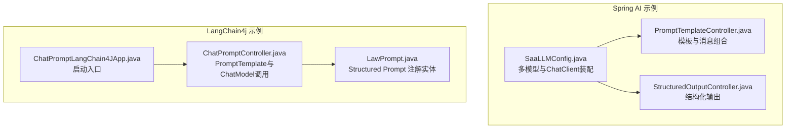
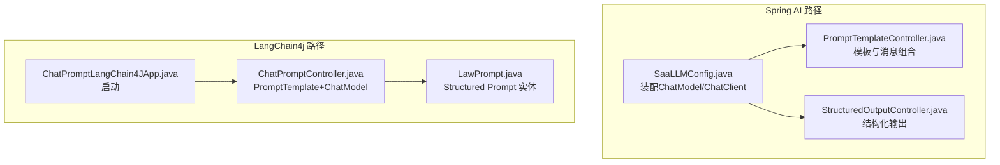
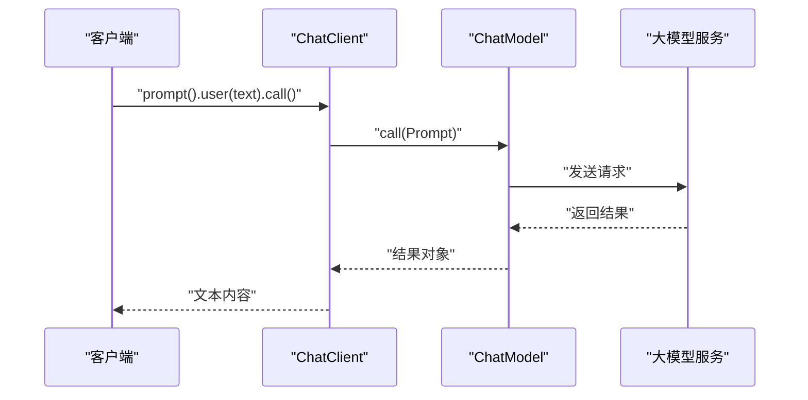
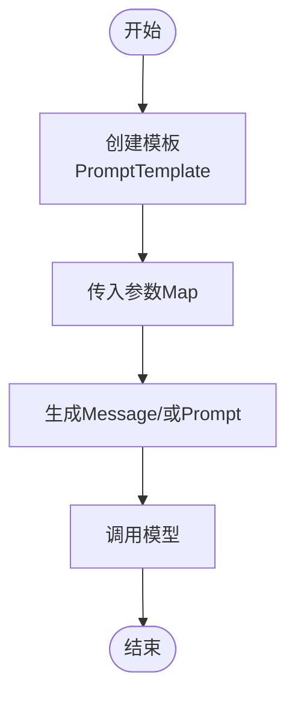
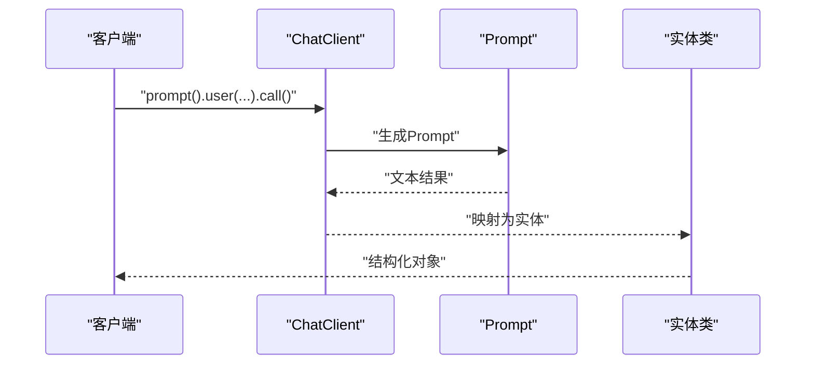
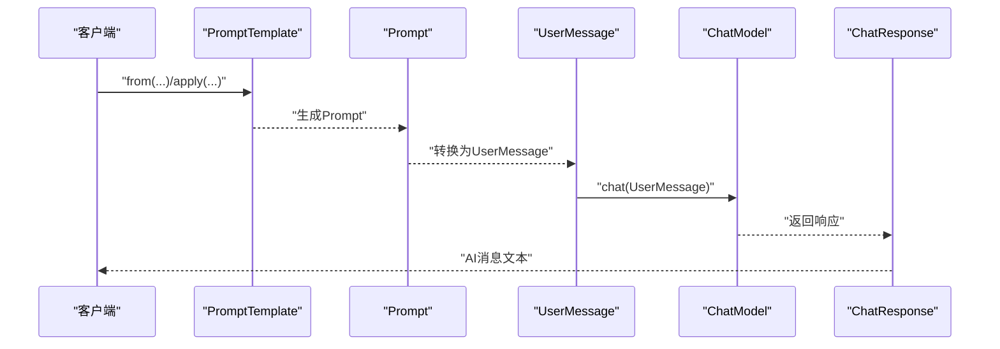
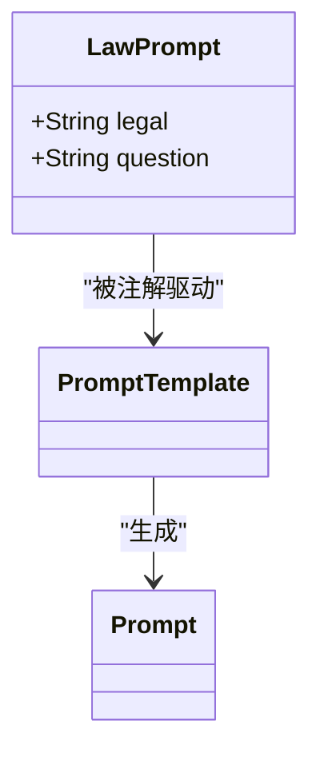
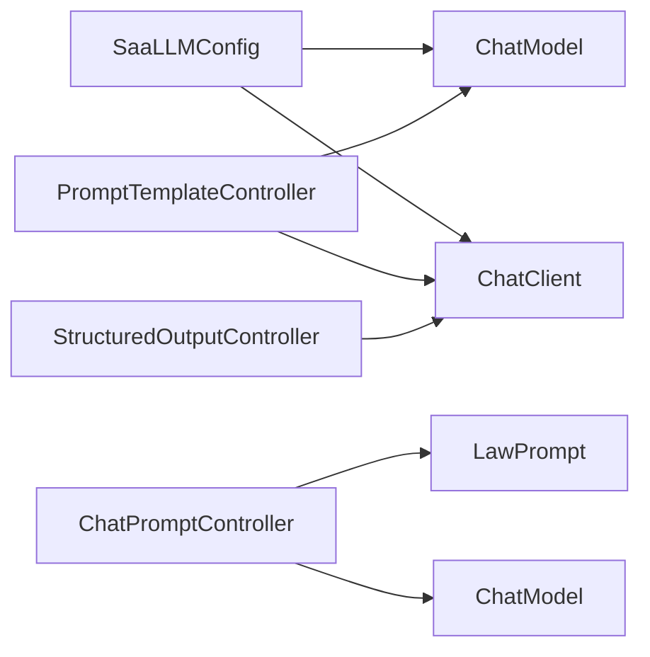

# LangChain核心组件

<cite>
**本文引用的文件**
- [HelloLangChain4JApp.java](file://【2】langchain4j-atguiguV5/langchain4j-01helloworld/src/main/java/com/atguigu/study/HelloLangChain4JApp.java)
- [ChatPromptLangChain4JApp.java](file://【2】langchain4j-atguiguV5/langchain4j-09chat-prompt/src/main/java/com/atguigu/study/ChatPromptLangChain4JApp.java)
- [ChatPromptController.java](file://【2】langchain4j-atguiguV5/langchain4j-09chat-prompt/src/main/java/com/atguigu/study/controller/ChatPromptController.java)
- [LawPrompt.java](file://【2】langchain4j-atguiguV5/langchain4j-09chat-prompt/src/main/java/com/atguigu/study/entities/LawPrompt.java)
- [SaaLLMConfig.java](file://【1】SpringAIAlibaba-atguiguV1/SAA-06PromptTemplate/src/main/java/com/atguigu/study/config/SaaLLMConfig.java)
- [PromptTemplateController.java](file://【1】SpringAIAlibaba-atguiguV1/SAA-06PromptTemplate/src/main/java/com/atguigu/study/controller/PromptTemplateController.java)
- [StructuredOutputController.java](file://【1】SpringAIAlibaba-atguiguV1/SAA-07StructuredOutput/src/main/java/com/atguigu/study/controller/StructuredOutputController.java)
- [StudentRecord.java](file://【1】SpringAIAlibaba-atguiguV1/SAA-07StructuredOutput/src/main/java/com/atguigu/study/records/StudentRecord.java)
</cite>

## 目录
1. [引言](#引言)
2. [项目结构](#项目结构)
3. [核心组件](#核心组件)
4. [架构总览](#架构总览)
5. [详细组件分析](#详细组件分析)
6. [依赖分析](#依赖分析)
7. [性能考虑](#性能考虑)
8. [故障排查指南](#故障排查指南)
9. [结论](#结论)
10. [附录](#附录)

## 引言
本文件面向希望系统掌握LangChain核心组件的开发者与架构师，围绕以下主题展开：Model大模型接口、PromptTemplate提示词模板、OutputParser输出解析器、Runnable运行时组件等。我们将结合仓库中的Spring AI与LangChain4j示例，给出组件职责、配置选项、API接口、参数说明、返回值、典型使用场景、组合模式、性能优化与错误处理最佳实践。

## 项目结构
本仓库包含两套LangChain相关示例：
- Spring AI示例（基于Spring AI ChatClient/ChatModel）：涵盖PromptTemplate、Structured Output、System/User Message组合、多模型并存等能力。
- LangChain4j示例（基于dev.langchain4j）：涵盖Structured Prompt注解、PromptTemplate、Prompt、UserMessage、ChatModel调用等。

**图表来源**
- [SaaLLMConfig.java:1-76](file://【1】SpringAIAlibaba-atguiguV1/SAA-06PromptTemplate/src/main/java/com/atguigu/study/config/SaaLLMConfig.java#L1-L76)
- [PromptTemplateController.java:1-157](file://【1】SpringAIAlibaba-atguiguV1/SAA-06PromptTemplate/src/main/java/com/atguigu/study/controller/PromptTemplateController.java#L1-L157)
- [StructuredOutputController.java:1-66](file://【1】SpringAIAlibaba-atguiguV1/SAA-07StructuredOutput/src/main/java/com/atguigu/study/controller/StructuredOutputController.java#L1-L66)
- [ChatPromptLangChain4JApp.java:1-19](file://【2】langchain4j-atguiguV5/langchain4j-09chat-prompt/src/main/java/com/atguigu/study/ChatPromptLangChain4JApp.java#L1-L19)
- [ChatPromptController.java:1-106](file://【2】langchain4j-atguiguV5/langchain4j-09chat-prompt/src/main/java/com/atguigu/study/controller/ChatPromptController.java#L1-L106)
- [LawPrompt.java:1-18](file://【2】langchain4j-atguiguV5/langchain4j-09chat-prompt/src/main/java/com/atguigu/study/entities/LawPrompt.java#L1-L18)

**章节来源**
- [HelloLangChain4JApp.java:1-19](file://【2】langchain4j-atguiguV5/langchain4j-01helloworld/src/main/java/com/atguigu/study/HelloLangChain4JApp.java#L1-L19)
- [ChatPromptLangChain4JApp.java:1-19](file://【2】langchain4j-atguiguV5/langchain4j-09chat-prompt/src/main/java/com/atguigu/study/ChatPromptLangChain4JApp.java#L1-L19)

## 核心组件
本节从“职责-配置-接口-返回值”的维度，系统梳理LangChain核心组件在示例中的体现与映射。

- Model大模型接口
  - Spring AI：ChatModel/ChatClient负责统一调用不同后端模型，支持默认参数、流式/非流式调用。
  - LangChain4j：ChatModel负责接收消息并返回ChatResponse。
  - 关键点：模型选择、默认参数、并发与超时、流式输出。
  - 参考路径：
    - [SaaLLMConfig.java:29-75](file://【1】SpringAIAlibaba-atguiguV1/SAA-06PromptTemplate/src/main/java/com/atguigu/study/config/SaaLLMConfig.java#L29-L75)
    - [ChatPromptController.java:32](file://【2】langchain4j-atguiguV5/langchain4j-09chat-prompt/src/main/java/com/atguigu/study/controller/ChatPromptController.java#L32)

- PromptTemplate提示词模板
  - Spring AI：PromptTemplate/SystemPromptTemplate支持字符串模板与外部资源文件模板；可与SystemMessage/UserMessage组合成Prompt。
  - LangChain4j：PromptTemplate支持从字符串或Map参数生成Prompt；可转为UserMessage交由ChatModel。
  - 关键点：占位符语法、模板来源（内存/文件）、与消息类型的组合。
  - 参考路径：
    - [PromptTemplateController.java:54-89](file://【1】SpringAIAlibaba-atguiguV1/SAA-06PromptTemplate/src/main/java/com/atguigu/study/controller/PromptTemplateController.java#L54-L89)
    - [ChatPromptController.java:92-98](file://【2】langchain4j-atguiguV5/langchain4j-09chat-prompt/src/main/java/com/atguigu/study/controller/ChatPromptController.java#L92-L98)

- OutputParser输出解析器
  - Spring AI：Structured Output通过ChatClient返回实体类（如record），实现结构化解析与强类型输出。
  - LangChain4j：未直接展示OutputParser实现，但可通过PromptTemplate+ChatModel+实体映射实现类似效果。
  - 关键点：实体类定义、参数绑定、类型安全。
  - 参考路径：
    - [StructuredOutputController.java:28-64](file://【1】SpringAIAlibaba-atguiguV1/SAA-07StructuredOutput/src/main/java/com/atguigu/study/controller/StructuredOutputController.java#L28-L64)
    - [StudentRecord.java:1-9](file://【1】SpringAIAlibaba-atguiguV1/SAA-07StructuredOutput/src/main/java/com/atguigu/study/records/StudentRecord.java#L1-L9)

- Runnable运行时组件
  - Spring AI：ChatClient提供链式API（prompt().user().call/stream），可视为“运行时组件”的高层封装。
  - LangChain4j：ChatModel.chat(...)构成一次“运行时执行”，可与PromptTemplate/Prompt组合形成可复用的运行单元。
  - 关键点：链式调用、流式输出、错误传播。
  - 参考路径：
    - [PromptTemplateController.java:68](file://【1】SpringAIAlibaba-atguiguV1/SAA-06PromptTemplate/src/main/java/com/atguigu/study/controller/PromptTemplateController.java#L68)
    - [ChatPromptController.java:98](file://【2】langchain4j-atguiguV5/langchain4j-09chat-prompt/src/main/java/com/atguigu/study/controller/ChatPromptController.java#L98)

**章节来源**
- [SaaLLMConfig.java:19-76](file://【1】SpringAIAlibaba-atguiguV1/SAA-06PromptTemplate/src/main/java/com/atguigu/study/config/SaaLLMConfig.java#L19-L76)
- [PromptTemplateController.java:25-157](file://【1】SpringAIAlibaba-atguiguV1/SAA-06PromptTemplate/src/main/java/com/atguigu/study/controller/PromptTemplateController.java#L25-L157)
- [StructuredOutputController.java:17-66](file://【1】SpringAIAlibaba-atguiguV1/SAA-07StructuredOutput/src/main/java/com/atguigu/study/controller/StructuredOutputController.java#L17-L66)
- [ChatPromptController.java:25-106](file://【2】langchain4j-atguiguV5/langchain4j-09chat-prompt/src/main/java/com/atguigu/study/controller/ChatPromptController.java#L25-L106)

## 架构总览
下图展示了Spring AI与LangChain4j两种实现路径在示例中的交互关系与数据流向。

**图表来源**
- [SaaLLMConfig.java:19-76](file://【1】SpringAIAlibaba-atguiguV1/SAA-06PromptTemplate/src/main/java/com/atguigu/study/config/SaaLLMConfig.java#L19-L76)
- [PromptTemplateController.java:25-157](file://【1】SpringAIAlibaba-atguiguV1/SAA-06PromptTemplate/src/main/java/com/atguigu/study/controller/PromptTemplateController.java#L25-L157)
- [StructuredOutputController.java:17-66](file://【1】SpringAIAlibaba-atguiguV1/SAA-07StructuredOutput/src/main/java/com/atguigu/study/controller/StructuredOutputController.java#L17-L66)
- [ChatPromptLangChain4JApp.java:11-18](file://【2】langchain4j-atguiguV5/langchain4j-09chat-prompt/src/main/java/com/atguigu/study/ChatPromptLangChain4JApp.java#L11-L18)
- [ChatPromptController.java:25-106](file://【2】langchain4j-atguiguV5/langchain4j-09chat-prompt/src/main/java/com/atguigu/study/controller/ChatPromptController.java#L25-L106)
- [LawPrompt.java:11-17](file://【2】langchain4j-atguiguV5/langchain4j-09chat-prompt/src/main/java/com/atguigu/study/entities/LawPrompt.java#L11-L17)

## 详细组件分析

### 组件一：Model大模型接口（Spring AI）
- 职责
  - 封装不同后端模型的调用细节，提供统一的ChatModel/ChatClient接口。
  - 支持默认参数、模型选择、流式/非流式输出。
- 配置选项
  - 模型名称、API Key、默认选项（如模型名、温度、最大令牌等）。
- API与参数
  - ChatModel.call(Prompt)：返回结果对象，包含输出文本与元数据。
  - ChatClient.prompt(...).user(...).call()/stream()：链式API，支持参数注入与流式输出。
- 返回值
  - 非流式：包含最终文本与辅助信息。
  - 流式：逐块返回增量文本。
- 使用示例（路径）
  - [SaaLLMConfig.java:29-75](file://【1】SpringAIAlibaba-atguiguV1/SAA-06PromptTemplate/src/main/java/com/atguigu/study/config/SaaLLMConfig.java#L29-L75)
  - [PromptTemplateController.java:68](file://【1】SpringAIAlibaba-atguiguV1/SAA-06PromptTemplate/src/main/java/com/atguigu/study/controller/PromptTemplateController.java#L68)
  - [PromptTemplateController.java:135](file://【1】SpringAIAlibaba-atguiguV1/SAA-06PromptTemplate/src/main/java/com/atguigu/study/controller/PromptTemplateController.java#L135)

**图表来源**
- [PromptTemplateController.java:68](file://【1】SpringAIAlibaba-atguiguV1/SAA-06PromptTemplate/src/main/java/com/atguigu/study/controller/PromptTemplateController.java#L68)
- [SaaLLMConfig.java:56-75](file://【1】SpringAIAlibaba-atguiguV1/SAA-06PromptTemplate/src/main/java/com/atguigu/study/config/SaaLLMConfig.java#L56-L75)

**章节来源**
- [SaaLLMConfig.java:29-75](file://【1】SpringAIAlibaba-atguiguV1/SAA-06PromptTemplate/src/main/java/com/atguigu/study/config/SaaLLMConfig.java#L29-L75)
- [PromptTemplateController.java:54-138](file://【1】SpringAIAlibaba-atguiguV1/SAA-06PromptTemplate/src/main/java/com/atguigu/study/controller/PromptTemplateController.java#L54-L138)

### 组件二：PromptTemplate提示词模板（Spring AI）
- 职责
  - 将占位符模板与参数映射为具体提示词，支持系统消息与用户消息的组合。
- 配置选项
  - 模板来源：字符串模板或外部资源文件。
  - 占位符语法：如{topic}、{output_format}等。
- API与参数
  - PromptTemplate构造与create/createMessage。
  - SystemPromptTemplate/SystemMessage与PromptTemplate组合。
- 返回值
  - Prompt对象或Message对象，供后续调用模型使用。
- 使用示例（路径）
  - [PromptTemplateController.java:54-89](file://【1】SpringAIAlibaba-atguiguV1/SAA-06PromptTemplate/src/main/java/com/atguigu/study/controller/PromptTemplateController.java#L54-L89)
  - [PromptTemplateController.java:101-114](file://【1】SpringAIAlibaba-atguiguV1/SAA-06PromptTemplate/src/main/java/com/atguigu/study/controller/PromptTemplateController.java#L101-L114)

**图表来源**
- [PromptTemplateController.java:54-89](file://【1】SpringAIAlibaba-atguiguV1/SAA-06PromptTemplate/src/main/java/com/atguigu/study/controller/PromptTemplateController.java#L54-L89)

**章节来源**
- [PromptTemplateController.java:54-114](file://【1】SpringAIAlibaba-atguiguV1/SAA-06PromptTemplate/src/main/java/com/atguigu/study/controller/PromptTemplateController.java#L54-L114)

### 组件三：OutputParser输出解析器（Spring AI）
- 职责
  - 将模型输出解析为结构化实体，保证类型安全与易用性。
- 配置选项
  - 实体类定义（record/POJO），参数名与模板占位符一致。
- API与参数
  - ChatClient.prompt().user(...).call().entity(Class)。
- 返回值
  - 指定类型的实体对象。
- 使用示例（路径）
  - [StructuredOutputController.java:28-64](file://【1】SpringAIAlibaba-atguiguV1/SAA-07StructuredOutput/src/main/java/com/atguigu/study/controller/StructuredOutputController.java#L28-L64)
  - [StudentRecord.java:1-9](file://【1】SpringAIAlibaba-atguiguV1/SAA-07StructuredOutput/src/main/java/com/atguigu/study/records/StudentRecord.java#L1-L9)

**图表来源**
- [StructuredOutputController.java:28-64](file://【1】SpringAIAlibaba-atguiguV1/SAA-07StructuredOutput/src/main/java/com/atguigu/study/controller/StructuredOutputController.java#L28-L64)

**章节来源**
- [StructuredOutputController.java:17-66](file://【1】SpringAIAlibaba-atguiguV1/SAA-07StructuredOutput/src/main/java/com/atguigu/study/controller/StructuredOutputController.java#L17-L66)
- [StudentRecord.java:1-9](file://【1】SpringAIAlibaba-atguiguV1/SAA-07StructuredOutput/src/main/java/com/atguigu/study/records/StudentRecord.java#L1-L9)

### 组件四：Runnable运行时组件（LangChain4j）
- 职责
  - 将PromptTemplate与ChatModel组合为可复用的运行单元，支持链式调用与流式输出。
- 配置选项
  - ChatModel实例、PromptTemplate参数。
- API与参数
  - PromptTemplate.from(...)、apply(...)、toUserMessage()。
  - ChatModel.chat(UserMessage)。
- 返回值
  - ChatResponse（包含AI消息文本等）。
- 使用示例（路径）
  - [ChatPromptController.java:92-98](file://【2】langchain4j-atguiguV5/langchain4j-09chat-prompt/src/main/java/com/atguigu/study/controller/ChatPromptController.java#L92-L98)
  - [LawPrompt.java:11-17](file://【2】langchain4j-atguiguV5/langchain4j-09chat-prompt/src/main/java/com/atguigu/study/entities/LawPrompt.java#L11-L17)

**图表来源**
- [ChatPromptController.java:92-98](file://【2】langchain4j-atguiguV5/langchain4j-09chat-prompt/src/main/java/com/atguigu/study/controller/ChatPromptController.java#L92-L98)

**章节来源**
- [ChatPromptController.java:25-106](file://【2】langchain4j-atguiguV5/langchain4j-09chat-prompt/src/main/java/com/atguigu/study/controller/ChatPromptController.java#L25-L106)
- [LawPrompt.java:11-17](file://【2】langchain4j-atguiguV5/langchain4j-09chat-prompt/src/main/java/com/atguigu/study/entities/LawPrompt.java#L11-L17)

### 组件五：Structured Prompt注解（LangChain4j）
- 职责
  - 通过注解声明结构化提示词模板，简化实体到模板的映射。
- 配置选项
  - @StructuredPrompt注解的模板字符串。
- API与参数
  - 实体类字段与模板占位符对应。
- 返回值
  - 由模板与实体生成的Prompt。
- 使用示例（路径）
  - [LawPrompt.java:11-17](file://【2】langchain4j-atguiguV5/langchain4j-09chat-prompt/src/main/java/com/atguigu/study/entities/LawPrompt.java#L11-L17)
  - [ChatPromptController.java:62-67](file://【2】langchain4j-atguiguV5/langchain4j-09chat-prompt/src/main/java/com/atguigu/study/controller/ChatPromptController.java#L62-L67)

**图表来源**
- [LawPrompt.java:11-17](file://【2】langchain4j-atguiguV5/langchain4j-09chat-prompt/src/main/java/com/atguigu/study/entities/LawPrompt.java#L11-L17)

**章节来源**
- [LawPrompt.java:11-17](file://【2】langchain4j-atguiguV5/langchain4j-09chat-prompt/src/main/java/com/atguigu/study/entities/LawPrompt.java#L11-L17)
- [ChatPromptController.java:62-72](file://【2】langchain4j-atguiguV5/langchain4j-09chat-prompt/src/main/java/com/atguigu/study/controller/ChatPromptController.java#L62-L72)

## 依赖分析
- 组件耦合
  - Spring AI：SaaLLMConfig装配ChatModel/ChatClient，各Controller按需注入使用。
  - LangChain4j：Controller依赖ChatModel与实体类，形成“模板/实体→Prompt→模型”的单向依赖。
- 外部依赖
  - 模型后端（示例中为DashScope模型）。
  - Spring AI与LangChain4j框架。
- 潜在循环依赖
  - 示例中未见循环依赖，控制器与配置分层清晰。

**图表来源**
- [SaaLLMConfig.java:29-75](file://【1】SpringAIAlibaba-atguiguV1/SAA-06PromptTemplate/src/main/java/com/atguigu/study/config/SaaLLMConfig.java#L29-L75)
- [PromptTemplateController.java:25-157](file://【1】SpringAIAlibaba-atguiguV1/SAA-06PromptTemplate/src/main/java/com/atguigu/study/controller/PromptTemplateController.java#L25-L157)
- [StructuredOutputController.java:17-66](file://【1】SpringAIAlibaba-atguiguV1/SAA-07StructuredOutput/src/main/java/com/atguigu/study/controller/StructuredOutputController.java#L17-L66)
- [ChatPromptController.java:25-106](file://【2】langchain4j-atguiguV5/langchain4j-09chat-prompt/src/main/java/com/atguigu/study/controller/ChatPromptController.java#L25-L106)
- [LawPrompt.java:11-17](file://【2】langchain4j-atguiguV5/langchain4j-09chat-prompt/src/main/java/com/atguigu/study/entities/LawPrompt.java#L11-L17)

**章节来源**
- [SaaLLMConfig.java:19-76](file://【1】SpringAIAlibaba-atguiguV1/SAA-06PromptTemplate/src/main/java/com/atguigu/study/config/SaaLLMConfig.java#L19-L76)
- [PromptTemplateController.java:25-157](file://【1】SpringAIAlibaba-atguiguV1/SAA-06PromptTemplate/src/main/java/com/atguigu/study/controller/PromptTemplateController.java#L25-L157)
- [StructuredOutputController.java:17-66](file://【1】SpringAIAlibaba-atguiguV1/SAA-07StructuredOutput/src/main/java/com/atguigu/study/controller/StructuredOutputController.java#L17-L66)
- [ChatPromptController.java:25-106](file://【2】langchain4j-atguiguV5/langchain4j-09chat-prompt/src/main/java/com/atguigu/study/controller/ChatPromptController.java#L25-L106)
- [LawPrompt.java:11-17](file://【2】langchain4j-atguiguV5/langchain4j-09chat-prompt/src/main/java/com/atguigu/study/entities/LawPrompt.java#L11-L17)

## 性能考虑
- 模型选择与默认参数
  - 在配置中统一设置默认模型与参数，避免重复构建开销。
  - 参考：[SaaLLMConfig.java:32-53](file://【1】SpringAIAlibaba-atguiguV1/SAA-06PromptTemplate/src/main/java/com/atguigu/study/config/SaaLLMConfig.java#L32-L53)
- 流式输出
  - 对长文本或实时交互场景优先使用流式输出，降低首字节延迟。
  - 参考：[PromptTemplateController.java:68](file://【1】SpringAIAlibaba-atguiguV1/SAA-06PromptTemplate/src/main/java/com/atguigu/study/controller/PromptTemplateController.java#L68)
- 模板复用
  - 将常用模板抽取为资源文件，减少字符串拼接与编译期开销。
  - 参考：[PromptTemplateController.java:84](file://【1】SpringAIAlibaba-atguiguV1/SAA-06PromptTemplate/src/main/java/com/atguigu/study/controller/PromptTemplateController.java#L84)
- 结构化输出缓存
  - 对稳定结构化输出进行结果缓存，减少重复解析成本。
- 并发与限流
  - 控制并发请求数与重试策略，避免模型侧限流或超时。

## 故障排查指南
- 模板占位符不匹配
  - 症状：参数未生效或抛出异常。
  - 处理：检查占位符命名与传参Map键一致；LangChain4j示例中默认使用“it”作为单参数占位符。
  - 参考：[ChatPromptController.java:92-94](file://【2】langchain4j-atguiguV5/langchain4j-09chat-prompt/src/main/java/com/atguigu/study/controller/ChatPromptController.java#L92-L94)
- 模型调用失败
  - 症状：网络超时、鉴权失败、模型不可用。
  - 处理：检查API Key、模型名称、网络连通性；在配置中设置合理的超时与重试。
  - 参考：[SaaLLMConfig.java:22-23](file://【1】SpringAIAlibaba-atguiguV1/SAA-06PromptTemplate/src/main/java/com/atguigu/study/config/SaaLLMConfig.java#L22-L23)
- 输出解析异常
  - 症状：结构化输出无法映射到实体类。
  - 处理：确保实体类字段与模板参数一致；必要时开启日志查看原始输出。
  - 参考：[StructuredOutputController.java:41](file://【1】SpringAIAlibaba-atguiguV1/SAA-07StructuredOutput/src/main/java/com/atguigu/study/controller/StructuredOutputController.java#L41)

**章节来源**
- [ChatPromptController.java:92-94](file://【2】langchain4j-atguiguV5/langchain4j-09chat-prompt/src/main/java/com/atguigu/study/controller/ChatPromptController.java#L92-L94)
- [SaaLLMConfig.java:22-23](file://【1】SpringAIAlibaba-atguiguV1/SAA-06PromptTemplate/src/main/java/com/atguigu/study/config/SaaLLMConfig.java#L22-L23)
- [StructuredOutputController.java:41](file://【1】SpringAIAlibaba-atguiguV1/SAA-07StructuredOutput/src/main/java/com/atguigu/study/controller/StructuredOutputController.java#L41)

## 结论
LangChain核心组件在本仓库中通过Spring AI与LangChain4j两条路径得到充分演示：PromptTemplate负责模板化提示词，Model接口抽象模型调用，OutputParser实现结构化输出，而Runnable运行时组件则通过链式API与组合模式实现可复用的执行单元。建议在实际项目中：
- 统一配置与参数管理；
- 优先采用流式输出与模板复用；
- 严格校验占位符与实体字段；
- 建立完善的监控与重试机制。

## 附录
- 快速测试入口
  - Spring AI：访问示例控制器提供的GET接口，传入相应参数即可体验模板、结构化输出与消息组合。
  - LangChain4j：通过控制器方法触发PromptTemplate与ChatModel调用。
- 参考路径汇总
  - [SaaLLMConfig.java:29-75](file://【1】SpringAIAlibaba-atguiguV1/SAA-06PromptTemplate/src/main/java/com/atguigu/study/config/SaaLLMConfig.java#L29-L75)
  - [PromptTemplateController.java:54-157](file://【1】SpringAIAlibaba-atguiguV1/SAA-06PromptTemplate/src/main/java/com/atguigu/study/controller/PromptTemplateController.java#L54-L157)
  - [StructuredOutputController.java:28-64](file://【1】SpringAIAlibaba-atguiguV1/SAA-07StructuredOutput/src/main/java/com/atguigu/study/controller/StructuredOutputController.java#L28-L64)
  - [ChatPromptController.java:35-104](file://【2】langchain4j-atguiguV5/langchain4j-09chat-prompt/src/main/java/com/atguigu/study/controller/ChatPromptController.java#L35-L104)
  - [LawPrompt.java:11-17](file://【2】langchain4j-atguiguV5/langchain4j-09chat-prompt/src/main/java/com/atguigu/study/entities/LawPrompt.java#L11-L17)