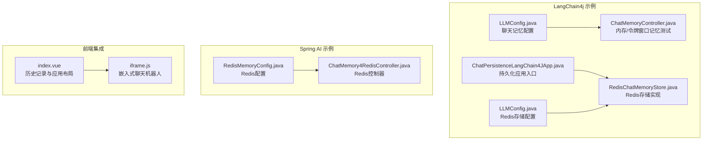
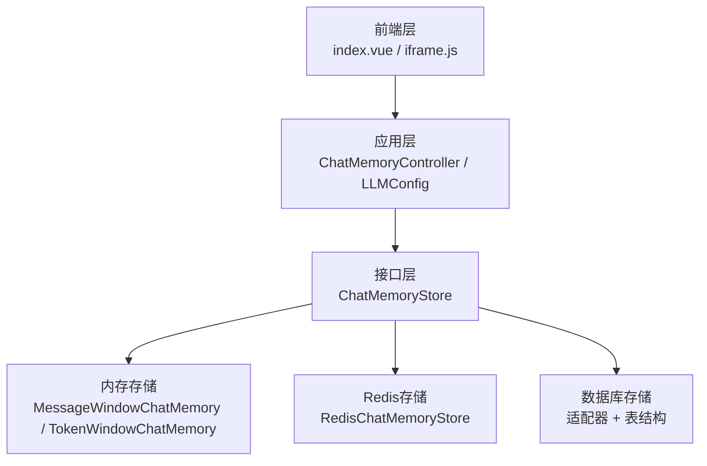
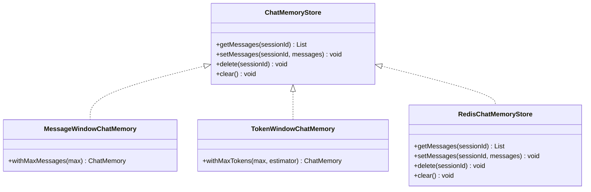
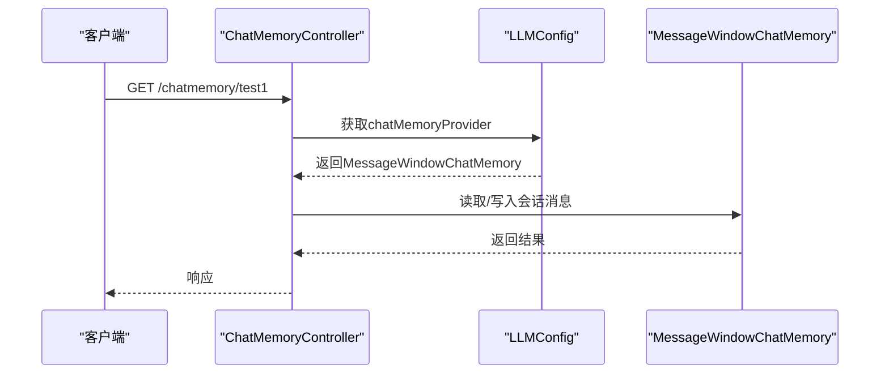
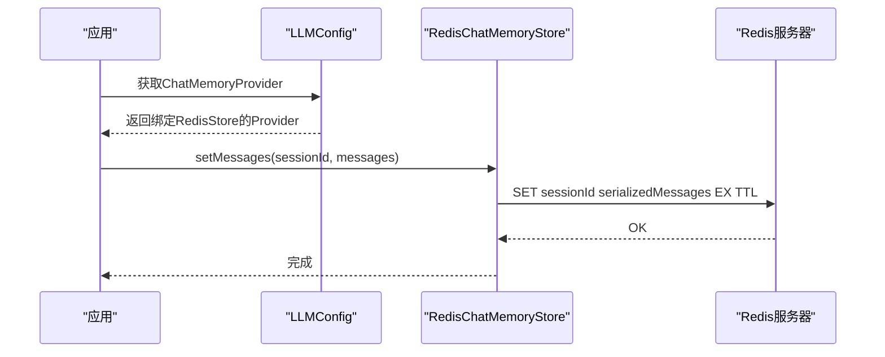
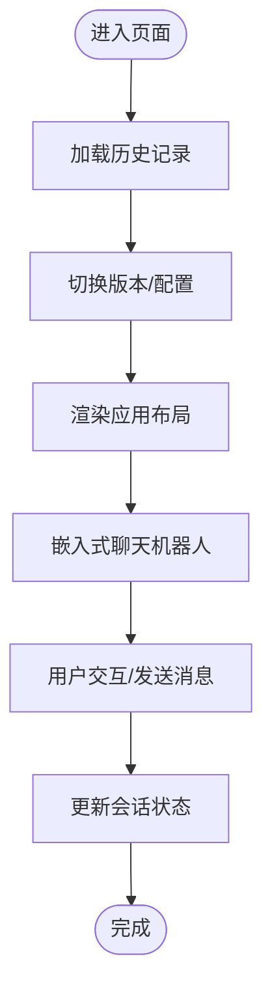
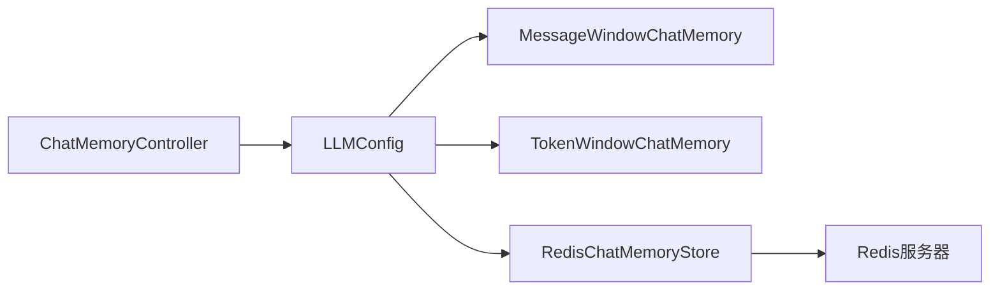

# Memory存储组件

<cite>
**本文引用的文件**
- [RedisChatMemoryStore.java](file://【2】langchain4j-atguiguV5/langchain4j-10chat-persistence/src/main/java/com/atguigu/study/config/RedisChatMemoryStore.java)
- [LLMConfig.java](file://【2】langchain4j-atguiguV5/langchain4j-08chat-memory/src/main/java/com/atguigu/study/config/LLMConfig.java)
- [LLMConfig.java](file://【2】langchain4j-atguiguV5/langchain4j-10chat-persistence/src/main/java/com/atguigu/study/config/LLMConfig.java)
- [ChatMemoryController.java](file://【2】langchain4j-atguiguV5/langchain4j-08chat-memory/src/main/java/com/atguigu/study/controller/ChatMemoryController.java)
- [ChatMemory4RedisController.java](file://【1】SpringAIAlibaba-atguiguV1/SAA-08Persistent/src/main/java/com/atguigu/study/controller/ChatMemory4RedisController.java)
- [RedisMemoryConfig.java](file://【1】SpringAIAlibaba-atguiguV5/langchain4j-10chat-persistence/src/main/java/com/atguigu/study/config/RedisMemoryConfig.java)
- [ChatPersistenceLangChain4JApp.java](file://【2】langchain4j-atguiguV5/langchain4j-10chat-persistence/src/main/java/com/atguigu/study/ChatPersistenceLangChain4JApp.java)
- [ChatMemoryLangChain4JApp.java](file://【2】langchain4j-atguiguV5/langchain4j-08chat-memory/src/main/java/com/atguigu/study/ChatMemoryLangChain4JApp.java)
- [index.vue](file://【3】工作资料/code/仓颉智能体/nlp-frontend-web/src/views/workspace/pages/workApps/pages/index.vue)
- [iframe.js](file://【3】工作资料/code/仓颉智能体/nlp-frontend-web/public/iframe.js)
</cite>

## 目录
1. [引言](#引言)
2. [项目结构](#项目结构)
3. [核心组件](#核心组件)
4. [架构总览](#架构总览)
5. [详细组件分析](#详细组件分析)
6. [依赖分析](#依赖分析)
7. [性能考虑](#性能考虑)
8. [故障排查指南](#故障排查指南)
9. [结论](#结论)
10. [附录](#附录)

## 引言
本技术文档围绕Memory存储组件展开，聚焦聊天记忆的存储机制、上下文管理与会话状态维护。文档从接口设计、多种存储实现（内存、Redis、数据库）到配置与使用示例进行系统性阐述，并给出性能优化、数据一致性与故障恢复策略，帮助读者在不同场景下正确选择与部署Memory存储方案。

## 项目结构
本仓库中与Memory存储相关的关键模块分布在以下位置：
- LangChain4j 示例：聊天记忆与持久化示例，包含内存窗口记忆、令牌窗口记忆以及基于Redis的持久化实现。
- Spring AI Alibaba 示例：基于Redis的Memory配置与控制器示例。
- 前端集成：嵌入式聊天机器人与历史记录交互页面，体现会话状态在前端的呈现与切换。

**图表来源**
- [LLMConfig.java:1-120](file://【2】langchain4j-atguiguV5/langchain4j-08chat-memory/src/main/java/com/atguigu/study/config/LLMConfig.java#L1-L120)
- [ChatMemoryController.java:1-120](file://【2】langchain4j-atguiguV5/langchain4j-08chat-memory/src/main/java/com/atguigu/study/controller/ChatMemoryController.java#L1-L120)
- [ChatPersistenceLangChain4JApp.java:1-120](file://【2】langchain4j-atguiguV5/langchain4j-10chat-persistence/src/main/java/com/atguigu/study/ChatPersistenceLangChain4JApp.java#L1-L120)
- [RedisChatMemoryStore.java:1-120](file://【2】langchain4j-atguiguV5/langchain4j-10chat-persistence/src/main/java/com/atguigu/study/config/RedisChatMemoryStore.java#L1-L120)
- [LLMConfig.java:1-120](file://【2】langchain4j-atguiguV5/langchain4j-10chat-persistence/src/main/java/com/atguigu/study/config/LLMConfig.java#L1-L120)
- [RedisMemoryConfig.java:1-120](file://【1】SpringAIAlibaba-atguiguV1/SAA-08Persistent/src/main/java/com/atguigu/study/config/RedisMemoryConfig.java#L1-L120)
- [ChatMemory4RedisController.java:1-120](file://【1】SpringAIAlibaba-atguiguV1/SAA-08Persistent/src/main/java/com/atguigu/study/controller/ChatMemory4RedisController.java#L1-L120)
- [index.vue:150-422](file://【3】工作资料/code/仓颉智能体/nlp-frontend-web/src/views/workspace/pages/workApps/pages/index.vue#L150-L422)
- [iframe.js:1-168](file://【3】工作资料/code/仓颉智能体/nlp-frontend-web/public/iframe.js#L1-L168)

**章节来源**
- [LLMConfig.java:1-120](file://【2】langchain4j-atguiguV5/langchain4j-08chat-memory/src/main/java/com/atguigu/study/config/LLMConfig.java#L1-L120)
- [ChatMemoryController.java:1-120](file://【2】langchain4j-atguiguV5/langchain4j-08chat-memory/src/main/java/com/atguigu/study/controller/ChatMemoryController.java#L1-L120)
- [ChatPersistenceLangChain4JApp.java:1-120](file://【2】langchain4j-atguiguV5/langchain4j-10chat-persistence/src/main/java/com/atguigu/study/ChatPersistenceLangChain4JApp.java#L1-L120)
- [RedisChatMemoryStore.java:1-120](file://【2】langchain4j-atguiguV5/langchain4j-10chat-persistence/src/main/java/com/atguigu/study/config/RedisChatMemoryStore.java#L1-L120)
- [LLMConfig.java:1-120](file://【2】langchain4j-atguiguV5/langchain4j-10chat-persistence/src/main/java/com/atguigu/study/config/LLMConfig.java#L1-L120)
- [RedisMemoryConfig.java:1-120](file://【1】SpringAIAlibaba-atguiguV1/SAA-08Persistent/src/main/java/com/atguigu/study/config/RedisMemoryConfig.java#L1-L120)
- [ChatMemory4RedisController.java:1-120](file://【1】SpringAIAlibaba-atguiguV1/SAA-08Persistent/src/main/java/com/atguigu/study/controller/ChatMemory4RedisController.java#L1-L120)
- [index.vue:150-422](file://【3】工作资料/code/仓颉智能体/nlp-frontend-web/src/views/workspace/pages/workApps/pages/index.vue#L150-L422)
- [iframe.js:1-168](file://【3】工作资料/code/仓颉智能体/nlp-frontend-web/public/iframe.js#L1-L168)

## 核心组件
- MemoryStore接口：定义聊天记忆的统一存取契约，支持读取、写入、删除与清空等操作，作为所有存储实现的抽象基座。
- 内存存储：基于内存的消息窗口或令牌窗口记忆，适合单实例、低延迟场景；通过最大消息数或最大令牌数进行淘汰策略。
- Redis存储：通过RedisChatMemoryStore实现，支持分布式共享与高可用；可结合过期策略与序列化策略保障性能与一致性。
- 数据库存储：通过ChatMemoryStore与数据库适配器组合实现，适用于强一致与审计需求；需关注查询性能与索引设计。
- 控制器与配置：通过LLMConfig与控制器暴露测试与演示接口，便于验证不同存储实现的行为与性能。

**章节来源**
- [LLMConfig.java:1-120](file://【2】langchain4j-atguiguV5/langchain4j-08chat-memory/src/main/java/com/atguigu/study/config/LLMConfig.java#L1-L120)
- [LLMConfig.java:1-120](file://【2】langchain4j-atguiguV5/langchain4j-10chat-persistence/src/main/java/com/atguigu/study/config/LLMConfig.java#L1-L120)
- [RedisChatMemoryStore.java:1-120](file://【2】langchain4j-atguiguV5/langchain4j-10chat-persistence/src/main/java/com/atguigu/study/config/RedisChatMemoryStore.java#L1-L120)
- [ChatMemoryController.java:1-120](file://【2】langchain4j-atguiguV5/langchain4j-08chat-memory/src/main/java/com/atguigu/study/controller/ChatMemoryController.java#L1-L120)

## 架构总览
Memory存储组件在系统中的位置如下：
- 应用层：通过ChatMemoryController与LLMConfig暴露接口与配置。
- 存储层：内存、Redis、数据库三种实现，均遵循ChatMemoryStore接口。
- 前端层：index.vue负责应用布局与历史记录切换，iframe.js负责嵌入式聊天机器人加载与交互。

**图表来源**
- [ChatMemoryController.java:1-120](file://【2】langchain4j-atguiguV5/langchain4j-08chat-memory/src/main/java/com/atguigu/study/controller/ChatMemoryController.java#L1-L120)
- [LLMConfig.java:1-120](file://【2】langchain4j-atguiguV5/langchain4j-08chat-memory/src/main/java/com/atguigu/study/config/LLMConfig.java#L1-L120)
- [LLMConfig.java:1-120](file://【2】langchain4j-atguiguV5/langchain4j-10chat-persistence/src/main/java/com/atguigu/study/config/LLMConfig.java#L1-L120)
- [RedisChatMemoryStore.java:1-120](file://【2】langchain4j-atguiguV5/langchain4j-10chat-persistence/src/main/java/com/atguigu/study/config/RedisChatMemoryStore.java#L1-L120)
- [index.vue:150-422](file://【3】工作资料/code/仓颉智能体/nlp-frontend-web/src/views/workspace/pages/workApps/pages/index.vue#L150-L422)
- [iframe.js:1-168](file://【3】工作资料/code/仓颉智能体/nlp-frontend-web/public/iframe.js#L1-L168)

## 详细组件分析

### MemoryStore接口与实现
- 接口职责：定义会话记忆的统一存取能力，包括按会话ID读取、写入、删除与清空。
- 内存实现：MessageWindowChatMemory与TokenWindowChatMemory分别以消息条数与令牌数为维度进行淘汰，适合单实例场景。
- Redis实现：RedisChatMemoryStore将消息序列化后存储于Redis，支持分布式共享与过期控制。
- 数据库实现：通过适配器将消息映射到数据库表，满足审计与强一致需求。

**图表来源**
- [LLMConfig.java:1-120](file://【2】langchain4j-atguiguV5/langchain4j-08chat-memory/src/main/java/com/atguigu/study/config/LLMConfig.java#L1-L120)
- [LLMConfig.java:1-120](file://【2】langchain4j-atguiguV5/langchain4j-10chat-persistence/src/main/java/com/atguigu/study/config/LLMConfig.java#L1-L120)
- [RedisChatMemoryStore.java:1-120](file://【2】langchain4j-atguiguV5/langchain4j-10chat-persistence/src/main/java/com/atguigu/study/config/RedisChatMemoryStore.java#L1-L120)

**章节来源**
- [LLMConfig.java:1-120](file://【2】langchain4j-atguiguV5/langchain4j-08chat-memory/src/main/java/com/atguigu/study/config/LLMConfig.java#L1-L120)
- [LLMConfig.java:1-120](file://【2】langchain4j-atguiguV5/langchain4j-10chat-persistence/src/main/java/com/atguigu/study/config/LLMConfig.java#L1-L120)
- [RedisChatMemoryStore.java:1-120](file://【2】langchain4j-atguiguV5/langchain4j-10chat-persistence/src/main/java/com/atguigu/study/config/RedisChatMemoryStore.java#L1-L120)

### 配置与使用示例（内存/令牌窗口）
- 内存窗口记忆：通过LLMConfig中的chatMemoryProvider创建MessageWindowChatMemory，设置最大消息数进行淘汰。
- 令牌窗口记忆：通过TokenWindowChatMemory结合令牌估算器限制最大令牌数，适合长上下文场景。

**图表来源**
- [ChatMemoryController.java:1-120](file://【2】langchain4j-atguiguV5/langchain4j-08chat-memory/src/main/java/com/atguigu/study/controller/ChatMemoryController.java#L1-L120)
- [LLMConfig.java:1-120](file://【2】langchain4j-atguiguV5/langchain4j-08chat-memory/src/main/java/com/atguigu/study/config/LLMConfig.java#L1-L120)

**章节来源**
- [ChatMemoryController.java:1-120](file://【2】langchain4j-atguiguV5/langchain4j-08chat-memory/src/main/java/com/atguigu/study/controller/ChatMemoryController.java#L1-L120)
- [LLMConfig.java:1-120](file://【2】langchain4j-atguiguV5/langchain4j-08chat-memory/src/main/java/com/atguigu/study/config/LLMConfig.java#L1-L120)

### Redis存储实现与配置
- RedisChatMemoryStore：实现ChatMemoryStore接口，负责消息的序列化存储与读取。
- LLMConfig中的Redis配置：注入RedisChatMemoryStore并将其绑定到ChatMemoryProvider，实现持久化记忆。
- RedisMemoryConfig：Spring配置示例，展示Redis连接与Bean装配。

**图表来源**
- [LLMConfig.java:1-120](file://【2】langchain4j-atguiguV5/langchain4j-10chat-persistence/src/main/java/com/atguigu/study/config/LLMConfig.java#L1-L120)
- [RedisChatMemoryStore.java:1-120](file://【2】langchain4j-atguiguV5/langchain4j-10chat-persistence/src/main/java/com/atguigu/study/config/RedisChatMemoryStore.java#L1-L120)
- [RedisMemoryConfig.java:1-120](file://【1】SpringAIAlibaba-atguiguV1/SAA-08Persistent/src/main/java/com/atguigu/study/config/RedisMemoryConfig.java#L1-L120)

**章节来源**
- [LLMConfig.java:1-120](file://【2】langchain4j-atguiguV5/langchain4j-10chat-persistence/src/main/java/com/atguigu/study/config/LLMConfig.java#L1-L120)
- [RedisChatMemoryStore.java:1-120](file://【2】langchain4j-atguiguV5/langchain4j-10chat-persistence/src/main/java/com/atguigu/study/config/RedisChatMemoryStore.java#L1-L120)
- [RedisMemoryConfig.java:1-120](file://【1】SpringAIAlibaba-atguiguV1/SAA-08Persistent/src/main/java/com/atguigu/study/config/RedisMemoryConfig.java#L1-L120)

### 前端集成与会话状态
- index.vue：负责应用布局、历史记录列表与版本切换，承载会话状态的前端展示与交互。
- iframe.js：嵌入式聊天机器人加载逻辑，支持默认打开、拖拽与尺寸自适应，确保用户体验。

**图表来源**
- [index.vue:150-422](file://【3】工作资料/code/仓颉智能体/nlp-frontend-web/src/views/workspace/pages/workApps/pages/index.vue#L150-L422)
- [iframe.js:1-168](file://【3】工作资料/code/仓颉智能体/nlp-frontend-web/public/iframe.js#L1-L168)

**章节来源**
- [index.vue:150-422](file://【3】工作资料/code/仓颉智能体/nlp-frontend-web/src/views/workspace/pages/workApps/pages/index.vue#L150-L422)
- [iframe.js:1-168](file://【3】工作资料/code/仓颉智能体/nlp-frontend-web/public/iframe.js#L1-L168)

## 依赖分析
- 组件耦合：控制器依赖配置类提供的ChatMemoryProvider；配置类依赖具体存储实现（内存/Redis/数据库）。
- 外部依赖：Redis存储依赖Redis服务器；数据库存储依赖数据库驱动与表结构。
- 潜在循环：当前结构清晰，无明显循环依赖。

**图表来源**
- [ChatMemoryController.java:1-120](file://【2】langchain4j-atguiguV5/langchain4j-08chat-memory/src/main/java/com/atguigu/study/controller/ChatMemoryController.java#L1-L120)
- [LLMConfig.java:1-120](file://【2】langchain4j-atguiguV5/langchain4j-08chat-memory/src/main/java/com/atguigu/study/config/LLMConfig.java#L1-L120)
- [LLMConfig.java:1-120](file://【2】langchain4j-atguiguV5/langchain4j-10chat-persistence/src/main/java/com/atguigu/study/config/LLMConfig.java#L1-L120)
- [RedisChatMemoryStore.java:1-120](file://【2】langchain4j-atguiguV5/langchain4j-10chat-persistence/src/main/java/com/atguigu/study/config/RedisChatMemoryStore.java#L1-L120)

**章节来源**
- [ChatMemoryController.java:1-120](file://【2】langchain4j-atguiguV5/langchain4j-08chat-memory/src/main/java/com/atguigu/study/controller/ChatMemoryController.java#L1-L120)
- [LLMConfig.java:1-120](file://【2】langchain4j-atguiguV5/langchain4j-08chat-memory/src/main/java/com/atguigu/study/config/LLMConfig.java#L1-L120)
- [LLMConfig.java:1-120](file://【2】langchain4j-atguiguV5/langchain4j-10chat-persistence/src/main/java/com/atguigu/study/config/LLMConfig.java#L1-L120)
- [RedisChatMemoryStore.java:1-120](file://【2】langchain4j-atguiguV5/langchain4j-10chat-persistence/src/main/java/com/atguigu/study/config/RedisChatMemoryStore.java#L1-L120)

## 性能考虑
- 淘汰策略：内存窗口与令牌窗口通过最大数量限制上下文长度，避免无限增长导致内存压力。
- Redis优化：合理设置过期时间与序列化格式，减少网络与存储开销；使用批量操作降低RTT。
- 数据库优化：为会话ID建立索引，避免全表扫描；分表分库以提升并发能力。
- 前端体验：嵌入式聊天机器人支持拖拽与自适应尺寸，提升交互效率。

[本节为通用性能建议，无需特定文件引用]

## 故障排查指南
- Redis连接失败：检查RedisMemoryConfig中的连接参数与网络连通性。
- 消息读写异常：确认RedisChatMemoryStore的序列化策略与键空间命名规范。
- 上下文溢出：调整内存/令牌窗口的最大值，或引入更严格的淘汰策略。
- 前端无法加载：检查iframe.js中的资源路径与跨域策略。

**章节来源**
- [RedisMemoryConfig.java:1-120](file://【1】SpringAIAlibaba-atguiguV1/SAA-08Persistent/src/main/java/com/atguigu/study/config/RedisMemoryConfig.java#L1-L120)
- [RedisChatMemoryStore.java:1-120](file://【2】langchain4j-atguiguV5/langchain4j-10chat-persistence/src/main/java/com/atguigu/study/config/RedisChatMemoryStore.java#L1-L120)
- [iframe.js:1-168](file://【3】工作资料/code/仓颉智能体/nlp-frontend-web/public/iframe.js#L1-L168)

## 结论
Memory存储组件通过统一的ChatMemoryStore接口实现了多后端兼容，结合内存、Redis与数据库的不同特性，满足从单机到分布式、从高性能到强一致的多样化需求。配合合理的淘汰策略、过期与序列化配置，以及前端友好的交互体验，可在复杂业务场景中稳定运行并持续演进。

[本节为总结性内容，无需特定文件引用]

## 附录
- 配置要点
  - 内存窗口：通过MessageWindowChatMemory设置最大消息数。
  - 令牌窗口：通过TokenWindowChatMemory设置最大令牌数与估算器。
  - Redis：通过RedisChatMemoryStore与LLMConfig绑定，设置过期时间与序列化策略。
- 使用建议
  - 开发阶段优先使用内存存储验证逻辑；
  - 生产环境根据一致性与性能需求选择Redis或数据库存储；
  - 前端通过iframe.js与index.vue实现嵌入式聊天与历史记录管理。

[本节为概要性内容，无需特定文件引用]