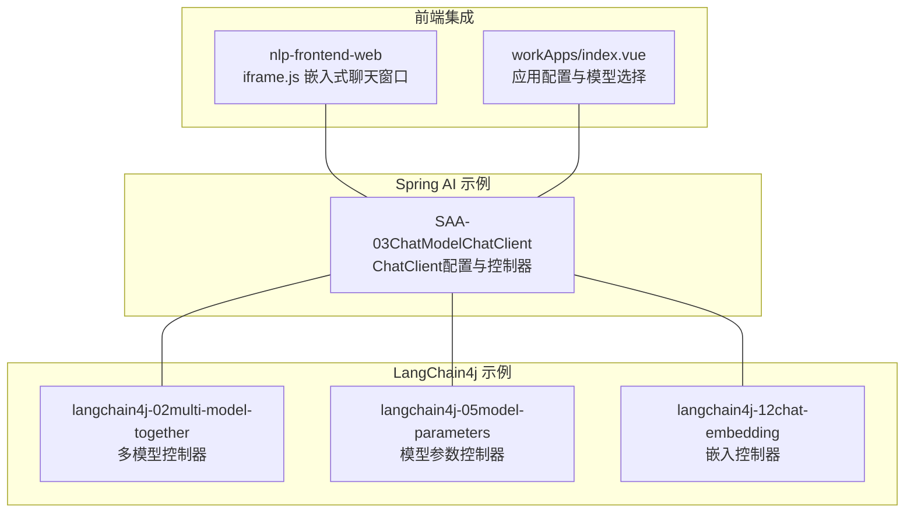
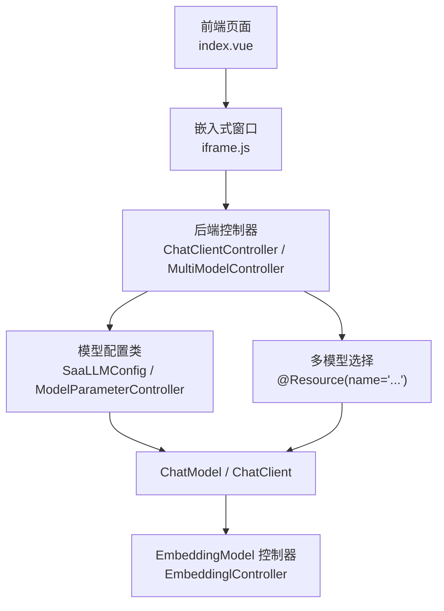
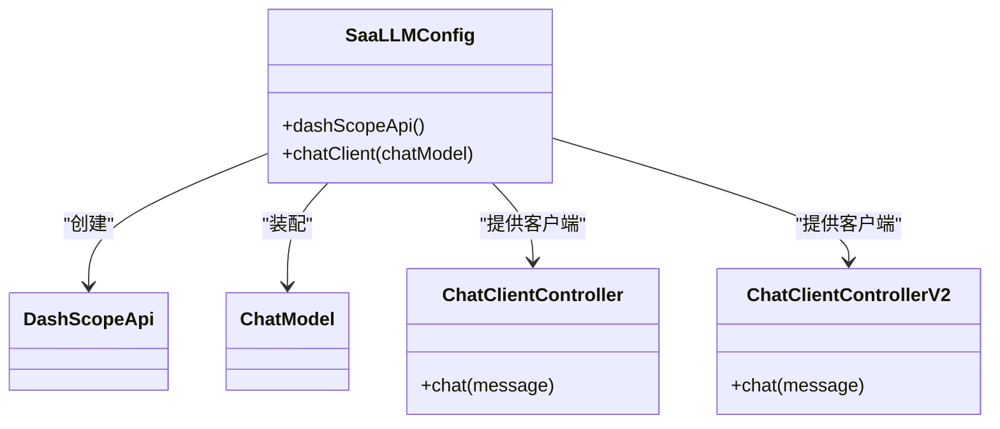
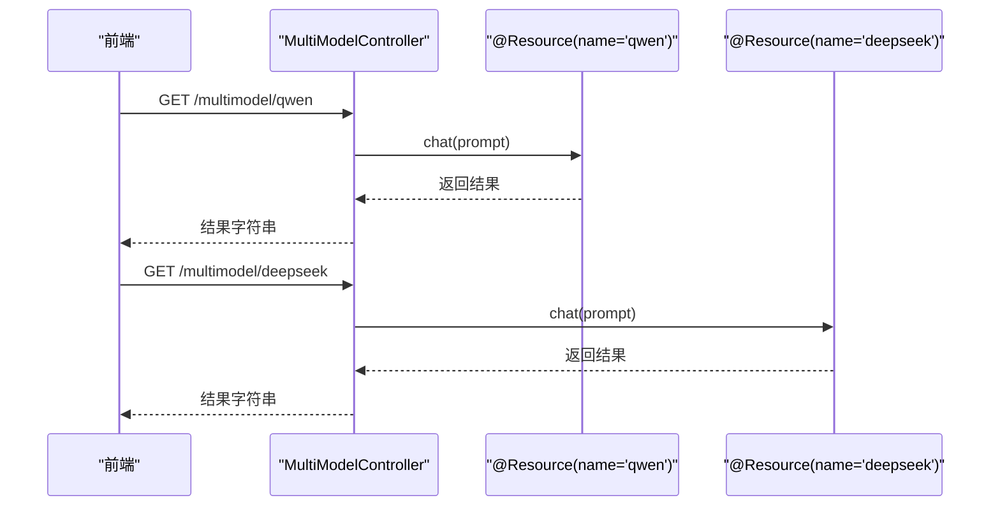
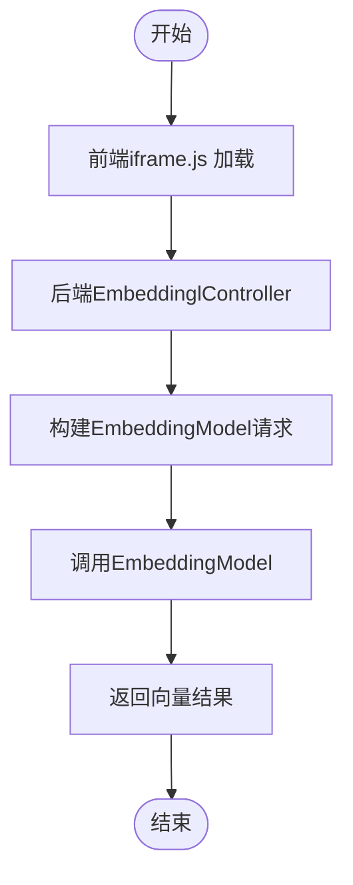
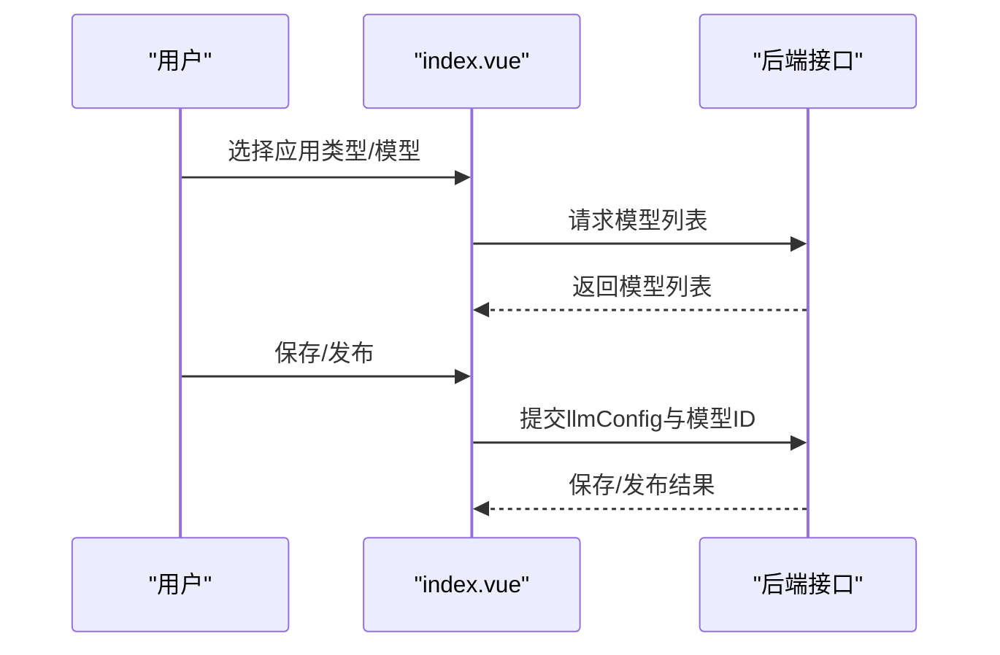
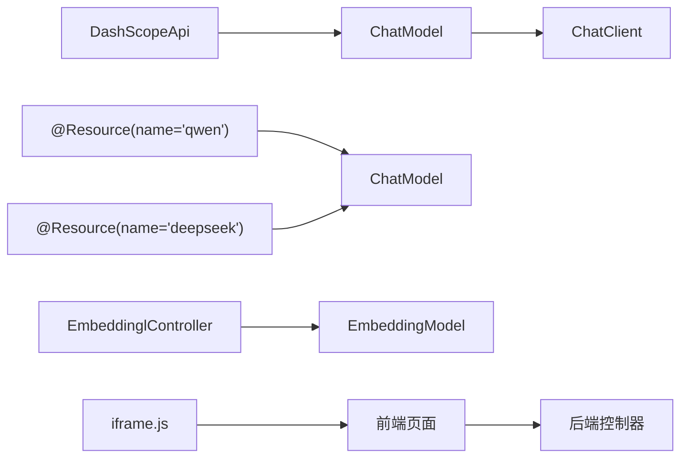

# Model大模型接口

<cite>
**本文引用的文件**
- [SaaLLMConfig.java](file://【1】SpringAIAlibaba-atguiguV1/SAA-03ChatModelChatClient/src/main/java/com/atguigu/study/config/SaaLLMConfig.java)
- [ChatClientController.java](file://【1】SpringAIAlibaba-atguiguV1/SAA-03ChatModelChatClient/src/main/java/com/atguigu/study/controller/ChatClientController.java)
- [ChatClientControllerV2.java](file://【1】SpringAIAlibaba-atguiguV1/SAA-03ChatModelChatClient/src/main/java/com/atguigu/study/controller/ChatClientControllerV2.java)
- [MultiModelController.java](file://【2】langchain4j-atguiguV5/langchain4j-02multi-model-together/src/main/java/com/atguigu/study/controller/MultiModelController.java)
- [ModelParameterController.java](file://【2】langchain4j-atguiguV5/langchain4j-05model-parameters/src/main/java/com/atguigu/study/controller/ModelParameterController.java)
- [EmbeddinglController.java](file://【2】langchain4j-atguiguV5/langchain4j-12chat-embedding/src/main/java/com/atguigu/study/controller/EmbeddinglController.java)
- [application.properties](file://【1】SpringAIAlibaba-atguiguV1/SAA-03ChatModelChatClient/src/main/resources/application.properties)
- [application.properties](file://【2】langchain4j-atguiguV5/langchain4j-05model-parameters/src/main/resources/application.properties)
- [application.properties](file://【2】langchain4j-atguiguV5/langchain4j-12chat-embedding/src/main/resources/application.properties)
- [index.vue](file://【3】工作资料/code/仓颉智能体/nlp-frontend-web/src/views/workspace/pages/workApps/index.vue)
- [iframe.js](file://【3】工作资料/code/仓颉智能体/nlp-frontend-web/public/iframe.js)
</cite>

## 目录
1. [引言](#引言)
2. [项目结构](#项目结构)
3. [核心组件](#核心组件)
4. [架构总览](#架构总览)
5. [详细组件分析](#详细组件分析)
6. [依赖分析](#依赖分析)
7. [性能考虑](#性能考虑)
8. [故障排查指南](#故障排查指南)
9. [结论](#结论)
10. [附录](#附录)

## 引言
本技术文档围绕“Model大模型接口”展开，聚焦于两类核心能力：对话型语言模型（ChatLanguageModel）与嵌入型模型（EmbeddingModel）。文档从接口设计、模型配置、参数调优、多模型集成策略、初始化流程、配置选项（如温度、最大令牌数、topP等）、模型切换机制等方面进行系统化阐述，并结合仓库中的Spring AI与LangChain4j示例工程，给出可落地的配置与调用方式，同时提供性能优化建议、错误处理策略与最佳实践。

## 项目结构
本仓库包含两套主流框架的示例工程：
- Spring AI Alibaba 示例（基于DashScope API）
- LangChain4j 示例（多模型、参数配置、嵌入）

此外，前端侧提供了嵌入式聊天窗口与应用管理界面，便于在业务系统中集成模型能力。

**图表来源**
- [SaaLLMConfig.java:1-40](file://【1】SpringAIAlibaba-atguiguV1/SAA-03ChatModelChatClient/src/main/java/com/atguigu/study/config/SaaLLMConfig.java#L1-L40)
- [MultiModelController.java:1-48](file://【2】langchain4j-atguiguV5/langchain4j-02multi-model-together/src/main/java/com/atguigu/study/controller/MultiModelController.java#L1-L48)
- [ModelParameterController.java:1-36](file://【2】langchain4j-atguiguV5/langchain4j-05model-parameters/src/main/java/com/atguigu/study/controller/ModelParameterController.java#L1-L36)
- [EmbeddinglController.java](file://【2】langchain4j-atguiguV5/langchain4j-12chat-embedding/src/main/java/com/atguigu/study/controller/EmbeddinglController.java)
- [iframe.js:1-168](file://【3】工作资料/code/仓颉智能体/nlp-frontend-web/public/iframe.js#L1-L168)
- [index.vue:154-188](file://【3】工作资料/code/仓颉智能体/nlp-frontend-web/src/views/workspace/pages/workApps/index.vue#L154-L188)

**章节来源**
- [SaaLLMConfig.java:1-40](file://【1】SpringAIAlibaba-atguiguV1/SAA-03ChatModelChatClient/src/main/java/com/atguigu/study/config/SaaLLMConfig.java#L1-L40)
- [MultiModelController.java:1-48](file://【2】langchain4j-atguiguV5/langchain4j-02multi-model-together/src/main/java/com/atguigu/study/controller/MultiModelController.java#L1-L48)
- [ModelParameterController.java:1-36](file://【2】langchain4j-atguiguV5/langchain4j-05model-parameters/src/main/java/com/atguigu/study/controller/ModelParameterController.java#L1-L36)
- [EmbeddinglController.java](file://【2】langchain4j-atguiguV5/langchain4j-12chat-embedding/src/main/java/com/atguigu/study/controller/EmbeddinglController.java)
- [iframe.js:1-168](file://【3】工作资料/code/仓颉智能体/nlp-frontend-web/public/iframe.js#L1-L168)
- [index.vue:154-188](file://【3】工作资料/code/仓颉智能体/nlp-frontend-web/src/views/workspace/pages/workApps/index.vue#L154-L188)

## 核心组件
- ChatLanguageModel（对话型语言模型）
  - 在Spring AI中通过ChatClient与ChatModel组合使用，配置入口见DashScope API Bean与ChatClient Bean。
  - 在LangChain4j中通过注入具体模型（如Qwen、DeepSeek）进行调用。
- EmbeddingModel（嵌入型模型）
  - LangChain4j示例工程提供EmbeddingController，演示向量化能力的调用与返回。

关键点：
- 模型初始化：通过配置类或属性文件加载API密钥、模型名称、端点等。
- 参数调优：温度、最大令牌数、topP等参数在控制器或配置类中体现。
- 多模型集成：通过命名Bean或资源限定名实现多模型并存与切换。
- 前端集成：iframe.js负责嵌入式聊天窗口；index.vue负责应用配置与模型列表选择。

**章节来源**
- [SaaLLMConfig.java:10-40](file://【1】SpringAIAlibaba-atguiguV1/SAA-03ChatModelChatClient/src/main/java/com/atguigu/study/config/SaaLLMConfig.java#L10-L40)
- [MultiModelController.java:20-46](file://【2】langchain4j-atguiguV5/langchain4j-02multi-model-together/src/main/java/com/atguigu/study/controller/MultiModelController.java#L20-L46)
- [ModelParameterController.java:22-34](file://【2】langchain4j-atguiguV5/langchain4j-05model-parameters/src/main/java/com/atguigu/study/controller/ModelParameterController.java#L22-L34)
- [EmbeddinglController.java](file://【2】langchain4j-atguiguV5/langchain4j-12chat-embedding/src/main/java/com/atguigu/study/controller/EmbeddinglController.java)
- [iframe.js:1-168](file://【3】工作资料/code/仓颉智能体/nlp-frontend-web/public/iframe.js#L1-L168)
- [index.vue:354-367](file://【3】工作资料/code/仓颉智能体/nlp-frontend-web/src/views/workspace/pages/workApps/index.vue#L354-L367)

## 架构总览
下图展示了从前端到后端模型调用的整体链路，以及多模型与参数配置的交互关系。

**图表来源**
- [index.vue:354-367](file://【3】工作资料/code/仓颉智能体/nlp-frontend-web/src/views/workspace/pages/workApps/index.vue#L354-L367)
- [iframe.js:42-58](file://【3】工作资料/code/仓颉智能体/nlp-frontend-web/public/iframe.js#L42-L58)
- [SaaLLMConfig.java:20-39](file://【1】SpringAIAlibaba-atguiguV1/SAA-03ChatModelChatClient/src/main/java/com/atguigu/study/config/SaaLLMConfig.java#L20-L39)
- [MultiModelController.java:20-46](file://【2】langchain4j-atguiguV5/langchain4j-02multi-model-together/src/main/java/com/atguigu/study/controller/MultiModelController.java#L20-L46)
- [ModelParameterController.java:22-34](file://【2】langchain4j-atguiguV5/langchain4j-05model-parameters/src/main/java/com/atguigu/study/controller/ModelParameterController.java#L22-L34)
- [EmbeddinglController.java](file://【2】langchain4j-atguiguV5/langchain4j-12chat-embedding/src/main/java/com/atguigu/study/controller/EmbeddinglController.java)

## 详细组件分析

### 组件A：Spring AI ChatClient与ChatModel集成
- 初始化流程
  - 通过配置类构建DashScope API客户端与ChatModel。
  - 使用ChatClient.Builder绑定ChatModel，形成统一的对话调用入口。
- 关键Bean
  - DashScopeApi Bean：读取API密钥并构建API实例。
  - ChatClient Bean：接收ChatModel并暴露对话能力。
- 调用方式
  - 控制器层通过ChatClient发起请求，返回对话结果。

**图表来源**
- [SaaLLMConfig.java:20-39](file://【1】SpringAIAlibaba-atguiguV1/SAA-03ChatModelChatClient/src/main/java/com/atguigu/study/config/SaaLLMConfig.java#L20-L39)
- [ChatClientController.java](file://【1】SpringAIAlibaba-atguiguV1/SAA-03ChatModelChatClient/src/main/java/com/atguigu/study/controller/ChatClientController.java)
- [ChatClientControllerV2.java](file://【1】SpringAIAlibaba-atguiguV1/SAA-03ChatModelChatClient/src/main/java/com/atguigu/study/controller/ChatClientControllerV2.java)

**章节来源**
- [SaaLLMConfig.java:10-40](file://【1】SpringAIAlibaba-atguiguV1/SAA-03ChatModelChatClient/src/main/java/com/atguigu/study/config/SaaLLMConfig.java#L10-L40)
- [application.properties](file://【1】SpringAIAlibaba-atguiguV1/SAA-03ChatModelChatClient/src/main/resources/application.properties)

### 组件B：LangChain4j多模型与参数配置
- 多模型集成
  - 通过@Resource(name="...")注入不同模型（如qwen、deepseek），实现同端点下的模型切换。
- 参数配置
  - 控制器方法接收参数（如prompt），并在调用时生效，体现参数对输出的影响。
- 嵌入模型
  - 提供EmbeddingController，演示向量化调用与结果处理。

**图表来源**
- [MultiModelController.java:26-46](file://【2】langchain4j-atguiguV5/langchain4j-02multi-model-together/src/main/java/com/atguigu/study/controller/MultiModelController.java#L26-L46)

**章节来源**
- [MultiModelController.java:1-48](file://【2】langchain4j-atguiguV5/langchain4j-02multi-model-together/src/main/java/com/atguigu/study/controller/MultiModelController.java#L1-L48)
- [ModelParameterController.java:1-36](file://【2】langchain4j-atguiguV5/langchain4j-05model-parameters/src/main/java/com/atguigu/study/controller/ModelParameterController.java#L1-L36)
- [application.properties](file://【2】langchain4j-atguiguV5/langchain4j-05model-parameters/src/main/resources/application.properties)
- [EmbeddinglController.java](file://【2】langchain4j-atguiguV5/langchain4j-12chat-embedding/src/main/java/com/atguigu/study/controller/EmbeddinglController.java)
- [application.properties](file://【2】langchain4j-atguiguV5/langchain4j-12chat-embedding/src/main/resources/application.properties)

### 组件C：嵌入型模型（EmbeddingModel）调用流程
- 流程概览
  - 前端通过iframe.js嵌入聊天窗口，后端通过EmbeddingController处理向量化请求。
  - 控制器内部调用EmbeddingModel，返回向量表示，供后续检索或相似度计算使用。

**图表来源**
- [iframe.js:42-58](file://【3】工作资料/code/仓颉智能体/nlp-frontend-web/public/iframe.js#L42-L58)
- [EmbeddinglController.java](file://【2】langchain4j-atguiguV5/langchain4j-12chat-embedding/src/main/java/com/atguigu/study/controller/EmbeddinglController.java)

**章节来源**
- [EmbeddinglController.java](file://【2】langchain4j-atguiguV5/langchain4j-12chat-embedding/src/main/java/com/atguigu/study/controller/EmbeddinglController.java)
- [iframe.js:1-168](file://【3】工作资料/code/仓颉智能体/nlp-frontend-web/public/iframe.js#L1-L168)

### 组件D：前端应用配置与模型选择
- 页面逻辑
  - index.vue中根据应用类型动态加载模型列表，并在保存/发布时携带llmConfig与模型ID。
- 集成要点
  - 通过listProviderAndModels获取可用模型列表，供用户选择。
  - 保存配置时将所选模型与参数写入后端持久化结构。

**图表来源**
- [index.vue:354-367](file://【3】工作资料/code/仓颉智能体/nlp-frontend-web/src/views/workspace/pages/workApps/index.vue#L354-L367)

**章节来源**
- [index.vue:154-188](file://【3】工作资料/code/仓颉智能体/nlp-frontend-web/src/views/workspace/pages/workApps/index.vue#L154-L188)
- [index.vue:354-367](file://【3】工作资料/code/仓颉智能体/nlp-frontend-web/src/views/workspace/pages/workApps/index.vue#L354-L367)

## 依赖分析
- Spring AI
  - DashScope API依赖：通过配置类构建API实例。
  - ChatClient依赖：通过ChatModel装配，统一对外提供对话能力。
- LangChain4j
  - 多模型依赖：通过@Resource(name="...")注入不同模型实现切换。
  - 参数依赖：控制器方法参数影响模型推理行为。
- 前端
  - iframe.js依赖：通过iframe嵌入聊天窗口，支持拖拽与开关。
  - index.vue依赖：与后端交互，完成模型选择与配置提交。

**图表来源**
- [SaaLLMConfig.java:20-39](file://【1】SpringAIAlibaba-atguiguV1/SAA-03ChatModelChatClient/src/main/java/com/atguigu/study/config/SaaLLMConfig.java#L20-L39)
- [MultiModelController.java:20-24](file://【2】langchain4j-atguiguV5/langchain4j-02multi-model-together/src/main/java/com/atguigu/study/controller/MultiModelController.java#L20-L24)
- [EmbeddinglController.java](file://【2】langchain4j-atguiguV5/langchain4j-12chat-embedding/src/main/java/com/atguigu/study/controller/EmbeddinglController.java)
- [iframe.js:42-58](file://【3】工作资料/code/仓颉智能体/nlp-frontend-web/public/iframe.js#L42-L58)

**章节来源**
- [SaaLLMConfig.java:10-40](file://【1】SpringAIAlibaba-atguiguV1/SAA-03ChatModelChatClient/src/main/java/com/atguigu/study/config/SaaLLMConfig.java#L10-L40)
- [MultiModelController.java:1-48](file://【2】langchain4j-atguiguV5/langchain4j-02multi-model-together/src/main/java/com/atguigu/study/controller/MultiModelController.java#L1-L48)
- [EmbeddinglController.java](file://【2】langchain4j-atguiguV5/langchain4j-12chat-embedding/src/main/java/com/atguigu/study/controller/EmbeddinglController.java)
- [iframe.js:1-168](file://【3】工作资料/code/仓颉智能体/nlp-frontend-web/public/iframe.js#L1-L168)

## 性能考虑
- 连接与超时
  - 在DashScope API配置中设置合理的连接与读取超时，避免长时间阻塞。
- 并发与限流
  - 对外暴露的控制器应限制并发请求，防止模型端过载。
- 缓存策略
  - 对热点问题或重复输入可引入前缀缓存，减少重复推理。
- 分页与分块
  - 对长文本输入采用分页/分块策略，降低单次请求长度。
- 嵌入向量复用
  - 对静态文档建立持久化向量库，避免重复向量化。

[本节为通用性能建议，无需特定文件引用]

## 故障排查指南
- API密钥与网络
  - 确认配置文件中的API密钥正确且网络可达DashScope端点。
- 模型不可用
  - 检查@Resource(name="...")是否与实际注册的Bean名称一致。
- 参数异常
  - 控制器方法参数未按预期传入时，检查URL参数与默认值。
- 前端窗口不显示
  - 检查iframe.js中src与可见性逻辑，确认默认打开与拖拽开关配置。

**章节来源**
- [SaaLLMConfig.java:17-26](file://【1】SpringAIAlibaba-atguiguV1/SAA-03ChatModelChatClient/src/main/java/com/atguigu/study/config/SaaLLMConfig.java#L17-L26)
- [MultiModelController.java:20-24](file://【2】langchain4j-atguiguV5/langchain4j-02multi-model-together/src/main/java/com/atguigu/study/controller/MultiModelController.java#L20-L24)
- [ModelParameterController.java:26-34](file://【2】langchain4j-atguiguV5/langchain4j-05model-parameters/src/main/java/com/atguigu/study/controller/ModelParameterController.java#L26-L34)
- [iframe.js:42-58](file://【3】工作资料/code/仓颉智能体/nlp-frontend-web/public/iframe.js#L42-L58)

## 结论
本仓库提供了从Spring AI到LangChain4j的完整模型接口实践路径，涵盖对话型与嵌入型两大能力，支持多模型并存与参数化调优，并通过前端iframe与应用管理界面实现业务集成。建议在生产环境中完善超时与限流、缓存与向量库持久化策略，并严格校验API密钥与参数配置，以确保稳定性与性能。

[本节为总结性内容，无需特定文件引用]

## 附录

### A. 模型配置与参数调优要点
- 温度（temperature）
  - 控制随机性与创造性，较低值更稳定，较高值更具多样性。
- 最大令牌数（max tokens）
  - 控制输出长度上限，避免过长响应导致成本与延迟上升。
- topP（核采样）
  - 控制生成概率质量，结合温度提升可控性。
- 采样策略
  - 在LangChain4j控制器中通过参数传递，直接影响模型输出。

**章节来源**
- [ModelParameterController.java:26-34](file://【2】langchain4j-atguiguV5/langchain4j-05model-parameters/src/main/java/com/atguigu/study/controller/ModelParameterController.java#L26-L34)

### B. 多模型集成策略
- Bean命名与@Resource限定
  - 通过@Resource(name="...")精确注入目标模型，实现运行时切换。
- 控制器路由分离
  - 为不同模型提供独立路由，便于灰度与A/B测试。

**章节来源**
- [MultiModelController.java:20-46](file://【2】langchain4j-atguiguV5/langchain4j-02multi-model-together/src/main/java/com/atguigu/study/controller/MultiModelController.java#L20-L46)

### C. 本地模型与云端API集成示例路径
- 云端API（DashScope）
  - 通过配置类构建DashScopeApi与ChatClient，控制器统一调用。
- 本地模型（LangChain4j）
  - 通过本地依赖或自定义适配器接入，控制器与参数配置保持一致。

**章节来源**
- [SaaLLMConfig.java:20-39](file://【1】SpringAIAlibaba-atguiguV1/SAA-03ChatModelChatClient/src/main/java/com/atguigu/study/config/SaaLLMConfig.java#L20-L39)
- [MultiModelController.java:20-46](file://【2】langchain4j-atguiguV5/langchain4j-02multi-model-together/src/main/java/com/atguigu/study/controller/MultiModelController.java#L20-L46)