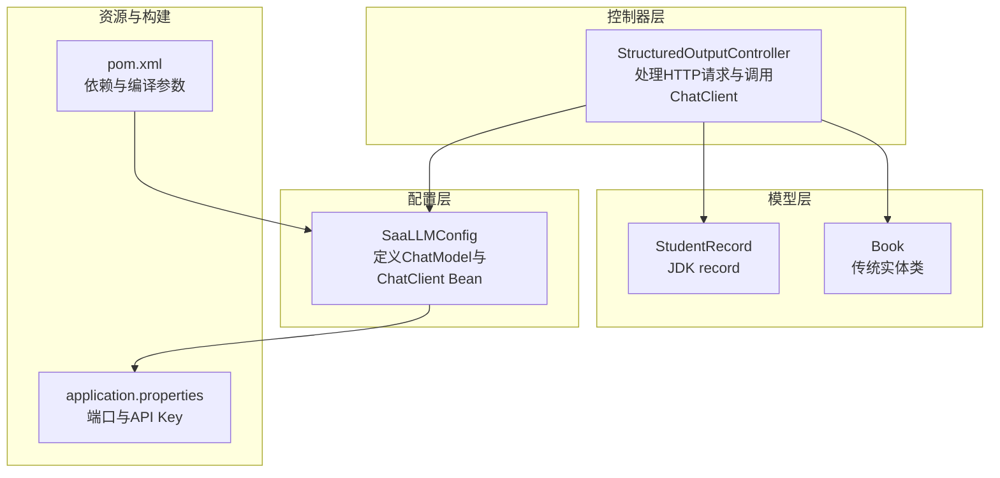
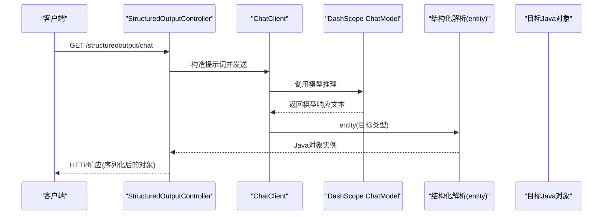
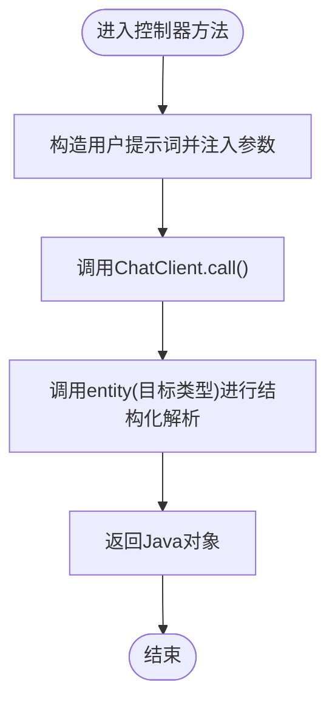
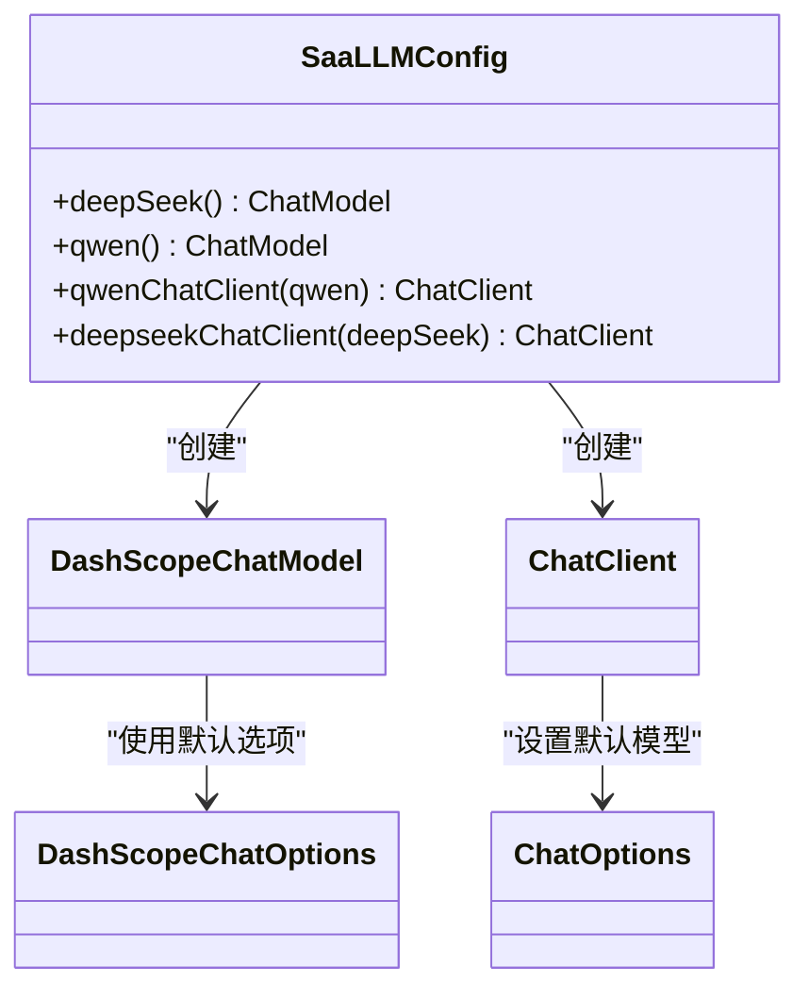
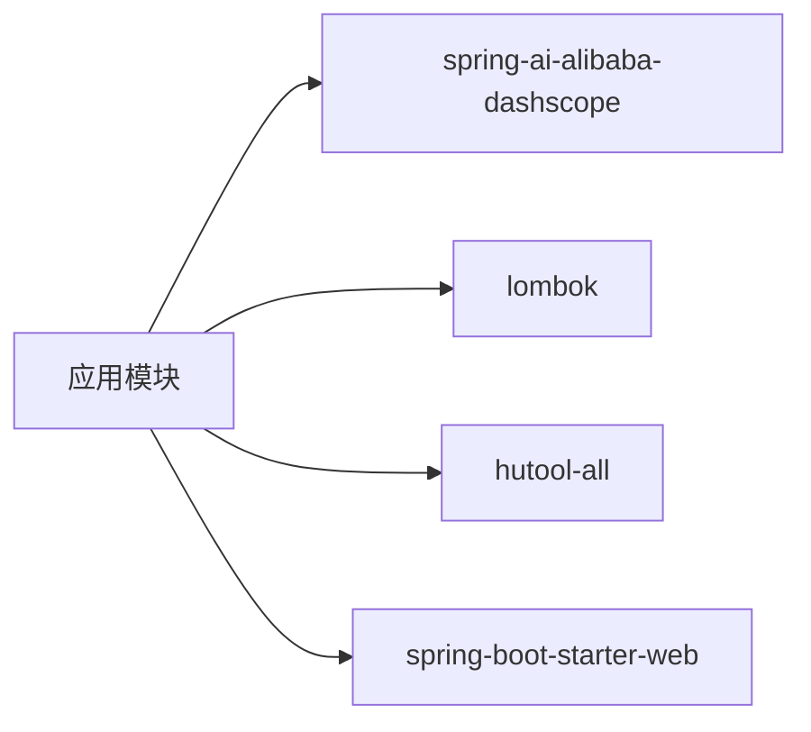

# OutputParser输出解析器

<cite>
**本文引用的文件**
- [StructuredOutputController.java](file://【1】SpringAIAlibaba-atguiguV1/SAA-07StructuredOutput/src/main/java/com/atguigu/study/controller/StructuredOutputController.java)
- [SaaLLMConfig.java](file://【1】SpringAIAlibaba-atguiguV1/SAA-07StructuredOutput/src/main/java/com/atguigu/study/config/SaaLLMConfig.java)
- [StudentRecord.java](file://【1】SpringAIAlibaba-atguiguV1/SAA-07StructuredOutput/src/main/java/com/atguigu/study/records/StudentRecord.java)
- [Book.java](file://【1】SpringAIAlibaba-atguiguV1/SAA-07StructuredOutput/src/main/java/com/atguigu/study/records/Book.java)
- [application.properties](file://【1】SpringAIAlibaba-atguiguV1/SAA-07StructuredOutput/src/main/resources/application.properties)
- [pom.xml](file://【1】SpringAIAlibaba-atguiguV1/SAA-07StructuredOutput/pom.xml)
</cite>

## 目录
1. [引言](#引言)
2. [项目结构](#项目结构)
3. [核心组件](#核心组件)
4. [架构总览](#架构总览)
5. [组件详细分析](#组件详细分析)
6. [依赖分析](#依赖分析)
7. [性能考虑](#性能考虑)
8. [故障排查指南](#故障排查指南)
9. [结论](#结论)
10. [附录](#附录)

## 引言
本文件围绕OutputParser输出解析器在本仓库中的实践进行系统化技术文档编写，重点聚焦于结构化输出解析场景：通过Spring AI Alibaba的ChatClient将大模型的自然语言回复解析为强类型的Java对象（如record与传统实体类）。文档涵盖解析器的配置方法、错误处理机制、数据验证规则、解析失败策略、性能优化建议与调试技巧，并结合实际代码路径给出可操作的示例指引。

## 项目结构
SAA-07StructuredOutput模块展示了典型的“提示词构造-模型调用-结构化解析”链路，核心文件如下：
- 控制器层：负责接收HTTP请求、构造用户提示、调用ChatClient并解析为Java对象
- 配置层：定义DashScope ChatModel与ChatClient Bean，设置默认模型与参数
- 数据模型层：包含record与传统实体类，作为解析目标类型
- 资源配置：应用端口、编码、Spring AI Alibaba接入参数
- 构建配置：Maven依赖与编译参数

**图表来源**
- [StructuredOutputController.java:1-66](file://【1】SpringAIAlibaba-atguiguV1/SAA-07StructuredOutput/src/main/java/com/atguigu/study/controller/StructuredOutputController.java#L1-L66)
- [SaaLLMConfig.java:1-76](file://【1】SpringAIAlibaba-atguiguV1/SAA-07StructuredOutput/src/main/java/com/atguigu/study/config/SaaLLMConfig.java#L1-L76)
- [StudentRecord.java:1-9](file://【1】SpringAIAlibaba-atguiguV1/SAA-07StructuredOutput/src/main/java/com/atguigu/study/records/StudentRecord.java#L1-L9)
- [Book.java:1-63](file://【1】SpringAIAlibaba-atguiguV1/SAA-07StructuredOutput/src/main/java/com/atguigu/study/records/Book.java#L1-L63)
- [application.properties:1-11](file://【1】SpringAIAlibaba-atguiguV1/SAA-07StructuredOutput/src/main/resources/application.properties#L1-L11)
- [pom.xml:1-77](file://【1】SpringAIAlibaba-atguiguV1/SAA-07StructuredOutput/pom.xml#L1-L77)

**章节来源**
- [StructuredOutputController.java:1-66](file://【1】SpringAIAlibaba-atguiguV1/SAA-07StructuredOutput/src/main/java/com/atguigu/study/controller/StructuredOutputController.java#L1-L66)
- [SaaLLMConfig.java:1-76](file://【1】SpringAIAlibaba-atguiguV1/SAA-07StructuredOutput/src/main/java/com/atguigu/study/config/SaaLLMConfig.java#L1-L76)
- [application.properties:1-11](file://【1】SpringAIAlibaba-atguiguV1/SAA-07StructuredOutput/src/main/resources/application.properties#L1-L11)
- [pom.xml:1-77](file://【1】SpringAIAlibaba-atguiguV1/SAA-07StructuredOutput/pom.xml#L1-L77)

## 核心组件
- 结构化解析入口：控制器中的entity(Class)解析方法，将模型返回的文本映射到Java对象
- 模型与客户端：基于DashScope ChatModel与ChatClient，支持多模型并存与默认选项配置
- 目标类型：record与传统实体类，作为解析目标，体现不同Java版本与风格下的结构化输出

**章节来源**
- [StructuredOutputController.java:28-64](file://【1】SpringAIAlibaba-atguiguV1/SAA-07StructuredOutput/src/main/java/com/atguigu/study/controller/StructuredOutputController.java#L28-L64)
- [SaaLLMConfig.java:56-74](file://【1】SpringAIAlibaba-atguiguV1/SAA-07StructuredOutput/src/main/java/com/atguigu/study/config/SaaLLMConfig.java#L56-L74)
- [StudentRecord.java:1-9](file://【1】SpringAIAlibaba-atguiguV1/SAA-07StructuredOutput/src/main/java/com/atguigu/study/records/StudentRecord.java#L1-L9)
- [Book.java:1-63](file://【1】SpringAIAlibaba-atguiguV1/SAA-07StructuredOutput/src/main/java/com/atguigu/study/records/Book.java#L1-L63)

## 架构总览
下图展示了从HTTP请求到结构化解析的关键交互流程：

**图表来源**
- [StructuredOutputController.java:28-64](file://【1】SpringAIAlibaba-atguiguV1/SAA-07StructuredOutput/src/main/java/com/atguigu/study/controller/StructuredOutputController.java#L28-L64)
- [SaaLLMConfig.java:56-74](file://【1】SpringAIAlibaba-atguiguV1/SAA-07StructuredOutput/src/main/java/com/atguigu/study/config/SaaLLMConfig.java#L56-L74)

## 组件详细分析

### 控制器：StructuredOutputController
职责与行为
- 提供REST接口，接收查询参数（如姓名、邮箱）
- 使用ChatClient构造用户提示词，注入参数
- 调用call()后通过entity(Class)将模型输出解析为目标Java对象
- 支持两种提示词构造方式：匿名内部类与Lambda表达式

关键点
- entity(Class)即为结构化解析的核心入口，将模型返回的文本映射到指定类型
- record与传统实体类均可作为目标类型，体现灵活性

**图表来源**
- [StructuredOutputController.java:28-64](file://【1】SpringAIAlibaba-atguiguV1/SAA-07StructuredOutput/src/main/java/com/atguigu/study/controller/StructuredOutputController.java#L28-L64)

**章节来源**
- [StructuredOutputController.java:28-64](file://【1】SpringAIAlibaba-atguiguV1/SAA-07StructuredOutput/src/main/java/com/atguigu/study/controller/StructuredOutputController.java#L28-L64)

### 配置：SaaLLMConfig
职责与行为
- 定义多个ChatModel Bean（如DeepSeek与Qwen），并设置默认推理选项
- 构建对应的ChatClient Bean，统一默认模型参数
- 支持多模型并存，便于在不同场景切换或对比

**图表来源**
- [SaaLLMConfig.java:29-74](file://【1】SpringAIAlibaba-atguiguV1/SAA-07StructuredOutput/src/main/java/com/atguigu/study/config/SaaLLMConfig.java#L29-L74)

**章节来源**
- [SaaLLMConfig.java:29-74](file://【1】SpringAIAlibaba-atguiguV1/SAA-07StructuredOutput/src/main/java/com/atguigu/study/config/SaaLLMConfig.java#L29-L74)

### 目标类型：StudentRecord 与 Book
- StudentRecord：JDK record，简洁表达不可变数据结构
- Book：传统实体类，包含字段、构造函数、equals/hashCode/toString等

这些类型作为entity(Class)的目标，体现了结构化解析对不同类型的支持能力。

**章节来源**
- [StudentRecord.java:1-9](file://【1】SpringAIAlibaba-atguiguV1/SAA-07StructuredOutput/src/main/java/com/atguigu/study/records/StudentRecord.java#L1-L9)
- [Book.java:1-63](file://【1】SpringAIAlibaba-atguiguV1/SAA-07StructuredOutput/src/main/java/com/atguigu/study/records/Book.java#L1-L63)

### 配置与构建：application.properties 与 pom.xml
- application.properties：设置服务器端口、字符集与Spring AI Alibaba的API Key
- pom.xml：引入spring-ai-alibaba DashScope Starter、Lombok、Hutool等依赖，并配置编译参数（如JDK 21与参数保留）

**章节来源**
- [application.properties:1-11](file://【1】SpringAIAlibaba-atguiguV1/SAA-07StructuredOutput/src/main/resources/application.properties#L1-L11)
- [pom.xml:15-62](file://【1】SpringAIAlibaba-atguiguV1/SAA-07StructuredOutput/pom.xml#L15-L62)

## 依赖分析
- Spring AI Alibaba：通过DashScope ChatModel与ChatClient实现模型调用与结构化解析
- Lombok：简化实体类与record的样板代码
- Hutool：提供常用工具能力（在本模块中作为依赖存在）
- 编译参数：启用参数名保留，有助于运行时反射与参数绑定

**图表来源**
- [pom.xml:15-41](file://【1】SpringAIAlibaba-atguiguV1/SAA-07StructuredOutput/pom.xml#L15-L41)

**章节来源**
- [pom.xml:15-41](file://【1】SpringAIAlibaba-atguiguV1/SAA-07StructuredOutput/pom.xml#L15-L41)

## 性能考虑
- 模型选择与参数：通过配置层设置默认模型与推理参数，避免每次调用重复配置带来的开销
- 多模型并存：在配置层预置多个ChatModel Bean，按需选择，减少运行时切换成本
- 编译参数：启用参数名保留，有利于运行时参数绑定与调试，间接提升开发效率
- 解析路径：entity(Class)直接映射到目标类型，减少中间转换步骤，提高解析效率

[本节为通用性能建议，无需特定文件引用]

## 故障排查指南
- API Key与网络：确认application.properties中的DashScope API Key有效且网络可达
- 端口占用：检查server.port是否被占用，避免启动失败
- 类型不匹配：若entity(Class)解析失败，检查目标类型字段与模型输出格式是否一致
- 参数缺失：确保提示词中注入的参数与目标类型字段对应
- 日志与异常：结合Spring Boot日志定位ChatClient调用与解析阶段的问题

**章节来源**
- [application.properties:10-11](file://【1】SpringAIAlibaba-atguiguV1/SAA-07StructuredOutput/src/main/resources/application.properties#L10-L11)
- [StructuredOutputController.java:28-64](file://【1】SpringAIAlibaba-atguiguV1/SAA-07StructuredOutput/src/main/java/com/atguigu/study/controller/StructuredOutputController.java#L28-L64)

## 结论
本模块以SAA-07StructuredOutput为核心，演示了如何利用Spring AI Alibaba的ChatClient与entity(Class)解析能力，将大模型的自然语言输出稳定地转化为强类型Java对象。通过配置层的多模型支持与控制器层的简洁调用，实现了高内聚、低耦合的结构化输出流水线。结合本文提供的配置方法、错误处理与性能优化建议，可在实际项目中快速落地并扩展。

## 附录
- 实际代码示例路径（仅提供路径，不展示具体代码内容）
  - 控制器调用与解析：[StructuredOutputController.java:28-64](file://【1】SpringAIAlibaba-atguiguV1/SAA-07StructuredOutput/src/main/java/com/atguigu/study/controller/StructuredOutputController.java#L28-L64)
  - ChatClient与模型配置：[SaaLLMConfig.java:56-74](file://【1】SpringAIAlibaba-atguiguV1/SAA-07StructuredOutput/src/main/java/com/atguigu/study/config/SaaLLMConfig.java#L56-L74)
  - 目标类型定义（record）：[StudentRecord.java:1-9](file://【1】SpringAIAlibaba-atguiguV1/SAA-07StructuredOutput/src/main/java/com/atguigu/study/records/StudentRecord.java#L1-L9)
  - 目标类型定义（实体类）：[Book.java:1-63](file://【1】SpringAIAlibaba-atguiguV1/SAA-07StructuredOutput/src/main/java/com/atguigu/study/records/Book.java#L1-L63)
  - 应用配置：[application.properties:1-11](file://【1】SpringAIAlibaba-atguiguV1/SAA-07StructuredOutput/src/main/resources/application.properties#L1-L11)
  - 依赖与编译配置：[pom.xml:15-62](file://【1】SpringAIAlibaba-atguiguV1/SAA-07StructuredOutput/pom.xml#L15-L62)