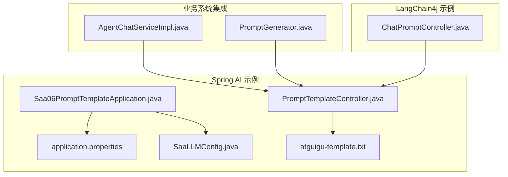
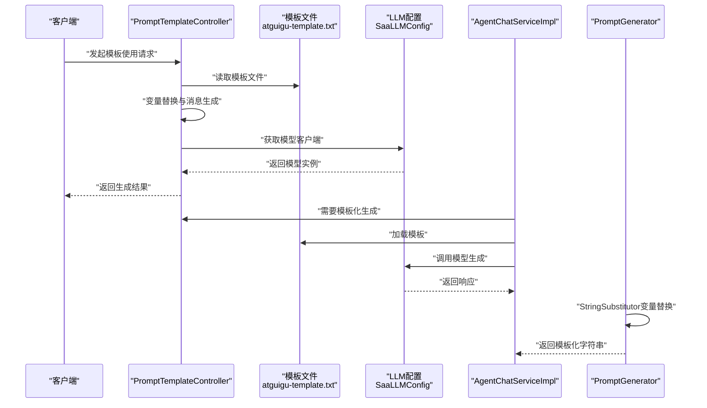
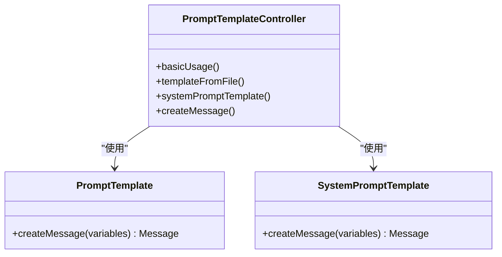
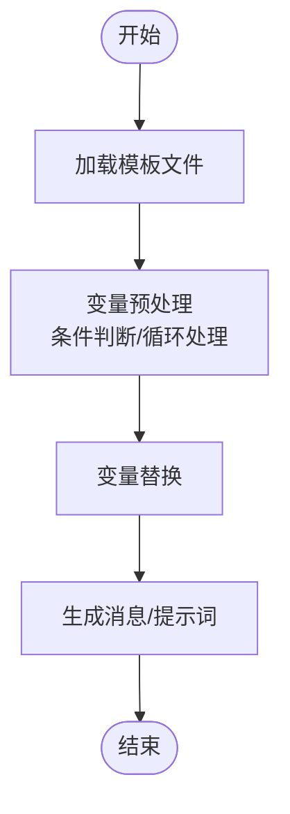
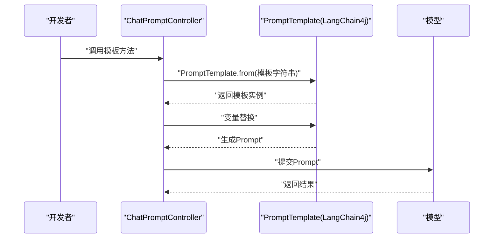
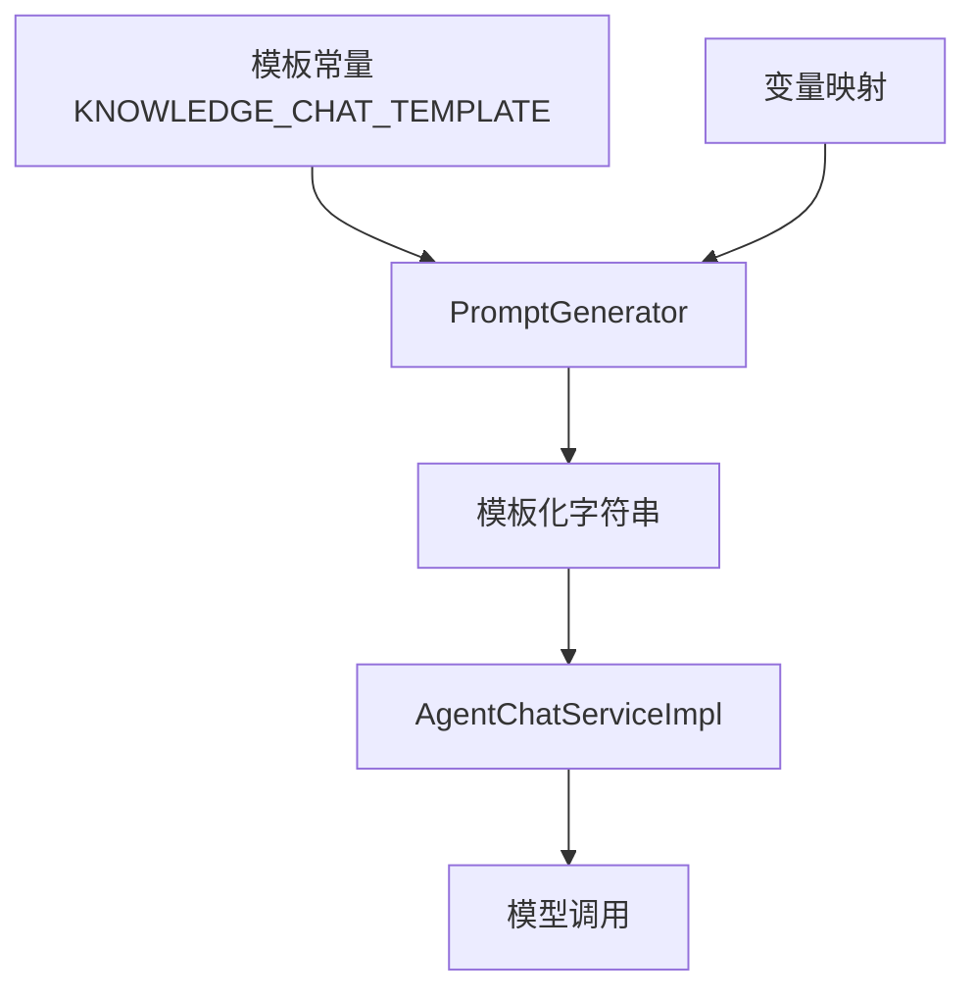
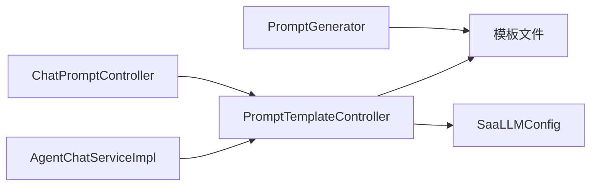

# PromptTemplate提示词模板

<cite>
**本文引用的文件**
- [Saa06PromptTemplateApplication.java](file://【1】SpringAIAlibaba-atguiguV1/SAA-06PromptTemplate/src/main/java/com/atguigu/study/Saa06PromptTemplateApplication.java)
- [PromptTemplateController.java](file://【1】SpringAIAlibaba-atguiguV1/SAA-06PromptTemplate/src/main/java/com/atguigu/study/controller/PromptTemplateController.java)
- [application.properties](file://【1】SpringAIAlibaba-atguiguV1/SAA-06PromptTemplate/src/main/resources/application.properties)
- [atguigu-template.txt](file://【1】SpringAIAlibaba-atguiguV1/SAA-06PromptTemplate/src/main/resources/prompttemplate/atguigu-template.txt)
- [SaaLLMConfig.java](file://【1】SpringAIAlibaba-atguiguV1/SAA-06PromptTemplate/src/main/java/com/atguigu/study/config/SaaLLMConfig.java)
- [ChatPromptController.java](file://【2】langchain4j-atguiguV5/langchain4j-09chat-prompt/src/main/java/com/atguigu/study/controller/ChatPromptController.java)
- [AgentChatServiceImpl.java](file://【3】工作资料/code/仓颉智能体/nlp-agent/agent-builder/agent-build-core/src/main/java/com/yundingtech/agent/build/modules/agent/service/impl/AgentChatServiceImpl.java)
- [PromptGenerator.java](file://【3】工作资料/code/仓颉智能体/nlp-agent/agent-worker/src/main/java/com/yundingtech/agent/work/common/util/PromptGenerator.java)
</cite>

## 目录
1. [引言](#引言)
2. [项目结构](#项目结构)
3. [核心组件](#核心组件)
4. [架构总览](#架构总览)
5. [详细组件分析](#详细组件分析)
6. [依赖分析](#依赖分析)
7. [性能考虑](#性能考虑)
8. [故障排查指南](#故障排查指南)
9. [结论](#结论)
10. [附录](#附录)

## 引言
本技术文档围绕PromptTemplate提示词模板展开，系统阐述其设计原理、参数化机制、模板继承与复用策略，并结合Spring AI与LangChain4j在真实场景中的使用方式，给出PromptTemplateBuilder的高级用法（变量替换、条件判断、循环处理等）。文档同时提供法律咨询、技术文档等典型应用场景的实践指引，总结提示词工程最佳实践、性能优化技巧与调试方法，帮助读者在不同项目中高效构建与维护高质量提示词模板。

## 项目结构
本仓库包含多个演示模块，其中与PromptTemplate直接相关的核心模块位于“SpringAIAlibaba-atguiguV1”下的SAA-06PromptTemplate，以及“langchain4j-atguiguV5”下的langchain4j-09chat-prompt。此外，在“工作资料/code/仓颉智能体”中，可以看到PromptTemplate在实际业务系统中的集成与复用方式。

- Spring AI示例模块：SAA-06PromptTemplate
  - 应用入口与配置：Saa06PromptTemplateApplication.java、SaaLLMConfig.java、application.properties
  - 控制器：PromptTemplateController.java（展示PromptTemplate基础用法、系统提示模板、模板文件加载）
  - 资源：prompttemplate/atguigu-template.txt（外部模板文件）

- LangChain4j示例模块：langchain4j-09chat-prompt
  - 控制器：ChatPromptController.java（展示PromptTemplate.from构造与默认占位符行为）

- 业务系统集成示例：工作资料
  - AgentChatServiceImpl.java：在智能体对话服务中使用PromptTemplate进行模板化生成
  - PromptGenerator.java：通过StringSubstitutor与模板常量组合，实现变量替换与模板复用

**图表来源**
- [Saa06PromptTemplateApplication.java:1-20](file://【1】SpringAIAlibaba-atguiguV1/SAA-06PromptTemplate/src/main/java/com/atguigu/study/Saa06PromptTemplateApplication.java#L1-L20)
- [PromptTemplateController.java:1-120](file://【1】SpringAIAlibaba-atguiguV1/SAA-06PromptTemplate/src/main/java/com/atguigu/study/controller/PromptTemplateController.java#L1-L120)
- [application.properties:1-50](file://【1】SpringAIAlibaba-atguiguV1/SAA-06PromptTemplate/src/main/resources/application.properties#L1-L50)
- [atguigu-template.txt:1-200](file://【1】SpringAIAlibaba-atguiguV1/SAA-06PromptTemplate/src/main/resources/prompttemplate/atguigu-template.txt#L1-L200)
- [SaaLLMConfig.java:1-200](file://【1】SpringAIAlibaba-atguiguV1/SAA-06PromptTemplate/src/main/java/com/atguigu/study/config/SaaLLMConfig.java#L1-L200)
- [ChatPromptController.java:1-120](file://【2】langchain4j-atguiguV5/langchain4j-09chat-prompt/src/main/java/com/atguigu/study/controller/ChatPromptController.java#L1-L120)
- [AgentChatServiceImpl.java:180-200](file://【3】工作资料/code/仓颉智能体/nlp-agent/agent-builder/agent-build-core/src/main/java/com/yundingtech/agent/build/modules/agent/service/impl/AgentChatServiceImpl.java#L180-L200)
- [PromptGenerator.java:1-60](file://【3】工作资料/code/仓颉智能体/nlp-agent/agent-worker/src/main/java/com/yundingtech/agent/work/common/util/PromptGenerator.java#L1-L60)

**章节来源**
- [Saa06PromptTemplateApplication.java:1-20](file://【1】SpringAIAlibaba-atguiguV1/SAA-06PromptTemplate/src/main/java/com/atguigu/study/Saa06PromptTemplateApplication.java#L1-L20)
- [PromptTemplateController.java:1-120](file://【1】SpringAIAlibaba-atguiguV1/SAA-06PromptTemplate/src/main/java/com/atguigu/study/controller/PromptTemplateController.java#L1-L120)
- [application.properties:1-50](file://【1】SpringAIAlibaba-atguiguV1/SAA-06PromptTemplate/src/main/resources/application.properties#L1-L50)
- [atguigu-template.txt:1-200](file://【1】SpringAIAlibaba-atguiguV1/SAA-06PromptTemplate/src/main/resources/prompttemplate/atguigu-template.txt#L1-L200)
- [SaaLLMConfig.java:1-200](file://【1】SpringAIAlibaba-atguiguV1/SAA-06PromptTemplate/src/main/java/com/atguigu/study/config/SaaLLMConfig.java#L1-L200)
- [ChatPromptController.java:1-120](file://【2】langchain4j-atguiguV5/langchain4j-09chat-prompt/src/main/java/com/atguigu/study/controller/ChatPromptController.java#L1-L120)
- [AgentChatServiceImpl.java:180-200](file://【3】工作资料/code/仓颉智能体/nlp-agent/agent-builder/agent-build-core/src/main/java/com/yundingtech/agent/build/modules/agent/service/impl/AgentChatServiceImpl.java#L180-L200)
- [PromptGenerator.java:1-60](file://【3】工作资料/code/仓颉智能体/nlp-agent/agent-worker/src/main/java/com/yundingtech/agent/work/common/util/PromptGenerator.java#L1-L60)

## 核心组件
- PromptTemplateController：演示PromptTemplate的基本用法、系统提示模板SystemPromptTemplate、从模板文件加载模板、以及模板变量替换与消息生成。
- SaaLLMConfig：提供LLM配置与模型客户端注入，支撑提示词模板的最终执行。
- ChatPromptController（LangChain4j）：展示PromptTemplate.from静态工厂方法与默认占位符行为。
- AgentChatServiceImpl：在智能体对话服务中使用PromptTemplate进行模板化生成，体现模板在复杂业务流程中的复用。
- PromptGenerator：通过StringSubstitutor与模板常量组合，实现变量替换与模板复用，展示模板继承与复用策略。

**章节来源**
- [PromptTemplateController.java:1-120](file://【1】SpringAIAlibaba-atguiguV1/SAA-06PromptTemplate/src/main/java/com/atguigu/study/controller/PromptTemplateController.java#L1-L120)
- [SaaLLMConfig.java:1-200](file://【1】SpringAIAlibaba-atguiguV1/SAA-06PromptTemplate/src/main/java/com/atguigu/study/config/SaaLLMConfig.java#L1-L200)
- [ChatPromptController.java:1-120](file://【2】langchain4j-atguiguV5/langchain4j-09chat-prompt/src/main/java/com/atguigu/study/controller/ChatPromptController.java#L1-L120)
- [AgentChatServiceImpl.java:180-200](file://【3】工作资料/code/仓颉智能体/nlp-agent/agent-builder/agent-build-core/src/main/java/com/yundingtech/agent/build/modules/agent/service/impl/AgentChatServiceImpl.java#L180-L200)
- [PromptGenerator.java:1-60](file://【3】工作资料/code/仓颉智能体/nlp-agent/agent-worker/src/main/java/com/yundingtech/agent/work/common/util/PromptGenerator.java#L1-L60)

## 架构总览
下图展示了从控制器到模板文件与配置的整体调用链路，以及在业务系统中的集成方式：

**图表来源**
- [PromptTemplateController.java:1-120](file://【1】SpringAIAlibaba-atguiguV1/SAA-06PromptTemplate/src/main/java/com/atguigu/study/controller/PromptTemplateController.java#L1-L120)
- [atguigu-template.txt:1-200](file://【1】SpringAIAlibaba-atguiguV1/SAA-06PromptTemplate/src/main/resources/prompttemplate/atguigu-template.txt#L1-L200)
- [SaaLLMConfig.java:1-200](file://【1】SpringAIAlibaba-atguiguV1/SAA-06PromptTemplate/src/main/java/com/atguigu/study/config/SaaLLMConfig.java#L1-L200)
- [AgentChatServiceImpl.java:180-200](file://【3】工作资料/code/仓颉智能体/nlp-agent/agent-builder/agent-build-core/src/main/java/com/yundingtech/agent/build/modules/agent/service/impl/AgentChatServiceImpl.java#L180-L200)
- [PromptGenerator.java:1-60](file://【3】工作资料/code/仓颉智能体/nlp-agent/agent-worker/src/main/java/com/yundingtech/agent/work/common/util/PromptGenerator.java#L1-L60)

## 详细组件分析

### PromptTemplateController 组件分析
该控制器集中展示了PromptTemplate的多种使用方式：
- 基础模板：通过字符串拼接定义模板，使用占位符进行变量替换。
- 模板文件加载：从资源目录读取模板文件，实现模板与代码解耦。
- 系统提示模板：SystemPromptTemplate用于生成系统角色消息。
- 消息生成：将变量映射到模板，生成消息对象供后续模型调用。

**图表来源**
- [PromptTemplateController.java:1-120](file://【1】SpringAIAlibaba-atguiguV1/SAA-06PromptTemplate/src/main/java/com/atguigu/study/controller/PromptTemplateController.java#L1-L120)

**章节来源**
- [PromptTemplateController.java:1-120](file://【1】SpringAIAlibaba-atguiguV1/SAA-06PromptTemplate/src/main/java/com/atguigu/study/controller/PromptTemplateController.java#L1-L120)

### PromptTemplateBuilder 高级用法与模板继承/复用
虽然本仓库未直接出现名为“PromptTemplateBuilder”的类，但可通过以下模式实现类似能力：
- 变量替换：通过Map传递变量，实现占位符替换。
- 条件判断：在模板中嵌入条件分支标记，或在生成前对变量进行预处理，再传入模板。
- 循环处理：将列表型变量扁平化或序列化后传入模板，或在模板中使用迭代语法（取决于具体框架支持）。
- 模板继承与复用：通过模板文件分层组织（如公共头/尾、业务片段），在运行时拼装；或通过StringSubstitutor与常量模板组合，形成“模板继承”。

**图表来源**
- [PromptTemplateController.java:1-120](file://【1】SpringAIAlibaba-atguiguV1/SAA-06PromptTemplate/src/main/java/com/atguigu/study/controller/PromptTemplateController.java#L1-L120)
- [PromptGenerator.java:1-60](file://【3】工作资料/code/仓颉智能体/nlp-agent/agent-worker/src/main/java/com/yundingtech/agent/work/common/util/PromptGenerator.java#L1-L60)

**章节来源**
- [PromptTemplateController.java:1-120](file://【1】SpringAIAlibaba-atguiguV1/SAA-06PromptTemplate/src/main/java/com/atguigu/study/controller/PromptTemplateController.java#L1-L120)
- [PromptGenerator.java:1-60](file://【3】工作资料/code/仓颉智能体/nlp-agent/agent-worker/src/main/java/com/yundingtech/agent/work/common/util/PromptGenerator.java#L1-L60)

### LangChain4j 中的 PromptTemplate 使用
LangChain4j提供了PromptTemplate.from静态工厂方法，便于从字符串快速构造模板，并支持默认占位符语法。该方式适合快速原型与简单场景。

**图表来源**
- [ChatPromptController.java:1-120](file://【2】langchain4j-atguiguV5/langchain4j-09chat-prompt/src/main/java/com/atguigu/study/controller/ChatPromptController.java#L1-L120)

**章节来源**
- [ChatPromptController.java:1-120](file://【2】langchain4j-atguiguV5/langchain4j-09chat-prompt/src/main/java/com/atguigu/study/controller/ChatPromptController.java#L1-L120)

### 业务系统中的模板复用与继承
在“仓颉智能体”项目中，通过StringSubstitutor与模板常量组合，实现变量替换与模板复用；同时在AgentChatServiceImpl中使用PromptTemplate进行模板化生成，体现了模板在复杂业务流程中的继承与复用策略。

**图表来源**
- [PromptGenerator.java:1-60](file://【3】工作资料/code/仓颉智能体/nlp-agent/agent-worker/src/main/java/com/yundingtech/agent/work/common/util/PromptGenerator.java#L1-L60)
- [AgentChatServiceImpl.java:180-200](file://【3】工作资料/code/仓颉智能体/nlp-agent/agent-builder/agent-build-core/src/main/java/com/yundingtech/agent/build/modules/agent/service/impl/AgentChatServiceImpl.java#L180-L200)

**章节来源**
- [PromptGenerator.java:1-60](file://【3】工作资料/code/仓颉智能体/nlp-agent/agent-worker/src/main/java/com/yundingtech/agent/work/common/util/PromptGenerator.java#L1-L60)
- [AgentChatServiceImpl.java:180-200](file://【3】工作资料/code/仓颉智能体/nlp-agent/agent-builder/agent-build-core/src/main/java/com/yundingtech/agent/build/modules/agent/service/impl/AgentChatServiceImpl.java#L180-L200)

## 依赖分析
- 控制器依赖于模板文件与LLM配置，实现模板加载与消息生成。
- 业务系统通过工具类与服务实现模板复用与变量替换。
- LangChain4j提供简洁的模板构造方式，适合快速集成。

**图表来源**
- [PromptTemplateController.java:1-120](file://【1】SpringAIAlibaba-atguiguV1/SAA-06PromptTemplate/src/main/java/com/atguigu/study/controller/PromptTemplateController.java#L1-L120)
- [SaaLLMConfig.java:1-200](file://【1】SpringAIAlibaba-atguiguV1/SAA-06PromptTemplate/src/main/java/com/atguigu/study/config/SaaLLMConfig.java#L1-L200)
- [PromptGenerator.java:1-60](file://【3】工作资料/code/仓颉智能体/nlp-agent/agent-worker/src/main/java/com/yundingtech/agent/work/common/util/PromptGenerator.java#L1-L60)
- [AgentChatServiceImpl.java:180-200](file://【3】工作资料/code/仓颉智能体/nlp-agent/agent-builder/agent-build-core/src/main/java/com/yundingtech/agent/build/modules/agent/service/impl/AgentChatServiceImpl.java#L180-L200)
- [ChatPromptController.java:1-120](file://【2】langchain4j-atguiguV5/langchain4j-09chat-prompt/src/main/java/com/atguigu/study/controller/ChatPromptController.java#L1-L120)

**章节来源**
- [PromptTemplateController.java:1-120](file://【1】SpringAIAlibaba-atguiguV1/SAA-06PromptTemplate/src/main/java/com/atguigu/study/controller/PromptTemplateController.java#L1-L120)
- [SaaLLMConfig.java:1-200](file://【1】SpringAIAlibaba-atguiguV1/SAA-06PromptTemplate/src/main/java/com/atguigu/study/config/SaaLLMConfig.java#L1-L200)
- [PromptGenerator.java:1-60](file://【3】工作资料/code/仓颉智能体/nlp-agent/agent-worker/src/main/java/com/yundingtech/agent/work/common/util/PromptGenerator.java#L1-L60)
- [AgentChatServiceImpl.java:180-200](file://【3】工作资料/code/仓颉智能体/nlp-agent/agent-builder/agent-build-core/src/main/java/com/yundingtech/agent/build/modules/agent/service/impl/AgentChatServiceImpl.java#L180-L200)
- [ChatPromptController.java:1-120](file://【2】langchain4j-atguiguV5/langchain4j-09chat-prompt/src/main/java/com/atguigu/study/controller/ChatPromptController.java#L1-L120)

## 性能考虑
- 模板缓存：对外部模板文件进行缓存，避免重复读取与解析。
- 变量预处理：在模板渲染前完成条件判断与循环处理，减少模板内复杂逻辑。
- 批量生成：对多条消息进行批量处理，降低模型调用次数。
- 资源管理：合理关闭文件句柄与连接，避免内存泄漏。
- 日志与监控：记录模板渲染耗时与错误，便于定位性能瓶颈。

## 故障排查指南
- 模板文件找不到：确认模板路径与资源加载方式是否正确。
- 占位符未替换：检查变量映射键名与模板占位符是否一致。
- 系统提示异常：验证SystemPromptTemplate的变量传入与消息生成顺序。
- 业务集成问题：检查PromptGenerator的变量映射与模板常量组合逻辑。
- 模型调用失败：确认SaaLLMConfig中的模型配置与客户端初始化。

**章节来源**
- [PromptTemplateController.java:1-120](file://【1】SpringAIAlibaba-atguiguV1/SAA-06PromptTemplate/src/main/java/com/atguigu/study/controller/PromptTemplateController.java#L1-L120)
- [PromptGenerator.java:1-60](file://【3】工作资料/code/仓颉智能体/nlp-agent/agent-worker/src/main/java/com/yundingtech/agent/work/common/util/PromptGenerator.java#L1-L60)
- [SaaLLMConfig.java:1-200](file://【1】SpringAIAlibaba-atguiguV1/SAA-06PromptTemplate/src/main/java/com/atguigu/study/config/SaaLLMConfig.java#L1-L200)

## 结论
PromptTemplate为提示词工程提供了标准化、可复用的模板化能力。通过模板文件、变量替换、系统提示模板与业务系统的集成，可以在不同场景中高效构建高质量提示词。建议在实际项目中结合缓存、预处理与监控等手段提升性能与稳定性，并遵循最佳实践进行模板设计与维护。

## 附录
- 法律咨询场景：可采用“事实摘要+法律依据+结论”三段式模板，通过变量替换填充案件事实与适用条款。
- 技术文档场景：可采用“背景+目标+方案+步骤+风险”模板，通过循环处理生成多版本方案对比。
- 调试建议：优先使用最小化模板与固定变量，逐步扩展复杂度；利用日志与断点定位问题。