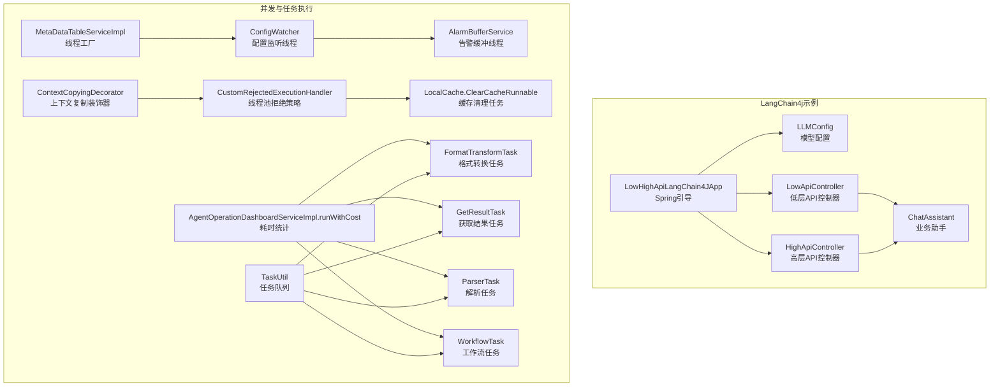
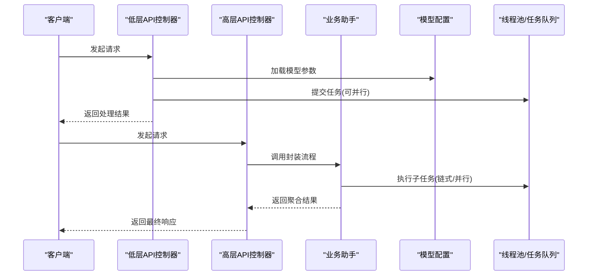
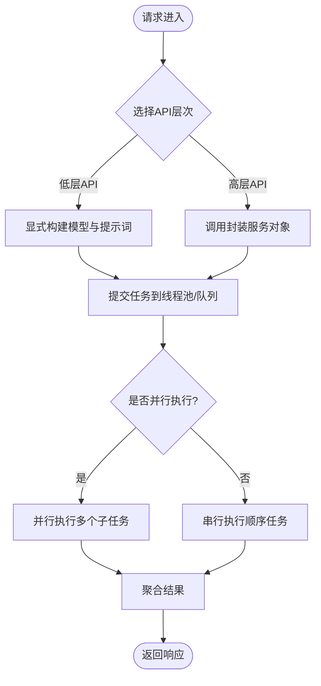
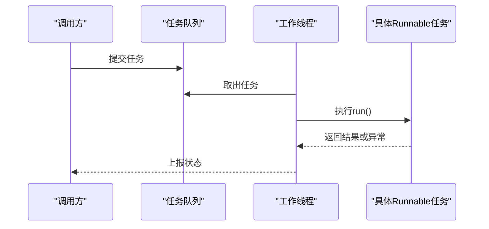
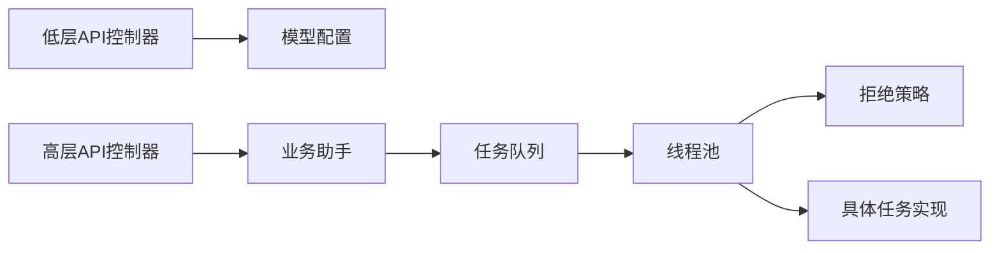

# Runnable运行时组件

<cite>
**本文引用的文件**
- [LowHighApiLangChain4JApp.java](file://【2】langchain4j-atguiguV5/langchain4j-04low-high-api/src/main/java/com/atguigu/study/LowHighApiLangChain4JApp.java)
- [LLMConfig.java](file://【2】langchain4j-atguiguV5/langchain4j-04low-high-api/src/main/java/com/atguigu/study/config/LLMConfig.java)
- [LowApiController.java](file://【2】langchain4j-atguiguV5/langchain4j-04low-high-api/src/main/java/com/atguigu/study/controller/LowApiController.java)
- [HighApiController.java](file://【2】langchain4j-atguiguV5/langchain4j-04low-high-api/src/main/java/com/atguigu/study/controller/HighApiController.java)
- [ChatAssistant.java](file://【2】langchain4j-atguiguV5/langchain4j-04low-high-api/src/main/java/com/atguigu/study/service/ChatAssistant.java)
- [ConfigWatcher.java](file://【3】工作资料/code/云库系统/knowledge-backend-boot/sheno-biz-demo/sheno-modules/sheno-biz-core/src/main/java/com/yundingtech/sheno/biz/modules/common/alarm/config/watcher/ConfigWatcher.java)
- [AlarmBufferService.java](file://【3】工作资料/code/云库系统/knowledge-backend-boot/sheno-biz-demo/sheno-modules/sheno-biz-core/src/main/java/com/yundingtech/sheno/biz/modules/common/alarm/service/AlarmBufferService.java)
- [ContextCopyingDecorator.java](file://【3】工作资料/code/云库系统/knowledge-backend-boot/sheno-biz-demo/sheno-modules/sheno-biz-core/src/main/java/com/yundingtech/sheno/biz/modules/knowledge/config/ContextCopyingDecorator.java)
- [CustomRejectedExecutionHandler.java](file://【3】工作资料/code/云库系统/knowledge-backend-boot/sheno-biz-demo/sheno-modules/sheno-biz-core/src/main/java/com/yundingtech/sheno/biz/modules/knowledge/config/CustomRejectedExecutionHandler.java)
- [LocalCache.java](file://【3】工作资料/code/云库系统/sheno-system/sheno-common/sheno-common-cache/src/main/java/com/yundingtech/sheno/common/cache/core/LocalCache.java)
- [AgentOperationDashboardServiceImpl.java](file://【3】工作资料/code/仓颉智能体/nlp-agent/agent-builder/agent-build-core/src/main/java/com/yundingtech/agent/build/modules/operation/service/impl/AgentOperationDashboardServiceImpl.java)
- [FormatTransformTask.java](file://【3】工作资料/code/仓颉智能体/nlp-agent/agent-builder/agent-build-core/src/main/java/com/yundingtech/agent/build/modules/parser/execute/task/FormatTransformTask.java)
- [GetResultTask.java](file://【3】工作资料/code/仓颉智能体/nlp-agent/agent-builder/agent-build-core/src/main/java/com/yundingtech/agent/build/modules/parser/execute/task/GetResultTask.java)
- [ParserTask.java](file://【3】工作资料/code/仓颉智能体/nlp-agent/agent-builder/agent-build-core/src/main/java/com/yundingtech/agent/build/modules/parser/execute/task/ParserTask.java)
- [WorkflowTask.java](file://【3】工作资料/code/仓颉智能体/nlp-agent/agent-builder/agent-build-core/src/main/java/com/yundingtech/agent/build/modules/parser/execute/task/WorkflowTask.java)
- [TaskUtil.java](file://【3】工作资料/code/仓颉智能体/nlp-agent/agent-builder/agent-build-core/src/main/java/com/yundingtech/agent/build/modules/parser/execute/util/TaskUtil.java)
- [MetaDataTableServiceImpl.java](file://【3】工作资料/code/仓颉智能体/nlp-agent/agent-plugin/agent-plugin-core/agent-plugin-core-db/src/main/java/com/yundingtech/agent/plugin/core/db/modules/metadata/service/impl/MetaDataTableServiceImpl.java)
</cite>

## 目录
1. [引言](#引言)
2. [项目结构](#项目结构)
3. [核心组件](#核心组件)
4. [架构总览](#架构总览)
5. [详细组件分析](#详细组件分析)
6. [依赖分析](#依赖分析)
7. [性能考虑](#性能考虑)
8. [故障排查指南](#故障排查指南)
9. [结论](#结论)
10. [附录](#附录)

## 引言
本文件围绕“Runnable运行时组件”的设计与实现展开，结合仓库中的LangChain4j示例与多处Java并发/线程池/任务调度相关实现，系统阐述Runnable在低层API与高层API中的差异、执行流程与生命周期管理，并给出链式调用、并行执行、错误传播等高级特性的最佳实践。同时，提供可复用的代码片段路径，帮助读者快速构建复杂AI应用管道（数据预处理、模型调用、结果后处理）。

## 项目结构
本仓库包含两部分与Runnable运行时密切相关的线索：
- LangChain4j示例工程：以低层API与高层API对比为主线，演示从底层构建到高层封装的完整流程。
- 多处Java并发与任务执行实现：涵盖线程池拒绝策略、任务装饰器、优先级队列、缓存清理Runnable等，体现Runnable在复杂系统中的典型用法。

**图表来源**
- [LowHighApiLangChain4JApp.java:1-19](file://【2】langchain4j-atguiguV5/langchain4j-04low-high-api/src/main/java/com/atguigu/study/LowHighApiLangChain4JApp.java#L1-L19)
- [LLMConfig.java](file://【2】langchain4j-atguiguV5/langchain4j-04low-high-api/src/main/java/com/atguigu/study/config/LLMConfig.java)
- [LowApiController.java](file://【2】langchain4j-atguiguV5/langchain4j-04low-high-api/src/main/java/com/atguigu/study/controller/LowApiController.java)
- [HighApiController.java](file://【2】langchain4j-atguiguV5/langchain4j-04low-high-api/src/main/java/com/atguigu/study/controller/HighApiController.java)
- [ChatAssistant.java](file://【2】langchain4j-atguiguV5/langchain4j-04low-high-api/src/main/java/com/atguigu/study/service/ChatAssistant.java)
- [ConfigWatcher.java](file://【3】工作资料/code/云库系统/knowledge-backend-boot/sheno-biz-demo/sheno-modules/sheno-biz-core/src/main/java/com/yundingtech/sheno/biz/modules/common/alarm/config/watcher/ConfigWatcher.java#L70)
- [AlarmBufferService.java](file://【3】工作资料/code/云库系统/knowledge-backend-boot/sheno-biz-demo/sheno-modules/sheno-biz-core/src/main/java/com/yundingtech/sheno/biz/modules/common/alarm/service/AlarmBufferService.java#L82)
- [ContextCopyingDecorator.java](file://【3】工作资料/code/云库系统/knowledge-backend-boot/sheno-biz-demo/sheno-modules/sheno-biz-core/src/main/java/com/yundingtech/sheno/biz/modules/knowledge/config/ContextCopyingDecorator.java#L20)
- [CustomRejectedExecutionHandler.java](file://【3】工作资料/code/云库系统/knowledge-backend-boot/sheno-biz-demo/sheno-modules/sheno-biz-core/src/main/java/com/yundingtech/sheno/biz/modules/knowledge/config/CustomRejectedExecutionHandler.java#L9)
- [LocalCache.java](file://【3】工作资料/code/云库系统/sheno-system/sheno-common/sheno-common-cache/src/main/java/com/yundingtech/sheno/common/cache/core/LocalCache.java#L26)
- [AgentOperationDashboardServiceImpl.java](file://【3】工作资料/code/仓颉智能体/nlp-agent/agent-builder/agent-build-core/src/main/java/com/yundingtech/agent/build/modules/operation/service/impl/AgentOperationDashboardServiceImpl.java#L149)
- [FormatTransformTask.java](file://【3】工作资料/code/仓颉智能体/nlp-agent/agent-builder/agent-build-core/src/main/java/com/yundingtech/agent/build/modules/parser/execute/task/FormatTransformTask.java#L10)
- [GetResultTask.java](file://【3】工作资料/code/仓颉智能体/nlp-agent/agent-builder/agent-build-core/src/main/java/com/yundingtech/agent/build/modules/parser/execute/task/GetResultTask.java#L12)
- [ParserTask.java](file://【3】工作资料/code/仓颉智能体/nlp-agent/agent-builder/agent-build-core/src/main/java/com/yundingtech/agent/build/modules/parser/execute/task/ParserTask.java#L17)
- [WorkflowTask.java](file://【3】工作资料/code/仓颉智能体/nlp-agent/agent-builder/agent-build-core/src/main/java/com/yundingtech/agent/build/modules/parser/execute/task/WorkflowTask.java#L45)
- [TaskUtil.java](file://【3】工作资料/code/仓颉智能体/nlp-agent/agent-builder/agent-build-core/src/main/java/com/yundingtech/agent/build/modules/parser/execute/util/TaskUtil.java#L31)
- [MetaDataTableServiceImpl.java](file://【3】工作资料/code/仓颉智能体/nlp-agent/agent-plugin/agent-plugin-core/agent-plugin-core-db/src/main/java/com/yundingtech/agent/plugin/core/db/modules/metadata/service/impl/MetaDataTableServiceImpl.java#L79)

**章节来源**
- [LowHighApiLangChain4JApp.java:1-19](file://【2】langchain4j-atguiguV5/langchain4j-04low-high-api/src/main/java/com/atguigu/study/LowHighApiLangChain4JApp.java#L1-L19)
- [LLMConfig.java](file://【2】langchain4j-atguiguV5/langchain4j-04low-high-api/src/main/java/com/atguigu/study/config/LLMConfig.java)
- [LowApiController.java](file://【2】langchain4j-atguiguV5/langchain4j-04low-high-api/src/main/java/com/atguigu/study/controller/LowApiController.java)
- [HighApiController.java](file://【2】langchain4j-atguiguV5/langchain4j-04low-high-api/src/main/java/com/atguigu/study/controller/HighApiController.java)
- [ChatAssistant.java](file://【2】langchain4j-atguiguV5/langchain4j-04low-high-api/src/main/java/com/atguigu/study/service/ChatAssistant.java)

## 核心组件
- Spring引导与配置
  - 应用入口负责启动Spring容器，加载模型配置与控制器。
  - 模型配置集中管理，便于在低层与高层API中共享。
- 控制器层
  - 低层API控制器直接调用底层构建器与模型客户端，强调可控性与可观测性。
  - 高层API控制器通过封装的服务对象完成端到端流程，强调易用性与可组合性。
- 业务助手
  - 将对话、提示词、内存、持久化等能力封装为可复用的业务组件，便于在不同控制器间复用。

**章节来源**
- [LowHighApiLangChain4JApp.java:1-19](file://【2】langchain4j-atguiguV5/langchain4j-04low-high-api/src/main/java/com/atguigu/study/LowHighApiLangChain4JApp.java#L1-L19)
- [LLMConfig.java](file://【2】langchain4j-atguiguV5/langchain4j-04low-high-api/src/main/java/com/atguigu/study/config/LLMConfig.java)
- [LowApiController.java](file://【2】langchain4j-atguiguV5/langchain4j-04low-high-api/src/main/java/com/atguigu/study/controller/LowApiController.java)
- [HighApiController.java](file://【2】langchain4j-atguiguV5/langchain4j-04low-high-api/src/main/java/com/atguigu/study/controller/HighApiController.java)
- [ChatAssistant.java](file://【2】langchain4j-atguiguV5/langchain4j-04low-high-api/src/main/java/com/atguigu/study/service/ChatAssistant.java)

## 架构总览
下图展示了Runnable在不同层次的运行时职责与交互关系：

**图表来源**
- [LowApiController.java](file://【2】langchain4j-atguiguV5/langchain4j-04low-high-api/src/main/java/com/atguigu/study/controller/LowApiController.java)
- [HighApiController.java](file://【2】langchain4j-atguiguV5/langchain4j-04low-high-api/src/main/java/com/atguigu/study/controller/HighApiController.java)
- [ChatAssistant.java](file://【2】langchain4j-atguiguV5/langchain4j-04low-high-api/src/main/java/com/atguigu/study/service/ChatAssistant.java)
- [LLMConfig.java](file://【2】langchain4j-atguiguV5/langchain4j-04low-high-api/src/main/java/com/atguigu/study/config/LLMConfig.java)
- [TaskUtil.java](file://【3】工作资料/code/仓颉智能体/nlp-agent/agent-builder/agent-build-core/src/main/java/com/yundingtech/agent/build/modules/parser/execute/util/TaskUtil.java#L31)

## 详细组件分析

### 低层API与高层API对比
- 设计理念
  - 低层API：强调“显式控制”，开发者可逐层构建提示词、选择模型、设置参数、处理流式输出与回调，适合对细节有强约束的场景。
  - 高层API：强调“封装与组合”，通过服务对象统一编排，隐藏内部复杂度，适合快速搭建原型与生产流水线。
- 适用场景
  - 低层API：需要细粒度控制模型行为、自定义中间件、严格可观测性与可调试性。
  - 高层API：追求开发效率、可维护性与跨模块复用，适合标准对话、RAG、函数调用等常见模式。
- 生命周期管理
  - 两者均遵循“请求进入 -> 参数校验 -> 任务提交 -> 结果聚合 -> 响应返回”的生命周期；区别在于任务粒度与编排策略。

**图表来源**
- [LowApiController.java](file://【2】langchain4j-atguiguV5/langchain4j-04low-high-api/src/main/java/com/atguigu/study/controller/LowApiController.java)
- [HighApiController.java](file://【2】langchain4j-atguiguV5/langchain4j-04low-high-api/src/main/java/com/atguigu/study/controller/HighApiController.java)
- [ChatAssistant.java](file://【2】langchain4j-atguiguV5/langchain4j-04low-high-api/src/main/java/com/atguigu/study/service/ChatAssistant.java)
- [TaskUtil.java](file://【3】工作资料/code/仓颉智能体/nlp-agent/agent-builder/agent-build-core/src/main/java/com/yundingtech/agent/build/modules/parser/execute/util/TaskUtil.java#L31)

**章节来源**
- [LowApiController.java](file://【2】langchain4j-atguiguV5/langchain4j-04low-high-api/src/main/java/com/atguigu/study/controller/LowApiController.java)
- [HighApiController.java](file://【2】langchain4j-atguiguV5/langchain4j-04low-high-api/src/main/java/com/atguigu/study/controller/HighApiController.java)
- [ChatAssistant.java](file://【2】langchain4j-atguiguV5/langchain4j-04low-high-api/src/main/java/com/atguigu/study/service/ChatAssistant.java)

### 链式调用与并行执行
- 链式调用
  - 通过服务对象串联多个处理步骤，每步返回中间结果供下一步使用，便于分阶段调试与监控。
  - 示例路径：[ChatAssistant.java](file://【2】langchain4j-atguiguV5/langchain4j-04low-high-api/src/main/java/com/atguigu/study/service/ChatAssistant.java)
- 并行执行
  - 利用优先级队列与线程池，将独立任务并行化，提升吞吐；通过拒绝策略保障系统稳定性。
  - 示例路径：[TaskUtil.java](file://【3】工作资料/code/仓颉智能体/nlp-agent/agent-builder/agent-build-core/src/main/java/com/yundingtech/agent/build/modules/parser/execute/util/TaskUtil.java#L31)、[CustomRejectedExecutionHandler.java](file://【3】工作资料/code/云库系统/knowledge-backend-boot/sheno-biz-demo/sheno-modules/sheno-biz-core/src/main/java/com/yundingtech/sheno/biz/modules/knowledge/config/CustomRejectedExecutionHandler.java#L9)

**图表来源**
- [TaskUtil.java](file://【3】工作资料/code/仓颉智能体/nlp-agent/agent-builder/agent-build-core/src/main/java/com/yundingtech/agent/build/modules/parser/execute/util/TaskUtil.java#L31)
- [CustomRejectedExecutionHandler.java](file://【3】工作资料/code/云库系统/knowledge-backend-boot/sheno-biz-demo/sheno-modules/sheno-biz-core/src/main/java/com/yundingtech/sheno/biz/modules/knowledge/config/CustomRejectedExecutionHandler.java#L9)

**章节来源**
- [TaskUtil.java](file://【3】工作资料/code/仓颉智能体/nlp-agent/agent-builder/agent-build-core/src/main/java/com/yundingtech/agent/build/modules/parser/execute/util/TaskUtil.java#L31)
- [CustomRejectedExecutionHandler.java](file://【3】工作资料/code/云库系统/knowledge-backend-boot/sheno-biz-demo/sheno-modules/sheno-biz-core/src/main/java/com/yundingtech/sheno/biz/modules/knowledge/config/CustomRejectedExecutionHandler.java#L9)

### 错误传播与恢复
- 错误传播
  - 在低层API中，建议在每个任务节点捕获异常并向上抛出，保留堆栈信息以便定位。
  - 在高层API中，通过统一的异常包装与降级策略，避免单点失败影响整体流程。
- 恢复策略
  - 使用线程池拒绝策略与重试机制，确保系统在高负载下仍保持可用。
  - 示例路径：[CustomRejectedExecutionHandler.java](file://【3】工作资料/code/云库系统/knowledge-backend-boot/sheno-biz-demo/sheno-modules/sheno-biz-core/src/main/java/com/yundingtech/sheno/biz/modules/knowledge/config/CustomRejectedExecutionHandler.java#L9)

**章节来源**
- [CustomRejectedExecutionHandler.java](file://【3】工作资料/code/云库系统/knowledge-backend-boot/sheno-biz-demo/sheno-modules/sheno-biz-core/src/main/java/com/yundingtech/sheno/biz/modules/knowledge/config/CustomRejectedExecutionHandler.java#L9)

### 生命周期管理
- 初始化
  - 应用启动时加载模型配置，初始化线程池与任务队列。
  - 示例路径：[LowHighApiLangChain4JApp.java:1-19](file://【2】langchain4j-atguiguV5/langchain4j-04low-high-api/src/main/java/com/atguigu/study/LowHighApiLangChain4JApp.java#L1-L19)、[LLMConfig.java](file://【2】langchain4j-atguiguV5/langchain4j-04low-high-api/src/main/java/com/atguigu/study/config/LLMConfig.java)
- 运行期
  - 请求到达后，根据API层次选择执行路径；低层API逐层构建，高层API通过服务对象编排。
  - 示例路径：[LowApiController.java](file://【2】langchain4j-atguiguV5/langchain4j-04low-high-api/src/main/java/com/atguigu/study/controller/LowApiController.java)、[HighApiController.java](file://【2】langchain4j-atguiguV5/langchain4j-04low-high-api/src/main/java/com/atguigu/study/controller/HighApiController.java)
- 关闭
  - 优雅关闭线程池与任务队列，确保未完成任务得到处理或记录。
  - 示例路径：[ConfigWatcher.java](file://【3】工作资料/code/云库系统/knowledge-backend-boot/sheno-biz-demo/sheno-modules/sheno-biz-core/src/main/java/com/yundingtech/sheno/biz/modules/common/alarm/config/watcher/ConfigWatcher.java#L70)、[AlarmBufferService.java](file://【3】工作资料/code/云库系统/knowledge-backend-boot/sheno-biz-demo/sheno-modules/sheno-biz-core/src/main/java/com/yundingtech/sheno/biz/modules/common/alarm/service/AlarmBufferService.java#L82)

**章节来源**
- [LowHighApiLangChain4JApp.java:1-19](file://【2】langchain4j-atguiguV5/langchain4j-04low-high-api/src/main/java/com/atguigu/study/LowHighApiLangChain4JApp.java#L1-L19)
- [LLMConfig.java](file://【2】langchain4j-atguiguV5/langchain4j-04low-high-api/src/main/java/com/atguigu/study/config/LLMConfig.java)
- [LowApiController.java](file://【2】langchain4j-atguiguV5/langchain4j-04low-high-api/src/main/java/com/atguigu/study/controller/LowApiController.java)
- [HighApiController.java](file://【2】langchain4j-atguiguV5/langchain4j-04low-high-api/src/main/java/com/atguigu/study/controller/HighApiController.java)
- [ConfigWatcher.java](file://【3】工作资料/code/云库系统/knowledge-backend-boot/sheno-biz-demo/sheno-modules/sheno-biz-core/src/main/java/com/yundingtech/sheno/biz/modules/common/alarm/config/watcher/ConfigWatcher.java#L70)
- [AlarmBufferService.java](file://【3】工作资料/code/云库系统/knowledge-backend-boot/sheno-biz-demo/sheno-modules/sheno-biz-core/src/main/java/com/yundingtech/sheno/biz/modules/common/alarm/service/AlarmBufferService.java#L82)

### 实际代码示例路径（构建复杂AI应用管道）
以下路径展示了如何组织数据预处理、模型调用、结果后处理的典型流程：
- 数据预处理
  - 通过任务队列与优先级排序，将预处理任务与其他任务解耦。
  - 示例路径：[TaskUtil.java](file://【3】工作资料/code/仓颉智能体/nlp-agent/agent-builder/agent-build-core/src/main/java/com/yundingtech/agent/build/modules/parser/execute/util/TaskUtil.java#L31)
- 模型调用
  - 低层API：显式构建提示词与参数，逐层调用模型客户端。
  - 高层API：通过服务对象封装调用，支持链式与并行组合。
  - 示例路径：[LowApiController.java](file://【2】langchain4j-atguiguV5/langchain4j-04low-high-api/src/main/java/com/atguigu/study/controller/LowApiController.java)、[HighApiController.java](file://【2】langchain4j-atguiguV5/langchain4j-04low-high-api/src/main/java/com/atguigu/study/controller/HighApiController.java)
- 结果后处理
  - 统一在服务对象中进行格式化、过滤与聚合，便于扩展与测试。
  - 示例路径：[ChatAssistant.java](file://【2】langchain4j-atguiguV5/langchain4j-04low-high-api/src/main/java/com/atguigu/study/service/ChatAssistant.java)

**章节来源**
- [TaskUtil.java](file://【3】工作资料/code/仓颉智能体/nlp-agent/agent-builder/agent-build-core/src/main/java/com/yundingtech/agent/build/modules/parser/execute/util/TaskUtil.java#L31)
- [LowApiController.java](file://【2】langchain4j-atguiguV5/langchain4j-04low-high-api/src/main/java/com/atguigu/study/controller/LowApiController.java)
- [HighApiController.java](file://【2】langchain4j-atguiguV5/langchain4j-04low-high-api/src/main/java/com/atguigu/study/controller/HighApiController.java)
- [ChatAssistant.java](file://【2】langchain4j-atguiguV5/langchain4j-04low-high-api/src/main/java/com/atguigu/study/service/ChatAssistant.java)

## 依赖分析
- 组件耦合
  - 控制器依赖配置与服务对象；服务对象依赖任务队列与线程池；线程池依赖拒绝策略与任务实现。
- 外部依赖
  - Spring Boot作为运行时容器；LangChain4j作为AI能力抽象；自定义线程池与队列作为执行引擎。

**图表来源**
- [LowApiController.java](file://【2】langchain4j-atguiguV5/langchain4j-04low-high-api/src/main/java/com/atguigu/study/controller/LowApiController.java)
- [HighApiController.java](file://【2】langchain4j-atguiguV5/langchain4j-04low-high-api/src/main/java/com/atguigu/study/controller/HighApiController.java)
- [ChatAssistant.java](file://【2】langchain4j-atguiguV5/langchain4j-04low-high-api/src/main/java/com/atguigu/study/service/ChatAssistant.java)
- [TaskUtil.java](file://【3】工作资料/code/仓颉智能体/nlp-agent/agent-builder/agent-build-core/src/main/java/com/yundingtech/agent/build/modules/parser/execute/util/TaskUtil.java#L31)
- [CustomRejectedExecutionHandler.java](file://【3】工作资料/code/云库系统/knowledge-backend-boot/sheno-biz-demo/sheno-modules/sheno-biz-core/src/main/java/com/yundingtech/sheno/biz/modules/knowledge/config/CustomRejectedExecutionHandler.java#L9)

**章节来源**
- [LowApiController.java](file://【2】langchain4j-atguiguV5/langchain4j-04low-high-api/src/main/java/com/atguigu/study/controller/LowApiController.java)
- [HighApiController.java](file://【2】langchain4j-atguiguV5/langchain4j-04low-high-api/src/main/java/com/atguigu/study/controller/HighApiController.java)
- [ChatAssistant.java](file://【2】langchain4j-atguiguV5/langchain4j-04low-high-api/src/main/java/com/atguigu/study/service/ChatAssistant.java)
- [TaskUtil.java](file://【3】工作资料/code/仓颉智能体/nlp-agent/agent-builder/agent-build-core/src/main/java/com/yundingtech/agent/build/modules/parser/execute/util/TaskUtil.java#L31)
- [CustomRejectedExecutionHandler.java](file://【3】工作资料/code/云库系统/knowledge-backend-boot/sheno-biz-demo/sheno-modules/sheno-biz-core/src/main/java/com/yundingtech/sheno/biz/modules/knowledge/config/CustomRejectedExecutionHandler.java#L9)

## 性能考虑
- 并发与吞吐
  - 使用优先级队列与线程池，合理设置核心/最大线程数与队列容量，避免阻塞与资源耗尽。
  - 示例路径：[TaskUtil.java](file://【3】工作资料/code/仓颉智能体/nlp-agent/agent-builder/agent-build-core/src/main/java/com/yundingtech/agent/build/modules/parser/execute/util/TaskUtil.java#L31)
- 资源回收
  - 缓存清理采用延迟任务，避免频繁扫描造成抖动。
  - 示例路径：[LocalCache.java](file://【3】工作资料/code/云库系统/sheno-system/sheno-common/sheno-common-cache/src/main/java/com/yundingtech/sheno/common/cache/core/LocalCache.java#L26)
- 观察与诊断
  - 通过装饰器复制上下文，便于跨线程追踪；通过耗时统计方法定位瓶颈。
  - 示例路径：[ContextCopyingDecorator.java](file://【3】工作资料/code/云库系统/knowledge-backend-boot/sheno-biz-demo/sheno-modules/sheno-biz-core/src/main/java/com/yundingtech/sheno/biz/modules/knowledge/config/ContextCopyingDecorator.java#L20)、[AgentOperationDashboardServiceImpl.java](file://【3】工作资料/code/仓颉智能体/nlp-agent/agent-builder/agent-build-core/src/main/java/com/yundingtech/agent/build/modules/operation/service/impl/AgentOperationDashboardServiceImpl.java#L149)

**章节来源**
- [TaskUtil.java](file://【3】工作资料/code/仓颉智能体/nlp-agent/agent-builder/agent-build-core/src/main/java/com/yundingtech/agent/build/modules/parser/execute/util/TaskUtil.java#L31)
- [LocalCache.java](file://【3】工作资料/code/云库系统/sheno-system/sheno-common/sheno-common-cache/src/main/java/com/yundingtech/sheno/common/cache/core/LocalCache.java#L26)
- [ContextCopyingDecorator.java](file://【3】工作资料/code/云库系统/knowledge-backend-boot/sheno-biz-demo/sheno-modules/sheno-biz-core/src/main/java/com/yundingtech/sheno/biz/modules/knowledge/config/ContextCopyingDecorator.java#L20)
- [AgentOperationDashboardServiceImpl.java](file://【3】工作资料/code/仓颉智能体/nlp-agent/agent-builder/agent-build-core/src/main/java/com/yundingtech/agent/build/modules/operation/service/impl/AgentOperationDashboardServiceImpl.java#L149)

## 故障排查指南
- 线程池相关问题
  - 任务被拒绝：检查拒绝策略与队列容量，必要时扩容或引入降级。
  - 示例路径：[CustomRejectedExecutionHandler.java](file://【3】工作资料/code/云库系统/knowledge-backend-boot/sheno-biz-demo/sheno-modules/sheno-biz-core/src/main/java/com/yundingtech/sheno/biz/modules/knowledge/config/CustomRejectedExecutionHandler.java#L9)
- 缓存失效与清理
  - 缓存未及时清理导致内存增长：确认延迟任务是否正常调度。
  - 示例路径：[LocalCache.java](file://【3】工作资料/code/云库系统/sheno-system/sheno-common/sheno-common-cache/src/main/java/com/yundingtech/sheno/common/cache/core/LocalCache.java#L26)
- 上下文丢失
  - 跨线程追踪困难：使用上下文复制装饰器包裹任务。
  - 示例路径：[ContextCopyingDecorator.java](file://【3】工作资料/code/云库系统/knowledge-backend-boot/sheno-biz-demo/sheno-modules/sheno-biz-core/src/main/java/com/yundingtech/sheno/biz/modules/knowledge/config/ContextCopyingDecorator.java#L20)
- 优雅停机
  - 确保钩子线程与缓冲线程在关闭前完成收尾。
  - 示例路径：[ConfigWatcher.java](file://【3】工作资料/code/云库系统/knowledge-backend-boot/sheno-biz-demo/sheno-modules/sheno-biz-core/src/main/java/com/yundingtech/sheno/biz/modules/common/alarm/config/watcher/ConfigWatcher.java#L70)、[AlarmBufferService.java](file://【3】工作资料/code/云库系统/knowledge-backend-boot/sheno-biz-demo/sheno-modules/sheno-biz-core/src/main/java/com/yundingtech/sheno/biz/modules/common/alarm/service/AlarmBufferService.java#L82)

**章节来源**
- [CustomRejectedExecutionHandler.java](file://【3】工作资料/code/云库系统/knowledge-backend-boot/sheno-biz-demo/sheno-modules/sheno-biz-core/src/main/java/com/yundingtech/sheno/biz/modules/knowledge/config/CustomRejectedExecutionHandler.java#L9)
- [LocalCache.java](file://【3】工作资料/code/云库系统/sheno-system/sheno-common/sheno-common-cache/src/main/java/com/yundingtech/sheno/common/cache/core/LocalCache.java#L26)
- [ContextCopyingDecorator.java](file://【3】工作资料/code/云库系统/knowledge-backend-boot/sheno-biz-demo/sheno-modules/sheno-biz-core/src/main/java/com/yundingtech/sheno/biz/modules/knowledge/config/ContextCopyingDecorator.java#L20)
- [ConfigWatcher.java](file://【3】工作资料/code/云库系统/knowledge-backend-boot/sheno-biz-demo/sheno-modules/sheno-biz-core/src/main/java/com/yundingtech/sheno/biz/modules/common/alarm/config/watcher/ConfigWatcher.java#L70)
- [AlarmBufferService.java](file://【3】工作资料/code/云库系统/knowledge-backend-boot/sheno-biz-demo/sheno-modules/sheno-biz-core/src/main/java/com/yundingtech/sheno/biz/modules/common/alarm/service/AlarmBufferService.java#L82)

## 结论
Runnable运行时组件在本仓库中体现了两条主线：LangChain4j的低层与高层API对比，以及多处并发与任务执行的工程实践。通过明确的生命周期、清晰的链式与并行执行策略、完善的错误传播与恢复机制，以及可观测与可维护的架构设计，可以高效构建复杂的AI应用管道。建议在生产环境中结合拒绝策略、上下文复制与耗时统计等手段，持续优化性能与稳定性。

## 附录
- 任务实现示例
  - 解析任务：[ParserTask.java](file://【3】工作资料/code/仓颉智能体/nlp-agent/agent-builder/agent-build-core/src/main/java/com/yundingtech/agent/build/modules/parser/execute/task/ParserTask.java#L17)
  - 工作流任务：[WorkflowTask.java](file://【3】工作资料/code/仓颉智能体/nlp-agent/agent-builder/agent-build-core/src/main/java/com/yundingtech/agent/build/modules/parser/execute/task/WorkflowTask.java#L45)
  - 获取结果任务：[GetResultTask.java](file://【3】工作资料/code/仓颉智能体/nlp-agent/agent-builder/agent-build-core/src/main/java/com/yundingtech/agent/build/modules/parser/execute/task/GetResultTask.java#L12)
  - 格式转换任务：[FormatTransformTask.java](file://【3】工作资料/code/仓颉智能体/nlp-agent/agent-builder/agent-build-core/src/main/java/com/yundingtech/agent/build/modules/parser/execute/task/FormatTransformTask.java#L10)
- 线程工厂示例
  - 自定义线程工厂：[MetaDataTableServiceImpl.java](file://【3】工作资料/code/仓颉智能体/nlp-agent/agent-plugin/agent-plugin-core/agent-plugin-core-db/src/main/java/com/yundingtech/agent/plugin/core/db/modules/metadata/service/impl/MetaDataTableServiceImpl.java#L79)