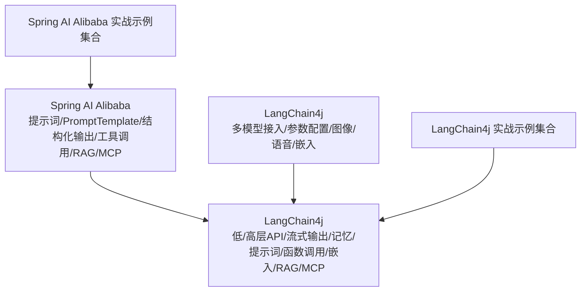
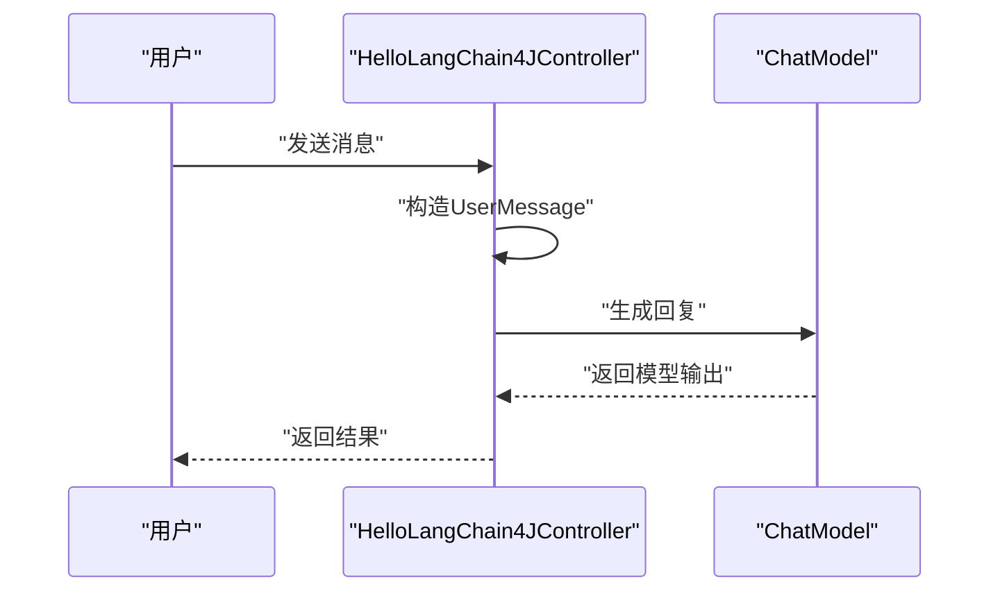
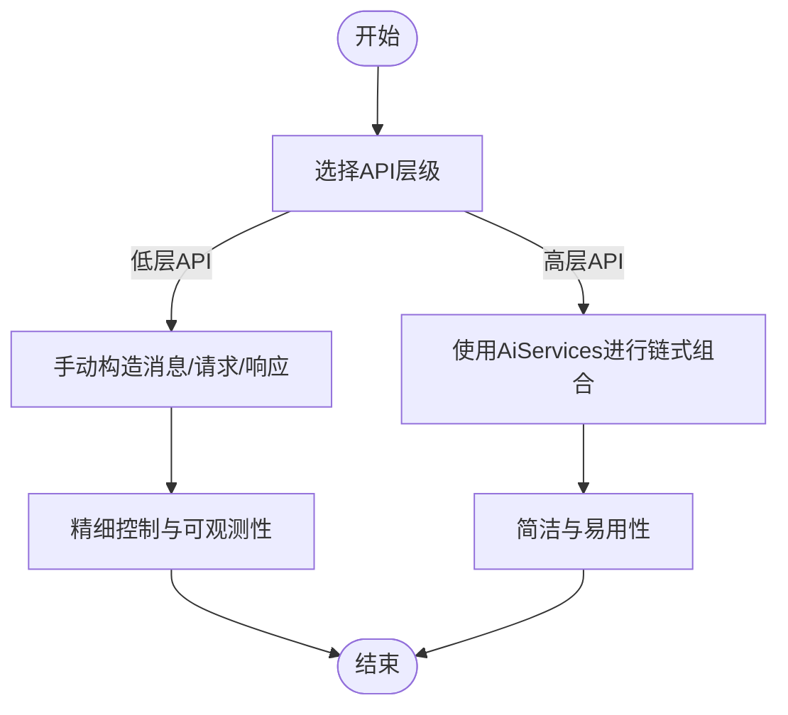
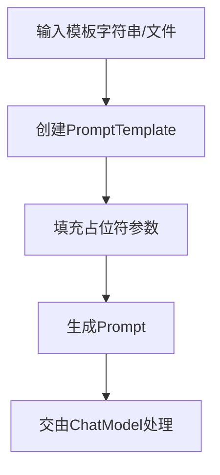
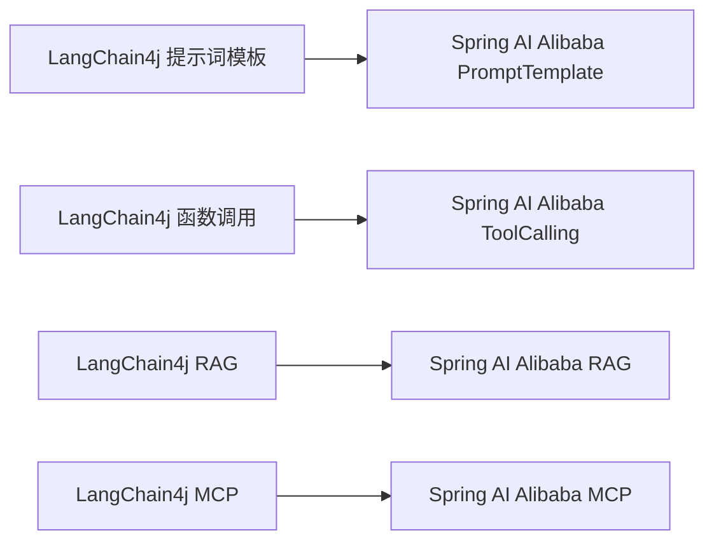

# LangChain框架应用

<cite>
**本文引用的文件**
- [HelloLangChain4JApp.java](file://【2】langchain4j-atguiguV5/langchain4j-01helloworld/src/main/java/com/atguigu/study/HelloLangChain4JApp.java)
- [LLMConfig.java](file://【2】langchain4j-atguiguV5/langchain4j-01helloworld/src/main/java/com/atguigu/study/config/LLMConfig.java)
- [HelloLangChain4JController.java](file://【2】langchain4j-atguiguV5/langchain4j-01helloworld/src/main/java/com/atguigu/study/controller/HelloLangChain4JController.java)
- [MultiModelLangChain4JApp.java](file://【2】langchain4j-atguiguV5/langchain4j-02multi-model-together/src/main/java/com/atguigu/study/MultiModelLangChain4JApp.java)
- [LLMConfig.java](file://【2】langchain4j-atguiguV5/langchain4j-02multi-model-together/src/main/java/com/atguigu/study/config/LLMConfig.java)
- [BootIntegrationLangChain4JApp.java](file://【2】langchain4j-atguiguV5/langchain4j-03boot-integration/src/main/java/com/atguigu/study/BootIntegrationLangChain4JApp.java)
- [ChatAssistant.java](file://【2】langchain4j-atguiguV5/langchain4j-03boot-integration/src/main/java/com/atguigu/study/service/ChatAssistant.java)
- [LowHighApiLangChain4JApp.java](file://【2】langchain4j-atguiguV5/langchain4j-04low-high-api/src/main/java/com/atguigu/study/LowHighApiLangChain4JApp.java)
- [LLMConfig.java](file://【2】langchain4j-atguiguV5/langchain4j-04low-high-api/src/main/java/com/atguigu/study/config/LLMConfig.java)
- [LowApiController.java](file://【2】langchain4j-atguiguV5/langchain4j-04low-high-api/src/main/java/com/atguigu/study/controller/LowApiController.java)
- [HighApiController.java](file://【2】langchain4j-atguiguV5/langchain4j-04low-high-api/src/main/java/com/atguigu/study/controller/HighApiController.java)
- [ModelParametersLangChain4JApp.java](file://【2】langchain4j-atguiguV5/langchain4j-05model-parameters/src/main/java/com/atguigu/study/ModelParametersLangChain4JApp.java)
- [LLMConfig.java](file://【2】langchain4j-atguiguV5/langchain4j-05model-parameters/src/main/java/com/atguigu/study/config/LLMConfig.java)
- [ChatImageModelLangChain4JApp.java](file://【2】langchain4j-atguiguV5/langchain4j-06chat-image/src/main/java/com/atguigu/study/ChatImageModelLangChain4JApp.java)
- [ChatStreamLangChain4JApp.java](file://【2】langchain4j-atguiguV5/langchain4j-07chat-stream/src/main/java/com/atguigu/study/ChatStreamLangChain4JApp.java)
- [ChatMemoryLangChain4JApp.java](file://【2】langchain4j-atguiguV5/langchain4j-08chat-memory/src/main/java/com/atguigu/study/ChatMemoryLangChain4JApp.java)
- [ChatPromptLangChain4JApp.java](file://【2】langchain4j-atguiguV5/langchain4j-09chat-prompt/src/main/java/com/atguigu/study/ChatPromptLangChain4JApp.java)
- [ChatPromptController.java](file://【2】langchain4j-atguiguV5/langchain4j-09chat-prompt/src/main/java/com/atguigu/study/controller/ChatPromptController.java)
- [ChatPersistenceLangChain4JApp.java](file://【2】langchain4j-atguiguV5/langchain4j-10chat-persistence/src/main/java/com/atguigu/study/ChatPersistenceLangChain4JApp.java)
- [ChatFunctioncallingLangChain4JApp.java](file://【2】langchain4j-atguiguV5/langchain4j-11chat-functioncalling/src/main/java/com/atguigu/study/ChatFunctioncallingLangChain4JApp.java)
- [ChatEmbeddingLangChain4JApp.java](file://【2】langchain4j-atguiguV5/langchain4j-12chat-embedding/src/main/java/com/atguigu/study/ChatEmbeddingLangChain4JApp.java)
- [ChatRAG01LangChain4JApp.java](file://【2】langchain4j-atguiguV5/langchain4j-13chat-rag01/src/main/java/com/atguigu/study/ChatRAG01LangChain4JApp.java)
- [ChatMCPApp.java](file://【2】langchain4j-atguiguV5/langchain4j-14chat-mcp/src/main/java/com/atguigu/study/ChatMCPApp.java)
- [LangChain4j-完整学习总结笔记.md](file://【2】langchain4j-atguiguV5/LangChain4j-完整学习总结笔记.md)
- [Saa01HelloWorldApplication.java](file://【1】SpringAIAlibaba-atguiguV1/SAA-01HelloWorld/src/main/java/com/atguigu/study/Saa01HelloWorldApplication.java)
- [SaaLLMConfig.java](file://【1】SpringAIAlibaba-atguiguV1/SAA-01HelloWorld/src/main/java/com/atguigu/study/config/SaaLLMConfig.java)
- [ChatHelloController.java](file://【1】SpringAIAlibaba-atguiguV1/SAA-01HelloWorld/src/main/java/com/atguigu/study/controller/ChatHelloController.java)
- [Saa03ChatModelChatClientApplication.java](file://【1】SpringAIAlibaba-atguiguV1/SAA-03ChatModelChatClient/src/main/java/com/atguigu/study/Saa03ChatModelChatClientApplication.java)
- [SaaLLMConfig.java](file://【1】SpringAIAlibaba-atguiguV1/SAA-03ChatModelChatClient/src/main/java/com/atguigu/study/config/SaaLLMConfig.java)
- [ChatModelController.java](file://【1】SpringAIAlibaba-atguiguV1/SAA-03ChatModelChatClient/src/main/java/com/atguigu/study/controller/ChatModelController.java)
- [ChatClientController.java](file://【1】SpringAIAlibaba-atguiguV1/SAA-03ChatModelChatClient/src/main/java/com/atguigu/study/controller/ChatClientController.java)
- [ChatClientControllerV2.java](file://【1】SpringAIAlibaba-atguiguV1/SAA-03ChatModelChatClient/src/main/java/com/atguigu/study/controller/ChatClientControllerV2.java)
- [Saa05PromptApplication.java](file://【1】SpringAIAlibaba-atguiguV1/SAA-05Prompt/src/main/java/com/atguigu/study/Saa05PromptApplication.java)
- [SaaLLMConfig.java](file://【1】SpringAIAlibaba-atguiguV1/SAA-05Prompt/src/main/java/com/atguigu/study/config/SaaLLMConfig.java)
- [PromptController.java](file://【1】SpringAIAlibaba-atguiguV1/SAA-05Prompt/src/main/java/com/atguigu/study/controller/PromptController.java)
- [Saa06PromptTemplateApplication.java](file://【1】SpringAIAlibaba-atguiguV1/SAA-06PromptTemplate/src/main/java/com/atguigu/study/Saa06PromptTemplateApplication.java)
- [PromptTemplateController.java](file://【1】SpringAIAlibaba-atguiguV1/SAA-06PromptTemplate/src/main/java/com/atguigu/study/controller/PromptTemplateController.java)
- [Saa07StructuredOutputApplication.java](file://【1】SpringAIAlibaba-atguiguV1/SAA-07StructuredOutput/src/main/java/com/atguigu/study/Saa07StructuredOutputApplication.java)
- [Saa08PersistentApplication.java](file://【1】SpringAIAlibaba-atguiguV1/SAA-08Persistent/src/main/java/com/atguigu/study/Saa08PersistentApplication.java)
- [Saa09Text2imageApplication.java](file://【1】SpringAIAlibaba-atguiguV1/SAA-09Text2image/src/main/java/com/atguigu/study/Saa09Text2imageApplication.java)
- [Saa10Text2voiceApplication.java](file://【1】SpringAIAlibaba-atguiguV1/SAA-10Text2voice/src/main/java/com/atguigu/study/Saa10Text2voiceApplication.java)
- [Saa11Embed2vectorApplication.java](file://【1】SpringAIAlibaba-atguiguV1/SAA-11Embed2vector/src/main/java/com/atguigu/study/Saa11Embed2vectorApplication.java)
- [Saa12RAG4AiOpsApplication.java](file://【1】SpringAIAlibaba-atguiguV1/SAA-12RAG4AiOps/src/main/java/com/atguigu/study/Saa12RAG4AiOpsApplication.java)
- [Saa13ToolCallingApplication.java](file://【1】SpringAIAlibaba-atguiguV1/SAA-13ToolCalling/src/main/java/com/atguigu/study/Saa13ToolCallingApplication.java)
- [Saa14LocalMcpServerApplication.java](file://【1】SpringAIAlibaba-atguiguV1/SAA-14LocalMcpServer/src/main/java/com/atguigu/study/Saa14LocalMcpServerApplication.java)
- [Saa15LocalMcpClientApplication.java](file://【1】SpringAIAlibaba-atguiguV1/SAA-15LocalMcpClient/src/main/java/com/atguigu/study/Saa15LocalMcpClientApplication.java)
- [Saa16ClientCallBaiduMcpServerApplication.java](file://【1】SpringAIAlibaba-atguiguV1/SAA-16ClientCallBaiduMcpServer/src/main/java/com/atguigu/study/Saa16ClientCallBaiduMcpServerApplication.java)
- [Saa17BailianRAGApplication.java](file://【1】SpringAIAlibaba-atguiguV1/SAA-17BailianRAG/src/main/java/com/atguigu/study/Saa17BailianRAGApplication.java)
- [Saa18TodayMenuApplication.java](file://【1】SpringAIAlibaba-atguiguV1/SAA-18TodayMenu/src/main/java/com/atguigu/study/Saa18TodayMenuApplication.java)
- [CLAUDE.md](file://CLAUDE.md)
- [0、项目全景图谱.md](file://0、项目全景图谱.md)
- [3、SpringAIAlibaba-完整学习总结笔记.md](file://3、SpringAIAlibaba-完整学习总结笔记.md)
- [4、LangChain4j-完整学习总结笔记.md](file://4、LangChain4j-完整学习总结笔记.md)
- [5、AI智能体完整学习与实施方案.md](file://5、AI智能体完整学习与实施方案.md)
- [6、AI智能体—技能全景与学习路线.md](file://6、AI智能体—技能全景与学习路线.md)
- [8、AI助手全局通用记忆规范.md](file://8、AI助手全局通用记忆规范.md)
- [9、工具分工与文件体系评价.md](file://9、工具分工与文件体系评价.md)
</cite>

## 目录
1. [引言](#引言)
2. [项目结构](#项目结构)
3. [核心组件](#核心组件)
4. [架构总览](#架构总览)
5. [详细组件分析](#详细组件分析)
6. [依赖分析](#依赖分析)
7. [性能考虑](#性能考虑)
8. [故障排查指南](#故障排查指南)
9. [结论](#结论)
10. [附录](#附录)

## 引言
本指南面向希望系统性掌握LangChain生态（以LangChain4j为核心）并将其应用于复杂AI应用的开发者与架构师。文档从LangChain4j的Hello World起步，逐步覆盖模型接口、提示词模板、流式输出、记忆存储、持久化、函数调用、嵌入与检索增强生成（RAG）、MCP工具调用等主题，并结合Spring AI Alibaba系列示例，帮助读者建立从入门到进阶的学习路径。同时，文档提供可操作的实践步骤、可视化图示与排障建议，便于不同背景的读者高效上手。

## 项目结构
该仓库包含两套LangChain相关实践体系：
- Spring AI Alibaba系列（SAA-01至SAA-18），侧重Spring AI生态中的提示词、提示词模板、结构化输出、持久化、图像/语音生成、嵌入、RAG、工具调用与MCP集成等。
- LangChain4j系列（langchain4j-01至langchain4j-14），聚焦LangChain4j在低/高层API、模型参数、流式输出、记忆、提示词、持久化、函数调用、嵌入、RAG、MCP等方面的实战组合。

下图给出两类项目在整体知识图谱中的定位与关联：

```mermaid
graph TB
subgraph "Spring AI Alibaba 示例"
SAA_Hello["SAA-01 Hello World"]
SAA_Prompt["SAA-05 Prompt"]
SAA_Template["SAA-06 PromptTemplate"]
SAA_Struct["SAA-07 StructuredOutput"]
SAA_Persist["SAA-08 Persistent"]
SAA_Image["SAA-09 Text2image"]
SAA_Voice["SAA-10 Text2voice"]
SAA_Embed["SAA-11 Embed2vector"]
SAA_RAG["SAA-12 RAG4AiOps"]
SAA_Tool["SAA-13 ToolCalling"]
SAA_MCP_S["SAA-14 LocalMcpServer"]
SAA_MCP_C["SAA-15 LocalMcpClient"]
SAA_MCP_B["SAA-16 ClientCallBaiduMcpServer"]
SAA_Bailian["SAA-17 BailianRAG"]
SAA_Menu["SAA-18 TodayMenu"]
end
subgraph "LangChain4j 示例"
LC4J_01["langchain4j-01 HelloWorld"]
LC4J_02["langchain4j-02 MultiModel"]
LC4J_03["langchain4j-03 BootIntegration"]
LC4J_04["langchain4j-04 Low/High API"]
LC4J_05["langchain4j-05 ModelParameters"]
LC4J_06["langchain4j-06 ChatImage"]
LC4J_07["langchain4j-07 ChatStream"]
LC4J_08["langchain4j-08 ChatMemory"]
LC4J_09["langchain4j-09 ChatPrompt"]
LC4J_10["langchain4j-10 ChatPersistence"]
LC4J_11["langchain4j-11 ChatFunctionCalling"]
LC4J_12["langchain4j-12 ChatEmbedding"]
LC4J_13["langchain4j-13 ChatRAG01"]
LC4J_14["langchain4j-14 ChatMCP"]
end
SAA_Hello --> LC4J_01
SAA_Template --> LC4J_09
SAA_RAG --> LC4J_13
SAA_Tool --> LC4J_11
SAA_MCP_S --> LC4J_14
SAA_MCP_C --> LC4J_14
SAA_MCP_B --> LC4J_14
```

**图表来源**
- [Saa01HelloWorldApplication.java:1-20](file://【1】SpringAIAlibaba-atguiguV1/SAA-01HelloWorld/src/main/java/com/atguigu/study/Saa01HelloWorldApplication.java#L1-L20)
- [HelloLangChain4JApp.java:1-20](file://【2】langchain4j-atguiguV5/langchain4j-01helloworld/src/main/java/com/atguigu/study/HelloLangChain4JApp.java#L1-L20)
- [Saa06PromptTemplateApplication.java:1-20](file://【1】SpringAIAlibaba-atguiguV1/SAA-06PromptTemplate/src/main/java/com/atguigu/study/Saa06PromptTemplateApplication.java#L1-L20)
- [ChatPromptLangChain4JApp.java:1-20](file://【2】langchain4j-atguiguV5/langchain4j-09chat-prompt/src/main/java/com/atguigu/study/ChatPromptLangChain4JApp.java#L1-L20)
- [Saa12RAG4AiOpsApplication.java:1-20](file://【1】SpringAIAlibaba-atguiguV1/SAA-12RAG4AiOps/src/main/java/com/atguigu/study/Saa12RAG4AiOpsApplication.java#L1-L20)
- [ChatRAG01LangChain4JApp.java:1-20](file://【2】langchain4j-atguiguV5/langchain4j-13chat-rag01/src/main/java/com/atguigu/study/ChatRAG01LangChain4JApp.java#L1-L20)
- [Saa13ToolCallingApplication.java:1-20](file://【1】SpringAIAlibaba-atguiguV1/SAA-13ToolCalling/src/main/java/com/atguigu/study/Saa13ToolCallingApplication.java#L1-L20)
- [ChatFunctioncallingLangChain4JApp.java:1-20](file://【2】langchain4j-atguiguV5/langchain4j-11chat-functioncalling/src/main/java/com/atguigu/study/ChatFunctioncallingLangChain4JApp.java#L1-L20)
- [Saa14LocalMcpServerApplication.java:1-20](file://【1】SpringAIAlibaba-atguiguV1/SAA-14LocalMcpServer/src/main/java/com/atguigu/study/Saa14LocalMcpServerApplication.java#L1-L20)
- [ChatMCPApp.java:1-20](file://【2】langchain4j-atguiguV5/langchain4j-14chat-mcp/src/main/java/com/atguigu/study/ChatMCPApp.java#L1-L20)

**章节来源**
- [0、项目全景图谱.md:1-200](file://0、项目全景图谱.md#L1-L200)
- [3、SpringAIAlibaba-完整学习总结笔记.md:1-200](file://3、SpringAIAlibaba-完整学习总结笔记.md#L1-L200)
- [4、LangChain4j-完整学习总结笔记.md:1-200](file://4、LangChain4j-完整学习总结笔记.md#L1-L200)

## 核心组件
- 模型接口（Model）
  - LangChain4j通过ChatModel抽象统一不同大模型接入；Spring AI Alibaba同样提供类似能力。两者均支持OpenAI等主流模型。
  - 示例：LangChain4j的LLMConfig与控制器组合，以及Spring AI Alibaba的SaaLLMConfig与控制器组合。
- 提示词模板（PromptTemplate）
  - LangChain4j与Spring AI Alibaba均提供PromptTemplate能力，支持占位符与模板文件加载。
- 输出解析（Parser）
  - Spring AI Alibaba提供结构化输出示例，展示如何将模型输出解析为结构化对象。
- LCEL链式调用（链式组合）
  - LangChain4j在高层API中体现链式组合思想；Spring AI Alibaba亦有类似思路的工程化实践。
- 记忆存储（Memory）
  - LangChain4j提供ChatMemory示例；Spring AI Alibaba系列未直接出现“记忆”命名，但可通过上下文管理与持久化实现记忆效果。
- 工具调用（Tool Calling）
  - Spring AI Alibaba提供ToolCalling示例；LangChain4j提供Function Calling示例。
- Agent智能体
  - 本仓库未直接出现“Agent”专用示例，但可通过函数调用与工具调用组合实现智能体行为。
- 开发工具
  - LangSmith监控与LangServe网络服务属于LangChain生态常用工具，可在实际项目中引入，本仓库未包含具体实现文件。

**章节来源**
- [LLMConfig.java:1-60](file://【2】langchain4j-atguiguV5/langchain4j-01helloworld/src/main/java/com/atguigu/study/config/LLMConfig.java#L1-L60)
- [HelloLangChain4JController.java:1-120](file://【2】langchain4j-atguiguV5/langchain4j-01helloworld/src/main/java/com/atguigu/study/controller/HelloLangChain4JController.java#L1-L120)
- [SaaLLMConfig.java:1-120](file://【1】SpringAIAlibaba-atguiguV1/SAA-01HelloWorld/src/main/java/com/atguigu/study/config/SaaLLMConfig.java#L1-L120)
- [ChatHelloController.java:1-120](file://【1】SpringAIAlibaba-atguiguV1/SAA-01HelloWorld/src/main/java/com/atguigu/study/controller/ChatHelloController.java#L1-L120)
- [PromptTemplateController.java:1-200](file://【1】SpringAIAlibaba-atguiguV1/SAA-06PromptTemplate/src/main/java/com/atguigu/study/controller/PromptTemplateController.java#L1-L200)
- [ChatPromptController.java:1-120](file://【2】langchain4j-atguiguV5/langchain4j-09chat-prompt/src/main/java/com/atguigu/study/controller/ChatPromptController.java#L1-L120)
- [Saa07StructuredOutputApplication.java:1-120](file://【1】SpringAIAlibaba-atguiguV1/SAA-07StructuredOutput/src/main/java/com/atguigu/study/Saa07StructuredOutputApplication.java#L1-L120)
- [ChatFunctioncallingLangChain4JApp.java:1-120](file://【2】langchain4j-atguiguV5/langchain4j-11chat-functioncalling/src/main/java/com/atguigu/study/ChatFunctioncallingLangChain4JApp.java#L1-L120)
- [Saa13ToolCallingApplication.java:1-120](file://【1】SpringAIAlibaba-atguiguV1/SAA-13ToolCalling/src/main/java/com/atguigu/study/Saa13ToolCallingApplication.java#L1-L120)

## 架构总览
LangChain4j与Spring AI Alibaba在架构层面共享相似的设计理念：以模型接口为中心，围绕提示词模板、链式组合、工具调用与记忆持久化构建应用。下图展示了两类项目在知识图谱中的映射关系与演进方向。

**图表来源**
- [Saa05PromptApplication.java:1-20](file://【1】SpringAIAlibaba-atguiguV1/SAA-05Prompt/src/main/java/com/atguigu/study/Saa05PromptApplication.java#L1-L20)
- [Saa06PromptTemplateApplication.java:1-20](file://【1】SpringAIAlibaba-atguiguV1/SAA-06PromptTemplate/src/main/java/com/atguigu/study/Saa06PromptTemplateApplication.java#L1-L20)
- [Saa07StructuredOutputApplication.java:1-20](file://【1】SpringAIAlibaba-atguiguV1/SAA-07StructuredOutput/src/main/java/com/atguigu/study/Saa07StructuredOutputApplication.java#L1-L20)
- [Saa13ToolCallingApplication.java:1-20](file://【1】SpringAIAlibaba-atguiguV1/SAA-13ToolCalling/src/main/java/com/atguigu/study/Saa13ToolCallingApplication.java#L1-L20)
- [Saa12RAG4AiOpsApplication.java:1-20](file://【1】SpringAIAlibaba-atguiguV1/SAA-12RAG4AiOps/src/main/java/com/atguigu/study/Saa12RAG4AiOpsApplication.java#L1-L20)
- [Saa14LocalMcpServerApplication.java:1-20](file://【1】SpringAIAlibaba-atguiguV1/SAA-14LocalMcpServer/src/main/java/com/atguigu/study/Saa14LocalMcpServerApplication.java#L1-L20)
- [Saa15LocalMcpClientApplication.java:1-20](file://【1】SpringAIAlibaba-atguiguV1/SAA-15LocalMcpClient/src/main/java/com/atguigu/study/Saa15LocalMcpClientApplication.java#L1-L20)
- [Saa16ClientCallBaiduMcpServerApplication.java:1-20](file://【1】SpringAIAlibaba-atguiguV1/SAA-16ClientCallBaiduMcpServer/src/main/java/com/atguigu/study/Saa16ClientCallBaiduMcpServerApplication.java#L1-L20)
- [Saa17BailianRAGApplication.java:1-20](file://【1】SpringAIAlibaba-atguiguV1/SAA-17BailianRAG/src/main/java/com/atguigu/study/Saa17BailianRAGApplication.java#L1-L20)
- [Saa18TodayMenuApplication.java:1-20](file://【1】SpringAIAlibaba-atguiguV1/SAA-18TodayMenu/src/main/java/com/atguigu/study/Saa18TodayMenuApplication.java#L1-L20)
- [ChatRAG01LangChain4JApp.java:1-20](file://【2】langchain4j-atguiguV5/langchain4j-13chat-rag01/src/main/java/com/atguigu/study/ChatRAG01LangChain4JApp.java#L1-L20)
- [ChatMCPApp.java:1-20](file://【2】langchain4j-atguiguV5/langchain4j-14chat-mcp/src/main/java/com/atguigu/study/ChatMCPApp.java#L1-L20)

## 详细组件分析

### 组件一：Hello World（LangChain4j）
- 目标：快速验证LangChain4j环境与ChatModel可用性。
- 关键点：
  - 配置类注入ChatModel并暴露为Bean。
  - 控制器接收用户输入，构造消息并调用ChatModel生成回复。
- 学习要点：
  - ChatModel生命周期管理。
  - 用户消息封装与模型响应解析。

**图表来源**
- [HelloLangChain4JController.java:1-120](file://【2】langchain4j-atguiguV5/langchain4j-01helloworld/src/main/java/com/atguigu/study/controller/HelloLangChain4JController.java#L1-L120)
- [LLMConfig.java:1-60](file://【2】langchain4j-atguiguV5/langchain4j-01helloworld/src/main/java/com/atguigu/study/config/LLMConfig.java#L1-L60)

**章节来源**
- [HelloLangChain4JApp.java:1-60](file://【2】langchain4j-atguiguV5/langchain4j-01helloworld/src/main/java/com/atguigu/study/HelloLangChain4JApp.java#L1-L60)
- [LLMConfig.java:1-60](file://【2】langchain4j-atguiguV5/langchain4j-01helloworld/src/main/java/com/atguigu/study/config/LLMConfig.java#L1-L60)
- [HelloLangChain4JController.java:1-120](file://【2】langchain4j-atguiguV5/langchain4j-01helloworld/src/main/java/com/atguigu/study/controller/HelloLangChain4JController.java#L1-L120)

### 组件二：多模型接入（LangChain4j）
- 目标：在同一应用中切换或组合多个模型。
- 关键点：
  - 在配置类中定义多个ChatModel Bean。
  - 控制器根据场景选择合适的模型实例。
- 学习要点：
  - 多模型策略与路由。
  - 模型参数差异化配置。

**章节来源**
- [MultiModelLangChain4JApp.java:1-60](file://【2】langchain4j-atguiguV5/langchain4j-02multi-model-together/src/main/java/com/atguigu/study/MultiModelLangChain4JApp.java#L1-L60)
- [LLMConfig.java:1-60](file://【2】langchain4j-atguiguV5/langchain4j-02multi-model-together/src/main/java/com/atguigu/study/config/LLMConfig.java#L1-L60)

### 组件三：Spring Boot集成（LangChain4j）
- 目标：将LangChain4j无缝集成到Spring Boot应用。
- 关键点：
  - 使用AiService注解声明服务接口。
  - 结合ChatModel与提示词模板实现业务服务。
- 学习要点：
  - AiService的装配与自动注入。
  - 服务层与控制器层的职责分离。

**章节来源**
- [BootIntegrationLangChain4JApp.java:1-60](file://【2】langchain4j-atguiguV5/langchain4j-03boot-integration/src/main/java/com/atguigu/study/BootIntegrationLangChain4JApp.java#L1-L60)
- [ChatAssistant.java:1-120](file://【2】langchain4j-atguiguV5/langchain4j-03boot-integration/src/main/java/com/atguigu/study/service/ChatAssistant.java#L1-L120)

### 组件四：低/高层API（LangChain4j）
- 目标：对比LangChain4j的低层API与高层API（AiServices）。
- 关键点：
  - 低层API：手动构造消息、请求与响应，适合精细控制。
  - 高层API：通过AiServices简化链式组合与参数传递。
- 学习要点：
  - 何时选择低层API，何时选择高层API。
  - ChatRequest/ChatResponse与TokenUsage的使用。

**图表来源**
- [LowApiController.java:1-120](file://【2】langchain4j-atguiguV5/langchain4j-04low-high-api/src/main/java/com/atguigu/study/controller/LowApiController.java#L1-L120)
- [HighApiController.java:1-120](file://【2】langchain4j-atguiguV5/langchain4j-04low-high-api/src/main/java/com/atguigu/study/controller/HighApiController.java#L1-L120)
- [LLMConfig.java:1-60](file://【2】langchain4j-atguiguV5/langchain4j-04low-high-api/src/main/java/com/atguigu/study/config/LLMConfig.java#L1-L60)

**章节来源**
- [LowHighApiLangChain4JApp.java:1-60](file://【2】langchain4j-atguiguV5/langchain4j-04low-high-api/src/main/java/com/atguigu/study/LowHighApiLangChain4JApp.java#L1-L60)
- [LowApiController.java:1-120](file://【2】langchain4j-atguiguV5/langchain4j-04low-high-api/src/main/java/com/atguigu/study/controller/LowApiController.java#L1-L120)
- [HighApiController.java:1-120](file://【2】langchain4j-atguiguV5/langchain4j-04low-high-api/src/main/java/com/atguigu/study/controller/HighApiController.java#L1-L120)
- [LLMConfig.java:1-60](file://【2】langchain4j-atguiguV5/langchain4j-04low-high-api/src/main/java/com/atguigu/study/config/LLMConfig.java#L1-L60)

### 组件五：模型参数（LangChain4j）
- 目标：演示如何配置与调整模型参数（如温度、最大令牌数等）。
- 关键点：
  - 在配置类中设置模型参数。
  - 控制器层按需传参。
- 学习要点：
  - 参数对输出质量与稳定性的影响。
  - 参数的动态调整策略。

**章节来源**
- [ModelParametersLangChain4JApp.java:1-60](file://【2】langchain4j-atguiguV5/langchain4j-05model-parameters/src/main/java/com/atguigu/study/ModelParametersLangChain4JApp.java#L1-L60)
- [LLMConfig.java:1-60](file://【2】langchain4j-atguiguV5/langchain4j-05model-parameters/src/main/java/com/atguigu/study/config/LLMConfig.java#L1-L60)

### 组件六：流式输出（LangChain4j）
- 目标：实现流式响应，提升用户体验。
- 关键点：
  - 使用回调监听器逐段输出。
  - 控制器层聚合并返回给客户端。
- 学习要点：
  - 流式输出的监听与拼接。
  - 客户端渲染与滚动优化。

**章节来源**
- [ChatStreamLangChain4JApp.java:1-60](file://【2】langchain4j-atguiguV5/langchain4j-07chat-stream/src/main/java/com/atguigu/study/ChatStreamLangChain4JApp.java#L1-L60)

### 组件七：记忆存储（LangChain4j）
- 目标：在会话中保存上下文，实现连续对话。
- 关键点：
  - 使用ChatMemory管理历史消息。
  - 控制器层在每次请求时注入与更新记忆。
- 学习要点：
  - 记忆容量与淘汰策略。
  - 记忆与上下文长度的平衡。

**章节来源**
- [ChatMemoryLangChain4JApp.java:1-60](file://【2】langchain4j-atguiguV5/langchain4j-08chat-memory/src/main/java/com/atguigu/study/ChatMemoryLangChain4JApp.java#L1-L60)

### 组件八：提示词模板（LangChain4j）
- 目标：通过模板化提示词提升复用性与一致性。
- 关键点：
  - 使用PromptTemplate构造模板。
  - 占位符替换与默认属性（如it）的使用。
- 学习要点：
  - 模板文件与内联模板的选择。
  - 系统提示与用户提示的分层设计。

**图表来源**
- [ChatPromptController.java:1-120](file://【2】langchain4j-atguiguV5/langchain4j-09chat-prompt/src/main/java/com/atguigu/study/controller/ChatPromptController.java#L1-L120)

**章节来源**
- [ChatPromptLangChain4JApp.java:1-60](file://【2】langchain4j-atguiguV5/langchain4j-09chat-prompt/src/main/java/com/atguigu/study/ChatPromptLangChain4JApp.java#L1-L60)
- [ChatPromptController.java:1-120](file://【2】langchain4j-atguiguV5/langchain4j-09chat-prompt/src/main/java/com/atguigu/study/controller/ChatPromptController.java#L1-L120)

### 组件九：持久化（LangChain4j）
- 目标：将对话历史与中间结果持久化，便于回溯与审计。
- 关键点：
  - 将消息与元数据写入存储。
  - 提供查询与恢复能力。
- 学习要点：
  - 数据模型设计与索引策略。
  - 性能与成本的权衡。

**章节来源**
- [ChatPersistenceLangChain4JApp.java:1-60](file://【2】langchain4j-atguiguV5/langchain4j-10chat-persistence/src/main/java/com/atguigu/study/ChatPersistenceLangChain4JApp.java#L1-L60)

### 组件十：函数调用（LangChain4j）
- 目标：通过函数调用扩展模型能力，实现外部系统交互。
- 关键点：
  - 定义函数签名与实现。
  - 模型根据上下文决定是否调用函数。
- 学习要点：
  - 函数注册与绑定。
  - 错误处理与重试策略。

**章节来源**
- [ChatFunctioncallingLangChain4JApp.java:1-60](file://【2】langchain4j-atguiguV5/langchain4j-11chat-functioncalling/src/main/java/com/atguigu/study/ChatFunctioncallingLangChain4JApp.java#L1-L60)

### 组件十一：嵌入与向量检索（LangChain4j）
- 目标：构建向量化知识库，支持语义检索。
- 关键点：
  - 文档分块与嵌入生成。
  - 向量存储与相似度检索。
- 学习要点：
  - 嵌入维度与检索算法选择。
  - 评估指标与召回率优化。

**章节来源**
- [ChatEmbeddingLangChain4JApp.java:1-60](file://【2】langchain4j-atguiguV5/langchain4j-12chat-embedding/src/main/java/com/atguigu/study/ChatEmbeddingLangChain4JApp.java#L1-L60)

### 组件十二：RAG（LangChain4j）
- 目标：基于检索增强生成高质量回答。
- 关键点：
  - 检索器与生成器的组合。
  - 上下文裁剪与提示词优化。
- 学习要点：
  - RAG管道的性能瓶颈与优化。
  - 多轮对话下的上下文管理。

**章节来源**
- [ChatRAG01LangChain4JApp.java:1-60](file://【2】langchain4j-atguiguV5/langchain4j-13chat-rag01/src/main/java/com/atguigu/study/ChatRAG01LangChain4JApp.java#L1-L60)

### 组件十三：MCP工具调用（LangChain4j）
- 目标：通过MCP协议与本地/远程工具服务器通信。
- 关键点：
  - 本地MCP Server与Client的搭建。
  - 远程MCP Server（如百度）的对接。
- 学习要点：
  - MCP协议的消息格式与握手流程。
  - 权限控制与安全边界。

**章节来源**
- [ChatMCPApp.java:1-60](file://【2】langchain4j-atguiguV5/langchain4j-14chat-mcp/src/main/java/com/atguigu/study/ChatMCPApp.java#L1-L60)
- [Saa14LocalMcpServerApplication.java:1-60](file://【1】SpringAIAlibaba-atguiguV1/SAA-14LocalMcpServer/src/main/java/com/atguigu/study/Saa14LocalMcpServerApplication.java#L1-L60)
- [Saa15LocalMcpClientApplication.java:1-60](file://【1】SpringAIAlibaba-atguiguV1/SAA-15LocalMcpClient/src/main/java/com/atguigu/study/Saa15LocalMcpClientApplication.java#L1-L60)
- [Saa16ClientCallBaiduMcpServerApplication.java:1-60](file://【1】SpringAIAlibaba-atguiguV1/SAA-16ClientCallBaiduMcpServer/src/main/java/com/atguigu/study/Saa16ClientCallBaiduMcpServerApplication.java#L1-L60)

### 组件十四：提示词与模板（Spring AI Alibaba）
- 目标：通过PromptTemplate与SystemPromptTemplate组织提示词。
- 关键点：
  - 占位符替换与模板文件加载。
  - 系统提示与用户提示的协同。
- 学习要点：
  - 模板复用与版本管理。
  - 系统角色与领域定制。

**章节来源**
- [Saa05PromptApplication.java:1-60](file://【1】SpringAIAlibaba-atguiguV1/SAA-05Prompt/src/main/java/com/atguigu/study/Saa05PromptApplication.java#L1-L60)
- [PromptController.java:1-120](file://【1】SpringAIAlibaba-atguiguV1/SAA-05Prompt/src/main/java/com/atguigu/study/controller/PromptController.java#L1-L120)
- [Saa06PromptTemplateApplication.java:1-60](file://【1】SpringAIAlibaba-atguiguV1/SAA-06PromptTemplate/src/main/java/com/atguigu/study/Saa06PromptTemplateApplication.java#L1-L60)
- [PromptTemplateController.java:1-200](file://【1】SpringAIAlibaba-atguiguV1/SAA-06PromptTemplate/src/main/java/com/atguigu/study/controller/PromptTemplateController.java#L1-L200)

### 组件十五：结构化输出（Spring AI Alibaba）
- 目标：将模型输出解析为结构化对象，便于后续处理。
- 关键点：
  - 使用结构化提示词约束输出格式。
  - 解析器与反序列化。
- 学习要点：
  - JSON Schema与Pydantic风格的提示词设计。
  - 错误恢复与重试机制。

**章节来源**
- [Saa07StructuredOutputApplication.java:1-60](file://【1】SpringAIAlibaba-atguiguV1/SAA-07StructuredOutput/src/main/java/com/atguigu/study/Saa07StructuredOutputApplication.java#L1-L60)

### 组件十六：图像/语音/嵌入（Spring AI Alibaba）
- 目标：扩展多模态与向量化能力。
- 关键点：
  - 文本到图像/语音的生成。
  - 文本嵌入与向量存储。
- 学习要点：
  - 多模态模型的参数与成本控制。
  - 向量检索的性能优化。

**章节来源**
- [Saa09Text2imageApplication.java:1-60](file://【1】SpringAIAlibaba-atguiguV1/SAA-09Text2image/src/main/java/com/atguigu/study/Saa09Text2imageApplication.java#L1-L60)
- [Saa10Text2voiceApplication.java:1-60](file://【1】SpringAIAlibaba-atguiguV1/SAA-10Text2voice/src/main/java/com/atguigu/study/Saa10Text2voiceApplication.java#L1-L60)
- [Saa11Embed2vectorApplication.java:1-60](file://【1】SpringAIAlibaba-atguiguV1/SAA-11Embed2vector/src/main/java/com/atguigu/study/Saa11Embed2vectorApplication.java#L1-L60)

### 组件十七：RAG与工具调用（Spring AI Alibaba）
- 目标：结合RAG与工具调用，构建更强大的问答系统。
- 关键点：
  - RAG检索与工具调用的编排。
  - 上下文窗口与成本控制。
- 学习要点：
  - 动态路由：先RAG再工具，或并行决策。
  - 评估与A/B测试策略。

**章节来源**
- [Saa12RAG4AiOpsApplication.java:1-60](file://【1】SpringAIAlibaba-atguiguV1/SAA-12RAG4AiOps/src/main/java/com/atguigu/study/Saa12RAG4AiOpsApplication.java#L1-L60)
- [Saa13ToolCallingApplication.java:1-60](file://【1】SpringAIAlibaba-atguiguV1/SAA-13ToolCalling/src/main/java/com/atguigu/study/Saa13ToolCallingApplication.java#L1-L60)
- [Saa17BailianRAGApplication.java:1-60](file://【1】SpringAIAlibaba-atguiguV1/SAA-17BailianRAG/src/main/java/com/atguigu/study/Saa17BailianRAGApplication.java#L1-L60)

### 组件十八：菜单推荐（Spring AI Alibaba）
- 目标：结合工具调用与RAG，实现个性化推荐。
- 关键点：
  - 多源信息融合与排序。
  - 用户偏好建模与冷启动。
- 学习要点：
  - 推荐系统的评估指标。
  - A/B实验与在线学习。

**章节来源**
- [Saa18TodayMenuApplication.java:1-60](file://【1】SpringAIAlibaba-atguiguV1/SAA-18TodayMenu/src/main/java/com/atguigu/study/Saa18TodayMenuApplication.java#L1-L60)

## 依赖分析
LangChain4j与Spring AI Alibaba示例之间存在清晰的依赖关系：前者在提示词模板、函数调用、RAG、MCP等方面与后者形成互补。下图展示部分示例之间的依赖映射。

**图表来源**
- [ChatPromptController.java:1-120](file://【2】langchain4j-atguiguV5/langchain4j-09chat-prompt/src/main/java/com/atguigu/study/controller/ChatPromptController.java#L1-L120)
- [PromptTemplateController.java:1-200](file://【1】SpringAIAlibaba-atguiguV1/SAA-06PromptTemplate/src/main/java/com/atguigu/study/controller/PromptTemplateController.java#L1-L200)
- [ChatFunctioncallingLangChain4JApp.java:1-60](file://【2】langchain4j-atguiguV5/langchain4j-11chat-functioncalling/src/main/java/com/atguigu/study/ChatFunctioncallingLangChain4JApp.java#L1-L60)
- [Saa13ToolCallingApplication.java:1-60](file://【1】SpringAIAlibaba-atguiguV1/SAA-13ToolCalling/src/main/java/com/atguigu/study/Saa13ToolCallingApplication.java#L1-L60)
- [ChatRAG01LangChain4JApp.java:1-60](file://【2】langchain4j-atguiguV5/langchain4j-13chat-rag01/src/main/java/com/atguigu/study/ChatRAG01LangChain4JApp.java#L1-L60)
- [Saa12RAG4AiOpsApplication.java:1-60](file://【1】SpringAIAlibaba-atguiguV1/SAA-12RAG4AiOps/src/main/java/com/atguigu/study/Saa12RAG4AiOpsApplication.java#L1-L60)
- [ChatMCPApp.java:1-60](file://【2】langchain4j-atguiguV5/langchain4j-14chat-mcp/src/main/java/com/atguigu/study/ChatMCPApp.java#L1-L60)
- [Saa14LocalMcpServerApplication.java:1-60](file://【1】SpringAIAlibaba-atguiguV1/SAA-14LocalMcpServer/src/main/java/com/atguigu/study/Saa14LocalMcpServerApplication.java#L1-L60)
- [Saa15LocalMcpClientApplication.java:1-60](file://【1】SpringAIAlibaba-atguiguV1/SAA-15LocalMcpClient/src/main/java/com/atguigu/study/Saa15LocalMcpClientApplication.java#L1-L60)
- [Saa16ClientCallBaiduMcpServerApplication.java:1-60](file://【1】SpringAIAlibaba-atguiguV1/SAA-16ClientCallBaiduMcpServer/src/main/java/com/atguigu/study/Saa16ClientCallBaiduMcpServerApplication.java#L1-L60)

**章节来源**
- [Saa06PromptTemplateApplication.java:1-60](file://【1】SpringAIAlibaba-atguiguV1/SAA-06PromptTemplate/src/main/java/com/atguigu/study/Saa06PromptTemplateApplication.java#L1-L60)
- [Saa13ToolCallingApplication.java:1-60](file://【1】SpringAIAlibaba-atguiguV1/SAA-13ToolCalling/src/main/java/com/atguigu/study/Saa13ToolCallingApplication.java#L1-L60)
- [Saa12RAG4AiOpsApplication.java:1-60](file://【1】SpringAIAlibaba-atguiguV1/SAA-12RAG4AiOps/src/main/java/com/atguigu/study/Saa12RAG4AiOpsApplication.java#L1-L60)
- [Saa14LocalMcpServerApplication.java:1-60](file://【1】SpringAIAlibaba-atguiguV1/SAA-14LocalMcpServer/src/main/java/com/atguigu/study/Saa14LocalMcpServerApplication.java#L1-L60)
- [Saa15LocalMcpClientApplication.java:1-60](file://【1】SpringAIAlibaba-atguiguV1/SAA-15LocalMcpClient/src/main/java/com/atguigu/study/Saa15LocalMcpClientApplication.java#L1-L60)
- [Saa16ClientCallBaiduMcpServerApplication.java:1-60](file://【1】SpringAIAlibaba-atguiguV1/SAA-16ClientCallBaiduMcpServer/src/main/java/com/atguigu/study/Saa16ClientCallBaiduMcpServerApplication.java#L1-L60)

## 性能考虑
- 模型参数
  - 温度、top_p、max_tokens等参数直接影响延迟与吞吐。建议在预生产环境进行A/B测试，确定最优参数组合。
- 流式输出
  - 流式响应可显著改善首字节时间（TTFT），但需注意客户端渲染与缓冲区管理。
- 记忆与持久化
  - 记忆容量应与上下文长度限制匹配，避免频繁截断。持久化层建议采用异步写入与批量提交。
- 嵌入与检索
  - 向量索引选择与倒排策略影响检索速度；建议定期重建索引并监控延迟。
- 函数调用与MCP
  - 工具调用可能成为瓶颈，建议对工具进行缓存与并发限制，并在失败时快速降级。

## 故障排查指南
- 模型不可用或鉴权失败
  - 检查配置类中的密钥与端点设置，确认网络连通性与代理配置。
- 提示词模板报错
  - 校验占位符名称与数量，确保模板文件编码正确且路径可达。
- 流式输出中断
  - 检查监听器回调是否抛出异常，确保客户端连接状态与超时设置合理。
- 记忆越界或丢失
  - 校验上下文长度限制与截断策略，检查持久化存储的事务一致性。
- 函数调用失败
  - 查看工具实现的日志与错误码，必要时启用重试与熔断。
- MCP通信异常
  - 检查协议版本、握手流程与心跳机制，核对防火墙与端口开放情况。

## 结论
通过LangChain4j与Spring AI Alibaba的系列示例，开发者可以系统地掌握从基础模型接入到高级功能（提示词模板、流式输出、记忆、函数调用、嵌入、RAG、MCP）的完整路径。建议在实际项目中结合业务场景，优先完成提示词工程化与结构化输出，再逐步引入记忆、RAG与工具调用，最终实现可运维、可观测、可扩展的AI应用系统。

## 附录
- 学习笔记与总结
  - LangChain4j与Spring AI Alibaba的学习笔记提供了系统化的知识梳理与最佳实践建议。
- 项目全景图谱
  - 项目全景图谱明确了各模块在整体知识体系中的位置与演进方向。
- AI智能体学习方案
  - 智能体学习方案与技能路线为进阶者提供了长期成长路径。

**章节来源**
- [4、LangChain4j-完整学习总结笔记.md:1-200](file://4、LangChain4j-完整学习总结笔记.md#L1-L200)
- [3、SpringAIAlibaba-完整学习总结笔记.md:1-200](file://3、SpringAIAlibaba-完整学习总结笔记.md#L1-L200)
- [0、项目全景图谱.md:1-200](file://0、项目全景图谱.md#L1-L200)
- [5、AI智能体完整学习与实施方案.md:1-200](file://5、AI智能体完整学习与实施方案.md#L1-L200)
- [6、AI智能体—技能全景与学习路线.md:1-200](file://6、AI智能体—技能全景与学习路线.md#L1-L200)
- [8、AI助手全局通用记忆规范.md:1-200](file://8、AI助手全局通用记忆规范.md#L1-L200)
- [9、工具分工与文件体系评价.md:1-200](file://9、工具分工与文件体系评价.md#L1-L200)
- [CLAUDE.md:1-200](file://CLAUDE.md#L1-L200)