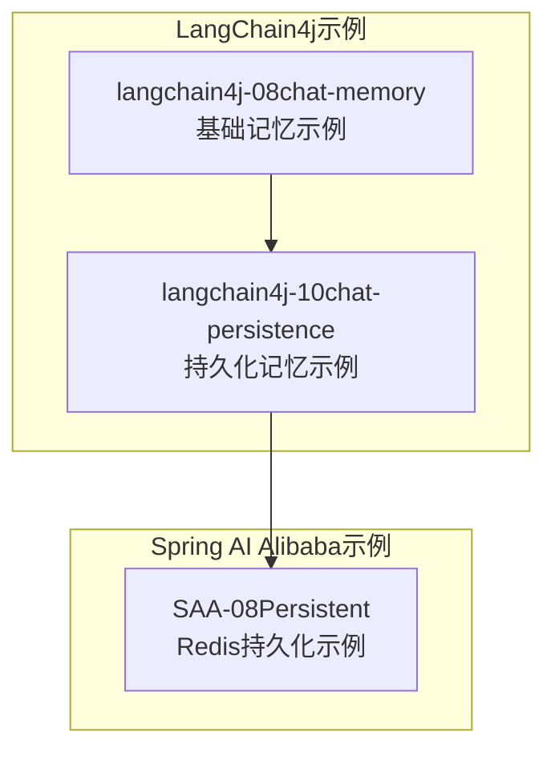
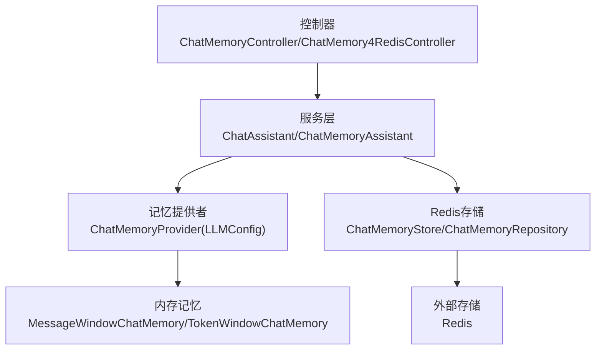
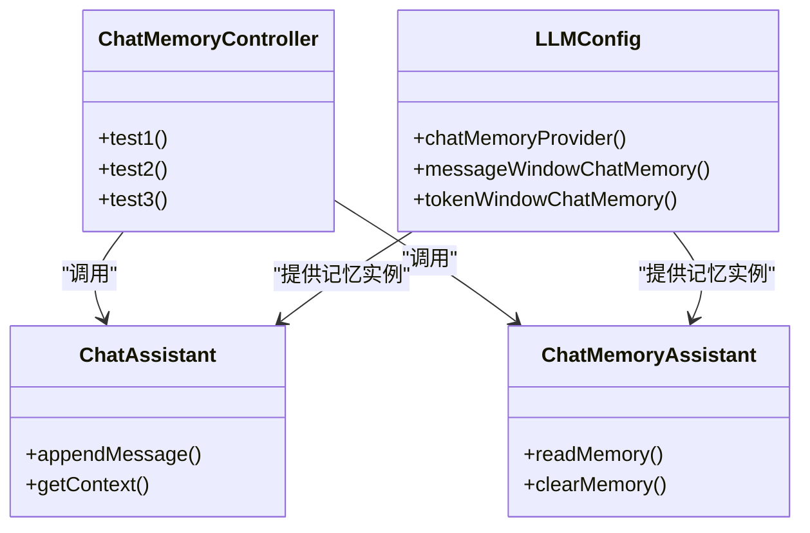
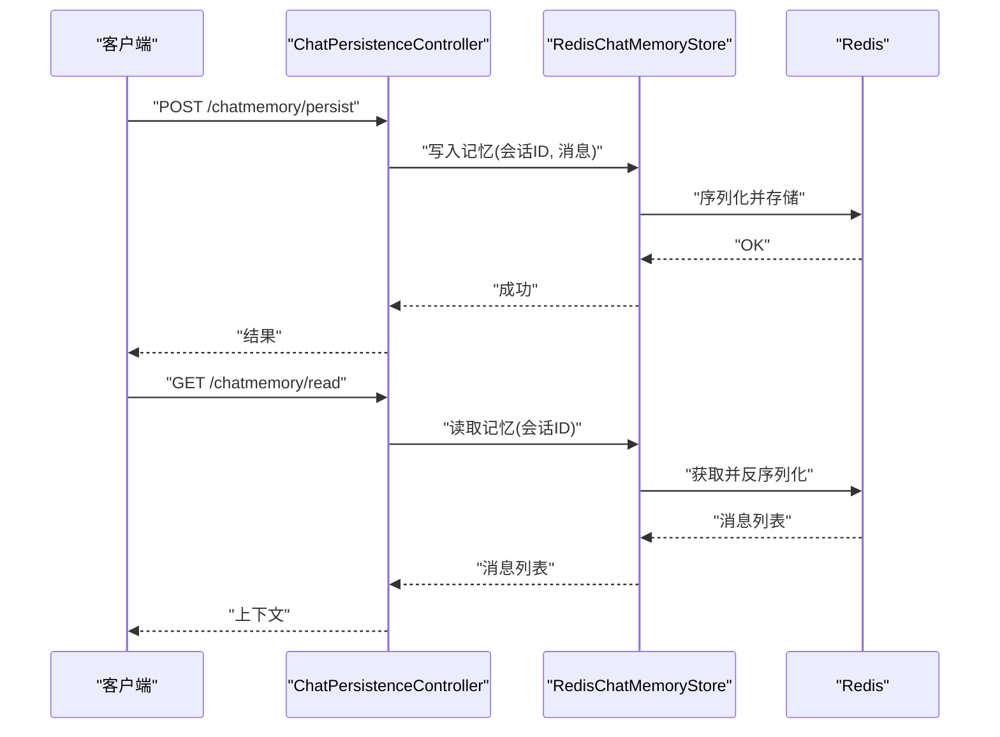
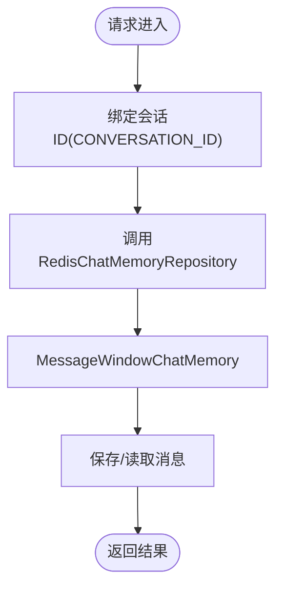
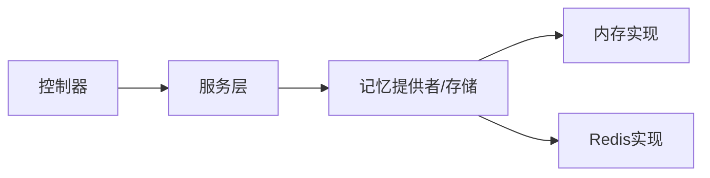

# LangChain记忆系统

<cite>
**本文引用的文件**
- [ChatMemoryLangChain4JApp.java](file://【2】langchain4j-atguiguV5/langchain4j-08chat-memory/src/main/java/com/atguigu/study/ChatMemoryLangChain4JApp.java)
- [LLMConfig.java](file://【2】langchain4j-atguiguV5/langchain4j-08chat-memory/src/main/java/com/atguigu/study/config/LLMConfig.java)
- [ChatMemoryController.java](file://【2】langchain4j-atguiguV5/langchain4j-08chat-memory/src/main/java/com/atguigu/study/controller/ChatMemoryController.java)
- [ChatAssistant.java](file://【2】langchain4j-atguiguV5/langchain4j-08chat-memory/src/main/java/com/atguigu/study/service/ChatAssistant.java)
- [ChatMemoryAssistant.java](file://【2】langchain4j-atguiguV5/langchain4j-08chat-memory/src/main/java/com/atguigu/study/service/ChatMemoryAssistant.java)
- [ChatPersistenceLangChain4JApp.java](file://【2】langchain4j-atguiguV5/langchain4j-10chat-persistence/src/main/java/com/atguigu/study/ChatPersistenceLangChain4JApp.java)
- [LLMConfig.java](file://【2】langchain4j-atguiguV5/langchain4j-10chat-persistence/src/main/java/com/atguigu/study/config/LLMConfig.java)
- [RedisChatMemoryStore.java](file://【2】langchain4j-atguiguV5/langchain4j-10chat-persistence/src/main/java/com/atguigu/study/config/RedisChatMemoryStore.java)
- [ChatMemory4RedisController.java](file://【1】SpringAIAlibaba-atguiguV1/SAA-08Persistent/src/main/java/com/atguigu/study/controller/ChatMemory4RedisController.java)
- [RedisMemoryConfig.java](file://【1】SpringAIAlibaba-atguiguV1/SAA-08Persistent/src/main/java/com/atguigu/study/config/RedisMemoryConfig.java)
- [SaaLLMConfig.java](file://【1】SpringAIAlibaba-atguiguV1/SAA-08Persistent/src/main/java/com/atguigu/study/config/SaaLLMConfig.java)
</cite>

## 目录
1. [引言](#引言)
2. [项目结构](#项目结构)
3. [核心组件](#核心组件)
4. [架构总览](#架构总览)
5. [详细组件分析](#详细组件分析)
6. [依赖分析](#依赖分析)
7. [性能考虑](#性能考虑)
8. [故障排查指南](#故障排查指南)
9. [结论](#结论)
10. [附录](#附录)

## 引言
本技术指南围绕LangChain记忆系统展开，聚焦于对话记忆的生命周期管理、上下文保持策略、内存优化与持久化存储实现。通过对比LangChain4j与Spring AI Alibaba两种实现路径，系统性地梳理了从基础内存到持久化存储的多种记忆存储方案，并给出在不同业务场景下的选型建议与配置要点。

## 项目结构
本仓库包含三类与“记忆”直接相关的示例工程：
- LangChain4j基础记忆示例：演示基于内存的消息窗口记忆与令牌窗口记忆。
- LangChain4j持久化记忆示例：演示基于Redis的ChatMemoryStore持久化。
- Spring AI Alibaba基于Redis的持久化记忆示例：演示基于Redis的ChatMemoryRepository与MessageWindowChatMemory集成。

**章节来源**
- [ChatMemoryLangChain4JApp.java:1-200](file://【2】langchain4j-atguiguV5/langchain4j-08chat-memory/src/main/java/com/atguigu/study/ChatMemoryLangChain4JApp.java#L1-L200)
- [ChatPersistenceLangChain4JApp.java:1-200](file://【2】langchain4j-atguiguV5/langchain4j-10chat-persistence/src/main/java/com/atguigu/study/ChatPersistenceLangChain4JApp.java#L1-L200)
- [ChatMemory4RedisController.java:1-200](file://【1】SpringAIAlibaba-atguiguV1/SAA-08Persistent/src/main/java/com/atguigu/study/controller/ChatMemory4RedisController.java#L1-L200)

## 核心组件
- 记忆提供者与存储
  - LangChain4j：通过ChatMemoryProvider与ChatMemoryStore实现记忆提供与持久化。
  - Spring AI Alibaba：通过ChatMemoryRepository与MessageWindowChatMemory实现记忆持久化。
- 控制器与服务
  - 控制器负责接收请求、注入记忆组件并调用服务层。
  - 服务层封装记忆操作，如追加消息、读取上下文、清理过期记忆等。
- 配置类
  - 负责构建记忆实例（消息窗口/令牌窗口）、设置淘汰策略、注册ChatMemoryProvider或ChatMemoryStore。

**章节来源**
- [LLMConfig.java:1-120](file://【2】langchain4j-atguiguV5/langchain4j-08chat-memory/src/main/java/com/atguigu/study/config/LLMConfig.java#L1-L120)
- [LLMConfig.java:1-120](file://【2】langchain4j-atguiguV5/langchain4j-10chat-persistence/src/main/java/com/atguigu/study/config/LLMConfig.java#L1-L120)
- [RedisChatMemoryStore.java:1-200](file://【2】langchain4j-atguiguV5/langchain4j-10chat-persistence/src/main/java/com/atguigu/study/config/RedisChatMemoryStore.java#L1-L200)
- [ChatMemoryController.java:1-200](file://【2】langchain4j-atguiguV5/langchain4j-08chat-memory/src/main/java/com/atguigu/study/controller/ChatMemoryController.java#L1-L200)
- [ChatMemory4RedisController.java:1-200](file://【1】SpringAIAlibaba-atguiguV1/SAA-08Persistent/src/main/java/com/atguigu/study/controller/ChatMemory4RedisController.java#L1-L200)

## 架构总览
LangChain4j与Spring AI Alibaba均采用“控制器-服务-记忆提供者/存储”的分层架构。LangChain4j通过ChatMemoryProvider按会话ID动态提供记忆实例；持久化通过ChatMemoryStore实现序列化存储；Spring AI Alibaba通过ChatMemoryRepository与MessageWindowChatMemory结合实现持久化。

**图示来源**
- [ChatMemoryController.java:1-200](file://【2】langchain4j-atguiguV5/langchain4j-08chat-memory/src/main/java/com/atguigu/study/controller/ChatMemoryController.java#L1-L200)
- [LLMConfig.java:1-120](file://【2】langchain4j-atguiguV5/langchain4j-08chat-memory/src/main/java/com/atguigu/study/config/LLMConfig.java#L1-L120)
- [RedisChatMemoryStore.java:1-200](file://【2】langchain4j-atguiguV5/langchain4j-10chat-persistence/src/main/java/com/atguigu/study/config/RedisChatMemoryStore.java#L1-L200)
- [ChatMemory4RedisController.java:1-200](file://【1】SpringAIAlibaba-atguiguV1/SAA-08Persistent/src/main/java/com/atguigu/study/controller/ChatMemory4RedisController.java#L1-L200)
- [RedisMemoryConfig.java:1-200](file://【1】SpringAIAlibaba-atguiguV1/SAA-08Persistent/src/main/java/com/atguigu/study/config/RedisMemoryConfig.java#L1-L200)
- [SaaLLMConfig.java:1-200](file://【1】SpringAIAlibaba-atguiguV1/SAA-08Persistent/src/main/java/com/atguigu/study/config/SaaLLMConfig.java#L1-L200)

## 详细组件分析

### 组件A：LangChain4j基础记忆（消息窗口/令牌窗口）
- 功能概述
  - 通过LLMConfig构建MessageWindowChatMemory与TokenWindowChatMemory，分别以消息条数与令牌数作为淘汰策略。
  - ChatMemoryController提供测试接口，验证记忆的读写与淘汰行为。
  - ChatAssistant/ChatMemoryAssistant封装记忆操作，便于在业务流程中复用。
- 关键点
  - 消息窗口：按最大消息数限制上下文长度，适合对消息数量敏感的场景。
  - 令牌窗口：按最大令牌数限制上下文长度，适合对上下文长度敏感的场景。
  - ChatMemoryProvider：按会话ID动态提供记忆实例，确保多用户隔离。
- 适用场景
  - 短对话、多轮交互但上下文长度有限的场景。
  - 对响应速度要求高、无需长期保留历史的场景。

**图示来源**
- [ChatMemoryController.java:1-200](file://【2】langchain4j-atguiguV5/langchain4j-08chat-memory/src/main/java/com/atguigu/study/controller/ChatMemoryController.java#L1-L200)
- [LLMConfig.java:1-120](file://【2】langchain4j-atguiguV5/langchain4j-08chat-memory/src/main/java/com/atguigu/study/config/LLMConfig.java#L1-L120)
- [ChatAssistant.java:1-200](file://【2】langchain4j-atguiguV5/langchain4j-08chat-memory/src/main/java/com/atguigu/study/service/ChatAssistant.java#L1-L200)
- [ChatMemoryAssistant.java:1-200](file://【2】langchain4j-atguiguV5/langchain4j-08chat-memory/src/main/java/com/atguigu/study/service/ChatMemoryAssistant.java#L1-L200)

**章节来源**
- [LLMConfig.java:1-120](file://【2】langchain4j-atguiguV5/langchain4j-08chat-memory/src/main/java/com/atguigu/study/config/LLMConfig.java#L1-L120)
- [ChatMemoryController.java:1-200](file://【2】langchain4j-atguiguV5/langchain4j-08chat-memory/src/main/java/com/atguigu/study/controller/ChatMemoryController.java#L1-L200)
- [ChatAssistant.java:1-200](file://【2】langchain4j-atguiguV5/langchain4j-08chat-memory/src/main/java/com/atguigu/study/service/ChatAssistant.java#L1-L200)
- [ChatMemoryAssistant.java:1-200](file://【2】langchain4j-atguiguV5/langchain4j-08chat-memory/src/main/java/com/atguigu/study/service/ChatMemoryAssistant.java#L1-L200)

### 组件B：LangChain4j持久化记忆（Redis）
- 功能概述
  - 通过RedisChatMemoryStore实现ChatMemoryStore接口，将记忆序列化后存入Redis。
  - ChatPersistenceLangChain4JApp与LLMConfig负责装配ChatMemoryProvider与ChatMemoryStore。
  - ChatPersistenceController提供持久化读写接口，验证跨进程/重启后的上下文恢复能力。
- 关键点
  - ChatMemoryStore：定义记忆的读写与删除接口，Redis实现负责序列化与反序列化。
  - 会话ID：作为Redis键前缀，确保多会话隔离。
  - 淘汰策略：可与消息/令牌窗口策略结合，避免无限增长。
- 适用场景
  - 需要跨进程/重启保留上下文的生产环境。
  - 对可靠性有要求、需要统一管理记忆的系统。

**图示来源**
- [ChatPersistenceLangChain4JApp.java:1-200](file://【2】langchain4j-atguiguV5/langchain4j-10chat-persistence/src/main/java/com/atguigu/study/ChatPersistenceLangChain4JApp.java#L1-L200)
- [LLMConfig.java:1-120](file://【2】langchain4j-atguiguV5/langchain4j-10chat-persistence/src/main/java/com/atguigu/study/config/LLMConfig.java#L1-L120)
- [RedisChatMemoryStore.java:1-200](file://【2】langchain4j-atguiguV5/langchain4j-10chat-persistence/src/main/java/com/atguigu/study/config/RedisChatMemoryStore.java#L1-L200)

**章节来源**
- [ChatPersistenceLangChain4JApp.java:1-200](file://【2】langchain4j-atguiguV5/langchain4j-10chat-persistence/src/main/java/com/atguigu/study/ChatPersistenceLangChain4JApp.java#L1-L200)
- [LLMConfig.java:1-120](file://【2】langchain4j-atguiguV5/langchain4j-10chat-persistence/src/main/java/com/atguigu/study/config/LLMConfig.java#L1-L120)
- [RedisChatMemoryStore.java:1-200](file://【2】langchain4j-atguiguV5/langchain4j-10chat-persistence/src/main/java/com/atguigu/study/config/RedisChatMemoryStore.java#L1-L200)

### 组件C：Spring AI Alibaba持久化记忆（Redis）
- 功能概述
  - 通过RedisMemoryConfig与SaaLLMConfig引入RedisChatMemoryRepository与MessageWindowChatMemory。
  - ChatMemory4RedisController提供REST接口，演示读写记忆并与会话ID绑定。
- 关键点
  - ChatMemoryRepository：抽象记忆存储，Redis实现负责键空间管理与序列化。
  - MessageWindowChatMemory：与Spring AI Alibaba生态集成，简化配置。
- 适用场景
  - 已采用Spring AI Alibaba生态的企业级应用。
  - 需要与现有Spring配置体系无缝集成的记忆持久化。

**图示来源**
- [ChatMemory4RedisController.java:1-200](file://【1】SpringAIAlibaba-atguiguV1/SAA-08Persistent/src/main/java/com/atguigu/study/controller/ChatMemory4RedisController.java#L1-L200)
- [RedisMemoryConfig.java:1-200](file://【1】SpringAIAlibaba-atguiguV1/SAA-08Persistent/src/main/java/com/atguigu/study/config/RedisMemoryConfig.java#L1-L200)
- [SaaLLMConfig.java:1-200](file://【1】SpringAIAlibaba-atguiguV1/SAA-08Persistent/src/main/java/com/atguigu/study/config/SaaLLMConfig.java#L1-L200)

**章节来源**
- [ChatMemory4RedisController.java:1-200](file://【1】SpringAIAlibaba-atguiguV1/SAA-08Persistent/src/main/java/com/atguigu/study/controller/ChatMemory4RedisController.java#L1-L200)
- [RedisMemoryConfig.java:1-200](file://【1】SpringAIAlibaba-atguiguV1/SAA-08Persistent/src/main/java/com/atguigu/study/config/RedisMemoryConfig.java#L1-L200)
- [SaaLLMConfig.java:1-200](file://【1】SpringAIAlibaba-atguiguV1/SAA-08Persistent/src/main/java/com/atguigu/study/config/SaaLLMConfig.java#L1-L200)

## 依赖分析
- 组件耦合
  - 控制器依赖服务层；服务层依赖记忆提供者/存储；记忆提供者/存储依赖具体实现（内存或Redis）。
- 外部依赖
  - Redis：作为持久化存储介质，需保证可用性与性能。
  - LangChain4j/Spring AI Alibaba：提供记忆抽象与实现，需关注版本兼容性与特性差异。
- 潜在循环依赖
  - 示例工程中未见循环依赖；若扩展自定义存储，应避免在ChatMemoryStore与服务层之间形成环状调用。

**图示来源**
- [LLMConfig.java:1-120](file://【2】langchain4j-atguiguV5/langchain4j-08chat-memory/src/main/java/com/atguigu/study/config/LLMConfig.java#L1-L120)
- [RedisChatMemoryStore.java:1-200](file://【2】langchain4j-atguiguV5/langchain4j-10chat-persistence/src/main/java/com/atguigu/study/config/RedisChatMemoryStore.java#L1-L200)
- [ChatMemory4RedisController.java:1-200](file://【1】SpringAIAlibaba-atguiguV1/SAA-08Persistent/src/main/java/com/atguigu/study/controller/ChatMemory4RedisController.java#L1-L200)

**章节来源**
- [LLMConfig.java:1-120](file://【2】langchain4j-atguiguV5/langchain4j-08chat-memory/src/main/java/com/atguigu/study/config/LLMConfig.java#L1-L120)
- [RedisChatMemoryStore.java:1-200](file://【2】langchain4j-atguiguV5/langchain4j-10chat-persistence/src/main/java/com/atguigu/study/config/RedisChatMemoryStore.java#L1-L200)
- [ChatMemory4RedisController.java:1-200](file://【1】SpringAIAlibaba-atguiguV1/SAA-08Persistent/src/main/java/com/atguigu/study/controller/ChatMemory4RedisController.java#L1-L200)

## 性能考虑
- 上下文长度控制
  - 消息窗口与令牌窗口策略直接影响上下文大小，应根据模型上下文窗口与业务需求合理设置阈值。
- 淘汰策略
  - FIFO/LRU等策略可减少无效历史对性能的影响；结合业务特征选择合适策略。
- 存储延迟
  - Redis读写存在网络延迟，建议批量写入、异步刷新或缓存热点会话。
- 内存占用
  - 长会话与高频对话可能导致内存膨胀，应定期清理或压缩历史消息。
- 并发与锁
  - 多线程/多实例并发写入时，注意会话级别的原子性与一致性。

## 故障排查指南
- 记忆未生效
  - 检查会话ID是否正确传递与绑定（CONVERSATION_ID）。
  - 确认ChatMemoryProvider/ChatMemoryStore是否正确装配。
- 读取为空
  - 核对Redis键空间命名规则与会话ID前缀。
  - 检查序列化/反序列化是否匹配。
- 性能异常
  - 观察上下文长度是否超限；调整消息/令牌窗口阈值。
  - 分析Redis延迟与带宽，必要时启用连接池与压缩。
- 版本兼容
  - 确认LangChain4j/Spring AI Alibaba版本与依赖库兼容，避免API变更导致的问题。

**章节来源**
- [ChatMemoryController.java:1-200](file://【2】langchain4j-atguiguV5/langchain4j-08chat-memory/src/main/java/com/atguigu/study/controller/ChatMemoryController.java#L1-L200)
- [ChatMemory4RedisController.java:1-200](file://【1】SpringAIAlibaba-atguiguV1/SAA-08Persistent/src/main/java/com/atguigu/study/controller/ChatMemory4RedisController.java#L1-L200)
- [RedisChatMemoryStore.java:1-200](file://【2】langchain4j-atguiguV5/langchain4j-10chat-persistence/src/main/java/com/atguigu/study/config/RedisChatMemoryStore.java#L1-L200)

## 结论
LangChain记忆系统提供了从基础内存到持久化的完整方案。对于短对话与低复杂度场景，消息窗口/令牌窗口记忆足以满足需求；对于生产环境与长会话场景，建议采用Redis持久化方案，并结合淘汰策略与性能优化手段保障稳定性与可维护性。Spring AI Alibaba与LangChain4j在实现细节上各有侧重，可根据技术栈与生态选择合适的实现路径。

## 附录
- 实战建议
  - 选择记忆存储方案时，优先评估业务对上下文长度、持久化与性能的要求。
  - 在上线前进行压测与容量规划，确保Redis与模型推理的协同稳定。
  - 建立监控指标（上下文长度、Redis延迟、命中率），持续优化配置。