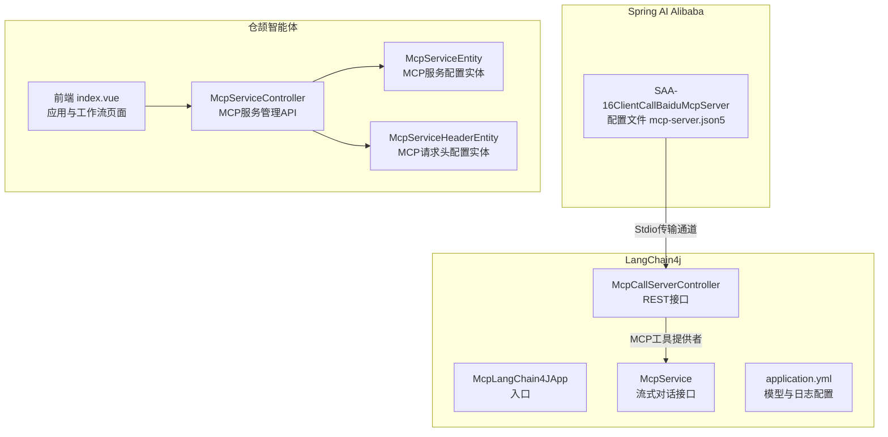
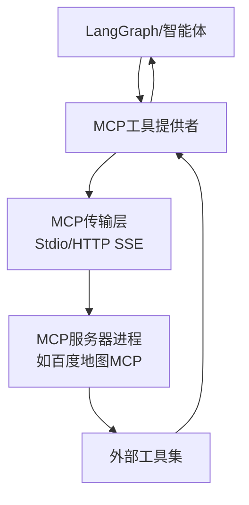
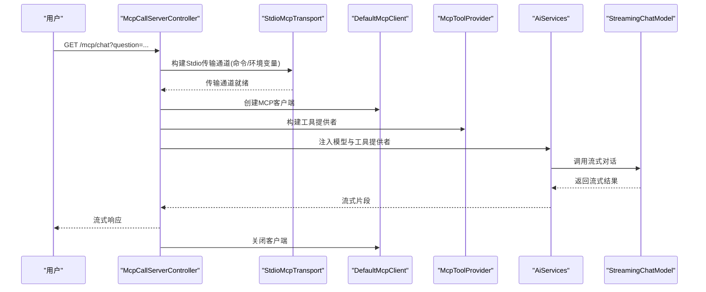
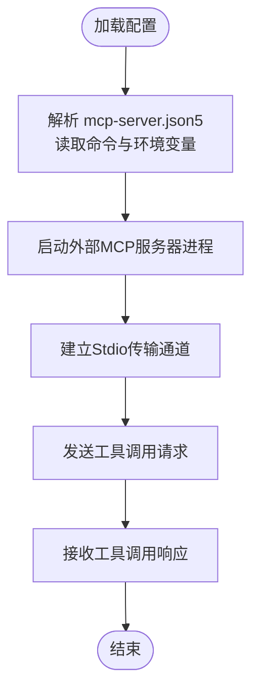
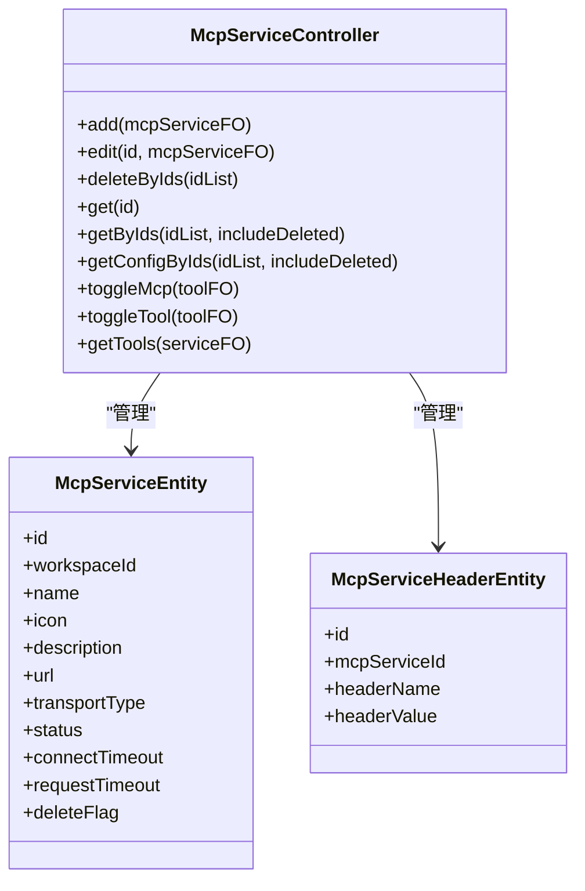
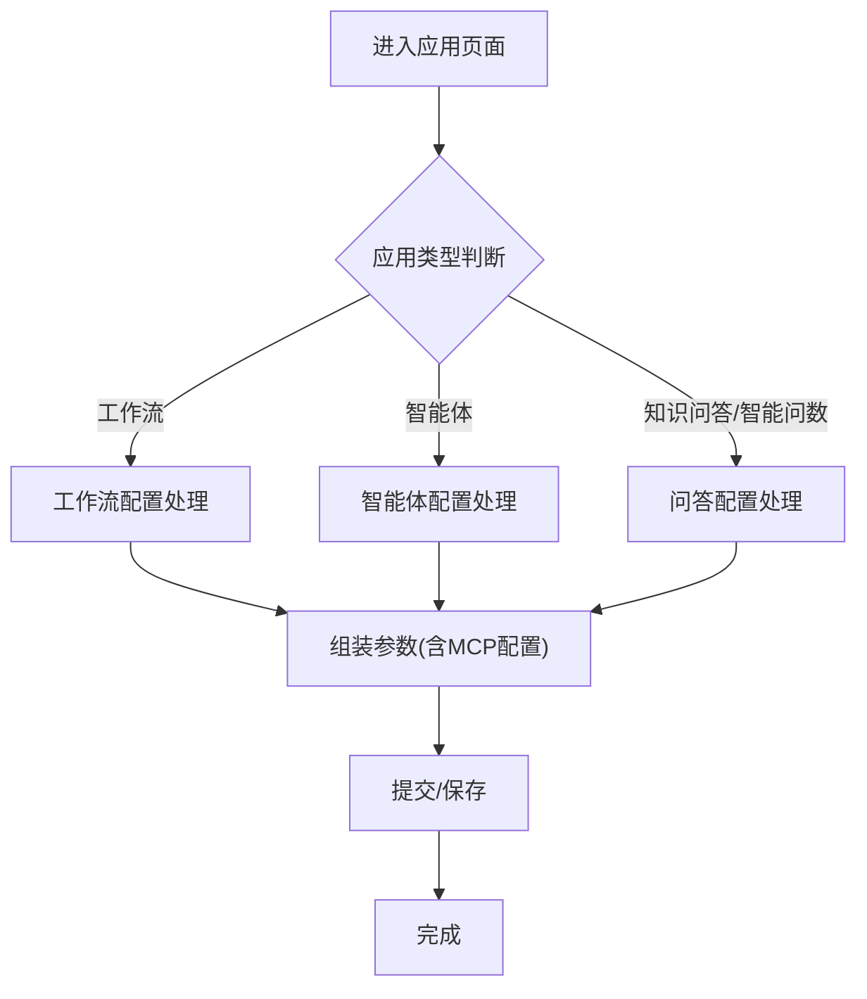
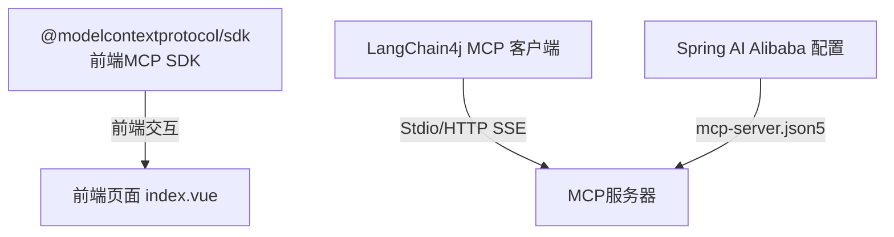

# LangGraph与MCP集成

<cite>
**本文引用的文件**
- [McpLangChain4JApp.java](file://【2】langchain4j-atguiguV5/langchain4j-14chat-mcp/src/main/java/com/atguigu/study/McpLangChain4JApp.java)
- [McpCallServerController.java](file://【2】langchain4j-atguiguV5/langchain4j-14chat-mcp/src/main/java/com/atguigu/study/controller/McpCallServerController.java)
- [McpService.java](file://【2】langchain4j-atguiguV5/langchain4j-14chat-mcp/src/main/java/com/atguigu/study/service/McpService.java)
- [application.yml](file://【2】langchain4j-atguiguV5/langchain4j-14chat-mcp/src/main/resources/application.yml)
- [mcp-server.json5](file://【1】SpringAIAlibaba-atguiguV1/SAA-16ClientCallBaiduMcpServer/src/main/resources/mcp-server.json5)
- [McpServiceController.java](file://【3】工作资料/code/仓颉智能体/nlp-agent/agent-builder/agent-build-core/src/main/java/com/yundingtech/agent/build/modules/tool/mcp/controller/McpServiceController.java)
- [McpServiceEntity.java](file://【3】工作资料/code/仓颉智能体/nlp-agent/agent-builder/agent-build-core/src/main/java/com/yundingtech/agent/build/modules/tool/mcp/entity/McpServiceEntity.java)
- [McpServiceHeaderEntity.java](file://【3】工作资料/code/仓颉智能体/nlp-agent/agent-builder/agent-build-core/src/main/java/com/yundingtech/agent/build/modules/tool/mcp/entity/McpServiceHeaderEntity.java)
- [pnpm-lock.yaml](file://【3】工作资料/code/仓颉智能体/nlp-frontend-web/pnpm-lock.yaml)
- [index.vue](file://【3】工作资料/code/仓颉智能体/nlp-frontend-web/src/views/workspace/pages/workApps/index.vue)
- [index.vue](file://【3】工作资料/code/仓颉智能体/nlp-frontend-web/src/views/workspace/pages/workApps/pages/index.vue)
</cite>

## 目录
1. [引言](#引言)
2. [项目结构](#项目结构)
3. [核心组件](#核心组件)
4. [架构总览](#架构总览)
5. [详细组件分析](#详细组件分析)
6. [依赖分析](#依赖分析)
7. [性能考虑](#性能考虑)
8. [故障排查指南](#故障排查指南)
9. [结论](#结论)
10. [附录](#附录)

## 引言
本技术文档围绕LangGraph与MCP（Model Context Protocol）的集成展开，系统阐述MCP协议的基本概念、工作原理与通信机制，以及LangGraph如何借助MCP实现外部工具调用与能力扩展。文档结合Spring AI Alibaba与LangChain4j的实际工程实践，给出MCP服务器与客户端的配置方法、服务发现与认证授权思路、通信协议要点，并提供完整的集成示例与最佳实践，覆盖安全性、性能优化与故障处理策略。

## 项目结构
本仓库包含三类与MCP集成密切相关的工程：
- Spring AI Alibaba系列：演示MCP客户端调用外部MCP服务器（如百度地图MCP服务器），并通过Stdio传输通道建立连接。
- LangChain4j系列：展示如何在LangChain4j中通过MCP工具提供者对接MCP服务器，实现函数式工具调用与流式对话。
- 仓颉智能体（工作资料）：提供MCP服务管理的后端控制器与实体模型，支撑在复杂应用场景中对MCP工具的统一配置与治理。

**图表来源**
- [McpLangChain4JApp.java:1-19](file://【2】langchain4j-atguiguV5/langchain4j-14chat-mcp/src/main/java/com/atguigu/study/McpLangChain4JApp.java#L1-L19)
- [McpCallServerController.java:1-89](file://【2】langchain4j-atguiguV5/langchain4j-14chat-mcp/src/main/java/com/atguigu/study/controller/McpCallServerController.java#L1-L89)
- [McpService.java:1-14](file://【2】langchain4j-atguiguV5/langchain4j-14chat-mcp/src/main/java/com/atguigu/study/service/McpService.java#L1-L14)
- [application.yml:1-27](file://【2】langchain4j-atguiguV5/langchain4j-14chat-mcp/src/main/resources/application.yml#L1-L27)
- [mcp-server.json5:1-23](file://【1】SpringAIAlibaba-atguiguV1/SAA-16ClientCallBaiduMcpServer/src/main/resources/mcp-server.json5#L1-L23)
- [McpServiceController.java:1-174](file://【3】工作资料/code/仓颉智能体/nlp-agent/agent-builder/agent-build-core/src/main/java/com/yundingtech/agent/build/modules/tool/mcp/controller/McpServiceController.java#L1-L174)
- [McpServiceEntity.java:1-67](file://【3】工作资料/code/仓颉智能体/nlp-agent/agent-builder/agent-build-core/src/main/java/com/yundingtech/agent/build/modules/tool/mcp/entity/McpServiceEntity.java#L1-L67)
- [McpServiceHeaderEntity.java:1-37](file://【3】工作资料/code/仓颉智能体/nlp-agent/agent-builder/agent-build-core/src/main/java/com/yundingtech/agent/build/modules/tool/mcp/entity/McpServiceHeaderEntity.java#L1-L37)
- [index.vue:154-188](file://【3】工作资料/code/仓颉智能体/nlp-frontend-web/src/views/workspace/pages/workApps/index.vue#L154-L188)
- [index.vue:249-422](file://【3】工作资料/code/仓颉智能体/nlp-frontend-web/src/views/workspace/pages/workApps/pages/index.vue#L249-L422)

**章节来源**
- [McpLangChain4JApp.java:1-19](file://【2】langchain4j-atguiguV5/langchain4j-14chat-mcp/src/main/java/com/atguigu/study/McpLangChain4JApp.java#L1-L19)
- [McpCallServerController.java:1-89](file://【2】langchain4j-atguiguV5/langchain4j-14chat-mcp/src/main/java/com/atguigu/study/controller/McpCallServerController.java#L1-L89)
- [McpService.java:1-14](file://【2】langchain4j-atguiguV5/langchain4j-14chat-mcp/src/main/java/com/atguigu/study/service/McpService.java#L1-L14)
- [application.yml:1-27](file://【2】langchain4j-atguiguV5/langchain4j-14chat-mcp/src/main/resources/application.yml#L1-L27)
- [mcp-server.json5:1-23](file://【1】SpringAIAlibaba-atguiguV1/SAA-16ClientCallBaiduMcpServer/src/main/resources/mcp-server.json5#L1-L23)
- [McpServiceController.java:1-174](file://【3】工作资料/code/仓颉智能体/nlp-agent/agent-builder/agent-build-core/src/main/java/com/yundingtech/agent/build/modules/tool/mcp/controller/McpServiceController.java#L1-L174)
- [McpServiceEntity.java:1-67](file://【3】工作资料/code/仓颉智能体/nlp-agent/agent-builder/agent-build-core/src/main/java/com/yundingtech/agent/build/modules/tool/mcp/entity/McpServiceEntity.java#L1-L67)
- [McpServiceHeaderEntity.java:1-37](file://【3】工作资料/code/仓颉智能体/nlp-agent/agent-builder/agent-build-core/src/main/java/com/yundingtech/agent/build/modules/tool/mcp/entity/McpServiceHeaderEntity.java#L1-L37)
- [pnpm-lock.yaml:11617-11633](file://【3】工作资料/code/仓颉智能体/nlp-frontend-web/pnpm-lock.yaml#L11617-L11633)
- [index.vue:154-188](file://【3】工作资料/code/仓颉智能体/nlp-frontend-web/src/views/workspace/pages/workApps/index.vue#L154-L188)
- [index.vue:249-422](file://【3】工作资料/code/仓颉智能体/nlp-frontend-web/src/views/workspace/pages/workApps/pages/index.vue#L249-L422)

## 核心组件
- LangChain4j MCP客户端与工具提供者：通过Stdio传输通道启动外部MCP服务器进程，构建MCP客户端并注册工具提供者，最终由AiServices将工具注入到流式对话模型中。
- Spring AI Alibaba MCP客户端：以配置文件形式声明MCP服务器命令与环境变量，实现服务发现与启动。
- 仓颉智能体MCP服务管理：提供MCP服务与请求头的增删改查、启用/禁用、批量获取工具等接口，支撑复杂场景下的统一治理。

**章节来源**
- [McpCallServerController.java:43-86](file://【2】langchain4j-atguiguV5/langchain4j-14chat-mcp/src/main/java/com/atguigu/study/controller/McpCallServerController.java#L43-L86)
- [mcp-server.json5:1-23](file://【1】SpringAIAlibaba-atguiguV1/SAA-16ClientCallBaiduMcpServer/src/main/resources/mcp-server.json5#L1-L23)
- [McpServiceController.java:55-172](file://【3】工作资料/code/仓颉智能体/nlp-agent/agent-builder/agent-build-core/src/main/java/com/yundingtech/agent/build/modules/tool/mcp/controller/McpServiceController.java#L55-L172)

## 架构总览
LangGraph与MCP的集成可抽象为三层：
- 协议层：基于MCP协议的工具描述与调用约定，确保客户端与服务器之间的语义一致。
- 传输层：支持Stdio、HTTP SSE等多种传输方式；本仓库重点体现Stdio与HTTP两种模式。
- 应用层：LangChain4j通过MCP工具提供者将外部工具注入到智能体对话流程中，Spring AI Alibaba通过配置文件实现服务发现与启动。

**图表来源**
- [McpCallServerController.java:55-77](file://【2】langchain4j-atguiguV5/langchain4j-14chat-mcp/src/main/java/com/atguigu/study/controller/McpCallServerController.java#L55-L77)
- [mcp-server.json5:4-11](file://【1】SpringAIAlibaba-atguiguV1/SAA-16ClientCallBaiduMcpServer/src/main/resources/mcp-server.json5#L4-L11)

## 详细组件分析

### 组件A：LangChain4j MCP集成（McpCallServerController）
该组件负责：
- 构建Stdio传输通道，启动外部MCP服务器进程（如百度地图MCP服务器），并设置环境变量（如API密钥）。
- 创建MCP客户端与工具提供者，将工具集注入到AiServices中。
- 通过流式对话接口发起用户问题，触发工具调用与响应流式输出。

**图表来源**
- [McpCallServerController.java:43-86](file://【2】langchain4j-atguiguV5/langchain4j-14chat-mcp/src/main/java/com/atguigu/study/controller/McpCallServerController.java#L43-L86)

**章节来源**
- [McpCallServerController.java:43-86](file://【2】langchain4j-atguiguV5/langchain4j-14chat-mcp/src/main/java/com/atguigu/study/controller/McpCallServerController.java#L43-L86)
- [McpService.java:10-13](file://【2】langchain4j-atguiguV5/langchain4j-14chat-mcp/src/main/java/com/atguigu/study/service/McpService.java#L10-L13)
- [application.yml:13-27](file://【2】langchain4j-atguiguV5/langchain4j-14chat-mcp/src/main/resources/application.yml#L13-L27)

### 组件B：Spring AI Alibaba MCP客户端（mcp-server.json5）
该组件负责：
- 在配置文件中声明MCP服务器的启动命令、参数与环境变量，实现服务发现与自动启动。
- 通过Stdio传输通道与MCP服务器交互，完成工具调用与结果返回。

**图表来源**
- [mcp-server.json5:1-23](file://【1】SpringAIAlibaba-atguiguV1/SAA-16ClientCallBaiduMcpServer/src/main/resources/mcp-server.json5#L1-L23)

**章节来源**
- [mcp-server.json5:1-23](file://【1】SpringAIAlibaba-atguiguV1/SAA-16ClientCallBaiduMcpServer/src/main/resources/mcp-server.json5#L1-L23)

### 组件C：仓颉智能体MCP服务管理（McpServiceController）
该组件负责：
- 提供MCP服务的增删改查、批量查询与启用/禁用工具的能力。
- 支持从请求体中提取MCP配置与请求头，动态校验并获取可用工具列表。
- 与前端应用联动，支撑工作流与智能体场景中的MCP工具治理。

**图表来源**
- [McpServiceController.java:35-172](file://【3】工作资料/code/仓颉智能体/nlp-agent/agent-builder/agent-build-core/src/main/java/com/yundingtech/agent/build/modules/tool/mcp/controller/McpServiceController.java#L35-L172)
- [McpServiceEntity.java:20-66](file://【3】工作资料/code/仓颉智能体/nlp-agent/agent-builder/agent-build-core/src/main/java/com/yundingtech/agent/build/modules/tool/mcp/entity/McpServiceEntity.java#L20-L66)
- [McpServiceHeaderEntity.java:20-36](file://【3】工作资料/code/仓颉智能体/nlp-agent/agent-builder/agent-build-core/src/main/java/com/yundingtech/agent/build/modules/tool/mcp/entity/McpServiceHeaderEntity.java#L20-L36)

**章节来源**
- [McpServiceController.java:55-172](file://【3】工作资料/code/仓颉智能体/nlp-agent/agent-builder/agent-build-core/src/main/java/com/yundingtech/agent/build/modules/tool/mcp/controller/McpServiceController.java#L55-L172)
- [McpServiceEntity.java:20-66](file://【3】工作资料/code/仓颉智能体/nlp-agent/agent-builder/agent-build-core/src/main/java/com/yundingtech/agent/build/modules/tool/mcp/entity/McpServiceEntity.java#L20-L66)
- [McpServiceHeaderEntity.java:20-36](file://【3】工作资料/code/仓颉智能体/nlp-agent/agent-builder/agent-build-core/src/main/java/com/yundingtech/agent/build/modules/tool/mcp/entity/McpServiceHeaderEntity.java#L20-L36)

### 组件D：前端应用与MCP集成（index.vue）
前端页面展示了应用类型与工作流配置的处理逻辑，其中包含对MCP配置的传递与渲染，体现了MCP在复杂业务场景中的集成位置。

**图表来源**
- [index.vue:154-188](file://【3】工作资料/code/仓颉智能体/nlp-frontend-web/src/views/workspace/pages/workApps/index.vue#L154-L188)
- [index.vue:249-422](file://【3】工作资料/code/仓颉智能体/nlp-frontend-web/src/views/workspace/pages/workApps/pages/index.vue#L249-L422)

**章节来源**
- [index.vue:154-188](file://【3】工作资料/code/仓颉智能体/nlp-frontend-web/src/views/workspace/pages/workApps/index.vue#L154-L188)
- [index.vue:249-422](file://【3】工作资料/code/仓颉智能体/nlp-frontend-web/src/views/workspace/pages/workApps/pages/index.vue#L249-L422)

## 依赖分析
- 前端依赖：项目锁文件中包含MCP SDK依赖，表明前端侧具备MCP协议交互能力的基础。
- 后端依赖：LangChain4j与MCP工具提供者、传输层组件共同构成MCP客户端栈；Spring AI Alibaba通过配置文件驱动MCP服务器进程。

**图表来源**
- [pnpm-lock.yaml:11617-11633](file://【3】工作资料/code/仓颉智能体/nlp-frontend-web/pnpm-lock.yaml#L11617-L11633)
- [McpCallServerController.java:55-77](file://【2】langchain4j-atguiguV5/langchain4j-14chat-mcp/src/main/java/com/atguigu/study/controller/McpCallServerController.java#L55-L77)
- [mcp-server.json5:1-23](file://【1】SpringAIAlibaba-atguiguV1/SAA-16ClientCallBaiduMcpServer/src/main/resources/mcp-server.json5#L1-L23)

**章节来源**
- [pnpm-lock.yaml:11617-11633](file://【3】工作资料/code/仓颉智能体/nlp-frontend-web/pnpm-lock.yaml#L11617-L11633)
- [McpCallServerController.java:55-77](file://【2】langchain4j-atguiguV5/langchain4j-14chat-mcp/src/main/java/com/atguigu/study/controller/McpCallServerController.java#L55-L77)
- [mcp-server.json5:1-23](file://【1】SpringAIAlibaba-atguiguV1/SAA-16ClientCallBaiduMcpServer/src/main/resources/mcp-server.json5#L1-L23)

## 性能考虑
- 传输通道选择：Stdio适合本地或容器内进程间通信，延迟低但受限于进程生命周期；HTTP SSE适合跨网络与多实例部署，需关注连接复用与背压处理。
- 工具缓存与预热：对常用工具进行预热与缓存，减少首次调用开销；合理设置连接与请求超时，避免阻塞主流程。
- 流式输出：优先采用流式响应，提升用户体验；对流式片段进行聚合与去抖，平衡实时性与稳定性。
- 并发与资源池：限制并发调用数量，避免MCP服务器过载；对客户端连接进行复用与回收。

## 故障排查指南
- 进程启动失败：检查命令与参数是否正确，确认环境变量（如API密钥）已正确注入。
- 传输通道异常：验证Stdio/HTTP SSE通道连通性，查看日志中的错误堆栈与状态码。
- 工具不可用：通过“校验MCP并获取工具”接口确认工具列表与权限配置，核对请求头与鉴权信息。
- 超时与重试：根据业务特性设置合理的连接与请求超时，必要时引入指数退避重试策略。
- 日志定位：开启DEBUG级别日志，结合应用配置文件中的日志开关进行问题定位。

**章节来源**
- [McpCallServerController.java:55-86](file://【2】langchain4j-atguiguV5/langchain4j-14chat-mcp/src/main/java/com/atguigu/study/controller/McpCallServerController.java#L55-L86)
- [application.yml:24-27](file://【2】langchain4j-atguiguV5/langchain4j-14chat-mcp/src/main/resources/application.yml#L24-L27)
- [McpServiceController.java:160-172](file://【3】工作资料/code/仓颉智能体/nlp-agent/agent-builder/agent-build-core/src/main/java/com/yundingtech/agent/build/modules/tool/mcp/controller/McpServiceController.java#L160-L172)

## 结论
LangGraph与MCP的集成通过明确的协议与传输层抽象，实现了外部工具的即插即用与能力扩展。LangChain4j与Spring AI Alibaba分别代表了不同层次的实现方式：前者强调在智能体对话流程中无缝注入工具，后者强调通过配置文件实现服务发现与启动。结合仓颉智能体的MCP服务管理能力，可在复杂应用场景中实现统一的工具治理与运行时控制，从而提升系统的可维护性与可扩展性。

## 附录
- 集成示例路径参考：
  - LangChain4j MCP集成入口：[McpLangChain4JApp.java:1-19](file://【2】langchain4j-atguiguV5/langchain4j-14chat-mcp/src/main/java/com/atguigu/study/McpLangChain4JApp.java#L1-L19)
  - LangChain4j MCP调用控制器：[McpCallServerController.java:1-89](file://【2】langchain4j-atguiguV5/langchain4j-14chat-mcp/src/main/java/com/atguigu/study/controller/McpCallServerController.java#L1-L89)
  - Spring AI Alibaba MCP配置：[mcp-server.json5:1-23](file://【1】SpringAIAlibaba-atguiguV1/SAA-16ClientCallBaiduMcpServer/src/main/resources/mcp-server.json5#L1-L23)
  - 仓颉智能体MCP服务管理：[McpServiceController.java:1-174](file://【3】工作资料/code/仓颉智能体/nlp-agent/agent-builder/agent-build-core/src/main/java/com/yundingtech/agent/build/modules/tool/mcp/controller/McpServiceController.java#L1-L174)