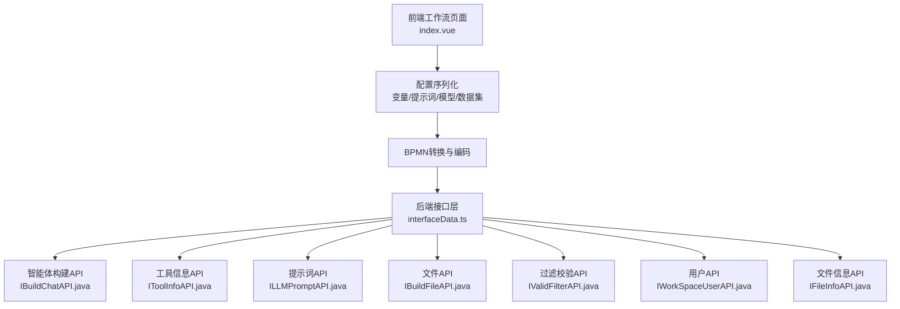
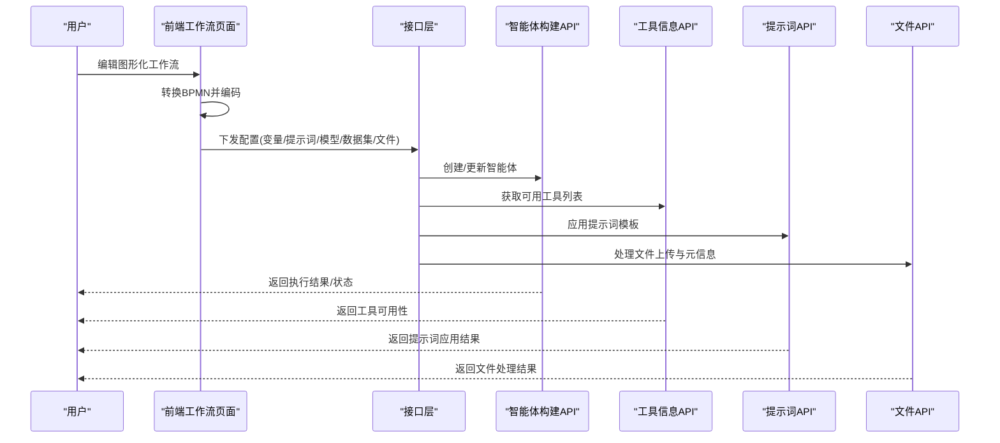
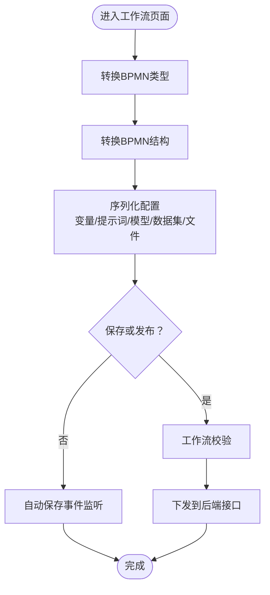
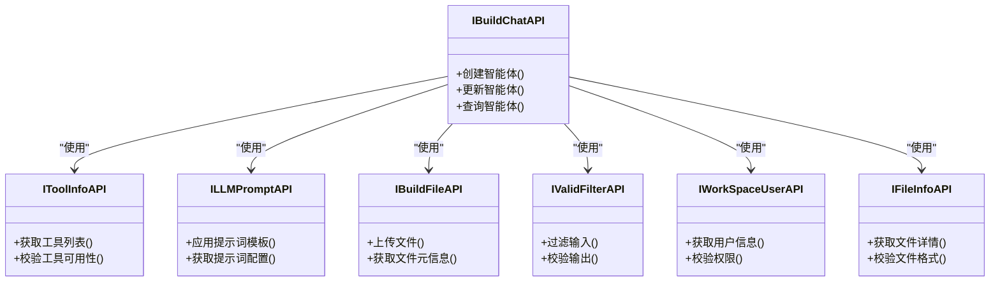
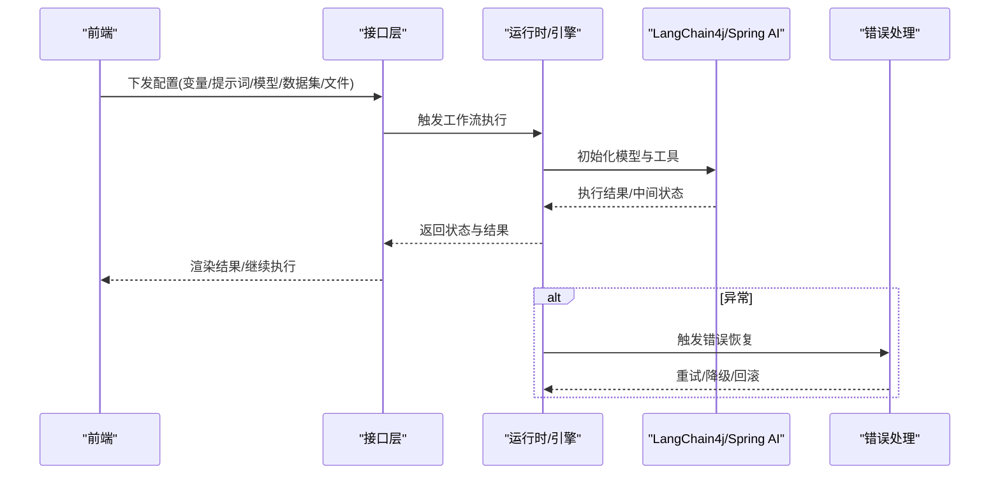
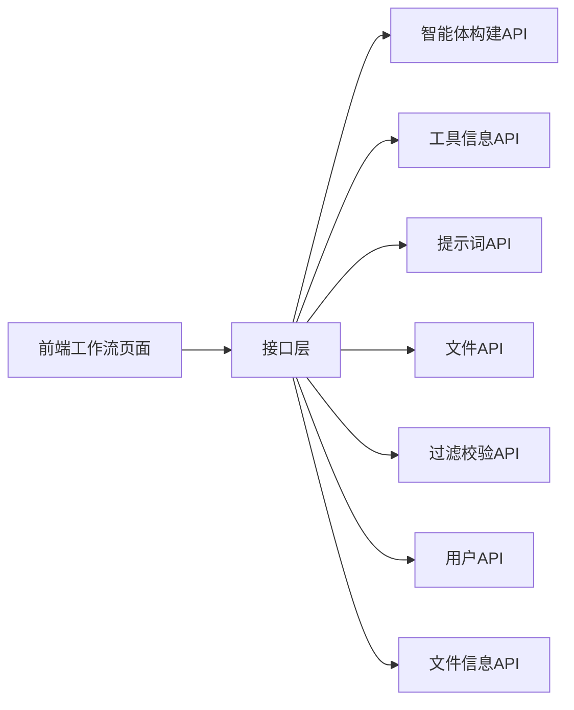

# LangGraph全家桶使用

<cite>
**本文引用的文件**
- [index.vue](file://【3】工作资料/code/仓颉智能体/nlp-frontend-web/src/views/workspace/pages/workApps/pages/index.vue)
- [index.vue](file://【3】工作资料/code/仓颉智能体/nlp-frontend-web/src/views/workspace/pages/workApps/index.vue)
- [interfaceData.ts](file://【3】工作资料/code/仓颉智能体/nlp-frontend-web/src/views/workspace/interfaceData.ts)
- [README.md](file://【3】工作资料/code/仓颉智能体/nlp-agent/README.md)
- [IBuildChatAPI.java](file://【3】工作资料/code/仓颉智能体/nlp-agent/agent-builder/agent-build-api-cloud/src/main/java/com/yundingtech/agent/build/api/IBuildChatAPI.java)
- [IBuildFileAPI.java](file://【3】工作资料/code/仓颉智能体/nlp-agent/agent-builder/agent-build-api-cloud/src/main/java/com/yundingtech/agent/build/api/IBuildFileAPI.java)
- [IFileInfoAPI.java](file://【3】工作资料/code/仓颉智能体/nlp-agent/agent-builder/agent-build-api-cloud/src/main/java/com/yundingtech/agent/build/api/IFileInfoAPI.java)
- [ILLMPromptAPI.java](file://【3】工作资料/code/仓颉智能体/nlp-agent/agent-builder/agent-build-api-cloud/src/main/java/com/yundingtech/agent/build/api/ILLMPromptAPI.java)
- [IToolInfoAPI.java](file://【3】工作资料/code/仓颉智能体/nlp-agent/agent-builder/agent-build-api-cloud/src/main/java/com/yundingtech/agent/build/api/IToolInfoAPI.java)
- [IValidFilterAPI.java](file://【3】工作资料/code/仓颉智能体/nlp-agent/agent-builder/agent-build-api-cloud/src/main/java/com/yundingtech/agent/build/api/IValidFilterAPI.java)
- [IWorkSpaceUserAPI.java](file://【3】工作资料/code/仓颉智能体/nlp-agent/agent-builder/agent-build-api-cloud/src/main/java/com/yundingtech/agent/build/api/IWorkSpaceUserAPI.java)
</cite>

## 目录
1. [引言](#引言)
2. [项目结构](#项目结构)
3. [核心组件](#核心组件)
4. [架构总览](#架构总览)
5. [详细组件分析](#详细组件分析)
6. [依赖分析](#依赖分析)
7. [性能考虑](#性能考虑)
8. [故障排查指南](#故障排查指南)
9. [结论](#结论)
10. [附录](#附录)

## 引言
本指南围绕“LangGraph全家桶”能力，结合仓库中的智能体与工作流相关实现，系统讲解状态管理、条件分支、并行处理、错误恢复等核心特性，并给出在Spring AI Alibaba与LangChain4j项目中的落地建议与最佳实践。文中所有技术细节均基于仓库现有源码进行归纳与可视化呈现，帮助读者快速理解并组合使用LangGraph能力，构建复杂智能体应用。

## 项目结构
本仓库包含前后端协同的智能体与工作流平台，前端负责图形化编排与配置下发，后端提供智能体构建与工具调用接口。与LangGraph直接相关的关键位置如下：
- 前端工作流编排页面：负责将图形化配置转换为可执行的工作流描述（如BPMN），并下发到后端或运行时引擎。
- 智能体平台后端：提供智能体构建、提示词、文件、工具、过滤校验、用户等API接口，支撑LangGraph工作流与智能体的组合使用。

**图表来源**
- [index.vue:226-251](file://【3】工作资料/code/仓颉智能体/nlp-frontend-web/src/views/workspace/pages/workApps/pages/index.vue#L226-L251)
- [index.vue:255-261](file://【3】工作资料/code/仓颉智能体/nlp-frontend-web/src/views/workspace/pages/workApps/pages/index.vue#L255-L261)
- [interfaceData.ts:7-22](file://【3】工作资料/code/仓颉智能体/nlp-frontend-web/src/views/workspace/interfaceData.ts#L7-L22)
- [IBuildChatAPI.java](file://【3】工作资料/code/仓颉智能体/nlp-agent/agent-builder/agent-build-api-cloud/src/main/java/com/yundingtech/agent/build/api/IBuildChatAPI.java)
- [IToolInfoAPI.java](file://【3】工作资料/code/仓颉智能体/nlp-agent/agent-builder/agent-build-api-cloud/src/main/java/com/yundingtech/agent/build/api/IToolInfoAPI.java)
- [ILLMPromptAPI.java](file://【3】工作资料/code/仓颉智能体/nlp-agent/agent-builder/agent-build-api-cloud/src/main/java/com/yundingtech/agent/build/api/ILLMPromptAPI.java)
- [IBuildFileAPI.java](file://【3】工作资料/code/仓颉智能体/nlp-agent/agent-builder/agent-build-api-cloud/src/main/java/com/yundingtech/agent/build/api/IBuildFileAPI.java)
- [IValidFilterAPI.java](file://【3】工作资料/code/仓颉智能体/nlp-agent/agent-builder/agent-build-api-cloud/src/main/java/com/yundingtech/agent/build/api/IValidFilterAPI.java)
- [IWorkSpaceUserAPI.java](file://【3】工作资料/code/仓颉智能体/nlp-agent/agent-builder/agent-build-api-cloud/src/main/java/com/yundingtech/agent/build/api/IWorkSpaceUserAPI.java)
- [IFileInfoAPI.java](file://【3】工作资料/code/仓颉智能体/nlp-agent/agent-builder/agent-build-api-cloud/src/main/java/com/yundingtech/agent/build/api/IFileInfoAPI.java)

**章节来源**
- [index.vue:226-251](file://【3】工作资料/code/仓颉智能体/nlp-frontend-web/src/views/workspace/pages/workApps/pages/index.vue#L226-L251)
- [index.vue:255-261](file://【3】工作资料/code/仓颉智能体/nlp-frontend-web/src/views/workspace/pages/workApps/pages/index.vue#L255-L261)
- [interfaceData.ts:7-22](file://【3】工作资料/code/仓颉智能体/nlp-frontend-web/src/views/workspace/interfaceData.ts#L7-L22)

## 核心组件
- 前端工作流页面：负责将图形化节点与连线转换为可执行配置，生成BPMN并进行编码，随后通过接口下发到后端。
- 后端智能体构建API：提供智能体构建、提示词管理、文件处理、工具信息、过滤校验、用户与文件信息等接口，支撑LangGraph工作流与智能体的组合使用。
- 配置序列化与下发：将变量、提示词、模型、数据集、文件上传、开场白、建议问题等配置序列化后传入后端，供运行时使用。

**章节来源**
- [index.vue:226-251](file://【3】工作资料/code/仓颉智能体/nlp-frontend-web/src/views/workspace/pages/workApps/pages/index.vue#L226-L251)
- [index.vue](file://【3】工作资料/code/仓颉智能体/nlp-agent/agent-builder/agent-build-api-cloud/src/main/java/com/yundingtech/agent/build/api/IBuildChatAPI.java)
- [index.vue:255-261](file://【3】工作资料/code/仓颉智能体/nlp-frontend-web/src/views/workspace/pages/workApps/pages/index.vue#L255-L261)

## 架构总览
下图展示了从前端图形化配置到后端智能体构建与工具调用的整体流程，体现LangGraph在工作流与智能体中的组合使用方式。

**图表来源**
- [index.vue:226-251](file://【3】工作资料/code/仓颉智能体/nlp-frontend-web/src/views/workspace/pages/workApps/pages/index.vue#L226-L251)
- [interfaceData.ts:7-22](file://【3】工作资料/code/仓颉智能体/nlp-frontend-web/src/views/workspace/interfaceData.ts#L7-L22)
- [IBuildChatAPI.java](file://【3】工作资料/code/仓颉智能体/nlp-agent/agent-builder/agent-build-api-cloud/src/main/java/com/yundingtech/agent/build/api/IBuildChatAPI.java)
- [IToolInfoAPI.java](file://【3】工作资料/code/仓颉智能体/nlp-agent/agent-builder/agent-build-api-cloud/src/main/java/com/yundingtech/agent/build/api/IToolInfoAPI.java)
- [ILLMPromptAPI.java](file://【3】工作资料/code/仓颉智能体/nlp-agent/agent-builder/agent-build-api-cloud/src/main/java/com/yundingtech/agent/build/api/ILLMPromptAPI.java)
- [IBuildFileAPI.java](file://【3】工作资料/code/仓颉智能体/nlp-agent/agent-builder/agent-build-api-cloud/src/main/java/com/yundingtech/agent/build/api/IBuildFileAPI.java)

## 详细组件分析

### 组件A：前端工作流页面（状态管理与配置序列化）
该组件负责：
- 将图形化节点转换为可执行配置；
- 生成BPMN并进行编码；
- 序列化变量、提示词、模型、数据集、文件上传、开场白、建议问题等；
- 在保存/发布时进行工作流校验与下发。

**图表来源**
- [index.vue:226-251](file://【3】工作资料/code/仓颉智能体/nlp-frontend-web/src/views/workspace/pages/workApps/pages/index.vue#L226-L251)
- [index.vue:255-261](file://【3】工作资料/code/仓颉智能体/nlp-frontend-web/src/views/workspace/pages/workApps/pages/index.vue#L255-L261)

**章节来源**
- [index.vue:226-251](file://【3】工作资料/code/仓颉智能体/nlp-frontend-web/src/views/workspace/pages/workApps/pages/index.vue#L226-L251)
- [index.vue:255-261](file://【3】工作资料/code/仓颉智能体/nlp-frontend-web/src/views/workspace/pages/workApps/pages/index.vue#L255-L261)

### 组件B：后端智能体构建API（工具与提示词集成）
后端提供多类API以支撑LangGraph工作流与智能体：
- 智能体构建API：用于创建/更新智能体，承载提示词、工具、文件等配置。
- 工具信息API：提供可用工具列表，便于在工作流中动态选择与调用。
- 提示词API：提供提示词模板与应用逻辑，确保上下文与规则一致。
- 文件API：处理文件上传、元信息与后续处理。
- 过滤校验API：对输入/输出进行过滤与校验，保障流程稳定性。
- 用户与文件信息API：提供用户与文件相关信息，支撑权限与溯源。

**图表来源**
- [IBuildChatAPI.java](file://【3】工作资料/code/仓颉智能体/nlp-agent/agent-builder/agent-build-api-cloud/src/main/java/com/yundingtech/agent/build/api/IBuildChatAPI.java)
- [IToolInfoAPI.java](file://【3】工作资料/code/仓颉智能体/nlp-agent/agent-builder/agent-build-api-cloud/src/main/java/com/yundingtech/agent/build/api/IToolInfoAPI.java)
- [ILLMPromptAPI.java](file://【3】工作资料/code/仓颉智能体/nlp-agent/agent-builder/agent-build-api-cloud/src/main/java/com/yundingtech/agent/build/api/ILLMPromptAPI.java)
- [IBuildFileAPI.java](file://【3】工作资料/code/仓颉智能体/nlp-agent/agent-builder/agent-build-api-cloud/src/main/java/com/yundingtech/agent/build/api/IBuildFileAPI.java)
- [IValidFilterAPI.java](file://【3】工作资料/code/仓颉智能体/nlp-agent/agent-builder/agent-build-api-cloud/src/main/java/com/yundingtech/agent/build/api/IValidFilterAPI.java)
- [IWorkSpaceUserAPI.java](file://【3】工作资料/code/仓颉智能体/nlp-agent/agent-builder/agent-build-api-cloud/src/main/java/com/yundingtech/agent/build/api/IWorkSpaceUserAPI.java)
- [IFileInfoAPI.java](file://【3】工作资料/code/仓颉智能体/nlp-agent/agent-builder/agent-build-api-cloud/src/main/java/com/yundingtech/agent/build/api/IFileInfoAPI.java)

**章节来源**
- [IBuildChatAPI.java](file://【3】工作资料/code/仓颉智能体/nlp-agent/agent-builder/agent-build-api-cloud/src/main/java/com/yundingtech/agent/build/api/IBuildChatAPI.java)
- [IToolInfoAPI.java](file://【3】工作资料/code/仓颉智能体/nlp-agent/agent-builder/agent-build-api-cloud/src/main/java/com/yundingtech/agent/build/api/IToolInfoAPI.java)
- [ILLMPromptAPI.java](file://【3】工作资料/code/仓颉智能体/nlp-agent/agent-builder/agent-build-api-cloud/src/main/java/com/yundingtech/agent/build/api/ILLMPromptAPI.java)
- [IBuildFileAPI.java](file://【3】工作资料/code/仓颉智能体/nlp-agent/agent-builder/agent-build-api-cloud/src/main/java/com/yundingtech/agent/build/api/IBuildFileAPI.java)
- [IValidFilterAPI.java](file://【3】工作资料/code/仓颉智能体/nlp-agent/agent-builder/agent-build-api-cloud/src/main/java/com/yundingtech/agent/build/api/IValidFilterAPI.java)
- [IWorkSpaceUserAPI.java](file://【3】工作资料/code/仓颉智能体/nlp-agent/agent-builder/agent-build-api-cloud/src/main/java/com/yundingtech/agent/build/api/IWorkSpaceUserAPI.java)
- [IFileInfoAPI.java](file://【3】工作资料/code/仓颉智能体/nlp-agent/agent-builder/agent-build-api-cloud/src/main/java/com/yundingtech/agent/build/api/IFileInfoAPI.java)

### 组件C：接口层与配置下发（与Spring AI Alibaba/LangChain4j对接）
接口层负责将前端序列化的配置传递到后端，支撑LangGraph工作流与智能体的运行时执行。结合Spring AI Alibaba与LangChain4j项目，可在此处注入模型参数、工具调用策略与错误恢复机制。

**图表来源**
- [interfaceData.ts:7-22](file://【3】工作资料/code/仓颉智能体/nlp-frontend-web/src/views/workspace/interfaceData.ts#L7-L22)
- [index.vue:226-251](file://【3】工作资料/code/仓颉智能体/nlp-frontend-web/src/views/workspace/pages/workApps/pages/index.vue#L226-L251)

**章节来源**
- [interfaceData.ts:7-22](file://【3】工作资料/code/仓颉智能体/nlp-frontend-web/src/views/workspace/interfaceData.ts#L7-L22)
- [index.vue:226-251](file://【3】工作资料/code/仓颉智能体/nlp-frontend-web/src/views/workspace/pages/workApps/pages/index.vue#L226-L251)

## 依赖分析
- 前端依赖后端接口层，接口层再依赖各类智能体构建与工具API。
- 智能体构建API与工具、提示词、文件、过滤校验、用户与文件信息API之间存在强耦合，共同构成LangGraph工作流与智能体的执行基础。
- 通过接口层统一调度，可实现状态管理、条件分支、并行处理与错误恢复的组合使用。

**图表来源**
- [index.vue:226-251](file://【3】工作资料/code/仓颉智能体/nlp-frontend-web/src/views/workspace/pages/workApps/pages/index.vue#L226-L251)
- [interfaceData.ts:7-22](file://【3】工作资料/code/仓颉智能体/nlp-frontend-web/src/views/workspace/interfaceData.ts#L7-L22)
- [IBuildChatAPI.java](file://【3】工作资料/code/仓颉智能体/nlp-agent/agent-builder/agent-build-api-cloud/src/main/java/com/yundingtech/agent/build/api/IBuildChatAPI.java)
- [IToolInfoAPI.java](file://【3】工作资料/code/仓颉智能体/nlp-agent/agent-builder/agent-build-api-cloud/src/main/java/com/yundingtech/agent/build/api/IToolInfoAPI.java)
- [ILLMPromptAPI.java](file://【3】工作资料/code/仓颉智能体/nlp-agent/agent-builder/agent-build-api-cloud/src/main/java/com/yundingtech/agent/build/api/ILLMPromptAPI.java)
- [IBuildFileAPI.java](file://【3】工作资料/code/仓颉智能体/nlp-agent/agent-builder/agent-build-api-cloud/src/main/java/com/yundingtech/agent/build/api/IBuildFileAPI.java)
- [IValidFilterAPI.java](file://【3】工作资料/code/仓颉智能体/nlp-agent/agent-builder/agent-build-api-cloud/src/main/java/com/yundingtech/agent/build/api/IValidFilterAPI.java)
- [IWorkSpaceUserAPI.java](file://【3】工作资料/code/仓颉智能体/nlp-agent/agent-builder/agent-build-api-cloud/src/main/java/com/yundingtech/agent/build/api/IWorkSpaceUserAPI.java)
- [IFileInfoAPI.java](file://【3】工作资料/code/仓颉智能体/nlp-agent/agent-builder/agent-build-api-cloud/src/main/java/com/yundingtech/agent/build/api/IFileInfoAPI.java)

**章节来源**
- [index.vue:226-251](file://【3】工作资料/code/仓颉智能体/nlp-frontend-web/src/views/workspace/pages/workApps/pages/index.vue#L226-L251)
- [interfaceData.ts:7-22](file://【3】工作资料/code/仓颉智能体/nlp-frontend-web/src/views/workspace/interfaceData.ts#L7-L22)

## 性能考虑
- 配置序列化与BPMN转换：尽量在前端进行增量转换与缓存，减少重复计算与网络传输。
- 接口层聚合：将多个API调用合并为一次请求，降低往返延迟。
- 工具与提示词预加载：在应用启动阶段预加载常用工具与提示词，提升首次执行速度。
- 并行处理：在LangGraph中合理拆分并行节点，避免热点资源竞争；对高耗时步骤设置超时与降级策略。
- 错误恢复：对网络抖动与模型异常设置指数退避与熔断策略，保障整体稳定性。

## 故障排查指南
- 配置下发失败：检查接口层是否正确序列化变量、提示词、模型、数据集与文件；确认BPMN转换与编码无误。
- 工具不可用：核对工具信息API返回的工具列表与权限；检查过滤校验API是否拦截了非法输入。
- 提示词异常：核对提示词API的应用逻辑与模板版本；确保提示词与模型参数匹配。
- 文件处理异常：检查文件API的上传与元信息获取流程；确认文件格式与大小限制。
- 运行时错误：启用错误恢复机制，记录重试次数与失败原因；必要时进行回滚或降级处理。

**章节来源**
- [index.vue:226-251](file://【3】工作资料/code/仓颉智能体/nlp-frontend-web/src/views/workspace/pages/workApps/pages/index.vue#L226-L251)
- [IToolInfoAPI.java](file://【3】工作资料/code/仓颉智能体/nlp-agent/agent-builder/agent-build-api-cloud/src/main/java/com/yundingtech/agent/build/api/IToolInfoAPI.java)
- [ILLMPromptAPI.java](file://【3】工作资料/code/仓颉智能体/nlp-agent/agent-builder/agent-build-api-cloud/src/main/java/com/yundingtech/agent/build/api/ILLMPromptAPI.java)
- [IBuildFileAPI.java](file://【3】工作资料/code/仓颉智能体/nlp-agent/agent-builder/agent-build-api-cloud/src/main/java/com/yundingtech/agent/build/api/IBuildFileAPI.java)
- [IValidFilterAPI.java](file://【3】工作资料/code/仓颉智能体/nlp-agent/agent-builder/agent-build-api-cloud/src/main/java/com/yundingtech/agent/build/api/IValidFilterAPI.java)

## 结论
通过前端工作流页面与后端智能体构建API的协同，LangGraph能够在工作流与智能体场景中实现状态管理、条件分支、并行处理与错误恢复的组合使用。结合Spring AI Alibaba与LangChain4j项目，可在接口层注入模型参数与工具调用策略，进一步提升系统的可扩展性与稳定性。建议在实际项目中遵循配置序列化、接口聚合、工具与提示词预加载、并行拆分与错误恢复的最佳实践，以获得更优的性能与可靠性。

## 附录
- 智能体平台说明与能力概览可参考平台README。
- 如需了解具体API定义，请参阅对应接口类文件。

**章节来源**
- [README.md](file://【3】工作资料/code/仓颉智能体/nlp-agent/README.md)