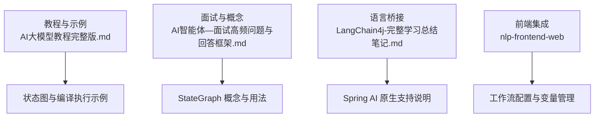
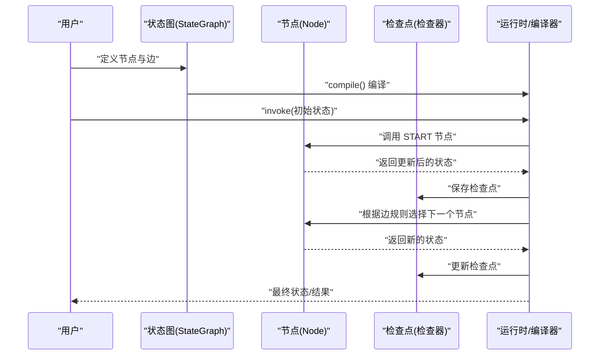
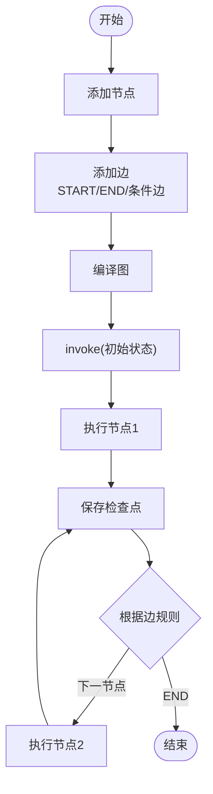
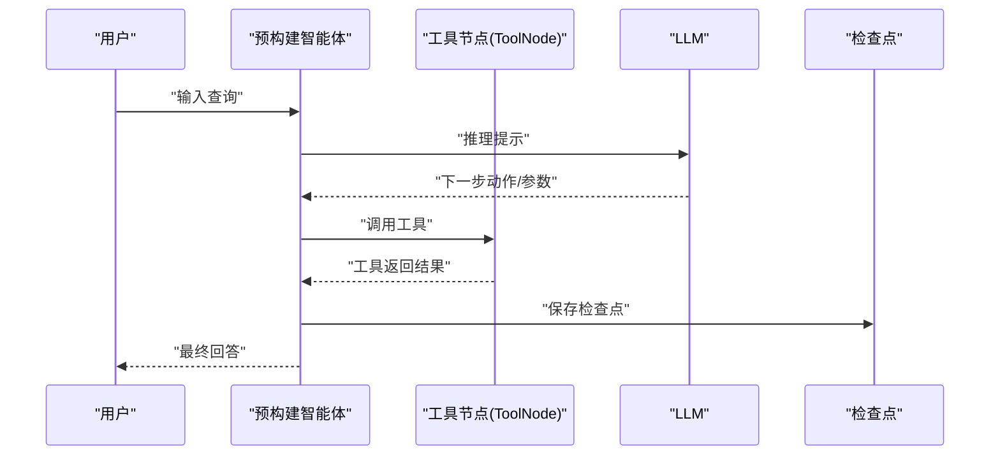
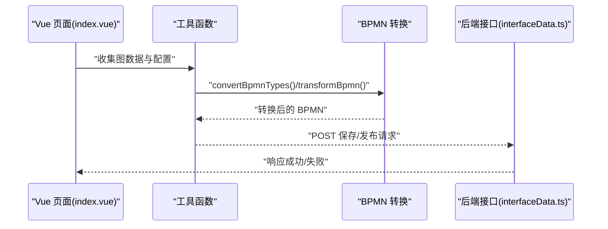
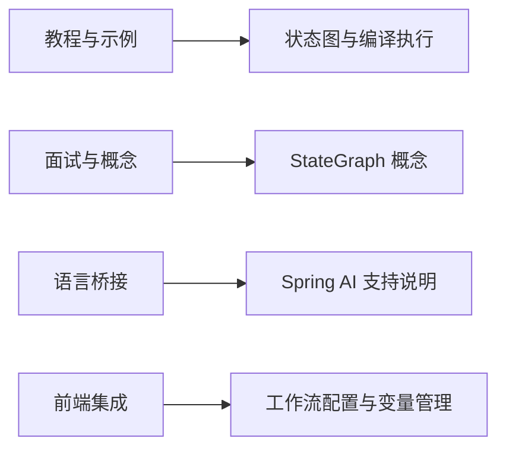

# LangGraph基础概念

<cite>
**本文引用的文件**
- [AI大模型教程完整版.md](file://【0】AI大模型教程（指导手册）/AI大模型教程完整版.md)
- [LangChain4j-完整学习总结笔记.md](file://4、LangChain4j-完整学习总结笔记.md)
- [AI智能体—面试高频问题与回答框架.md](file://7、AI智能体—面试高频问题与回答框架.md)
- [index.vue](file://【3】工作资料/code/仓颉智能体/nlp-frontend-web/src/views/workspace/pages/workApps/pages/index.vue)
- [interfaceData.ts](file://【3】工作资料/code/仓颉智能体/nlp-frontend-web/src/views/workspace/interfaceData.ts)
</cite>

## 目录
1. [引言](#引言)
2. [项目结构](#项目结构)
3. [核心组件](#核心组件)
4. [架构总览](#架构总览)
5. [详细组件分析](#详细组件分析)
6. [依赖分析](#依赖分析)
7. [性能考虑](#性能考虑)
8. [故障排查指南](#故障排查指南)
9. [结论](#结论)
10. [附录](#附录)

## 引言
LangGraph 是一个以“状态”为核心的图式执行引擎，它将智能体的工作流抽象为“状态图”，通过节点（Node）表示处理步骤，通过边（Edge）表达状态流转条件，从而实现可追踪、可中断、可持久化的多智能体协作。与传统静态图结构不同，LangGraph 的关键优势在于：
- 状态驱动：状态随时间演进，节点可读写状态，形成“状态图”
- 可中断与可恢复：通过检查点（checkpoint）保存中间状态，支持中断与恢复
- 可组合与可扩展：内置预构建智能体（如 ReAct），也支持自定义节点与边
- 可观测性：支持 trace、日志与可视化，便于调试与优化

LangGraph 在智能体应用中的独特价值体现在：将复杂的多步骤推理、工具调用、结果聚合等过程，统一建模为“状态图”，使流程清晰、可控且易于扩展。

## 项目结构
本仓库中与 LangGraph 相关的知识主要分布在以下位置：
- 教程与示例：AI大模型教程完整版.md 中包含大量 LangGraph 的 API 使用、状态图构建与编译执行示例
- 面试与概念：AI智能体—面试高频问题与回答框架.md 中对 StateGraph 的概念与典型用法进行了归纳
- 语言桥接：4、LangChain4j-完整学习总结笔记.md 中指出 Spring AI 原生对 StateGraph 的支持情况
- 前端集成：nlp-frontend-web 的页面与接口文件展示了工作流配置、变量与模型配置的前端交互

**章节来源**
- [AI大模型教程完整版.md](file://【0】AI大模型教程（指导手册）/AI大模型教程完整版.md)
- [AI智能体—面试高频问题与回答框架.md](file://7、AI智能体—面试高频问题与回答框架.md)
- [LangChain4j-完整学习总结笔记.md](file://4、LangChain4j-完整学习总结笔记.md)
- [index.vue](file://【3】工作资料/code/仓颉智能体/nlp-frontend-web/src/views/workspace/pages/workApps/pages/index.vue)
- [interfaceData.ts](file://【3】工作资料/code/仓颉智能体/nlp-frontend-web/src/views/workspace/interfaceData.ts)

## 核心组件
- 状态图（StateGraph）
  - 由节点与边构成的状态流转图，节点负责计算，边决定状态转移
  - 支持 START/END 节点，以及条件边（根据状态判断）
- 节点（Node）
  - 表示一个处理单元，接收当前状态并返回更新后的状态
  - 可以是任意可调用对象（函数或类实例），只要其签名符合状态输入/输出约定
- 边（Edge）
  - 连接两个节点，表达从一个节点到另一个节点的流转条件
  - 可以是直接边（固定下一节点）、条件边（根据状态分支）
- 检查点（Checkpoint）
  - 保存中间状态，支持中断与恢复，便于调试与容错
- 预构建智能体（Prebuilt Agents）
  - 如 create_react_agent，封装了 ReAct 推理与工具调用的常用模式

**章节来源**
- [AI大模型教程完整版.md](file://【0】AI大模型教程（指导手册）/AI大模型教程完整版.md)
- [AI智能体—面试高频问题与回答框架.md](file://7、AI智能体—面试高频问题与回答框架.md)

## 架构总览
LangGraph 的执行流程可概括为：构建状态图 → 编译图 → 初始化状态 → 执行图 → 持久化检查点 → 结束或继续。

**图示来源**
- [AI大模型教程完整版.md](file://【0】AI大模型教程（指导手册）/AI大模型教程完整版.md)

## 详细组件分析

### 状态图（StateGraph）与节点/边
- 定义与添加节点
  - 使用 add_node 将处理函数注册为节点
  - 节点名称需唯一，建议语义化命名
- 添加边
  - 使用 add_edge 连接节点；支持 START → 节点、节点 → 节点、节点 → END
  - 条件边可通过条件函数在运行时决定下一节点
- 编译与执行
  - compile() 生成可执行图
  - invoke(initial_state) 启动执行，传入初始状态
- 检查点
  - 通过检查点器（如 InMemorySaver）保存中间状态，便于恢复与调试

**章节来源**
- [AI大模型教程完整版.md](file://【0】AI大模型教程（指导手册）/AI大模型教程完整版.md)
- [AI智能体—面试高频问题与回答框架.md](file://7、AI智能体—面试高频问题与回答框架.md)

### 预构建智能体（ReAct 与工具调用）
- create_react_agent
  - 封装 ReAct 推理与工具调用的常用模式
  - 可与检查点器结合，实现可中断与可恢复的智能体
- ToolNode
  - 用于将工具调用封装为节点，便于在状态图中复用

**章节来源**
- [AI大模型教程完整版.md](file://【0】AI大模型教程（指导手册）/AI大模型教程完整版.md)

### 前端工作流配置与变量管理
前端页面通过接口与工具函数，将工作流配置、变量与模型配置序列化并提交到后端，同时支持 BPMN 转换与校验。

**图示来源**
- [index.vue](file://【3】工作资料/code/仓颉智能体/nlp-frontend-web/src/views/workspace/pages/workApps/pages/index.vue)
- [interfaceData.ts](file://【3】工作资料/code/仓颉智能体/nlp-frontend-web/src/views/workspace/interfaceData.ts)

**章节来源**
- [index.vue](file://【3】工作资料/code/仓颉智能体/nlp-frontend-web/src/views/workspace/pages/workApps/pages/index.vue)
- [interfaceData.ts](file://【3】工作资料/code/仓颉智能体/nlp-frontend-web/src/views/workspace/interfaceData.ts)

## 依赖分析
- 教程与示例对 LangGraph API 的使用提供了最直接的参考路径
- 面试框架对 StateGraph 的概念与用法进行了提炼
- 语言桥接笔记明确了 Spring AI 对 StateGraph 的支持现状
- 前端页面展示了工作流配置在工程中的落地方式

**章节来源**
- [AI大模型教程完整版.md](file://【0】AI大模型教程（指导手册）/AI大模型教程完整版.md)
- [AI智能体—面试高频问题与回答框架.md](file://7、AI智能体—面试高频问题与回答框架.md)
- [LangChain4j-完整学习总结笔记.md](file://4、LangChain4j-完整学习总结笔记.md)
- [index.vue](file://【3】工作资料/code/仓颉智能体/nlp-frontend-web/src/views/workspace/pages/workApps/pages/index.vue)

## 性能考虑
- 图规模与节点数量
  - 节点越多，状态图越复杂，执行开销越大
  - 建议拆分长流程为多个子图或阶段执行
- 检查点策略
  - 频繁保存检查点会带来 IO 开销，应根据场景权衡保存频率
- 工具调用与 LLM 调用
  - 工具调用与 LLM 调用通常为瓶颈，应尽量减少不必要的重复调用
- 并发与流水线
  - 对于独立节点，可考虑并发执行以提升吞吐

## 故障排查指南
- 编译错误
  - 检查节点是否已添加、边是否连接正确、START/END 是否存在
- 执行异常
  - 检查节点函数签名是否与状态结构匹配
  - 确认初始状态包含必要字段
- 检查点问题
  - 若恢复失败，确认检查点器配置一致，且状态结构未发生破坏性变更
- 前端配置问题
  - 确认 BPMN 转换与校验流程正常，变量与模型配置序列化正确

**章节来源**
- [AI大模型教程完整版.md](file://【0】AI大模型教程（指导手册）/AI大模型教程完整版.md)
- [index.vue](file://【3】工作资料/code/仓颉智能体/nlp-frontend-web/src/views/workspace/pages/workApps/pages/index.vue)

## 结论
LangGraph 通过“状态图”的形式，将智能体的多步骤推理、工具调用与结果聚合统一建模，具备可观测、可中断、可恢复的优势。结合教程中的示例与前端工程实践，初学者可以快速理解并上手构建简单到复杂的智能体流程。

## 附录
- 快速上手建议
  - 从最小状态图开始：定义 START、一个节点、END
  - 使用 compile() 编译并通过 invoke() 执行
  - 引入检查点器以支持恢复
  - 逐步引入条件边与工具调用
- 参考路径
  - 状态图与编译执行示例：[AI大模型教程完整版.md](file://【0】AI大模型教程（指导手册）/AI大模型教程完整版.md)
  - StateGraph 概念与用法：[AI智能体—面试高频问题与回答框架.md](file://7、AI智能体—面试高频问题与回答框架.md)
  - Spring AI 原生支持说明：[LangChain4j-完整学习总结笔记.md](file://4、LangChain4j-完整学习总结笔记.md)
  - 前端工作流配置与变量管理：[index.vue](file://【3】工作资料/code/仓颉智能体/nlp-frontend-web/src/views/workspace/pages/workApps/pages/index.vue)、[interfaceData.ts](file://【3】工作资料/code/仓颉智能体/nlp-frontend-web/src/views/workspace/interfaceData.ts)