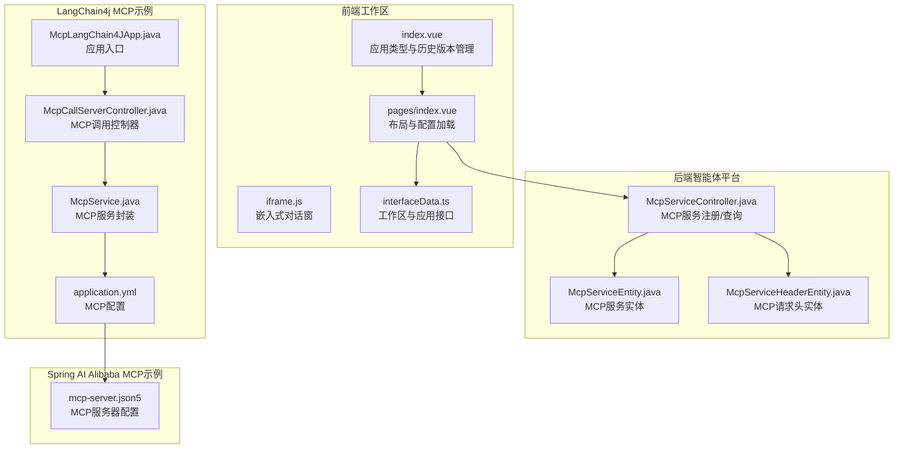
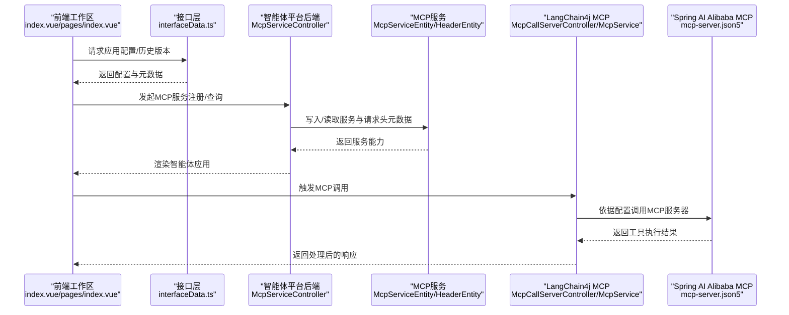
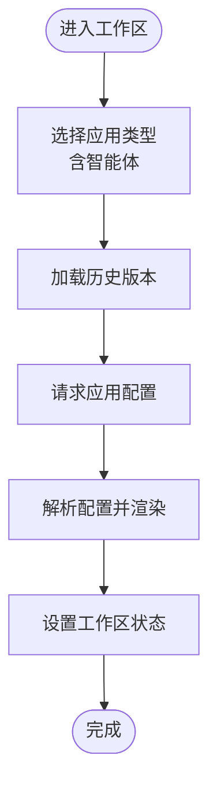
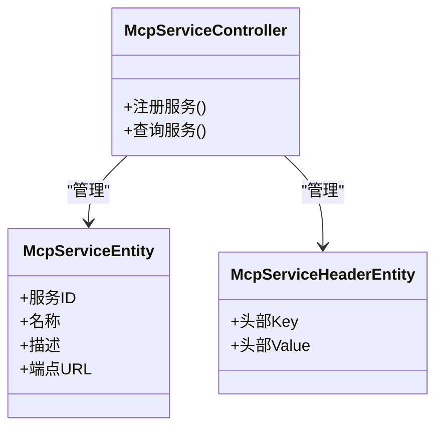
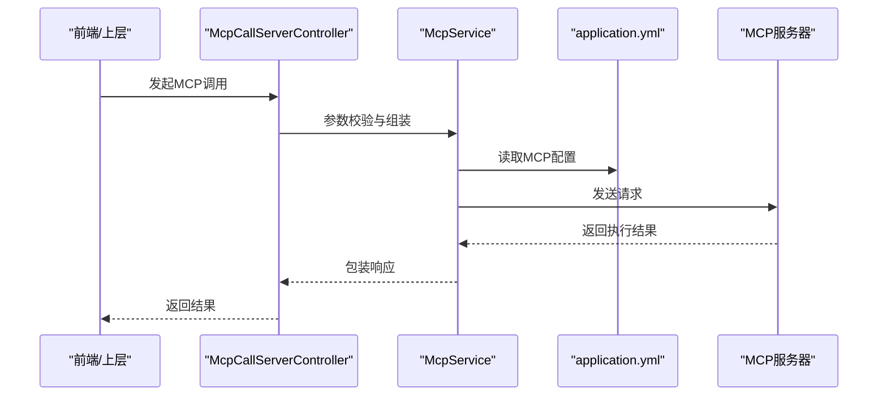
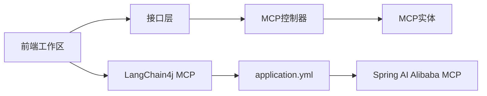

# LangGraph高级应用

<cite>
**本文引用的文件**
- [McpLangChain4JApp.java](file://【2】langchain4j-atguiguV5/langchain4j-14chat-mcp/src/main/java/com/atguigu/study/McpLangChain4JApp.java)
- [McpCallServerController.java](file://【2】langchain4j-atguiguV5/langchain4j-14chat-mcp/src/main/java/com/atguigu/study/controller/McpCallServerController.java)
- [McpService.java](file://【2】langchain4j-atguiguV5/langchain4j-14chat-mcp/src/main/java/com/atguigu/study/service/McpService.java)
- [application.yml](file://【2】langchain4j-atguiguV5/langchain4j-14chat-mcp/src/main/resources/application.yml)
- [mcp-server.json5](file://【1】SpringAIAlibaba-atguiguV1/SAA-16ClientCallBaiduMcpServer/src/main/resources/mcp-server.json5)
- [McpServiceController.java](file://【3】工作资料/code/仓颉智能体/nlp-agent/agent-builder/agent-build-core/src/main/java/com/yundingtech/agent/build/modules/tool/mcp/controller/McpServiceController.java)
- [McpServiceEntity.java](file://【3】工作资料/code/仓颉智能体/nlp-agent/agent-builder/agent-build-core/src/main/java/com/yundingtech/agent/build/modules/tool/mcp/entity/McpServiceEntity.java)
- [McpServiceHeaderEntity.java](file://【3】工作资料/code/仓颉智能体/nlp-agent/agent-builder/agent-build-core/src/main/java/com/yundingtech/agent/build/modules/tool/mcp/entity/McpServiceHeaderEntity.java)
- [index.vue](file://【3】工作资料/code/仓颉智能体/nlp-frontend-web/src/views/workspace/pages/workApps/index.vue)
- [pages/index.vue](file://【3】工作资料/code/仓颉智能体/nlp-frontend-web/src/views/workspace/pages/workApps/pages/index.vue)
- [interfaceData.ts](file://【3】工作资料/code/仓颉智能体/nlp-frontend-web/src/views/workspace/interfaceData.ts)
- [iframe.js](file://【3】工作资料/code/仓颉智能体/nlp-frontend-web/public/iframe.js)
- [README.md](file://【3】工作资料/code/仓颉智能体/nlp-agent/README.md)
</cite>

## 目录
1. [引言](#引言)
2. [项目结构](#项目结构)
3. [核心组件](#核心组件)
4. [架构总览](#架构总览)
5. [详细组件分析](#详细组件分析)
6. [依赖分析](#依赖分析)
7. [性能考虑](#性能考虑)
8. [故障排查指南](#故障排查指南)
9. [结论](#结论)
10. [附录](#附录)

## 引言
本技术文档面向希望在复杂业务场景中构建高级智能体与多智能体系统的工程师与架构师。文档以仓库中的LangChain4j MCP集成示例、Spring AI Alibaba MCP客户端实践以及“仓颉智能体”前端与后端能力为基础，系统阐述如何基于底层API构建可扩展的图式智能体、实现ReACT风格的推理-行动循环、管理智能体记忆与多轮对话，并通过MCP实现工具调用与外部服务集成。同时给出多智能体协作的实践思路与落地建议。

## 项目结构
本仓库包含三大主线：
- Spring AI Alibaba 示例：围绕MCP协议的本地与云端服务集成，演示LangChain4j与MCP的对接方式。
- LangChain4j 示例：以MCP为主题，展示从控制器到服务层的完整调用链路。
- 仓颉智能体平台：前端工作区页面支持“智能体”应用类型，后端提供MCP服务注册与实体建模，支撑工具调用与智能体编排。

**图表来源**
- [index.vue:169-177](file://【3】工作资料/code/仓颉智能体/nlp-frontend-web/src/views/workspace/pages/workApps/index.vue#L169-L177)
- [pages/index.vue:349-369](file://【3】工作资料/code/仓颉智能体/nlp-frontend-web/src/views/workspace/pages/workApps/pages/index.vue#L349-L369)
- [McpServiceController.java](file://【3】工作资料/code/仓颉智能体/nlp-agent/agent-builder/agent-build-core/src/main/java/com/yundingtech/agent/build/modules/tool/mcp/controller/McpServiceController.java)
- [McpServiceEntity.java](file://【3】工作资料/code/仓颉智能体/nlp-agent/agent-builder/agent-build-core/src/main/java/com/yundingtech/agent/build/modules/tool/mcp/entity/McpServiceEntity.java)
- [McpServiceHeaderEntity.java](file://【3】工作资料/code/仓颉智能体/nlp-agent/agent-builder/agent-build-core/src/main/java/com/yundingtech/agent/build/modules/tool/mcp/entity/McpServiceHeaderEntity.java)
- [McpLangChain4JApp.java](file://【2】langchain4j-atguiguV5/langchain4j-14chat-mcp/src/main/java/com/atguigu/study/McpLangChain4JApp.java)
- [McpCallServerController.java](file://【2】langchain4j-atguiguV5/langchain4j-14chat-mcp/src/main/java/com/atguigu/study/controller/McpCallServerController.java)
- [McpService.java](file://【2】langchain4j-atguiguV5/langchain4j-14chat-mcp/src/main/java/com/atguigu/study/service/McpService.java)
- [application.yml](file://【2】langchain4j-atguiguV5/langchain4j-14chat-mcp/src/main/resources/application.yml)
- [mcp-server.json5](file://【1】SpringAIAlibaba-atguiguV1/SAA-16ClientCallBaiduMcpServer/src/main/resources/mcp-server.json5)

**章节来源**
- [index.vue:169-177](file://【3】工作资料/code/仓颉智能体/nlp-frontend-web/src/views/workspace/pages/workApps/index.vue#L169-L177)
- [pages/index.vue:349-369](file://【3】工作资料/code/仓颉智能体/nlp-frontend-web/src/views/workspace/pages/workApps/pages/index.vue#L349-L369)
- [McpServiceController.java](file://【3】工作资料/code/仓颉智能体/nlp-agent/agent-builder/agent-build-core/src/main/java/com/yundingtech/agent/build/modules/tool/mcp/controller/McpServiceController.java)
- [McpServiceEntity.java](file://【3】工作资料/code/仓颉智能体/nlp-agent/agent-builder/agent-build-core/src/main/java/com/yundingtech/agent/build/modules/tool/mcp/entity/McpServiceEntity.java)
- [McpServiceHeaderEntity.java](file://【3】工作资料/code/仓颉智能体/nlp-agent/agent-builder/agent-build-core/src/main/java/com/yundingtech/agent/build/modules/tool/mcp/entity/McpServiceHeaderEntity.java)
- [McpLangChain4JApp.java](file://【2】langchain4j-atguiguV5/langchain4j-14chat-mcp/src/main/java/com/atguigu/study/McpLangChain4JApp.java)
- [McpCallServerController.java](file://【2】langchain4j-atguiguV5/langchain4j-14chat-mcp/src/main/java/com/atguigu/study/controller/McpCallServerController.java)
- [McpService.java](file://【2】langchain4j-atguiguV5/langchain4j-14chat-mcp/src/main/java/com/atguigu/study/service/McpService.java)
- [application.yml](file://【2】langchain4j-atguiguV5/langchain4j-14chat-mcp/src/main/resources/application.yml)
- [mcp-server.json5](file://【1】SpringAIAlibaba-atguiguV1/SAA-16ClientCallBaiduMcpServer/src/main/resources/mcp-server.json5)

## 核心组件
- 前端工作区与智能体应用
  - 应用类型标签与历史版本管理，支持“智能体”类型入口。
  - 布局与配置加载，支持从后端拉取并渲染应用配置。
- MCP服务编排与实体
  - MCP服务注册与查询控制器，提供服务元数据与请求头建模。
- LangChain4j MCP集成
  - 控制器负责接收调用请求，服务层封装MCP交互，应用配置定义MCP连接参数。
- Spring AI Alibaba MCP客户端
  - 通过JSON5配置描述MCP服务器能力，便于客户端按需调用。

**章节来源**
- [index.vue:169-177](file://【3】工作资料/code/仓颉智能体/nlp-frontend-web/src/views/workspace/pages/workApps/index.vue#L169-L177)
- [pages/index.vue:349-369](file://【3】工作资料/code/仓颉智能体/nlp-frontend-web/src/views/workspace/pages/workApps/pages/index.vue#L349-L369)
- [McpServiceController.java](file://【3】工作资料/code/仓颉智能体/nlp-agent/agent-builder/agent-build-core/src/main/java/com/yundingtech/agent/build/modules/tool/mcp/controller/McpServiceController.java)
- [McpServiceEntity.java](file://【3】工作资料/code/仓颉智能体/nlp-agent/agent-builder/agent-build-core/src/main/java/com/yundingtech/agent/build/modules/tool/mcp/entity/McpServiceEntity.java)
- [McpServiceHeaderEntity.java](file://【3】工作资料/code/仓颉智能体/nlp-agent/agent-builder/agent-build-core/src/main/java/com/yundingtech/agent/build/modules/tool/mcp/entity/McpServiceHeaderEntity.java)
- [McpLangChain4JApp.java](file://【2】langchain4j-atguiguV5/langchain4j-14chat-mcp/src/main/java/com/atguigu/study/McpLangChain4JApp.java)
- [McpCallServerController.java](file://【2】langchain4j-atguiguV5/langchain4j-14chat-mcp/src/main/java/com/atguigu/study/controller/McpCallServerController.java)
- [McpService.java](file://【2】langchain4j-atguiguV5/langchain4j-14chat-mcp/src/main/java/com/atguigu/study/service/McpService.java)
- [application.yml](file://【2】langchain4j-atguiguV5/langchain4j-14chat-mcp/src/main/resources/application.yml)
- [mcp-server.json5](file://【1】SpringAIAlibaba-atguiguV1/SAA-16ClientCallBaiduMcpServer/src/main/resources/mcp-server.json5)

## 架构总览
下图展示了从前端工作区到后端MCP服务，再到LangChain4j与Spring AI Alibaba MCP客户端的整体交互路径。该架构强调“配置驱动”的智能体编排与“工具即服务”的MCP集成模式。

**图表来源**
- [index.vue:169-177](file://【3】工作资料/code/仓颉智能体/nlp-frontend-web/src/views/workspace/pages/workApps/index.vue#L169-L177)
- [pages/index.vue:349-369](file://【3】工作资料/code/仓颉智能体/nlp-frontend-web/src/views/workspace/pages/workApps/pages/index.vue#L349-L369)
- [interfaceData.ts:1-54](file://【3】工作资料/code/仓颉智能体/nlp-frontend-web/src/views/workspace/interfaceData.ts#L1-L54)
- [McpServiceController.java](file://【3】工作资料/code/仓颉智能体/nlp-agent/agent-builder/agent-build-core/src/main/java/com/yundingtech/agent/build/modules/tool/mcp/controller/McpServiceController.java)
- [McpServiceEntity.java](file://【3】工作资料/code/仓颉智能体/nlp-agent/agent-builder/agent-build-core/src/main/java/com/yundingtech/agent/build/modules/tool/mcp/entity/McpServiceEntity.java)
- [McpServiceHeaderEntity.java](file://【3】工作资料/code/仓颉智能体/nlp-agent/agent-builder/agent-build-core/src/main/java/com/yundingtech/agent/build/modules/tool/mcp/entity/McpServiceHeaderEntity.java)
- [McpCallServerController.java](file://【2】langchain4j-atguiguV5/langchain4j-14chat-mcp/src/main/java/com/atguigu/study/controller/McpCallServerController.java)
- [McpService.java](file://【2】langchain4j-atguiguV5/langchain4j-14chat-mcp/src/main/java/com/atguigu/study/service/McpService.java)
- [mcp-server.json5](file://【1】SpringAIAlibaba-atguiguV1/SAA-16ClientCallBaiduMcpServer/src/main/resources/mcp-server.json5)

## 详细组件分析

### 组件A：前端工作区与智能体应用
- 功能要点
  - 支持多种应用类型（知识问答、智能问数、对话流、工作流、智能体），其中“智能体”类型预留入口。
  - 历史版本切换与配置解析，支持将后端返回的配置渲染到页面。
  - 嵌入式对话窗通过iframe脚本注入，支持拖拽与尺寸自定义。
- 关键流程
  - 切换历史版本 -> 拉取配置 -> 解析并布局应用 -> 设置工作区状态。

**图表来源**
- [index.vue:169-177](file://【3】工作资料/code/仓颉智能体/nlp-frontend-web/src/views/workspace/pages/workApps/index.vue#L169-L177)
- [pages/index.vue:349-369](file://【3】工作资料/code/仓颉智能体/nlp-frontend-web/src/views/workspace/pages/workApps/pages/index.vue#L349-L369)
- [iframe.js:1-168](file://【3】工作资料/code/仓颉智能体/nlp-frontend-web/public/iframe.js#L1-L168)

**章节来源**
- [index.vue:169-177](file://【3】工作资料/code/仓颉智能体/nlp-frontend-web/src/views/workspace/pages/workApps/index.vue#L169-L177)
- [pages/index.vue:349-369](file://【3】工作资料/code/仓颉智能体/nlp-frontend-web/src/views/workspace/pages/workApps/pages/index.vue#L349-L369)
- [iframe.js:1-168](file://【3】工作资料/code/仓颉智能体/nlp-frontend-web/public/iframe.js#L1-L168)

### 组件B：MCP服务编排与实体
- 功能要点
  - 控制器负责MCP服务的注册与查询，维护服务元数据与请求头信息。
  - 实体建模MCP服务与请求头，确保跨模块一致的数据契约。
- 设计模式
  - 分层清晰：控制器（接口）、实体（数据）、服务（业务）。
  - 配置驱动：通过实体定义服务能力，便于扩展与治理。

**图表来源**
- [McpServiceController.java](file://【3】工作资料/code/仓颉智能体/nlp-agent/agent-builder/agent-build-core/src/main/java/com/yundingtech/agent/build/modules/tool/mcp/controller/McpServiceController.java)
- [McpServiceEntity.java](file://【3】工作资料/code/仓颉智能体/nlp-agent/agent-builder/agent-build-core/src/main/java/com/yundingtech/agent/build/modules/tool/mcp/entity/McpServiceEntity.java)
- [McpServiceHeaderEntity.java](file://【3】工作资料/code/仓颉智能体/nlp-agent/agent-builder/agent-build-core/src/main/java/com/yundingtech/agent/build/modules/tool/mcp/entity/McpServiceHeaderEntity.java)

**章节来源**
- [McpServiceController.java](file://【3】工作资料/code/仓颉智能体/nlp-agent/agent-builder/agent-build-core/src/main/java/com/yundingtech/agent/build/modules/tool/mcp/controller/McpServiceController.java)
- [McpServiceEntity.java](file://【3】工作资料/code/仓颉智能体/nlp-agent/agent-builder/agent-build-core/src/main/java/com/yundingtech/agent/build/modules/tool/mcp/entity/McpServiceEntity.java)
- [McpServiceHeaderEntity.java](file://【3】工作资料/code/仓颉智能体/nlp-agent/agent-builder/agent-build-core/src/main/java/com/yundingtech/agent/build/modules/tool/mcp/entity/McpServiceHeaderEntity.java)

### 组件C：LangChain4j MCP集成
- 功能要点
  - 应用入口启动MCP相关组件。
  - 控制器接收前端或上层调用，服务层封装MCP交互细节。
  - 配置文件定义MCP服务器地址、鉴权等参数。
- 调用序列
  - 前端触发 -> 控制器校验 -> 服务层调用 -> 返回结果。

**图表来源**
- [McpLangChain4JApp.java](file://【2】langchain4j-atguiguV5/langchain4j-14chat-mcp/src/main/java/com/atguigu/study/McpLangChain4JApp.java)
- [McpCallServerController.java](file://【2】langchain4j-atguiguV5/langchain4j-14chat-mcp/src/main/java/com/atguigu/study/controller/McpCallServerController.java)
- [McpService.java](file://【2】langchain4j-atguiguV5/langchain4j-14chat-mcp/src/main/java/com/atguigu/study/service/McpService.java)
- [application.yml](file://【2】langchain4j-atguiguV5/langchain4j-14chat-mcp/src/main/resources/application.yml)

**章节来源**
- [McpLangChain4JApp.java](file://【2】langchain4j-atguiguV5/langchain4j-14chat-mcp/src/main/java/com/atguigu/study/McpLangChain4JApp.java)
- [McpCallServerController.java](file://【2】langchain4j-atguiguV5/langchain4j-14chat-mcp/src/main/java/com/atguigu/study/controller/McpCallServerController.java)
- [McpService.java](file://【2】langchain4j-atguiguV5/langchain4j-14chat-mcp/src/main/java/com/atguigu/study/service/McpService.java)
- [application.yml](file://【2】langchain4j-atguiguV5/langchain4j-14chat-mcp/src/main/resources/application.yml)

### 组件D：Spring AI Alibaba MCP客户端
- 功能要点
  - 通过mcp-server.json5声明MCP服务器能力，客户端按需发起调用。
  - 与LangChain4j MCP示例形成互补：前者偏客户端直连，后者偏服务侧封装。
- 实践建议
  - 将MCP能力清单化、版本化，配合鉴权与限流策略。

**章节来源**
- [mcp-server.json5](file://【1】SpringAIAlibaba-atguiguV1/SAA-16ClientCallBaiduMcpServer/src/main/resources/mcp-server.json5)

### 组件E：智能体记忆与多轮对话
- 建议方案
  - 使用会话上下文作为输入的一部分，结合提示词工程与系统指令，稳定上下文窗口。
  - 对长对话进行分段截断与摘要归档，避免上下文溢出。
  - 采用消息去重与幂等写入，保证多轮一致性。
- 注意事项
  - 记忆容量与时效性需与业务SLA匹配，定期清理过期会话。
  - 工具调用结果需纳入记忆，以便后续推理复用。

[本节为概念性指导，不直接分析具体文件]

## 依赖分析
- 前端与后端
  - 前端通过接口层统一访问后端，后端通过MCP控制器与实体解耦服务发现与配置。
- 后端与MCP
  - MCP控制器依赖实体进行数据持久化与查询；实体独立于控制器，便于扩展。
- LangChain4j与Spring AI Alibaba
  - 两者均通过配置文件与JSON5描述MCP能力，形成统一的工具调用范式。

**图表来源**
- [interfaceData.ts:1-54](file://【3】工作资料/code/仓颉智能体/nlp-frontend-web/src/views/workspace/interfaceData.ts#L1-L54)
- [McpServiceController.java](file://【3】工作资料/code/仓颉智能体/nlp-agent/agent-builder/agent-build-core/src/main/java/com/yundingtech/agent/build/modules/tool/mcp/controller/McpServiceController.java)
- [McpServiceEntity.java](file://【3】工作资料/code/仓颉智能体/nlp-agent/agent-builder/agent-build-core/src/main/java/com/yundingtech/agent/build/modules/tool/mcp/entity/McpServiceEntity.java)
- [McpServiceHeaderEntity.java](file://【3】工作资料/code/仓颉智能体/nlp-agent/agent-builder/agent-build-core/src/main/java/com/yundingtech/agent/build/modules/tool/mcp/entity/McpServiceHeaderEntity.java)
- [McpCallServerController.java](file://【2】langchain4j-atguiguV5/langchain4j-14chat-mcp/src/main/java/com/atguigu/study/controller/McpCallServerController.java)
- [application.yml](file://【2】langchain4j-atguiguV5/langchain4j-14chat-mcp/src/main/resources/application.yml)
- [mcp-server.json5](file://【1】SpringAIAlibaba-atguiguV1/SAA-16ClientCallBaiduMcpServer/src/main/resources/mcp-server.json5)

**章节来源**
- [interfaceData.ts:1-54](file://【3】工作资料/code/仓颉智能体/nlp-frontend-web/src/views/workspace/interfaceData.ts#L1-L54)
- [McpServiceController.java](file://【3】工作资料/code/仓颉智能体/nlp-agent/agent-builder/agent-build-core/src/main/java/com/yundingtech/agent/build/modules/tool/mcp/controller/McpServiceController.java)
- [McpServiceEntity.java](file://【3】工作资料/code/仓颉智能体/nlp-agent/agent-builder/agent-build-core/src/main/java/com/yundingtech/agent/build/modules/tool/mcp/entity/McpServiceEntity.java)
- [McpServiceHeaderEntity.java](file://【3】工作资料/code/仓颉智能体/nlp-agent/agent-builder/agent-build-core/src/main/java/com/yundingtech/agent/build/modules/tool/mcp/entity/McpServiceHeaderEntity.java)
- [McpCallServerController.java](file://【2】langchain4j-atguiguV5/langchain4j-14chat-mcp/src/main/java/com/atguigu/study/controller/McpCallServerController.java)
- [application.yml](file://【2】langchain4j-atguiguV5/langchain4j-14chat-mcp/src/main/resources/application.yml)
- [mcp-server.json5](file://【1】SpringAIAlibaba-atguiguV1/SAA-16ClientCallBaiduMcpServer/src/main/resources/mcp-server.json5)

## 性能考虑
- 前端
  - 嵌入式对话窗采用懒加载与尺寸缓存，减少DOM操作开销。
  - 历史版本切换时仅更新必要区域，避免全量重绘。
- 后端
  - MCP实体采用轻量建模，查询与写入尽量走索引字段。
  - 控制器层做参数校验与短路返回，降低无效调用成本。
- MCP调用
  - 配置文件集中管理MCP地址与超时，避免硬编码带来的运维成本。
  - 客户端侧可引入重试与熔断策略，提升可用性。

[本节提供一般性建议，不直接分析具体文件]

## 故障排查指南
- 前端无法加载应用配置
  - 检查接口层返回结构与历史版本ID是否正确。
  - 确认iframe脚本注入是否成功，拖拽与可见性逻辑是否被覆盖。
- MCP服务不可用
  - 校验MCP实体中的端点URL与鉴权头是否正确。
  - 查看LangChain4j配置文件中的MCP地址与端口。
- 工具调用失败
  - 在控制器与服务层增加日志埋点，定位参数组装与网络调用阶段。
  - 对比Spring AI Alibaba的mcp-server.json5能力清单，确认工具是否存在且可调用。

**章节来源**
- [pages/index.vue:349-369](file://【3】工作资料/code/仓颉智能体/nlp-frontend-web/src/views/workspace/pages/workApps/pages/index.vue#L349-L369)
- [McpServiceController.java](file://【3】工作资料/code/仓颉智能体/nlp-agent/agent-builder/agent-build-core/src/main/java/com/yundingtech/agent/build/modules/tool/mcp/controller/McpServiceController.java)
- [McpCallServerController.java](file://【2】langchain4j-atguiguV5/langchain4j-14chat-mcp/src/main/java/com/atguigu/study/controller/McpCallServerController.java)
- [application.yml](file://【2】langchain4j-atguiguV5/langchain4j-14chat-mcp/src/main/resources/application.yml)
- [mcp-server.json5](file://【1】SpringAIAlibaba-atguiguV1/SAA-16ClientCallBaiduMcpServer/src/main/resources/mcp-server.json5)

## 结论
本仓库提供了从前端工作区到后端MCP编排，再到LangChain4j与Spring AI Alibaba MCP客户端的完整实践路径。通过“配置驱动”的智能体编排与“工具即服务”的MCP集成，可以快速构建具备工具调用、记忆管理与多轮对话能力的高级智能体系统，并在此基础上扩展为多智能体协作的复杂应用。

## 附录
- 平台与项目说明
  - 仓颉智能体平台README提供了整体背景与能力概览，可作为入门参考。
- 前端嵌入式对话窗
  - iframe脚本支持拖拽、尺寸自定义与默认打开行为，便于在业务页面内集成。

**章节来源**
- [README.md](file://【3】工作资料/code/仓颉智能体/nlp-agent/README.md)
- [iframe.js:1-168](file://【3】工作资料/code/仓颉智能体/nlp-frontend-web/public/iframe.js#L1-L168)