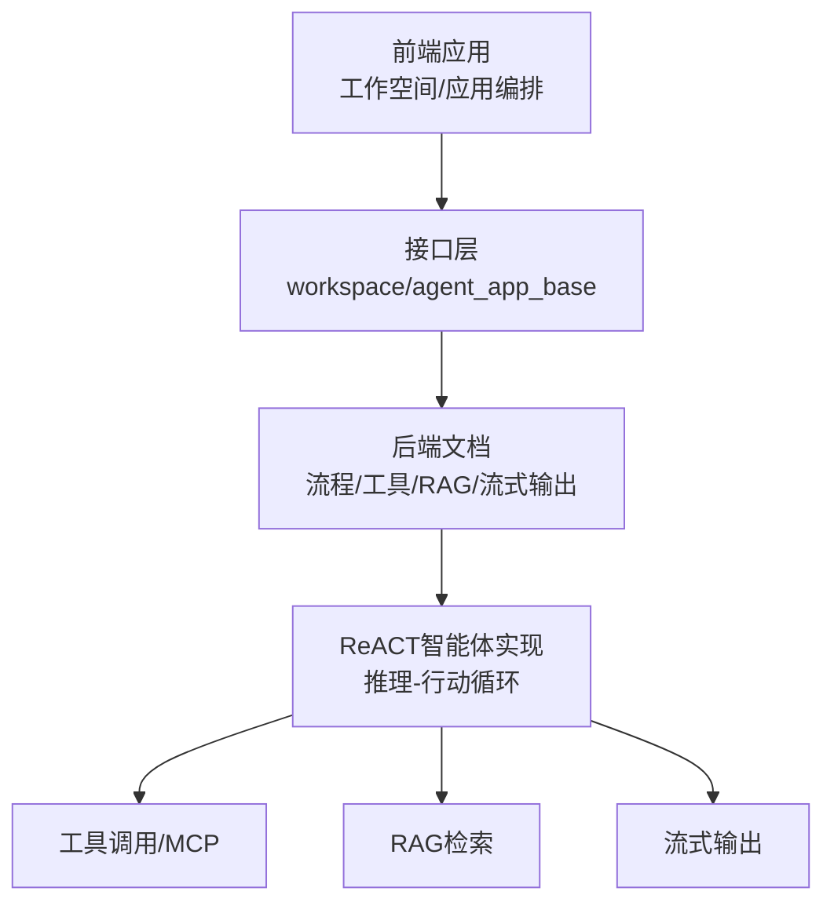
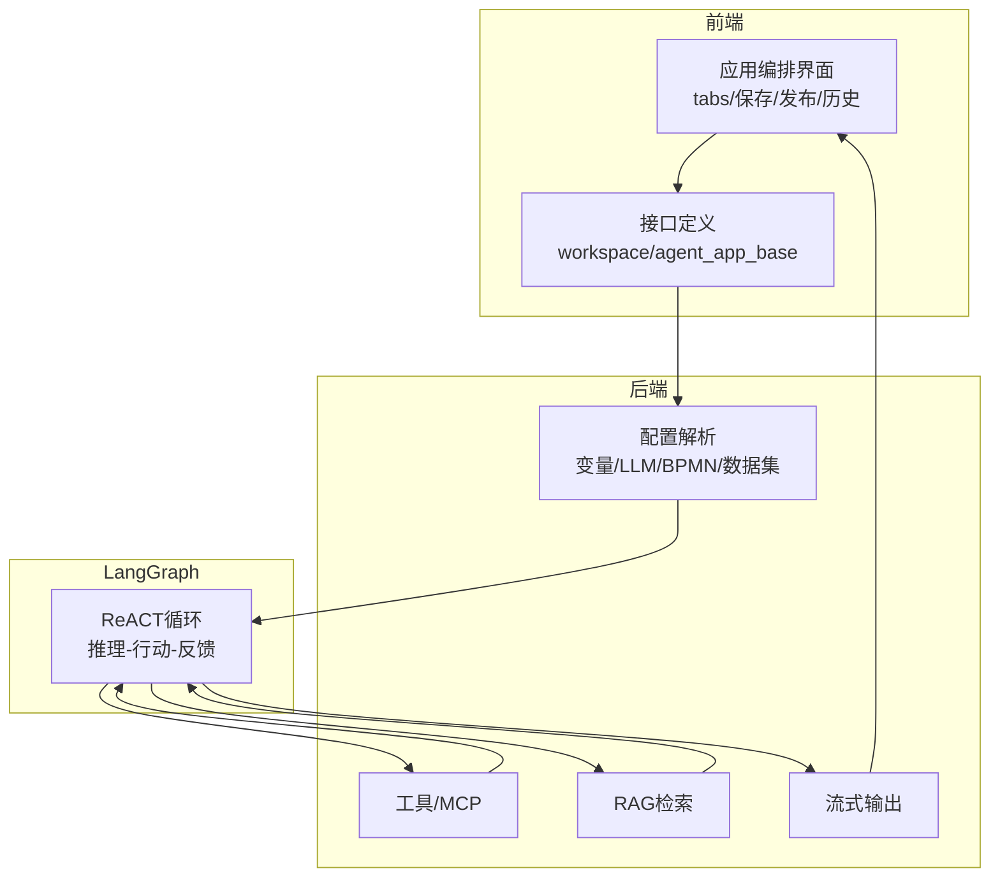
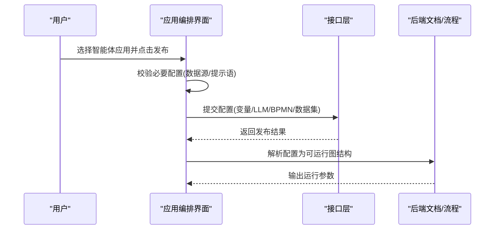
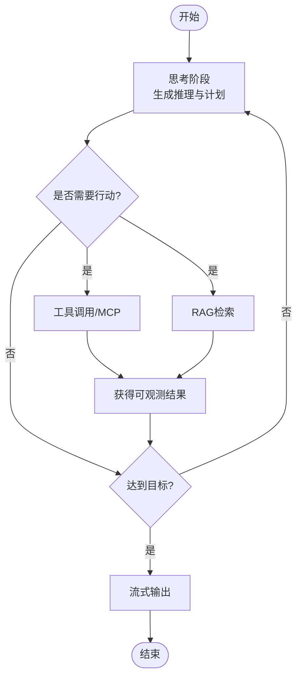
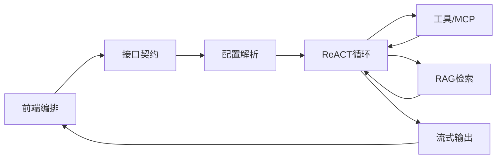

# ReACT智能体实现

<cite>
**本文引用的文件**
- [nlp-frontend-web/src/views/workspace/pages/workApps/index.vue](file://nlp-frontend-web/src/views/workspace/pages/workApps/index.vue)
- [nlp-frontend-web/src/views/workspace/pages/workApps/pages/index.vue](file://nlp-frontend-web/src/views/workspace/pages/workApps/pages/index.vue)
- [nlp-frontend-web/src/views/workspace/interfaceData.ts](file://nlp-frontend-web/src/views/workspace/interfaceData.ts)
- [nlp-frontend-web/public/iframe.js](file://nlp-frontend-web/public/iframe.js)
- [【3】工作资料/仓颉项目系统功能文档梳理/7、需求功能类/大模型输出节点历史内容支持编辑/四类智能应用大模型回复内容存储机制分析.md](file://【3】工作资料/仓颉项目系统功能文档梳理/7、需求功能类/大模型输出节点历史内容支持编辑/四类智能应用大模型回复内容存储机制分析.md)
- [【3】工作资料/仓颉项目系统功能文档梳理/3、对话流/对话流智能体文件解析整理流程.md](file://【3】工作资料/仓颉项目系统功能文档梳理/3、对话流/对话流智能体文件解析整理流程.md)
- [【3】工作资料/仓颉项目系统功能文档梳理/3、对话流/对话流深度分析.md](file://【3】工作资料/仓颉项目系统功能文档梳理/3、对话流/对话流深度分析.md)
- [【3】工作资料/仓颉项目系统功能文档梳理/13、MCP 工具调用机制.md](file://【3】工作资料/仓颉项目系统功能文档梳理/13、MCP 工具调用机制.md)
- [【3】工作资料/仓颉项目系统功能文档梳理/14、RAG 检索流程.md.md](file://【3】工作资料/仓颉项目系统功能文档梳理/14、RAG 检索流程.md.md)
- [【3】工作资料/仓颉项目系统功能文档梳理/12、流式输出机制详解.md.md](file://【3】工作资料/仓颉项目系统功能文档梳理/12、流式输出机制详解.md.md)
- [【3】工作资料/仓颉项目系统功能文档梳理/1、知识问答/1、知识问答深度分析.md](file://【3】工作资料/仓颉项目系统功能文档梳理/1、知识问答/1、知识问答深度分析.md)
- [【3】工作资料/仓颉项目系统功能文档梳理/2、智能问数/智能问数深入分析.md](file://【3】工作资料/仓颉项目系统功能文档梳理/2、智能问数/智能问数深入分析.md)
- [【3】工作资料/仓颉项目系统功能文档梳理/10、对话消息处理流程.md](file://【3】工作资料/仓颉项目系统功能文档梳理/10、对话消息处理流程.md)
- [【3】工作资料/仓颉项目系统功能文档梳理/19、本地调试指南.md](file://【3】工作资料/仓颉项目系统功能文档梳理/19、本地调试指南.md)
</cite>

## 目录
1. [引言](#引言)
2. [项目结构](#项目结构)
3. [核心组件](#核心组件)
4. [架构总览](#架构总览)
5. [详细组件分析](#详细组件分析)
6. [依赖分析](#依赖分析)
7. [性能考虑](#性能考虑)
8. [故障排查指南](#故障排查指南)
9. [结论](#结论)
10. [附录](#附录)

## 引言
本技术文档围绕LangGraph中的ReACT（Reasoning and Acting）智能体实现展开，系统阐述“推理-行动”循环机制在实际工程中的落地方式。ReACT通过显式的思考（Reasoning）与可验证的行动（Acting）形成闭环，使智能体能够在复杂任务中进行自我反思、规划与执行，并将结果反馈到后续决策中。本文结合项目现有前端界面与文档，给出在LangGraph中实现ReACT智能体的思路、关键流程、数据模型与集成点，并提供多轮对话、上下文管理、记忆存储、工具调用与RAG检索等高级能力的实践建议。

## 项目结构
本仓库包含前后端与文档两部分：前端侧提供智能体应用的可视化编排与交互入口；后端文档梳理了智能体相关流程、工具调用、RAG检索、流式输出等机制。ReACT智能体的实现需从前端编排、后端工具链与检索增强三方面协同完成。

**章节来源**
- [nlp-frontend-web/src/views/workspace/pages/workApps/index.vue:154-188](file://nlp-frontend-web/src/views/workspace/pages/workApps/index.vue#L154-L188)
- [nlp-frontend-web/src/views/workspace/pages/workApps/pages/index.vue:93-370](file://nlp-frontend-web/src/views/workspace/pages/workApps/pages/index.vue#L93-L370)
- [nlp-frontend-web/src/views/workspace/interfaceData.ts:1-54](file://nlp-frontend-web/src/views/workspace/interfaceData.ts#L1-L54)

## 核心组件
- 前端应用编排与交互
  - 工作空间应用列表与筛选：支持“知识问答/智能问数/对话流/工作流/智能体”等分类，便于在不同应用类型间切换与发布。
  - 智能体应用的保存、发布与版本管理：提供保存草稿、发布到沙盒或正式环境、版本切换等功能。
  - 历史记录与配置解析：支持从历史版本恢复配置并解析为可运行的图结构。
- 接口与数据契约
  - 工作空间与应用的基础接口：分页查询、详情获取、新增、删除、编辑等。
  - 智能体应用配置：包含变量、LLM配置、BPMN配置、数据集等。
- 文档与流程支撑
  - 对话流/工作流/智能体相关文档：明确节点类型、数据流转、工具调用与RAG检索流程。
  - 流式输出与MCP工具调用机制：为ReACT智能体提供实时反馈与外部能力扩展。

**章节来源**
- [nlp-frontend-web/src/views/workspace/pages/workApps/index.vue:154-188](file://nlp-frontend-web/src/views/workspace/pages/workApps/index.vue#L154-L188)
- [nlp-frontend-web/src/views/workspace/pages/workApps/pages/index.vue:249-261](file://nlp-frontend-web/src/views/workspace/pages/workApps/pages/index.vue#L249-L261)
- [nlp-frontend-web/src/views/workspace/pages/workApps/pages/index.vue:340-370](file://nlp-frontend-web/src/views/workspace/pages/workApps/pages/index.vue#L340-L370)
- [nlp-frontend-web/src/views/workspace/interfaceData.ts:18-22](file://nlp-frontend-web/src/views/workspace/interfaceData.ts#L18-L22)

## 架构总览
下图展示了ReACT智能体在LangGraph中的端到端架构：前端负责编排与交互，后端提供工具与检索能力，二者通过接口与文档约定协同工作。

**图示来源**
- [nlp-frontend-web/src/views/workspace/pages/workApps/index.vue:154-188](file://nlp-frontend-web/src/views/workspace/pages/workApps/index.vue#L154-L188)
- [nlp-frontend-web/src/views/workspace/pages/workApps/pages/index.vue:226-248](file://nlp-frontend-web/src/views/workspace/pages/workApps/pages/index.vue#L226-L248)
- [nlp-frontend-web/src/views/workspace/interfaceData.ts:18-22](file://nlp-frontend-web/src/views/workspace/interfaceData.ts#L18-L22)
- [【3】工作资料/仓颉项目系统功能文档梳理/13、MCP 工具调用机制.md](file://【3】工作资料/仓颉项目系统功能文档梳理/13、MCP 工具调用机制.md)
- [【3】工作资料/仓颉项目系统功能文档梳理/14、RAG 检索流程.md.md](file://【3】工作资料/仓颉项目系统功能文档梳理/14、RAG 检索流程.md.md)
- [【3】工作资料/仓颉项目系统功能文档梳理/12、流式输出机制详解.md.md](file://【3】工作资料/仓颉项目系统功能文档梳理/12、流式输出机制详解.md.md)

## 详细组件分析

### 组件A：前端应用编排与ReACT配置
- 功能要点
  - 分类筛选：支持“知识问答/智能问数/对话流/工作流/智能体”等类型，便于定位ReACT智能体应用。
  - 保存与发布：提供保存草稿、发布到沙盒/正式环境、取消发布的操作链路。
  - 历史版本：支持从历史版本恢复配置，解析为可运行的图结构。
  - 智能体应用占位：当前对“智能体”类型的分支逻辑处于占位状态，后续可在此处接入ReACT智能体的编排与运行。
- 关键流程
  - 发布校验：在发布前对必要配置进行校验（如数据源、拒绝回答提示语等），确保智能体运行时不会因缺失配置而失败。
  - 配置解析：将前端图结构转换为后端可识别的配置（变量、LLM、BPMN、数据集等），并通过接口提交。

**图示来源**
- [nlp-frontend-web/src/views/workspace/pages/workApps/pages/index.vue:360-391](file://nlp-frontend-web/src/views/workspace/pages/workApps/pages/index.vue#L360-L391)
- [nlp-frontend-web/src/views/workspace/pages/workApps/pages/index.vue:226-248](file://nlp-frontend-web/src/views/workspace/pages/workApps/pages/index.vue#L226-L248)

**章节来源**
- [nlp-frontend-web/src/views/workspace/pages/workApps/index.vue:154-188](file://nlp-frontend-web/src/views/workspace/pages/workApps/index.vue#L154-L188)
- [nlp-frontend-web/src/views/workspace/pages/workApps/pages/index.vue:249-261](file://nlp-frontend-web/src/views/workspace/pages/workApps/pages/index.vue#L249-L261)
- [nlp-frontend-web/src/views/workspace/pages/workApps/pages/index.vue:340-370](file://nlp-frontend-web/src/views/workspace/pages/workApps/pages/index.vue#L340-L370)

### 组件B：ReACT推理-行动循环（概念性）
- 循环机制
  - 思考阶段：基于当前上下文与目标，生成中间推理步骤与计划。
  - 行动阶段：根据计划调用工具或检索资源，获取可观测结果。
  - 反馈阶段：将行动结果纳入上下文，决定是否继续推理或终止。
- 数据模型（概念）
  - 输入：用户消息、历史上下文、工具/检索能力描述。
  - 中间态：推理轨迹、计划、工具调用参数、检索片段。
  - 输出：最终答案、中间思考内容、执行过程记录。
- 与现有文档的映射
  - 工具调用与MCP：为行动阶段提供外部能力扩展。
  - RAG检索：为行动阶段提供知识增强。
  - 流式输出：为思考与行动阶段提供实时反馈。

**图示来源**
- [【3】工作资料/仓颉项目系统功能文档梳理/13、MCP 工具调用机制.md](file://【3】工作资料/仓颉项目系统功能文档梳理/13、MCP 工具调用机制.md)
- [【3】工作资料/仓颉项目系统功能文档梳理/14、RAG 检索流程.md.md](file://【3】工作资料/仓颉项目系统功能文档梳理/14、RAG 检索流程.md.md)
- [【3】工作资料/仓颉项目系统功能文档梳理/12、流式输出机制详解.md.md](file://【3】工作资料/仓颉项目系统功能文档梳理/12、流式输出机制详解.md.md)

### 组件C：多轮对话与上下文管理
- 多轮对话
  - 通过历史消息与当前输入共同驱动推理，避免重复信息与上下文漂移。
  - 在“对话流/工作流/智能体”文档中明确了消息处理流程与节点类型，可作为ReACT上下文组织的参考。
- 上下文与记忆
  - 建议采用“短期记忆（最近N轮）+长期记忆（RAG向量库）”的混合策略。
  - 记忆条目应包含用户意图、工具调用结果、检索片段与最终结论，以便后续反思与复盘。

**章节来源**
- [【3】工作资料/仓颉项目系统功能文档梳理/10、对话消息处理流程.md](file://【3】工作资料/仓颉项目系统功能文档梳理/10、对话消息处理流程.md)
- [【3】工作资料/仓颉项目系统功能文档梳理/3、对话流/对话流深度分析.md](file://【3】工作资料/仓颉项目系统功能文档梳理/3、对话流/对话流深度分析.md)

### 组件D：工具调用与RAG检索
- 工具调用（MCP）
  - 将外部能力以标准化协议暴露，ReACT在行动阶段按需调用，提升智能体的实用性。
- RAG检索
  - 在行动阶段引入检索增强，帮助智能体在面对知识性问题时提供更准确的答案。

**章节来源**
- [【3】工作资料/仓颉项目系统功能文档梳理/13、MCP 工具调用机制.md](file://【3】工作资料/仓颉项目系统功能文档梳理/13、MCP 工具调用机制.md)
- [【3】工作资料/仓颉项目系统功能文档梳理/14、RAG 检索流程.md.md](file://【3】工作资料/仓颉项目系统功能文档梳理/14、RAG 检索流程.md.md)

### 组件E：流式输出与前端集成
- 流式输出
  - ReACT在思考与行动阶段均可采用流式输出，提升用户体验与交互效率。
- 前端集成
  - 通过iframe嵌入与接口对接，实现消息的实时渲染与滚动更新。

**章节来源**
- [nlp-frontend-web/public/iframe.js:1-19](file://nlp-frontend-web/public/iframe.js#L1-L19)
- [【3】工作资料/仓颉项目系统功能文档梳理/12、流式输出机制详解.md.md](file://【3】工作资料/仓颉项目系统功能文档梳理/12、流式输出机制详解.md.md)

## 依赖分析
ReACT智能体的实现依赖于前端编排、后端工具与检索、以及文档化的流程规范。下图展示了关键依赖关系：

**图示来源**
- [nlp-frontend-web/src/views/workspace/pages/workApps/pages/index.vue:226-248](file://nlp-frontend-web/src/views/workspace/pages/workApps/pages/index.vue#L226-L248)
- [nlp-frontend-web/src/views/workspace/interfaceData.ts:18-22](file://nlp-frontend-web/src/views/workspace/interfaceData.ts#L18-L22)
- [【3】工作资料/仓颉项目系统功能文档梳理/13、MCP 工具调用机制.md](file://【3】工作资料/仓颉项目系统功能文档梳理/13、MCP 工具调用机制.md)
- [【3】工作资料/仓颉项目系统功能文档梳理/14、RAG 检索流程.md.md](file://【3】工作资料/仓颉项目系统功能文档梳理/14、RAG 检索流程.md.md)
- [【3】工作资料/仓颉项目系统功能文档梳理/12、流式输出机制详解.md.md](file://【3】工作资料/仓颉项目系统功能文档梳理/12、流式输出机制详解.md.md)

**章节来源**
- [nlp-frontend-web/src/views/workspace/pages/workApps/pages/index.vue:226-248](file://nlp-frontend-web/src/views/workspace/pages/workApps/pages/index.vue#L226-L248)
- [nlp-frontend-web/src/views/workspace/interfaceData.ts:18-22](file://nlp-frontend-web/src/views/workspace/interfaceData.ts#L18-L22)

## 性能考虑
- 流式输出优化：在ReACT的思考与行动阶段采用流式输出，减少等待时间，提升交互体验。
- 工具调用与RAG检索的并发：在保证一致性的前提下，尽可能并行化工具调用与检索，缩短总延迟。
- 上下文压缩：对历史消息进行摘要或截断，避免上下文过长导致的性能下降。
- 缓存策略：对常用工具调用结果与检索片段进行缓存，降低重复计算成本。

## 故障排查指南
- 发布失败
  - 现象：发布时提示缺少数据源或拒绝回答提示语。
  - 处理：在应用配置中补齐数据源与提示语，重新发布。
- 历史版本恢复异常
  - 现象：从历史版本恢复后无法正常运行。
  - 处理：检查配置解析逻辑，确认变量、LLM、BPMN与数据集的兼容性。
- 工具调用超时
  - 现象：ReACT在行动阶段长时间无响应。
  - 处理：检查MCP服务可用性与网络连通性，适当调整超时与重试策略。
- RAG检索命中率低
  - 现象：检索结果与问题关联度不高。
  - 处理：优化检索提示词与向量化策略，增加领域语料覆盖。

**章节来源**
- [nlp-frontend-web/src/views/workspace/pages/workApps/pages/index.vue:360-391](file://nlp-frontend-web/src/views/workspace/pages/workApps/pages/index.vue#L360-L391)
- [nlp-frontend-web/src/views/workspace/pages/workApps/pages/index.vue:340-370](file://nlp-frontend-web/src/views/workspace/pages/workApps/pages/index.vue#L340-L370)
- [【3】工作资料/仓颉项目系统功能文档梳理/13、MCP 工具调用机制.md](file://【3】工作资料/仓颉项目系统功能文档梳理/13、MCP 工具调用机制.md)
- [【3】工作资料/仓颉项目系统功能文档梳理/14、RAG 检索流程.md.md](file://【3】工作资料/仓颉项目系统功能文档梳理/14、RAG 检索流程.md.md)

## 结论
ReACT智能体在LangGraph中的实现需要前端编排、后端工具与检索、以及文档化的流程规范协同配合。通过将“思考-行动-反馈”的循环机制与工具调用、RAG检索、流式输出相结合，可以在客户服务、知识问答等场景中实现高可用、可解释且可扩展的智能体系统。后续可在前端“智能体”类型分支中完善ReACT的编排与运行逻辑，并结合现有文档与接口，逐步落地端到端的智能体应用。

## 附录
- 业务场景建议
  - 客户服务：利用RAG检索与工具调用，实现自动工单创建、FAQ匹配与状态查询。
  - 知识问答：结合对话流与多轮上下文，提供更精准的答案与引导。
- 开发与调试
  - 参考本地调试指南，确保前后端联调顺畅。
  - 在对话流/工作流/智能体文档中查找节点类型与数据流转细节，辅助ReACT实现。

**章节来源**
- [【3】工作资料/仓颉项目系统功能文档梳理/1、知识问答/1、知识问答深度分析.md](file://【3】工作资料/仓颉项目系统功能文档梳理/1、知识问答/1、知识问答深度分析.md)
- [【3】工作资料/仓颉项目系统功能文档梳理/2、智能问数/智能问数深入分析.md](file://【3】工作资料/仓颉项目系统功能文档梳理/2、智能问数/智能问数深入分析.md)
- [【3】工作资料/仓颉项目系统功能文档梳理/19、本地调试指南.md](file://【3】工作资料/仓颉项目系统功能文档梳理/19、本地调试指南.md)