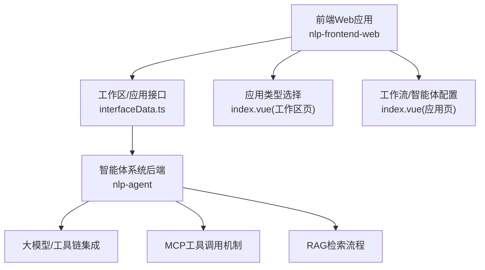
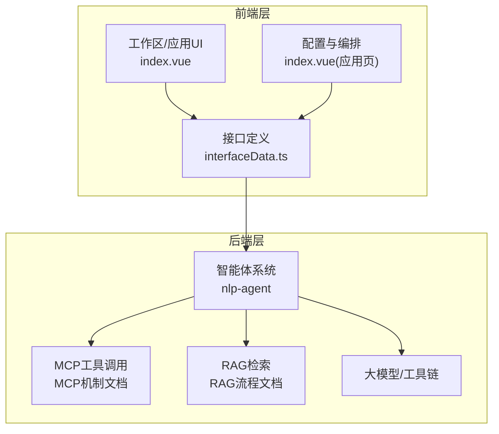
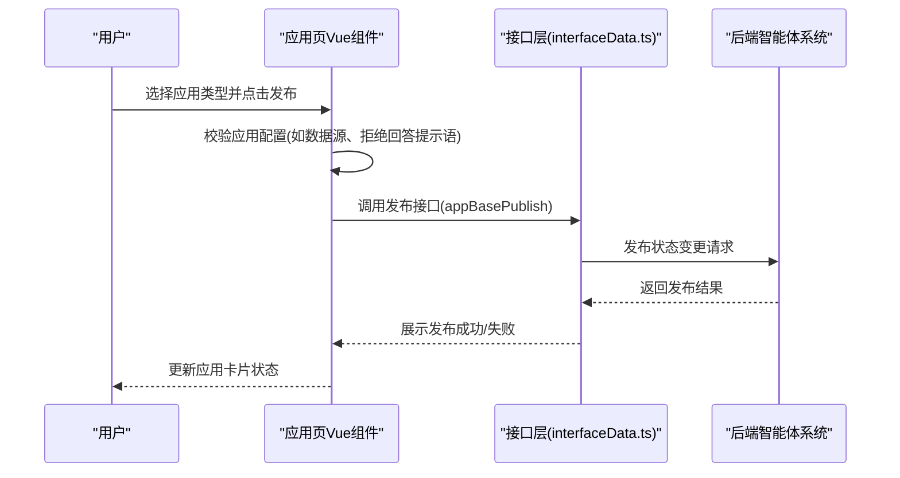
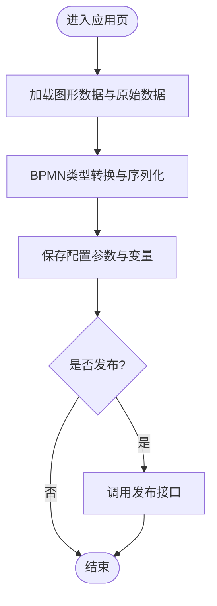
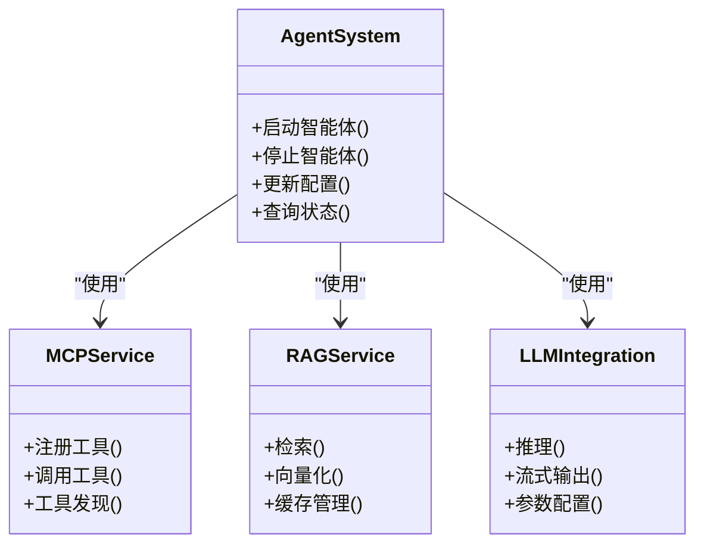
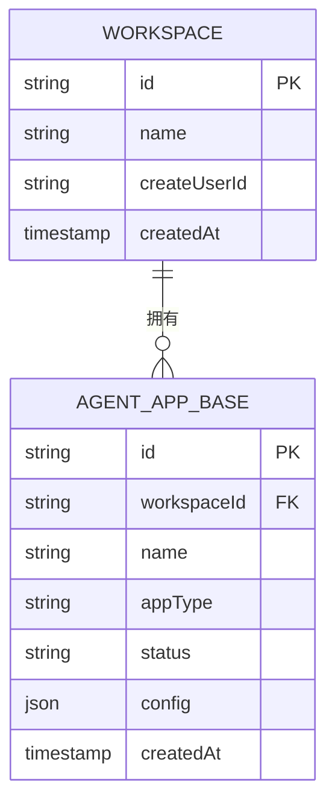
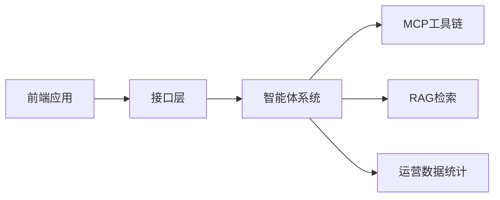

# 多智能体架构实践

<cite>
**本文引用的文件**
- [index.vue](file://【3】工作资料/code/仓颉智能体/nlp-frontend-web/src/views/workspace/pages/workApps/index.vue)
- [index.vue](file://【3】工作资料/code/仓颉智能体/nlp-frontend-web/src/views/workspace/pages/workApps/pages/index.vue)
- [interfaceData.ts](file://【3】工作资料/code/仓颉智能体/nlp-frontend-web/src/views/workspace/interfaceData.ts)
- [README.md](file://【3】工作资料/code/仓颉智能体/nlp-agent/README.md)
- [README.md](file://【3】工作资料/code/仓颉智能体/nlp-frontend-web/README.md)
- [README.md](file://【3】工作资料/仓颉项目系统功能文档梳理/2、仓颉智能体核心功能说明.md)
- [README.md](file://【3】工作资料/仓颉项目系统功能文档梳理/3、仓颉智能体平台 - 五大智能体类型简介.md)
- [README.md](file://【3】工作资料/仓颉项目系统功能文档梳理/13、MCP 工具调用机制.md)
- [README.md](file://【3】工作资料/仓颉项目系统功能文档梳理/14、RAG 检索流程.md.md)
- [README.md](file://【3】工作资料/仓颉项目系统功能文档梳理/17、运营数据统计机制.md)
- [README.md](file://【3】工作资料/仓颉项目系统功能文档梳理/18、常见问题与解决方案.md)
- [README.md](file://【3】工作资料/仓颉项目系统功能文档梳理/19、本地调试指南.md)
</cite>

## 目录
1. [引言](#引言)
2. [项目结构](#项目结构)
3. [核心组件](#核心组件)
4. [架构总览](#架构总览)
5. [详细组件分析](#详细组件分析)
6. [依赖分析](#依赖分析)
7. [性能考虑](#性能考虑)
8. [故障排查指南](#故障排查指南)
9. [结论](#结论)
10. [附录](#附录)

## 引言
本技术文档围绕LangGraph在多智能体架构中的实践展开，结合“仓颉智能体”项目提供的前端界面、应用编排能力与后端智能体系统，系统化阐述多智能体的协作机制、通信协议、协调策略与工程落地方法。文档覆盖任务分配、资源调度、冲突解决、性能优化、可扩展性设计与监控管理，并给出面向智能客服、自动化决策等业务场景的最佳实践与常见挑战的解决方案。

## 项目结构
“仓颉智能体”项目由前端Web应用与后端智能体系统两大部分组成，前端负责应用编排、可视化工作流与智能体配置，后端提供智能体运行时与工具链支撑。整体采用前后端分离架构，前端通过HTTP接口与后端交互，支持多种应用类型（知识问答、智能问数、对话流、工作流、智能体等），其中“智能体”类型在前端页面中预留了扩展点。

**图表来源**
- [index.vue:169-177](file://【3】工作资料/code/仓颉智能体/nlp-frontend-web/src/views/workspace/pages/workApps/index.vue#L169-L177)
- [index.vue:226-251](file://【3】工作资料/code/仓颉智能体/nlp-frontend-web/src/views/workspace/pages/workApps/pages/index.vue#L226-L251)
- [interfaceData.ts:7-22](file://【3】工作资料/code/仓颉智能体/nlp-frontend-web/src/views/workspace/interfaceData.ts#L7-L22)
- [README.md](file://【3】工作资料/code/仓颉智能体/nlp-agent/README.md)

**章节来源**
- [index.vue:169-177](file://【3】工作资料/code/仓颉智能体/nlp-frontend-web/src/views/workspace/pages/workApps/index.vue#L169-L177)
- [index.vue:226-251](file://【3】工作资料/code/仓颉智能体/nlp-frontend-web/src/views/workspace/pages/workApps/pages/index.vue#L226-L251)
- [interfaceData.ts](file://【3】工作资料/code/仓颉智能体/nlp-agent/README.md)

## 核心组件
- 前端工作区与应用管理：提供应用类型筛选、发布/下架、复制、导出等操作入口，支持不同应用类型的差异化校验与发布流程。
- 应用配置与编排：支持工作流与智能体配置的可视化编辑、参数保存、BPMN转换与序列化，便于跨应用共享与复用。
- 后端智能体系统：提供智能体生命周期管理、工具调用（MCP）、RAG检索、持久化与可观测性等能力，支撑复杂多智能体协作。
- 接口层：统一的HTTP接口定义，封装工作区、应用、智能体等资源的增删改查与发布状态变更。

**章节来源**
- [index.vue:169-177](file://【3】工作资料/code/仓颉智能体/nlp-frontend-web/src/views/workspace/pages/workApps/index.vue#L169-L177)
- [index.vue:226-251](file://【3】工作资料/code/仓颉智能体/nlp-frontend-web/src/views/workspace/pages/workApps/pages/index.vue#L226-L251)
- [interfaceData.ts](file://【3】工作资料/code/仓颉智能体/nlp-agent/README.md)

## 架构总览
多智能体系统以“前端编排 + 后端执行”的分层架构为核心，前端负责可视化配置与发布，后端负责智能体运行、工具调用与数据检索。系统通过接口层解耦，支持横向扩展与插件化接入。

**图表来源**
- [index.vue:169-177](file://【3】工作资料/code/仓颉智能体/nlp-frontend-web/src/views/workspace/pages/workApps/index.vue#L169-L177)
- [index.vue:226-251](file://【3】工作资料/code/仓颉智能体/nlp-frontend-web/src/views/workspace/pages/workApps/pages/index.vue#L226-L251)
- [interfaceData.ts](file://【3】工作资料/code/仓颉智能体/nlp-agent/README.md)
- [README.md](file://【3】工作资料/仓颉项目系统功能文档梳理/13、MCP 工具调用机制.md)
- [README.md](file://【3】工作资料/仓颉项目系统功能文档梳理/14、RAG 检索流程.md.md)

## 详细组件分析

### 组件A：前端应用类型与发布流程
该组件负责应用类型的选择与发布动作的触发，包含对不同类型应用的前置校验与发布状态变更逻辑。对于“智能体”类型，前端预留了扩展分支，便于后续接入LangGraph等多智能体编排能力。

**图表来源**
- [index.vue:359-423](file://【3】工作资料/code/仓颉智能体/nlp-frontend-web/src/views/workspace/pages/workApps/index.vue#L359-L423)
- [interfaceData.ts](file://【3】工作资料/code/仓颉智能体/nlp-agent/README.md)

**章节来源**
- [index.vue:359-423](file://【3】工作资料/code/仓颉智能体/nlp-frontend-web/src/views/workspace/pages/workApps/index.vue#L359-L423)
- [interfaceData.ts](file://【3】工作资料/code/仓颉智能体/nlp-agent/README.md)

### 组件B：智能体配置与编排（工作流/智能体）
该组件负责将可视化图形转换为可执行的工作流或智能体配置，支持BPMN序列化、参数保存与版本管理。该流程为LangGraph多智能体协作提供了基础载体。

**图表来源**
- [index.vue:226-251](file://【3】工作资料/code/仓颉智能体/nlp-frontend-web/src/views/workspace/pages/workApps/pages/index.vue#L226-L251)
- [index.vue:245-248](file://【3】工作资料/code/仓颉智能体/nlp-frontend-web/src/views/workspace/pages/workApps/pages/index.vue#L245-L248)

**章节来源**
- [index.vue:226-251](file://【3】工作资料/code/仓颉智能体/nlp-frontend-web/src/views/workspace/pages/workApps/pages/index.vue#L226-L251)

### 组件C：后端智能体系统（智能体生命周期与工具链）
后端智能体系统提供智能体生命周期管理、工具调用（MCP）、RAG检索与可观测性能力。这些能力为多智能体协作提供基础设施，支持复杂任务分解与跨智能体通信。

**图表来源**
- [README.md](file://【3】工作资料/code/仓颉智能体/nlp-agent/README.md)
- [README.md](file://【3】工作资料/仓颉项目系统功能文档梳理/13、MCP 工具调用机制.md)
- [README.md](file://【3】工作资料/仓颉项目系统功能文档梳理/14、RAG 检索流程.md.md)

**章节来源**
- [README.md](file://【3】工作资料/code/仓颉智能体/nlp-agent/README.md)
- [README.md](file://【3】工作资料/仓颉项目系统功能文档梳理/13、MCP 工具调用机制.md)
- [README.md](file://【3】工作资料/仓颉项目系统功能文档梳理/14、RAG 检索流程.md.md)

### 组件D：接口层与数据契约
接口层统一定义工作区、应用、智能体等资源的操作接口，确保前后端一致的数据契约与错误处理策略，为多智能体系统的可扩展性与可观测性奠定基础。

**图表来源**
- [interfaceData.ts](file://【3】工作资料/code/仓颉智能体/nlp-agent/README.md)

**章节来源**
- [interfaceData.ts](file://【3】工作资料/code/仓颉智能体/nlp-agent/README.md)

## 依赖分析
- 前端依赖后端接口层，通过HTTP协议进行数据交换；应用页对不同应用类型进行差异化处理，体现低耦合高内聚的设计。
- 后端智能体系统内部依赖MCP工具链与RAG检索模块，形成清晰的职责边界；LLM集成作为通用能力被多个模块复用。
- 运营数据统计与监控机制贯穿前后端，保障系统运行质量与可追踪性。

**图表来源**
- [index.vue:169-177](file://【3】工作资料/code/仓颉智能体/nlp-frontend-web/src/views/workspace/pages/workApps/index.vue#L169-L177)
- [README.md](file://【3】工作资料/仓颉项目系统功能文档梳理/17、运营数据统计机制.md)

**章节来源**
- [index.vue:169-177](file://【3】工作资料/code/仓颉智能体/nlp-frontend-web/src/views/workspace/pages/workApps/index.vue#L169-L177)
- [README.md](file://【3】工作资料/仓颉项目系统功能文档梳理/17、运营数据统计机制.md)

## 性能考虑
- 前端渲染与交互：通过虚拟滚动、节流与防抖减少重绘与请求频率；对大图形数据采用增量更新策略。
- 接口层与后端：对高频接口启用缓存与限流；对长耗时任务采用异步处理与进度上报。
- 智能体执行：合理设置并发度与队列优先级，避免资源争用；对工具调用与RAG检索引入超时与重试策略。
- 数据与存储：对配置与日志进行分层存储，定期归档；对向量库与缓存进行容量规划与淘汰策略。

## 故障排查指南
- 发布失败：检查应用配置完整性（如数据源、提示语等），确认接口返回状态与错误信息，必要时回滚到上一个稳定版本。
- 工具调用异常：核对MCP工具注册状态与权限，检查网络连通性与超时设置，查看工具调用日志定位问题。
- RAG检索异常：验证向量化模型与索引状态，检查检索参数与阈值设置，关注缓存命中率与延迟指标。
- 运营数据缺失：核对埋点上报链路与数据聚合任务，确认指标采集周期与存储分区策略。

**章节来源**
- [README.md](file://【3】工作资料/仓颉项目系统功能文档梳理/18、常见问题与解决方案.md)
- [README.md](file://【3】工作资料/仓颉项目系统功能文档梳理/19、本地调试指南.md)

## 结论
“仓颉智能体”项目通过前后端协同与后端智能体系统的能力，为LangGraph多智能体架构提供了可扩展、可观测且易于维护的工程化基础。结合本文的架构设计、组件分析与最佳实践，可在智能客服、自动化决策等场景中高效落地多智能体协作方案，并持续优化性能与稳定性。

## 附录
- 项目文档与使用指南：参见各模块README与功能梳理文档。
- 本地开发与调试：参考本地调试指南，按步骤搭建环境并运行前端与后端服务。
- 常见问题与解决方案：针对发布、工具调用、RAG检索与监控等场景提供排查思路与处理建议。

**章节来源**
- [README.md](file://【3】工作资料/仓颉项目系统功能文档梳理/19、本地调试指南.md)
- [README.md](file://【3】工作资料/仓颉项目系统功能文档梳理/18、常见问题与解决方案.md)