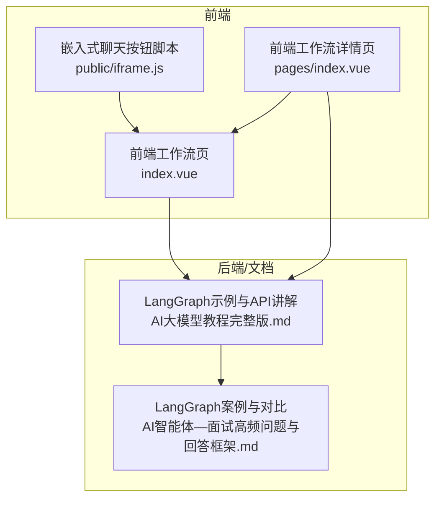
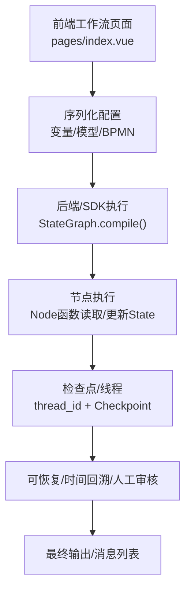
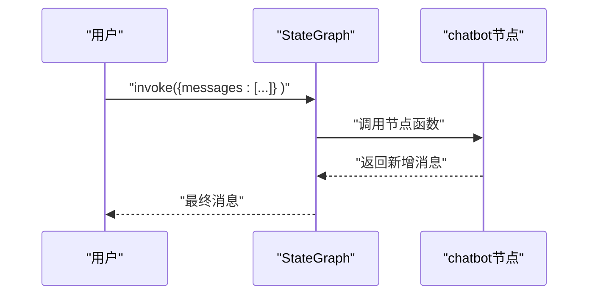
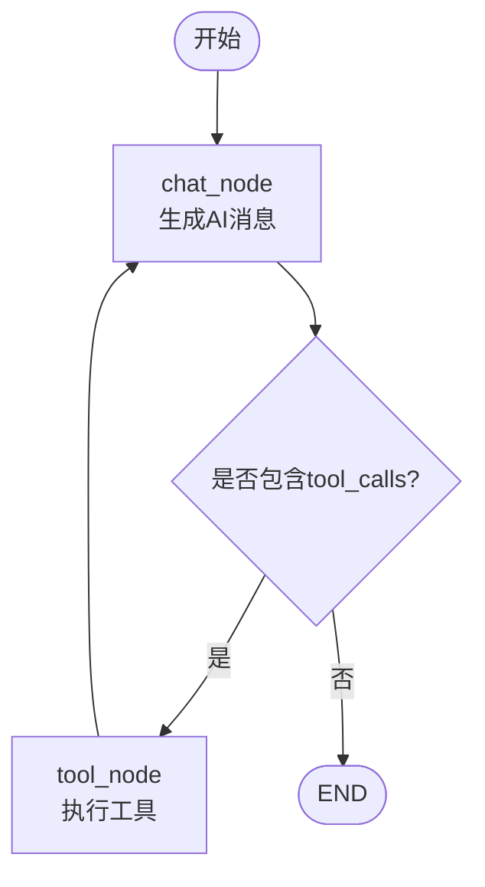
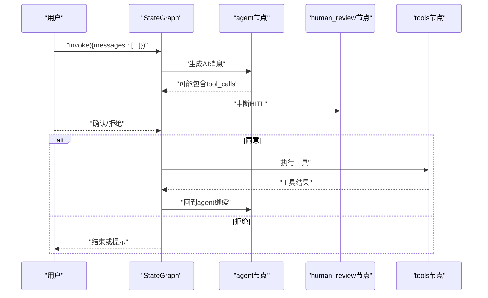
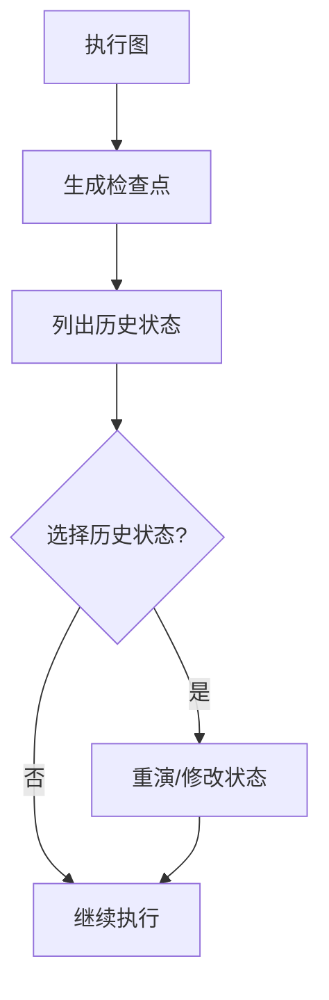
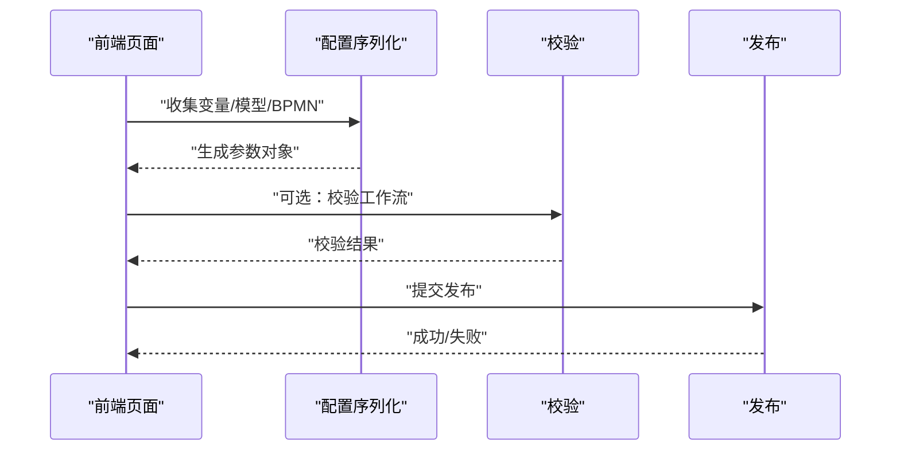
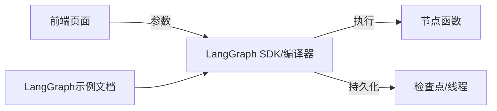

# 底层API构建图

<cite>
**本文引用的文件**
- [AI大模型教程完整版.md](file://【0】AI大模型教程（指导手册）\AI大模型教程完整版.md)
- [AI智能体—面试高频问题与回答框架.md](file://7、AI智能体—面试高频问题与回答框架.md)
- [index.vue](file://【3】工作资料\code\仓颉智能体\nlp-frontend-web\src\views\workspace\pages\workApps\index.vue)
- [index.vue](file://【3】工作资料\code\仓颉智能体\nlp-frontend-web\src\views\workspace\pages\workApps\pages\index.vue)
- [iframe.js](file://【3】工作资料\code\仓颉智能体\nlp-frontend-web\public\iframe.js)
</cite>

## 目录
1. [引言](#引言)
2. [项目结构](#项目结构)
3. [核心组件](#核心组件)
4. [架构总览](#架构总览)
5. [详细组件分析](#详细组件分析)
6. [依赖分析](#依赖分析)
7. [性能考量](#性能考量)
8. [故障排查指南](#故障排查指南)
9. [结论](#结论)
10. [附录](#附录)

## 引言
本技术文档围绕LangGraph底层API构建“图”（Graph）的核心能力展开，系统讲解如何使用StateGraph、节点（Node）、边（Edge）、条件边（Conditional Edge）、状态（State）、检查点（Checkpoint）与人类在环（HITL）等机制，搭建可扩展、可观测、可恢复的复杂智能体与工作流。文档同时结合项目中“工作流/对话流/智能体”等前端页面与流程编排能力，给出从简单到复杂的构建案例与最佳实践。

## 项目结构
本仓库包含LangGraph相关示例与前端工作流编排界面。与LangGraph底层API最相关的知识来源集中在LangChain教程文档中，覆盖从基础聊天机器人、工具调用、条件路由、人工审核、检查点与时间回溯等主题。前端工程提供了工作流配置、变量与模型配置的保存与发布流程，便于将前端编排的图结构落地到后端执行。

**图表来源**
- [index.vue:154-188](file://【3】工作资料\code\仓颉智能体\nlp-frontend-web\src\views\workspace\pages\workApps\index.vue#L154-L188)
- [index.vue:194-370](file://【3】工作资料\code\仓颉智能体\nlp-frontend-web\src\views\workspace\pages\workApps\pages\index.vue#L194-L370)
- [iframe.js:18-40](file://【3】工作资料\code\仓颉智能体\nlp-frontend-web\public\iframe.js#L18-L40)
- [AI大模型教程完整版.md:13360-13559](file://【0】AI大模型教程（指导手册）\AI大模型教程完整版.md#L13360-L13559)
- [AI智能体—面试高频问题与回答框架.md:960-997](file://7、AI智能体—面试高频问题与回答框架.md#L960-L997)

**章节来源**
- [index.vue:154-188](file://【3】工作资料\code\仓颉智能体\nlp-frontend-web\src\views\workspace\pages\workApps\index.vue#L154-L188)
- [index.vue:194-370](file://【3】工作资料\code\仓颉智能体\nlp-frontend-web\src\views\workspace\pages\workApps\pages\index.vue#L194-L370)
- [iframe.js:18-40](file://【3】工作资料\code\仓颉智能体\nlp-frontend-web\public\iframe.js#L18-L40)
- [AI大模型教程完整版.md:13360-13559](file://【0】AI大模型教程（指导手册）\AI大模型教程完整版.md#L13360-L13559)
- [AI智能体—面试高频问题与回答框架.md:960-997](file://7、AI智能体—面试高频问题与回答框架.md#L960-L997)

## 核心组件
- StateGraph：定义状态流转图，负责注册节点、边与条件边，最终compile得到可执行的图。
- 节点（Node）：绑定到处理函数，负责对状态进行读取与更新。
- 边（Edge）：连接节点，支持普通边与条件边（Conditional Edge）。
- 状态（State）：TypedDict或结构化字典，承载消息、变量、审核标志等。
- 检查点（Checkpoint）：保存中间状态，支持恢复、时间回溯与并发线程（thread_id）。
- 人类在环（HITL）：在关键节点中断，等待人工确认后再继续。
- 工具节点（ToolNode）：自动解析模型的tool_calls并执行工具。

**章节来源**
- [AI大模型教程完整版.md:14680-14879](file://【0】AI大模型教程（指导手册）\AI大模型教程完整版.md#L14680-L14879)
- [AI大模型教程完整版.md:14920-15119](file://【0】AI大模型教程（指导手册）\AI大模型教程完整版.md#L14920-L15119)
- [AI大模型教程完整版.md:15120-15319](file://【0】AI大模型教程（指导手册）\AI大模型教程完整版.md#L15120-L15319)
- [AI智能体—面试高频问题与回答框架.md:960-997](file://7、AI智能体—面试高频问题与回答框架.md#L960-L997)

## 架构总览
LangGraph底层API的执行架构由“状态驱动的节点图”构成：StateGraph定义节点与边，节点函数读取状态并返回增量更新，图在执行时维护状态快照并通过检查点持久化。前端工作流页面负责将图形化配置序列化为可执行的图结构参数，供后端或SDK执行。

**图表来源**
- [index.vue:226-251](file://【3】工作资料\code\仓颉智能体\nlp-frontend-web\src\views\workspace\pages\workApps\pages\index.vue#L226-L251)
- [AI大模型教程完整版.md:14680-14879](file://【0】AI大模型教程（指导手册）\AI大模型教程完整版.md#L14680-L14879)
- [AI大模型教程完整版.md:14920-15119](file://【0】AI大模型教程（指导手册）\AI大模型教程完整版.md#L14920-L15119)

## 详细组件分析

### 组件A：基础聊天机器人（无工具）
- 目标：演示StateGraph最小可用图，从START到节点再到END。
- 关键点：定义状态结构、节点函数、边连接、编译与执行。
- 典型流程：输入消息 → 节点生成回复 → 输出最终消息。

**图表来源**
- [AI大模型教程完整版.md:14783-14823](file://【0】AI大模型教程（指导手册）\AI大模型教程完整版.md#L14783-L14823)

**章节来源**
- [AI大模型教程完整版.md:14783-14823](file://【0】AI大模型教程（指导手册）\AI大模型教程完整版.md#L14783-L14823)

### 组件B：带工具调用的ReAct风格图
- 目标：模型决策是否调用工具，工具执行后回到模型继续对话。
- 关键点：ToolNode自动解析tool_calls；条件边根据是否有tool_calls路由；循环回到chat_node。
- 典型流程：用户输入 → chat_node生成AI消息（可能含tool_calls）→ tool_node执行 → chat_node继续。

**图表来源**
- [AI大模型教程完整版.md:14920-15119](file://【0】AI大模型教程（指导手册）\AI大模型教程完整版.md#L14920-L15119)

**章节来源**
- [AI大模型教程完整版.md:14920-15119](file://【0】AI大模型教程（指导手册）\AI大模型教程完整版.md#L14920-L15119)

### 组件C：人工审核（HITL）与中断
- 目标：在工具调用前插入人工确认，支持拒绝与继续。
- 关键点：interrupt_before在工具节点前中断；使用Command(resume=True/False)恢复；可更新状态跳过工具。
- 典型流程：模型生成tool_calls → 中断 → 人工确认 → 恢复或拒绝 → 继续或结束。

**图表来源**
- [AI大模型教程完整版.md:15069-15119](file://【0】AI大模型教程（指导手册）\AI大模型教程完整版.md#L15069-L15119)

**章节来源**
- [AI大模型教程完整版.md:15069-15119](file://【0】AI大模型教程（指导手册）\AI大模型教程完整版.md#L15069-L15119)

### 组件D：检查点与时间回溯
- 目标：保存中间状态，支持按thread_id恢复、按checkpoint_id回溯。
- 关键点：compile时传入checkpointer；get_state_history列出历史；update_state可修改历史状态。
- 典型流程：执行 → 保存检查点 → 列出历史 → 选择历史状态重演 → 修改状态后继续。

**图表来源**
- [AI大模型教程完整版.md:14680-14741](file://【0】AI大模型教程（指导手册）\AI大模型教程完整版.md#L14680-L14741)

**章节来源**
- [AI大模型教程完整版.md:14680-14741](file://【0】AI大模型教程（指导手册）\AI大模型教程完整版.md#L14680-L14741)

### 组件E：前端工作流编排与发布
- 目标：将前端图形化配置转换为可执行参数，支持保存与发布。
- 关键点：变量配置、模型配置、BPMN转换、校验与发布。
- 典型流程：编辑图形 → 保存/发布 → 参数序列化 → 校验 → 上报后端。

**图表来源**
- [index.vue:226-251](file://【3】工作资料\code\仓颉智能体\nlp-frontend-web\src\views\workspace\pages\workApps\pages\index.vue#L226-L251)
- [index.vue:194-370](file://【3】工作资料\code\仓颉智能体\nlp-frontend-web\src\views\workspace\pages\workApps\index.vue#L194-L370)

**章节来源**
- [index.vue:194-370](file://【3】工作资料\code\仓颉智能体\nlp-frontend-web\src\views\workspace\pages\workApps\pages\index.vue#L194-L370)
- [index.vue:154-188](file://【3】工作资料\code\仓颉智能体\nlp-frontend-web\src\views\workspace\pages\workApps\index.vue#L154-L188)

## 依赖分析
- 前端依赖LangGraph示例文档中的API与流程设计，将图形化配置映射为可执行参数。
- 文档中示例展示了StateGraph、ToolNode、MemorySaver、interrupt/Command等核心依赖。
- 前端页面通过工具函数与模型配置，将业务参数注入到图结构中。

**图表来源**
- [AI大模型教程完整版.md:14680-14879](file://【0】AI大模型教程（指导手册）\AI大模型教程完整版.md#L14680-L14879)
- [index.vue:226-251](file://【3】工作资料\code\仓颉智能体\nlp-frontend-web\src\views\workspace\pages\workApps\pages\index.vue#L226-L251)

**章节来源**
- [AI大模型教程完整版.md:14680-14879](file://【0】AI大模型教程（指导手册）\AI大模型教程完整版.md#L14680-L14879)
- [index.vue:226-251](file://【3】工作资料\code\仓颉智能体\nlp-frontend-web\src\views\workspace\pages\workApps\pages\index.vue#L226-L251)

## 性能考量
- 图结构复杂度：节点数量与边数量直接影响执行开销。建议将长流程拆分为子图或并行化可独立执行的分支。
- 状态体量：消息列表与变量越多，检查点越大。建议在节点内及时裁剪冗余消息，避免无限增长。
- 工具调用：工具执行可能阻塞，建议异步化与超时控制，必要时引入队列与重试。
- 检查点策略：频繁保存检查点会带来IO压力，建议批量保存或按关键节点保存。
- 并发与线程：thread_id隔离不同会话，避免共享状态竞争；合理设置并发上限。

## 故障排查指南
- 无法保存状态：确认compile时传入checkpointer；执行时提供configurable.thread_id。
- 中断无效：确保interrupt_before/after正确配置；恢复时使用Command(resume=True/False)。
- 工具调用失败：检查ToolNode绑定的工具列表与参数schema；在节点中捕获异常并返回可恢复消息。
- 状态不一致：使用update_state在历史点修正状态；通过get_state_history核对中间状态。
- 前端参数缺失：检查变量/模型/BPMN序列化逻辑；发布前执行vaildateWorkFlow。

**章节来源**
- [AI大模型教程完整版.md:14680-14741](file://【0】AI大模型教程（指导手册）\AI大模型教程完整版.md#L14680-L14741)
- [index.vue:249-251](file://【3】工作资料\code\仓颉智能体\nlp-frontend-web\src\views\workspace\pages\workApps\pages\index.vue#L249-L251)

## 结论
LangGraph底层API通过“状态+节点+边”的组合，提供了强大的可编程图能力。结合前端工作流编排，可将复杂的业务流程转化为可执行的图结构。实践中应重视状态管理、检查点策略、人工审核与工具调用的健壮性，并通过合理的性能优化与故障排查保障生产可用。

## 附录
- 从简单到复杂的构建案例可参考教程文档中的“最简单的聊天机器人”、“添加提示词与工具”、“添加HITL环节”、“添加时间回溯”等章节，逐步叠加条件边、人工审核与检查点能力。
- 前端页面支持保存与发布，参数包括变量、模型、BPMN等，发布前可执行工作流校验。

**章节来源**
- [AI大模型教程完整版.md:14783-14823](file://【0】AI大模型教程（指导手册）\AI大模型教程完整版.md#L14783-L14823)
- [AI大模型教程完整版.md:14920-15119](file://【0】AI大模型教程（指导手册）\AI大模型教程完整版.md#L14920-L15119)
- [AI大模型教程完整版.md:15120-15319](file://【0】AI大模型教程（指导手册）\AI大模型教程完整版.md#L15120-L15319)
- [index.vue:226-251](file://【3】工作资料\code\仓颉智能体\nlp-frontend-web\src\views\workspace\pages\workApps\pages\index.vue#L226-L251)