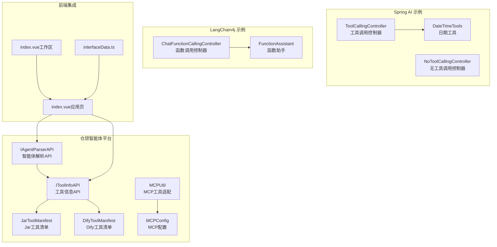
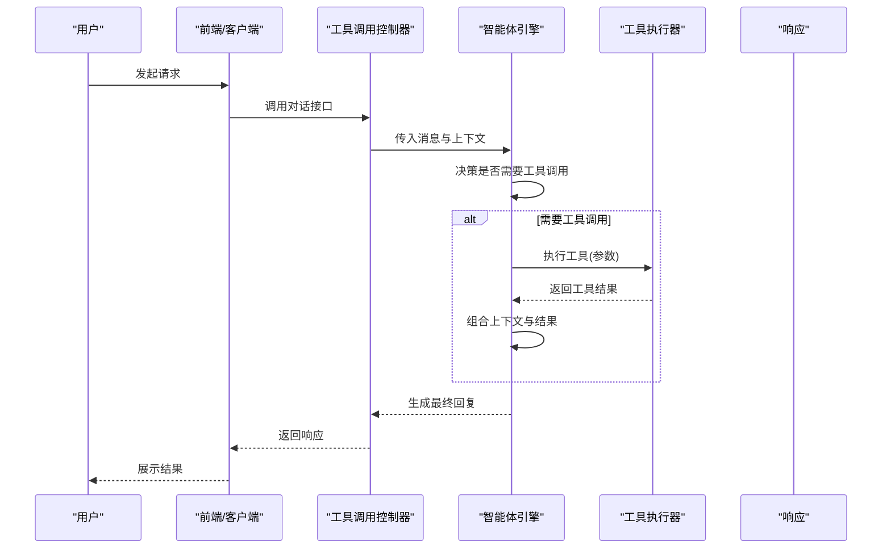
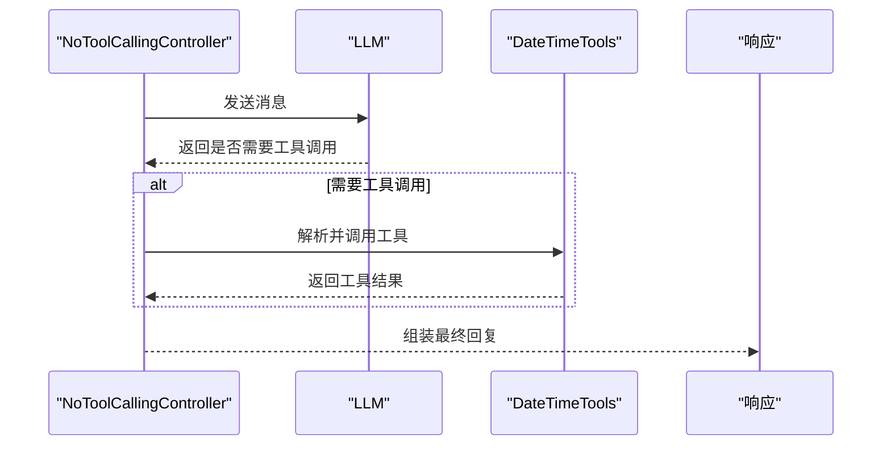
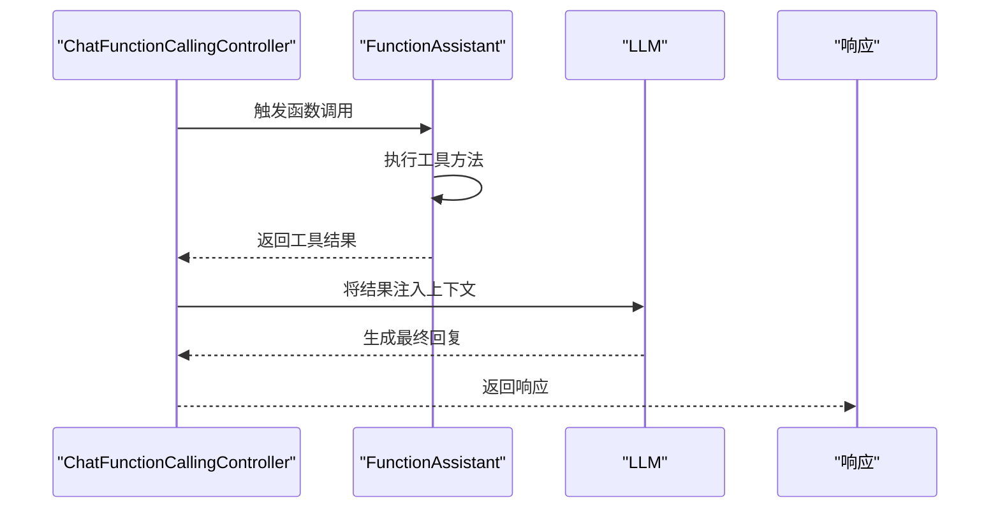
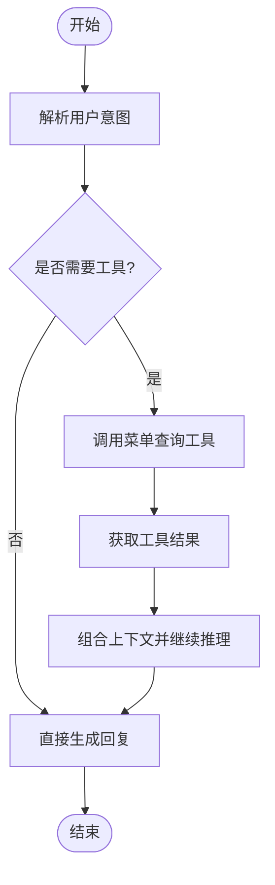
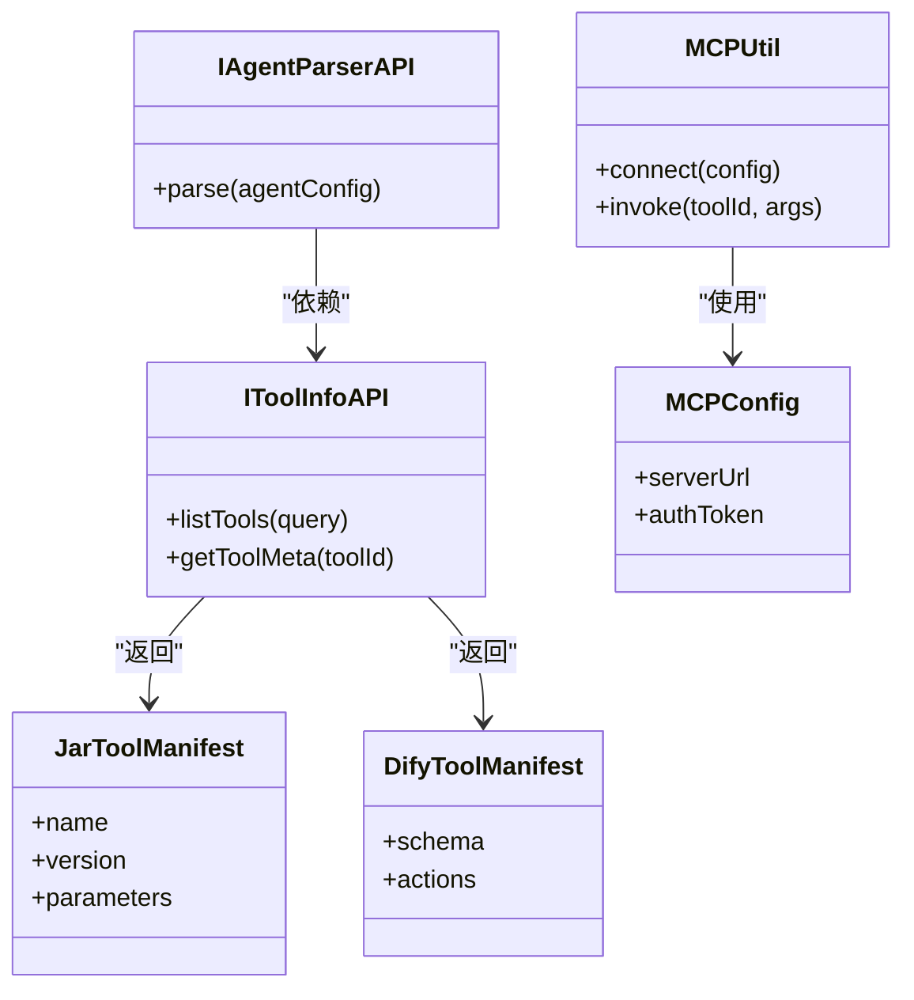
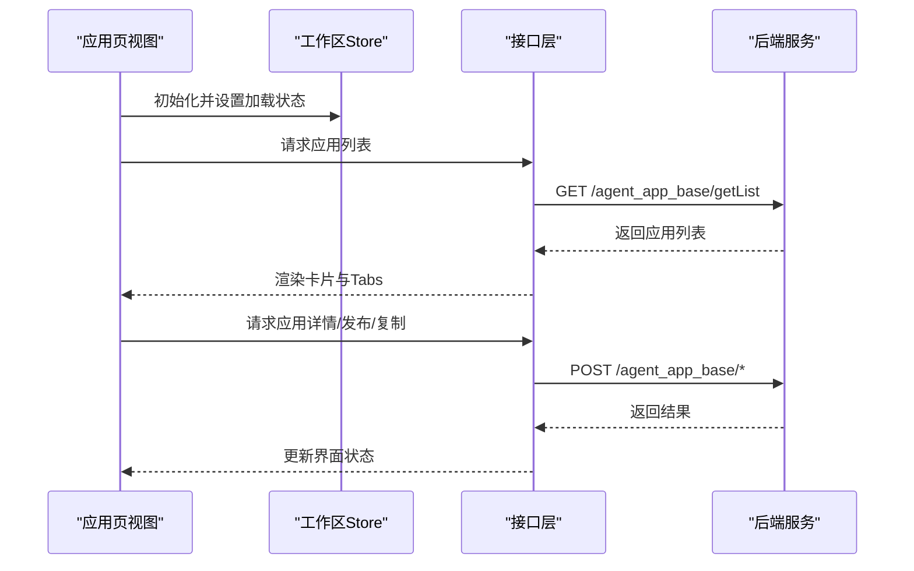
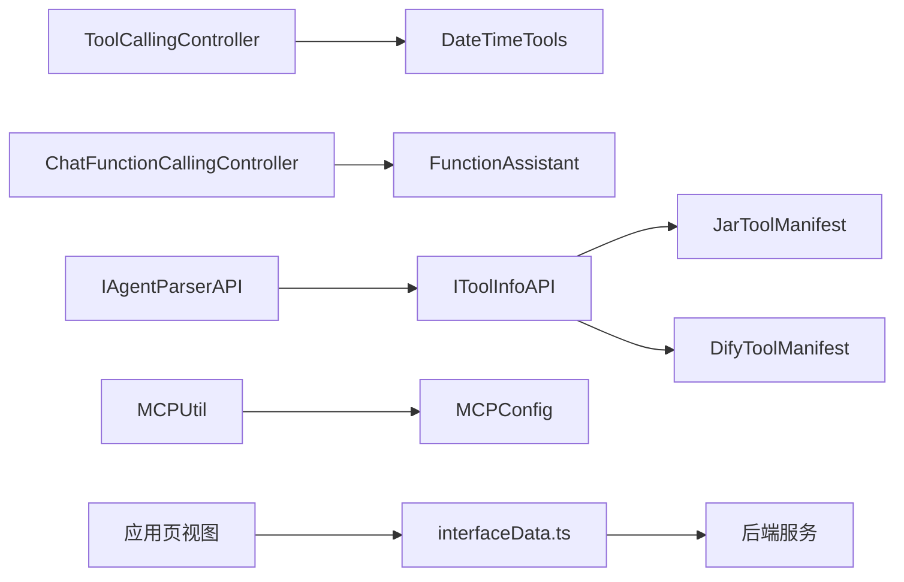

# 智能体与工具调用

<cite>
**本文引用的文件**
- [SAA-13ToolCallingController.java](file://【1】SpringAIAlibaba-atguiguV1/SAA-13ToolCalling/src/main/java/com/atguigu/study/controller/ToolCallingController.java)
- [SAA-13NoToolCallingController.java](file://【1】SpringAIAlibaba-atguiguV1/SAA-13ToolCalling/src/main/java/com/atguigu/study/controller/NoToolCallingController.java)
- [SAA-13DateTimeTools.java](file://【1】SpringAIAlibaba-atguiguV1/SAA-13ToolCalling/src/main/java/com/atguigu/study/utils/DateTimeTools.java)
- [SAA-11ChatFunctionCallingController.java](file://【2】langchain4j-atguiguV5/langchain4j-11chat-functioncalling/src/main/java/com/atguigu/study/controller/ChatFunctionCallingController.java)
- [SAA-11FunctionAssistant.java](file://【2】langchain4j-atguiguV5/langchain4j-11chat-functioncalling/src/main/java/com/atguigu/study/service/FunctionAssistant.java)
- [SAA-18MenuCallAgentController.java](file://【1】SpringAIAlibaba-atguiguV1/SAA-18TodayMenu/src/main/java/com/atguigu/study/controller/MenuCallAgentController.java)
- [IAgentParserAPI.java](file://【3】工作资料/code/仓颉智能体/nlp-agent/agent-builder/agent-build-api-local/src/main/java/com/yundingtech/agent/build/api/IAgentParserAPI.java)
- [IToolInfoAPI.java](file://【3】工作资料/code/仓颉智能体/nlp-agent/agent-builder/agent-build-api-local/src/main/java/com/yundingtech/agent/build/api/IToolInfoAPI.java)
- [JarToolManifest.java](file://【3】工作资料/code/仓颉智能体/nlp-agent/agent-builder/agent-build-api-model/src/main/java/com/yundingtech/agent/build/model/modules/tool/parser/JarToolManifest.java)
- [DifyToolManifest.java](file://【3】工作资料/code/仓颉智能体/nlp-agent/agent-builder/agent-build-api-model/src/main/java/com/yundingtech/agent/build/model/modules/tool/parser/DifyToolManifest.java)
- [MCPUtil.java](file://【3】工作资料/code/仓颉智能体/nlp-agent/agent-common/agent-model-adapter/src/main/java/com/yundingtech/agent/sdk/provider/springai/mcp/MCPUtil.java)
- [MCPConfig.java](file://【3】工作资料/code/仓颉智能体/nlp-agent/agent-common/agent-model-adapter/src/main/java/com/yundingtech/agent/sdk/common/model/request/MCPConfig.java)
- [index.vue（工作区）](file://【3】工作资料/code/仓颉智能体/nlp-frontend-web/src/views/workspace/index.vue)
- [index.vue（应用页）](file://【3】工作资料/code/仓颉智能体/nlp-frontend-web/src/views/workspace/pages/workApps/pages/index.vue)
- [interfaceData.ts](file://【3】工作资料/code/仓颉智能体/nlp-frontend-web/src/views/workspace/interfaceData.ts)
</cite>

## 目录
1. [引言](#引言)
2. [项目结构](#项目结构)
3. [核心组件](#核心组件)
4. [架构总览](#架构总览)
5. [详细组件分析](#详细组件分析)
6. [依赖分析](#依赖分析)
7. [性能考虑](#性能考虑)
8. [故障排查指南](#故障排查指南)
9. [结论](#结论)
10. [附录](#附录)

## 引言
本文件面向希望在LangGraph生态中构建“智能体 + 工具调用”能力的工程师与架构师，系统阐述以下主题：
- 如何在LangGraph中设计智能体：状态管理、交互机制、决策流程
- 工具调用的实现原理：工具注册、参数传递、结果处理
- 安全性、错误处理与性能优化策略
- 结合RAG与MCP集成的实际场景，给出最佳实践

本文件同时覆盖仓库中的多语言实现与前端集成样例，帮助读者在Spring AI与LangChain4j两条路径下完成端到端落地。

## 项目结构
本仓库包含三条主线：
- Spring AI 示例：演示基础对话、函数调用与工具调用的控制器与工具辅助类
- LangChain4j 示例：演示函数调用与智能体交互
- 仓颉智能体平台：后端工具与解析API、前端工作区与应用页集成

**图示来源**
- [SAA-13ToolCallingController.java:1-200](file://【1】SpringAIAlibaba-atguiguV1/SAA-13ToolCalling/src/main/java/com/atguigu/study/controller/ToolCallingController.java#L1-L200)
- [SAA-13NoToolCallingController.java:1-200](file://【1】SpringAIAlibaba-atguiguV1/SAA-13ToolCalling/src/main/java/com/atguigu/study/controller/NoToolCallingController.java#L1-L200)
- [SAA-13DateTimeTools.java:1-200](file://【1】SpringAIAlibaba-atguiguV1/SAA-13ToolCalling/src/main/java/com/atguigu/study/utils/DateTimeTools.java#L1-L200)
- [SAA-11ChatFunctionCallingController.java:1-200](file://【2】langchain4j-atguiguV5/langchain4j-11chat-functioncalling/src/main/java/com/atguigu/study/controller/ChatFunctionCallingController.java#L1-L200)
- [SAA-11FunctionAssistant.java:1-200](file://【2】langchain4j-atguiguV5/langchain4j-11chat-functioncalling/src/main/java/com/atguigu/study/service/FunctionAssistant.java#L1-L200)
- [IAgentParserAPI.java:1-200](file://【3】工作资料/code/仓颉智能体/nlp-agent/agent-builder/agent-build-api-local/src/main/java/com/yundingtech/agent/build/api/IAgentParserAPI.java#L1-L200)
- [IToolInfoAPI.java:1-200](file://【3】工作资料/code/仓颉智能体/nlp-agent/agent-builder/agent-build-api-local/src/main/java/com/yundingtech/agent/build/api/IToolInfoAPI.java#L1-L200)
- [JarToolManifest.java:1-200](file://【3】工作资料/code/仓颉智能体/nlp-agent/agent-builder/agent-build-api-model/src/main/java/com/yundingtech/agent/build/model/modules/tool/parser/JarToolManifest.java#L1-L200)
- [DifyToolManifest.java:1-200](file://【3】工作资料/code/仓颉智能体/nlp-agent/agent-builder/agent-build-api-model/src/main/java/com/yundingtech/agent/build/model/modules/tool/parser/DifyToolManifest.java#L1-L200)
- [MCPUtil.java:1-200](file://【3】工作资料/code/仓颉智能体/nlp-agent/agent-common/agent-model-adapter/src/main/java/com/yundingtech/agent/sdk/provider/springai/mcp/MCPUtil.java#L1-L200)
- [MCPConfig.java:1-200](file://【3】工作资料/code/仓颉智能体/nlp-agent/agent-common/agent-model-adapter/src/main/java/com/yundingtech/agent/sdk/common/model/request/MCPConfig.java#L1-L200)
- [index.vue（工作区）:1-250](file://【3】工作资料/code/仓颉智能体/nlp-frontend-web/src/views/workspace/index.vue#L1-L250)
- [index.vue（应用页）:1-450](file://【3】工作资料/code/仓颉智能体/nlp-frontend-web/src/views/workspace/pages/workApps/pages/index.vue#L1-L450)
- [interfaceData.ts:1-120](file://【3】工作资料/code/仓颉智能体/nlp-frontend-web/src/views/workspace/interfaceData.ts#L1-L120)

**章节来源**
- [SAA-13ToolCallingController.java:1-200](file://【1】SpringAIAlibaba-atguiguV1/SAA-13ToolCalling/src/main/java/com/atguigu/study/controller/ToolCallingController.java#L1-L200)
- [SAA-11ChatFunctionCallingController.java:1-200](file://【2】langchain4j-atguiguV5/langchain4j-11chat-functioncalling/src/main/java/com/atguigu/study/controller/ChatFunctionCallingController.java#L1-L200)

## 核心组件
- 工具调用控制器（Spring AI）：负责接收用户输入、路由到LLM、解析函数调用并执行工具
- 函数助手（LangChain4j）：封装工具方法，供LLM函数调用时调用
- 日期工具：提供时间格式化等辅助能力
- 智能体解析API与工具信息API：平台侧对工具清单与解析的抽象
- MCP工具适配与配置：连接外部MCP服务器，实现跨进程工具调用
- 前端工作区与应用页：承载智能体与工具的可视化编排与运行

**章节来源**
- [SAA-13ToolCallingController.java:1-200](file://【1】SpringAIAlibaba-atguiguV1/SAA-13ToolCalling/src/main/java/com/atguigu/study/controller/ToolCallingController.java#L1-L200)
- [SAA-11FunctionAssistant.java:1-200](file://【2】langchain4j-atguiguV5/langchain4j-11chat-functioncalling/src/main/java/com/atguigu/study/service/FunctionAssistant.java#L1-L200)
- [SAA-13DateTimeTools.java:1-200](file://【1】SpringAIAlibaba-atguiguV1/SAA-13ToolCalling/src/main/java/com/atguigu/study/utils/DateTimeTools.java#L1-L200)
- [IAgentParserAPI.java:1-200](file://【3】工作资料/code/仓颉智能体/nlp-agent/agent-builder/agent-build-api-local/src/main/java/com/yundingtech/agent/build/api/IAgentParserAPI.java#L1-L200)
- [IToolInfoAPI.java:1-200](file://【3】工作资料/code/仓颉智能体/nlp-agent/agent-builder/agent-build-api-local/src/main/java/com/yundingtech/agent/build/api/IToolInfoAPI.java#L1-L200)
- [MCPUtil.java:1-200](file://【3】工作资料/code/仓颉智能体/nlp-agent/agent-common/agent-model-adapter/src/main/java/com/yundingtech/agent/sdk/provider/springai/mcp/MCPUtil.java#L1-L200)
- [MCPConfig.java:1-200](file://【3】工作资料/code/仓颉智能体/nlp-agent/agent-common/agent-model-adapter/src/main/java/com/yundingtech/agent/sdk/common/model/request/MCPConfig.java#L1-L200)

## 架构总览
LangGraph智能体与工具调用的整体流程如下：
- 用户通过前端或API发起请求
- 控制器/处理器将消息与上下文交给智能体引擎
- 智能体根据状态与规则决定是否调用工具
- 工具执行完成后，结果回传给智能体进行后续推理
- 最终生成响应返回给用户

**图示来源**
- [SAA-13ToolCallingController.java:1-200](file://【1】SpringAIAlibaba-atguiguV1/SAA-13ToolCalling/src/main/java/com/atguigu/study/controller/ToolCallingController.java#L1-L200)
- [SAA-11ChatFunctionCallingController.java:1-200](file://【2】langchain4j-atguiguV5/langchain4j-11chat-functioncalling/src/main/java/com/atguigu/study/controller/ChatFunctionCallingController.java#L1-L200)

## 详细组件分析

### 组件A：工具调用控制器（Spring AI）
职责与流程要点：
- 接收HTTP请求，构造消息上下文
- 将消息交由LLM处理，解析是否需要工具调用
- 若需要，解析工具名与参数，调用对应工具
- 将工具结果回传LLM，生成最终回复

**图示来源**
- [SAA-13NoToolCallingController.java:1-200](file://【1】SpringAIAlibaba-atguiguV1/SAA-13ToolCalling/src/main/java/com/atguigu/study/controller/NoToolCallingController.java#L1-L200)
- [SAA-13DateTimeTools.java:1-200](file://【1】SpringAIAlibaba-atguiguV1/SAA-13ToolCalling/src/main/java/com/atguigu/study/utils/DateTimeTools.java#L1-L200)

**章节来源**
- [SAA-13ToolCallingController.java:1-200](file://【1】SpringAIAlibaba-atguiguV1/SAA-13ToolCalling/src/main/java/com/atguigu/study/controller/ToolCallingController.java#L1-L200)
- [SAA-13NoToolCallingController.java:1-200](file://【1】SpringAIAlibaba-atguiguV1/SAA-13ToolCalling/src/main/java/com/atguigu/study/controller/NoToolCallingController.java#L1-L200)
- [SAA-13DateTimeTools.java:1-200](file://【1】SpringAIAlibaba-atguiguV1/SAA-13ToolCalling/src/main/java/com/atguigu/study/utils/DateTimeTools.java#L1-L200)

### 组件B：函数调用助手（LangChain4j）
职责与流程要点：
- 封装可被LLM函数调用的工具方法
- 在控制器中触发函数调用，执行工具并返回结果
- 支持结构化输出与错误处理

**图示来源**
- [SAA-11ChatFunctionCallingController.java:1-200](file://【2】langchain4j-atguiguV5/langchain4j-11chat-functioncalling/src/main/java/com/atguigu/study/controller/ChatFunctionCallingController.java#L1-L200)
- [SAA-11FunctionAssistant.java:1-200](file://【2】langchain4j-atguiguV5/langchain4j-11chat-functioncalling/src/main/java/com/atguigu/study/service/FunctionAssistant.java#L1-L200)

**章节来源**
- [SAA-11ChatFunctionCallingController.java:1-200](file://【2】langchain4j-atguiguV5/langchain4j-11chat-functioncalling/src/main/java/com/atguigu/study/controller/ChatFunctionCallingController.java#L1-L200)
- [SAA-11FunctionAssistant.java:1-200](file://【2】langchain4j-atguiguV5/langchain4j-11chat-functioncalling/src/main/java/com/atguigu/study/service/FunctionAssistant.java#L1-L200)

### 组件C：菜单智能体调用（示例）
职责与流程要点：
- 通过控制器触发智能体流程，结合菜单查询等工具完成任务
- 适合演示“工具编排 + 智能体决策”的典型场景

**图示来源**
- [SAA-18MenuCallAgentController.java:1-200](file://【1】SpringAIAlibaba-atguiguV1/SAA-18TodayMenu/src/main/java/com/atguigu/study/controller/MenuCallAgentController.java#L1-L200)

**章节来源**
- [SAA-18MenuCallAgentController.java:1-200](file://【1】SpringAIAlibaba-atguiguV1/SAA-18TodayMenu/src/main/java/com/atguigu/study/controller/MenuCallAgentController.java#L1-L200)

### 组件D：平台侧工具与解析API
职责与流程要点：
- IAgentParserAPI：提供智能体解析能力的统一入口
- IToolInfoAPI：提供工具清单与元数据查询
- JarToolManifest / DifyToolManifest：工具清单模型，描述工具签名与参数
- MCPUtil / MCPConfig：MCP工具适配与配置，支持跨进程工具调用

**图示来源**
- [IAgentParserAPI.java:1-200](file://【3】工作资料/code/仓颉智能体/nlp-agent/agent-builder/agent-build-api-local/src/main/java/com/yundingtech/agent/build/api/IAgentParserAPI.java#L1-L200)
- [IToolInfoAPI.java:1-200](file://【3】工作资料/code/仓颉智能体/nlp-agent/agent-builder/agent-build-api-local/src/main/java/com/yundingtech/agent/build/api/IToolInfoAPI.java#L1-L200)
- [JarToolManifest.java:1-200](file://【3】工作资料/code/仓颉智能体/nlp-agent/agent-builder/agent-build-api-model/src/main/java/com/yundingtech/agent/build/model/modules/tool/parser/JarToolManifest.java#L1-L200)
- [DifyToolManifest.java:1-200](file://【3】工作资料/code/仓颉智能体/nlp-agent/agent-builder/agent-build-api-model/src/main/java/com/yundingtech/agent/build/model/modules/tool/parser/DifyToolManifest.java#L1-L200)
- [MCPUtil.java:1-200](file://【3】工作资料/code/仓颉智能体/nlp-agent/agent-common/agent-model-adapter/src/main/java/com/yundingtech/agent/sdk/provider/springai/mcp/MCPUtil.java#L1-L200)
- [MCPConfig.java:1-200](file://【3】工作资料/code/仓颉智能体/nlp-agent/agent-common/agent-model-adapter/src/main/java/com/yundingtech/agent/sdk/common/model/request/MCPConfig.java#L1-L200)

**章节来源**
- [IAgentParserAPI.java:1-200](file://【3】工作资料/code/仓颉智能体/nlp-agent/agent-builder/agent-build-api-local/src/main/java/com/yundingtech/agent/build/api/IAgentParserAPI.java#L1-L200)
- [IToolInfoAPI.java:1-200](file://【3】工作资料/code/仓颉智能体/nlp-agent/agent-builder/agent-build-api-local/src/main/java/com/yundingtech/agent/build/api/IToolInfoAPI.java#L1-L200)
- [JarToolManifest.java:1-200](file://【3】工作资料/code/仓颉智能体/nlp-agent/agent-builder/agent-build-api-model/src/main/java/com/yundingtech/agent/build/model/modules/tool/parser/JarToolManifest.java#L1-L200)
- [DifyToolManifest.java:1-200](file://【3】工作资料/code/仓颉智能体/nlp-agent/agent-builder/agent-build-api-model/src/main/java/com/yundingtech/agent/build/model/modules/tool/parser/DifyToolManifest.java#L1-L200)
- [MCPUtil.java:1-200](file://【3】工作资料/code/仓颉智能体/nlp-agent/agent-common/agent-model-adapter/src/main/java/com/yundingtech/agent/sdk/provider/springai/mcp/MCPUtil.java#L1-L200)
- [MCPConfig.java:1-200](file://【3】工作资料/code/仓颉智能体/nlp-agent/agent-common/agent-model-adapter/src/main/java/com/yundingtech/agent/sdk/common/model/request/MCPConfig.java#L1-L200)

### 组件E：前端工作区与应用页集成
职责与流程要点：
- 工作区页面：分页加载、筛选、标签管理
- 应用页：根据应用类型（知识问答、工作流、智能体等）渲染不同布局与配置
- 接口层：统一管理后端API，支持列表、详情、发布、复制等操作

**图示来源**
- [index.vue（应用页）:1-450](file://【3】工作资料/code/仓颉智能体/nlp-frontend-web/src/views/workspace/pages/workApps/pages/index.vue#L1-L450)
- [index.vue（工作区）:1-250](file://【3】工作资料/code/仓颉智能体/nlp-frontend-web/src/views/workspace/index.vue#L1-L250)
- [interfaceData.ts:1-120](file://【3】工作资料/code/仓颉智能体/nlp-frontend-web/src/views/workspace/interfaceData.ts#L1-L120)

**章节来源**
- [index.vue（应用页）:1-450](file://【3】工作资料/code/仓颉智能体/nlp-frontend-web/src/views/workspace/pages/workApps/pages/index.vue#L1-L450)
- [index.vue（工作区）:1-250](file://【3】工作资料/code/仓颉智能体/nlp-frontend-web/src/views/workspace/index.vue#L1-L250)
- [interfaceData.ts:1-120](file://【3】工作资料/code/仓颉智能体/nlp-frontend-web/src/views/workspace/interfaceData.ts#L1-L120)

## 依赖分析
- 控制器依赖：工具调用控制器依赖日期工具；LangChain4j控制器依赖函数助手
- 平台API依赖：智能体解析API依赖工具信息API；工具信息API依赖工具清单模型
- MCP依赖：MCP工具适配依赖MCP配置
- 前端依赖：应用页依赖接口层，接口层依赖后端服务

**图示来源**
- [SAA-13ToolCallingController.java:1-200](file://【1】SpringAIAlibaba-atguiguV1/SAA-13ToolCalling/src/main/java/com/atguigu/study/controller/ToolCallingController.java#L1-L200)
- [SAA-13DateTimeTools.java:1-200](file://【1】SpringAIAlibaba-atguiguV1/SAA-13ToolCalling/src/main/java/com/atguigu/study/utils/DateTimeTools.java#L1-L200)
- [SAA-11ChatFunctionCallingController.java:1-200](file://【2】langchain4j-atguiguV5/langchain4j-11chat-functioncalling/src/main/java/com/atguigu/study/controller/ChatFunctionCallingController.java#L1-L200)
- [SAA-11FunctionAssistant.java:1-200](file://【2】langchain4j-atguiguV5/langchain4j-11chat-functioncalling/src/main/java/com/atguigu/study/service/FunctionAssistant.java#L1-L200)
- [IAgentParserAPI.java:1-200](file://【3】工作资料/code/仓颉智能体/nlp-agent/agent-builder/agent-build-api-local/src/main/java/com/yundingtech/agent/build/api/IAgentParserAPI.java#L1-L200)
- [IToolInfoAPI.java:1-200](file://【3】工作资料/code/仓颉智能体/nlp-agent/agent-builder/agent-build-api-local/src/main/java/com/yundingtech/agent/build/api/IToolInfoAPI.java#L1-L200)
- [JarToolManifest.java:1-200](file://【3】工作资料/code/仓颉智能体/nlp-agent/agent-builder/agent-build-api-model/src/main/java/com/yundingtech/agent/build/model/modules/tool/parser/JarToolManifest.java#L1-L200)
- [DifyToolManifest.java:1-200](file://【3】工作资料/code/仓颉智能体/nlp-agent/agent-builder/agent-build-api-model/src/main/java/com/yundingtech/agent/build/model/modules/tool/parser/DifyToolManifest.java#L1-L200)
- [MCPUtil.java:1-200](file://【3】工作资料/code/仓颉智能体/nlp-agent/agent-common/agent-model-adapter/src/main/java/com/yundingtech/agent/sdk/provider/springai/mcp/MCPUtil.java#L1-L200)
- [MCPConfig.java:1-200](file://【3】工作资料/code/仓颉智能体/nlp-agent/agent-common/agent-model-adapter/src/main/java/com/yundingtech/agent/sdk/common/model/request/MCPConfig.java#L1-L200)
- [index.vue（应用页）:1-450](file://【3】工作资料/code/仓颉智能体/nlp-frontend-web/src/views/workspace/pages/workApps/pages/index.vue#L1-L450)
- [interfaceData.ts:1-120](file://【3】工作资料/code/仓颉智能体/nlp-frontend-web/src/views/workspace/interfaceData.ts#L1-L120)

**章节来源**
- [SAA-13ToolCallingController.java:1-200](file://【1】SpringAIAlibaba-atguiguV1/SAA-13ToolCalling/src/main/java/com/atguigu/study/controller/ToolCallingController.java#L1-L200)
- [SAA-11ChatFunctionCallingController.java:1-200](file://【2】langchain4j-atguiguV5/langchain4j-11chat-functioncalling/src/main/java/com/atguigu/study/controller/ChatFunctionCallingController.java#L1-L200)
- [IAgentParserAPI.java:1-200](file://【3】工作资料/code/仓颉智能体/nlp-agent/agent-builder/agent-build-api-local/src/main/java/com/yundingtech/agent/build/api/IAgentParserAPI.java#L1-L200)
- [IToolInfoAPI.java:1-200](file://【3】工作资料/code/仓颉智能体/nlp-agent/agent-builder/agent-build-api-local/src/main/java/com/yundingtech/agent/build/api/IToolInfoAPI.java#L1-L200)
- [MCPUtil.java:1-200](file://【3】工作资料/code/仓颉智能体/nlp-agent/agent-common/agent-model-adapter/src/main/java/com/yundingtech/agent/sdk/provider/springai/mcp/MCPUtil.java#L1-L200)
- [index.vue（应用页）:1-450](file://【3】工作资料/code/仓颉智能体/nlp-frontend-web/src/views/workspace/pages/workApps/pages/index.vue#L1-L450)
- [interfaceData.ts:1-120](file://【3】工作资料/code/仓颉智能体/nlp-frontend-web/src/views/workspace/interfaceData.ts#L1-L120)

## 性能考虑
- 工具调用批量化：合并多次小工具调用，减少往返开销
- 缓存策略：对工具结果与LLM上下文进行缓存，避免重复计算
- 异步执行：工具执行耗时较长时采用异步回调，提升响应速度
- 参数校验前置：在进入工具前进行参数校验，降低无效调用概率
- 连接池与超时：MCP连接与后端接口应配置合理的连接池与超时策略

## 故障排查指南
- 工具未找到：检查工具清单与工具ID是否匹配，确认工具注册与元数据正确
- 参数不合法：核对工具参数Schema，确保类型与必填项满足要求
- MCP连接失败：检查MCP服务器地址与鉴权配置，确认网络连通性
- 前端接口异常：查看接口层返回状态与错误信息，定位后端服务问题
- 日志与追踪：为工具调用与智能体推理过程打点，便于定位问题

**章节来源**
- [SAA-13ToolCallingController.java:1-200](file://【1】SpringAIAlibaba-atguiguV1/SAA-13ToolCalling/src/main/java/com/atguigu/study/controller/ToolCallingController.java#L1-L200)
- [SAA-11ChatFunctionCallingController.java:1-200](file://【2】langchain4j-atguiguV5/langchain4j-11chat-functioncalling/src/main/java/com/atguigu/study/controller/ChatFunctionCallingController.java#L1-L200)
- [MCPUtil.java:1-200](file://【3】工作资料/code/仓颉智能体/nlp-agent/agent-common/agent-model-adapter/src/main/java/com/yundingtech/agent/sdk/provider/springai/mcp/MCPUtil.java#L1-L200)
- [interfaceData.ts:1-120](file://【3】工作资料/code/仓颉智能体/nlp-frontend-web/src/views/workspace/interfaceData.ts#L1-L120)

## 结论
通过上述组件与流程，LangGraph智能体与工具调用得以在多语言与多平台环境下稳定运行。建议在生产环境中强化安全与可观测性，完善工具注册与版本管理，并结合前端工作区实现可视化编排与运维。

## 附录
- 实战场景建议
  - RAG应用：将检索与生成作为工具，配合智能体进行多轮对话与上下文管理
  - MCP集成：通过MCP工具适配器接入外部服务，实现跨进程工具复用
  - 安全加固：对工具参数进行白名单校验，限制工具调用频次与并发度
  - 错误恢复：为工具调用与LLM推理设置重试与降级策略，保障可用性