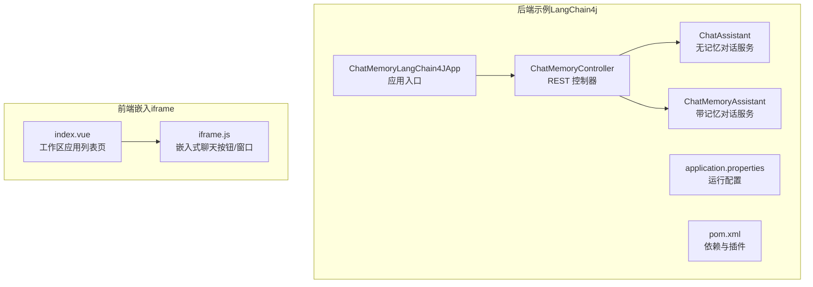
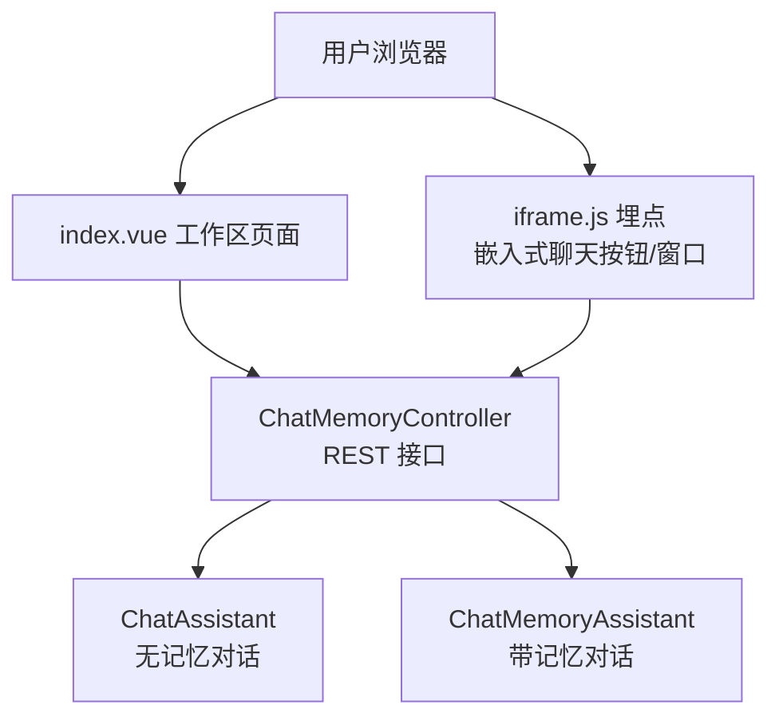
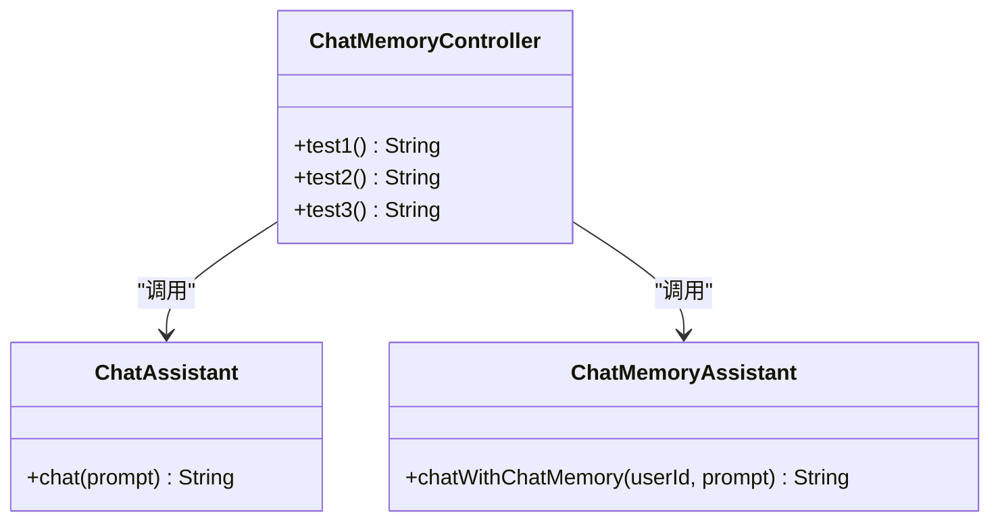
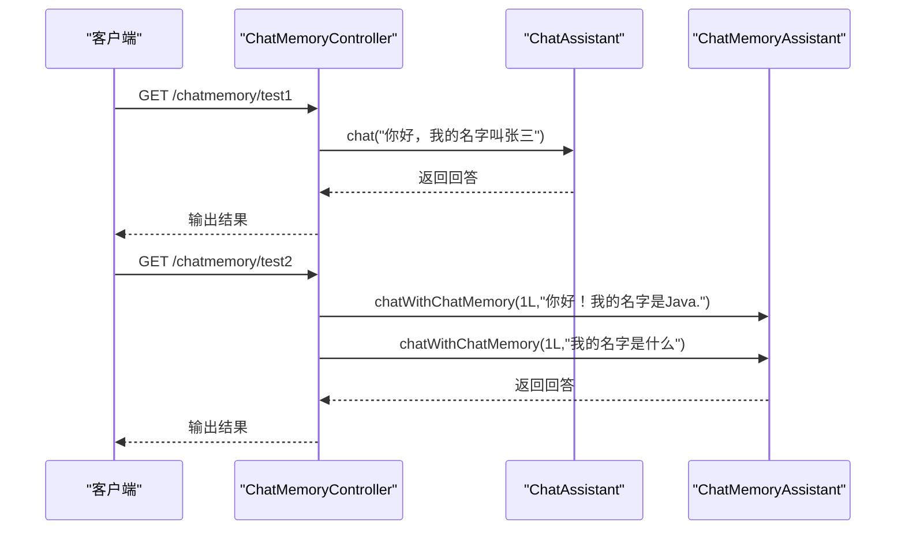
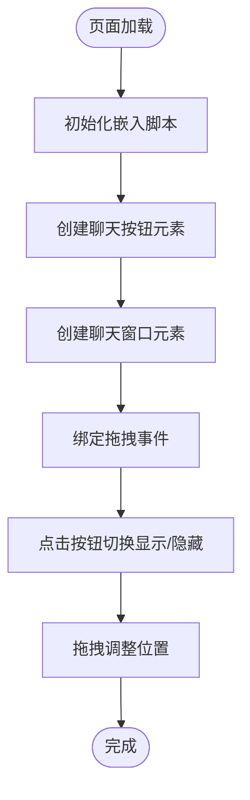
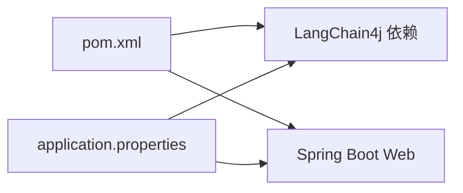

# 智能体记忆与多轮对话

<cite>
**本文引用的文件**
- [ChatMemoryLangChain4JApp.java](file://【2】langchain4j-atguiguV5/langchain4j-08chat-memory/src/main/java/com/atguigu/study/ChatMemoryLangChain4JApp.java)
- [ChatMemoryController.java](file://【2】langchain4j-atguiguV5/langchain4j-08chat-memory/src/main/java/com/atguigu/study/controller/ChatMemoryController.java)
- [ChatAssistant.java](file://【2】langchain4j-atguiguV5/langchain4j-08chat-memory/src/main/java/com/atguigu/study/service/ChatAssistant.java)
- [ChatMemoryAssistant.java](file://【2】langchain4j-atguiguV5/langchain4j-08chat-memory/src/main/java/com/atguigu/study/service/ChatMemoryAssistant.java)
- [application.properties](file://【2】langchain4j-atguiguV5/langchain4j-08chat-memory/src/main/resources/application.properties)
- [pom.xml](file://【2】langchain4j-atguiguV5/langchain4j-08chat-memory/pom.xml)
- [index.vue](file://【3】工作资料/code/仓颉智能体/nlp-frontend-web/src/views/workspace/pages/workApps/pages/index.vue)
- [iframe.js](file://【3】工作资料/code/仓颉智能体/nlp-frontend-web/public/iframe.js)
</cite>

## 目录
1. [引言](#引言)
2. [项目结构](#项目结构)
3. [核心组件](#核心组件)
4. [架构总览](#架构总览)
5. [详细组件分析](#详细组件分析)
6. [依赖分析](#依赖分析)
7. [性能考虑](#性能考虑)
8. [故障排查指南](#故障排查指南)
9. [结论](#结论)
10. [附录](#附录)

## 引言
本文件围绕“智能体记忆与多轮对话”主题，系统性阐述短期记忆、长期记忆与上下文管理的设计原理与实现方法，并结合仓库中的 LangChain4j 示例工程与前端嵌入能力，给出可落地的多轮对话处理机制、会话管理策略、持久化与缓存方案以及性能优化建议。同时提供面向客服系统、教育辅导等场景的最佳实践与常见问题解决方案。

## 项目结构
本仓库包含两部分与“智能体记忆与多轮对话”直接相关的关键资产：
- 后端示例工程：基于 LangChain4j 的聊天记忆实现，演示消息窗口与令牌窗口两种记忆策略。
- 前端嵌入能力：提供 iframe 嵌入式聊天机器人入口，支持拖拽、尺寸自定义与默认展开等交互。

**图表来源**
- [ChatMemoryLangChain4JApp.java:1-19](file://【2】langchain4j-atguiguV5/langchain4j-08chat-memory/src/main/java/com/atguigu/study/ChatMemoryLangChain4JApp.java#L1-L19)
- [ChatMemoryController.java:1-91](file://【2】langchain4j-atguiguV5/langchain4j-08chat-memory/src/main/java/com/atguigu/study/controller/ChatMemoryController.java#L1-L91)
- [ChatAssistant.java:1-18](file://【2】langchain4j-atguiguV5/langchain4j-08chat-memory/src/main/java/com/atguigu/study/service/ChatAssistant.java#L1-L18)
- [ChatMemoryAssistant.java:1-23](file://【2】langchain4j-atguiguV5/langchain4j-08chat-memory/src/main/java/com/atguigu/study/service/ChatMemoryAssistant.java#L1-L23)
- [application.properties](file://【2】langchain4j-atguiguV5/langchain4j-08chat-memory/src/main/resources/application.properties)
- [pom.xml](file://【2】langchain4j-atguiguV5/langchain4j-08chat-memory/pom.xml)
- [index.vue:249-422](file://【3】工作资料/code/仓颉智能体/nlp-frontend-web/src/views/workspace/pages/workApps/pages/index.vue#L249-L422)
- [iframe.js:1-168](file://【3】工作资料/code/仓颉智能体/nlp-frontend-web/public/iframe.js#L1-L168)

**章节来源**
- [ChatMemoryLangChain4JApp.java:1-19](file://【2】langchain4j-atguiguV5/langchain4j-08chat-memory/src/main/java/com/atguigu/study/ChatMemoryLangChain4JApp.java#L1-L19)
- [ChatMemoryController.java:1-91](file://【2】langchain4j-atguiguV5/langchain4j-08chat-memory/src/main/java/com/atguigu/study/controller/ChatMemoryController.java#L1-L91)
- [ChatAssistant.java:1-18](file://【2】langchain4j-atguiguV5/langchain4j-08chat-memory/src/main/java/com/atguigu/study/service/ChatAssistant.java#L1-L18)
- [ChatMemoryAssistant.java:1-23](file://【2】langchain4j-atguiguV5/langchain4j-08chat-memory/src/main/java/com/atguigu/study/service/ChatMemoryAssistant.java#L1-L23)
- [application.properties](file://【2】langchain4j-atguiguV5/langchain4j-08chat-memory/src/main/resources/application.properties)
- [pom.xml](file://【2】langchain4j-atguiguV5/langchain4j-08chat-memory/pom.xml)
- [index.vue:249-422](file://【3】工作资料/code/仓颉智能体/nlp-frontend-web/src/views/workspace/pages/workApps/pages/index.vue#L249-L422)
- [iframe.js:1-168](file://【3】工作资料/code/仓颉智能体/nlp-frontend-web/public/iframe.js#L1-L168)

## 核心组件
- 应用入口：负责启动 Spring Boot 应用，承载后续控制器与服务。
- 控制器层：提供 REST 接口，分别调用普通对话服务与带记忆对话服务；演示消息窗口与令牌窗口两种记忆策略。
- 服务层：
  - 无记忆对话服务：面向一次性问答或无需上下文的场景。
  - 带记忆对话服务：通过注解驱动的方式，按用户维度维护短期记忆窗口。
- 配置与依赖：通过属性文件与 Maven POM 管理运行时配置与第三方依赖。

上述组件共同构成“短期记忆 + 多轮对话”的最小可用闭环：输入用户消息，经由带记忆的服务在内存中维护对话窗口，再返回模型生成的响应。

**章节来源**
- [ChatMemoryLangChain4JApp.java:1-19](file://【2】langchain4j-atguiguV5/langchain4j-08chat-memory/src/main/java/com/atguigu/study/ChatMemoryLangChain4JApp.java#L1-L19)
- [ChatMemoryController.java:1-91](file://【2】langchain4j-atguiguV5/langchain4j-08chat-memory/src/main/java/com/atguigu/study/controller/ChatMemoryController.java#L1-L91)
- [ChatAssistant.java:1-18](file://【2】langchain4j-atguiguV5/langchain4j-08chat-memory/src/main/java/com/atguigu/study/service/ChatAssistant.java#L1-L18)
- [ChatMemoryAssistant.java:1-23](file://【2】langchain4j-atguiguV5/langchain4j-08chat-memory/src/main/java/com/atguigu/study/service/ChatMemoryAssistant.java#L1-L23)
- [application.properties](file://【2】langchain4j-atguiguV5/langchain4j-08chat-memory/src/main/resources/application.properties)
- [pom.xml](file://【2】langchain4j-atguiguV5/langchain4j-08chat-memory/pom.xml)

## 架构总览
下图展示了从浏览器到后端服务，再到模型推理与记忆维护的整体链路，以及前端 iframe 嵌入式入口的交互方式。

**图表来源**
- [ChatMemoryController.java:1-91](file://【2】langchain4j-atguiguV5/langchain4j-08chat-memory/src/main/java/com/atguigu/study/controller/ChatMemoryController.java#L1-L91)
- [ChatAssistant.java:1-18](file://【2】langchain4j-atguiguV5/langchain4j-08chat-memory/src/main/java/com/atguigu/study/service/ChatAssistant.java#L1-L18)
- [ChatMemoryAssistant.java:1-23](file://【2】langchain4j-atguiguV5/langchain4j-08chat-memory/src/main/java/com/atguigu/study/service/ChatMemoryAssistant.java#L1-L23)
- [index.vue:249-422](file://【3】工作资料/code/仓颉智能体/nlp-frontend-web/src/views/workspace/pages/workApps/pages/index.vue#L249-L422)
- [iframe.js:1-168](file://【3】工作资料/code/仓颉智能体/nlp-frontend-web/public/iframe.js#L1-L168)

## 详细组件分析

### 组件一：短期记忆与多轮对话（LangChain4j）
该组件通过两个服务接口实现“是否带记忆”的差异化对话能力，并以消息窗口与令牌窗口两种策略控制记忆上限与成本。

- 无记忆对话服务：适合一次性问答或不需要上下文的场景，调用简单、开销低。
- 带记忆对话服务：通过注解指定记忆维度（如用户 ID），在内存中维护对话窗口，实现跨轮次的上下文延续。
- 控制器层：提供三条测试接口，分别对应无记忆、消息窗口记忆与令牌窗口记忆三种模式。

**图表来源**
- [ChatMemoryController.java:34-90](file://【2】langchain4j-atguiguV5/langchain4j-08chat-memory/src/main/java/com/atguigu/study/controller/ChatMemoryController.java#L34-L90)
- [ChatAssistant.java:11-18](file://【2】langchain4j-atguiguV5/langchain4j-08chat-memory/src/main/java/com/atguigu/study/service/ChatAssistant.java#L11-L18)
- [ChatMemoryAssistant.java:11-23](file://【2】langchain4j-atguiguV5/langchain4j-08chat-memory/src/main/java/com/atguigu/study/service/ChatMemoryAssistant.java#L11-L23)

**章节来源**
- [ChatMemoryController.java:1-91](file://【2】langchain4j-atguiguV5/langchain4j-08chat-memory/src/main/java/com/atguigu/study/controller/ChatMemoryController.java#L1-L91)
- [ChatAssistant.java:1-18](file://【2】langchain4j-atguiguV5/langchain4j-08chat-memory/src/main/java/com/atguigu/study/service/ChatAssistant.java#L1-L18)
- [ChatMemoryAssistant.java:1-23](file://【2】langchain4j-atguiguV5/langchain4j-08chat-memory/src/main/java/com/atguigu/study/service/ChatMemoryAssistant.java#L1-L23)

### 组件二：前端嵌入式聊天入口（iframe）
前端通过 iframe 注入方式提供聊天入口，支持拖拽、尺寸自定义与默认展开等交互行为，便于在业务页面内集成智能体对话能力。

**图表来源**
- [iframe.js:1-168](file://【3】工作资料/code/仓颉智能体/nlp-frontend-web/public/iframe.js#L1-L168)
- [index.vue:249-422](file://【3】工作资料/code/仓颉智能体/nlp-frontend-web/src/views/workspace/pages/workApps/pages/index.vue#L249-L422)

**章节来源**
- [iframe.js:1-168](file://【3】工作资料/code/仓颉智能体/nlp-frontend-web/public/iframe.js#L1-L168)
- [index.vue:249-422](file://【3】工作资料/code/仓颉智能体/nlp-frontend-web/src/views/workspace/pages/workApps/pages/index.vue#L249-L422)

## 依赖分析
- 运行时依赖：LangChain4j 服务注解与消息模型，Spring Boot Web 用于暴露 REST 接口。
- 配置项：通过属性文件集中管理运行参数（如模型地址、超时等）。
- 构建工具：Maven 管理依赖与打包，确保可移植性与可复现性。

**图表来源**
- [pom.xml](file://【2】langchain4j-atguiguV5/langchain4j-08chat-memory/pom.xml)
- [application.properties](file://【2】langchain4j-atguiguV5/langchain4j-08chat-memory/src/main/resources/application.properties)

**章节来源**
- [pom.xml](file://【2】langchain4j-atguiguV5/langchain4j-08chat-memory/pom.xml)
- [application.properties](file://【2】langchain4j-atguiguV5/langchain4j-08chat-memory/src/main/resources/application.properties)

## 性能考虑
- 记忆窗口策略
  - 消息窗口：按消息条数限制记忆长度，适合对轮次敏感但对字数不敏感的场景。
  - 令牌窗口：按 token 数限制记忆长度，更贴合模型上下文窗口与成本控制。
- 上下文压缩
  - 对长对话进行摘要或截断，避免超出模型上下文上限。
  - 使用分段记忆与外部检索增强（RAG）降低冗余上下文。
- 缓存与并发
  - 将用户级记忆缓存在进程内或分布式缓存中，减少重复计算。
  - 并发访问时注意线程安全与锁粒度，避免竞态条件。
- 前端体验
  - iframe 嵌入应避免阻塞主线程，采用异步加载与懒初始化。
  - 拖拽与尺寸调整需考虑边界约束与响应式布局。

## 故障排查指南
- 接口无法访问
  - 检查应用是否成功启动与端口占用情况。
  - 确认控制器映射路径与 HTTP 方法正确。
- 记忆未生效
  - 确认带记忆服务的注解参数（如用户 ID）传递正确。
  - 检查不同用户 ID 是否被隔离，避免交叉污染。
- 响应异常或超时
  - 检查模型服务连通性与鉴权配置。
  - 适当缩短记忆窗口或启用上下文压缩。
- 前端嵌入异常
  - 确认 iframe 脚本已正确注入且参数合法。
  - 检查页面样式与遮挡导致的交互失效。

**章节来源**
- [ChatMemoryController.java:34-90](file://【2】langchain4j-atguiguV5/langchain4j-08chat-memory/src/main/java/com/atguigu/study/controller/ChatMemoryController.java#L34-L90)
- [iframe.js:1-168](file://【3】工作资料/code/仓颉智能体/nlp-frontend-web/public/iframe.js#L1-L168)

## 结论
通过 LangChain4j 的服务注解与两种记忆窗口策略，可以低成本地实现“带记忆的多轮对话”。结合前端 iframe 嵌入能力，可在业务页面内无缝集成智能体对话。实践中应根据场景选择合适的记忆策略、实施上下文压缩与缓存优化，并关注并发与性能瓶颈，以获得稳定、可扩展的智能体记忆系统。

## 附录
- 最佳实践
  - 客服系统：使用消息窗口记忆，聚焦本轮与前一轮的上下文；对敏感信息进行脱敏与合规处理。
  - 教育辅导：使用令牌窗口记忆，平衡知识密度与成本；引入外部知识库（RAG）提升准确性。
- 常见问题
  - 记忆越积越多：启用自动截断与摘要，定期清理无效会话。
  - 用户间干扰：严格按用户 ID 隔离记忆，避免共享。
  - 前端卡顿：延迟加载与懒初始化，减少 DOM 操作频率。