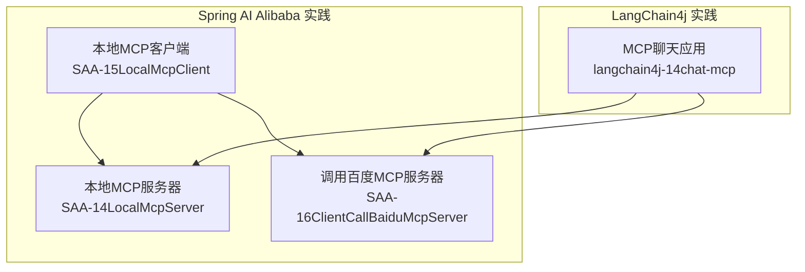
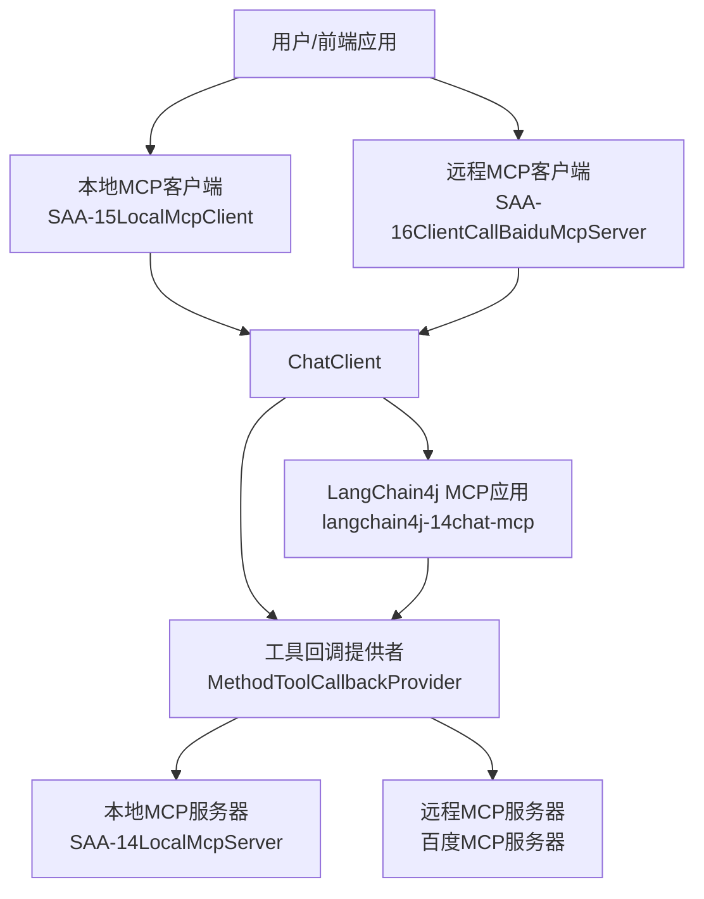
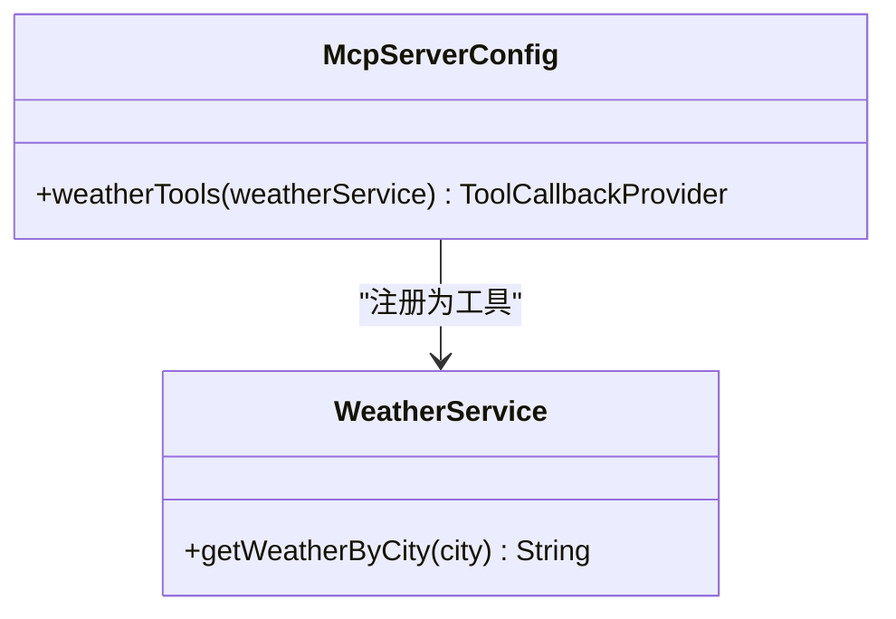
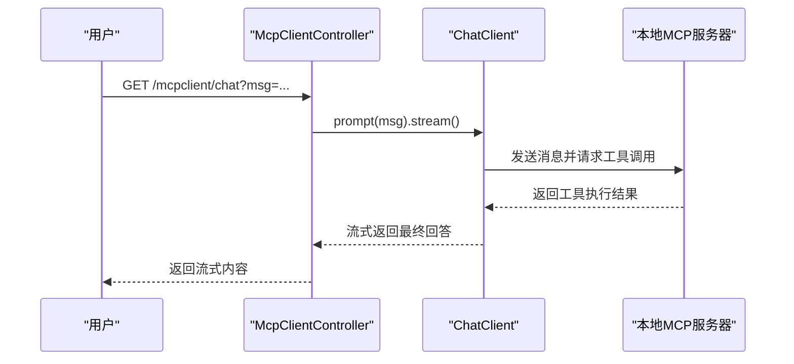
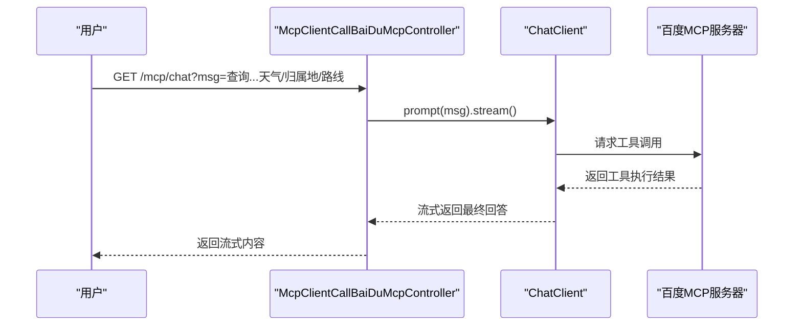
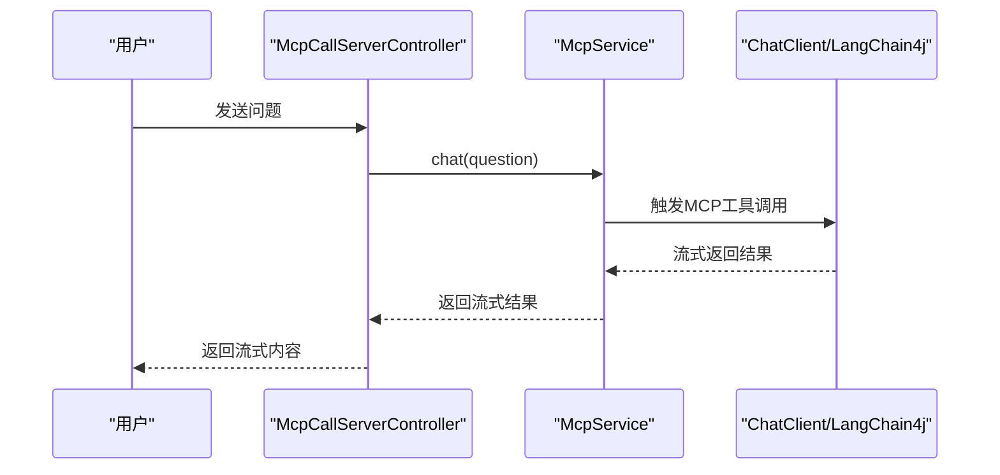
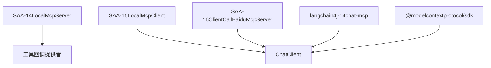

# MCP协议技术

<cite>
**本文引用的文件**
- [SAA-14LocalMcpServerApplication.java](file://【1】SpringAIAlibaba-atguiguV1/SAA-14LocalMcpServer/src/main/java/com/atguigu/study/Saa14LocalMcpServerApplication.java)
- [McpServerConfig.java](file://【1】SpringAIAlibaba-atguiguV1/SAA-14LocalMcpServer/src/main/java/com/atguigu/study/config/McpServerConfig.java)
- [WeatherService.java](file://【1】SpringAIAlibaba-atguiguV1/SAA-14LocalMcpServer/src/main/java/com/atguigu/study/service/WeatherService.java)
- [SAA-15LocalMcpClientApplication.java](file://【1】SpringAIAlibaba-atguiguV1/SAA-15LocalMcpClient/src/main/java/com/atguigu/study/Saa15LocalMcpClientApplication.java)
- [McpClientController.java](file://【1】SpringAIAlibaba-atguiguV1/SAA-15LocalMcpClient/src/main/java/com/atguigu/study/controller/McpClientController.java)
- [SAA-16ClientCallBaiduMcpServerApplication.java](file://【1】SpringAIAlibaba-atguiguV1/SAA-16ClientCallBaiduMcpServer/src/main/java/com/atguigu/study/Saa16ClientCallBaiduMcpServerApplication.java)
- [McpClientCallBaiDuMcpController.java](file://【1】SpringAIAlibaba-atguiguV1/SAA-16ClientCallBaiduMcpServer/src/main/java/com/atguigu/study/controller/McpClientCallBaiDuMcpController.java)
- [mcp-server.json5](file://【1】SpringAIAlibaba-atguiguV1/SAA-16ClientCallBaiduMcpServer/src/main/resources/mcp-server.json5)
- [McpLangChain4JApp.java](file://【2】langchain4j-atguiguV5/langchain4j-14chat-mcp/src/main/java/com/atguigu/study/McpLangChain4JApp.java)
- [McpCallServerController.java](file://【2】langchain4j-atguiguV5/langchain4j-14chat-mcp/src/main/java/com/atguigu/study/controller/McpCallServerController.java)
- [McpService.java](file://【2】langchain4j-atguiguV5/langchain4j-14chat-mcp/src/main/java/com/atguigu/study/service/McpService.java)
- [application.yml](file://【2】langchain4j-atguiguV5/langchain4j-14chat-mcp/src/main/resources/application.yml)
- [pnpm-lock.yaml](file://【3】工作资料/code/仓颉智能体/nlp-frontend-web/pnpm-lock.yaml)
</cite>

## 目录
1. [引言](#引言)
2. [项目结构](#项目结构)
3. [核心组件](#核心组件)
4. [架构总览](#架构总览)
5. [详细组件分析](#详细组件分析)
6. [依赖分析](#依赖分析)
7. [性能考虑](#性能考虑)
8. [故障排除指南](#故障排除指南)
9. [结论](#结论)
10. [附录](#附录)

## 引言
本技术文档围绕MCP（Model Context Protocol）协议展开，系统性介绍其基本概念、工作原理与应用场景，并结合仓库中的Spring AI Alibaba与LangChain4j实践案例，展示如何通过MCP协议扩展AI模型的工具调用能力。文档覆盖以下要点：
- MCP协议概述与核心价值：以“工具即服务”的方式，让大模型能够安全、可控地调用外部工具或服务，实现从“仅生成”到“可执行”的跃迁。
- 本地MCP服务器与客户端：演示如何在Spring Boot中将本地工具方法暴露为MCP工具，并通过ChatClient进行流式工具调用。
- 集成百度MCP服务器：通过配置文件声明外部MCP服务器，实现对百度地图等第三方工具的调用。
- 实战集成案例：Cursor、阿里云百炼平台、Open-WebUI接入MCP的思路与步骤；Spring AI Alibaba与LangChain4j在MCP工具调用上的落地实践。

## 项目结构
本仓库包含两套完整的MCP实践工程与配套文档：
- Spring AI Alibaba系列（SAA）：包含本地MCP服务器、本地MCP客户端、调用百度MCP服务器等模块，演示MCP在Spring生态中的工具暴露与调用。
- LangChain4j系列（L4J）：包含MCP聊天应用模块，展示如何在LangChain4j中进行MCP工具调用与流式响应处理。

**图表来源**
- [SAA-14LocalMcpServerApplication.java:1-16](file://【1】SpringAIAlibaba-atguiguV1/SAA-14LocalMcpServer/src/main/java/com/atguigu/study/Saa14LocalMcpServerApplication.java#L1-L16)
- [SAA-15LocalMcpClientApplication.java:1-16](file://【1】SpringAIAlibaba-atguiguV1/SAA-15LocalMcpClient/src/main/java/com/atguigu/study/Saa15LocalMcpClientApplication.java#L1-L16)
- [SAA-16ClientCallBaiduMcpServerApplication.java:1-16](file://【1】SpringAIAlibaba-atguiguV1/SAA-16ClientCallBaiduMcpServer/src/main/java/com/atguigu/study/Saa16ClientCallBaiduMcpServerApplication.java#L1-L16)
- [McpLangChain4JApp.java:1-19](file://【2】langchain4j-atguiguV5/langchain4j-14chat-mcp/src/main/java/com/atguigu/study/McpLangChain4JApp.java#L1-L19)

**章节来源**
- [SAA-14LocalMcpServerApplication.java:1-16](file://【1】SpringAIAlibaba-atguiguV1/SAA-14LocalMcpServer/src/main/java/com/atguigu/study/Saa14LocalMcpServerApplication.java#L1-L16)
- [SAA-15LocalMcpClientApplication.java:1-16](file://【1】SpringAIAlibaba-atguiguV1/SAA-15LocalMcpClient/src/main/java/com/atguigu/study/Saa15LocalMcpClientApplication.java#L1-L16)
- [SAA-16ClientCallBaiduMcpServerApplication.java:1-16](file://【1】SpringAIAlibaba-atguiguV1/SAA-16ClientCallBaiduMcpServer/src/main/java/com/atguigu/study/Saa16ClientCallBaiduMcpServerApplication.java#L1-L16)
- [McpLangChain4JApp.java:1-19](file://【2】langchain4j-atguiguV5/langchain4j-14chat-mcp/src/main/java/com/atguigu/study/McpLangChain4JApp.java#L1-L19)

## 核心组件
- 本地MCP服务器（SAA-14）
  - 通过工具回调提供者将本地方法暴露为MCP工具，供外部客户端调用。
  - 示例工具：按城市名称查询天气。
- 本地MCP客户端（SAA-15）
  - 使用ChatClient进行流式对话，自动选择并调用可用工具。
- 调用百度MCP服务器（SAA-16）
  - 通过配置文件声明外部MCP服务器，实现对百度地图等工具的调用。
- LangChain4j MCP应用（langchain4j-14chat-mcp）
  - 展示如何在LangChain4j中进行MCP工具调用与流式响应处理。

**章节来源**
- [McpServerConfig.java:1-32](file://【1】SpringAIAlibaba-atguiguV1/SAA-14LocalMcpServer/src/main/java/com/atguigu/study/config/McpServerConfig.java#L1-L32)
- [WeatherService.java:1-27](file://【1】SpringAIAlibaba-atguiguV1/SAA-14LocalMcpServer/src/main/java/com/atguigu/study/service/WeatherService.java#L1-L27)
- [McpClientController.java:1-42](file://【1】SpringAIAlibaba-atguiguV1/SAA-15LocalMcpClient/src/main/java/com/atguigu/study/controller/McpClientController.java#L1-L42)
- [McpClientCallBaiDuMcpController.java:1-52](file://【1】SpringAIAlibaba-atguiguV1/SAA-16ClientCallBaiduMcpServer/src/main/java/com/atguigu/study/controller/McpClientCallBaiDuMcpController.java#L1-L52)
- [mcp-server.json5:1-23](file://【1】SpringAIAlibaba-atguiguV1/SAA-16ClientCallBaiduMcpServer/src/main/resources/mcp-server.json5#L1-L23)
- [McpService.java:1-14](file://【2】langchain4j-atguiguV5/langchain4j-14chat-mcp/src/main/java/com/atguigu/study/service/McpService.java#L1-L14)

## 架构总览
下图展示了MCP在本仓库中的整体架构：本地MCP服务器暴露工具，本地与远程MCP客户端通过ChatClient或LangChain4j进行工具调用，形成“工具即服务”的可执行智能体。

**图表来源**
- [McpServerConfig.java:1-32](file://【1】SpringAIAlibaba-atguiguV1/SAA-14LocalMcpServer/src/main/java/com/atguigu/study/config/McpServerConfig.java#L1-L32)
- [McpClientController.java:1-42](file://【1】SpringAIAlibaba-atguiguV1/SAA-15LocalMcpClient/src/main/java/com/atguigu/study/controller/McpClientController.java#L1-L42)
- [McpClientCallBaiDuMcpController.java:1-52](file://【1】SpringAIAlibaba-atguiguV1/SAA-16ClientCallBaiduMcpServer/src/main/java/com/atguigu/study/controller/McpClientCallBaiDuMcpController.java#L1-L52)
- [McpLangChain4JApp.java:1-19](file://【2】langchain4j-atguiguV5/langchain4j-14chat-mcp/src/main/java/com/atguigu/study/McpLangChain4JApp.java#L1-L19)

## 详细组件分析

### 本地MCP服务器（SAA-14LocalMcpServer）
- 组件职责
  - 将本地业务方法（如天气查询）封装为MCP工具，供外部客户端调用。
  - 通过工具回调提供者统一管理工具注册与调用。
- 关键实现
  - 工具定义：使用注解标记工具方法，提供描述信息。
  - 工具注册：通过工具回调提供者将工具对象注册到MCP框架。
- 数据流
  - 客户端发起工具调用请求 → 服务器接收并解析 → 查找匹配工具 → 执行工具方法 → 返回结果。

**图表来源**
- [WeatherService.java:1-27](file://【1】SpringAIAlibaba-atguiguV1/SAA-14LocalMcpServer/src/main/java/com/atguigu/study/service/WeatherService.java#L1-L27)
- [McpServerConfig.java:1-32](file://【1】SpringAIAlibaba-atguiguV1/SAA-14LocalMcpServer/src/main/java/com/atguigu/study/config/McpServerConfig.java#L1-L32)

**章节来源**
- [WeatherService.java:1-27](file://【1】SpringAIAlibaba-atguiguV1/SAA-14LocalMcpServer/src/main/java/com/atguigu/study/service/WeatherService.java#L1-L27)
- [McpServerConfig.java:1-32](file://【1】SpringAIAlibaba-atguiguV1/SAA-14LocalMcpServer/src/main/java/com/atguigu/study/config/McpServerConfig.java#L1-L32)

### 本地MCP客户端（SAA-15LocalMcpClient）
- 组件职责
  - 提供REST接口，使用ChatClient进行流式对话，自动选择并调用可用工具。
  - 对比普通ChatModel，展示MCP工具调用带来的“可执行”能力。
- 关键实现
  - 控制器注入ChatClient与ChatModel，分别用于MCP与非MCP场景。
  - 通过流式接口返回模型输出，便于前端实时渲染。
- 调用序列
  - 客户端接收用户消息 → 通过ChatClient发送到MCP服务器 → 服务器解析意图并调用工具 → 返回工具结果与自然语言回答。

**图表来源**
- [McpClientController.java:1-42](file://【1】SpringAIAlibaba-atguiguV1/SAA-15LocalMcpClient/src/main/java/com/atguigu/study/controller/McpClientController.java#L1-L42)

**章节来源**
- [McpClientController.java:1-42](file://【1】SpringAIAlibaba-atguiguV1/SAA-15LocalMcpClient/src/main/java/com/atguigu/study/controller/McpClientController.java#L1-L42)

### 调用百度MCP服务器（SAA-16ClientCallBaiduMcpServer）
- 组件职责
  - 通过配置文件声明外部MCP服务器（如百度地图），实现对第三方工具的调用。
  - 支持环境变量传递API密钥等敏感信息。
- 关键实现
  - 配置文件声明服务器命令、参数与环境变量。
  - 控制器使用ChatClient进行工具调用，对比普通模型调用。
- 调用序列
  - 客户端接收用户消息 → 通过ChatClient请求MCP服务器 → 远程服务器解析并调用百度地图工具 → 返回结果。

**图表来源**
- [McpClientCallBaiDuMcpController.java:1-52](file://【1】SpringAIAlibaba-atguiguV1/SAA-16ClientCallBaiduMcpServer/src/main/java/com/atguigu/study/controller/McpClientCallBaiDuMcpController.java#L1-L52)
- [mcp-server.json5:1-23](file://【1】SpringAIAlibaba-atguiguV1/SAA-16ClientCallBaiduMcpServer/src/main/resources/mcp-server.json5#L1-L23)

**章节来源**
- [McpClientCallBaiDuMcpController.java:1-52](file://【1】SpringAIAlibaba-atguiguV1/SAA-16ClientCallBaiduMcpServer/src/main/java/com/atguigu/study/controller/McpClientCallBaiDuMcpController.java#L1-L52)
- [mcp-server.json5:1-23](file://【1】SpringAIAlibaba-atguiguV1/SAA-16ClientCallBaiduMcpServer/src/main/resources/mcp-server.json5#L1-L23)

### LangChain4j MCP应用（langchain4j-14chat-mcp）
- 组件职责
  - 在LangChain4j中进行MCP工具调用与流式响应处理，展示MCP在Java生态中的另一种实现路径。
- 关键实现
  - 应用入口与配置文件。
  - 服务接口定义流式聊天能力。
- 调用序列
  - 应用接收用户问题 → 通过LangChain4j进行MCP工具调用 → 返回流式结果。

**图表来源**
- [McpLangChain4JApp.java:1-19](file://【2】langchain4j-atguiguV5/langchain4j-14chat-mcp/src/main/java/com/atguigu/study/McpLangChain4JApp.java#L1-L19)
- [McpCallServerController.java](file://【2】langchain4j-atguiguV5/langchain4j-14chat-mcp/src/main/java/com/atguigu/study/controller/McpCallServerController.java)
- [McpService.java:1-14](file://【2】langchain4j-atguiguV5/langchain4j-14chat-mcp/src/main/java/com/atguigu/study/service/McpService.java#L1-L14)
- [application.yml](file://【2】langchain4j-atguiguV5/langchain4j-14chat-mcp/src/main/resources/application.yml)

**章节来源**
- [McpLangChain4JApp.java:1-19](file://【2】langchain4j-atguiguV5/langchain4j-14chat-mcp/src/main/java/com/atguigu/study/McpLangChain4JApp.java#L1-L19)
- [McpCallServerController.java](file://【2】langchain4j-atguiguV5/langchain4j-14chat-mcp/src/main/java/com/atguigu/study/controller/McpCallServerController.java)
- [McpService.java:1-14](file://【2】langchain4j-atguiguV5/langchain4j-14chat-mcp/src/main/java/com/atguigu/study/service/McpService.java#L1-L14)
- [application.yml](file://【2】langchain4j-atguiguV5/langchain4j-14chat-mcp/src/main/resources/application.yml)

## 依赖分析
- Spring AI Alibaba
  - 通过工具回调提供者将本地方法暴露为MCP工具，实现工具即服务。
- LangChain4j
  - 通过MCP工具调用与流式响应处理，实现可执行智能体。
- 前端依赖
  - 项目锁文件中包含MCP SDK依赖，表明前端侧对MCP协议的支持与集成。

**图表来源**
- [pnpm-lock.yaml:11617-11633](file://【3】工作资料/code/仓颉智能体/nlp-frontend-web/pnpm-lock.yaml#L11617-L11633)

**章节来源**
- [pnpm-lock.yaml:11617-11633](file://【3】工作资料/code/仓颉智能体/nlp-frontend-web/pnpm-lock.yaml#L11617-L11633)

## 性能考虑
- 工具调用延迟
  - 本地工具调用延迟低，适合高频、低延迟场景。
  - 远程MCP服务器（如百度）受网络与第三方API影响，建议缓存热点查询结果。
- 流式输出
  - 使用流式接口提升用户体验，减少等待时间。
- 并发与资源
  - 工具方法应避免阻塞操作，必要时使用异步或线程池。
- 配置优化
  - 合理设置超时与重试策略，确保在工具不可用时快速失败并回退。

## 故障排除指南
- 工具未被识别
  - 检查工具方法是否正确标注工具注解与描述信息。
  - 确认工具回调提供者已正确注册工具对象。
- 远程MCP服务器无法连接
  - 检查配置文件中的命令、参数与环境变量是否正确。
  - 确认API密钥有效且网络可达。
- 流式输出异常
  - 检查ChatClient的流式接口是否正确使用。
  - 确保控制器返回类型与前端适配一致。
- 前端集成问题
  - 确认MCP SDK版本兼容性与依赖安装正确。

**章节来源**
- [McpServerConfig.java:1-32](file://【1】SpringAIAlibaba-atguiguV1/SAA-14LocalMcpServer/src/main/java/com/atguigu/study/config/McpServerConfig.java#L1-L32)
- [mcp-server.json5:1-23](file://【1】SpringAIAlibaba-atguiguV1/SAA-16ClientCallBaiduMcpServer/src/main/resources/mcp-server.json5#L1-L23)
- [McpClientController.java:1-42](file://【1】SpringAIAlibaba-atguiguV1/SAA-15LocalMcpClient/src/main/java/com/atguigu/study/controller/McpClientController.java#L1-L42)
- [McpClientCallBaiDuMcpController.java:1-52](file://【1】SpringAIAlibaba-atguiguV1/SAA-16ClientCallBaiduMcpServer/src/main/java/com/atguigu/study/controller/McpClientCallBaiDuMcpController.java#L1-L52)

## 结论
通过本仓库的多个实践模块，我们验证了MCP协议在Spring AI Alibaba与LangChain4j生态中的可行性与实用性。本地与远程MCP服务器的组合，配合ChatClient与LangChain4j的工具调用能力，使得AI模型具备了“可执行”的工具调用能力，从而在实际业务场景中实现更强大的自动化与智能化。

## 附录
- Cursor接入MCP
  - 步骤概览：在Cursor中启用MCP工具调用，配置本地或远程MCP服务器地址，确保工具描述清晰，以便模型正确选择工具。
- 阿里云百炼平台接入MCP
  - 步骤概览：在百炼平台创建MCP工具链，配置工具元数据与调用参数，将平台能力以MCP工具形式暴露给模型。
- Open-WebUI接入MCP
  - 步骤概览：在Open-WebUI中启用MCP插件或自定义工具调用，配置工具清单与调用路由，实现与本地/远程MCP服务器的对接。