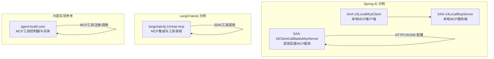
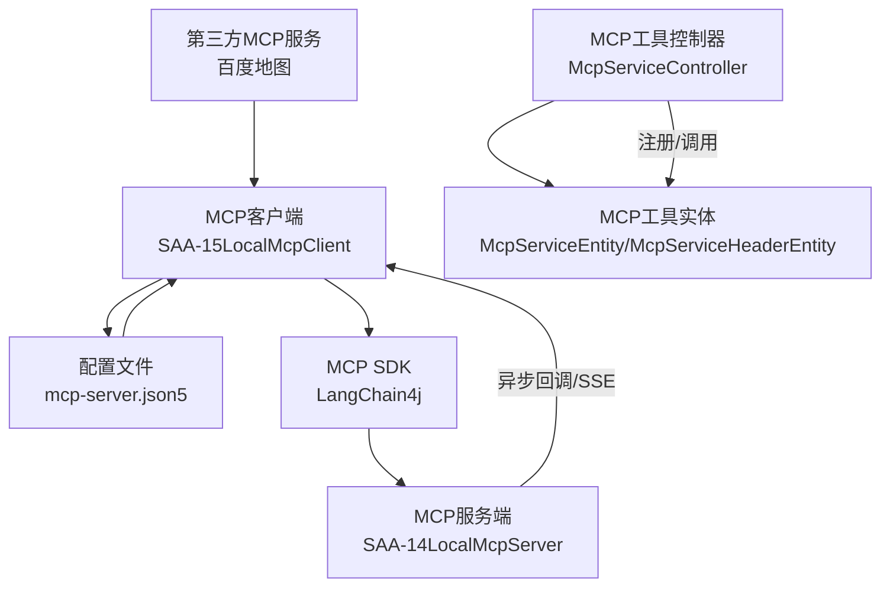
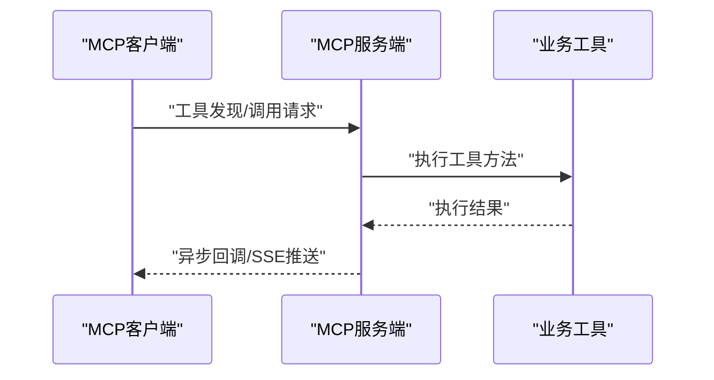
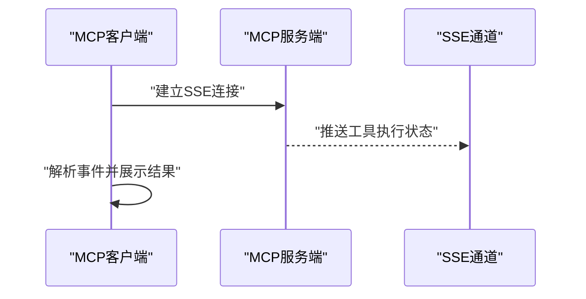
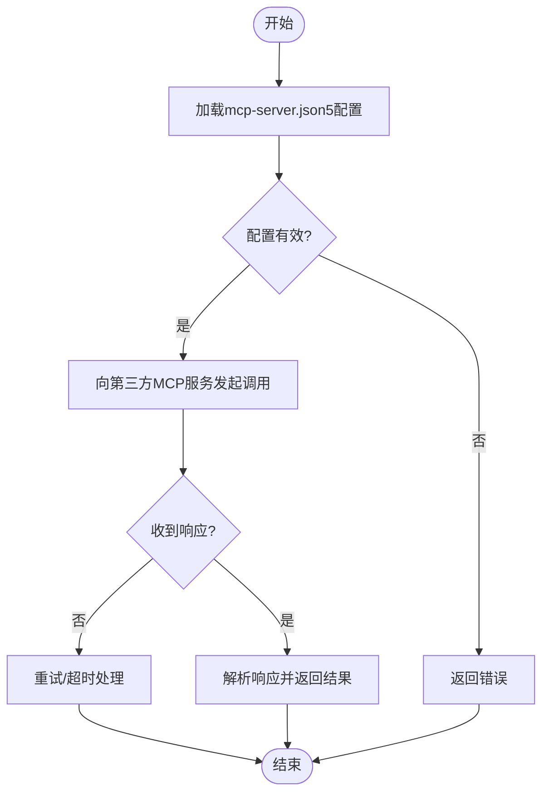
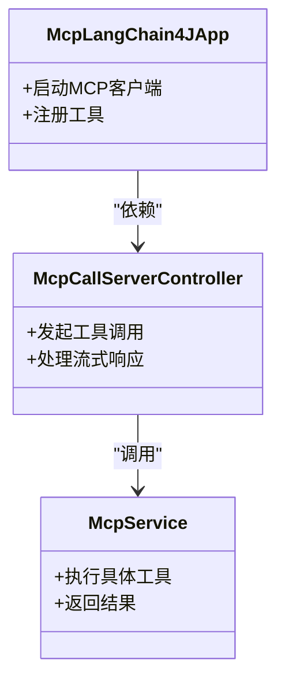
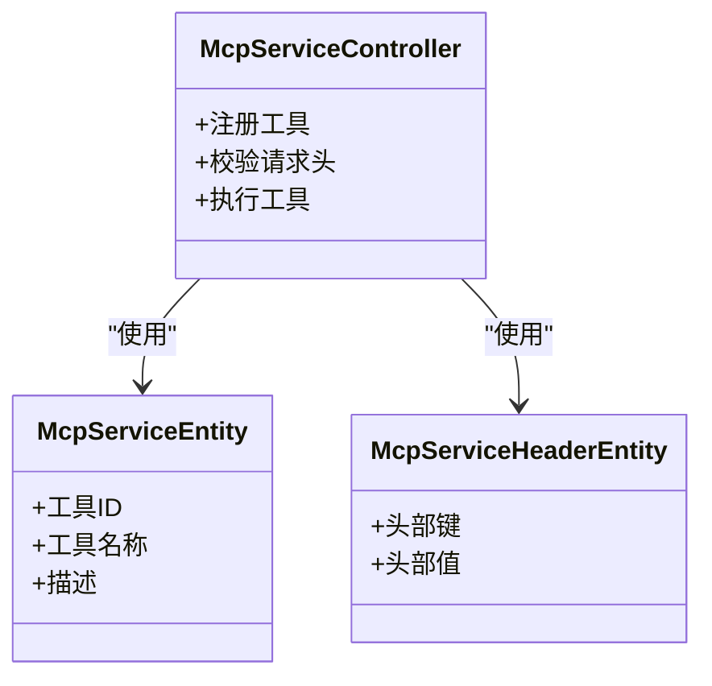
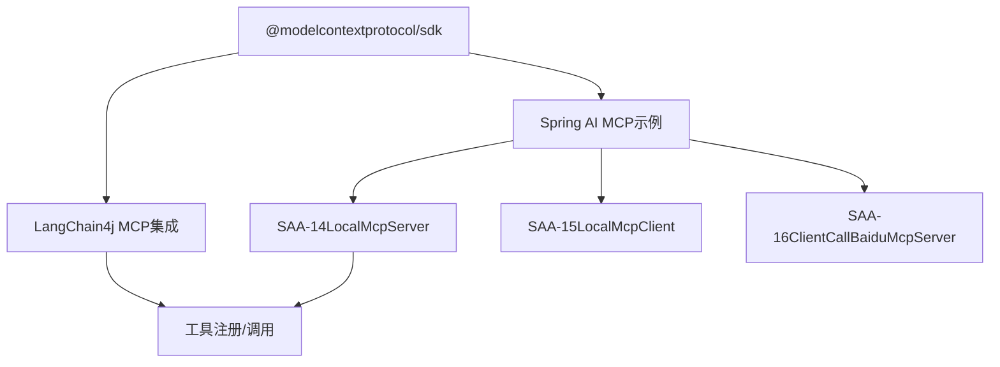

# MCP协议概述

<cite>
**本文引用的文件**
- [mcp-server.json5](file://【1】SpringAIAlibaba-atguiguV1/SAA-16ClientCallBaiduMcpServer/src/main/resources/mcp-server.json5)
- [application.properties](file://【1】SpringAIAlibaba-atguiguV1/SAA-16ClientCallBaiduMcpServer/src/main/resources/application.properties)
- [McpLangChain4JApp.java](file://【2】langchain4j-atguiguV5/langchain4j-14chat-mcp/src/main/java/com/atguigu/study/McpLangChain4JApp.java)
- [McpCallServerController.java](file://【2】langchain4j-atguiguV5/langchain4j-14chat-mcp/src/main/java/com/atguigu/study/controller/McpCallServerController.java)
- [McpService.java](file://【2】langchain4j-atguiguV5/langchain4j-14chat-mcp/src/main/java/com/atguigu/study/service/McpService.java)
- [application.yml](file://【2】langchain4j-atguiguV5/langchain4j-14chat-mcp/src/main/resources/application.yml)
- [pom.xml](file://【2】langchain4j-atguiguV5/langchain4j-14chat-mcp/pom.xml)
- [McpServiceController.java](file://【3】工作资料/code/仓颉智能体/nlp-agent/agent-builder/agent-build-core/src/main/java/com/yundingtech/agent/build/modules/tool/mcp/controller/McpServiceController.java)
- [McpServiceEntity.java](file://【3】工作资料/code/仓颉智能体/nlp-agent/agent-builder/agent-build-core/src/main/java/com/yundingtech/agent/build/modules/tool/mcp/entity/McpServiceEntity.java)
- [McpServiceHeaderEntity.java](file://【3】工作资料/code/仓颉智能体/nlp-agent/agent-builder/agent-build-core/src/main/java/com/yundingtech/agent/build/modules/tool/mcp/entity/McpServiceHeaderEntity.java)
- [3、SpringAIAlibaba-完整学习总结笔记.md](file://3、SpringAIAlibaba-完整学习总结笔记.md)
- [0、项目全景图谱.md](file://0、项目全景图谱.md)
</cite>

## 目录
1. [引言](#引言)
2. [项目结构](#项目结构)
3. [核心组件](#核心组件)
4. [架构总览](#架构总览)
5. [详细组件分析](#详细组件分析)
6. [依赖分析](#依赖分析)
7. [性能考虑](#性能考虑)
8. [故障排除指南](#故障排除指南)
9. [结论](#结论)
10. [附录](#附录)

## 引言
本文件面向希望理解并应用MCP（Model Context Protocol）协议的开发者与架构师，系统性介绍MCP协议的核心理念、基本架构与在AI工具调用场景中的价值。通过仓库中现有的Spring AI与LangChain4j示例工程，以及内部工作资料中的MCP工具调用机制文档，我们将从协议设计、消息格式、通信机制、优势特性与最佳实践等维度进行深入阐述，并结合AI大模型教程的相关章节，说明MCP在实际应用中的意义。

## 项目结构
本仓库围绕MCP协议提供了多套实践案例与内部实现参考，主要包括：
- Spring AI示例：本地MCP服务端与客户端、调用第三方MCP服务（如百度地图）。
- LangChain4j示例：基于LangChain4j的MCP集成与工具调用。
- 内部工作资料：MCP工具在智能体平台中的控制器与实体定义。

**图表来源**
- [McpLangChain4JApp.java:1-200](file://【2】langchain4j-atguiguV5/langchain4j-14chat-mcp/src/main/java/com/atguigu/study/McpLangChain4JApp.java#L1-L200)
- [McpCallServerController.java:1-200](file://【2】langchain4j-atguiguV5/langchain4j-14chat-mcp/src/main/java/com/atguigu/study/controller/McpCallServerController.java#L1-L200)
- [McpServiceController.java:1-200](file://【3】工作资料/code/仓颉智能体/nlp-agent/agent-builder/agent-build-core/src/main/java/com/yundingtech/agent/build/modules/tool/mcp/controller/McpServiceController.java#L1-L200)

**章节来源**
- [0、项目全景图谱.md:1-200](file://0、项目全景图谱.md#L1-L200)
- [3、SpringAIAlibaba-完整学习总结笔记.md:2057-2130](file://3、SpringAIAlibaba-完整学习总结笔记.md#L2057-L2130)

## 核心组件
- MCP服务端（Spring AI）：负责将业务方法注册为MCP工具，对外提供标准化的工具发现与调用接口。
- MCP客户端（Spring AI）：连接服务端或第三方MCP服务，通过SSE/HTTP进行工具调用。
- MCP SDK（LangChain4j）：封装MCP协议的消息格式与调用流程，简化工具注册与调用。
- 内部MCP工具控制器与实体：在智能体平台中实现MCP工具的注册、参数校验与调用执行。

**章节来源**
- [3、SpringAIAlibaba-完整学习总结笔记.md:2057-2130](file://3、SpringAIAlibaba-完整学习总结笔记.md#L2057-L2130)
- [McpServiceController.java:1-200](file://【3】工作资料/code/仓颉智能体/nlp-agent/agent-builder/agent-build-core/src/main/java/com/yundingtech/agent/build/modules/tool/mcp/controller/McpServiceController.java#L1-L200)
- [McpServiceEntity.java:1-200](file://【3】工作资料/code/仓颉智能体/nlp-agent/agent-builder/agent-build-core/src/main/java/com/yundingtech/agent/build/modules/tool/mcp/entity/McpServiceEntity.java#L1-L200)

## 架构总览
下图展示了MCP在本仓库中的典型架构：客户端通过HTTP/JSON5配置或SDK发起工具调用，服务端以异步回调或SSE推送结果；LangChain4j示例通过SDK简化了工具注册与调用流程；内部实现参考展示了MCP工具在智能体平台中的控制器与实体层。

**图表来源**
- [mcp-server.json5:1-200](file://【1】SpringAIAlibaba-atguiguV1/SAA-16ClientCallBaiduMcpServer/src/main/resources/mcp-server.json5#L1-L200)
- [McpLangChain4JApp.java:1-200](file://【2】langchain4j-atguiguV5/langchain4j-14chat-mcp/src/main/java/com/atguigu/study/McpLangChain4JApp.java#L1-L200)
- [McpServiceController.java:1-200](file://【3】工作资料/code/仓颉智能体/nlp-agent/agent-builder/agent-build-core/src/main/java/com/yundingtech/agent/build/modules/tool/mcp/controller/McpServiceController.java#L1-L200)

## 详细组件分析

### 组件A：Spring AI本地MCP服务端（SAA-14）
- 角色定位：将业务方法注册为MCP工具，提供工具发现与调用接口。
- 关键点：
  - 工具注册：通过回调提供者将Java方法暴露为MCP工具。
  - 配置项：异步模式、服务名称、版本号等。
  - 通信机制：异步回调或SSE推送结果。
- 实践要点：确保工具方法具备稳定的输入输出契约，便于客户端统一调用。

**图表来源**
- [3、SpringAIAlibaba-完整学习总结笔记.md:2057-2130](file://3、SpringAIAlibaba-完整学习总结笔记.md#L2057-L2130)

**章节来源**
- [3、SpringAIAlibaba-完整学习总结笔记.md:2057-2130](file://3、SpringAIAlibaba-完整学习总结笔记.md#L2057-L2130)

### 组件B：Spring AI本地MCP客户端（SAA-15）
- 角色定位：连接本地服务端或第三方MCP服务，发起工具调用。
- 关键点：
  - SSE连接：用于接收服务端推送的工具执行状态与结果。
  - 对比说明：使用MCP与不使用MCP的工具调用差异。
- 实践要点：正确处理SSE事件流，确保工具调用的可靠性和可观测性。

**图表来源**
- [3、SpringAIAlibaba-完整学习总结笔记.md:2118-2130](file://3、SpringAIAlibaba-完整学习总结笔记.md#L2118-L2130)

**章节来源**
- [3、SpringAIAlibaba-完整学习总结笔记.md:2118-2130](file://3、SpringAIAlibaba-完整学习总结笔记.md#L2118-L2130)

### 组件C：调用第三方MCP服务（SAA-16）
- 角色定位：通过HTTP与JSON5配置对接第三方MCP服务（如百度地图）。
- 关键点：
  - 配置文件：描述服务端地址、工具列表与认证信息。
  - 请求/响应：遵循MCP消息格式，支持分段推送与错误处理。
- 实践要点：严格校验配置文件与服务端兼容性，确保工具调用的安全与稳定。

**图表来源**
- [mcp-server.json5:1-200](file://【1】SpringAIAlibaba-atguiguV1/SAA-16ClientCallBaiduMcpServer/src/main/resources/mcp-server.json5#L1-L200)

**章节来源**
- [mcp-server.json5:1-200](file://【1】SpringAIAlibaba-atguiguV1/SAA-16ClientCallBaiduMcpServer/src/main/resources/mcp-server.json5#L1-L200)
- [application.properties:1-200](file://【1】SpringAIAlibaba-atguiguV1/SAA-16ClientCallBaiduMcpServer/src/main/resources/application.properties#L1-L200)

### 组件D：LangChain4j MCP集成（langchain4j-14chat-mcp）
- 角色定位：通过MCP SDK简化工具注册与调用，适配LangChain4j的提示词与流式输出。
- 关键点：
  - 应用入口：初始化MCP客户端与工具注册。
  - 控制器：封装工具调用与结果处理。
  - 服务：抽象工具调用逻辑，便于扩展。
- 实践要点：合理组织工具实体与头部信息，确保参数校验与安全策略一致。

**图表来源**
- [McpLangChain4JApp.java:1-200](file://【2】langchain4j-atguiguV5/langchain4j-14chat-mcp/src/main/java/com/atguigu/study/McpLangChain4JApp.java#L1-L200)
- [McpCallServerController.java:1-200](file://【2】langchain4j-atguiguV5/langchain4j-14chat-mcp/src/main/java/com/atguigu/study/controller/McpCallServerController.java#L1-L200)
- [McpService.java:1-200](file://【2】langchain4j-atguiguV5/langchain4j-14chat-mcp/src/main/java/com/atguigu/study/service/McpService.java#L1-L200)

**章节来源**
- [McpLangChain4JApp.java:1-200](file://【2】langchain4j-atguiguV5/langchain4j-14chat-mcp/src/main/java/com/atguigu/study/McpLangChain4JApp.java#L1-L200)
- [McpCallServerController.java:1-200](file://【2】langchain4j-atguiguV5/langchain4j-14chat-mcp/src/main/java/com/atguigu/study/controller/McpCallServerController.java#L1-L200)
- [McpService.java:1-200](file://【2】langchain4j-atguiguV5/langchain4j-14chat-mcp/src/main/java/com/atguigu/study/service/McpService.java#L1-L200)
- [application.yml:1-200](file://【2】langchain4j-atguiguV5/langchain4j-14chat-mcp/src/main/resources/application.yml#L1-L200)
- [pom.xml:1-200](file://【2】langchain4j-atguiguV5/langchain4j-14chat-mcp/pom.xml#L1-L200)

### 组件E：内部MCP工具控制器与实体（agent-build-core）
- 角色定位：在智能体平台中实现MCP工具的注册、参数校验与调用执行。
- 关键点：
  - 控制器：统一处理MCP工具的注册与调用请求。
  - 实体：封装工具元数据与请求头信息，便于跨模块复用。
- 实践要点：保持实体字段与工具协议一致，确保工具发现与调用的稳定性。

**图表来源**
- [McpServiceController.java:1-200](file://【3】工作资料/code/仓颉智能体/nlp-agent/agent-builder/agent-build-core/src/main/java/com/yundingtech/agent/build/modules/tool/mcp/controller/McpServiceController.java#L1-L200)
- [McpServiceEntity.java:1-200](file://【3】工作资料/code/仓颉智能体/nlp-agent/agent-builder/agent-build-core/src/main/java/com/yundingtech/agent/build/modules/tool/mcp/entity/McpServiceEntity.java#L1-L200)
- [McpServiceHeaderEntity.java:1-200](file://【3】工作资料/code/仓颉智能体/nlp-agent/agent-builder/agent-build-core/src/main/java/com/yundingtech/agent/build/modules/tool/mcp/entity/McpServiceHeaderEntity.java#L1-L200)

**章节来源**
- [McpServiceController.java:1-200](file://【3】工作资料/code/仓颉智能体/nlp-agent/agent-builder/agent-build-core/src/main/java/com/yundingtech/agent/build/modules/tool/mcp/controller/McpServiceController.java#L1-L200)
- [McpServiceEntity.java:1-200](file://【3】工作资料/code/仓颉智能体/nlp-agent/agent-builder/agent-build-core/src/main/java/com/yundingtech/agent/build/modules/tool/mcp/entity/McpServiceEntity.java#L1-L200)
- [McpServiceHeaderEntity.java:1-200](file://【3】工作资料/code/仓颉智能体/nlp-agent/agent-builder/agent-build-core/src/main/java/com/yundingtech/agent/build/modules/tool/mcp/entity/McpServiceHeaderEntity.java#L1-L200)

## 依赖分析
- 外部依赖：MCP SDK（如@modelcontextprotocol/sdk）提供协议实现与工具调用封装。
- 内部依赖：LangChain4j示例通过MCP SDK简化工具注册与调用；Spring AI示例通过配置与回调提供者实现工具暴露。
- 依赖关系：客户端依赖于服务端提供的工具清单与调用接口；服务端依赖于业务工具实现与异步回调机制。

**图表来源**
- [pom.xml:1-200](file://【2】langchain4j-atguiguV5/langchain4j-14chat-mcp/pom.xml#L1-L200)

**章节来源**
- [pom.xml:1-200](file://【2】langchain4j-atguiguV5/langchain4j-14chat-mcp/pom.xml#L1-L200)

## 性能考虑
- 异步回调与SSE：服务端采用异步回调或SSE推送，降低客户端轮询开销，提升实时性。
- 工具注册缓存：对工具清单与元数据进行缓存，减少重复发现与校验成本。
- 参数校验前置：在控制器层进行参数校验与限流，避免无效调用影响后端工具。
- 超时与重试：对第三方MCP服务调用设置合理的超时与重试策略，保证调用稳定性。

## 故障排除指南
- 工具未发现：检查服务端是否正确注册工具，客户端是否正确加载配置。
- SSE连接失败：确认SSE通道可达性与网络策略，排查防火墙与代理设置。
- 第三方服务异常：核对mcp-server.json5配置与认证信息，查看服务端日志与错误码。
- 参数不匹配：核对工具输入/输出schema，确保客户端与服务端协议一致。

**章节来源**
- [3、SpringAIAlibaba-完整学习总结笔记.md:2118-2130](file://3、SpringAIAlibaba-完整学习总结笔记.md#L2118-L2130)
- [mcp-server.json5:1-200](file://【1】SpringAIAlibaba-atguiguV1/SAA-16ClientCallBaiduMcpServer/src/main/resources/mcp-server.json5#L1-L200)

## 结论
MCP协议通过标准化的工具发现、统一的参数格式与可扩展的工具注册机制，显著提升了AI工具调用的互操作性与可维护性。本仓库中的Spring AI与LangChain4j示例展示了MCP在本地服务端/客户端、第三方服务对接与智能体平台中的多种落地形态。结合AI大模型教程的相关章节，MCP不仅简化了工具调用流程，也为构建可组合、可演进的AI应用提供了坚实基础。

## 附录
- 相关章节参考：AI大模型教程中关于工具调用与协议设计的章节，建议结合本文件与示例工程进行实践学习。
- 最佳实践清单：
  - 明确工具契约与版本管理
  - 使用异步回调与SSE提升交互效率
  - 在控制器层进行参数校验与安全策略
  - 对第三方服务调用进行超时与重试控制
  - 保持工具清单与实体定义的一致性