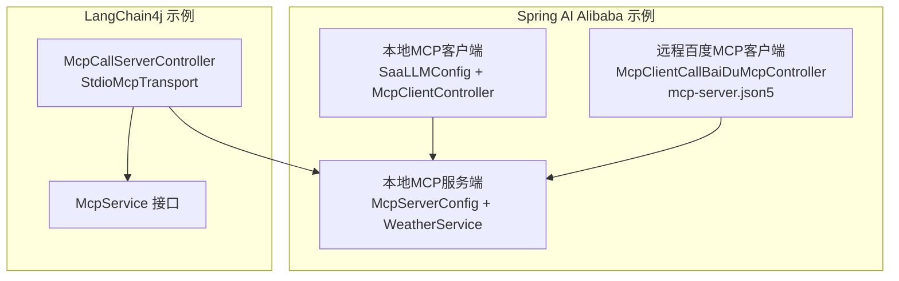
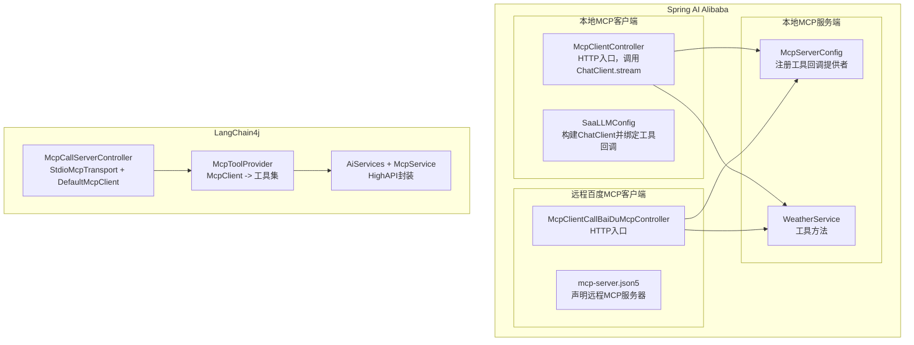
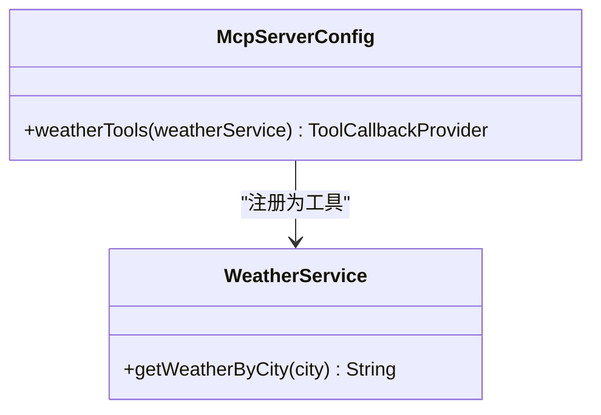
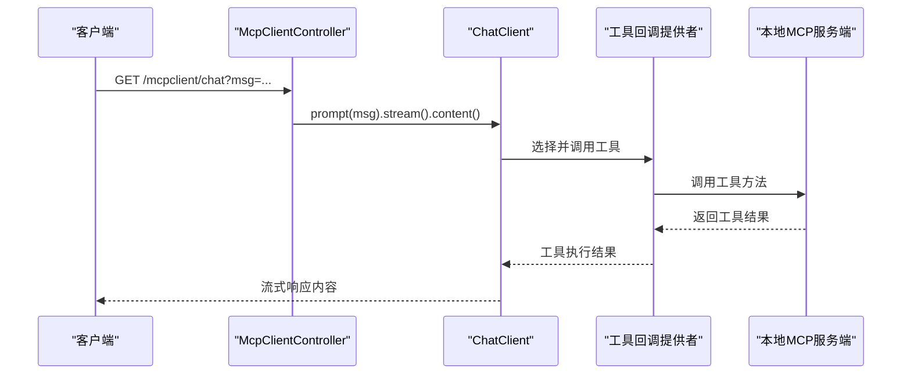
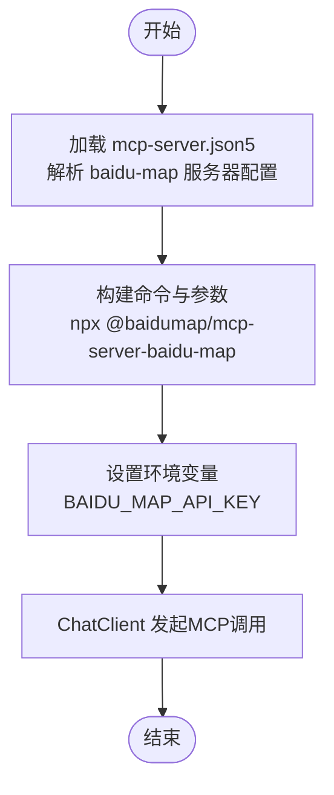
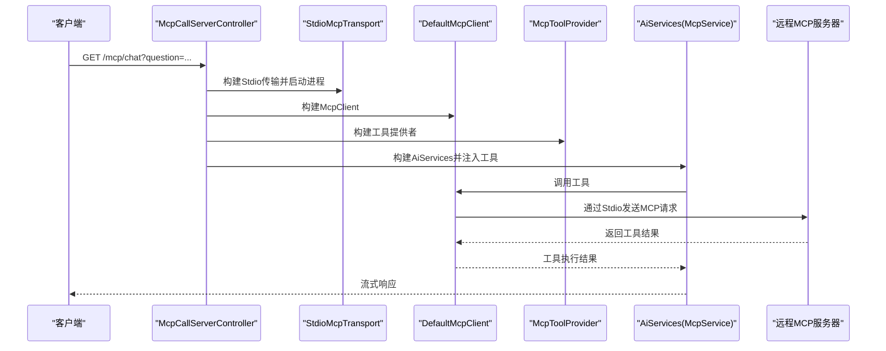
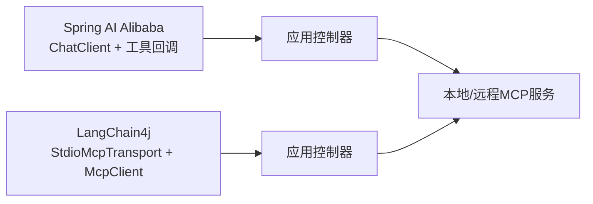
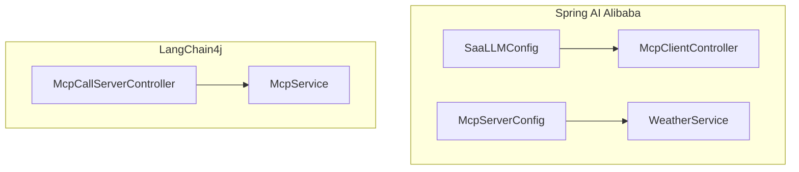

# MCP客户端集成

<cite>
**本文引用的文件**
- [McpServerConfig.java](file://【1】SpringAIAlibaba-atguiguV1/SAA-14LocalMcpServer/src/main/java/com/atguigu/study/config/McpServerConfig.java)
- [WeatherService.java](file://【1】SpringAIAlibaba-atguiguV1/SAA-14LocalMcpServer/src/main/java/com/atguigu/study/service/WeatherService.java)
- [SaaLLMConfig.java](file://【1】SpringAIAlibaba-atguiguV1/SAA-15LocalMcpClient/src/main/java/com/atguigu/study/config/SaaLLMConfig.java)
- [McpClientController.java](file://【1】SpringAIAlibaba-atguiguV1/SAA-15LocalMcpClient/src/main/java/com/atguigu/study/controller/McpClientController.java)
- [mcp-server.json5](file://【1】SpringAIAlibaba-atguiguV1/SAA-16ClientCallBaiduMcpServer/src/main/resources/mcp-server.json5)
- [McpClientCallBaiDuMcpController.java](file://【1】SpringAIAlibaba-atguiguV1/SAA-16ClientCallBaiduMcpServer/src/main/java/com/atguigu/study/controller/McpClientCallBaiDuMcpController.java)
- [McpCallServerController.java](file://【2】langchain4j-atguiguV5/langchain4j-14chat-mcp/src/main/java/com/atguigu/study/controller/McpCallServerController.java)
- [McpService.java](file://【2】langchain4j-atguiguV5/langchain4j-14chat-mcp/src/main/java/com/atguigu/study/service/McpService.java)
- [application.yml](file://【2】langchain4j-atguiguV5/langchain4j-14chat-mcp/src/main/resources/application.yml)
</cite>

## 目录
1. [引言](#引言)
2. [项目结构](#项目结构)
3. [核心组件](#核心组件)
4. [架构总览](#架构总览)
5. [详细组件分析](#详细组件分析)
6. [依赖分析](#依赖分析)
7. [性能考虑](#性能考虑)
8. [故障排查指南](#故障排查指南)
9. [结论](#结论)
10. [附录](#附录)

## 引言
本技术文档围绕Spring AI Alibaba框架与LangChain4j框架中的MCP（Model Context Protocol）客户端集成展开，系统性介绍如何在Spring AI Alibaba中配置MCP客户端、实现本地与远程MCP服务的工具调用、以及在LangChain4j中通过Stdio传输与MCP工具提供者完成跨框架的MCP使用模式。文档覆盖客户端配置、服务发现、工具调用、通信机制、错误处理与重试策略、异步响应处理、负载均衡思路与实际集成示例。

## 项目结构
本仓库包含两套MCP集成示例：
- Spring AI Alibaba示例
  - 本地MCP服务端：暴露工具方法供外部MCP客户端调用
  - 本地MCP客户端：通过ChatClient启用MCP工具回调
  - 远程百度MCP服务客户端：通过配置文件声明MCP服务器并以ChatClient调用
- LangChain4j示例
  - 通过Stdio传输启动远程MCP服务器，构建McpClient与McpToolProvider，再注入AiServices进行工具调用

**图表来源**
- [McpServerConfig.java:15-30](file://【1】SpringAIAlibaba-atguiguV1/SAA-14LocalMcpServer/src/main/java/com/atguigu/study/config/McpServerConfig.java#L15-L30)
- [WeatherService.java:14-27](file://【1】SpringAIAlibaba-atguiguV1/SAA-14LocalMcpServer/src/main/java/com/atguigu/study/service/WeatherService.java#L14-L27)
- [SaaLLMConfig.java:14-24](file://【1】SpringAIAlibaba-atguiguV1/SAA-15LocalMcpClient/src/main/java/com/atguigu/study/config/SaaLLMConfig.java#L14-L24)
- [McpClientController.java:18-41](file://【1】SpringAIAlibaba-atguiguV1/SAA-15LocalMcpClient/src/main/java/com/atguigu/study/controller/McpClientController.java#L18-L41)
- [mcp-server.json5:1-23](file://【1】SpringAIAlibaba-atguiguV1/SAA-16ClientCallBaiduMcpServer/src/main/resources/mcp-server.json5#L1-L23)
- [McpClientCallBaiDuMcpController.java:16-51](file://【1】SpringAIAlibaba-atguiguV1/SAA-16ClientCallBaiduMcpServer/src/main/java/com/atguigu/study/controller/McpClientCallBaiDuMcpController.java#L16-L51)
- [McpCallServerController.java:36-87](file://【2】langchain4j-atguiguV5/langchain4j-14chat-mcp/src/main/java/com/atguigu/study/controller/McpCallServerController.java#L36-L87)
- [McpService.java:10-13](file://【2】langchain4j-atguiguV5/langchain4j-14chat-mcp/src/main/java/com/atguigu/study/service/McpService.java#L10-L13)

**章节来源**
- [McpServerConfig.java:15-30](file://【1】SpringAIAlibaba-atguiguV1/SAA-14LocalMcpServer/src/main/java/com/atguigu/study/config/McpServerConfig.java#L15-L30)
- [SaaLLMConfig.java:14-24](file://【1】SpringAIAlibaba-atguiguV1/SAA-15LocalMcpClient/src/main/java/com/atguigu/study/config/SaaLLMConfig.java#L14-L24)
- [McpClientController.java:18-41](file://【1】SpringAIAlibaba-atguiguV1/SAA-15LocalMcpClient/src/main/java/com/atguigu/study/controller/McpClientController.java#L18-L41)
- [mcp-server.json5:1-23](file://【1】SpringAIAlibaba-atguiguV1/SAA-16ClientCallBaiduMcpServer/src/main/resources/mcp-server.json5#L1-L23)
- [McpClientCallBaiDuMcpController.java:16-51](file://【1】SpringAIAlibaba-atguiguV1/SAA-16ClientCallBaiduMcpServer/src/main/java/com/atguigu/study/controller/McpClientCallBaiDuMcpController.java#L16-L51)
- [McpCallServerController.java:36-87](file://【2】langchain4j-atguiguV5/langchain4j-14chat-mcp/src/main/java/com/atguigu/study/controller/McpCallServerController.java#L36-L87)
- [McpService.java:10-13](file://【2】langchain4j-atguiguV5/langchain4j-14chat-mcp/src/main/java/com/atguigu/study/service/McpService.java#L10-L13)

## 核心组件
- 本地MCP服务端
  - 通过工具回调提供者将业务方法暴露为MCP工具，供外部客户端调用
- 本地MCP客户端
  - 通过ChatClient启用工具回调，实现工具自动选择与调用
- 远程百度MCP客户端
  - 通过配置文件声明MCP服务器，结合ChatClient发起MCP工具调用
- LangChain4j MCP客户端
  - 通过Stdio传输启动远程MCP服务器，构建McpClient与McpToolProvider，注入AiServices进行工具调用

**章节来源**
- [McpServerConfig.java:15-30](file://【1】SpringAIAlibaba-atguiguV1/SAA-14LocalMcpServer/src/main/java/com/atguigu/study/config/McpServerConfig.java#L15-L30)
- [WeatherService.java:14-27](file://【1】SpringAIAlibaba-atguiguV1/SAA-14LocalMcpServer/src/main/java/com/atguigu/study/service/WeatherService.java#L14-L27)
- [SaaLLMConfig.java:14-24](file://【1】SpringAIAlibaba-atguiguV1/SAA-15LocalMcpClient/src/main/java/com/atguigu/study/config/SaaLLMConfig.java#L14-L24)
- [McpClientController.java:18-41](file://【1】SpringAIAlibaba-atguiguV1/SAA-15LocalMcpClient/src/main/java/com/atguigu/study/controller/McpClientController.java#L18-L41)
- [mcp-server.json5:1-23](file://【1】SpringAIAlibaba-atguiguV1/SAA-16ClientCallBaiduMcpServer/src/main/resources/mcp-server.json5#L1-L23)
- [McpClientCallBaiDuMcpController.java:16-51](file://【1】SpringAIAlibaba-atguiguV1/SAA-16ClientCallBaiduMcpServer/src/main/java/com/atguigu/study/controller/McpClientCallBaiDuMcpController.java#L16-L51)
- [McpCallServerController.java:36-87](file://【2】langchain4j-atguiguV5/langchain4j-14chat-mcp/src/main/java/com/atguigu/study/controller/McpCallServerController.java#L36-L87)
- [McpService.java:10-13](file://【2】langchain4j-atguiguV5/langchain4j-14chat-mcp/src/main/java/com/atguigu/study/service/McpService.java#L10-L13)

## 架构总览
下图展示了Spring AI Alibaba与LangChain4j两种MCP集成路径的总体架构与交互关系：

**图表来源**
- [McpServerConfig.java:15-30](file://【1】SpringAIAlibaba-atguiguV1/SAA-14LocalMcpServer/src/main/java/com/atguigu/study/config/McpServerConfig.java#L15-L30)
- [WeatherService.java:14-27](file://【1】SpringAIAlibaba-atguiguV1/SAA-14LocalMcpServer/src/main/java/com/atguigu/study/service/WeatherService.java#L14-L27)
- [SaaLLMConfig.java:14-24](file://【1】SpringAIAlibaba-atguiguV1/SAA-15LocalMcpClient/src/main/java/com/atguigu/study/config/SaaLLMConfig.java#L14-L24)
- [McpClientController.java:18-41](file://【1】SpringAIAlibaba-atguiguV1/SAA-15LocalMcpClient/src/main/java/com/atguigu/study/controller/McpClientController.java#L18-L41)
- [mcp-server.json5:1-23](file://【1】SpringAIAlibaba-atguiguV1/SAA-16ClientCallBaiduMcpServer/src/main/resources/mcp-server.json5#L1-L23)
- [McpClientCallBaiDuMcpController.java:16-51](file://【1】SpringAIAlibaba-atguiguV1/SAA-16ClientCallBaiduMcpServer/src/main/java/com/atguigu/study/controller/McpClientCallBaiDuMcpController.java#L16-L51)
- [McpCallServerController.java:36-87](file://【2】langchain4j-atguiguV5/langchain4j-14chat-mcp/src/main/java/com/atguigu/study/controller/McpCallServerController.java#L36-L87)
- [McpService.java:10-13](file://【2】langchain4j-atguiguV5/langchain4j-14chat-mcp/src/main/java/com/atguigu/study/service/McpService.java#L10-L13)

## 详细组件分析

### 组件A：本地MCP服务端（工具暴露）
- 功能要点
  - 通过工具回调提供者将业务方法暴露为MCP工具，供外部客户端调用
  - 工具方法具备描述信息，便于大模型理解与选择
- 关键点
  - 工具注册：将服务对象注入工具回调提供者
  - 方法注解：工具方法带有描述信息，提升工具选择准确性

**图表来源**
- [McpServerConfig.java:15-30](file://【1】SpringAIAlibaba-atguiguV1/SAA-14LocalMcpServer/src/main/java/com/atguigu/study/config/McpServerConfig.java#L15-L30)
- [WeatherService.java:14-27](file://【1】SpringAIAlibaba-atguiguV1/SAA-14LocalMcpServer/src/main/java/com/atguigu/study/service/WeatherService.java#L14-L27)

**章节来源**
- [McpServerConfig.java:15-30](file://【1】SpringAIAlibaba-atguiguV1/SAA-14LocalMcpServer/src/main/java/com/atguigu/study/config/McpServerConfig.java#L15-L30)
- [WeatherService.java:14-27](file://【1】SpringAIAlibaba-atguiguV1/SAA-14LocalMcpServer/src/main/java/com/atguigu/study/service/WeatherService.java#L14-L27)

### 组件B：本地MCP客户端（ChatClient工具回调）
- 功能要点
  - 通过配置类将工具回调提供者注入ChatClient
  - 控制器层以流式方式调用ChatClient，自动触发工具选择与调用
- 关键点
  - ChatClient构建：绑定工具回调集合
  - HTTP接口：GET /mcpclient/chat 使用MCP工具；/mcpclient/chat2 不使用MCP工具

**图表来源**
- [SaaLLMConfig.java:14-24](file://【1】SpringAIAlibaba-atguiguV1/SAA-15LocalMcpClient/src/main/java/com/atguigu/study/config/SaaLLMConfig.java#L14-L24)
- [McpClientController.java:18-41](file://【1】SpringAIAlibaba-atguiguV1/SAA-15LocalMcpClient/src/main/java/com/atguigu/study/controller/McpClientController.java#L18-L41)

**章节来源**
- [SaaLLMConfig.java:14-24](file://【1】SpringAIAlibaba-atguiguV1/SAA-15LocalMcpClient/src/main/java/com/atguigu/study/config/SaaLLMConfig.java#L14-L24)
- [McpClientController.java:18-41](file://【1】SpringAIAlibaba-atguiguV1/SAA-15LocalMcpClient/src/main/java/com/atguigu/study/controller/McpClientController.java#L18-L41)

### 组件C：远程百度MCP客户端（配置驱动）
- 功能要点
  - 通过配置文件声明远程MCP服务器（命令、参数、环境变量）
  - 控制器层以ChatClient发起MCP工具调用
- 关键点
  - 配置文件：mcp-server.json5 中声明“baidu-map”服务器
  - 环境变量：BAIDU_MAP_API_KEY 由系统环境或配置文件提供

**图表来源**
- [mcp-server.json5:1-23](file://【1】SpringAIAlibaba-atguiguV1/SAA-16ClientCallBaiduMcpServer/src/main/resources/mcp-server.json5#L1-L23)
- [McpClientCallBaiDuMcpController.java:16-51](file://【1】SpringAIAlibaba-atguiguV1/SAA-16ClientCallBaiduMcpServer/src/main/java/com/atguigu/study/controller/McpClientCallBaiDuMcpController.java#L16-L51)

**章节来源**
- [mcp-server.json5:1-23](file://【1】SpringAIAlibaba-atguiguV1/SAA-16ClientCallBaiduMcpServer/src/main/resources/mcp-server.json5#L1-L23)
- [McpClientCallBaiDuMcpController.java:16-51](file://【1】SpringAIAlibaba-atguiguV1/SAA-16ClientCallBaiduMcpServer/src/main/java/com/atguigu/study/controller/McpClientCallBaiDuMcpController.java#L16-L51)

### 组件D：LangChain4j MCP客户端（Stdio传输）
- 功能要点
  - 通过StdioMcpTransport启动远程MCP服务器进程
  - 构建McpClient与McpToolProvider，注入AiServices
  - 以HighAPI接口进行工具调用
- 关键点
  - 传输层：StdioMcpTransport
  - 工具提供者：McpToolProvider
  - 高层接口：McpService（Flux<String>）

**图表来源**
- [McpCallServerController.java:36-87](file://【2】langchain4j-atguiguV5/langchain4j-14chat-mcp/src/main/java/com/atguigu/study/controller/McpCallServerController.java#L36-L87)
- [McpService.java:10-13](file://【2】langchain4j-atguiguV5/langchain4j-14chat-mcp/src/main/java/com/atguigu/study/service/McpService.java#L10-L13)

**章节来源**
- [McpCallServerController.java:36-87](file://【2】langchain4j-atguiguV5/langchain4j-14chat-mcp/src/main/java/com/atguigu/study/controller/McpCallServerController.java#L36-L87)
- [McpService.java:10-13](file://【2】langchain4j-atguiguV5/langchain4j-14chat-mcp/src/main/java/com/atguigu/study/service/McpService.java#L10-L13)

### 组件E：跨框架MCP使用模式（Spring AI Alibaba vs LangChain4j）
- Spring AI Alibaba
  - 通过ChatClient与工具回调提供者实现MCP工具调用
  - 适合已有Spring生态的应用，易于集成与扩展
- LangChain4j
  - 通过Stdio传输与McpClient直接对接远程MCP服务器
  - 适合需要更灵活传输与工具提供者组合的场景

**图表来源**
- [SaaLLMConfig.java:14-24](file://【1】SpringAIAlibaba-atguiguV1/SAA-15LocalMcpClient/src/main/java/com/atguigu/study/config/SaaLLMConfig.java#L14-L24)
- [McpClientController.java:18-41](file://【1】SpringAIAlibaba-atguiguV1/SAA-15LocalMcpClient/src/main/java/com/atguigu/study/controller/McpClientController.java#L18-L41)
- [McpCallServerController.java:36-87](file://【2】langchain4j-atguiguV5/langchain4j-14chat-mcp/src/main/java/com/atguigu/study/controller/McpCallServerController.java#L36-L87)

**章节来源**
- [SaaLLMConfig.java:14-24](file://【1】SpringAIAlibaba-atguiguV1/SAA-15LocalMcpClient/src/main/java/com/atguigu/study/config/SaaLLMConfig.java#L14-L24)
- [McpClientController.java:18-41](file://【1】SpringAIAlibaba-atguiguV1/SAA-15LocalMcpClient/src/main/java/com/atguigu/study/controller/McpClientController.java#L18-L41)
- [McpCallServerController.java:36-87](file://【2】langchain4j-atguiguV5/langchain4j-14chat-mcp/src/main/java/com/atguigu/study/controller/McpCallServerController.java#L36-L87)

## 依赖分析
- Spring AI Alibaba
  - ChatClient依赖ChatModel与ToolCallbackProvider
  - ToolCallbackProvider从McpServerConfig中获取工具回调集合
- LangChain4j
  - 通过StdioMcpTransport与McpClient建立连接
  - 通过McpToolProvider将McpClient转换为工具集
  - 通过AiServices将工具集注入到McpService接口

**图表来源**
- [SaaLLMConfig.java:14-24](file://【1】SpringAIAlibaba-atguiguV1/SAA-15LocalMcpClient/src/main/java/com/atguigu/study/config/SaaLLMConfig.java#L14-L24)
- [McpClientController.java:18-41](file://【1】SpringAIAlibaba-atguiguV1/SAA-15LocalMcpClient/src/main/java/com/atguigu/study/controller/McpClientController.java#L18-L41)
- [McpServerConfig.java:15-30](file://【1】SpringAIAlibaba-atguiguV1/SAA-14LocalMcpServer/src/main/java/com/atguigu/study/config/McpServerConfig.java#L15-L30)
- [WeatherService.java:14-27](file://【1】SpringAIAlibaba-atguiguV1/SAA-14LocalMcpServer/src/main/java/com/atguigu/study/service/WeatherService.java#L14-L27)
- [McpCallServerController.java:36-87](file://【2】langchain4j-atguiguV5/langchain4j-14chat-mcp/src/main/java/com/atguigu/study/controller/McpCallServerController.java#L36-L87)
- [McpService.java:10-13](file://【2】langchain4j-atguiguV5/langchain4j-14chat-mcp/src/main/java/com/atguigu/study/service/McpService.java#L10-L13)

**章节来源**
- [SaaLLMConfig.java:14-24](file://【1】SpringAIAlibaba-atguiguV1/SAA-15LocalMcpClient/src/main/java/com/atguigu/study/config/SaaLLMConfig.java#L14-L24)
- [McpClientController.java:18-41](file://【1】SpringAIAlibaba-atguiguV1/SAA-15LocalMcpClient/src/main/java/com/atguigu/study/controller/McpClientController.java#L18-L41)
- [McpServerConfig.java:15-30](file://【1】SpringAIAlibaba-atguiguV1/SAA-14LocalMcpServer/src/main/java/com/atguigu/study/config/McpServerConfig.java#L15-L30)
- [WeatherService.java:14-27](file://【1】SpringAIAlibaba-atguiguV1/SAA-14LocalMcpServer/src/main/java/com/atguigu/study/service/WeatherService.java#L14-L27)
- [McpCallServerController.java:36-87](file://【2】langchain4j-atguiguV5/langchain4j-14chat-mcp/src/main/java/com/atguigu/study/controller/McpCallServerController.java#L36-L87)
- [McpService.java:10-13](file://【2】langchain4j-atguiguV5/langchain4j-14chat-mcp/src/main/java/com/atguigu/study/service/McpService.java#L10-L13)

## 性能考虑
- 异步与流式响应
  - 两个框架均采用Flux进行流式输出，降低等待延迟，提升用户体验
- 传输与连接
  - Spring AI Alibaba通过ChatClient工具回调实现工具调用
  - LangChain4j通过Stdio传输启动远程MCP服务器，适合跨语言工具调用
- 资源管理
  - LangChain4j示例在调用完成后显式关闭McpClient，避免资源泄漏

**章节来源**
- [McpClientController.java:18-41](file://【1】SpringAIAlibaba-atguiguV1/SAA-15LocalMcpClient/src/main/java/com/atguigu/study/controller/McpClientController.java#L18-L41)
- [McpCallServerController.java:36-87](file://【2】langchain4j-atguiguV5/langchain4j-14chat-mcp/src/main/java/com/atguigu/study/controller/McpCallServerController.java#L36-L87)

## 故障排查指南
- 环境变量缺失
  - 百度MCP服务需要BAIDU_MAP_API_KEY，若未设置，可能导致工具调用失败
- 进程启动失败
  - StdioMcpTransport依赖npx与指定npm包，需确保Node.js环境与网络可用
- 工具不可用
  - 确认工具回调提供者已正确注册，且工具方法具备描述信息
- 资源泄漏
  - LangChain4j示例在finally中关闭McpClient，确保资源释放

**章节来源**
- [mcp-server.json5:1-23](file://【1】SpringAIAlibaba-atguiguV1/SAA-16ClientCallBaiduMcpServer/src/main/resources/mcp-server.json5#L1-L23)
- [McpCallServerController.java:36-87](file://【2】langchain4j-atguiguV5/langchain4j-14chat-mcp/src/main/java/com/atguigu/study/controller/McpCallServerController.java#L36-L87)

## 结论
本项目提供了Spring AI Alibaba与LangChain4j两种MCP集成路径的完整示例。通过工具回调提供者与ChatClient，Spring AI Alibaba实现了本地与远程MCP工具的无缝调用；通过Stdio传输与McpClient，LangChain4j实现了灵活的跨语言MCP工具调用。两种方案均可结合流式响应与资源管理最佳实践，满足生产环境的性能与稳定性要求。

## 附录
- 实际集成示例
  - Spring AI Alibaba本地MCP客户端：通过HTTP接口调用ChatClient.stream，自动触发工具选择与调用
  - Spring AI Alibaba远程百度MCP客户端：通过mcp-server.json5声明远程服务器，结合ChatClient发起MCP调用
  - LangChain4j MCP客户端：通过StdioMcpTransport启动远程MCP服务器，构建McpClient与McpToolProvider，注入AiServices进行工具调用

**章节来源**
- [McpClientController.java:18-41](file://【1】SpringAIAlibaba-atguiguV1/SAA-15LocalMcpClient/src/main/java/com/atguigu/study/controller/McpClientController.java#L18-L41)
- [mcp-server.json5:1-23](file://【1】SpringAIAlibaba-atguiguV1/SAA-16ClientCallBaiduMcpServer/src/main/resources/mcp-server.json5#L1-L23)
- [McpCallServerController.java:36-87](file://【2】langchain4j-atguiguV5/langchain4j-14chat-mcp/src/main/java/com/atguigu/study/controller/McpCallServerController.java#L36-L87)
- [application.yml:1-27](file://【2】langchain4j-atguiguV5/langchain4j-14chat-mcp/src/main/resources/application.yml#L1-L27)