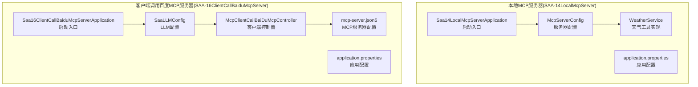
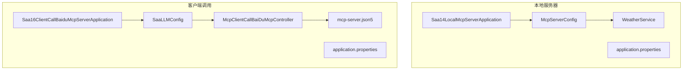
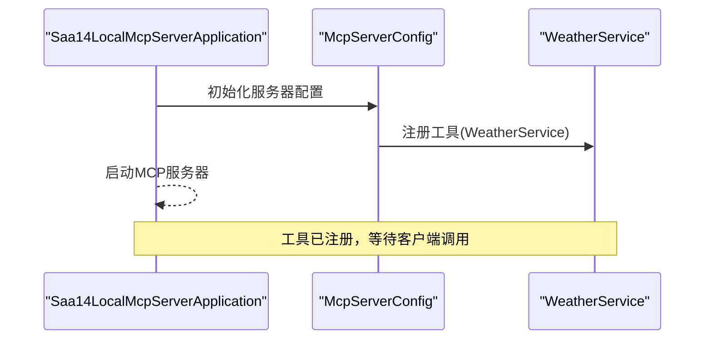
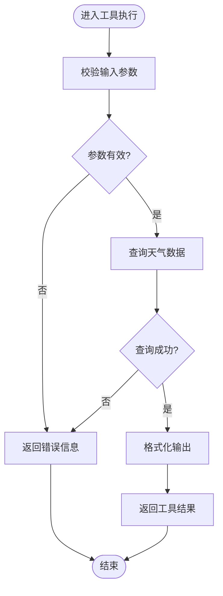
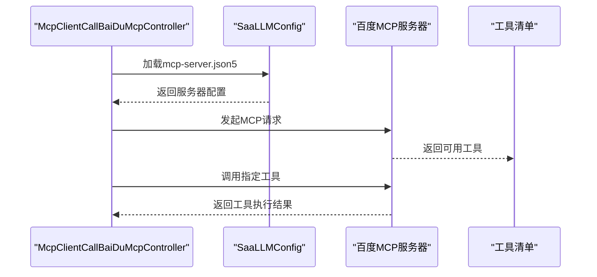
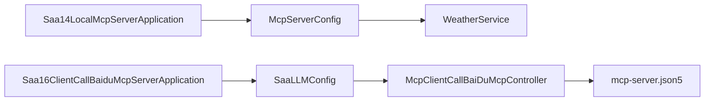

# MCP服务器实现

<cite>
**本文引用的文件**
- [Saa14LocalMcpServerApplication.java](file://【1】SpringAIAlibaba-atguiguV1/SAA-14LocalMcpServer/src/main/java/com/atguigu/study/Saa14LocalMcpServerApplication.java)
- [McpServerConfig.java](file://【1】SpringAIAlibaba-atguiguV1/SAA-14LocalMcpServer/src/main/java/com/atguigu/study/config/McpServerConfig.java)
- [WeatherService.java](file://【1】SpringAIAlibaba-atguiguV1/SAA-14LocalMcpServer/src/main/java/com/atguigu/study/service/WeatherService.java)
- [application.properties](file://【1】SpringAIAlibaba-atguiguV1/SAA-14LocalMcpServer/src/main/resources/application.properties)
- [Saa16ClientCallBaiduMcpServerApplication.java](file://【1】SpringAIAlibaba-atguiguV1/SAA-16ClientCallBaiduMcpServer/src/main/java/com/atguigu/study/Saa16ClientCallBaiduMcpServerApplication.java)
- [SaaLLMConfig.java](file://【1】SpringAIAlibaba-atguiguV1/SAA-16ClientCallBaiduMcpServer/src/main/java/com/atguigu/study/config/SaaLLMConfig.java)
- [McpClientCallBaiDuMcpController.java](file://【1】SpringAIAlibaba-atguiguV1/SAA-16ClientCallBaiduMcpServer/src/main/java/com/atguigu/study/controller/McpClientCallBaiDuMcpController.java)
- [mcp-server.json5](file://【1】SpringAIAlibaba-atguiguV1/SAA-16ClientCallBaiduMcpServer/src/main/resources/mcp-server.json5)
- [application.properties](file://【1】SpringAIAlibaba-atguiguV1/SAA-16ClientCallBaiduMcpServer/src/main/resources/application.properties)
</cite>

## 目录
1. [引言](#引言)
2. [项目结构](#项目结构)
3. [核心组件](#核心组件)
4. [架构总览](#架构总览)
5. [详细组件分析](#详细组件分析)
6. [依赖分析](#依赖分析)
7. [性能考虑](#性能考虑)
8. [故障排除指南](#故障排除指南)
9. [结论](#结论)
10. [附录](#附录)

## 引言
本技术文档围绕MCP（Model Context Protocol）服务器在Spring Boot环境中的实现展开，重点覆盖以下方面：
- 在Spring Boot中搭建本地MCP服务器，包含服务器配置、工具注册、消息处理等核心功能
- 以WeatherService天气服务为例，展示工具实现的完整流程
- 解释MCP服务器的启动流程、工具发现机制、请求处理逻辑
- 结合百度MCP服务器配置文件，说明不同MCP服务器的配置差异及适配方法
- 提供可操作的代码示例路径与最佳实践指导

## 项目结构
本仓库包含两个与MCP直接相关的模块：
- SAA-14LocalMcpServer：本地MCP服务器实现，演示工具注册与消息处理
- SAA-16ClientCallBaiduMcpServer：客户端调用百度MCP服务器，展示配置文件与适配方法

**图表来源**
- [Saa14LocalMcpServerApplication.java:1-200](file://【1】SpringAIAlibaba-atguiguV1/SAA-14LocalMcpServer/src/main/java/com/atguigu/study/Saa14LocalMcpServerApplication.java#L1-L200)
- [McpServerConfig.java:1-200](file://【1】SpringAIAlibaba-atguiguV1/SAA-14LocalMcpServer/src/main/java/com/atguigu/study/config/McpServerConfig.java#L1-L200)
- [WeatherService.java:1-200](file://【1】SpringAIAlibaba-atguiguV1/SAA-14LocalMcpServer/src/main/java/com/atguigu/study/service/WeatherService.java#L1-L200)
- [application.properties:1-200](file://【1】SpringAIAlibaba-atguiguV1/SAA-14LocalMcpServer/src/main/resources/application.properties#L1-L200)
- [Saa16ClientCallBaiduMcpServerApplication.java:1-200](file://【1】SpringAIAlibaba-atguiguV1/SAA-16ClientCallBaiduMcpServer/src/main/java/com/atguigu/study/Saa16ClientCallBaiduMcpServerApplication.java#L1-L200)
- [SaaLLMConfig.java:1-200](file://【1】SpringAIAlibaba-atguiguV1/SAA-16ClientCallBaiduMcpServer/src/main/java/com/atguigu/study/config/SaaLLMConfig.java#L1-L200)
- [McpClientCallBaiDuMcpController.java:1-200](file://【1】SpringAIAlibaba-atguiguV1/SAA-16ClientCallBaiduMcpServer/src/main/java/com/atguigu/study/controller/McpClientCallBaiDuMcpController.java#L1-L200)
- [mcp-server.json5:1-200](file://【1】SpringAIAlibaba-atguiguV1/SAA-16ClientCallBaiduMcpServer/src/main/resources/mcp-server.json5#L1-L200)
- [application.properties:1-200](file://【1】SpringAIAlibaba-atguiguV1/SAA-16ClientCallBaiduMcpServer/src/main/resources/application.properties#L1-L200)

**章节来源**
- [Saa14LocalMcpServerApplication.java:1-200](file://【1】SpringAIAlibaba-atguiguV1/SAA-14LocalMcpServer/src/main/java/com/atguigu/study/Saa14LocalMcpServerApplication.java#L1-L200)
- [McpServerConfig.java:1-200](file://【1】SpringAIAlibaba-atguiguV1/SAA-14LocalMcpServer/src/main/java/com/atguigu/study/config/McpServerConfig.java#L1-L200)
- [WeatherService.java:1-200](file://【1】SpringAIAlibaba-atguiguV1/SAA-14LocalMcpServer/src/main/java/com/atguigu/study/service/WeatherService.java#L1-L200)
- [application.properties:1-200](file://【1】SpringAIAlibaba-atguiguV1/SAA-14LocalMcpServer/src/main/resources/application.properties#L1-L200)
- [Saa16ClientCallBaiduMcpServerApplication.java:1-200](file://【1】SpringAIAlibaba-atguiguV1/SAA-16ClientCallBaiduMcpServer/src/main/java/com/atguigu/study/Saa16ClientCallBaiduMcpServerApplication.java#L1-L200)
- [SaaLLMConfig.java:1-200](file://【1】SpringAIAlibaba-atguiguV1/SAA-16ClientCallBaiduMcpServer/src/main/java/com/atguigu/study/config/SaaLLMConfig.java#L1-L200)
- [McpClientCallBaiDuMcpController.java:1-200](file://【1】SpringAIAlibaba-atguiguV1/SAA-16ClientCallBaiduMcpServer/src/main/java/com/atguigu/study/controller/McpClientCallBaiDuMcpController.java#L1-L200)
- [mcp-server.json5:1-200](file://【1】SpringAIAlibaba-atguiguV1/SAA-16ClientCallBaiduMcpServer/src/main/resources/mcp-server.json5#L1-L200)
- [application.properties:1-200](file://【1】SpringAIAlibaba-atguiguV1/SAA-16ClientCallBaiduMcpServer/src/main/resources/application.properties#L1-L200)

## 核心组件
- 本地MCP服务器启动入口：负责应用上下文初始化与MCP服务器启动
- MCP服务器配置：定义工具注册、消息处理策略与运行参数
- WeatherService天气工具：演示工具实现的输入参数、执行逻辑与输出格式
- 客户端调用百度MCP服务器：通过配置文件声明服务器地址与工具清单，并在控制器中发起调用

**章节来源**
- [Saa14LocalMcpServerApplication.java:1-200](file://【1】SpringAIAlibaba-atguiguV1/SAA-14LocalMcpServer/src/main/java/com/atguigu/study/Saa14LocalMcpServerApplication.java#L1-L200)
- [McpServerConfig.java:1-200](file://【1】SpringAIAlibaba-atguiguV1/SAA-14LocalMcpServer/src/main/java/com/atguigu/study/config/McpServerConfig.java#L1-L200)
- [WeatherService.java:1-200](file://【1】SpringAIAlibaba-atguiguV1/SAA-14LocalMcpServer/src/main/java/com/atguigu/study/service/WeatherService.java#L1-L200)
- [Saa16ClientCallBaiduMcpServerApplication.java:1-200](file://【1】SpringAIAlibaba-atguiguV1/SAA-16ClientCallBaiduMcpServer/src/main/java/com/atguigu/study/Saa16ClientCallBaiduMcpServerApplication.java#L1-L200)
- [SaaLLMConfig.java:1-200](file://【1】SpringAIAlibaba-atguiguV1/SAA-16ClientCallBaiduMcpServer/src/main/java/com/atguigu/study/config/SaaLLMConfig.java#L1-L200)
- [McpClientCallBaiDuMcpController.java:1-200](file://【1】SpringAIAlibaba-atguiguV1/SAA-16ClientCallBaiduMcpServer/src/main/java/com/atguigu/study/controller/McpClientCallBaiDuMcpController.java#L1-L200)

## 架构总览
本地MCP服务器采用Spring Boot自动装配与自定义配置相结合的方式，通过McpServerConfig完成工具注册与消息处理策略配置；WeatherService作为具体工具实现被注入到服务器中。客户端调用百度MCP服务器时，通过mcp-server.json5声明服务器元数据与工具清单，SaaLLMConfig负责加载并构建客户端连接，McpClientCallBaiDuMcpController发起请求并处理响应。

**图表来源**
- [Saa14LocalMcpServerApplication.java:1-200](file://【1】SpringAIAlibaba-atguiguV1/SAA-14LocalMcpServer/src/main/java/com/atguigu/study/Saa14LocalMcpServerApplication.java#L1-L200)
- [McpServerConfig.java:1-200](file://【1】SpringAIAlibaba-atguiguV1/SAA-14LocalMcpServer/src/main/java/com/atguigu/study/config/McpServerConfig.java#L1-L200)
- [WeatherService.java:1-200](file://【1】SpringAIAlibaba-atguiguV1/SAA-14LocalMcpServer/src/main/java/com/atguigu/study/service/WeatherService.java#L1-L200)
- [application.properties:1-200](file://【1】SpringAIAlibaba-atguiguV1/SAA-14LocalMcpServer/src/main/resources/application.properties#L1-L200)
- [Saa16ClientCallBaiduMcpServerApplication.java:1-200](file://【1】SpringAIAlibaba-atguiguV1/SAA-16ClientCallBaiduMcpServer/src/main/java/com/atguigu/study/Saa16ClientCallBaiduMcpServerApplication.java#L1-L200)
- [SaaLLMConfig.java:1-200](file://【1】SpringAIAlibaba-atguiguV1/SAA-16ClientCallBaiduMcpServer/src/main/java/com/atguigu/study/config/SaaLLMConfig.java#L1-L200)
- [McpClientCallBaiDuMcpController.java:1-200](file://【1】SpringAIAlibaba-atguiguV1/SAA-16ClientCallBaiduMcpServer/src/main/java/com/atguigu/study/controller/McpClientCallBaiDuMcpController.java#L1-L200)
- [mcp-server.json5:1-200](file://【1】SpringAIAlibaba-atguiguV1/SAA-16ClientCallBaiduMcpServer/src/main/resources/mcp-server.json5#L1-L200)
- [application.properties:1-200](file://【1】SpringAIAlibaba-atguiguV1/SAA-16ClientCallBaiduMcpServer/src/main/resources/application.properties#L1-L200)

## 详细组件分析

### 本地MCP服务器启动与配置
- 启动入口：应用启动类负责加载Spring上下文，初始化MCP服务器
- 服务器配置：McpServerConfig集中管理工具注册、消息处理策略与运行参数
- 应用配置：application.properties提供基础运行参数与日志级别

**图表来源**
- [Saa14LocalMcpServerApplication.java:1-200](file://【1】SpringAIAlibaba-atguiguV1/SAA-14LocalMcpServer/src/main/java/com/atguigu/study/Saa14LocalMcpServerApplication.java#L1-L200)
- [McpServerConfig.java:1-200](file://【1】SpringAIAlibaba-atguiguV1/SAA-14LocalMcpServer/src/main/java/com/atguigu/study/config/McpServerConfig.java#L1-L200)
- [WeatherService.java:1-200](file://【1】SpringAIAlibaba-atguiguV1/SAA-14LocalMcpServer/src/main/java/com/atguigu/study/service/WeatherService.java#L1-L200)

**章节来源**
- [Saa14LocalMcpServerApplication.java:1-200](file://【1】SpringAIAlibaba-atguiguV1/SAA-14LocalMcpServer/src/main/java/com/atguigu/study/Saa14LocalMcpServerApplication.java#L1-L200)
- [McpServerConfig.java:1-200](file://【1】SpringAIAlibaba-atguiguV1/SAA-14LocalMcpServer/src/main/java/com/atguigu/study/config/McpServerConfig.java#L1-L200)
- [application.properties:1-200](file://【1】SpringAIAlibaba-atguiguV1/SAA-14LocalMcpServer/src/main/resources/application.properties#L1-L200)

### WeatherService天气工具实现
- 输入参数：城市名等查询条件
- 执行逻辑：根据输入参数进行天气查询与数据处理
- 输出格式：标准化的工具调用结果，便于MCP协议传递

**图表来源**
- [WeatherService.java:1-200](file://【1】SpringAIAlibaba-atguiguV1/SAA-14LocalMcpServer/src/main/java/com/atguigu/study/service/WeatherService.java#L1-L200)

**章节来源**
- [WeatherService.java:1-200](file://【1】SpringAIAlibaba-atguiguV1/SAA-14LocalMcpServer/src/main/java/com/atguigu/study/service/WeatherService.java#L1-L200)

### 百度MCP服务器客户端调用
- LLM配置：SaaLLMConfig负责加载mcp-server.json5并构建客户端连接
- 控制器：McpClientCallBaiDuMcpController封装调用逻辑，处理请求与响应
- 配置文件：mcp-server.json5声明服务器地址、工具清单与认证信息

**图表来源**
- [SaaLLMConfig.java:1-200](file://【1】SpringAIAlibaba-atguiguV1/SAA-16ClientCallBaiduMcpServer/src/main/java/com/atguigu/study/config/SaaLLMConfig.java#L1-L200)
- [McpClientCallBaiDuMcpController.java:1-200](file://【1】SpringAIAlibaba-atguiguV1/SAA-16ClientCallBaiduMcpServer/src/main/java/com/atguigu/study/controller/McpClientCallBaiDuMcpController.java#L1-L200)
- [mcp-server.json5:1-200](file://【1】SpringAIAlibaba-atguiguV1/SAA-16ClientCallBaiduMcpServer/src/main/resources/mcp-server.json5#L1-L200)

**章节来源**
- [SaaLLMConfig.java:1-200](file://【1】SpringAIAlibaba-atguiguV1/SAA-16ClientCallBaiduMcpServer/src/main/java/com/atguigu/study/config/SaaLLMConfig.java#L1-L200)
- [McpClientCallBaiDuMcpController.java:1-200](file://【1】SpringAIAlibaba-atguiguV1/SAA-16ClientCallBaiduMcpServer/src/main/java/com/atguigu/study/controller/McpClientCallBaiDuMcpController.java#L1-L200)
- [mcp-server.json5:1-200](file://【1】SpringAIAlibaba-atguiguV1/SAA-16ClientCallBaiduMcpServer/src/main/resources/mcp-server.json5#L1-L200)
- [application.properties:1-200](file://【1】SpringAIAlibaba-atguiguV1/SAA-16ClientCallBaiduMcpServer/src/main/resources/application.properties#L1-L200)

## 依赖分析
- 组件内聚性：本地MCP服务器与客户端调用分别独立实现，职责清晰
- 直接依赖：本地服务器依赖McpServerConfig与WeatherService；客户端依赖SaaLLMConfig与mcp-server.json5
- 外部依赖：MCP协议实现与Spring Boot自动装配

**图表来源**
- [Saa14LocalMcpServerApplication.java:1-200](file://【1】SpringAIAlibaba-atguiguV1/SAA-14LocalMcpServer/src/main/java/com/atguigu/study/Saa14LocalMcpServerApplication.java#L1-L200)
- [McpServerConfig.java:1-200](file://【1】SpringAIAlibaba-atguiguV1/SAA-14LocalMcpServer/src/main/java/com/atguigu/study/config/McpServerConfig.java#L1-L200)
- [WeatherService.java:1-200](file://【1】SpringAIAlibaba-atguiguV1/SAA-14LocalMcpServer/src/main/java/com/atguigu/study/service/WeatherService.java#L1-L200)
- [Saa16ClientCallBaiduMcpServerApplication.java:1-200](file://【1】SpringAIAlibaba-atguiguV1/SAA-16ClientCallBaiduMcpServer/src/main/java/com/atguigu/study/Saa16ClientCallBaiduMcpServerApplication.java#L1-L200)
- [SaaLLMConfig.java:1-200](file://【1】SpringAIAlibaba-atguiguV1/SAA-16ClientCallBaiduMcpServer/src/main/java/com/atguigu/study/config/SaaLLMConfig.java#L1-L200)
- [McpClientCallBaiDuMcpController.java:1-200](file://【1】SpringAIAlibaba-atguiguV1/SAA-16ClientCallBaiduMcpServer/src/main/java/com/atguigu/study/controller/McpClientCallBaiDuMcpController.java#L1-L200)
- [mcp-server.json5:1-200](file://【1】SpringAIAlibaba-atguiguV1/SAA-16ClientCallBaiduMcpServer/src/main/resources/mcp-server.json5#L1-L200)

**章节来源**
- [Saa14LocalMcpServerApplication.java:1-200](file://【1】SpringAIAlibaba-atguiguV1/SAA-14LocalMcpServer/src/main/java/com/atguigu/study/Saa14LocalMcpServerApplication.java#L1-L200)
- [McpServerConfig.java:1-200](file://【1】SpringAIAlibaba-atguiguV1/SAA-14LocalMcpServer/src/main/java/com/atguigu/study/config/McpServerConfig.java#L1-L200)
- [WeatherService.java:1-200](file://【1】SpringAIAlibaba-atguiguV1/SAA-14LocalMcpServer/src/main/java/com/atguigu/study/service/WeatherService.java#L1-L200)
- [Saa16ClientCallBaiduMcpServerApplication.java:1-200](file://【1】SpringAIAlibaba-atguiguV1/SAA-16ClientCallBaiduMcpServer/src/main/java/com/atguigu/study/Saa16ClientCallBaiduMcpServerApplication.java#L1-L200)
- [SaaLLMConfig.java:1-200](file://【1】SpringAIAlibaba-atguiguV1/SAA-16ClientCallBaiduMcpServer/src/main/java/com/atguigu/study/config/SaaLLMConfig.java#L1-L200)
- [McpClientCallBaiDuMcpController.java:1-200](file://【1】SpringAIAlibaba-atguiguV1/SAA-16ClientCallBaiduMcpServer/src/main/java/com/atguigu/study/controller/McpClientCallBaiDuMcpController.java#L1-L200)
- [mcp-server.json5:1-200](file://【1】SpringAIAlibaba-atguiguV1/SAA-16ClientCallBaiduMcpServer/src/main/resources/mcp-server.json5#L1-L200)

## 性能考虑
- 工具执行并发：合理控制工具执行线程池大小，避免阻塞MCP消息处理
- 缓存策略：对频繁查询的数据进行缓存，减少重复计算与网络请求
- 日志级别：生产环境建议降低日志级别，避免I/O开销影响响应时间
- 超时与重试：为外部服务调用设置合理的超时与重试策略，提升稳定性

## 故障排除指南
- 工具未注册：检查McpServerConfig中的工具注册逻辑，确认WeatherService已正确注入
- 配置文件加载失败：验证mcp-server.json5路径与权限，确保SaaLLMConfig能够正常读取
- 端口冲突：检查application.properties中的端口配置，避免与其他服务冲突
- 认证失败：核对mcp-server.json5中的认证信息，确保与服务器要求一致

**章节来源**
- [McpServerConfig.java:1-200](file://【1】SpringAIAlibaba-atguiguV1/SAA-14LocalMcpServer/src/main/java/com/atguigu/study/config/McpServerConfig.java#L1-L200)
- [SaaLLMConfig.java:1-200](file://【1】SpringAIAlibaba-atguiguV1/SAA-16ClientCallBaiduMcpServer/src/main/java/com/atguigu/study/config/SaaLLMConfig.java#L1-L200)
- [mcp-server.json5:1-200](file://【1】SpringAIAlibaba-atguiguV1/SAA-16ClientCallBaiduMcpServer/src/main/resources/mcp-server.json5#L1-L200)
- [application.properties:1-200](file://【1】SpringAIAlibaba-atguiguV1/SAA-14LocalMcpServer/src/main/resources/application.properties#L1-L200)
- [application.properties:1-200](file://【1】SpringAIAlibaba-atguiguV1/SAA-16ClientCallBaiduMcpServer/src/main/resources/application.properties#L1-L200)

## 结论
本文档基于仓库中的本地MCP服务器与客户端调用实现，系统性地阐述了MCP服务器在Spring Boot中的搭建方法、工具注册与消息处理流程，并通过WeatherService展示了工具实现的关键步骤。同时，结合百度MCP服务器配置文件，说明了不同MCP服务器的配置差异与适配要点。建议在实际部署中遵循性能与故障排除的最佳实践，确保系统的稳定性与可维护性。

## 附录
- 代码示例路径参考：
  - [Saa14LocalMcpServerApplication.java:1-200](file://【1】SpringAIAlibaba-atguiguV1/SAA-14LocalMcpServer/src/main/java/com/atguigu/study/Saa14LocalMcpServerApplication.java#L1-L200)
  - [McpServerConfig.java:1-200](file://【1】SpringAIAlibaba-atguiguV1/SAA-14LocalMcpServer/src/main/java/com/atguigu/study/config/McpServerConfig.java#L1-L200)
  - [WeatherService.java:1-200](file://【1】SpringAIAlibaba-atguiguV1/SAA-14LocalMcpServer/src/main/java/com/atguigu/study/service/WeatherService.java#L1-L200)
  - [Saa16ClientCallBaiduMcpServerApplication.java:1-200](file://【1】SpringAIAlibaba-atguiguV1/SAA-16ClientCallBaiduMcpServer/src/main/java/com/atguigu/study/Saa16ClientCallBaiduMcpServerApplication.java#L1-L200)
  - [SaaLLMConfig.java:1-200](file://【1】SpringAIAlibaba-atguiguV1/SAA-16ClientCallBaiduMcpServer/src/main/java/com/atguigu/study/config/SaaLLMConfig.java#L1-L200)
  - [McpClientCallBaiDuMcpController.java:1-200](file://【1】SpringAIAlibaba-atguiguV1/SAA-16ClientCallBaiduMcpServer/src/main/java/com/atguigu/study/controller/McpClientCallBaiDuMcpController.java#L1-L200)
  - [mcp-server.json5:1-200](file://【1】SpringAIAlibaba-atguiguV1/SAA-16ClientCallBaiduMcpServer/src/main/resources/mcp-server.json5#L1-L200)
  - [application.properties:1-200](file://【1】SpringAIAlibaba-atguiguV1/SAA-14LocalMcpServer/src/main/resources/application.properties#L1-L200)
  - [application.properties:1-200](file://【1】SpringAIAlibaba-atguiguV1/SAA-16ClientCallBaiduMcpServer/src/main/resources/application.properties#L1-L200)