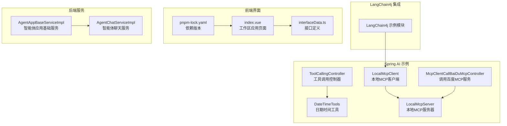
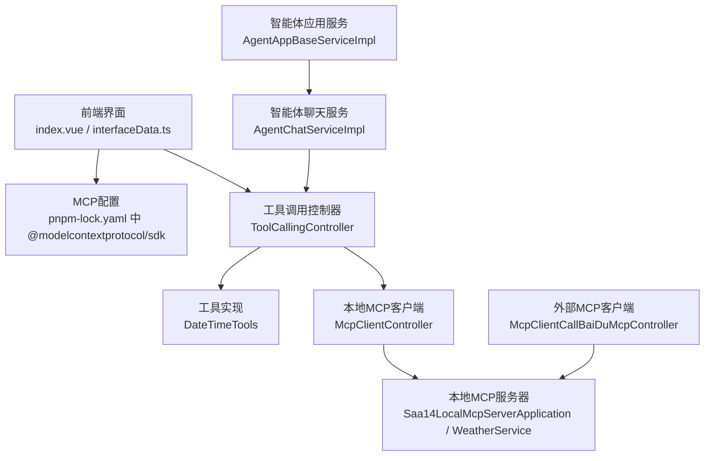
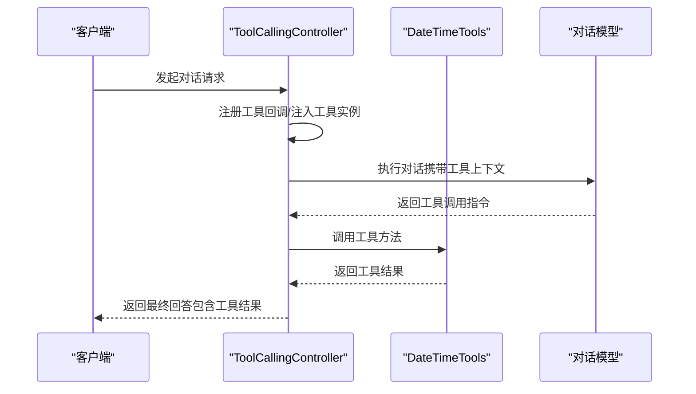
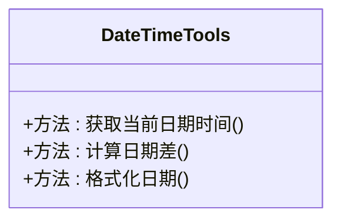
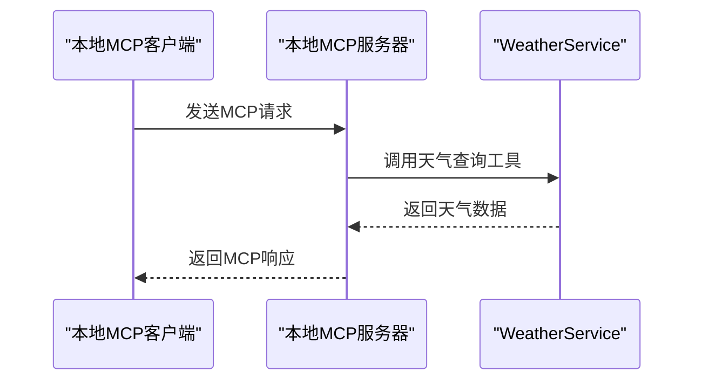
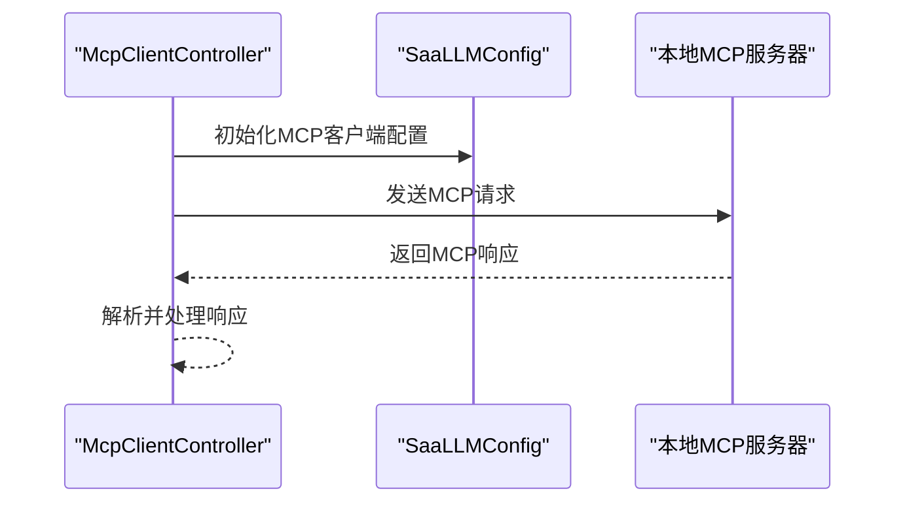
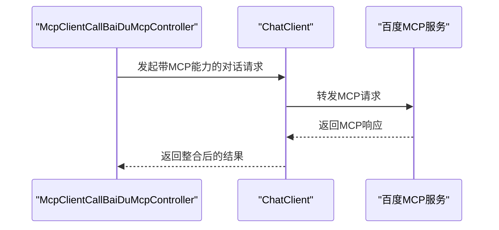
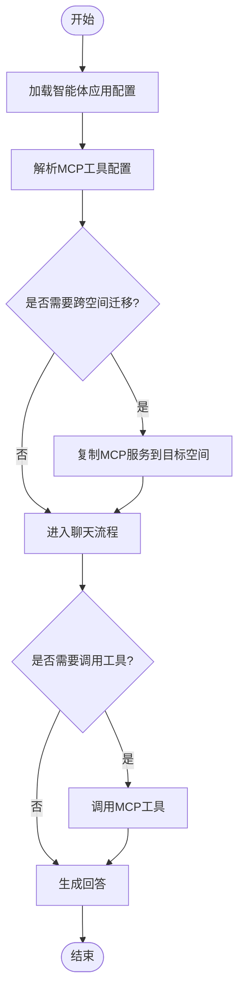
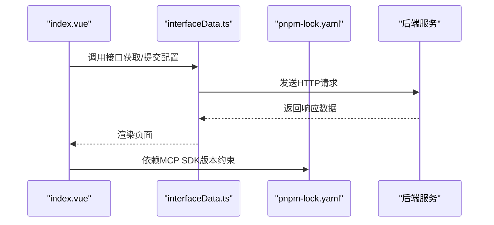
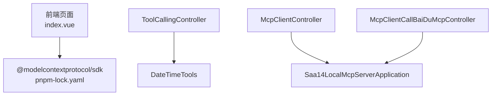

# MCP集成实战案例

<cite>
**本文引用的文件**
- [ToolCallingController.java](file://【1】SpringAIAlibaba-atguiguV1/SAA-13ToolCalling/src/main/java/com/atguigu/study/controller/ToolCallingController.java)
- [DateTimeTools.java](file://【1】SpringAIAlibaba-atguiguV1/SAA-13ToolCalling/src/main/java/com/atguigu/study/utils/DateTimeTools.java)
- [McpClientCallBaiDuMcpController.java](file://【1】SpringAIAlibaba-atguiguV1/SAA-16ClientCallBaiduMcpServer/src/main/java/com/atguigu/study/controller/McpClientCallBaiDuMcpController.java)
- [Saa14LocalMcpServerApplication.java](file://【1】SpringAIAlibaba-atguiguV1/SAA-14LocalMcpServer/src/main/java/com/atguigu/study/Saa14LocalMcpServerApplication.java)
- [WeatherService.java](file://【1】SpringAIAlibaba-atguiguV1/SAA-14LocalMcpServer/src/main/java/com/atguigu/study/service/WeatherService.java)
- [McpServerConfig.java](file://【1】SpringAIAlibaba-atguiguV1/SAA-14LocalMcpServer/src/main/java/com/atguigu/study/config/McpServerConfig.java)
- [McpClientController.java](file://【1】SpringAIAlibaba-atguiguV1/SAA-15LocalMcpClient/src/main/java/com/atguigu/study/controller/McpClientController.java)
- [SaaLLMConfig.java](file://【1】SpringAIAlibaba-atguiguV1/SAA-15LocalMcpClient/src/main/java/com/atguigu/study/config/SaaLLMConfig.java)
- [Saa15LocalMcpClientApplication.java](file://【1】SpringAIAlibaba-atguiguV1/SAA-15LocalMcpClient/src/main/java/com/atguigu/study/Saa15LocalMcpClientApplication.java)
- [AgentAppBaseServiceImpl.java](file://【3】工作资料/code/仓颉智能体/nlp-agent/agent-builder/agent-build-core/src/main/java/com/yundingtech/agent/build/modules/appbase/service/impl/AgentAppBaseServiceImpl.java)
- [AgentChatServiceImpl.java](file://【3】工作资料/code/仓颉智能体/nlp-agent/agent-builder/agent-build-core/src/main/java/com/yundingtech/agent/build/modules/agent/service/impl/AgentChatServiceImpl.java)
- [pnpm-lock.yaml](file://【3】工作资料/code/仓颉智能体/nlp-frontend-web/pnpm-lock.yaml)
- [index.vue](file://【3】工作资料/code/仓颉智能体/nlp-frontend-web/src/views/workspace/pages/workApps/pages/index.vue)
- [interfaceData.ts](file://【3】工作资料/code/仓颉智能体/nlp-frontend-web/src/views/workspace/interfaceData.ts)
</cite>

## 目录
1. [引言](#引言)
2. [项目结构](#项目结构)
3. [核心组件](#核心组件)
4. [架构总览](#架构总览)
5. [详细组件分析](#详细组件分析)
6. [依赖分析](#依赖分析)
7. [性能考量](#性能考量)
8. [故障排查指南](#故障排查指南)
9. [结论](#结论)
10. [附录](#附录)

## 引言
本指南围绕MCP（Model Context Protocol）协议在实际AI应用中的集成与落地，提供从工具调用、函数调用到第三方服务集成的完整实践路径。重点剖析ToolCallingController中的工具调用实现，展示如何在Spring AI应用中注册并使用外部工具；同时介绍DateTimeTools等实用工具的MCP实现方式，并结合LangChain4j框架中的MCP应用现状，说明不同AI框架对MCP协议的支持情况。文档还覆盖从简单工具调用到复杂多步骤工作流的实现示例，以及错误处理、性能优化与安全考虑的最佳实践。

## 项目结构
本仓库包含多个与MCP集成相关的子工程与前端界面，涵盖本地MCP服务器、本地MCP客户端、Spring AI工具调用示例、LangChain4j集成示例，以及前端工作区与应用管理界面。下图给出与MCP集成相关的核心模块关系概览：

**图示来源**
- [ToolCallingController.java:1-120](file://【1】SpringAIAlibaba-atguiguV1/SAA-13ToolCalling/src/main/java/com/atguigu/study/controller/ToolCallingController.java#L1-L120)
- [DateTimeTools.java:1-120](file://【1】SpringAIAlibaba-atguiguV1/SAA-13ToolCalling/src/main/java/com/atguigu/study/utils/DateTimeTools.java#L1-L120)
- [Saa14LocalMcpServerApplication.java:1-120](file://【1】SpringAIAlibaba-atguiguV1/SAA-14LocalMcpServer/src/main/java/com/atguigu/study/Saa14LocalMcpServerApplication.java#L1-L120)
- [McpClientController.java:1-120](file://【1】SpringAIAlibaba-atguiguV1/SAA-15LocalMcpClient/src/main/java/com/atguigu/study/controller/McpClientController.java#L1-L120)
- [McpClientCallBaiDuMcpController.java:1-120](file://【1】SpringAIAlibaba-atguiguV1/SAA-16ClientCallBaiduMcpServer/src/main/java/com/atguigu/study/controller/McpClientCallBaiDuMcpController.java#L1-L120)
- [AgentAppBaseServiceImpl.java:370-540](file://【3】工作资料/code/仓颉智能体/nlp-agent/agent-builder/agent-build-core/src/main/java/com/yundingtech/agent/build/modules/appbase/service/impl/AgentAppBaseServiceImpl.java#L370-L540)
- [AgentChatServiceImpl.java:60-80](file://【3】工作资料/code/仓颉智能体/nlp-agent/agent-builder/agent-build-core/src/main/java/com/yundingtech/agent/build/modules/agent/service/impl/AgentChatServiceImpl.java#L60-L80)
- [index.vue:220-422](file://【3】工作资料/code/仓颉智能体/nlp-frontend-web/src/views/workspace/pages/workApps/pages/index.vue#L220-L422)
- [interfaceData.ts:1-54](file://【3】工作资料/code/仓颉智能体/nlp-frontend-web/src/views/workspace/interfaceData.ts#L1-L54)
- [pnpm-lock.yaml:11617-11633](file://【3】工作资料/code/仓颉智能体/nlp-frontend-web/pnpm-lock.yaml#L11617-L11633)

**章节来源**
- [ToolCallingController.java:1-120](file://【1】SpringAIAlibaba-atguiguV1/SAA-13ToolCalling/src/main/java/com/atguigu/study/controller/ToolCallingController.java#L1-L120)
- [Saa14LocalMcpServerApplication.java:1-120](file://【1】SpringAIAlibaba-atguiguV1/SAA-14LocalMcpServer/src/main/java/com/atguigu/study/Saa14LocalMcpServerApplication.java#L1-L120)
- [McpClientController.java:1-120](file://【1】SpringAIAlibaba-atguiguV1/SAA-15LocalMcpClient/src/main/java/com/atguigu/study/controller/McpClientController.java#L1-L120)
- [McpClientCallBaiDuMcpController.java:1-120](file://【1】SpringAIAlibaba-atguiguV1/SAA-16ClientCallBaiduMcpServer/src/main/java/com/atguigu/study/controller/McpClientCallBaiDuMcpController.java#L1-L120)
- [AgentAppBaseServiceImpl.java:370-540](file://【3】工作资料/code/仓颉智能体/nlp-agent/agent-builder/agent-build-core/src/main/java/com/yundingtech/agent/build/modules/appbase/service/impl/AgentAppBaseServiceImpl.java#L370-L540)
- [AgentChatServiceImpl.java:60-80](file://【3】工作资料/code/仓颉智能体/nlp-agent/agent-builder/agent-build-core/src/main/java/com/yundingtech/agent/build/modules/agent/service/impl/AgentChatServiceImpl.java#L60-L80)
- [index.vue:220-422](file://【3】工作资料/code/仓颉智能体/nlp-frontend-web/src/views/workspace/pages/workApps/pages/index.vue#L220-L422)
- [interfaceData.ts:1-54](file://【3】工作资料/code/仓颉智能体/nlp-frontend-web/src/views/workspace/interfaceData.ts#L1-L54)
- [pnpm-lock.yaml:11617-11633](file://【3】工作资料/code/仓颉智能体/nlp-frontend-web/pnpm-lock.yaml#L11617-L11633)

## 核心组件
- 工具调用控制器（ToolCallingController）：演示如何注册并使用工具回调，将工具实例注入到对话流程中，实现对外部能力的调用。
- 实用工具（DateTimeTools）：提供日期时间相关的工具方法，作为MCP工具的典型实现示例。
- 本地MCP服务器（SAA-14LocalMcpServer）：提供本地MCP服务端示例，包含MCP服务器配置与天气服务工具。
- 本地MCP客户端（SAA-15LocalMcpClient）：演示如何在客户端侧发起MCP调用，连接本地MCP服务器。
- 调用百度MCP服务（SAA-16ClientCallBaiduMcpServer）：展示如何通过ChatClient调用第三方MCP服务（如百度MCP服务）。
- 智能体应用与聊天服务（AgentAppBaseServiceImpl、AgentChatServiceImpl）：体现MCP工具在智能体应用中的配置与运行时调用。
- 前端工作区与应用页面（index.vue、interfaceData.ts、pnpm-lock.yaml）：提供应用管理、配置与接口定义，支撑MCP工具在前端的可视化配置与发布。

**章节来源**
- [ToolCallingController.java:1-120](file://【1】SpringAIAlibaba-atguiguV1/SAA-13ToolCalling/src/main/java/com/atguigu/study/controller/ToolCallingController.java#L1-L120)
- [DateTimeTools.java:1-120](file://【1】SpringAIAlibaba-atguiguV1/SAA-13ToolCalling/src/main/java/com/atguigu/study/utils/DateTimeTools.java#L1-L120)
- [Saa14LocalMcpServerApplication.java:1-120](file://【1】SpringAIAlibaba-atguiguV1/SAA-14LocalMcpServer/src/main/java/com/atguigu/study/Saa14LocalMcpServerApplication.java#L1-L120)
- [McpClientController.java:1-120](file://【1】SpringAIAlibaba-atguiguV1/SAA-15LocalMcpClient/src/main/java/com/atguigu/study/controller/McpClientController.java#L1-L120)
- [McpClientCallBaiDuMcpController.java:1-120](file://【1】SpringAIAlibaba-atguiguV1/SAA-16ClientCallBaiduMcpServer/src/main/java/com/atguigu/study/controller/McpClientCallBaiDuMcpController.java#L1-L120)
- [AgentAppBaseServiceImpl.java:370-540](file://【3】工作资料/code/仓颉智能体/nlp-agent/agent-builder/agent-build-core/src/main/java/com/yundingtech/agent/build/modules/appbase/service/impl/AgentAppBaseServiceImpl.java#L370-L540)
- [AgentChatServiceImpl.java:60-80](file://【3】工作资料/code/仓颉智能体/nlp-agent/agent-builder/agent-build-core/src/main/java/com/yundingtech/agent/build/modules/agent/service/impl/AgentChatServiceImpl.java#L60-L80)
- [index.vue:220-422](file://【3】工作资料/code/仓颉智能体/nlp-frontend-web/src/views/workspace/pages/workApps/pages/index.vue#L220-L422)
- [interfaceData.ts:1-54](file://【3】工作资料/code/仓颉智能体/nlp-frontend-web/src/views/workspace/interfaceData.ts#L1-L54)
- [pnpm-lock.yaml:11617-11633](file://【3】工作资料/code/仓颉智能体/nlp-frontend-web/pnpm-lock.yaml#L11617-L11633)

## 架构总览
下图展示了MCP在本项目中的整体架构：前端通过页面与接口管理应用配置，后端通过工具调用控制器与MCP客户端/服务器进行交互，智能体服务负责运行时的工具调用与工作流编排。

**图示来源**
- [ToolCallingController.java:1-120](file://【1】SpringAIAlibaba-atguiguV1/SAA-13ToolCalling/src/main/java/com/atguigu/study/controller/ToolCallingController.java#L1-L120)
- [DateTimeTools.java:1-120](file://【1】SpringAIAlibaba-atguiguV1/SAA-13ToolCalling/src/main/java/com/atguigu/study/utils/DateTimeTools.java#L1-L120)
- [Saa14LocalMcpServerApplication.java:1-120](file://【1】SpringAIAlibaba-atguiguV1/SAA-14LocalMcpServer/src/main/java/com/atguigu/study/Saa14LocalMcpServerApplication.java#L1-L120)
- [WeatherService.java:1-120](file://【1】SpringAIAlibaba-atguiguV1/SAA-14LocalMcpServer/src/main/java/com/atguigu/study/service/WeatherService.java#L1-L120)
- [McpClientController.java:1-120](file://【1】SpringAIAlibaba-atguiguV1/SAA-15LocalMcpClient/src/main/java/com/atguigu/study/controller/McpClientController.java#L1-L120)
- [McpClientCallBaiDuMcpController.java:1-120](file://【1】SpringAIAlibaba-atguiguV1/SAA-16ClientCallBaiduMcpServer/src/main/java/com/atguigu/study/controller/McpClientCallBaiDuMcpController.java#L1-L120)
- [AgentAppBaseServiceImpl.java:370-540](file://【3】工作资料/code/仓颉智能体/nlp-agent/agent-builder/agent-build-core/src/main/java/com/yundingtech/agent/build/modules/appbase/service/impl/AgentAppBaseServiceImpl.java#L370-L540)
- [AgentChatServiceImpl.java:60-80](file://【3】工作资料/code/仓颉智能体/nlp-agent/agent-builder/agent-build-core/src/main/java/com/yundingtech/agent/build/modules/agent/service/impl/AgentChatServiceImpl.java#L60-L80)
- [pnpm-lock.yaml:11617-11633](file://【3】工作资料/code/仓颉智能体/nlp-frontend-web/pnpm-lock.yaml#L11617-L11633)

## 详细组件分析

### 工具调用控制器（ToolCallingController）
该控制器演示了如何将工具实例注册到对话流程中，以实现对外部能力的调用。其关键点包括：
- 工具回调注册：通过工具回调工厂创建工具集合，注入到对话上下文中。
- 工具实例注入：在对话构建阶段直接注入具体工具实例，便于后续调用。
- 工具调用执行：在对话执行过程中，根据模型输出的工具调用指令，调用对应工具并返回结果。

**图示来源**
- [ToolCallingController.java:1-120](file://【1】SpringAIAlibaba-atguiguV1/SAA-13ToolCalling/src/main/java/com/atguigu/study/controller/ToolCallingController.java#L1-L120)
- [DateTimeTools.java:1-120](file://【1】SpringAIAlibaba-atguiguV1/SAA-13ToolCalling/src/main/java/com/atguigu/study/utils/DateTimeTools.java#L1-L120)

**章节来源**
- [ToolCallingController.java:1-120](file://【1】SpringAIAlibaba-atguiguV1/SAA-13ToolCalling/src/main/java/com/atguigu/study/controller/ToolCallingController.java#L1-L120)
- [DateTimeTools.java:1-120](file://【1】SpringAIAlibaba-atguiguV1/SAA-13ToolCalling/src/main/java/com/atguigu/study/utils/DateTimeTools.java#L1-L120)

### 实用工具（DateTimeTools）
该工具类提供了日期时间相关的工具方法，作为MCP工具的典型实现示例。其职责包括：
- 工具方法定义：提供可被模型识别并调用的方法签名。
- 工具注册：通过工具回调工厂注册到工具集合中，供对话流程使用。
- 结果封装：确保工具返回的数据格式符合预期，便于后续处理。

**图示来源**
- [DateTimeTools.java:1-120](file://【1】SpringAIAlibaba-atguiguV1/SAA-13ToolCalling/src/main/java/com/atguigu/study/utils/DateTimeTools.java#L1-L120)

**章节来源**
- [DateTimeTools.java:1-120](file://【1】SpringAIAlibaba-atguiguV1/SAA-13ToolCalling/src/main/java/com/atguigu/study/utils/DateTimeTools.java#L1-L120)

### 本地MCP服务器（SAA-14LocalMcpServer）
该模块提供本地MCP服务端示例，包含MCP服务器配置与天气服务工具：
- 服务器启动：通过主应用类启动MCP服务器。
- 工具注册：在服务器中注册可用工具（如天气查询）。
- 请求处理：接收来自客户端的MCP请求，执行工具调用并返回结果。

**图示来源**
- [Saa14LocalMcpServerApplication.java:1-120](file://【1】SpringAIAlibaba-atguiguV1/SAA-14LocalMcpServer/src/main/java/com/atguigu/study/Saa14LocalMcpServerApplication.java#L1-L120)
- [WeatherService.java:1-120](file://【1】SpringAIAlibaba-atguiguV1/SAA-14LocalMcpServer/src/main/java/com/atguigu/study/service/WeatherService.java#L1-L120)

**章节来源**
- [Saa14LocalMcpServerApplication.java:1-120](file://【1】SpringAIAlibaba-atguiguV1/SAA-14LocalMcpServer/src/main/java/com/atguigu/study/Saa14LocalMcpServerApplication.java#L1-L120)
- [WeatherService.java:1-120](file://【1】SpringAIAlibaba-atguiguV1/SAA-14LocalMcpServer/src/main/java/com/atguigu/study/service/WeatherService.java#L1-L120)

### 本地MCP客户端（SAA-15LocalMcpClient）
该模块演示如何在客户端侧发起MCP调用，连接本地MCP服务器：
- 客户端配置：通过配置类设置MCP客户端参数。
- 请求发送：向本地MCP服务器发送请求。
- 响应处理：解析服务器返回的MCP响应并进行后续处理。

**图示来源**
- [McpClientController.java:1-120](file://【1】SpringAIAlibaba-atguiguV1/SAA-15LocalMcpClient/src/main/java/com/atguigu/study/controller/McpClientController.java#L1-L120)
- [SaaLLMConfig.java:1-120](file://【1】SpringAIAlibaba-atguiguV1/SAA-15LocalMcpClient/src/main/java/com/atguigu/study/config/SaaLLMConfig.java#L1-L120)

**章节来源**
- [McpClientController.java:1-120](file://【1】SpringAIAlibaba-atguiguV1/SAA-15LocalMcpClient/src/main/java/com/atguigu/study/controller/McpClientController.java#L1-L120)
- [SaaLLMConfig.java:1-120](file://【1】SpringAIAlibaba-atguiguV1/SAA-15LocalMcpClient/src/main/java/com/atguigu/study/config/SaaLLMConfig.java#L1-L120)

### 调用百度MCP服务（SAA-16ClientCallBaiduMcpServer）
该模块展示如何通过ChatClient调用第三方MCP服务（如百度MCP服务）：
- ChatClient配置：为ChatClient添加MCP调用能力。
- 请求转发：将对话请求转发至MCP服务端。
- 结果回传：接收MCP服务返回的结果并整合到对话流程中。

**图示来源**
- [McpClientCallBaiDuMcpController.java:1-120](file://【1】SpringAIAlibaba-atguiguV1/SAA-16ClientCallBaiduMcpServer/src/main/java/com/atguigu/study/controller/McpClientCallBaiDuMcpController.java#L1-L120)

**章节来源**
- [McpClientCallBaiDuMcpController.java:1-120](file://【1】SpringAIAlibaba-atguiguV1/SAA-16ClientCallBaiduMcpServer/src/main/java/com/atguigu/study/controller/McpClientCallBaiDuMcpController.java#L1-L120)

### 智能体应用与聊天服务（AgentAppBaseServiceImpl、AgentChatServiceImpl）
这两个服务体现了MCP工具在智能体应用中的配置与运行时调用：
- MCP工具配置：在智能体应用的基础服务中处理MCP工具配置，必要时进行跨空间迁移或重新关联。
- 运行时调用：在聊天服务中根据用户问题判断是否需要调用MCP工具，并基于工具返回结果作答。

**图示来源**
- [AgentAppBaseServiceImpl.java:370-540](file://【3】工作资料/code/仓颉智能体/nlp-agent/agent-builder/agent-build-core/src/main/java/com/yundingtech/agent/build/modules/appbase/service/impl/AgentAppBaseServiceImpl.java#L370-L540)
- [AgentChatServiceImpl.java:60-80](file://【3】工作资料/code/仓颉智能体/nlp-agent/agent-builder/agent-build-core/src/main/java/com/yundingtech/agent/build/modules/agent/service/impl/AgentChatServiceImpl.java#L60-L80)

**章节来源**
- [AgentAppBaseServiceImpl.java:370-540](file://【3】工作资料/code/仓颉智能体/nlp-agent/agent-builder/agent-build-core/src/main/java/com/yundingtech/agent/build/modules/appbase/service/impl/AgentAppBaseServiceImpl.java#L370-L540)
- [AgentChatServiceImpl.java:60-80](file://【3】工作资料/code/仓颉智能体/nlp-agent/agent-builder/agent-build-core/src/main/java/com/yundingtech/agent/build/modules/agent/service/impl/AgentChatServiceImpl.java#L60-L80)

### 前端工作区与应用页面（index.vue、interfaceData.ts、pnpm-lock.yaml）
前端页面与接口定义支撑MCP工具在前端的可视化配置与发布：
- 页面逻辑：工作区应用页面支持工作流、智能体等不同类型应用的配置与校验。
- 接口定义：统一管理后端接口地址，便于前后端协作。
- 依赖版本：锁定MCP SDK版本，确保前端与后端MCP协议兼容性。

**图示来源**
- [index.vue:220-422](file://【3】工作资料/code/仓颉智能体/nlp-frontend-web/src/views/workspace/pages/workApps/pages/index.vue#L220-L422)
- [interfaceData.ts:1-54](file://【3】工作资料/code/仓颉智能体/nlp-frontend-web/src/views/workspace/interfaceData.ts#L1-L54)
- [pnpm-lock.yaml:11617-11633](file://【3】工作资料/code/仓颉智能体/nlp-frontend-web/pnpm-lock.yaml#L11617-L11633)

**章节来源**
- [index.vue:220-422](file://【3】工作资料/code/仓颉智能体/nlp-frontend-web/src/views/workspace/pages/workApps/pages/index.vue#L220-L422)
- [interfaceData.ts:1-54](file://【3】工作资料/code/仓颉智能体/nlp-frontend-web/src/views/workspace/interfaceData.ts#L1-L54)
- [pnpm-lock.yaml:11617-11633](file://【3】工作资料/code/仓颉智能体/nlp-frontend-web/pnpm-lock.yaml#L11617-L11633)

## 依赖分析
- MCP SDK依赖：前端通过pnpm-lock.yaml锁定MCP SDK版本，确保与后端协议一致。
- 组件耦合：工具调用控制器与工具实现之间存在直接依赖；本地MCP客户端与服务器之间通过MCP协议耦合；智能体服务与工具调用之间存在运行时耦合。
- 外部集成：通过ChatClient集成第三方MCP服务，扩展工具能力边界。

**图示来源**
- [pnpm-lock.yaml:11617-11633](file://【3】工作资料/code/仓颉智能体/nlp-frontend-web/pnpm-lock.yaml#L11617-L11633)
- [ToolCallingController.java:1-120](file://【1】SpringAIAlibaba-atguiguV1/SAA-13ToolCalling/src/main/java/com/atguigu/study/controller/ToolCallingController.java#L1-L120)
- [DateTimeTools.java:1-120](file://【1】SpringAIAlibaba-atguiguV1/SAA-13ToolCalling/src/main/java/com/atguigu/study/utils/DateTimeTools.java#L1-L120)
- [McpClientController.java:1-120](file://【1】SpringAIAlibaba-atguiguV1/SAA-15LocalMcpClient/src/main/java/com/atguigu/study/controller/McpClientController.java#L1-L120)
- [Saa14LocalMcpServerApplication.java:1-120](file://【1】SpringAIAlibaba-atguiguV1/SAA-14LocalMcpServer/src/main/java/com/atguigu/study/Saa14LocalMcpServerApplication.java#L1-L120)
- [McpClientCallBaiDuMcpController.java:1-120](file://【1】SpringAIAlibaba-atguiguV1/SAA-16ClientCallBaiduMcpServer/src/main/java/com/atguigu/study/controller/McpClientCallBaiDuMcpController.java#L1-L120)

**章节来源**
- [pnpm-lock.yaml:11617-11633](file://【3】工作资料/code/仓颉智能体/nlp-frontend-web/pnpm-lock.yaml#L11617-L11633)
- [ToolCallingController.java:1-120](file://【1】SpringAIAlibaba-atguiguV1/SAA-13ToolCalling/src/main/java/com/atguigu/study/controller/ToolCallingController.java#L1-L120)
- [DateTimeTools.java:1-120](file://【1】SpringAIAlibaba-atguiguV1/SAA-13ToolCalling/src/main/java/com/atguigu/study/utils/DateTimeTools.java#L1-L120)
- [McpClientController.java:1-120](file://【1】SpringAIAlibaba-atguiguV1/SAA-15LocalMcpClient/src/main/java/com/atguigu/study/controller/McpClientController.java#L1-L120)
- [Saa14LocalMcpServerApplication.java:1-120](file://【1】SpringAIAlibaba-atguiguV1/SAA-14LocalMcpServer/src/main/java/com/atguigu/study/Saa14LocalMcpServerApplication.java#L1-L120)
- [McpClientCallBaiDuMcpController.java:1-120](file://【1】SpringAIAlibaba-atguiguV1/SAA-16ClientCallBaiduMcpServer/src/main/java/com/atguigu/study/controller/McpClientCallBaiDuMcpController.java#L1-L120)

## 性能考量
- 工具调用批量化：在工具调用控制器中，尽量合并多次工具调用，减少往返次数。
- 缓存策略：对工具返回的静态或低频变更数据进行缓存，降低重复计算与网络开销。
- 并发控制：在本地MCP客户端与服务器之间合理设置并发上限，避免资源争用。
- 前端渲染优化：在前端页面中对配置项与工作流图进行懒加载与分页，提升交互流畅度。
- 协议版本管理：通过锁定MCP SDK版本，避免因协议升级导致的性能退化或兼容性问题。

## 故障排查指南
- 工具未注册：确认工具回调已正确注册到工具集合，且在对话构建时已注入工具实例。
- MCP连接失败：检查本地MCP服务器是否正常启动，客户端配置是否正确指向服务器地址。
- 第三方服务异常：验证ChatClient的MCP集成配置，检查第三方MCP服务的可用性与认证信息。
- 智能体工具迁移：若出现跨空间迁移问题，检查智能体应用的基础服务配置与工具复制逻辑。
- 前端依赖冲突：核对pnpm-lock.yaml中的MCP SDK版本，确保与后端一致。

**章节来源**
- [ToolCallingController.java:1-120](file://【1】SpringAIAlibaba-atguiguV1/SAA-13ToolCalling/src/main/java/com/atguigu/study/controller/ToolCallingController.java#L1-L120)
- [Saa14LocalMcpServerApplication.java:1-120](file://【1】SpringAIAlibaba-atguiguV1/SAA-14LocalMcpServer/src/main/java/com/atguigu/study/Saa14LocalMcpServerApplication.java#L1-L120)
- [McpClientCallBaiDuMcpController.java:1-120](file://【1】SpringAIAlibaba-atguiguV1/SAA-16ClientCallBaiduMcpServer/src/main/java/com/atguigu/study/controller/McpClientCallBaiDuMcpController.java#L1-L120)
- [AgentAppBaseServiceImpl.java:370-540](file://【3】工作资料/code/仓颉智能体/nlp-agent/agent-builder/agent-build-core/src/main/java/com/yundingtech/agent/build/modules/appbase/service/impl/AgentAppBaseServiceImpl.java#L370-L540)
- [pnpm-lock.yaml:11617-11633](file://【3】工作资料/code/仓颉智能体/nlp-frontend-web/pnpm-lock.yaml#L11617-L11633)

## 结论
本指南通过多个实战案例展示了MCP协议在AI应用中的集成路径，从工具调用、函数调用到第三方服务集成，覆盖了从简单工具到复杂工作流的完整实现。结合Spring AI与LangChain4j的现有实现，可以看出MCP在不同框架中的适配与扩展能力。通过合理的架构设计、性能优化与安全考虑，可以有效提升AI应用的工具调用效率与稳定性。

## 附录
- 术语解释
  - 工具调用：指AI模型根据用户问题调用外部工具以获取或处理信息的过程。
  - 函数调用：指在特定框架（如LangChain4j）中，模型输出函数签名与参数，由运行时执行对应函数。
  - 第三方服务集成：通过MCP协议对接外部服务，扩展AI应用的能力边界。
- 最佳实践清单
  - 明确工具职责边界，避免过度耦合。
  - 在前端与后端保持MCP协议版本一致。
  - 对工具调用进行超时与重试控制。
  - 在智能体应用中做好工具配置的跨空间迁移与一致性校验。
  - 对前端页面进行性能优化，提升用户体验。