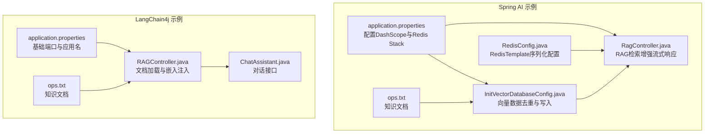
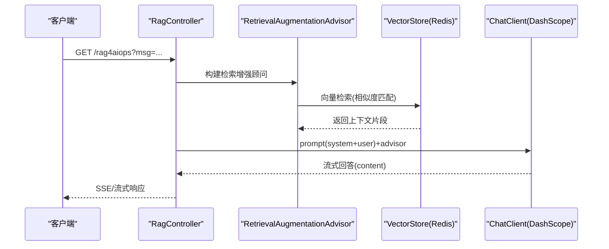
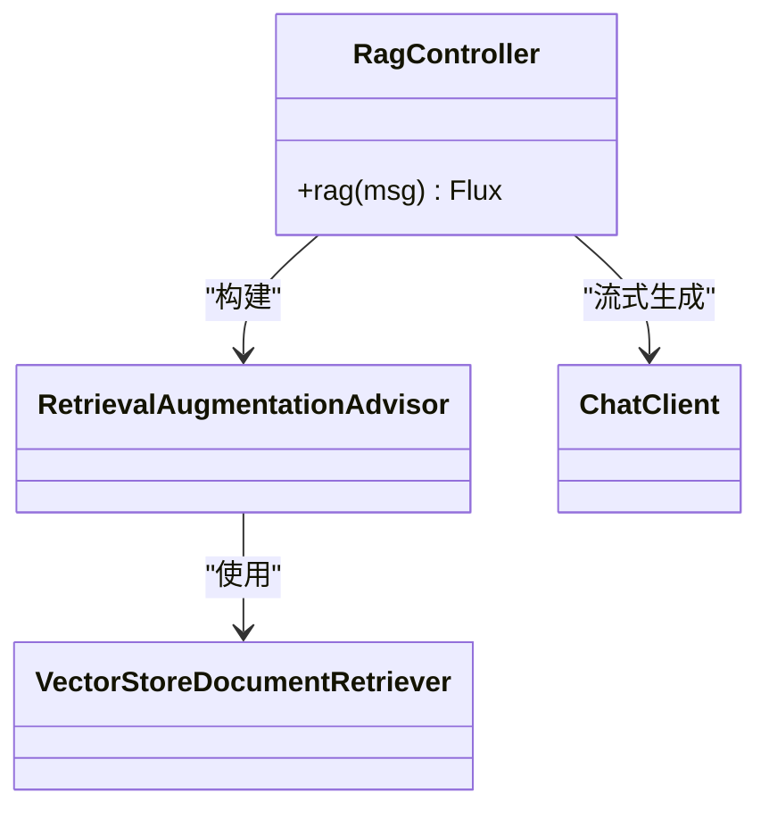
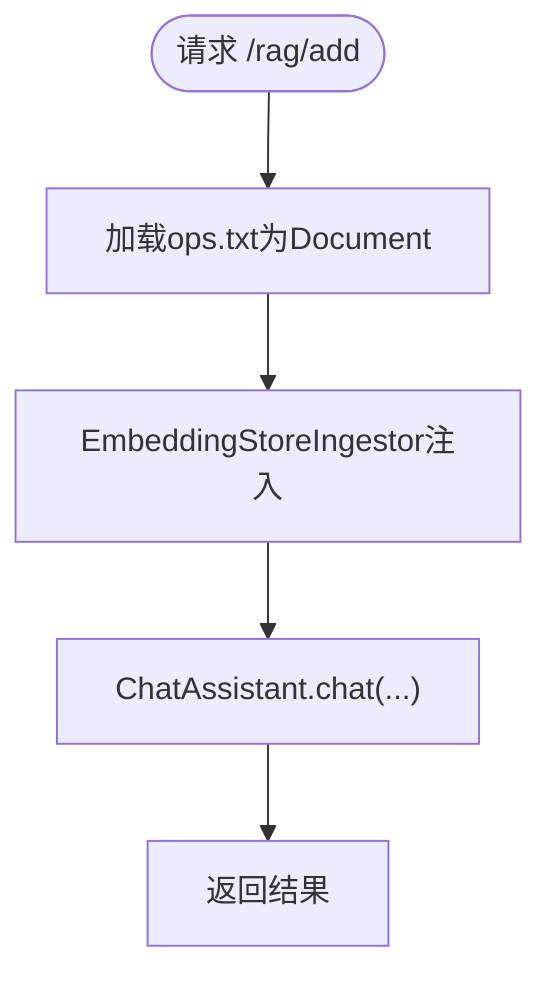
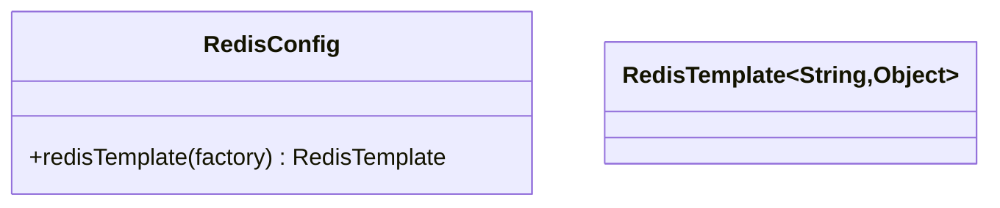
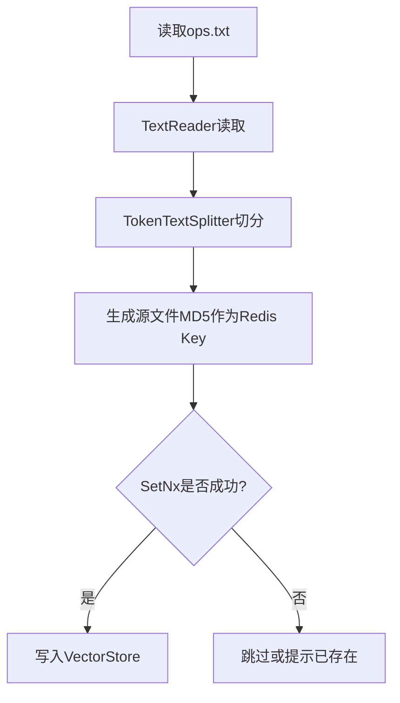
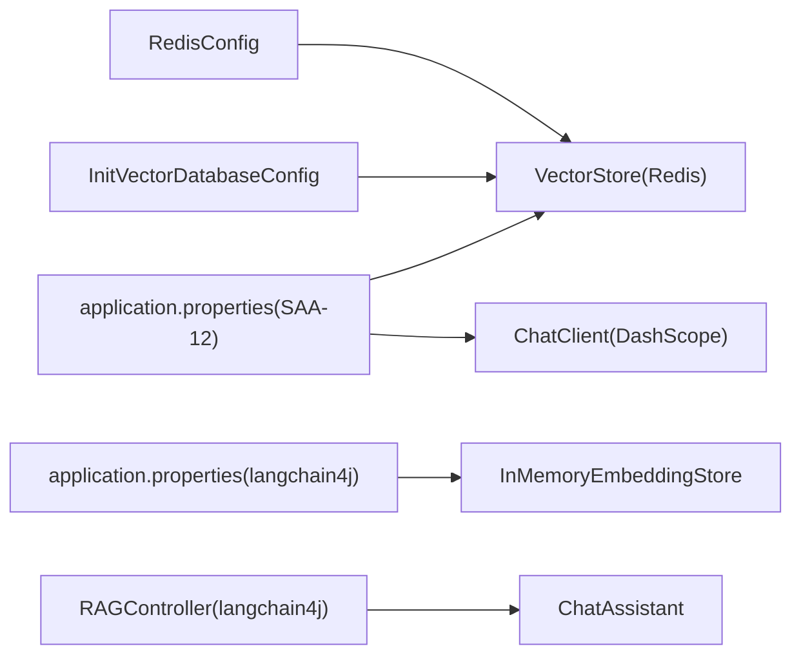

# RAG优化策略与最佳实践

<cite>
**本文引用的文件**   
- [application.properties](file://【1】SpringAIAlibaba-atguiguV1/SAA-12RAG4AiOps/src/main/resources/application.properties)
- [RedisConfig.java](file://【1】SpringAIAlibaba-atguiguV1/SAA-12RAG4AiOps/src/main/java/com/atguigu/study/config/RedisConfig.java)
- [RagController.java](file://【1】SpringAIAlibaba-atguiguV1/SAA-12RAG4AiOps/src/main/java/com/atguigu/study/controller/RagController.java)
- [InitVectorDatabaseConfig.java](file://【1】SpringAIAlibaba-atguiguV1/SAA-12RAG4AiOps/src/main/java/com/atguigu/study/config/InitVectorDatabaseConfig.java)
- [application.properties](file://【2】langchain4j-atguiguV5/langchain4j-13chat-rag01/src/main/resources/application.properties)
- [RAGController.java](file://【2】langchain4j-atguiguV5/langchain4j-13chat-rag01/src/main/java/com/atguigu/study/controller/RAGController.java)
- [ChatAssistant.java](file://【2】langchain4j-atguiguV5/langchain4j-13chat-rag01/src/main/java/com/atguigu/study/service/ChatAssistant.java)
- [ops.txt](file://【1】SpringAIAlibaba-atguiguV1/SAA-12RAG4AiOps/src/main/resources/ops.txt)
- [ops.txt](file://【2】langchain4j-atguiguV5/langchain4j-13chat-rag01/src/main/resources/ops.txt)
</cite>

## 目录
1. [引言](#引言)
2. [项目结构](#项目结构)
3. [核心组件](#核心组件)
4. [架构总览](#架构总览)
5. [详细组件分析](#详细组件分析)
6. [依赖分析](#依赖分析)
7. [性能考量](#性能考量)
8. [故障排查指南](#故障排查指南)
9. [结论](#结论)
10. [附录](#附录)

## 引言
本指南面向RAG系统优化与生产落地，基于仓库中的Spring AI与LangChain4j示例工程，系统阐述查询优化、缓存策略、并发处理、资源管理、向量索引与检索算法优化、监控指标与基准测试、成本优化以及Redis缓存配置与部署经验。目标是帮助读者在真实业务场景中实现高可用、高性能、低成本的RAG系统。

## 项目结构
本仓库包含两套RAG示例工程：
- Spring AI Alibaba 示例（SAA-12RAG4AiOps）：基于Spring AI的RAG流水线，使用DashScope模型、Redis Stack向量存储与Spring VectorStore。
- LangChain4j 示例（langchain4j-13chat-rag01）：基于LangChain4j的RAG流水线，使用内存嵌入存储与ChatAssistant服务。

**图表来源**
- [application.properties:1-24](file://【1】SpringAIAlibaba-atguiguV1/SAA-12RAG4AiOps/src/main/resources/application.properties#L1-L24)
- [RedisConfig.java:1-56](file://【1】SpringAIAlibaba-atguiguV1/SAA-12RAG4AiOps/src/main/java/com/atguigu/study/config/RedisConfig.java#L1-L56)
- [RagController.java:1-53](file://【1】SpringAIAlibaba-atguiguV1/SAA-12RAG4AiOps/src/main/java/com/atguigu/study/controller/RagController.java#L1-L53)
- [InitVectorDatabaseConfig.java:1-75](file://【1】SpringAIAlibaba-atguiguV1/SAA-12RAG4AiOps/src/main/java/com/atguigu/study/config/InitVectorDatabaseConfig.java#L1-L75)
- [application.properties:1-3](file://【2】langchain4j-atguiguV5/langchain4j-13chat-rag01/src/main/resources/application.properties#L1-L3)
- [RAGController.java:1-46](file://【2】langchain4j-atguiguV5/langchain4j-13chat-rag01/src/main/java/com/atguigu/study/controller/RAGController.java#L1-L46)
- [ChatAssistant.java:1-18](file://【2】langchain4j-atguiguV5/langchain4j-13chat-rag01/src/main/java/com/atguigu/study/service/ChatAssistant.java#L1-L18)

**章节来源**
- [application.properties:1-24](file://【1】SpringAIAlibaba-atguiguV1/SAA-12RAG4AiOps/src/main/resources/application.properties#L1-L24)
- [application.properties:1-3](file://【2】langchain4j-atguiguV5/langchain4j-13chat-rag01/src/main/resources/application.properties#L1-L3)

## 核心组件
- 配置层
  - DashScope模型与嵌入配置、Redis Stack连接与索引命名、前缀等。
  - LangChain4j基础端口与应用名。
- 控制器层
  - Spring AI：RAG检索增强流式响应控制器。
  - LangChain4j：文档加载、嵌入注入与对话入口。
- 存储与缓存层
  - Redis Stack向量存储（Spring AI）。
  - 内存嵌入存储（LangChain4j）。
  - RedisTemplate序列化配置（Spring AI）。
- 初始化与去重
  - 文档读取、分词切分、向量写入与Redis幂等去重（Spring AI）。

**章节来源**
- [RagController.java:1-53](file://【1】SpringAIAlibaba-atguiguV1/SAA-12RAG4AiOps/src/main/java/com/atguigu/study/controller/RagController.java#L1-L53)
- [RAGController.java:1-46](file://【2】langchain4j-atguiguV5/langchain4j-13chat-rag01/src/main/java/com/atguigu/study/controller/RAGController.java#L1-L46)
- [RedisConfig.java:1-56](file://【1】SpringAIAlibaba-atguiguV1/SAA-12RAG4AiOps/src/main/java/com/atguigu/study/config/RedisConfig.java#L1-L56)
- [InitVectorDatabaseConfig.java:1-75](file://【1】SpringAIAlibaba-atguiguV1/SAA-12RAG4AiOps/src/main/java/com/atguigu/study/config/InitVectorDatabaseConfig.java#L1-L75)

## 架构总览
下图展示了Spring AI示例的RAG端到端流程：客户端请求进入控制器，构建检索增强顾问，利用VectorStore进行向量检索，再通过ChatClient生成流式回答；初始化配置负责将知识文档写入向量库并做幂等保护。

**图表来源**
- [RagController.java:33-51](file://【1】SpringAIAlibaba-atguiguV1/SAA-12RAG4AiOps/src/main/java/com/atguigu/study/controller/RagController.java#L33-L51)

**章节来源**
- [RagController.java:1-53](file://【1】SpringAIAlibaba-atguiguV1/SAA-12RAG4AiOps/src/main/java/com/atguigu/study/controller/RagController.java#L1-L53)

## 详细组件分析

### 组件A：Spring AI RAG控制器（检索增强）
- 功能要点
  - 接收用户输入，构造system提示词，组合RetrievalAugmentationAdvisor与VectorStoreDocumentRetriever。
  - 通过ChatClient.stream()进行流式生成，返回content。
- 性能关注点
  - 流式输出降低首字节延迟，适合交互体验。
  - 检索阶段可引入TopK裁剪、过滤条件与重排序以减少无关上下文。
  - 建议对system与user prompt进行模板化与缓存，避免重复拼接开销。

**图表来源**
- [RagController.java:40-50](file://【1】SpringAIAlibaba-atguiguV1/SAA-12RAG4AiOps/src/main/java/com/atguigu/study/controller/RagController.java#L40-L50)

**章节来源**
- [RagController.java:1-53](file://【1】SpringAIAlibaba-atguiguV1/SAA-12RAG4AiOps/src/main/java/com/atguigu/study/controller/RagController.java#L1-L53)

### 组件B：LangChain4j RAG控制器（文档注入与对话）
- 功能要点
  - 从classpath加载ops.txt为Document，使用EmbeddingStoreIngestor注入到InMemoryEmbeddingStore。
  - 通过ChatAssistant执行对话。
- 性能关注点
  - InMemoryEmbeddingStore适合演示与小规模数据；大规模场景建议替换为持久化嵌入存储或向量数据库。
  - 文档加载与嵌入注入应异步化与批量化，避免阻塞主线程。

**图表来源**
- [RAGController.java:30-43](file://【2】langchain4j-atguiguV5/langchain4j-13chat-rag01/src/main/java/com/atguigu/study/controller/RAGController.java#L30-L43)

**章节来源**
- [RAGController.java:1-46](file://【2】langchain4j-atguiguV5/langchain4j-13chat-rag01/src/main/java/com/atguigu/study/controller/RAGController.java#L1-L46)
- [ChatAssistant.java:1-18](file://【2】langchain4j-atguiguV5/langchain4j-13chat-rag01/src/main/java/com/atguigu/study/service/ChatAssistant.java#L1-L18)

### 组件C：Redis配置与序列化
- 功能要点
  - 自定义RedisTemplate，key/value与hash均采用字符串与JSON序列化，确保跨语言与可读性。
- 性能关注点
  - JSON序列化在大数据量时有CPU与带宽成本，建议评估二进制序列化方案（如Kryo）。
  - 对热键与热点数据进行分区或分片，避免单实例瓶颈。

**图表来源**
- [RedisConfig.java:35-52](file://【1】SpringAIAlibaba-atguiguV1/SAA-12RAG4AiOps/src/main/java/com/atguigu/study/config/RedisConfig.java#L35-L52)

**章节来源**
- [RedisConfig.java:1-56](file://【1】SpringAIAlibaba-atguiguV1/SAA-12RAG4AiOps/src/main/java/com/atguigu/study/config/RedisConfig.java#L1-L56)

### 组件D：向量数据库初始化与去重
- 功能要点
  - 使用TokenTextSplitter对文档进行分词切分，防止超长片段。
  - 通过Redis SetNx对源文件哈希进行幂等判断，避免重复写入。
  - 将切分后的Document列表写入VectorStore。
- 性能关注点
  - 分词器参数（如最大token数、重叠长度）直接影响召回质量与检索速度。
  - 去重逻辑在高频初始化场景下显著降低写放大与存储浪费。

**图表来源**
- [InitVectorDatabaseConfig.java:36-72](file://【1】SpringAIAlibaba-atguiguV1/SAA-12RAG4AiOps/src/main/java/com/atguigu/study/config/InitVectorDatabaseConfig.java#L36-L72)

**章节来源**
- [InitVectorDatabaseConfig.java:1-75](file://【1】SpringAIAlibaba-atguiguV1/SAA-12RAG4AiOps/src/main/java/com/atguigu/study/config/InitVectorDatabaseConfig.java#L1-L75)
- [ops.txt](file://【1】SpringAIAlibaba-atguiguV1/SAA-12RAG4AiOps/src/main/resources/ops.txt)
- [ops.txt](file://【2】langchain4j-atguiguV5/langchain4j-13chat-rag01/src/main/resources/ops.txt)

## 依赖分析
- Spring AI Alibaba 示例
  - DashScope模型与嵌入配置、Redis Stack向量存储、Spring VectorStore、ChatClient。
- LangChain4j 示例
  - InMemoryEmbeddingStore、EmbeddingStoreIngestor、Document加载器、ChatAssistant接口。
- 共同依赖
  - RedisTemplate序列化配置（Spring AI侧）。

**图表来源**
- [application.properties:10-24](file://【1】SpringAIAlibaba-atguiguV1/SAA-12RAG4AiOps/src/main/resources/application.properties#L10-L24)
- [RedisConfig.java:35-52](file://【1】SpringAIAlibaba-atguiguV1/SAA-12RAG4AiOps/src/main/java/com/atguigu/study/config/RedisConfig.java#L35-L52)
- [InitVectorDatabaseConfig.java:28-34](file://【1】SpringAIAlibaba-atguiguV1/SAA-12RAG4AiOps/src/main/java/com/atguigu/study/config/InitVectorDatabaseConfig.java#L28-L34)
- [application.properties:1-3](file://【2】langchain4j-atguiguV5/langchain4j-13chat-rag01/src/main/resources/application.properties#L1-L3)
- [RAGController.java:30-36](file://【2】langchain4j-atguiguV5/langchain4j-13chat-rag01/src/main/java/com/atguigu/study/controller/RAGController.java#L30-L36)

**章节来源**
- [application.properties:1-24](file://【1】SpringAIAlibaba-atguiguV1/SAA-12RAG4AiOps/src/main/resources/application.properties#L1-L24)
- [application.properties:1-3](file://【2】langchain4j-atguiguV5/langchain4j-13chat-rag01/src/main/resources/application.properties#L1-L3)

## 性能考量

### 查询优化
- Prompt模板化与缓存：将system与常用模板预编译并缓存，减少运行时拼接。
- TopK与过滤：在RetrievalAugmentationAdvisor中限制返回片段数量，并加入元数据过滤（如来源、时间范围）。
- 重排序：对候选片段进行rerank，优先保留与问题最相关的上下文。

### 缓存策略
- Redis缓存
  - 结果缓存：对常见问题与答案进行短时缓存，命中则直接返回。
  - 向量检索中间态：缓存TopK候选集合，降低重复检索开销。
  - 序列化优化：评估二进制序列化替代JSON，降低CPU与网络负载。
- 应用层缓存：对热点文档与分词结果进行内存缓存，缩短初始化路径。

### 并发处理与资源管理
- 流式输出：使用Flux/流式响应，降低首字节延迟，改善用户体验。
- 连接池与限流：对DashScope与Redis连接池进行合理配置，结合令牌桶/漏桶限流控制突发流量。
- 资源隔离：将检索、嵌入、生成三个阶段的线程池与队列容量分离，避免相互影响。

### 向量索引与检索算法优化
- 索引参数：根据数据规模与精度要求调整维度、索引类型（HNSW/Flat）、M/EfConstruction等。
- 分片与分区：按业务域或时间维度分片，提高检索效率与维护性。
- 降维与压缩：在满足精度前提下考虑降维或向量压缩，降低存储与带宽成本。

### 监控指标与基准测试
- 关键指标
  - 延迟：P50/P95/P99首字节延迟、整体响应延迟。
  - 吞吐：QPS、并发会话数、RPS（每秒检索次数）。
  - 准确率：MRR、Recall@K、人工评估的检索与生成质量。
  - 成本：API调用次数、嵌入token消耗、存储容量、带宽。
- 基准测试
  - 使用压测工具模拟峰值流量，覆盖检索、嵌入、生成三阶段。
  - 对比不同TopK、过滤策略与重排序方案的指标差异。

### 成本优化
- 计算资源调度：弹性伸缩、容器资源配额、冷热数据分层存储。
- 存储空间管理：定期清理无用索引、压缩旧数据、归档低频文档。
- API调用频率控制：合并请求、批量处理、智能退避与重试。

## 故障排查指南
- 向量写入重复
  - 现象：重复初始化导致数据膨胀。
  - 处理：检查Redis幂等键是否正确，确认MD5哈希与SetNx逻辑。
- 检索结果为空
  - 现象：用户提问无法返回上下文。
  - 处理：确认索引名称、前缀、向量维度与模型一致；检查分词参数与过滤条件。
- 流式输出中断
  - 现象：响应提前结束或乱码。
  - 处理：检查网络稳定性、超时配置与序列化兼容性。
- Redis序列化异常
  - 现象：读写失败或数据不可读。
  - 处理：核对RedisTemplate序列化配置，确保key/value与hash序列化一致。

**章节来源**
- [InitVectorDatabaseConfig.java:53-71](file://【1】SpringAIAlibaba-atguiguV1/SAA-12RAG4AiOps/src/main/java/com/atguigu/study/config/InitVectorDatabaseConfig.java#L53-L71)
- [RedisConfig.java:35-52](file://【1】SpringAIAlibaba-atguiguV1/SAA-12RAG4AiOps/src/main/java/com/atguigu/study/config/RedisConfig.java#L35-L52)
- [RagController.java:33-51](file://【1】SpringAIAlibaba-atguiguV1/SAA-12RAG4AiOps/src/main/java/com/atguigu/study/controller/RagController.java#L33-L51)

## 结论
通过合理的查询优化、缓存策略、并发与资源管理、向量索引与检索算法优化，以及完善的监控与成本控制，可以在生产环境中构建高可用、高性能、低成本的RAG系统。建议以Spring AI与LangChain4j示例为基础，逐步替换为生产级向量存储与嵌入引擎，并配套完善的运维与容量规划体系。

## 附录
- 部署建议
  - 使用容器编排平台进行弹性伸缩与滚动更新。
  - 将DashScope与Redis置于内网或同可用区，降低网络抖动。
- 扩展性设计
  - 模块化拆分：检索、嵌入、生成、缓存独立服务化。
  - 数据治理：统一元数据标准、版本化文档与索引。
- 最佳实践清单
  - 明确TopK、过滤与重排序策略。
  - 建立向量数据去重与幂等写入机制。
  - 实施流式输出与连接池限流。
  - 定期进行性能回归与成本审计。