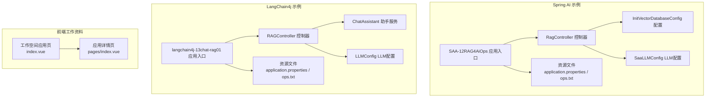
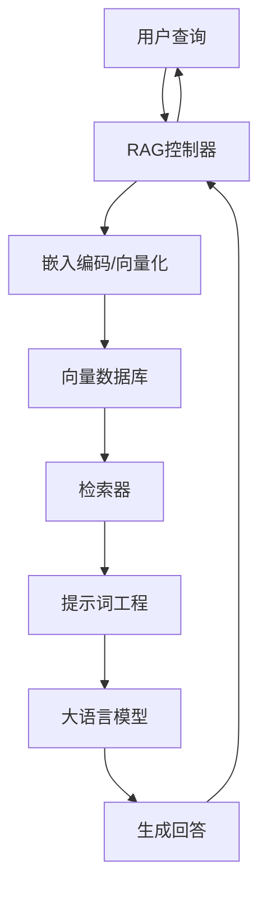
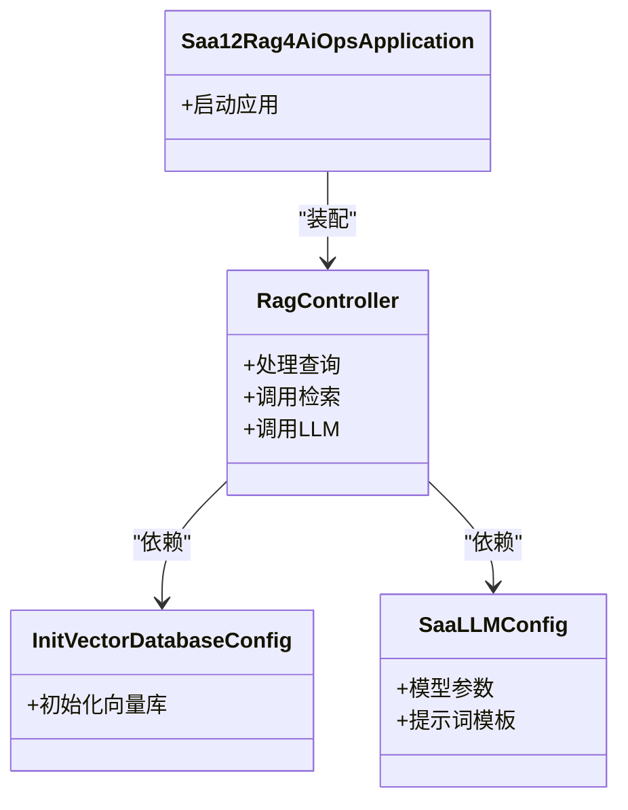
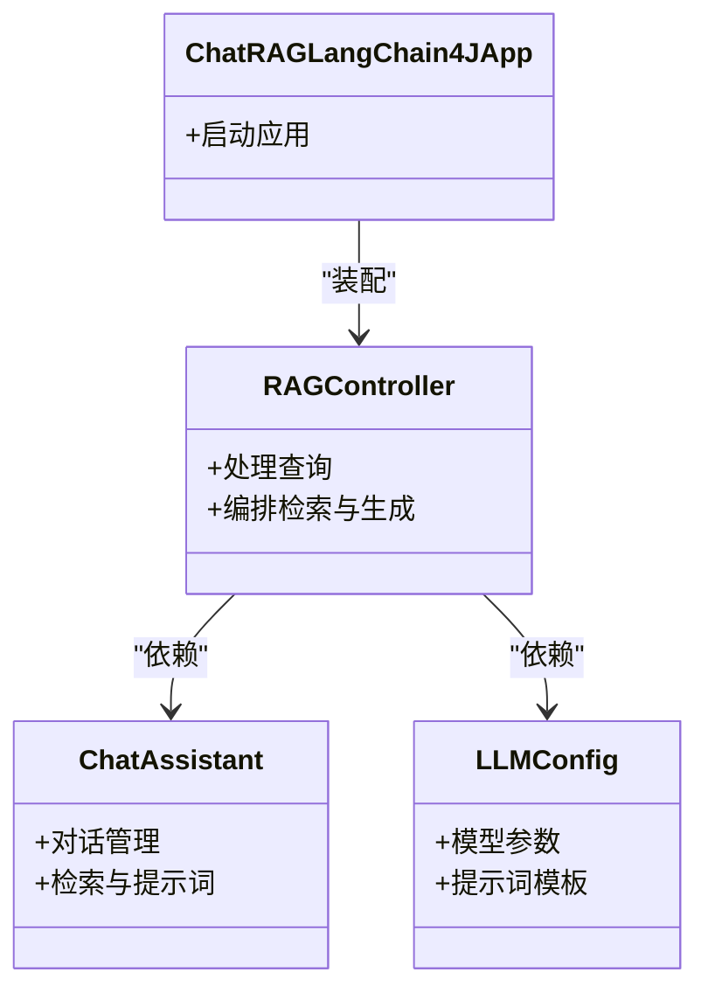
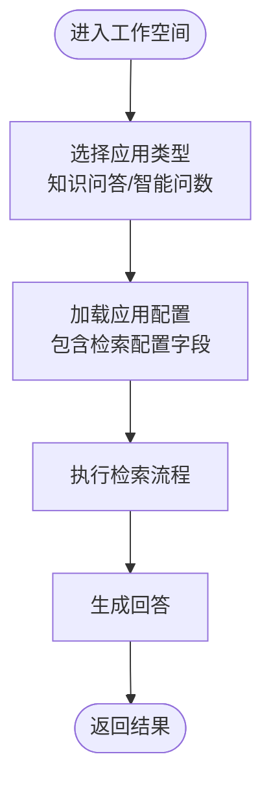
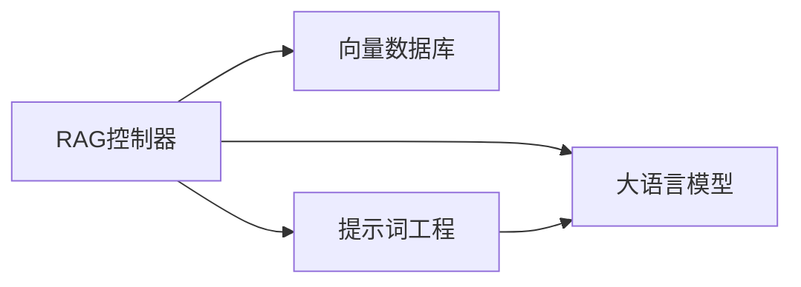

# RAG基础概念与原理

<cite>
**本文引用的文件**
- [SAA-12RAG4AiOpsApplication.java](file://【1】SpringAIAlibaba-atguiguV1/SAA-12RAG4AiOps/src/main/java/com/atguigu/study/Saa12Rag4AiOpsApplication.java)
- [RagController.java](file://【1】SpringAIAlibaba-atguiguV1/SAA-12RAG4AiOps/src/main/java/com/atguigu/study/controller/RagController.java)
- [InitVectorDatabaseConfig.java](file://【1】SpringAIAlibaba-atguiguV1/SAA-12RAG4AiOps/src/main/java/com/atguigu/study/config/InitVectorDatabaseConfig.java)
- [SaaLLMConfig.java](file://【1】SpringAIAlibaba-atguiguV1/SAA-12RAG4AiOps/src/main/java/com/atguigu/study/config/SaaLLMConfig.java)
- [application.properties](file://【1】SpringAIAlibaba-atguiguV1/SAA-12RAG4AiOps/src/main/resources/application.properties)
- [ops.txt](file://【1】SpringAIAlibaba-atguiguV1/SAA-12RAG4AiOps/src/main/resources/ops.txt)
- [ChatRAGLangChain4JApp.java](file://【2】langchain4j-atguiguV5/langchain4j-13chat-rag01/src/main/java/com/atguigu/study/ChatRAGLangChain4JApp.java)
- [RAGController.java](file://【2】langchain4j-atguiguV5/langchain4j-13chat-rag01/src/main/java/com/atguigu/study/controller/RAGController.java)
- [ChatAssistant.java](file://【2】langchain4j-atguiguV5/langchain4j-13chat-rag01/src/main/java/com/atguigu/study/service/ChatAssistant.java)
- [LLMConfig.java](file://【2】langchain4j-atguiguV5/langchain4j-13chat-rag01/src/main/java/com/atguigu/study/config/LLMConfig.java)
- [application.properties](file://【2】langchain4j-atguiguV5/langchain4j-13chat-rag01/src/main/resources/application.properties)
- [ops.txt](file://【2】langchain4j-atguiguV5/langchain4j-13chat-rag01/src/main/resources/ops.txt)
- [AI大模型教程完整版.md](file://【0】AI大模型教程（指导手册）/AI大模型教程完整版.md)
- [index.vue](file://【3】工作资料/code/仓颉智能体/nlp-frontend-web/src/views/workspace/pages/workApps/index.vue)
- [index.vue](file://【3】工作资料/code/仓颉智能体/nlp-frontend-web/src/views/workspace/pages/workApps/pages/index.vue)
</cite>

## 目录
1. [引言](#引言)
2. [项目结构](#项目结构)
3. [核心组件](#核心组件)
4. [架构总览](#架构总览)
5. [详细组件分析](#详细组件分析)
6. [依赖分析](#依赖分析)
7. [性能考虑](#性能考虑)
8. [故障排查指南](#故障排查指南)
9. [结论](#结论)
10. [附录](#附录)

## 引言
本指南面向初学者，系统讲解RAG（检索增强生成）的基础概念、工作原理与技术架构。通过对比传统对话系统，阐明RAG如何将外部知识库与大语言模型结合，以提升回答准确性与上下文相关性。同时，结合仓库中的Spring AI与LangChain4j示例工程，帮助读者建立从概念到实践的完整知识体系，并展望RAG的发展趋势。

## 项目结构
本仓库包含三类与RAG密切相关的资源：
- Spring AI 示例：基于Spring Boot的RAG应用，演示向量数据库初始化、LLM配置与RAG控制器交互。
- LangChain4j 示例：基于LangChain4j的RAG聊天应用，展示检索、提示词工程与助手服务的协作。
- 工作资料前端：前端页面中对“知识问答”“智能问数”等应用类型的分类与检索配置字段支持，体现RAG在业务场景中的落地形态。

**图表来源**
- [SAA-12RAG4AiOpsApplication.java:1-50](file://【1】SpringAIAlibaba-atguiguV1/SAA-12RAG4AiOps/src/main/java/com/atguigu/study/Saa12Rag4AiOpsApplication.java#L1-L50)
- [RagController.java:1-120](file://【1】SpringAIAlibaba-atguiguV1/SAA-12RAG4AiOps/src/main/java/com/atguigu/study/controller/RagController.java#L1-L120)
- [InitVectorDatabaseConfig.java:1-120](file://【1】SpringAIAlibaba-atguiguV1/SAA-12RAG4AiOps/src/main/java/com/atguigu/study/config/InitVectorDatabaseConfig.java#L1-L120)
- [SaaLLMConfig.java:1-120](file://【1】SpringAIAlibaba-atguiguV1/SAA-12RAG4AiOps/src/main/java/com/atguigu/study/config/SaaLLMConfig.java#L1-L120)
- [ChatRAGLangChain4JApp.java:1-50](file://【2】langchain4j-atguiguV5/langchain4j-13chat-rag01/src/main/java/com/atguigu/study/ChatRAGLangChain4JApp.java#L1-L50)
- [RAGController.java:1-120](file://【2】langchain4j-atguiguV5/langchain4j-13chat-rag01/src/main/java/com/atguigu/study/controller/RAGController.java#L1-L120)
- [ChatAssistant.java:1-120](file://【2】langchain4j-atguiguV5/langchain4j-13chat-rag01/src/main/java/com/atguigu/study/service/ChatAssistant.java#L1-L120)
- [LLMConfig.java:1-120](file://【2】langchain4j-atguiguV5/langchain4j-13chat-rag01/src/main/java/com/atguigu/study/config/LLMConfig.java#L1-L120)
- [index.vue:169-177](file://【3】工作资料/code/仓颉智能体/nlp-frontend-web/src/views/workspace/pages/workApps/index.vue#L169-L177)
- [index.vue:395-419](file://【3】工作资料/code/仓颉智能体/nlp-frontend-web/src/views/workspace/pages/workApps/pages/index.vue#L395-L419)

**章节来源**
- [SAA-12RAG4AiOpsApplication.java:1-50](file://【1】SpringAIAlibaba-atguiguV1/SAA-12RAG4AiOps/src/main/java/com/atguigu/study/Saa12Rag4AiOpsApplication.java#L1-L50)
- [ChatRAGLangChain4JApp.java:1-50](file://【2】langchain4j-atguiguV5/langchain4j-13chat-rag01/src/main/java/com/atguigu/study/ChatRAGLangChain4JApp.java#L1-L50)
- [index.vue:169-177](file://【3】工作资料/code/仓颉智能体/nlp-frontend-web/src/views/workspace/pages/workApps/index.vue#L169-L177)

## 核心组件
- Spring AI RAG组件
  - 应用入口：负责启动与装配
  - 控制器：接收用户查询，协调检索与生成
  - 向量数据库初始化：准备知识库向量索引
  - LLM配置：定义大模型参数与接入方式
  - 资源文件：配置项与操作说明
- LangChain4j RAG组件
  - 应用入口：Spring Boot引导
  - 控制器：统一入口，编排检索与生成
  - 助手服务：封装对话、检索与提示词工程
  - LLM配置：模型参数与提示词模板
  - 资源文件：运行配置与操作说明
- 前端工作资料
  - 应用类型：包含“知识问答”“智能问数”等分类
  - 检索配置字段：支持在应用配置中注入检索策略

**章节来源**
- [RagController.java:1-120](file://【1】SpringAIAlibaba-atguiguV1/SAA-12RAG4AiOps/src/main/java/com/atguigu/study/controller/RagController.java#L1-L120)
- [InitVectorDatabaseConfig.java:1-120](file://【1】SpringAIAlibaba-atguiguV1/SAA-12RAG4AiOps/src/main/java/com/atguigu/study/config/InitVectorDatabaseConfig.java#L1-L120)
- [SaaLLMConfig.java:1-120](file://【1】SpringAIAlibaba-atguiguV1/SAA-12RAG4AiOps/src/main/java/com/atguigu/study/config/SaaLLMConfig.java#L1-L120)
- [RAGController.java:1-120](file://【2】langchain4j-atguiguV5/langchain4j-13chat-rag01/src/main/java/com/atguigu/study/controller/RAGController.java#L1-L120)
- [ChatAssistant.java:1-120](file://【2】langchain4j-atguiguV5/langchain4j-13chat-rag01/src/main/java/com/atguigu/study/service/ChatAssistant.java#L1-L120)
- [LLMConfig.java:1-120](file://【2】langchain4j-atguiguV5/langchain4j-13chat-rag01/src/main/java/com/atguigu/study/config/LLMConfig.java#L1-L120)
- [index.vue:169-177](file://【3】工作资料/code/仓颉智能体/nlp-frontend-web/src/views/workspace/pages/workApps/index.vue#L169-L177)
- [index.vue:395-419](file://【3】工作资料/code/仓颉智能体/nlp-frontend-web/src/views/workspace/pages/workApps/pages/index.vue#L395-L419)

## 架构总览
RAG系统由“检索”和“生成”两大子系统协同构成。检索子系统负责从外部知识库中召回与查询最相关的片段；生成子系统在提示词中拼接检索结果，驱动大模型生成更准确、可溯源的回答。Spring AI与LangChain4j示例分别展示了两种主流实现路径。

[此图为概念性架构示意，无需图表来源]

## 详细组件分析

### Spring AI RAG 组件
- 应用入口
  - 负责加载配置并启动Web容器
- 控制器
  - 接收查询，调用检索与LLM服务，整合结果返回
- 向量数据库初始化
  - 负责构建/加载向量索引，确保检索可用
- LLM配置
  - 定义模型参数、提示词模板与输出格式
- 资源文件
  - application.properties：运行参数与连接配置
  - ops.txt：运维操作说明与注意事项

**图表来源**
- [SAA-12RAG4AiOpsApplication.java:1-50](file://【1】SpringAIAlibaba-atguiguV1/SAA-12RAG4AiOps/src/main/java/com/atguigu/study/Saa12Rag4AiOpsApplication.java#L1-L50)
- [RagController.java:1-120](file://【1】SpringAIAlibaba-atguiguV1/SAA-12RAG4AiOps/src/main/java/com/atguigu/study/controller/RagController.java#L1-L120)
- [InitVectorDatabaseConfig.java:1-120](file://【1】SpringAIAlibaba-atguiguV1/SAA-12RAG4AiOps/src/main/java/com/atguigu/study/config/InitVectorDatabaseConfig.java#L1-L120)
- [SaaLLMConfig.java:1-120](file://【1】SpringAIAlibaba-atguiguV1/SAA-12RAG4AiOps/src/main/java/com/atguigu/study/config/SaaLLMConfig.java#L1-L120)

**章节来源**
- [RagController.java:1-120](file://【1】SpringAIAlibaba-atguiguV1/SAA-12RAG4AiOps/src/main/java/com/atguigu/study/controller/RagController.java#L1-L120)
- [InitVectorDatabaseConfig.java:1-120](file://【1】SpringAIAlibaba-atguiguV1/SAA-12RAG4AiOps/src/main/java/com/atguigu/study/config/InitVectorDatabaseConfig.java#L1-L120)
- [SaaLLMConfig.java:1-120](file://【1】SpringAIAlibaba-atguiguV1/SAA-12RAG4AiOps/src/main/java/com/atguigu/study/config/SaaLLMConfig.java#L1-L120)
- [application.properties:1-100](file://【1】SpringAIAlibaba-atguiguV1/SAA-12RAG4AiOps/src/main/resources/application.properties#L1-L100)
- [ops.txt:1-200](file://【1】SpringAIAlibaba-atguiguV1/SAA-12RAG4AiOps/src/main/resources/ops.txt#L1-L200)

### LangChain4j RAG 组件
- 应用入口
  - Spring Boot引导，装配各组件
- 控制器
  - 统一入口，编排检索与生成流程
- 助手服务
  - 封装对话、检索与提示词工程，简化调用
- LLM配置
  - 模型参数与提示词模板管理
- 资源文件
  - application.properties：运行参数
  - ops.txt：操作说明

**图表来源**
- [ChatRAGLangChain4JApp.java:1-50](file://【2】langchain4j-atguiguV5/langchain4j-13chat-rag01/src/main/java/com/atguigu/study/ChatRAGLangChain4JApp.java#L1-L50)
- [RAGController.java:1-120](file://【2】langchain4j-atguiguV5/langchain4j-13chat-rag01/src/main/java/com/atguigu/study/controller/RAGController.java#L1-L120)
- [ChatAssistant.java:1-120](file://【2】langchain4j-atguiguV5/langchain4j-13chat-rag01/src/main/java/com/atguigu/study/service/ChatAssistant.java#L1-L120)
- [LLMConfig.java:1-120](file://【2】langchain4j-atguiguV5/langchain4j-13chat-rag01/src/main/java/com/atguigu/study/config/LLMConfig.java#L1-L120)

**章节来源**
- [RAGController.java:1-120](file://【2】langchain4j-atguiguV5/langchain4j-13chat-rag01/src/main/java/com/atguigu/study/controller/RAGController.java#L1-L120)
- [ChatAssistant.java:1-120](file://【2】langchain4j-atguiguV5/langchain4j-13chat-rag01/src/main/java/com/atguigu/study/service/ChatAssistant.java#L1-L120)
- [LLMConfig.java:1-120](file://【2】langchain4j-atguiguV5/langchain4j-13chat-rag01/src/main/java/com/atguigu/study/config/LLMConfig.java#L1-L120)
- [application.properties:1-100](file://【2】langchain4j-atguiguV5/langchain4j-13chat-rag01/src/main/resources/application.properties#L1-L100)
- [ops.txt:1-200](file://【2】langchain4j-atguiguV5/langchain4j-13chat-rag01/src/main/resources/ops.txt#L1-L200)

### 前端工作资料中的RAG支持
- 应用类型标签
  - “知识问答”“智能问数”等分类，体现RAG在业务场景中的应用形态
- 检索配置字段
  - 在应用配置中支持检索策略字段，便于在前端侧进行配置与展示

**图表来源**
- [index.vue:169-177](file://【3】工作资料/code/仓颉智能体/nlp-frontend-web/src/views/workspace/pages/workApps/index.vue#L169-L177)
- [index.vue:395-419](file://【3】工作资料/code/仓颉智能体/nlp-frontend-web/src/views/workspace/pages/workApps/pages/index.vue#L395-L419)

**章节来源**
- [index.vue:169-177](file://【3】工作资料/code/仓颉智能体/nlp-frontend-web/src/views/workspace/pages/workApps/index.vue#L169-L177)
- [index.vue:395-419](file://【3】工作资料/code/仓颉智能体/nlp-frontend-web/src/views/workspace/pages/workApps/pages/index.vue#L395-L419)

## 依赖分析
- 组件内聚与耦合
  - 控制器作为编排层，依赖检索与LLM配置，保持较高内聚与清晰边界
- 外部依赖
  - 向量数据库：提供高效相似度检索
  - 大语言模型：提供生成能力
- 潜在循环依赖
  - 示例工程采用分层设计，未见明显循环依赖

[此图为概念性依赖示意，无需图表来源]

## 性能考虑
- 检索效率
  - 向量数据库索引质量直接影响响应速度与召回效果
- 生成延迟
  - 模型参数与提示词长度影响生成耗时
- 缓存策略
  - 对热点查询与中间结果进行缓存，减少重复计算
- 并发与限流
  - 控制并发请求，避免下游依赖过载

[本节为通用性能建议，无需章节来源]

## 故障排查指南
- 配置检查
  - 确认application.properties中的连接参数与模型配置正确
- 运维说明
  - 参考ops.txt中的操作步骤与注意事项
- 常见问题定位
  - 控制器日志：查看请求处理与异常堆栈
  - 向量库初始化：确认索引构建完成且可用
  - LLM连通性：验证模型服务可达与鉴权配置

**章节来源**
- [application.properties:1-100](file://【1】SpringAIAlibaba-atguiguV1/SAA-12RAG4AiOps/src/main/resources/application.properties#L1-L100)
- [ops.txt:1-200](file://【1】SpringAIAlibaba-atguiguV1/SAA-12RAG4AiOps/src/main/resources/ops.txt#L1-L200)
- [application.properties:1-100](file://【2】langchain4j-atguiguV5/langchain4j-13chat-rag01/src/main/resources/application.properties#L1-L100)
- [ops.txt:1-200](file://【2】langchain4j-atguiguV5/langchain4j-13chat-rag01/src/main/resources/ops.txt#L1-L200)

## 结论
RAG通过“检索+生成”的双引擎架构，显著提升了问答系统的准确性与可解释性。Spring AI与LangChain4j示例展示了两条可落地的技术路径：前者强调Spring生态集成与向量库初始化，后者侧重LangChain4j的模块化与易用性。结合前端工作资料中的应用类型与检索配置字段，RAG在知识问答、智能问数等场景中具备良好的扩展性与实用性。

## 附录
- 发展历程与趋势
  - 从早期的关键词匹配到语义检索，再到如今的多模态与结构化检索
  - 未来趋势：检索精度提升、生成可控性增强、跨模态融合、实时更新与增量索引
- 与传统对话系统的差异
  - 传统系统依赖内置知识或有限规则；RAG引入外部知识库，回答更贴近事实
- 学习路径建议
  - 先掌握AI大模型基础概念，再理解RAG原理与实现，最后结合具体工程实践

**章节来源**
- [AI大模型教程完整版.md:1-200](file://【0】AI大模型教程（指导手册）/AI大模型教程完整版.md#L1-L200)