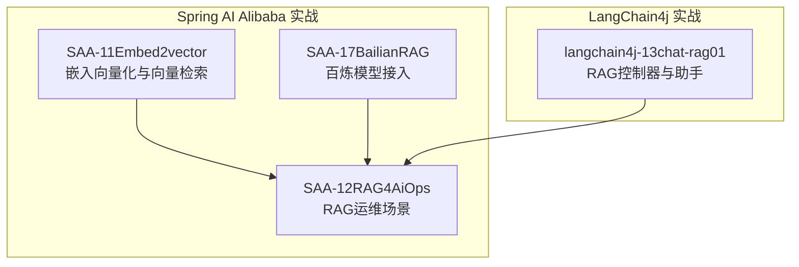
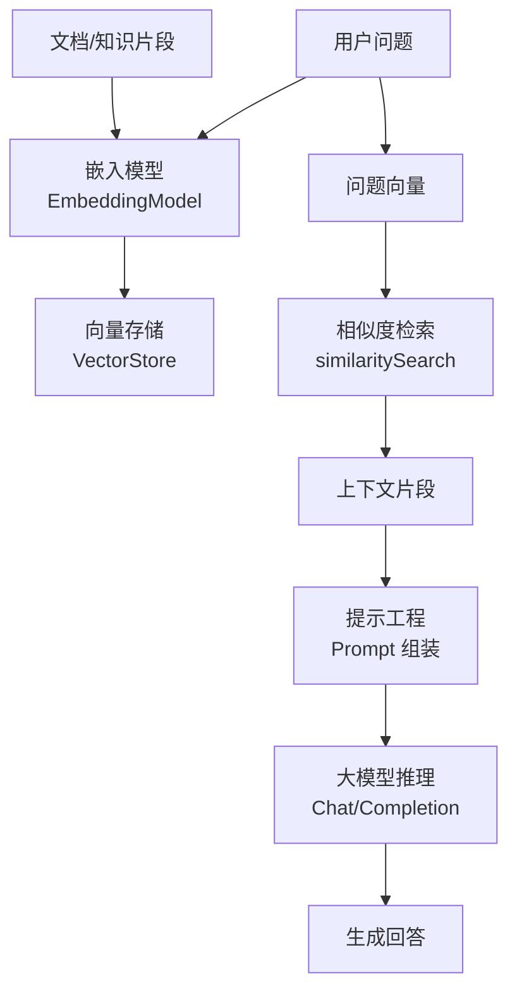
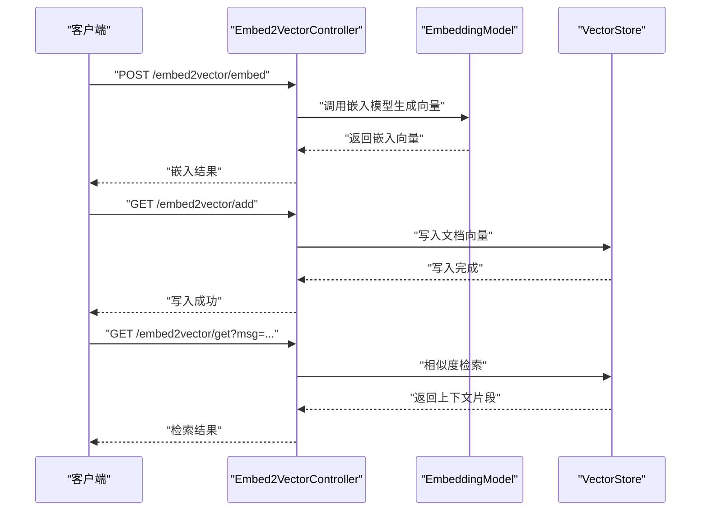
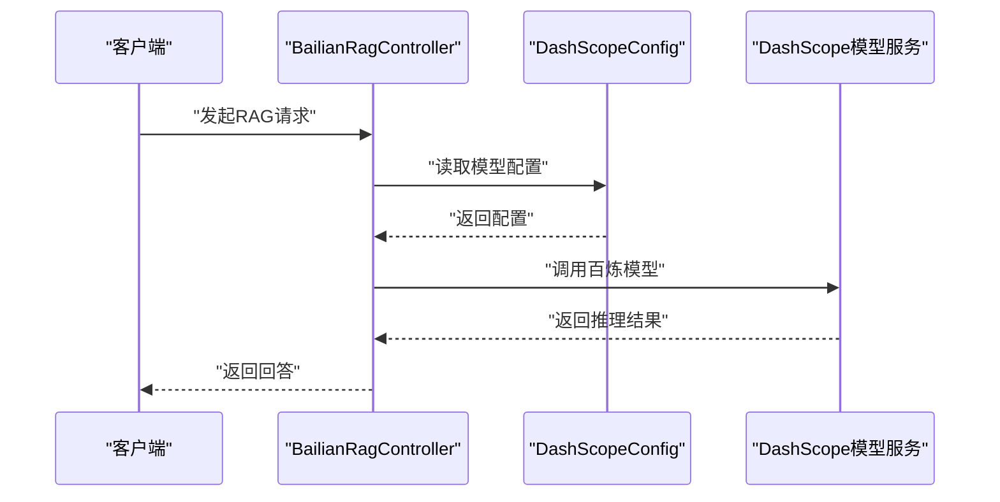
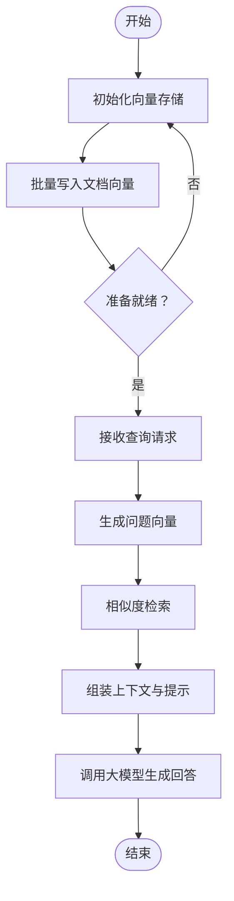
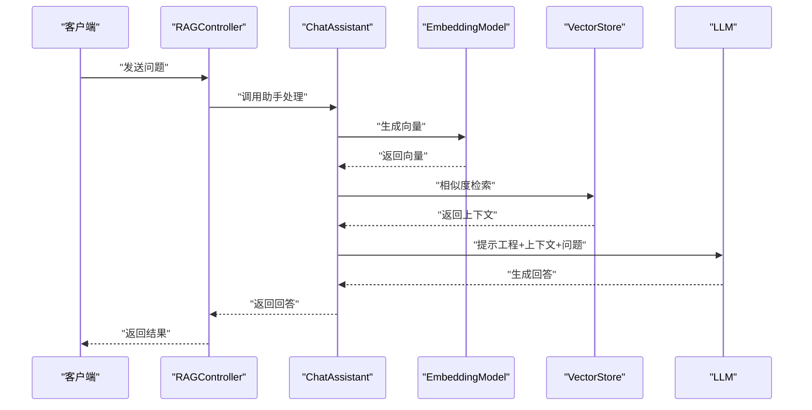
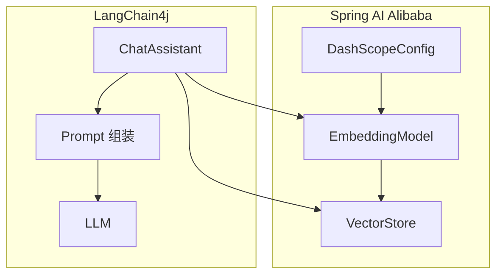

# RAG技术应用

<cite>
**本文引用的文件**
- [SAA-11Embed2vectorApplication.java](file://【1】SpringAIAlibaba-atguiguV1/SAA-11Embed2vector/src/main/java/com/atguigu/study/Saa11Embed2vectorApplication.java)
- [Embed2VectorController.java](file://【1】SpringAIAlibaba-atguiguV1/SAA-11Embed2vector/src/main/java/com/atguigu/study/controller/Embed2VectorController.java)
- [DashScopeConfig.java](file://【1】SpringAIAlibaba-atguiguV1/SAA-17BailianRAG/src/main/java/com/atguigu/study/config/DashScopeConfig.java)
- [BailianRagController.java](file://【1】SpringAIAlibaba-atguiguV1/SAA-17BailianRAG/src/main/java/com/atguigu/study/controller/BailianRagController.java)
- [SAA-12Rag4AiOpsApplication.java](file://【1】SpringAIAlibaba-atguiguV1/SAA-12RAG4AiOps/src/main/java/com/atguigu/study/Saa12Rag4AiOpsApplication.java)
- [InitVectorDatabaseConfig.java](file://【1】SpringAIAlibaba-atguiguV1/SAA-12RAG4AiOps/src/main/java/com/atguigu/study/config/InitVectorDatabaseConfig.java)
- [RAGController.java](file://【2】langchain4j-atguiguV5/langchain4j-13chat-rag01/src/main/java/com/atguigu/study/controller/RAGController.java)
- [ChatAssistant.java](file://【2】langchain4j-atguiguV5/langchain4j-13chat-rag01/src/main/java/com/atguigu/study/service/ChatAssistant.java)
- [LLMConfig.java](file://【2】langchain4j-atguiguV5/langchain4j-13chat-rag01/src/main/java/com/atguigu/study/config/LLMConfig.java)
- [application.properties](file://【1】SpringAIAlibaba-atguiguV1/SAA-11Embed2vector/src/main/resources/application.properties)
- [ops.txt](file://【1】SpringAIAlibaba-atguiguV1/SAA-11Embed2vector/src/main/resources/ops.txt)
- [application.properties](file://【1】SpringAIAlibaba-atguiguV1/SAA-17BailianRAG/src/main/resources/application.properties)
- [application.properties](file://【1】SpringAIAlibaba-atguiguV1/SAA-12RAG4AiOps/src/main/resources/application.properties)
- [ops.txt](file://【1】SpringAIAlibaba-atguiguV1/SAA-12RAG4AiOps/src/main/resources/ops.txt)
- [application.properties](file://【2】langchain4j-atguiguV5/langchain4j-13chat-rag01/src/main/resources/application.properties)
</cite>

## 目录
1. [引言](#引言)
2. [项目结构](#项目结构)
3. [核心组件](#核心组件)
4. [架构总览](#架构总览)
5. [详细组件分析](#详细组件分析)
6. [依赖分析](#依赖分析)
7. [性能考虑](#性能考虑)
8. [故障排查指南](#故障排查指南)
9. [结论](#结论)
10. [附录](#附录)

## 引言
本指南围绕RAG（检索增强生成）技术，结合仓库中的Spring AI Alibaba与LangChain4j实战项目，系统讲解RAG的基本概念、工作原理、技术架构与实现要点，并提供从零到一搭建RAG系统的实践路径。重点覆盖文本向量化、向量数据库存储与检索、提示工程、多模态与工具调用集成、以及性能优化与最佳实践。同时，结合Weaviate等向量数据库在Spring AI Alibaba生态中的使用思路，帮助读者构建高性能、可扩展的RAG应用。

## 项目结构
本仓库包含两套RAG相关实战项目：
- Spring AI Alibaba系列：以Spring Boot为框架，集成DashScope等模型服务，演示嵌入向量化、向量存储与检索、RAG流水线与运维场景。
- LangChain4j系列：以LangChain4j为核心，展示低/高层API、提示工程、嵌入与RAG服务、函数调用与MCP集成等能力。

**图表来源**
- [SAA-11Embed2vectorApplication.java:1-20](file://【1】SpringAIAlibaba-atguiguV1/SAA-11Embed2vector/src/main/java/com/atguigu/study/Saa11Embed2vectorApplication.java#L1-L20)
- [SAA-12Rag4AiOpsApplication.java:1-20](file://【1】SpringAIAlibaba-atguiguV1/SAA-12RAG4AiOps/src/main/java/com/atguigu/study/Saa12Rag4AiOpsApplication.java#L1-L20)
- [SAA-17BailianRAGApplication.java:1-20](file://【1】SpringAIAlibaba-atguiguV1/SAA-17BailianRAG/src/main/java/com/atguigu/study/Saa17BailianRagApplication.java#L1-L20)
- [ChatRAGLangChain4JApp.java:1-20](file://【2】langchain4j-atguiguV5/langchain4j-13chat-rag01/src/main/java/com/atguigu/study/ChatRAGLangChain4JApp.java#L1-L20)

**章节来源**
- [SAA-11Embed2vectorApplication.java:1-20](file://【1】SpringAIAlibaba-atguiguV1/SAA-11Embed2vector/src/main/java/com/atguigu/study/Saa11Embed2vectorApplication.java#L1-L20)
- [SAA-12Rag4AiOpsApplication.java:1-20](file://【1】SpringAIAlibaba-atguiguV1/SAA-12RAG4AiOps/src/main/java/com/atguigu/study/Saa12Rag4AiOpsApplication.java#L1-L20)
- [SAA-17BailianRagApplication.java:1-20](file://【1】SpringAIAlibaba-atguiguV1/SAA-17BailianRAG/src/main/java/com/atguigu/study/Saa17BailianRagApplication.java#L1-L20)
- [ChatRAGLangChain4JApp.java:1-20](file://【2】langchain4j-atguiguV5/langchain4j-13chat-rag01/src/main/java/com/atguigu/study/ChatRAGLangChain4JApp.java#L1-L20)

## 核心组件
- 嵌入向量化与向量检索（SAA-11）
  - 通过EmbeddingModel生成文本向量，使用VectorStore进行向量存储与相似度检索。
  - 支持DashScope嵌入模型配置与自定义选项。
- 百炼模型接入（SAA-17）
  - 集成DashScope的对话与RAG能力，提供对外HTTP接口。
- RAG运维场景（SAA-12）
  - 展示向量数据库初始化、批量写入与检索流程，面向生产化部署。
- LangChain4j RAG（LC-13）
  - 通过控制器与助手类组织RAG流程，结合提示工程与嵌入服务。

**章节来源**
- [Embed2VectorController.java:28-83](file://【1】SpringAIAlibaba-atguiguV1/SAA-11Embed2vector/src/main/java/com/atguigu/study/controller/Embed2VectorController.java#L28-L83)
- [DashScopeConfig.java:1-200](file://【1】SpringAIAlibaba-atguiguV1/SAA-17BailianRAG/src/main/java/com/atguigu/study/config/DashScopeConfig.java#L1-L200)
- [InitVectorDatabaseConfig.java:28-120](file://【1】SpringAIAlibaba-atguiguV1/SAA-12RAG4AiOps/src/main/java/com/atguigu/study/config/InitVectorDatabaseConfig.java#L28-L120)
- [RAGController.java:1-200](file://【2】langchain4j-atguiguV5/langchain4j-13chat-rag01/src/main/java/com/atguigu/study/controller/RAGController.java#L1-L200)
- [ChatAssistant.java:1-200](file://【2】langchain4j-atguiguV5/langchain4j-13chat-rag01/src/main/java/com/atguigu/study/service/ChatAssistant.java#L1-L200)

## 架构总览
下图展示了RAG系统的关键组件与交互关系：文本输入经由嵌入模型生成向量，写入向量数据库；查询时对问题进行向量化并执行相似度检索，将上下文与原始问题共同送入大模型生成最终回答。

**图表来源**
- [Embed2VectorController.java:43-83](file://【1】SpringAIAlibaba-atguiguV1/SAA-11Embed2vector/src/main/java/com/atguigu/study/controller/Embed2VectorController.java#L43-L83)
- [InitVectorDatabaseConfig.java:28-120](file://【1】SpringAIAlibaba-atguiguV1/SAA-12RAG4AiOps/src/main/java/com/atguigu/study/config/InitVectorDatabaseConfig.java#L28-L120)
- [RAGController.java:1-200](file://【2】langchain4j-atguiguV5/langchain4j-13chat-rag01/src/main/java/com/atguigu/study/controller/RAGController.java#L1-L200)

## 详细组件分析

### 组件A：嵌入向量化与向量检索（SAA-11）
- 功能职责
  - 将文本转换为向量表示，支持指定嵌入模型与参数。
  - 将文档写入向量存储，支持相似度检索与结果过滤。
- 关键流程
  - 生成嵌入向量
  - 写入向量存储
  - 执行相似度检索
- 代码要点
  - 嵌入模型调用与响应处理
  - 向量存储的add与similaritySearch
  - DashScope嵌入选项配置

**图表来源**
- [Embed2VectorController.java:43-83](file://【1】SpringAIAlibaba-atguiguV1/SAA-11Embed2vector/src/main/java/com/atguigu/study/controller/Embed2VectorController.java#L43-L83)

**章节来源**
- [Embed2VectorController.java:28-83](file://【1】SpringAIAlibaba-atguiguV1/SAA-11Embed2vector/src/main/java/com/atguigu/study/controller/Embed2VectorController.java#L28-L83)
- [application.properties:1-200](file://【1】SpringAIAlibaba-atguiguV1/SAA-11Embed2vector/src/main/resources/application.properties#L1-L200)
- [ops.txt:1-200](file://【1】SpringAIAlibaba-atguiguV1/SAA-11Embed2vector/src/main/resources/ops.txt#L1-L200)

### 组件B：百炼模型接入（SAA-17）
- 功能职责
  - 集成DashScope百炼模型服务，提供RAG相关接口。
  - 配置模型参数与认证信息。
- 关键流程
  - 初始化DashScope配置
  - 调用百炼模型进行对话或RAG推理
- 代码要点
  - DashScopeConfig中的模型与认证配置
  - BailianRagController对外接口

**图表来源**
- [DashScopeConfig.java:1-200](file://【1】SpringAIAlibaba-atguiguV1/SAA-17BailianRAG/src/main/java/com/atguigu/study/config/DashScopeConfig.java#L1-L200)
- [BailianRagController.java:1-200](file://【1】SpringAIAlibaba-atguiguV1/SAA-17BailianRAG/src/main/java/com/atguigu/study/controller/BailianRagController.java#L1-L200)

**章节来源**
- [DashScopeConfig.java:1-200](file://【1】SpringAIAlibaba-atguiguV1/SAA-17BailianRAG/src/main/java/com/atguigu/study/config/DashScopeConfig.java#L1-L200)
- [BailianRagController.java:1-200](file://【1】SpringAIAlibaba-atguiguV1/SAA-17BailianRAG/src/main/java/com/atguigu/study/controller/BailianRagController.java#L1-L200)
- [application.properties:1-200](file://【1】SpringAIAlibaba-atguiguV1/SAA-17BailianRAG/src/main/resources/application.properties#L1-L200)

### 组件C：RAG运维场景（SAA-12）
- 功能职责
  - 展示向量数据库初始化、批量写入与检索的生产化流程。
  - 提供RAG在运维场景下的部署与监控思路。
- 关键流程
  - 初始化向量存储
  - 批量写入文档向量
  - 执行检索并返回结果
- 代码要点
  - InitVectorDatabaseConfig中的向量存储配置
  - RAG在运维场景的接口与流程

**图表来源**
- [InitVectorDatabaseConfig.java:28-120](file://【1】SpringAIAlibaba-atguiguV1/SAA-12RAG4AiOps/src/main/java/com/atguigu/study/config/InitVectorDatabaseConfig.java#L28-L120)
- [SAA-12Rag4AiOpsApplication.java:1-200](file://【1】SpringAIAlibaba-atguiguV1/SAA-12RAG4AiOps/src/main/java/com/atguigu/study/Saa12Rag4AiOpsApplication.java#L1-L200)

**章节来源**
- [InitVectorDatabaseConfig.java:28-120](file://【1】SpringAIAlibaba-atguiguV1/SAA-12RAG4AiOps/src/main/java/com/atguigu/study/config/InitVectorDatabaseConfig.java#L28-L120)
- [SAA-12Rag4AiOpsApplication.java:1-200](file://【1】SpringAIAlibaba-atguiguV1/SAA-12RAG4AiOps/src/main/java/com/atguigu/study/Saa12Rag4AiOpsApplication.java#L1-L200)
- [ops.txt:1-200](file://【1】SpringAIAlibaba-atguiguV1/SAA-12RAG4AiOps/src/main/resources/ops.txt#L1-L200)

### 组件D：LangChain4j RAG（LC-13）
- 功能职责
  - 通过控制器与助手类组织RAG流程，结合提示工程与嵌入服务。
  - 展示低/高层API的使用方式与集成模式。
- 关键流程
  - 控制器接收请求并调用助手
  - 助手进行嵌入、检索、提示组装与模型推理
- 代码要点
  - RAGController对外接口
  - ChatAssistant的RAG实现细节
  - LLMConfig的模型配置

**图表来源**
- [RAGController.java:1-200](file://【2】langchain4j-atguiguV5/langchain4j-13chat-rag01/src/main/java/com/atguigu/study/controller/RAGController.java#L1-L200)
- [ChatAssistant.java:1-200](file://【2】langchain4j-atguiguV5/langchain4j-13chat-rag01/src/main/java/com/atguigu/study/service/ChatAssistant.java#L1-L200)
- [LLMConfig.java:1-200](file://【2】langchain4j-atguiguV5/langchain4j-13chat-rag01/src/main/java/com/atguigu/study/config/LLMConfig.java#L1-L200)

**章节来源**
- [RAGController.java:1-200](file://【2】langchain4j-atguiguV5/langchain4j-13chat-rag01/src/main/java/com/atguigu/study/controller/RAGController.java#L1-L200)
- [ChatAssistant.java:1-200](file://【2】langchain4j-atguiguV5/langchain4j-13chat-rag01/src/main/java/com/atguigu/study/service/ChatAssistant.java#L1-L200)
- [LLMConfig.java:1-200](file://【2】langchain4j-atguiguV5/langchain4j-13chat-rag01/src/main/java/com/atguigu/study/config/LLMConfig.java#L1-L200)
- [application.properties:1-200](file://【2】langchain4j-atguiguV5/langchain4j-13chat-rag01/src/main/resources/application.properties#L1-L200)

## 依赖分析
- Spring AI Alibaba生态
  - EmbeddingModel与VectorStore抽象，便于替换不同向量数据库后端。
  - DashScope配置类统一管理模型与认证。
- LangChain4j生态
  - 低/高层API灵活组合，便于快速迭代与生产落地。
  - 提示工程与嵌入服务解耦，提升可维护性。

**图表来源**
- [Embed2VectorController.java:28-83](file://【1】SpringAIAlibaba-atguiguV1/SAA-11Embed2vector/src/main/java/com/atguigu/study/controller/Embed2VectorController.java#L28-L83)
- [DashScopeConfig.java:1-200](file://【1】SpringAIAlibaba-atguiguV1/SAA-17BailianRAG/src/main/java/com/atguigu/study/config/DashScopeConfig.java#L1-L200)
- [ChatAssistant.java:1-200](file://【2】langchain4j-atguiguV5/langchain4j-13chat-rag01/src/main/java/com/atguigu/study/service/ChatAssistant.java#L1-L200)

**章节来源**
- [Embed2VectorController.java:28-83](file://【1】SpringAIAlibaba-atguiguV1/SAA-11Embed2vector/src/main/java/com/atguigu/study/controller/Embed2VectorController.java#L28-L83)
- [DashScopeConfig.java:1-200](file://【1】SpringAIAlibaba-atguiguV1/SAA-17BailianRAG/src/main/java/com/atguigu/study/config/DashScopeConfig.java#L1-L200)
- [ChatAssistant.java:1-200](file://【2】langchain4j-atguiguV5/langchain4j-13chat-rag01/src/main/java/com/atguigu/study/service/ChatAssistant.java#L1-L200)

## 性能考虑
- 向量维度与相似度算法
  - 合理选择嵌入模型，平衡精度与性能。
  - 在向量存储层采用合适的距离度量与索引策略。
- 批量写入与增量更新
  - 批量写入可显著降低写入延迟；对热点文档采用增量更新。
- 检索参数调优
  - topK、过滤条件、元数据筛选等参数影响召回与速度。
- 缓存与预热
  - 对高频查询结果与常用上下文进行缓存。
- 并发与限流
  - 控制并发请求与速率，避免向量数据库过载。
- 模型与提示优化
  - 精简提示词、拆分长上下文、使用结构化输出减少错误重试。

## 故障排查指南
- 常见问题定位
  - 嵌入失败：检查模型配置、密钥与网络连通性。
  - 向量存储异常：确认索引初始化、写入批次大小与内存限制。
  - 检索无结果：调整相似度阈值、过滤条件与topK。
- 日志与监控
  - 记录嵌入耗时、检索耗时与错误码，建立告警阈值。
- 运维脚本
  - 使用ops.txt中的操作步骤进行环境初始化与验证。

**章节来源**
- [ops.txt:1-200](file://【1】SpringAIAlibaba-atguiguV1/SAA-11Embed2vector/src/main/resources/ops.txt#L1-L200)
- [ops.txt:1-200](file://【1】SpringAIAlibaba-atguiguV1/SAA-12RAG4AiOps/src/main/resources/ops.txt#L1-L200)

## 结论
本指南基于仓库中的Spring AI Alibaba与LangChain4j实战项目，系统阐述了RAG从理论到实践的完整路径。通过嵌入向量化、向量存储与检索、提示工程与模型推理的协同，结合百炼模型与多模态能力，可构建高性能、可扩展的RAG应用。建议在生产环境中重视向量数据库的索引与缓存策略、检索参数的持续调优，以及可观测性的完善。

## 附录
- Weaviate集成思路（Spring AI Alibaba生态）
  - 使用VectorStore抽象对接Weaviate，统一相似度检索与过滤。
  - 在InitVectorDatabaseConfig中配置Weaviate连接参数与索引策略。
  - 通过Embed2VectorController的add与similaritySearch接口适配Weaviate写入与查询。
- 最佳实践清单
  - 明确数据治理：清洗、分段、去重与元数据标注。
  - 持续评估：A/B测试与人工评估指标。
  - 安全与合规：敏感信息脱敏与访问控制。