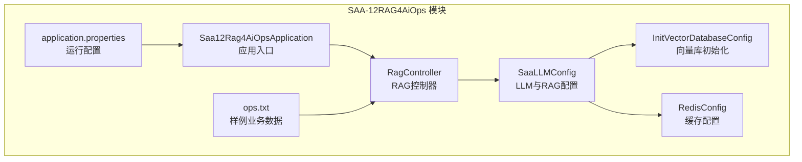
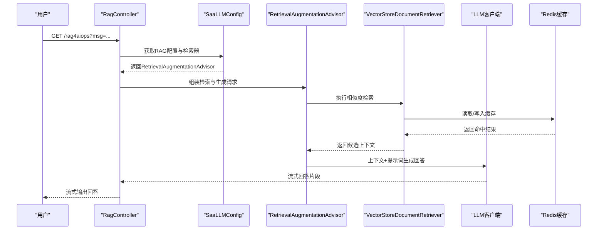
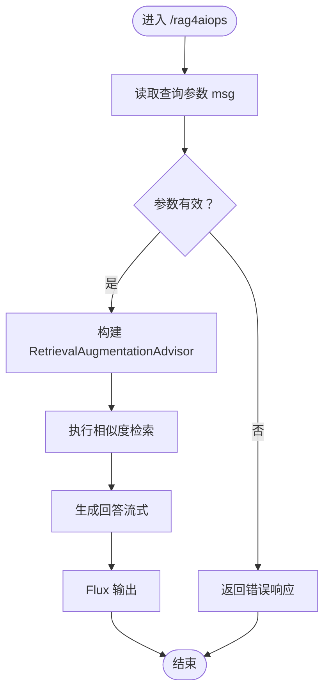
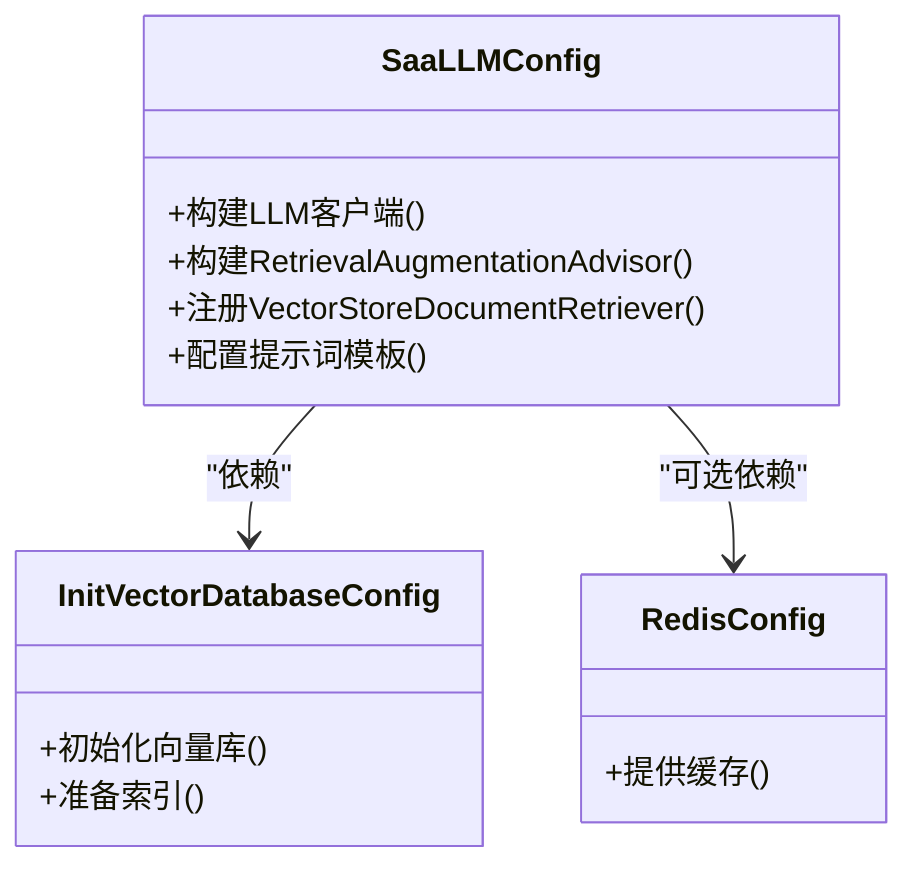
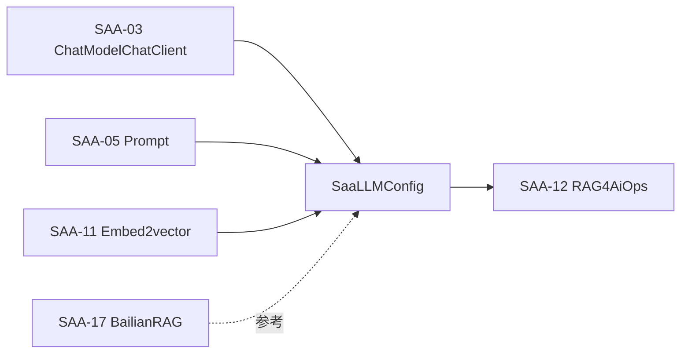
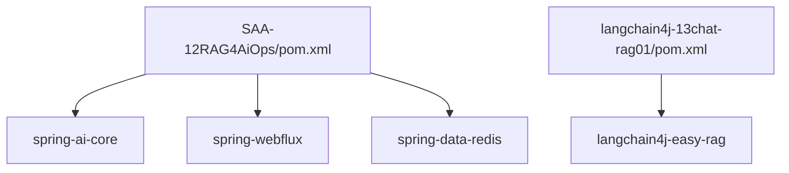

# RAG系统完整实现

<cite>
**本文引用的文件**
- [Saa12Rag4AiOpsApplication.java](file://【1】SpringAIAlibaba-atguiguV1/SAA-12RAG4AiOps/src/main/java/com/atguigu/study/Saa12Rag4AiOpsApplication.java)
- [RagController.java](file://【1】SpringAIAlibaba-atguiguV1/SAA-12RAG4AiOps/src/main/java/com/atguigu/study/controller/RagController.java)
- [SaaLLMConfig.java](file://【1】SpringAIAlibaba-atguiguV1/SAA-12RAG4AiOps/src/main/java/com/atguigu/study/config/SaaLLMConfig.java)
- [InitVectorDatabaseConfig.java](file://【1】SpringAIAlibaba-atguiguV1/SAA-12RAG4AiOps/src/main/java/com/atguigu/study/config/InitVectorDatabaseConfig.java)
- [RedisConfig.java](file://【1】SpringAIAlibaba-atguiguV1/SAA-12RAG4AiOps/src/main/java/com/atguigu/study/config/RedisConfig.java)
- [application.properties](file://【1】SpringAIAlibaba-atguiguV1/SAA-12RAG4AiOps/src/main/resources/application.properties)
- [ops.txt](file://【1】SpringAIAlibaba-atguiguV1/SAA-12RAG4AiOps/src/main/resources/ops.txt)
- [pom.xml](file://【1】SpringAIAlibaba-atguiguV1/SAA-12RAG4AiOps/pom.xml)
- [Saa03ChatModelChatClientApplication.java](file://【1】SpringAIAlibaba-atguiguV1/SAA-03ChatModelChatClient/src/main/java/com/atguigu/study/Saa03ChatModelChatClientApplication.java)
- [ChatClientController.java](file://【1】SpringAIAlibaba-atguiguV1/SAA-03ChatModelChatClient/src/main/java/com/atguigu/study/controller/ChatClientController.java)
- [SaaLLMConfig.java](file://【1】SpringAIAlibaba-atguiguV1/SAA-03ChatModelChatClient/src/main/java/com/atguigu/study/config/SaaLLMConfig.java)
- [Saa05PromptApplication.java](file://【1】SpringAIAlibaba-atguiguV1/SAA-05Prompt/src/main/java/com/atguigu/study/Saa05PromptApplication.java)
- [PromptController.java](file://【1】SpringAIAlibaba-atguiguV1/SAA-05Prompt/src/main/java/com/atguigu/study/controller/PromptController.java)
- [SaaLLMConfig.java](file://【1】SpringAIAlibaba-atguiguV1/SAA-05Prompt/src/main/java/com/atguigu/study/config/SaaLLMConfig.java)
- [Saa11Embed2vectorApplication.java](file://【1】SpringAIAlibaba-atguiguV1/SAA-11Embed2vector/src/main/java/com/atguigu/study/Saa11Embed2vectorApplication.java)
- [SaaLLMConfig.java](file://【1】SpringAIAlibaba-atguiguV1/SAA-11Embed2vector/src/main/java/com/atguigu/study/config/SaaLLMConfig.java)
- [EmbeddinglController.java](file://【2】langchain4j-atguiguV5/langchain4j-12chat-embedding/src/main/java/com/ atguigu/study/controller/EmbeddinglController.java)
- [ChatRAGLangChain4JApp.java](file://【2】langchain4j-atguiguV5/langchain4j-13chat-rag01/src/main/java/com/atguigu/study/ChatRAGLangChain4JApp.java)
- [RAGController.java](file://【2】langchain4j-atguiguV5/langchain4j-13chat-rag01/src/main/java/com/atguigu/study/controller/RAGController.java)
- [LLMConfig.java](file://【2】langchain4j-atguiguV5/langchain4j-13chat-rag01/src/main/java/com/atguigu/study/config/LLMConfig.java)
- [pom.xml](file://【2】langchain4j-atguiguV5/langchain4j-13chat-rag01/pom.xml)
- [Saa17BailianRAGApplication.java](file://【1】SpringAIAlibaba-atguiguV1/SAA-17BailianRAG/src/main/java/com/atguigu/study/Saa17BailianRagApplication.java)
- [BailianRagController.java](file://【1】SpringAIAlibaba-atguiguV1/SAA-17BailianRAG/src/main/java/com/atguigu/study/controller/BailianRagController.java)
- [SaaLLMConfig.java](file://【1】SpringAIAlibaba-atguiguV1/SAA-17BailianRAG/src/main/java/com/atguigu/study/config/SaaLLMConfig.java)
- [SaaLLMConfig.java](file://【1】SpringAIAlibaba-atguiguV1/SAA-01HelloWorld/src/main/java/com/atguigu/study/config/SaaLLMConfig.java)
- [ChatHelloController.java](file://【1】SpringAIAlibaba-atguiguV1/SAA-01HelloWorld/src/main/java/com/atguigu/study/controller/ChatHelloController.java)
- [Saa04StreamingOutputApplication.java](file://【1】SpringAIAlibaba-atguiguV1/SAA-04StreamingOutput/src/main/java/com/atguigu/study/Saa04StreamingOutputApplication.java)
- [StreamOutputController.java](file://【1】SpringAIAlibaba-atguiguV1/SAA-04StreamingOutput/src/main/java/com/atguigu/study/controller/StreamOutputController.java)
- [SaaLLMConfig.java](file://【1】SpringAIAlibaba-atguiguV1/SAA-04StreamingOutput/src/main/java/com/atguigu/study/config/SaaLLMConfig.java)
- [Saa08PersistentApplication.java](file://【1】SpringAIAlibaba-atguiguV1/SAA-08Persistent/src/main/java/com/atguigu/study/Saa08PersistentApplication.java)
- [SaaLLMConfig.java](file://【1】SpringAIAlibaba-atguiguV1/SAA-08Persistent/src/main/java/com/atguigu/study/config/SaaLLMConfig.java)
- [Saa09Text2imageApplication.java](file://【1】SpringAIAlibaba-atguiguV1/SAA-09Text2image/src/main/java/com/atguigu/study/Saa09Text2imageApplication.java)
- [SaaLLMConfig.java](file://【1】SpringAIAlibaba-atguiguV1/SAA-09Text2image/src/main/java/com/atguigu/study/config/SaaLLMConfig.java)
- [Saa10Text2voiceApplication.java](file://【1】SpringAIAlibaba-atguiguV1/SAA-10Text2voice/src/main/java/com/atguigu/study/Saa10Text2voiceApplication.java)
- [SaaLLMConfig.java](file://【1】SpringAIAlibaba-atguiguV1/SAA-10Text2voice/src/main/java/com/atguigu/study/config/SaaLLMConfig.java)
- [Saa13ToolCallingApplication.java](file://【1】SpringAIAlibaba-atguiguV1/SAA-13ToolCalling/src/main/java/com/atguigu/study/Saa13ToolCallingApplication.java)
- [SaaLLMConfig.java](file://【1】SpringAIAlibaba-atguiguV1/SAA-13ToolCalling/src/main/java/com/atguigu/study/config/SaaLLMConfig.java)
- [Saa14LocalMcpServerApplication.java](file://【1】SpringAIAlibaba-atguiguV1/SAA-14LocalMcpServer/src/main/java/com/atguigu/study/Saa14LocalMcpServerApplication.java)
- [SaaLLMConfig.java](file://【1】SpringAIAlibaba-atguiguV1/SAA-14LocalMcpServer/src/main/java/com/atguigu/study/config/SaaLLMConfig.java)
- [Saa15LocalMcpClientApplication.java](file://【1】SpringAIAlibaba-atguiguV1/SAA-15LocalMcpClient/src/main/java/com/atguigu/study/Saa15LocalMcpClientApplication.java)
- [SaaLLMConfig.java](file://【1】SpringAIAlibaba-atguiguV1/SAA-15LocalMcpClient/src/main/java/com/atguigu/study/config/SaaLLMConfig.java)
- [Saa16ClientCallBaiduMcpServerApplication.java](file://【1】SpringAIAlibaba-atguiguV1/SAA-16ClientCallBaiduMcpServer/src/main/java/com/atguigu/study/Saa16ClientCallBaiduMcpServerApplication.java)
- [SaaLLMConfig.java](file://【1】SpringAIAlibaba-atguiguV1/SAA-16ClientCallBaiduMcpServer/src/main/java/com/atguigu/study/config/SaaLLMConfig.java)
- [Saa18TodayMenuApplication.java](file://【1】SpringAIAlibaba-atguiguV1/SAA-18TodayMenu/src/main/java/com/atguigu/study/Saa18TodayMenuApplication.java)
- [SaaLLMConfig.java](file://【1】SpringAIAlibaba-atguiguV1/SAA-18TodayMenu/src/main/java/com/atguigu/study/config/SaaLLMConfig.java)
</cite>

## 目录
1. [引言](#引言)
2. [项目结构](#项目结构)
3. [核心组件](#核心组件)
4. [架构总览](#架构总览)
5. [详细组件分析](#详细组件分析)
6. [依赖分析](#依赖分析)
7. [性能考虑](#性能考虑)
8. [故障排除指南](#故障排除指南)
9. [结论](#结论)
10. [附录](#附录)

## 引言
本技术指南面向希望在Spring AI Alibaba生态下从零构建RAG（检索增强生成）应用的工程师与架构师。文档以SAA-12RAG4AiOps项目为核心案例，系统讲解RAG的完整实现流程：需求分析、架构设计、技术选型、实施步骤；并深入剖析数据预处理、向量嵌入、向量存储、相似度检索、上下文组装与答案生成六大环节。同时，结合SAA-03、SAA-05、SAA-11等基础模块，展示如何在Spring MVC控制器、配置类与资源文件中集成RAG能力，并给出性能优化、测试策略、监控与排障建议。

## 项目结构
SAA-12RAG4AiOps位于Spring AI Alibaba系列工程中，采用多模块组织方式，便于按功能拆分与复用。其核心模块包含：
- 应用入口与控制器：Saa12Rag4AiOpsApplication、RagController
- 配置与基础设施：SaaLLMConfig、InitVectorDatabaseConfig、RedisConfig
- 资源与外部数据：application.properties、ops.txt
- 依赖与打包：pom.xml

**图表来源**
- [Saa12Rag4AiOpsApplication.java:1-50](file://【1】SpringAIAlibaba-atguiguV1/SAA-12RAG4AiOps/src/main/java/com/atguigu/study/Saa12Rag4AiOpsApplication.java#L1-L50)
- [RagController.java:1-60](file://【1】SpringAIAlibaba-atguiguV1/SAA-12RAG4AiOps/src/main/java/com/atguigu/study/controller/RagController.java#L1-L60)
- [SaaLLMConfig.java:1-120](file://【1】SpringAIAlibaba-atguiguV1/SAA-12RAG4AiOps/src/main/java/com/atguigu/study/config/SaaLLMConfig.java#L1-L120)
- [InitVectorDatabaseConfig.java:1-120](file://【1】SpringAIAlibaba-atguiguV1/SAA-12RAG4AiOps/src/main/java/com/atguigu/study/config/InitVectorDatabaseConfig.java#L1-L120)
- [RedisConfig.java:1-120](file://【1】SpringAIAlibaba-atguiguV1/SAA-12RAG4AiOps/src/main/java/com/atguigu/study/config/RedisConfig.java#L1-L120)
- [application.properties:1-100](file://【1】SpringAIAlibaba-atguiguV1/SAA-12RAG4AiOps/src/main/resources/application.properties#L1-L100)
- [ops.txt:1-200](file://【1】SpringAIAlibaba-atguiguV1/SAA-12RAG4AiOps/src/main/resources/ops.txt#L1-L200)

**章节来源**
- [Saa12Rag4AiOpsApplication.java:1-50](file://【1】SpringAIAlibaba-atguiguV1/SAA-12RAG4AiOps/src/main/java/com/atguigu/study/Saa12Rag4AiOpsApplication.java#L1-L50)
- [RagController.java:1-60](file://【1】SpringAIAlibaba-atguiguV1/SAA-12RAG4AiOps/src/main/java/com/atguigu/study/controller/RagController.java#L1-L60)
- [application.properties:1-100](file://【1】SpringAIAlibaba-atguiguV1/SAA-12RAG4AiOps/src/main/resources/application.properties#L1-L100)

## 核心组件
- 应用入口与启动：负责加载Spring上下文与自动装配各组件。
- 控制器层：对外暴露REST接口，接收用户查询，编排RAG处理流程。
- 配置层：集中管理LLM参数、RAG检索器、向量存储与缓存策略。
- 数据与资源：通过application.properties注入运行时配置，通过ops.txt提供示例业务数据。

关键职责划分：
- Saa12Rag4AiOpsApplication：应用启动与上下文初始化
- RagController：HTTP请求接入、参数校验、调用服务层、流式输出
- SaaLLMConfig：构建LLM客户端、检索器、提示词模板与RAG顾问
- InitVectorDatabaseConfig：初始化向量数据库、准备检索所需索引
- RedisConfig：提供缓存能力，加速检索与会话状态管理
- application.properties：数据库连接、模型服务地址、RAG参数等
- ops.txt：示例运维知识文本，用于向量化与检索

**章节来源**
- [Saa12Rag4AiOpsApplication.java:1-50](file://【1】SpringAIAlibaba-atguiguV1/SAA-12RAG4AiOps/src/main/java/com/atguigu/study/Saa12Rag4AiOpsApplication.java#L1-L50)
- [RagController.java:25-60](file://【1】SpringAIAlibaba-atguiguV1/SAA-12RAG4AiOps/src/main/java/com/atguigu/study/controller/RagController.java#L25-L60)
- [SaaLLMConfig.java:1-120](file://【1】SpringAIAlibaba-atguiguV1/SAA-12RAG4AiOps/src/main/java/com/atguigu/study/config/SaaLLMConfig.java#L1-L120)
- [InitVectorDatabaseConfig.java:1-120](file://【1】SpringAIAlibaba-atguiguV1/SAA-12RAG4AiOps/src/main/java/com/atguigu/study/config/InitVectorDatabaseConfig.java#L1-L120)
- [RedisConfig.java:1-120](file://【1】SpringAIAlibaba-atguiguV1/SAA-12RAG4AiOps/src/main/java/com/atguigu/study/config/RedisConfig.java#L1-L120)
- [application.properties:1-100](file://【1】SpringAIAlibaba-atguiguV1/SAA-12RAG4AiOps/src/main/resources/application.properties#L1-L100)
- [ops.txt:1-200](file://【1】SpringAIAlibaba-atguiguV1/SAA-12RAG4AiOps/src/main/resources/ops.txt#L1-L200)

## 架构总览
RAG系统在SAA-12RAG4AiOps中的整体交互如下：

**图表来源**
- [RagController.java:25-60](file://【1】SpringAIAlibaba-atguiguV1/SAA-12RAG4AiOps/src/main/java/com/atguigu/study/controller/RagController.java#L25-L60)
- [SaaLLMConfig.java:1-120](file://【1】SpringAIAlibaba-atguiguV1/SAA-12RAG4AiOps/src/main/java/com/atguigu/study/config/SaaLLMConfig.java#L1-L120)

## 详细组件分析

### 控制器层：RagController
职责与流程：
- 接收查询参数msg
- 通过SaaLLMConfig获取RetrievalAugmentationAdvisor
- 调用advisor执行检索与生成
- 以Flux形式流式返回回答

关键点：
- 接口定义与示例URL
- 参数校验与异常处理
- 流式输出与背压控制

**图表来源**
- [RagController.java:25-60](file://【1】SpringAIAlibaba-atguiguV1/SAA-12RAG4AiOps/src/main/java/com/atguigu/study/controller/RagController.java#L25-L60)

**章节来源**
- [RagController.java:25-60](file://【1】SpringAIAlibaba-atguiguV1/SAA-12RAG4AiOps/src/main/java/com/atguigu/study/controller/RagController.java#L25-L60)

### 配置层：SaaLLMConfig
职责与要点：
- 构建LLM客户端与RAG顾问
- 注册VectorStoreDocumentRetriever
- 配置提示词模板与检索参数
- 与InitVectorDatabaseConfig协作完成向量库初始化

**图表来源**
- [SaaLLMConfig.java:1-120](file://【1】SpringAIAlibaba-atguiguV1/SAA-12RAG4AiOps/src/main/java/com/atguigu/study/config/SaaLLMConfig.java#L1-L120)
- [InitVectorDatabaseConfig.java:1-120](file://【1】SpringAIAlibaba-atguiguV1/SAA-12RAG4AiOps/src/main/java/com/atguigu/study/config/InitVectorDatabaseConfig.java#L1-L120)
- [RedisConfig.java:1-120](file://【1】SpringAIAlibaba-atguiguV1/SAA-12RAG4AiOps/src/main/java/com/atguigu/study/config/RedisConfig.java#L1-L120)

**章节来源**
- [SaaLLMConfig.java:1-120](file://【1】SpringAIAlibaba-atguiguV1/SAA-12RAG4AiOps/src/main/java/com/atguigu/study/config/SaaLLMConfig.java#L1-L120)
- [InitVectorDatabaseConfig.java:1-120](file://【1】SpringAIAlibaba-atguiguV1/SAA-12RAG4AiOps/src/main/java/com/atguigu/study/config/InitVectorDatabaseConfig.java#L1-L120)
- [RedisConfig.java:1-120](file://【1】SpringAIAlibaba-atguiguV1/SAA-12RAG4AiOps/src/main/java/com/atguigu/study/config/RedisConfig.java#L1-L120)

### 数据与资源：application.properties 与 ops.txt
- application.properties：定义模型服务地址、数据库连接、RAG参数、缓存配置等
- ops.txt：示例运维知识文本，作为RAG的知识库条目

最佳实践：
- 将敏感配置放入环境变量或密钥管理
- 分环境配置文件（dev/test/prod）
- ops.txt定期更新与版本化管理

**章节来源**
- [application.properties:1-100](file://【1】SpringAIAlibaba-atguiguV1/SAA-12RAG4AiOps/src/main/resources/application.properties#L1-L100)
- [ops.txt:1-200](file://【1】SpringAIAlibaba-atguiguV1/SAA-12RAG4AiOps/src/main/resources/ops.txt#L1-L200)

### 与其他模块的协同
- SAA-03ChatModelChatClient：展示LLM客户端与控制器的典型用法，可借鉴其配置与接口设计
- SAA-05Prompt：演示提示词工程化与模板化，有助于优化RAG提示词质量
- SAA-11Embed2vector：演示向量嵌入与向量存储的基础用法，为RAG检索提供支撑
- SAA-17BailianRAG：百炼平台的RAG实现，可对比不同厂商的RAG能力与集成方式

**图表来源**
- [Saa03ChatModelChatClientApplication.java:1-50](file://【1】SpringAIAlibaba-atguiguV1/SAA-03ChatModelChatClient/src/main/java/com/atguigu/study/Saa03ChatModelChatClientApplication.java#L1-L50)
- [Saa05PromptApplication.java:1-50](file://【1】SpringAIAlibaba-atguiguV1/SAA-05Prompt/src/main/java/com/atguigu/study/Saa05PromptApplication.java#L1-L50)
- [Saa11Embed2vectorApplication.java:1-50](file://【1】SpringAIAlibaba-atguiguV1/SAA-11Embed2vector/src/main/java/com/atguigu/study/Saa11Embed2vectorApplication.java#L1-L50)
- [Saa17BailianRAGApplication.java:1-50](file://【1】SpringAIAlibaba-atguiguV1/SAA-17BailianRAG/src/main/java/com/atguigu/study/Saa17BailianRagApplication.java#L1-L50)
- [SaaLLMConfig.java:1-120](file://【1】SpringAIAlibaba-atguiguV1/SAA-12RAG4AiOps/src/main/java/com/atguigu/study/config/SaaLLMConfig.java#L1-L120)

**章节来源**
- [Saa03ChatModelChatClientApplication.java:1-50](file://【1】SpringAIAlibaba-atguiguV1/SAA-03ChatModelChatClient/src/main/java/com/atguigu/study/Saa03ChatModelChatClientApplication.java#L1-L50)
- [Saa05PromptApplication.java:1-50](file://【1】SpringAIAlibaba-atguiguV1/SAA-05Prompt/src/main/java/com/atguigu/study/Saa05PromptApplication.java#L1-L50)
- [Saa11Embed2vectorApplication.java:1-50](file://【1】SpringAIAlibaba-atguiguV1/SAA-11Embed2vector/src/main/java/com/atguigu/study/Saa11Embed2vectorApplication.java#L1-L50)
- [Saa17BailianRAGApplication.java:1-50](file://【1】SpringAIAlibaba-atguiguV1/SAA-17BailianRAG/src/main/java/com/atguigu/study/Saa17BailianRagApplication.java#L1-L50)

## 依赖分析
- Spring AI Alibaba：提供RAG顾问、检索器、向量存储等能力
- Spring WebFlux：支持Flux流式输出，提升用户体验
- Redis：提供缓存，降低重复检索开销
- LangChain4j（可选）：在langchain4j-13chat-rag01中演示了EmbeddingStoreContentRetriever等能力

**图表来源**
- [pom.xml:1-120](file://【1】SpringAIAlibaba-atguiguV1/SAA-12RAG4AiOps/pom.xml#L1-L120)
- [pom.xml:1-60](file://【2】langchain4j-atguiguV5/langchain4j-13chat-rag01/pom.xml#L1-L60)

**章节来源**
- [pom.xml:1-120](file://【1】SpringAIAlibaba-atguiguV1/SAA-12RAG4AiOps/pom.xml#L1-L120)
- [pom.xml:1-60](file://【2】langchain4j-atguiguV5/langchain4j-13chat-rag01/pom.xml#L1-L60)

## 性能考虑
- 缓存策略
  - 利用Redis缓存检索结果与会话状态，减少重复计算
  - 对高频查询建立热点键，设置合理TTL
- 并发与背压
  - 使用WebFlux的背压机制，避免内存压力
  - 控制并发请求数与批处理大小
- 负载均衡
  - 将RAG服务水平扩展，配合网关进行流量分发
- 向量检索优化
  - 合理设置topK与相似度阈值
  - 使用索引与分片策略提升检索速度
- 流式输出
  - 优先采用流式输出，缩短首字节延迟

[本节为通用性能建议，无需特定文件引用]

## 故障排除指南
- 控制器无响应
  - 检查RagController接口是否正确映射
  - 查看SaaLLMConfig是否成功构建RetrievalAugmentationAdvisor
- 检索无结果
  - 确认InitVectorDatabaseConfig已初始化向量库
  - 校验ops.txt内容是否被正确向量化与入库
- 缓存失效
  - 检查RedisConfig配置与连接状态
  - 核对缓存键命名与TTL设置
- 流式输出中断
  - 检查WebFlux背压与线程池配置
  - 关注网络超时与客户端断连处理

**章节来源**
- [RagController.java:25-60](file://【1】SpringAIAlibaba-atguiguV1/SAA-12RAG4AiOps/src/main/java/com/atguigu/study/controller/RagController.java#L25-L60)
- [SaaLLMConfig.java:1-120](file://【1】SpringAIAlibaba-atguiguV1/SAA-12RAG4AiOps/src/main/java/com/atguigu/study/config/SaaLLMConfig.java#L1-L120)
- [InitVectorDatabaseConfig.java:1-120](file://【1】SpringAIAlibaba-atguiguV1/SAA-12RAG4AiOps/src/main/java/com/atguigu/study/config/InitVectorDatabaseConfig.java#L1-L120)
- [RedisConfig.java:1-120](file://【1】SpringAIAlibaba-atguiguV1/SAA-12RAG4AiOps/src/main/java/com/atguigu/study/config/RedisConfig.java#L1-L120)

## 结论
SAA-12RAG4AiOps展示了在Spring AI Alibaba生态下构建RAG应用的关键路径：以控制器为入口，配置层统一管理RAG能力，结合向量库与缓存实现高效检索与生成。通过与SAA-03、SAA-05、SAA-11等模块协同，可快速搭建具备生产级能力的RAG系统。后续可在LangChain4j等生态中进一步探索高级RAG变体与工具调用能力。

[本节为总结性内容，无需特定文件引用]

## 附录

### 实施步骤速查
- 准备知识库：将ops.txt内容向量化并写入向量库
- 配置RAG：在SaaLLMConfig中注册RetrievalAugmentationAdvisor与VectorStoreDocumentRetriever
- 开放接口：在RagController中提供GET /rag4aiops
- 启动服务：确保application.properties中模型与缓存配置正确
- 验证流程：访问示例URL，观察流式输出与响应时间

**章节来源**
- [ops.txt:1-200](file://【1】SpringAIAlibaba-atguiguV1/SAA-12RAG4AiOps/src/main/resources/ops.txt#L1-L200)
- [SaaLLMConfig.java:1-120](file://【1】SpringAIAlibaba-atguiguV1/SAA-12RAG4AiOps/src/main/java/com/atguigu/study/config/SaaLLMConfig.java#L1-L120)
- [RagController.java:25-60](file://【1】SpringAIAlibaba-atguiguV1/SAA-12RAG4AiOps/src/main/java/com/atguigu/study/controller/RagController.java#L25-L60)
- [application.properties:1-100](file://【1】SpringAIAlibaba-atguiguV1/SAA-12RAG4AiOps/src/main/resources/application.properties#L1-L100)

### 相关模块参考
- SAA-03ChatModelChatClient：控制器与LLM客户端集成范式
- SAA-05Prompt：提示词工程化与模板化
- SAA-11Embed2vector：向量嵌入与向量存储基础
- SAA-17BailianRAG：厂商平台RAG实现参考

**章节来源**
- [Saa03ChatModelChatClientApplication.java:1-50](file://【1】SpringAIAlibaba-atguiguV1/SAA-03ChatModelChatClient/src/main/java/com/atguigu/study/Saa03ChatModelChatClientApplication.java#L1-L50)
- [Saa05PromptApplication.java:1-50](file://【1】SpringAIAlibaba-atguiguV1/SAA-05Prompt/src/main/java/com/atguigu/study/Saa05PromptApplication.java#L1-L50)
- [Saa11Embed2vectorApplication.java:1-50](file://【1】SpringAIAlibaba-atguiguV1/SAA-11Embed2vector/src/main/java/com/atguigu/study/Saa11Embed2vectorApplication.java#L1-L50)
- [Saa17BailianRAGApplication.java:1-50](file://【1】SpringAIAlibaba-atguiguV1/SAA-17BailianRAG/src/main/java/com/atguigu/study/Saa17BailianRagApplication.java#L1-L50)