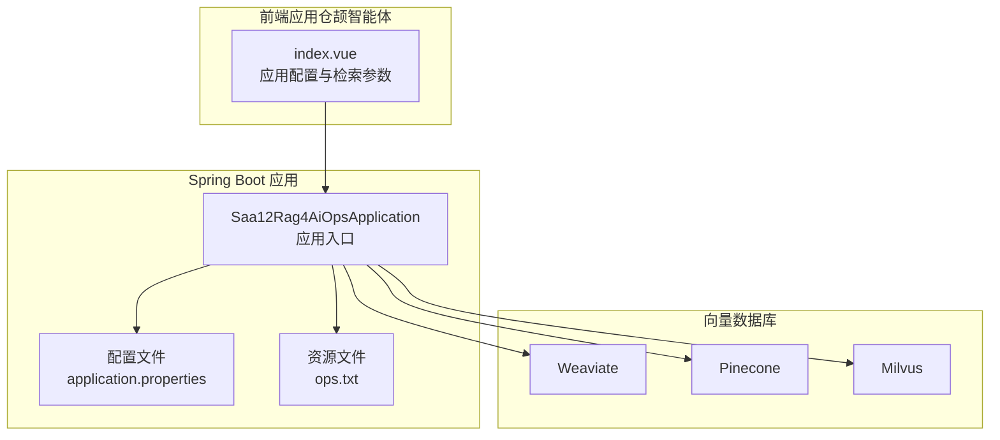
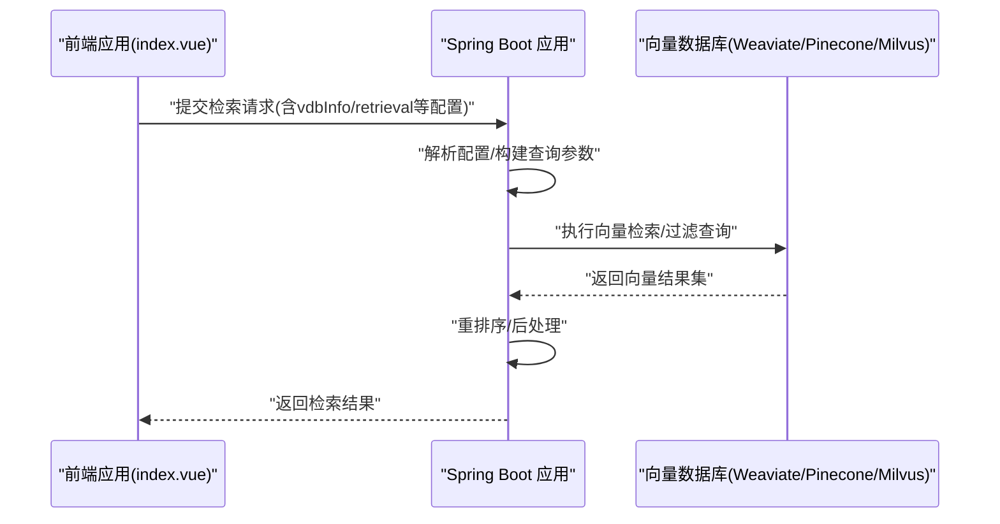
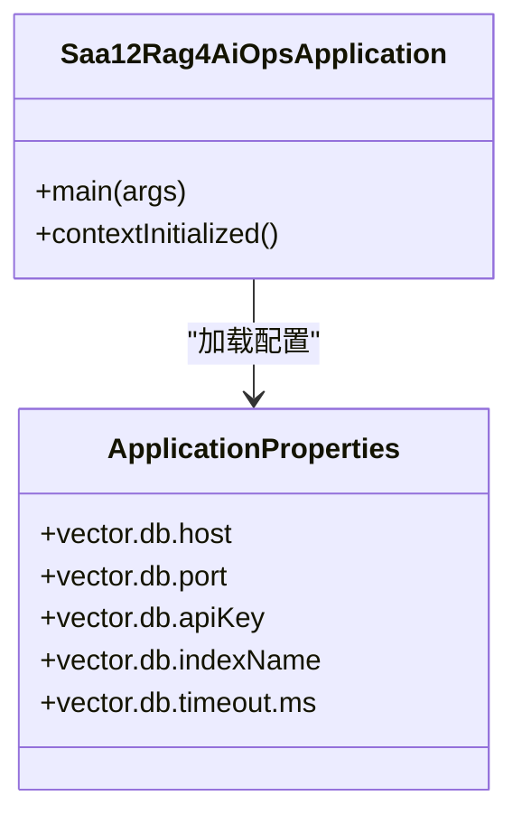
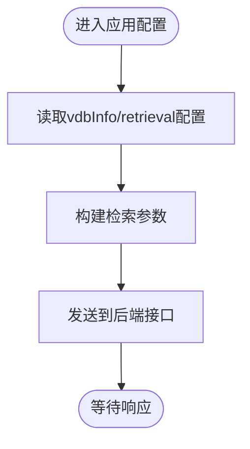
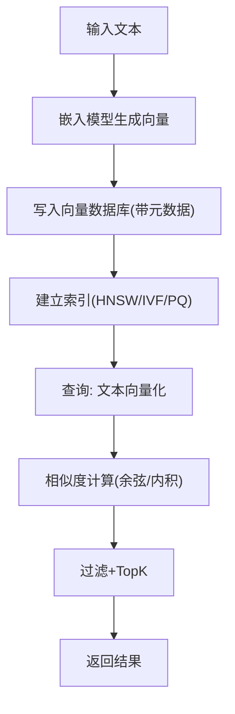
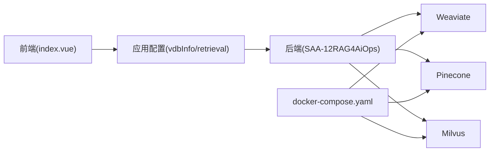

# 向量数据库搭建与配置

<cite>
**本文引用的文件**
- [application.properties](file://【1】SpringAIAlibaba-atguiguV1/SAA-12RAG4AiOps/src/main/resources/application.properties)
- [Saa12Rag4AiOpsApplication.java](file://【1】SpringAIAlibaba-atguiguV1/SAA-12RAG4AiOps/src/main/java/com/atguigu/study/Saa12Rag4AiOpsApplication.java)
- [index.vue](file://【3】工作资料/code/仓颉智能体/nlp-frontend-web/src/views/workspace/pages/workApps/index.vue)
- [ops.txt](file://【1】SpringAIAlibaba-atguiguV1/SAA-12RAG4AiOps/src/main/resources/ops.txt)
- [docker-compose.yaml](file://【3】工作资料/code/云库系统/knowledge-backend-boot/docker-compose.yaml)
</cite>

## 目录
1. [简介](#简介)
2. [项目结构](#项目结构)
3. [核心组件](#核心组件)
4. [架构总览](#架构总览)
5. [详细组件分析](#详细组件分析)
6. [依赖关系分析](#依赖关系分析)
7. [性能考虑](#性能考虑)
8. [故障排除指南](#故障排除指南)
9. [结论](#结论)
10. [附录](#附录)

## 简介
本指南面向在Spring Boot环境中集成向量数据库（Weaviate、Pinecone、Milvus）的开发者，结合SAA-12RAG4AiOps项目，提供从安装、配置到部署、性能优化、监控与故障排除的完整实践路径。文档同时解释向量嵌入原理、维度与相似度计算，并给出与前端应用协同的配置要点。

## 项目结构
SAA-12RAG4AiOps作为Spring Boot应用，负责：
- 配置向量数据库连接参数
- 提供数据导入与查询接口
- 与前端应用协作完成RAG流程

**图表来源**
- [Saa12Rag4AiOpsApplication.java:1-50](file://【1】SpringAIAlibaba-atguiguV1/SAA-12RAG4AiOps/src/main/java/com/atguigu/study/Saa12Rag4AiOpsApplication.java#L1-L50)
- [application.properties:1-200](file://【1】SpringAIAlibaba-atguiguV1/SAA-12RAG4AiOps/src/main/resources/application.properties#L1-L200)
- [index.vue:154-188](file://【3】工作资料/code/仓颉智能体/nlp-frontend-web/src/views/workspace/pages/workApps/index.vue#L154-L188)

**章节来源**
- [Saa12Rag4AiOpsApplication.java:1-50](file://【1】SpringAIAlibaba-atguiguV1/SAA-12RAG4AiOps/src/main/java/com/atguigu/study/Saa12Rag4AiOpsApplication.java#L1-L50)
- [application.properties:1-200](file://【1】SpringAIAlibaba-atguiguV1/SAA-12RAG4AiOps/src/main/resources/application.properties#L1-L200)
- [index.vue:154-188](file://【3】工作资料/code/仓颉智能体/nlp-frontend-web/src/views/workspace/pages/workApps/index.vue#L154-L188)

## 核心组件
- Spring Boot 应用入口：负责加载配置、启动容器、暴露REST接口。
- 配置文件：集中管理向量数据库连接参数、索引策略、查询超时等。
- 资源文件：包含运维提示或默认配置片段，辅助快速上手。
- 前端应用：通过应用配置传递检索参数（如vdbInfo、retrieval），驱动后端执行RAG检索。

**章节来源**
- [Saa12Rag4AiOpsApplication.java:1-50](file://【1】SpringAIAlibaba-atguiguV1/SAA-12RAG4AiOps/src/main/java/com/atguigu/study/Saa12Rag4AiOpsApplication.java#L1-L50)
- [application.properties:1-200](file://【1】SpringAIAlibaba-atguiguV1/SAA-12RAG4AiOps/src/main/resources/application.properties#L1-L200)
- [ops.txt:1-200](file://【1】SpringAIAlibaba-atguiguV1/SAA-12RAG4AiOps/src/main/resources/ops.txt#L1-L200)
- [index.vue:375-422](file://【3】工作资料/code/仓颉智能体/nlp-frontend-web/src/views/workspace/pages/workApps/index.vue#L375-L422)

## 架构总览
下图展示了从前端到后端再到向量数据库的整体交互流程：

**图表来源**
- [index.vue:375-422](file://【3】工作资料/code/仓颉智能体/nlp-frontend-web/src/views/workspace/pages/workApps/index.vue#L375-L422)
- [application.properties:1-200](file://【1】SpringAIAlibaba-atguiguV1/SAA-12RAG4AiOps/src/main/resources/application.properties#L1-L200)

## 详细组件分析

### 组件A：Spring Boot 应用入口与配置加载
- 应用入口负责启动容器并注册必要的Bean。
- 配置文件集中管理向量数据库连接参数（如地址、密钥、索引名称、查询超时等）。
- 资源文件可作为运维提示，帮助快速定位常见问题。

**图表来源**
- [Saa12Rag4AiOpsApplication.java:1-50](file://【1】SpringAIAlibaba-atguiguV1/SAA-12RAG4AiOps/src/main/java/com/atguigu/study/Saa12Rag4AiOpsApplication.java#L1-L50)
- [application.properties:1-200](file://【1】SpringAIAlibaba-atguiguV1/SAA-12RAG4AiOps/src/main/resources/application.properties#L1-L200)

**章节来源**
- [Saa12Rag4AiOpsApplication.java:1-50](file://【1】SpringAIAlibaba-atguiguV1/SAA-12RAG4AiOps/src/main/java/com/atguigu/study/Saa12Rag4AiOpsApplication.java#L1-L50)
- [application.properties:1-200](file://【1】SpringAIAlibaba-atguiguV1/SAA-12RAG4AiOps/src/main/resources/application.properties#L1-L200)

### 组件B：前端应用配置与检索参数传递
- 前端应用在布局切换时，会将vdbInfo、retrieval等配置对象写入应用配置，供后端使用。
- 这些配置直接影响后端的向量检索行为（如向量库类型、过滤条件、topK等）。

**图表来源**
- [index.vue:375-422](file://【3】工作资料/code/仓颉智能体/nlp-frontend-web/src/views/workspace/pages/workApps/index.vue#L375-L422)

**章节来源**
- [index.vue:375-422](file://【3】工作资料/code/仓颉智能体/nlp-frontend-web/src/views/workspace/pages/workApps/index.vue#L375-L422)

### 组件C：向量嵌入与相似度计算
- 文本向量化：将自然语言映射到稠密向量空间，维度通常由嵌入模型决定（如384、512、768、1024等）。
- 索引与相似度：向量数据库基于索引结构（如HNSW、IVF、PQ）加速近似最近邻搜索；相似度常用余弦距离或点积归一化后的余弦相似度。
- 数据导入：将分段文本与元数据写入向量集合，建立倒排/向量索引。
- 查询优化：通过过滤条件、topK裁剪、并发批处理降低延迟。

[本图为概念性流程，无需图表来源]

## 依赖关系分析
- 前端通过应用配置将vdbInfo、retrieval等参数传给后端。
- 后端根据配置选择对应向量数据库实现（Weaviate/Pinecone/Milvus）。
- 容器编排文件可用于本地或测试环境快速拉起依赖服务（如向量数据库、搜索引擎等）。

**图表来源**
- [index.vue:375-422](file://【3】工作资料/code/仓颉智能体/nlp-frontend-web/src/views/workspace/pages/workApps/index.vue#L375-L422)
- [application.properties:1-200](file://【1】SpringAIAlibaba-atguiguV1/SAA-12RAG4AiOps/src/main/resources/application.properties#L1-L200)
- [docker-compose.yaml:1-200](file://【3】工作资料/code/云库系统/knowledge-backend-boot/docker-compose.yaml#L1-L200)

**章节来源**
- [index.vue:375-422](file://【3】工作资料/code/仓颉智能体/nlp-frontend-web/src/views/workspace/pages/workApps/index.vue#L375-L422)
- [application.properties:1-200](file://【1】SpringAIAlibaba-atguiguV1/SAA-12RAG4AiOps/src/main/resources/application.properties#L1-L200)
- [docker-compose.yaml:1-200](file://【3】工作资料/code/云库系统/knowledge-backend-boot/docker-compose.yaml#L1-L200)

## 性能考虑
- 索引配置
  - Weaviate：合理设置HNSW的efConstruction与ef；批量导入时开启并发写入。
  - Pinecone：选择合适索引类型（flat/IVF_*），调整nlist与nprobe；按标签过滤减少扫描范围。
  - Milvus：平衡构造参数（index_type、params）与查询性能；启用向量压缩（如PQ）以降低内存占用。
- 查询优化
  - 过滤条件前置：先用metadata过滤再做向量检索。
  - TopK裁剪：避免返回过多候选；结合rerank提升命中质量。
  - 批量查询：合并多个小查询为批次，减少网络往返。
- 存储管理
  - 分片与副本：按数据量与可用性要求配置分片数量与副本数。
  - 增量更新：支持增量导入与软删除，定期compact释放空间。
  - 冷热分离：对历史数据降采样或迁移至低成本存储。

[本节为通用性能建议，无需章节来源]

## 故障排除指南
- 连接失败
  - 检查向量数据库地址、端口、鉴权参数是否正确。
  - 确认防火墙与网络策略允许访问。
- 查询超时
  - 增加查询超时阈值；优化过滤条件与TopK。
  - 检查索引构建状态与数据量增长速度。
- 结果异常
  - 核对嵌入维度与向量数据库期望维度一致。
  - 确认相似度计算方式与预期匹配（余弦/内积）。
- 前后端参数不一致
  - 对照前端vdbInfo、retrieval配置，确保后端解析逻辑一致。
- 运维提示
  - 参考资源文件中的运维提示，快速定位常见问题。

**章节来源**
- [application.properties:1-200](file://【1】SpringAIAlibaba-atguiguV1/SAA-12RAG4AiOps/src/main/resources/application.properties#L1-L200)
- [ops.txt:1-200](file://【1】SpringAIAlibaba-atguiguV1/SAA-12RAG4AiOps/src/main/resources/ops.txt#L1-L200)
- [index.vue:375-422](file://【3】工作资料/code/仓颉智能体/nlp-frontend-web/src/views/workspace/pages/workApps/index.vue#L375-L422)

## 结论
通过SAA-12RAG4AiOps项目，可以在Spring Boot环境中高效集成Weaviate、Pinecone、Milvus等向量数据库。结合前端应用的配置传递与后端的参数解析，形成完整的RAG检索链路。遵循索引与查询优化策略、完善监控与备份机制，可显著提升系统稳定性与性能。

[本节为总结性内容，无需章节来源]

## 附录
- 容器编排参考：使用docker-compose快速拉起依赖服务，便于本地开发与测试。
- 配置文件参考：application.properties中定义了向量数据库连接与查询相关的关键参数。

**章节来源**
- [docker-compose.yaml:1-200](file://【3】工作资料/code/云库系统/knowledge-backend-boot/docker-compose.yaml#L1-L200)
- [application.properties:1-200](file://【1】SpringAIAlibaba-atguiguV1/SAA-12RAG4AiOps/src/main/resources/application.properties#L1-L200)