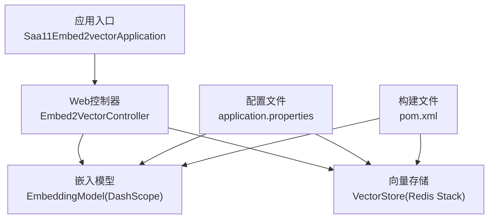
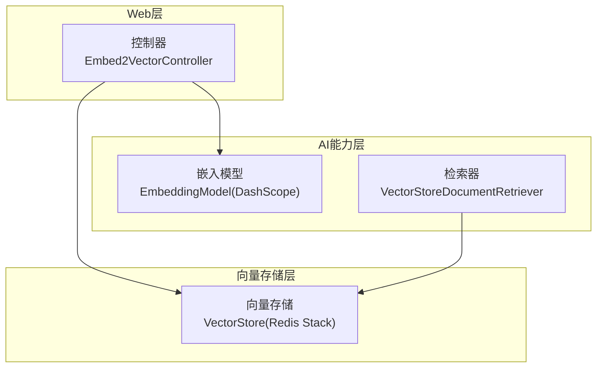
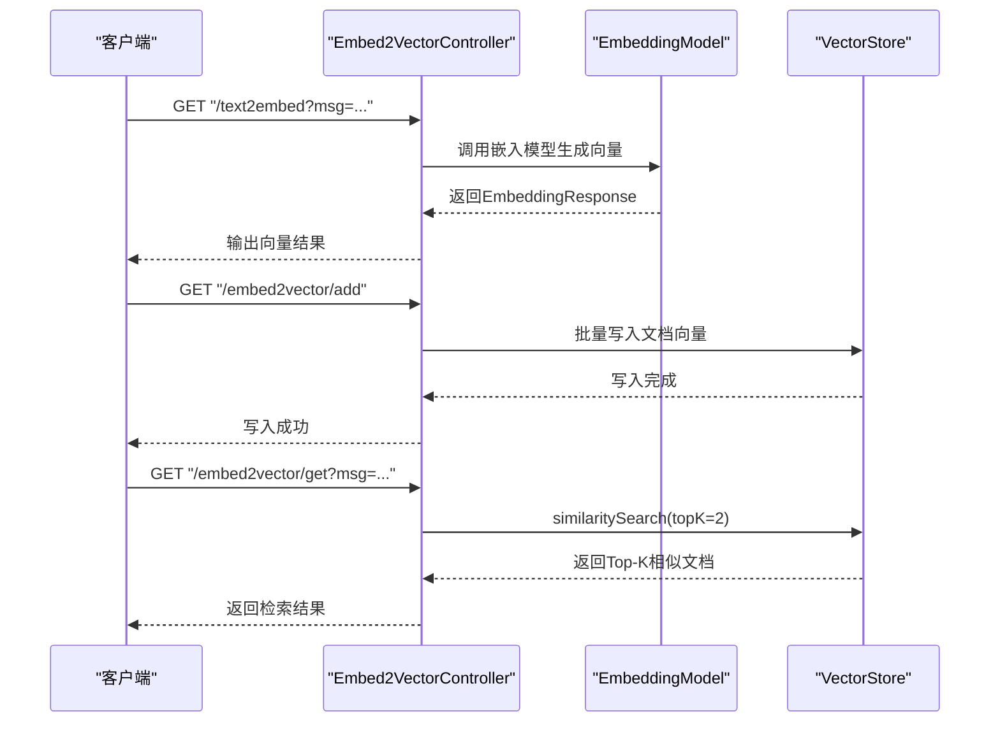
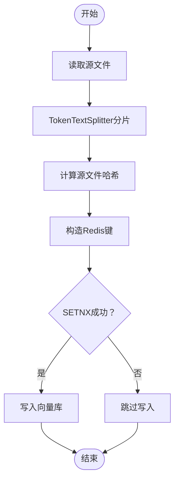
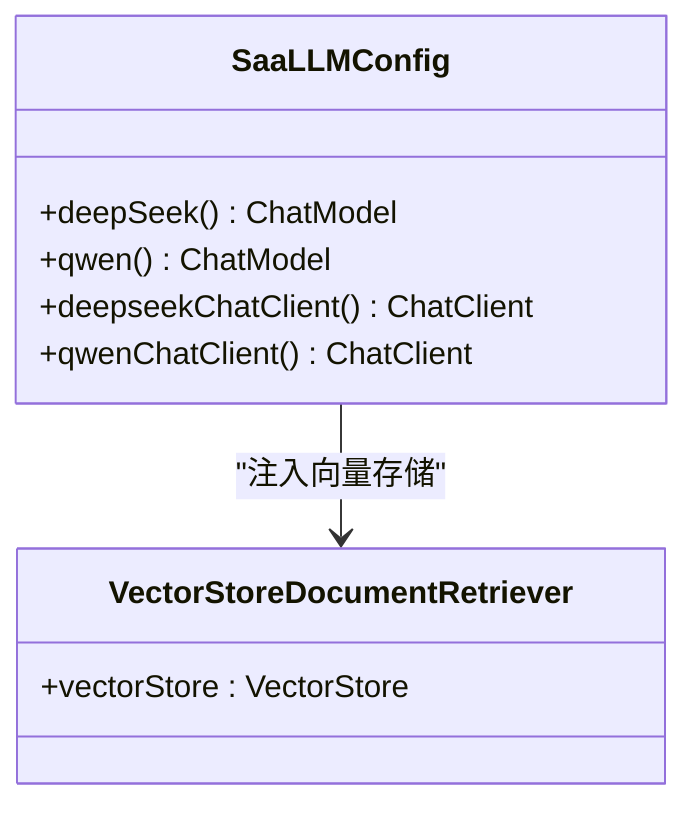
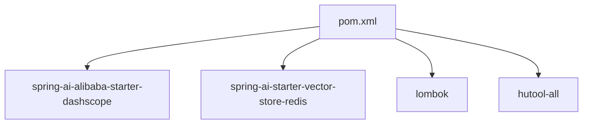

# 文本向量化与嵌入

<cite>
**本文引用的文件**
- [Saa11Embed2vectorApplication.java](file://【1】SpringAIAlibaba-atguiguV1/SAA-11Embed2vector/src/main/java/com/atguigu/study/Saa11Embed2vectorApplication.java)
- [Embed2VectorController.java](file://【1】SpringAIAlibaba-atguiguV1/SAA-11Embed2vector/src/main/java/com/atguigu/study/controller/Embed2VectorController.java)
- [application.properties](file://【1】SpringAIAlibaba-atguiguV1/SAA-11Embed2vector/src/main/resources/application.properties)
- [pom.xml](file://【1】SpringAIAlibaba-atguiguV1/SAA-11Embed2vector/pom.xml)
- [InitVectorDatabaseConfig.java](file://【1】SpringAIAlibaba-atguiguV1/SAA-12RAG4AiOps/src/main/java/com/atguigu/study/config/InitVectorDatabaseConfig.java)
- [SaaLLMConfig.java](file://【1】SpringAIAlibaba-atguiguV1/SAA-12RAG4AiOps/src/main/java/com/atguigu/study/config/SaaLLMConfig.java)
</cite>

## 目录
1. [引言](#引言)
2. [项目结构](#项目结构)
3. [核心组件](#核心组件)
4. [架构总览](#架构总览)
5. [详细组件分析](#详细组件分析)
6. [依赖分析](#依赖分析)
7. [性能考虑](#性能考虑)
8. [故障排查指南](#故障排查指南)
9. [结论](#结论)
10. [附录](#附录)

## 引言
本技术指南围绕文本向量化与嵌入展开，系统讲解词嵌入、句子嵌入与文档嵌入的策略差异，主流嵌入模型（如Sentence-BERT、OpenAI Embeddings、DashScope文本嵌入）的使用要点与性能对比，并结合SAA-11Embed2vector项目在Spring AI Alibaba框架中的实际实现，演示如何完成文本预处理、批量处理、缓存与去重、向量存储、相似度检索与更新的完整流程。

## 项目结构
SAA-11Embed2vector是一个基于Spring Boot的最小可运行示例，通过Spring AI Alibaba集成DashScope嵌入模型，并使用Redis Stack作为向量存储后端。其核心由以下部分组成：
- 应用入口：启动类负责应用上下文初始化
- 控制器：提供文本向量化、写入向量库、相似度检索的REST接口
- 配置文件：设置DashScope嵌入模型、Redis连接与向量索引参数
- 构建文件：声明DashScope与Redis向量存储依赖

**图示来源**
- [Saa11Embed2vectorApplication.java:1-16](file://【1】SpringAIAlibaba-atguiguV1/SAA-11Embed2vector/src/main/java/com/atguigu/study/Saa11Embed2vectorApplication.java#L1-L16)
- [Embed2VectorController.java:1-91](file://【1】SpringAIAlibaba-atguiguV1/SAA-11Embed2vector/src/main/java/com/atguigu/study/controller/Embed2VectorController.java#L1-L91)
- [application.properties:1-24](file://【1】SpringAIAlibaba-atguiguV1/SAA-11Embed2vector/src/main/resources/application.properties#L1-L24)
- [pom.xml:1-81](file://【1】SpringAIAlibaba-atguiguV1/SAA-11Embed2vector/pom.xml#L1-L81)

**章节来源**
- [Saa11Embed2vectorApplication.java:1-16](file://【1】SpringAIAlibaba-atguiguV1/SAA-11Embed2vector/src/main/java/com/atguigu/study/Saa11Embed2vectorApplication.java#L1-L16)
- [Embed2VectorController.java:1-91](file://【1】SpringAIAlibaba-atguiguV1/SAA-11Embed2vector/src/main/java/com/atguigu/study/controller/Embed2VectorController.java#L1-L91)
- [application.properties:1-24](file://【1】SpringAIAlibaba-atguiguV1/SAA-11Embed2vector/src/main/resources/application.properties#L1-L24)
- [pom.xml:1-81](file://【1】SpringAIAlibaba-atguiguV1/SAA-11Embed2vector/pom.xml#L1-L81)

## 核心组件
- 嵌入模型（EmbeddingModel）
  - 通过DashScope文本嵌入模型生成文本向量，支持指定模型名称与选项
  - 示例路径：[Embed2VectorController.java:41-52](file://【1】SpringAIAlibaba-atguiguV1/SAA-11Embed2vector/src/main/java/com/atguigu/study/controller/Embed2VectorController.java#L41-L52)
- 向量存储（VectorStore）
  - 使用Redis Stack作为向量索引与存储后端，支持批量写入与相似度检索
  - 示例路径：[Embed2VectorController.java:58-67](file://【1】SpringAIAlibaba-atguiguV1/SAA-11Embed2vector/src/main/java/com/atguigu/study/controller/Embed2VectorController.java#L58-L67)，[Embed2VectorController.java:76-89](file://【1】SpringAIAlibaba-atguiguV1/SAA-11Embed2vector/src/main/java/com/atguigu/study/controller/Embed2VectorController.java#L76-L89)
- 文档与分片
  - 结合TokenTextSplitter对长文本进行分段，便于后续向量化与检索
  - 示例路径：[InitVectorDatabaseConfig.java:43-44](file://【1】SpringAIAlibaba-atguiguV1/SAA-12RAG4AiOps/src/main/java/com/atguigu/study/config/InitVectorDatabaseConfig.java#L43-L44)
- 去重与幂等
  - 使用Redis SETNX对源文件哈希进行幂等控制，避免重复写入
  - 示例路径：[InitVectorDatabaseConfig.java:53-69](file://【1】SpringAIAlibaba-atguiguV1/SAA-12RAG4AiOps/src/main/java/com/atguigu/study/config/InitVectorDatabaseConfig.java#L53-L69)

**章节来源**
- [Embed2VectorController.java:1-91](file://【1】SpringAIAlibaba-atguiguV1/SAA-11Embed2vector/src/main/java/com/atguigu/study/controller/Embed2VectorController.java#L1-L91)
- [InitVectorDatabaseConfig.java:1-75](file://【1】SpringAIAlibaba-atguiguV1/SAA-12RAG4AiOps/src/main/java/com/atguigu/study/config/InitVectorDatabaseConfig.java#L1-L75)

## 架构总览
下图展示了SAA-11Embed2vector在Spring AI Alibaba生态中的整体架构：Web层通过EmbeddingModel生成向量，再写入Redis Stack VectorStore；检索时以查询文本生成向量，执行相似度匹配返回结果。

**图示来源**
- [Embed2VectorController.java:28-32](file://【1】SpringAIAlibaba-atguiguV1/SAA-11Embed2vector/src/main/java/com/atguigu/study/controller/Embed2VectorController.java#L28-L32)
- [SaaLLMConfig.java:9-11](file://【1】SpringAIAlibaba-atguiguV1/SAA-12RAG4AiOps/src/main/java/com/atguigu/study/config/SaaLLMConfig.java#L9-L11)

## 详细组件分析

### 组件A：文本向量化与相似度检索
该组件包含三个核心流程：
- 文本向量化：将输入文本转为向量
- 批量写入向量库：将多个文档写入Redis Stack
- 相似度检索：根据查询文本返回Top-K相似文档

**图示来源**
- [Embed2VectorController.java:41-52](file://【1】SpringAIAlibaba-atguiguV1/SAA-11Embed2vector/src/main/java/com/atguigu/study/controller/Embed2VectorController.java#L41-L52)
- [Embed2VectorController.java:58-67](file://【1】SpringAIAlibaba-atguiguV1/SAA-11Embed2vector/src/main/java/com/atguigu/study/controller/Embed2VectorController.java#L58-L67)
- [Embed2VectorController.java:76-89](file://【1】SpringAIAlibaba-atguiguV1/SAA-11Embed2vector/src/main/java/com/atguigu/study/controller/Embed2VectorController.java#L76-L89)

**章节来源**
- [Embed2VectorController.java:41-89](file://【1】SpringAIAlibaba-atguiguV1/SAA-11Embed2vector/src/main/java/com/atguigu/study/controller/Embed2VectorController.java#L41-L89)

### 组件B：文档分片与去重（向量库初始化）
该组件演示了如何对长文本进行分片，以及如何通过Redis SETNX实现幂等写入，避免重复初始化。

**图示来源**
- [InitVectorDatabaseConfig.java:36-72](file://【1】SpringAIAlibaba-atguiguV1/SAA-12RAG4AiOps/src/main/java/com/atguigu/study/config/InitVectorDatabaseConfig.java#L36-L72)

**章节来源**
- [InitVectorDatabaseConfig.java:36-72](file://【1】SpringAIAlibaba-atguiguV1/SAA-12RAG4AiOps/src/main/java/com/atguigu/study/config/InitVectorDatabaseConfig.java#L36-L72)

### 组件C：多模型与检索增强配置（参考）
该配置展示了如何在Spring AI中注册不同模型与检索器，便于在RAG场景中组合使用。

**图示来源**
- [SaaLLMConfig.java:24-79](file://【1】SpringAIAlibaba-atguiguV1/SAA-12RAG4AiOps/src/main/java/com/atguigu/study/config/SaaLLMConfig.java#L24-L79)

**章节来源**
- [SaaLLMConfig.java:24-79](file://【1】SpringAIAlibaba-atguiguV1/SAA-12RAG4AiOps/src/main/java/com/atguigu/study/config/SaaLLMConfig.java#L24-L79)

## 依赖分析
SAA-11Embed2vector的依赖主要来自Spring AI Alibaba与Redis向量存储：
- DashScope嵌入模型：用于生成文本向量
- Redis向量存储：提供向量索引与相似度检索
- Lombok与Hutool：简化开发与提供工具能力

**图示来源**
- [pom.xml:14-45](file://【1】SpringAIAlibaba-atguiguV1/SAA-11Embed2vector/pom.xml#L14-L45)

**章节来源**
- [pom.xml:14-45](file://【1】SpringAIAlibaba-atguiguV1/SAA-11Embed2vector/pom.xml#L14-L45)

## 性能考虑
- 向量维度选择
  - DashScope文本嵌入v3通常提供固定维度输出，具体数值以官方文档为准；在Spring AI中可通过嵌入选项指定模型，从而间接影响维度
  - 参考路径：[application.properties:13](file://【1】SpringAIAlibaba-atguiguV1/SAA-11Embed2vector/src/main/resources/application.properties#L13)
- 相似度计算
  - Redis Stack默认采用余弦相似度；在检索时通过topK限制返回数量，平衡召回与性能
  - 参考路径：[Embed2VectorController.java:79-84](file://【1】SpringAIAlibaba-atguiguV1/SAA-11Embed2vector/src/main/java/com/atguigu/study/controller/Embed2VectorController.java#L79-L84)
- 批量处理与并发
  - 使用VectorStore批量add接口提升入库吞吐；建议在高并发场景下配合限流与队列
  - 参考路径：[Embed2VectorController.java:61-66](file://【1】SpringAIAlibaba-atguiguV1/SAA-11Embed2vector/src/main/java/com/atguigu/study/controller/Embed2VectorController.java#L61-L66)
- 缓存与去重
  - 使用Redis SETNX对源文件哈希进行幂等控制，避免重复初始化
  - 参考路径：[InitVectorDatabaseConfig.java:53-69](file://【1】SpringAIAlibaba-atguiguV1/SAA-12RAG4AiOps/src/main/java/com/atguigu/study/config/InitVectorDatabaseConfig.java#L53-L69)

**章节来源**
- [application.properties:13](file://【1】SpringAIAlibaba-atguiguV1/SAA-11Embed2vector/src/main/resources/application.properties#L13)
- [Embed2VectorController.java:61-84](file://【1】SpringAIAlibaba-atguiguV1/SAA-11Embed2vector/src/main/java/com/atguigu/study/controller/Embed2VectorController.java#L61-L84)
- [InitVectorDatabaseConfig.java:53-69](file://【1】SpringAIAlibaba-atguiguV1/SAA-12RAG4AiOps/src/main/java/com/atguigu/study/config/InitVectorDatabaseConfig.java#L53-L69)

## 故障排查指南
- 嵌入模型不可用或鉴权失败
  - 检查DashScope API Key配置与网络连通性
  - 参考路径：[application.properties:11](file://【1】SpringAIAlibaba-atguiguV1/SAA-11Embed2vector/src/main/resources/application.properties#L11)
- 向量库初始化异常
  - 确认Redis Stack可用且索引初始化开关已启用
  - 参考路径：[application.properties:22](file://【1】SpringAIAlibaba-atguiguV1/SAA-11Embed2vector/src/main/resources/application.properties#L22)
- 重复初始化
  - 若出现“向量初始化数据已经加载过”，请检查Redis键是否存在或删除后重试
  - 参考路径：[InitVectorDatabaseConfig.java:63-71](file://【1】SpringAIAlibaba-atguiguV1/SAA-12RAG4AiOps/src/main/java/com/atguigu/study/config/InitVectorDatabaseConfig.java#L63-L71)
- 检索结果为空
  - 检查是否已写入数据、索引是否建立、查询文本是否过短或噪声过多
  - 参考路径：[Embed2VectorController.java:76-89](file://【1】SpringAIAlibaba-atguiguV1/SAA-11Embed2vector/src/main/java/com/atguigu/study/controller/Embed2VectorController.java#L76-L89)

**章节来源**
- [application.properties:11-22](file://【1】SpringAIAlibaba-atguiguV1/SAA-11Embed2vector/src/main/resources/application.properties#L11-L22)
- [InitVectorDatabaseConfig.java:63-71](file://【1】SpringAIAlibaba-atguiguV1/SAA-12RAG4AiOps/src/main/java/com/atguigu/study/config/InitVectorDatabaseConfig.java#L63-L71)
- [Embed2VectorController.java:76-89](file://【1】SpringAIAlibaba-atguiguV1/SAA-11Embed2vector/src/main/java/com/atguigu/study/controller/Embed2VectorController.java#L76-L89)

## 结论
SAA-11Embed2vector展示了在Spring AI Alibaba生态中，如何以最少的代码完成文本向量化、批量入库与相似度检索。通过DashScope嵌入模型与Redis Stack向量存储的组合，项目具备良好的扩展性与实用性。结合文档分片与去重策略，可在生产环境中实现稳定高效的RAG基础能力。

## 附录
- 文本预处理最佳实践
  - 分词与标准化：依据下游模型特性选择合适的分词器与大小写/标点处理策略
  - 去噪：移除无关字符、URL、特殊符号，保留语义信息
  - 分段：对长文档按语义边界切分，避免单条向量承载过多上下文
  - 参考实现：TokenTextSplitter分片策略
  - 参考路径：[InitVectorDatabaseConfig.java:43-44](file://【1】SpringAIAlibaba-atguiguV1/SAA-12RAG4AiOps/src/main/java/com/atguigu/study/config/InitVectorDatabaseConfig.java#L43-L44)
- 嵌入模型选择与对比
  - Sentence-BERT：适合句子级语义表示，检索效果稳定
  - OpenAI Embeddings：高质量但成本较高，适合对精度要求高的场景
  - DashScope文本嵌入：国内可用性好，延迟低，适配国内业务场景
  - 在Spring AI中通过指定模型名与选项即可切换
  - 参考路径：[application.properties:13](file://【1】SpringAIAlibaba-atguiguV1/SAA-11Embed2vector/src/main/resources/application.properties#L13)，[Embed2VectorController.java:46](file://【1】SpringAIAlibaba-atguiguV1/SAA-11Embed2vector/src/main/java/com/atguigu/study/controller/Embed2VectorController.java#L46)