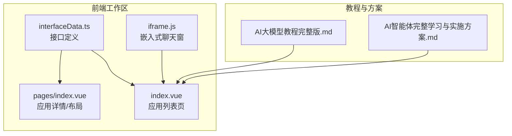
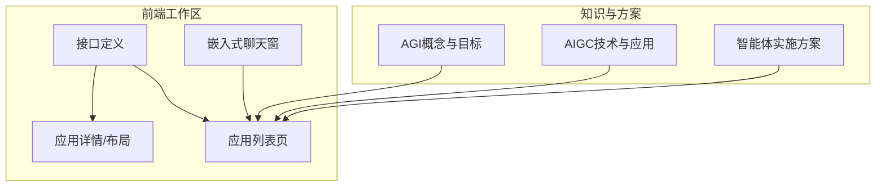
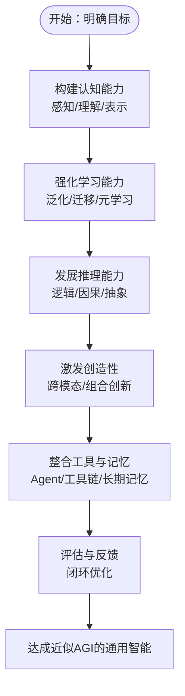
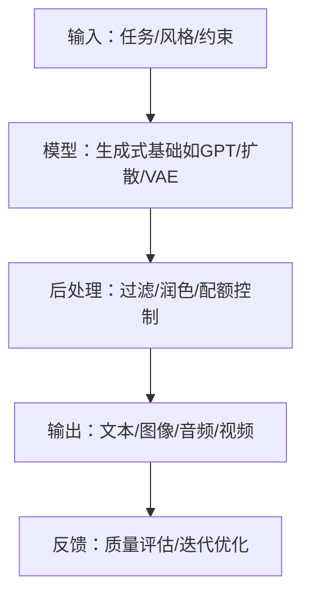
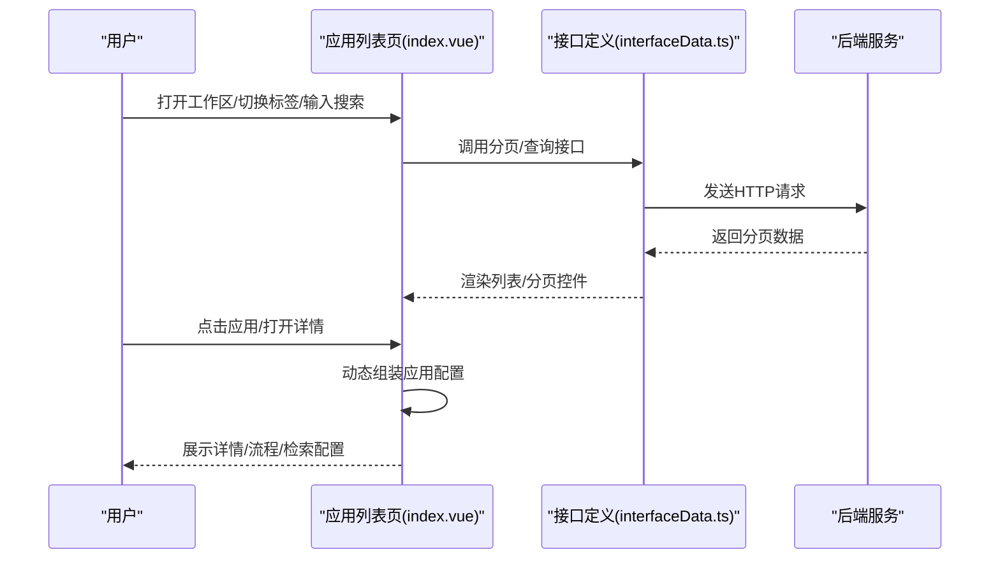
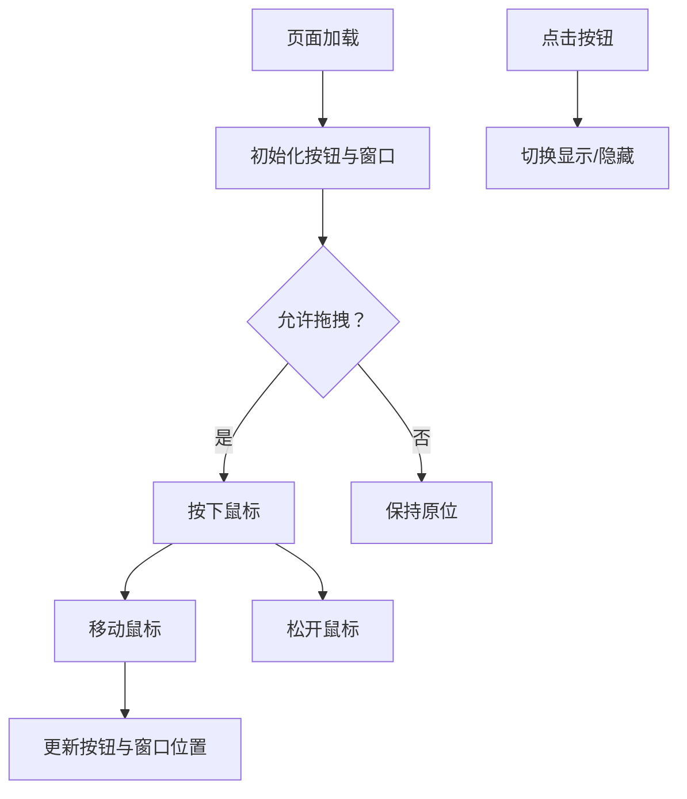
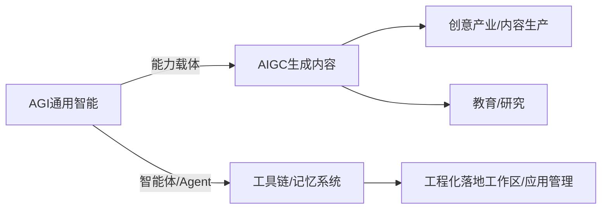
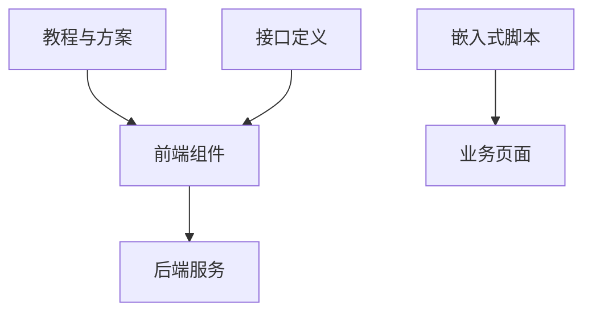

# AGI与AIGC概念

<cite>
**本文引用的文件**
- [AI大模型教程完整版.md](file://【0】AI大模型教程（指导手册）/AI大模型教程完整版.md)
- [5、AI智能体完整学习与实施方案.md](file://5、AI智能体完整学习与实施方案.md)
- [index.vue](file://【3】工作资料/code/仓颉智能体/nlp-frontend-web/src/views/workspace/pages/workApps/index.vue)
- [index.vue](file://【3】工作资料/code/仓颉智能体/nlp-frontend-web/src/views/workspace/pages/workApps/pages/index.vue)
- [interfaceData.ts](file://【3】工作资料/code/仓颉智能体/nlp-frontend-web/src/views/workspace/interfaceData.ts)
- [iframe.js](file://【3】工作资料/code/仓颉智能体/nlp-frontend-web/public/iframe.js)
</cite>

## 目录
1. [引言](#引言)
2. [项目结构](#项目结构)
3. [核心组件](#核心组件)
4. [架构总览](#架构总览)
5. [详细组件分析](#详细组件分析)
6. [依赖分析](#依赖分析)
7. [性能考虑](#性能考虑)
8. [故障排查指南](#故障排查指南)
9. [结论](#结论)
10. [附录](#附录)

## 引言
本文件围绕“人工通用智能（AGI）”与“人工智能生成内容（AIGC）”两大主题，结合仓库中的AI教程与智能体实践材料，系统阐述其概念定义、技术特征、发展路径、关键挑战与现实应用，并进一步讨论二者之间的关系及其对未来社会的深远影响。内容力求兼顾理论深度与工程实践视角，帮助不同背景读者建立清晰的认知框架。

## 项目结构
本仓库包含多套AI教学与实践资料，其中与AGI/AIGC主题最直接相关的是“AI大模型教程完整版”，以及“智能体实施方案”。同时，前端工作区与应用管理界面体现了在实际产品中如何组织与编排智能体应用，为理解AIGC落地提供了工程化参考。

**图示来源**
- [AI大模型教程完整版.md](file://【0】AI大模型教程（指导手册）/AI大模型教程完整版.md)
- [5、AI智能体完整学习与实施方案.md](file://5、AI智能体完整学习与实施方案.md)
- [index.vue](file://【3】工作资料/code/仓颉智能体/nlp-frontend-web/src/views/workspace/pages/workApps/index.vue)
- [index.vue](file://【3】工作资料/code/仓颉智能体/nlp-frontend-web/src/views/workspace/pages/workApps/pages/index.vue)
- [interfaceData.ts](file://【3】工作资料/code/仓颉智能体/nlp-frontend-web/src/views/workspace/interfaceData.ts)
- [iframe.js](file://【3】工作资料/code/仓颉智能体/nlp-frontend-web/public/iframe.js)

**章节来源**
- [AI大模型教程完整版.md](file://【0】AI大模型教程（指导手册）/AI大模型教程完整版.md)
- [5、AI智能体完整学习与实施方案.md](file://5、AI智能体完整学习与实施方案.md)
- [index.vue](file://【3】工作资料/code/仓颉智能体/nlp-frontend-web/src/views/workspace/pages/workApps/index.vue)
- [index.vue](file://【3】工作资料/code/仓颉智能体/nlp-frontend-web/src/views/workspace/pages/workApps/pages/index.vue)
- [interfaceData.ts](file://【3】工作资料/code/仓颉智能体/nlp-frontend-web/src/views/workspace/interfaceData.ts)
- [iframe.js](file://【3】工作资料/code/仓颉智能体/nlp-frontend-web/public/iframe.js)

## 核心组件
- 教程与方案支撑层：提供AGI与AIGC的理论基础、技术脉络与实施路径，作为知识与方法论来源。
- 前端工作区与应用管理：以Vue组件与接口定义呈现智能体应用的组织、展示与交互方式，体现AIGC在产品中的落地形态。
- 嵌入式交互：通过iframe脚本实现聊天窗的嵌入与拖拽交互，便于在网页中集成AIGC能力。

**章节来源**
- [AI大模型教程完整版.md](file://【0】AI大模型教程（指导手册）/AI大模型教程完整版.md)
- [5、AI智能体完整学习与实施方案.md](file://5、AI智能体完整学习与实施方案.md)
- [index.vue](file://【3】工作资料/code/仓颉智能体/nlp-frontend-web/src/views/workspace/pages/workApps/index.vue)
- [index.vue](file://【3】工作资料/code/仓颉智能体/nlp-frontend-web/src/views/workspace/pages/workApps/pages/index.vue)
- [interfaceData.ts](file://【3】工作资料/code/仓颉智能体/nlp-frontend-web/src/views/workspace/interfaceData.ts)
- [iframe.js](file://【3】工作资料/code/仓颉智能体/nlp-frontend-web/public/iframe.js)

## 架构总览
下图展示了从“教程与方案”到“前端工作区”的知识与工程映射关系，以及用户交互入口（iframe嵌入）如何串联到应用管理界面。

**图示来源**
- [AI大模型教程完整版.md](file://【0】AI大模型教程（指导手册）/AI大模型教程完整版.md)
- [5、AI智能体完整学习与实施方案.md](file://5、AI智能体完整学习与实施方案.md)
- [index.vue](file://【3】工作资料/code/仓颉智能体/nlp-frontend-web/src/views/workspace/pages/workApps/index.vue)
- [index.vue](file://【3】工作资料/code/仓颉智能体/nlp-frontend-web/src/views/workspace/pages/workApps/pages/index.vue)
- [interfaceData.ts](file://【3】工作资料/code/仓颉智能体/nlp-frontend-web/src/views/workspace/interfaceData.ts)
- [iframe.js](file://【3】工作资料/code/仓颉智能体/nlp-frontend-web/public/iframe.js)

## 详细组件分析

### 组件A：AGI概念与技术特征
- 定义与目标：AGI强调“通用地理解世界与解决问题”，具备跨域迁移、元认知与自主决策能力，区别于仅在特定任务上表现出色的窄人工智能。
- 发展路径：从传统机器学习到深度学习，再到大模型、智能体（Agent）、工具链与记忆系统，逐步逼近AGI目标。
- 关键能力要求：认知能力（感知与理解）、学习能力（少样本/持续学习）、推理能力（因果与抽象推理）、创造性（跨模态与组合创新）。

**图示来源**
- [AI大模型教程完整版.md](file://【0】AI大模型教程（指导手册）/AI大模型教程完整版.md)

**章节来源**
- [AI大模型教程完整版.md](file://【0】AI大模型教程（指导手册）/AI大模型教程完整版.md)

### 组件B：AIGC概念与应用场景
- 定义：AIGC指通过生成式模型自动生产文本、图像、音频、视频、代码等数字内容的过程。
- 典型场景：内容创作、辅助写作、图像/视频生成、音乐/音效创作、个性化推荐与交互。
- 技术基础：大模型（如GPT）作为语言/多模态基础；AIGC是大模型的直接应用产物；AGI则可视为更广的能力载体，AIGC为其“技能之一”。

**图示来源**
- [AI大模型教程完整版.md](file://【0】AI大模型教程（指导手册）/AI大模型教程完整版.md)

**章节来源**
- [AI大模型教程完整版.md](file://【0】AI大模型教程（指导手册）/AI大模型教程完整版.md)

### 组件C：前端工作区与应用管理（工程化落地）
- 应用类型与筛选：支持“全部/知识问答/智能问数/对话流/工作流/智能体”等分类，便于按场景组织与检索。
- 列表与分页：通过接口获取分页数据，支持滚动加载与搜索过滤。
- 配置与布局：针对不同应用类型（如知识问答/智能问数/对话流/工作流），动态组装配置对象，支持流程配置与检索配置注入。
- 用户交互：提供新建、复制、发布、删除等操作入口，结合消息提示与加载状态反馈。

**图示来源**
- [index.vue](file://【3】工作资料/code/仓颉智能体/nlp-frontend-web/src/views/workspace/pages/workApps/index.vue)
- [index.vue](file://【3】工作资料/code/仓颉智能体/nlp-frontend-web/src/views/workspace/pages/workApps/pages/index.vue)
- [interfaceData.ts](file://【3】工作资料/code/仓颉智能体/nlp-frontend-web/src/views/workspace/interfaceData.ts)

**章节来源**
- [index.vue](file://【3】工作资料/code/仓颉智能体/nlp-frontend-web/src/views/workspace/pages/workApps/index.vue)
- [index.vue](file://【3】工作资料/code/仓颉智能体/nlp-frontend-web/src/views/workspace/pages/workApps/pages/index.vue)
- [interfaceData.ts](file://【3】工作资料/code/仓颉智能体/nlp-frontend-web/src/views/workspace/interfaceData.ts)

### 组件D：嵌入式聊天窗（AIGC交互入口）
- 功能：在网页中嵌入可拖拽的聊天按钮与窗口，支持默认展开、拖动位置与图标自定义。
- 交互：鼠标按下/移动/抬起时更新按钮位置，实时调整聊天窗口位置；点击按钮切换显示/隐藏状态。
- 场景：将AIGC能力以轻量化方式集成到业务页面，降低用户学习成本，提升触达率。

**图示来源**
- [iframe.js](file://【3】工作资料/code/仓颉智能体/nlp-frontend-web/public/iframe.js)

**章节来源**
- [iframe.js](file://【3】工作资料/code/仓颉智能体/nlp-frontend-web/public/iframe.js)

### 组件E：AGI与AIGC的关系及影响
- 区别与联系：AIGC是大模型的直接应用产物；AGI是更广的能力载体，AIGC是其可掌握的“技能之一，但远非全部”。
- 对创意产业与内容生产：AIGC显著降低创作门槛，提升效率，同时带来版权、真实性与伦理挑战。
- 对教育与研究：促进个性化学习与跨学科融合，但也需关注对批判性思维与创造力培养的平衡。
- 对未来社会：推动人机协作范式演进，要求制度、伦理与技术治理协同完善。

**图示来源**
- [AI大模型教程完整版.md](file://【0】AI大模型教程（指导手册）/AI大模型教程完整版.md)
- [5、AI智能体完整学习与实施方案.md](file://5、AI智能体完整学习与实施方案.md)
- [index.vue](file://【3】工作资料/code/仓颉智能体/nlp-frontend-web/src/views/workspace/pages/workApps/index.vue)
- [index.vue](file://【3】工作资料/code/仓颉智能体/nlp-frontend-web/src/views/workspace/pages/workApps/pages/index.vue)

**章节来源**
- [AI大模型教程完整版.md](file://【0】AI大模型教程（指导手册）/AI大模型教程完整版.md)
- [5、AI智能体完整学习与实施方案.md](file://5、AI智能体完整学习与实施方案.md)
- [index.vue](file://【3】工作资料/code/仓颉智能体/nlp-frontend-web/src/views/workspace/pages/workApps/index.vue)
- [index.vue](file://【3】工作资料/code/仓颉智能体/nlp-frontend-web/src/views/workspace/pages/workApps/pages/index.vue)

## 依赖分析
- 知识依赖：AGI与AIGC的理论基础来自教程与方案文档，为前端应用的分类、配置与交互提供方向性指导。
- 工程依赖：前端组件通过接口定义与后端服务通信，实现应用列表、详情与配置的动态渲染。
- 交互依赖：嵌入式脚本独立运行于页面，负责聊天窗的UI与交互行为，与工作区页面解耦。

**图示来源**
- [AI大模型教程完整版.md](file://【0】AI大模型教程（指导手册）/AI大模型教程完整版.md)
- [5、AI智能体完整学习与实施方案.md](file://5、AI智能体完整学习与实施方案.md)
- [interfaceData.ts](file://【3】工作资料/code/仓颉智能体/nlp-frontend-web/src/views/workspace/interfaceData.ts)
- [iframe.js](file://【3】工作资料/code/仓颉智能体/nlp-frontend-web/public/iframe.js)

**章节来源**
- [AI大模型教程完整版.md](file://【0】AI大模型教程（指导手册）/AI大模型教程完整版.md)
- [5、AI智能体完整学习与实施方案.md](file://5、AI智能体完整学习与实施方案.md)
- [interfaceData.ts](file://【3】工作资料/code/仓颉智能体/nlp-frontend-web/src/views/workspace/interfaceData.ts)
- [iframe.js](file://【3】工作资料/code/仓颉智能体/nlp-frontend-web/public/iframe.js)

## 性能考虑
- 列表渲染与分页：采用分页与滚动加载策略，减少一次性渲染压力；合理设置请求节流，避免频繁重复请求。
- 配置组装：按需组装应用配置对象，避免冗余字段传输与解析开销。
- 交互响应：嵌入式脚本的拖拽与位置计算应避免高频重绘，必要时采用防抖或requestAnimationFrame优化。
- 数据一致性：在切换版本或应用类型时，确保前后端配置同步，防止无效渲染与状态错乱。

## 故障排查指南
- 列表无数据或加载异常
  - 检查接口地址与鉴权头是否正确。
  - 确认分页参数与筛选条件是否符合后端预期。
  - 观察滚动加载阈值与“已到底部”标记，避免重复请求。
- 应用详情未显示或布局异常
  - 核对应用类型与对应配置字段是否存在。
  - 确认流程配置与检索配置的注入逻辑是否生效。
- 嵌入式聊天窗不可拖拽或位置异常
  - 检查拖拽开关与初始位置参数。
  - 确认窗口可见性与遮挡关系，避免被其他元素覆盖。
- 版本切换后状态未更新
  - 确保版本切换后重新拉取详情并刷新配置对象。
  - 校验会话或缓存是否被意外保留导致旧状态残留。

**章节来源**
- [index.vue](file://【3】工作资料/code/仓颉智能体/nlp-frontend-web/src/views/workspace/pages/workApps/index.vue)
- [index.vue](file://【3】工作资料/code/仓颉智能体/nlp-frontend-web/src/views/workspace/pages/workApps/pages/index.vue)
- [interfaceData.ts](file://【3】工作资料/code/仓颉智能体/nlp-frontend-web/src/views/workspace/interfaceData.ts)
- [iframe.js](file://【3】工作资料/code/仓颉智能体/nlp-frontend-web/public/iframe.js)

## 结论
AGI与AIGC分别代表了“能力目标”与“应用产物”的两个维度。前者强调通用智能的构建路径与能力边界，后者聚焦生成式模型在多模态内容上的规模化应用。在工程实践中，以教程与方案为指导，结合前端工作区的分类、配置与交互设计，能够有效组织与落地AIGC能力；而嵌入式交互则为用户触达与体验优化提供了便捷通道。面向未来，需要在技术创新、制度建设与伦理治理之间寻求平衡，以实现人机协同的可持续发展。

## 附录
- 相关文件路径与用途概览
  - 教程与方案：提供AGI/AIGC的理论基础与实施路径
  - 前端组件：实现应用列表、详情与配置的动态渲染
  - 接口定义：统一前后端通信契约
  - 嵌入式脚本：提供轻量化的AIGC交互入口