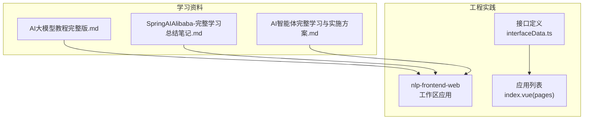
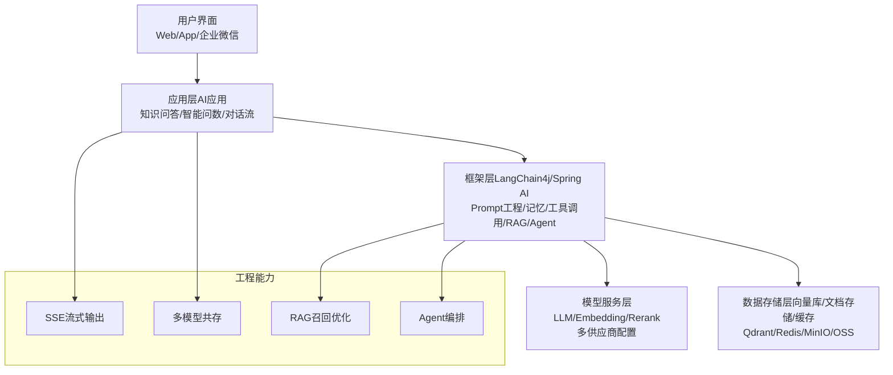
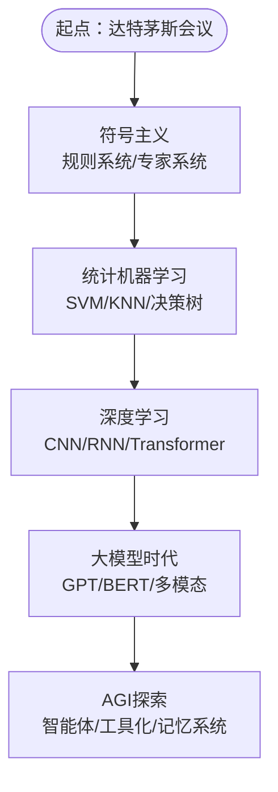
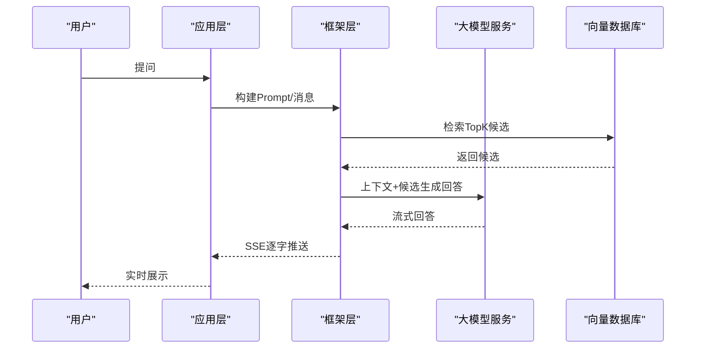
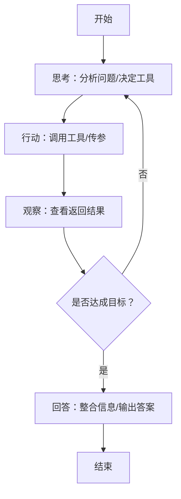
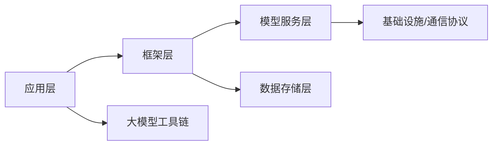

# AI发展历程

<cite>
**本文引用的文件**
- [AI大模型教程完整版.md](file://【0】AI大模型教程（指导手册）/AI大模型教程完整版.md)
- [SpringAIAlibaba-完整学习总结笔记.md](file://3、SpringAIAlibaba-完整学习总结笔记.md)
- [AI智能体完整学习与实施方案.md](file://5、AI智能体完整学习与实施方案.md)
- [index.vue](file://【3】工作资料/code/仓颉智能体/nlp-frontend-web/src/views/workspace/pages/workApps/index.vue)
- [index.vue](file://【3】工作资料/code/仓颉智能体/nlp-frontend-web/src/views/workspace/pages/workApps/pages/index.vue)
- [interfaceData.ts](file://【3】工作资料/code/仓颉智能体/nlp-frontend-web/src/views/workspace/interfaceData.ts)
</cite>

## 目录
1. [引言](#引言)
2. [项目结构](#项目结构)
3. [核心组件](#核心组件)
4. [架构总览](#架构总览)
5. [详细组件分析](#详细组件分析)
6. [依赖分析](#依赖分析)
7. [性能考量](#性能考量)
8. [故障排查指南](#故障排查指南)
9. [结论](#结论)
10. [附录](#附录)

## 引言
本学习内容围绕人工智能（AI）的发展历程，系统梳理从1956年达特茅斯会议至今的关键阶段，重点覆盖符号主义、连接主义、机器学习、深度学习、大模型时代与智能体（Agent）的发展脉络。文档同时结合仓库中的大模型工具链、提示词工程、RAG检索增强、MCP协议与流式输出等工程实践，帮助读者建立从理论到工程落地的完整认知框架。

## 项目结构
本仓库包含多套与AI相关的学习与工程实践资料，涵盖：
- 大模型基础与工具链：Ollama、vLLM、Gradio、Comfy UI、Cursor 等
- 提示词工程与RAG系统：Prompt模板、检索增强、重排序、分片策略
- 智能体与工作流：Agent编排、ReAct模式、工具调用、MCP协议
- 工程化实践：SSE流式输出、多模型共存、模型微调（LoRA/QLoRA）

**图示来源**
- [AI大模型教程完整版.md](file://【0】AI大模型教程（指导手册）/AI大模型教程完整版.md)
- [SpringAIAlibaba-完整学习总结笔记.md](file://3、SpringAIAlibaba-完整学习总结笔记.md)
- [AI智能体完整学习与实施方案.md](file://5、AI智能体完整学习与实施方案.md)
- [interfaceData.ts](file://【3】工作资料/code/仓颉智能体/nlp-frontend-web/src/views/workspace/interfaceData.ts)
- [index.vue](file://【3】工作资料/code/仓颉智能体/nlp-frontend-web/src/views/workspace/pages/workApps/pages/index.vue)

**章节来源**
- [AI大模型教程完整版.md](file://【0】AI大模型教程（指导手册）/AI大模型教程完整版.md)
- [SpringAIAlibaba-完整学习总结笔记.md](file://3、SpringAIAlibaba-完整学习总结笔记.md)
- [AI智能体完整学习与实施方案.md](file://5、AI智能体完整学习与实施方案.md)
- [interfaceData.ts](file://【3】工作资料/code/仓颉智能体/nlp-frontend-web/src/views/workspace/interfaceData.ts)
- [index.vue](file://【3】工作资料/code/仓颉智能体/nlp-frontend-web/src/views/workspace/pages/workApps/pages/index.vue)

## 核心组件
- 大模型工具链与部署
  - Ollama：本地运行与管理大模型，支持多平台与API调用
  - vLLM：高性能推理框架，支持分页注意力、连续批处理与多GPU并行
  - Gradio：快速构建模型交互界面
  - Comfy UI：节点式文生图工作流
  - Cursor：AI编程编辑器，支持Agent模式与Yolo模式
- 提示词工程与RAG
  - Prompt模板、System Prompt、消息类型（System/User/Assistant/ToolResponse）
  - RAG召回优化：混合检索（BM25+向量）、重排序（Rerank）、分片策略（Chunking/Overlap/语义分片）
- 智能体与工作流
  - Agent编排：ReAct模式、工具链编排、多Agent协作
  - 工作流引擎：条件分支、循环、状态管理与断点续传
- 工程化能力
  - SSE流式输出：逐chunk解析与前端推送
  - 多模型共存：同一应用内切换与管理不同模型
  - 模型微调：LoRA/QLoRA参数高效微调

**章节来源**
- [AI大模型教程完整版.md](file://【0】AI大模型教程（指导手册）/AI大模型教程完整版.md)
- [SpringAIAlibaba-完整学习总结笔记.md](file://3、SpringAIAlibaba-完整学习总结笔记.md)
- [AI智能体完整学习与实施方案.md](file://5、AI智能体完整学习与实施方案.md)

## 架构总览
下图展示了从用户交互到模型服务与数据存储的端到端架构，体现提示词工程、RAG检索、智能体编排与流式输出等关键能力。

**图示来源**
- [AI智能体完整学习与实施方案.md](file://5、AI智能体完整学习与实施方案.md)
- [SpringAIAlibaba-完整学习总结笔记.md](file://3、SpringAIAlibaba-完整学习总结笔记.md)

## 详细组件分析

### 符号主义与连接主义的历史脉络
- 符号主义（早期AI，1950s–1980s）：规则系统、专家系统，强调推理逻辑但通用性差
- 连接主义（统计机器学习，1980s–2010s）：SVM、KNN、决策树、朴素贝叶斯，从数据中学习，泛化更强
- 深度学习（2012–至今）：CNN、RNN、Transformer，端到端自动特征提取，突破图像/语音/NLP
- 大模型时代（2020–至今）：GPT、BERT、扩散模型、多模态，预训练+微调，通用智能趋势

**图示来源**
- [AI大模型教程完整版.md](file://【0】AI大模型教程（指导手册）/AI大模型教程完整版.md)

**章节来源**
- [AI大模型教程完整版.md](file://【0】AI大模型教程（指导手册）/AI大模型教程完整版.md)

### 神经网络演进：从感知机到深度神经网络
- 感知机：单层前馈网络，线性可分问题
- 多层感知机（MLP）：引入隐藏层，非线性映射
- 卷积神经网络（CNN）：局部感受野、平移不变性，图像处理突破
- 循环神经网络（RNN/LSTM/GRU）：序列建模，时序依赖
- Transformer：自注意力机制，端到端并行化，奠定大模型基础

**章节来源**
- [AI大模型教程完整版.md](file://【0】AI大模型教程（指导手册）/AI大模型教程完整版.md)

### 大模型时代的到来背景
- 计算能力提升：GPU/TPU、NVLink、HBM、张量并行与管道并行
- 数据规模增长：万亿级token预训练、多模态数据融合
- 算法创新：Transformer、MoE、混合精度、分页注意力、连续批处理
- 工程化：vLLM、Ollama、Open WebUI、Comfy UI、Cursor等工具链

**章节来源**
- [AI大模型教程完整版.md](file://【0】AI大模型教程（指导手册）/AI大模型教程完整版.md)

### AI发展的三个阶段
- 弱人工智能时代：专用模型、任务特定、依赖标注数据
- 强人工智能探索期：Few-shot/Zero-shot、多模态、工具化能力
- 通用人工智能愿景期：AGI目标、跨任务迁移、推理与学习、记忆与反思

**章节来源**
- [AI大模型教程完整版.md](file://【0】AI大模型教程（指导手册）/AI大模型教程完整版.md)

### 提示词工程与RAG系统
- 提示词工程：角色设定、任务指令、格式控制、示例引导、长度控制
- RAG召回优化：混合检索（BM25+向量）、重排序（Rerank）、分片策略（Chunking/Overlap/语义分片）
- 向量库与索引：HNSW/IVF/PQ等近似最近邻索引，支撑大规模检索

**图示来源**
- [AI智能体完整学习与实施方案.md](file://5、AI智能体完整学习与实施方案.md)
- [SpringAIAlibaba-完整学习总结笔记.md](file://3、SpringAIAlibaba-完整学习总结笔记.md)

**章节来源**
- [AI智能体完整学习与实施方案.md](file://5、AI智能体完整学习与实施方案.md)
- [SpringAIAlibaba-完整学习总结笔记.md](file://3、SpringAIAlibaba-完整学习总结笔记.md)

### 智能体与工作流编排
- ReAct模式：思考-行动-观察循环，提升复杂任务的可解释性与成功率
- 多Agent协作：角色分工、通信机制、任务拆解与编排
- 工作流引擎：条件分支、循环、状态管理、断点续传

**图示来源**
- [AI智能体完整学习与实施方案.md](file://5、AI智能体完整学习与实施方案.md)

**章节来源**
- [AI智能体完整学习与实施方案.md](file://5、AI智能体完整学习与实施方案.md)

### 工程化能力：SSE流式输出与多模型共存
- SSE流式输出：逐chunk解析、前端实时展示、与下游节点冲突处理
- 多模型共存：同一应用内注册多个模型Bean，按需切换与调用

**章节来源**
- [SpringAIAlibaba-完整学习总结笔记.md](file://3、SpringAIAlibaba-完整学习总结笔记.md)

## 依赖分析
- 模块耦合
  - 应用层依赖框架层（LangChain4j/Spring AI）进行提示词工程、RAG与Agent编排
  - 框架层依赖模型服务层（LLM/Embedding/Rerank）与数据存储层（向量库/文档存储/缓存）
- 外部依赖
  - 大模型工具链：Ollama、vLLM、Open WebUI、Comfy UI、Cursor
  - 通信协议：OpenAI API兼容、SSE流式协议
- 潜在风险
  - 模型切换与版本管理
  - 向量库性能与扩展性
  - 流式输出与下游节点的时序一致性

**图示来源**
- [AI智能体完整学习与实施方案.md](file://5、AI智能体完整学习与实施方案.md)
- [SpringAIAlibaba-完整学习总结笔记.md](file://3、SpringAIAlibaba-完整学习总结笔记.md)

**章节来源**
- [AI智能体完整学习与实施方案.md](file://5、AI智能体完整学习与实施方案.md)
- [SpringAIAlibaba-完整学习总结笔记.md](file://3、SpringAIAlibaba-完整学习总结笔记.md)

## 性能考量
- 训练与推理
  - 混合精度（FP16/BF16/INT4/INT8）降低显存占用与计算开销
  - 分页注意力、连续批处理、KV Cache优化提升吞吐
- 检索与生成
  - ANN索引（HNSW/IVF/PQ）平衡精度与速度
  - 重排序（Rerank）提升Top结果质量
- 工程化
  - SSE流式输出减少等待时间，提升用户体验
  - 多模型共存支持A/B测试与模型对比

**章节来源**
- [AI大模型教程完整版.md](file://【0】AI大模型教程（指导手册）/AI大模型教程完整版.md)

## 故障排查指南
- SSE流式输出异常
  - 检查后端SSE流是否正常、前端解析逻辑、与下游节点时序冲突
- 多模型共存问题
  - 确认Bean命名与@Resource注入、模型参数与上下文长度
- RAG检索质量不佳
  - 检查混合检索权重、重排序模型、分片策略与Overlap参数
- 向量库性能瓶颈
  - 评估索引类型（HNSW/IVF/PQ）、硬件资源与数据规模

**章节来源**
- [SpringAIAlibaba-完整学习总结笔记.md](file://3、SpringAIAlibaba-完整学习总结笔记.md)
- [AI智能体完整学习与实施方案.md](file://5、AI智能体完整学习与实施方案.md)

## 结论
通过对AI发展历程的系统梳理与工程实践的深入分析，读者可以把握从符号主义到大模型时代的演进脉络，理解提示词工程、RAG检索、智能体编排与流式输出等关键技术在实际项目中的落地方式。结合仓库中的工具链与案例，有助于构建从理论到工程的完整知识体系与实践能力。

## 附录
- 时间线式知识梳理
  - 1956年：达特茅斯会议，AI诞生
  - 1980s–1990s：专家系统与统计学习兴起
  - 2006年：深度学习概念普及
  - 2012年：AlexNet图像识别突破
  - 2014年：RNN/LSTM广泛应用
  - 2017年：Transformer提出
  - 2020年：大模型时代开启（GPT-3/BERT）
  - 2024年：多模态与智能体探索加速

**章节来源**
- [AI大模型教程完整版.md](file://【0】AI大模型教程（指导手册）/AI大模型教程完整版.md)