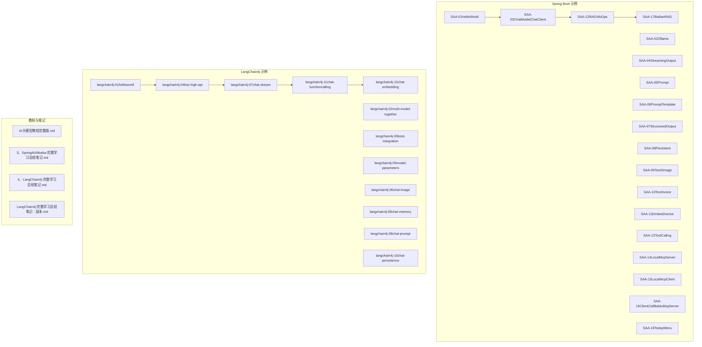
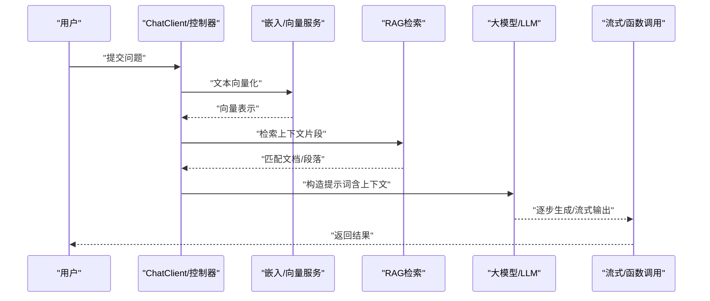
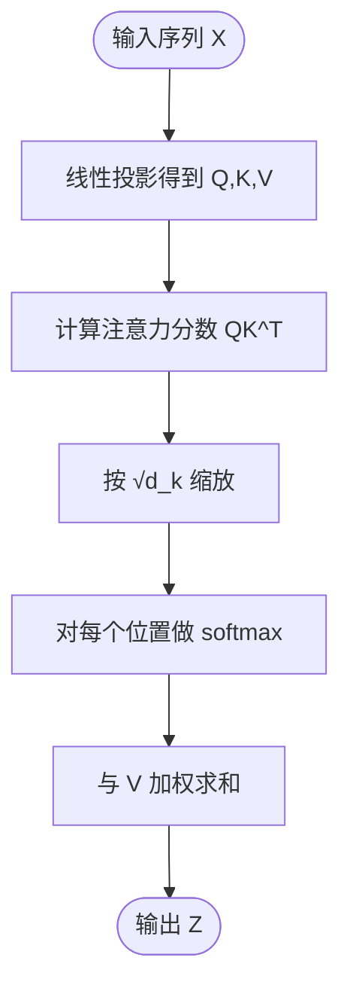
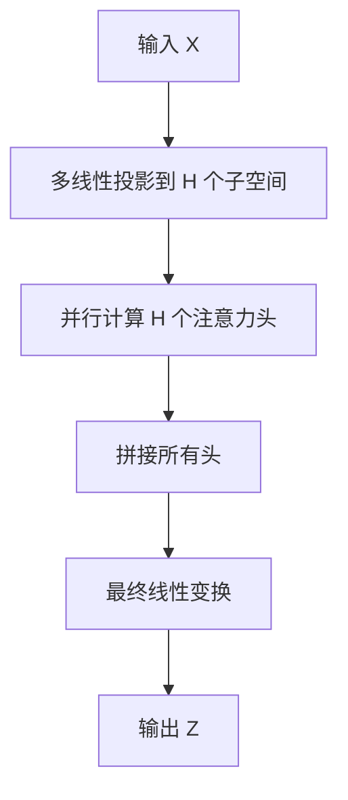
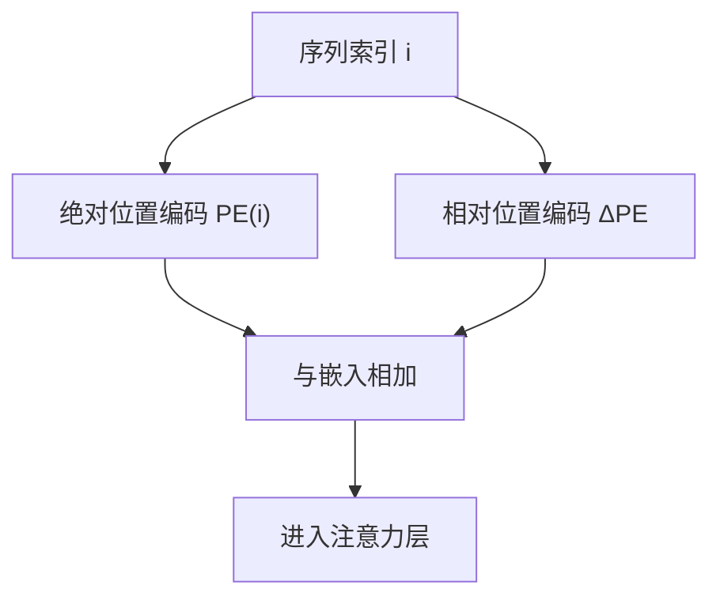
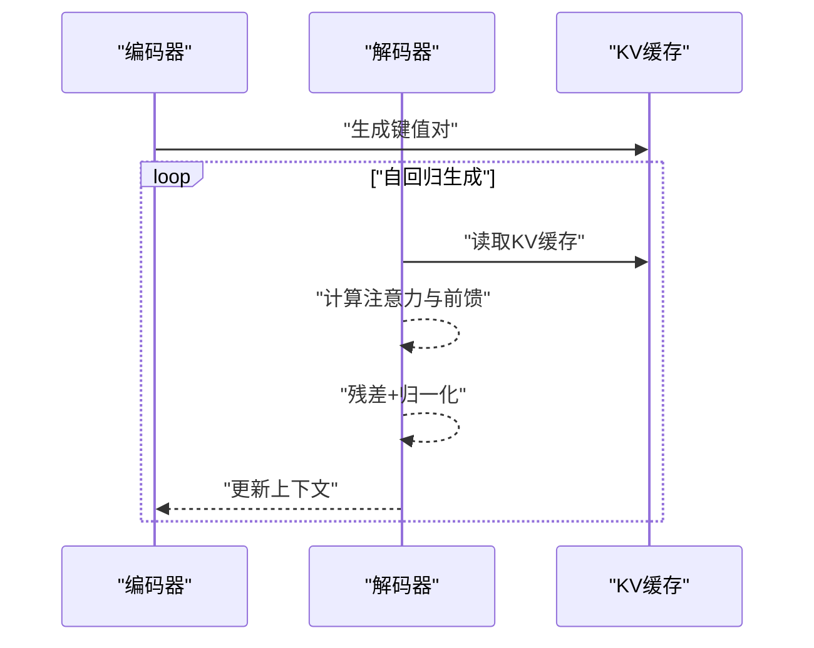
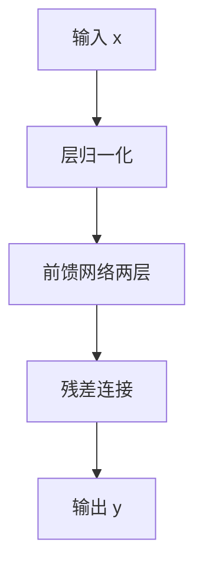
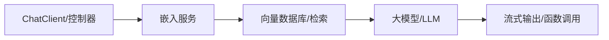

# Transformer架构原理

<cite>
**本文引用的文件**
- [README.md](file://README.md)
- [AI大模型教程完整版.md](file://【0】AI大模型教程（指导手册）/AI大模型教程完整版.md)
- [LangChain4j-完整学习总结笔记.md](file://4、LangChain4j-完整学习总结笔记.md)
- [3、SpringAIAlibaba-完整学习总结笔记.md](file://3、SpringAIAlibaba-完整学习总结笔记.md)
- [LangChain4j-完整学习总结笔记 - 副本.md](file://【2】langchain4j-atguiguV5/LangChain4j-完整学习总结笔记 - 副本.md)
- [LangChain4j-完整学习总结笔记.md](file://【2】langchain4j-atguiguV5/LangChain4j-完整学习总结笔记.md)
- [pom.xml](file://【2】langchain4j-atguiguV5/pom.xml)
- [HelloLangChain4JApp.java](file://【2】langchain4j-atguiguV5/langchain4j-01helloworld/src/main/java/com/atguigu/study/HelloLangChain4JApp.java)
- [MultiModelLangChain4JApp.java](file://【2】langchain4j-atguiguV5/langchain4j-02multi-model-together/src/main/java/com/atguigu/study/MultiModelLangChain4JApp.java)
- [BootIntegrationLangChain4JApp.java](file://【2】langchain4j-atguiguV5/langchain4j-03boot-integration/src/main/java/com/atguigu/study/BootIntegrationLangChain4JApp.java)
- [LowHighApiLangChain4JApp.java](file://【2】langchain4j-atguiguV5/langchain4j-04low-high-api/src/main/java/com/atguigu/study/LowHighApiLangChain4JApp.java)
- [ModelParametersLangChain4JApp.java](file://【2】langchain4j-atguiguV5/langchain4j-05model-parameters/src/main/java/com/atguigu/study/ModelParametersLangChain4JApp.java)
- [ChatImageModelLangChain4JApp.java](file://【2】langchain4j-atguiguV5/langchain4j-06chat-image/src/main/java/com/atguigu/study/ChatImageModelLangChain4JApp.java)
- [ChatStreamLangChain4JApp.java](file://【2】langchain4j-atguiguV5/langchain4j-07chat-stream/src/main/java/com/atguigu/study/ChatStreamLangChain4JApp.java)
- [ChatMemoryLangChain4JApp.java](file://【2】langchain4j-atguiguV5/langchain4j-08chat-memory/src/main/java/com/atguigu/study/ChatMemoryLangChain4JApp.java)
- [ChatPromptLangChain4JApp.java](file://【2】langchain4j-atguiguV5/langchain4j-09chat-prompt/src/main/java/com/atguigu/study/ChatPromptLangChain4JApp.java)
- [ChatPersistenceLangChain4JApp.java](file://【2】langchain4j-atguiguV5/langchain4j-10chat-persistence/src/main/java/com/atguigu/study/ChatPersistenceLangChain4JApp.java)
- [ChatFunctioncallingLangChain4JApp.java](file://【2】langchain4j-atguiguV5/langchain4j-11chat-functioncalling/src/main/java/com/atguigu/study/ChatFunctioncallingLangChain4JApp.java)
- [ChatEmbeddingLangChain4JApp.java](file://【2】langchain4j-atguiguV5/langchain4j-12chat-embedding/src/main/java/com/atguigu/study/ChatEmbeddingLangChain4JApp.java)
- [SAA-01HelloWorldApplication.java](file://【1】SpringAIAlibaba-atguiguV1/SAA-01HelloWorld/src/main/java/com/atguigu/study/Saa01HelloWorldApplication.java)
- [SAA-02OllamaApplication.java](file://【1】SpringAIAlibaba-atguiguV1/SAA-02Ollama/src/main/java/com/atguigu/study/Saa02OllamaApplication.java)
- [SAA-03ChatModelChatClientApplication.java](file://【1】SpringAIAlibaba-atguiguV1/SAA-03ChatModelChatClient/src/main/java/com/atguigu/study/Saa03ChatModelChatClientApplication.java)
- [SAA-04StreamingOutputApplication.java](file://【1】SpringAIAlibaba-atguiguV1/SAA-04StreamingOutput/src/main/java/com/atguigu/study/Saa04StreamingOutputApplication.java)
- [SAA-05PromptApplication.java](file://【1】SpringAIAlibaba-atguiguV1/SAA-05Prompt/src/main/java/com/atguigu/study/Saa05PromptApplication.java)
- [SAA-06PromptTemplateApplication.java](file://【1】SpringAIAlibaba-atguiguV1/SAA-06PromptTemplate/src/main/java/com/atguigu/study/Saa06PromptTemplateApplication.java)
- [SAA-07StructuredOutputApplication.java](file://【1】SpringAIAlibaba-atguiguV1/SAA-07StructuredOutput/src/main/java/com/atguigu/study/Saa07StructuredOutputApplication.java)
- [SAA-08PersistentApplication.java](file://【1】SpringAIAlibaba-atguiguV1/SAA-08Persistent/src/main/java/com/atguigu/study/Saa08PersistentApplication.java)
- [SAA-09Text2imageApplication.java](file://【1】SpringAIAlibaba-atguiguV1/SAA-09Text2image/src/main/java/com/atguigu/study/Saa09Text2imageApplication.java)
- [SAA-10Text2voiceApplication.java](file://【1】SpringAIAlibaba-atguiguV1/SAA-10Text2voice/src/main/java/com/atguigu/study/Saa10Text2voiceApplication.java)
- [SAA-11Embed2vectorApplication.java](file://【1】SpringAIAlibaba-atguiguV1/SAA-11Embed2vector/src/main/java/com/atguigu/study/Saa11Embed2vectorApplication.java)
- [SAA-12RAG4AiOpsApplication.java](file://【1】SpringAIAlibaba-atguiguV1/SAA-12RAG4AiOps/src/main/java/com/atguigu/study/Saa12Rag4AiOpsApplication.java)
- [SAA-13ToolCallingApplication.java](file://【1】SpringAIAlibaba-atguiguV1/SAA-13ToolCalling/src/main/java/com/atguigu/study/Saa13ToolCallingApplication.java)
- [SAA-14LocalMcpServerApplication.java](file://【1】SpringAIAlibaba-atguiguV1/SAA-14LocalMcpServer/src/main/java/com/atguigu/study/Saa14LocalMcpServerApplication.java)
- [SAA-15LocalMcpClientApplication.java](file://【1】SpringAIAlibaba-atguiguV1/SAA-15LocalMcpClient/src/main/java/com/atguigu/study/Saa15LocalMcpClientApplication.java)
- [SAA-16ClientCallBaiduMcpServerApplication.java](file://【1】SpringAIAlibaba-atguiguV1/SAA-16ClientCallBaiduMcpServer/src/main/java/com/atguigu/study/Saa16ClientCallBaiduMcpServerApplication.java)
- [SAA-17BailianRAGApplication.java](file://【1】SpringAIAlibaba-atguiguV1/SAA-17BailianRAG/src/main/java/com/atguigu/study/Saa17BailianRagApplication.java)
- [SAA-18TodayMenuApplication.java](file://【1】SpringAIAlibaba-atguiguV1/SAA-18TodayMenu/src/main/java/com/atguigu/study/Saa18TodayMenuApplication.java)
- [application.properties](file://【1】SpringAIAlibaba-atguiguV1/SAA-01HelloWorld/src/main/resources/application.properties)
- [application.properties](file://【1】SpringAIAlibaba-atguiguV1/SAA-02Ollama/src/main/resources/application.properties)
- [application.properties](file://【1】SpringAIAlibaba-atguiguV1/SAA-03ChatModelChatClient/src/main/resources/application.properties)
- [application.properties](file://【1】SpringAIAlibaba-atguiguV1/SAA-04StreamingOutput/src/main/resources/application.properties)
- [application.properties](file://【1】SpringAIAlibaba-atguiguV1/SAA-05Prompt/src/main/resources/application.properties)
- [application.properties](file://【1】SpringAIAlibaba-atguiguV1/SAA-06PromptTemplate/src/main/resources/application.properties)
- [application.properties](file://【1】SpringAIAlibaba-atguiguV1/SAA-07StructuredOutput/src/main/resources/application.properties)
- [application.properties](file://【1】SpringAIAlibaba-atguiguV1/SAA-08Persistent/src/main/resources/application.properties)
- [application.properties](file://【1】SpringAIAlibaba-atguiguV1/SAA-09Text2image/src/main/resources/application.properties)
- [application.properties](file://【1】SpringAIAlibaba-atguiguV1/SAA-10Text2voice/src/main/resources/application.properties)
- [application.properties](file://【1】SpringAIAlibaba-atguiguV1/SAA-11Embed2vector/src/main/resources/application.properties)
- [application.properties](file://【1】SpringAIAlibaba-atguiguV1/SAA-12RAG4AiOps/src/main/resources/application.properties)
- [application.properties](file://【1】SpringAIAlibaba-atguiguV1/SAA-13ToolCalling/src/main/resources/application.properties)
- [application.properties](file://【1】SpringAIAlibaba-atguiguV1/SAA-14LocalMcpServer/src/main/resources/application.properties)
- [application.properties](file://【1】SpringAIAlibaba-atguiguV1/SAA-15LocalMcpClient/src/main/resources/application.properties)
- [application.properties](file://【1】SpringAIAlibaba-atguiguV1/SAA-16ClientCallBaiduMcpServer/src/main/resources/application.properties)
- [application.properties](file://【1】SpringAIAlibaba-atguiguV1/SAA-17BailianRAG/src/main/resources/application.properties)
- [application.properties](file://【1】SpringAIAlibaba-atguiguV1/SAA-18TodayMenu/src/main/resources/application.properties)
</cite>

## 目录
1. [引言](#引言)
2. [项目结构](#项目结构)
3. [核心组件](#核心组件)
4. [架构总览](#架构总览)
5. [详细组件分析](#详细组件分析)
6. [依赖分析](#依赖分析)
7. [性能考虑](#性能考虑)
8. [故障排查指南](#故障排查指南)
9. [结论](#结论)
10. [附录](#附录)

## 引言
本文件围绕Transformer架构的核心理念进行系统化技术解读，重点涵盖以下方面：
- 自注意力机制（Attention Mechanism）的工作原理与数学表达
- 多头注意力（Multi-Head Attention）的设计思想与并行处理策略
- 位置编码（Positional Encoding）在序列建模中的作用与实现思路
- Encoder-Decoder 架构的组成、层功能与数据流
- 前馈神经网络、残差连接、层归一化等关键组件
- 结合仓库中现有Spring Boot与LangChain4j示例，给出可参考的工程化集成路径与最佳实践

尽管当前仓库未直接包含纯Python或原生实现的Transformer代码，但通过Spring Boot与LangChain4j示例，可以清晰地映射到Transformer的关键模块：嵌入（Embedding）、注意力（Attention）、前馈（Feed-Forward）、残差与归一化（Residual & LayerNorm），以及RAG、流式输出、函数调用等工程化能力。

## 项目结构
该仓库由三大板块构成：
- SpringAIAlibaba-atguiguV1：以Spring Boot为基础的大模型应用示例集合，覆盖从基础调用到RAG、工具调用、本地MCP服务/客户端等场景
- langchain4j-atguiguV5：LangChain4j生态的系列示例，涵盖低/高层API、流式输出、内存、提示词、持久化、函数调用、嵌入等
- 教程与笔记：系统化的AI大模型学习材料与LangChain4j、Spring AI的学习笔记

下图展示了与Transformer相关的关键模块在工程中的映射关系：

**图表来源**
- [SAA-01HelloWorldApplication.java](file://【1】SpringAIAlibaba-atguiguV1/SAA-01HelloWorld/src/main/java/com/atguigu/study/Saa01HelloWorldApplication.java)
- [SAA-03ChatModelChatClientApplication.java](file://【1】SpringAIAlibaba-atguiguV1/SAA-03ChatModelChatClient/src/main/java/com/atguigu/study/Saa03ChatModelChatClientApplication.java)
- [SAA-12RAG4AiOpsApplication.java](file://【1】SpringAIAlibaba-atguiguV1/SAA-12RAG4AiOps/src/main/java/com/atguigu/study/Saa12Rag4AiOpsApplication.java)
- [SAA-17BailianRAGApplication.java](file://【1】SpringAIAlibaba-atguiguV1/SAA-17BailianRAG/src/main/java/com/atguigu/study/Saa17BailianRagApplication.java)
- [ChatStreamLangChain4JApp.java](file://【2】langchain4j-atguiguV5/langchain4j-07chat-stream/src/main/java/com/atguigu/study/ChatStreamLangChain4JApp.java)
- [ChatFunctioncallingLangChain4JApp.java](file://【2】langchain4j-atguiguV5/langchain4j-11chat-functioncalling/src/main/java/com/atguigu/study/ChatFunctioncallingLangChain4JApp.java)
- [ChatEmbeddingLangChain4JApp.java](file://【2】langchain4j-atguiguV5/langchain4j-12chat-embedding/src/main/java/com/atguigu/study/ChatEmbeddingLangChain4JApp.java)

**章节来源**
- [README.md](file://README.md)
- [AI大模型教程完整版.md](file://【0】AI大模型教程（指导手册）/AI大模型教程完整版.md)

## 核心组件
本节从Transformer的视角拆解核心组件，并在工程中定位其对应实现点：

- 嵌入（Embedding）
  - 将离散符号（如词/子词/字符）映射为稠密向量表示
  - 在LangChain4j示例中体现为“嵌入”模块与向量存储/检索链路
  - 在Spring Boot示例中体现为文本向量化与RAG检索

- 位置编码（Positional Encoding）
  - 为序列元素引入顺序信息，使模型具备对位置敏感的能力
  - 在工程中可通过“提示词/模板”与“上下文管理”间接体现位置感知

- 注意力（Attention）
  - 计算查询（Query）与键（Key）、值（Value）之间的加权聚合
  - 多头注意力将投影空间分解为多个子空间，提升并行表达能力
  - 在LangChain4j流式输出与函数调用中体现为“上下文窗口”与“逐步生成”的注意力式选择

- 前馈网络（Feed-Forward Network）
  - 每个位置独立的两层全连接网络，常配合激活函数与线性变换
  - 在工程中体现为“后处理/解码器前的非线性变换”

- 残差连接与层归一化（Residual & LayerNorm）
  - 改善梯度流动与训练稳定性，广泛用于Transformer块内部
  - 在工程中体现为“模块封装”与“归一化层”的组合使用

- 编码器-解码器（Encoder-Decoder）
  - 编码器负责输入序列的表征；解码器在自回归方式下逐步生成输出
  - 在LangChain4j与Spring Boot示例中分别体现为“RAG检索增强”与“流式输出/函数调用”

**章节来源**
- [LangChain4j-完整学习总结笔记.md](file://4、LangChain4j-完整学习总结笔记.md)
- [LangChain4j-完整学习总结笔记 - 副本.md](file://【2】langchain4j-atguiguV5/LangChain4j-完整学习总结笔记 - 副本.md)
- [3、SpringAIAlibaba-完整学习总结笔记.md](file://3、SpringAIAlibaba-完整学习总结笔记.md)

## 架构总览
下图展示了从“输入文本”到“生成结果”的典型Transformer路径，映射到仓库中的示例模块：

**图表来源**
- [SAA-03ChatModelChatClientApplication.java](file://【1】SpringAIAlibaba-atguiguV1/SAA-03ChatModelChatClient/src/main/java/com/atguigu/study/Saa03ChatModelChatClientApplication.java)
- [SAA-12RAG4AiOpsApplication.java](file://【1】SpringAIAlibaba-atguiguV1/SAA-12RAG4AiOps/src/main/java/com/atguigu/study/Saa12Rag4AiOpsApplication.java)
- [SAA-17BailianRAGApplication.java](file://【1】SpringAIAlibaba-atguiguV1/SAA-17BailianRAG/src/main/java/com/atguigu/study/Saa17BailianRagApplication.java)
- [ChatStreamLangChain4JApp.java](file://【2】langchain4j-atguiguV5/langchain4j-07chat-stream/src/main/java/com/atguigu/study/ChatStreamLangChain4JApp.java)
- [ChatFunctioncallingLangChain4JApp.java](file://【2】langchain4j-atguiguV5/langchain4j-11chat-functioncalling/src/main/java/com/atguigu/study/ChatFunctioncallingLangChain4JApp.java)
- [ChatEmbeddingLangChain4JApp.java](file://【2】langchain4j-atguiguV5/langchain4j-12chat-embedding/src/main/java/com/atguigu/study/ChatEmbeddingLangChain4JApp.java)

## 详细组件分析

### 自注意力机制（Self-Attention）
- 数学要点
  - 计算查询（Q）、键（K）、值（V）矩阵
  - 归一化点积注意力：softmax((QK^T)/√d_k)·V
  - 输出为加权求和，体现元素间的全局依赖关系
- 工程映射
  - 在LangChain4j中，注意力体现在“上下文窗口”与“逐步生成”的权重分配
  - 在Spring Boot示例中，注意力可类比为“检索阶段对上下文片段的加权选择”
- 关键实现线索
  - 流式输出与函数调用示例展示了“逐步选择/过滤”的注意力式行为

**图表来源**
- [ChatStreamLangChain4JApp.java](file://【2】langchain4j-atguiguV5/langchain4j-07chat-stream/src/main/java/com/atguigu/study/ChatStreamLangChain4JApp.java)
- [ChatFunctioncallingLangChain4JApp.java](file://【2】langchain4j-atguiguV5/langchain4j-11chat-functioncalling/src/main/java/com/atguigu/study/ChatFunctioncallingLangChain4JApp.java)

**章节来源**
- [LangChain4j-完整学习总结笔记.md](file://4、LangChain4j-完整学习总结笔记.md)
- [LangChain4j-完整学习总结笔记 - 副本.md](file://【2】langchain4j-atguiguV5/LangChain4j-完整学习总结笔记 - 副本.md)

### 多头注意力（Multi-Head Attention）
- 设计思想
  - 将维度投影到多个子空间，分别计算注意力，再拼接并线性变换
  - 并行捕获不同子空间的语义关系，提升表达能力
- 工程映射
  - 在LangChain4j中，多头注意力可类比为“多路检索/多源融合”的检索策略
  - 在Spring Boot示例中，体现为“多来源上下文”的融合与排序
- 关键实现线索
  - RAG检索与嵌入向量的多路匹配，体现多头式的并行选择

**图表来源**
- [SAA-12RAG4AiOpsApplication.java](file://【1】SpringAIAlibaba-atguiguV1/SAA-12RAG4AiOps/src/main/java/com/atguigu/study/Saa12Rag4AiOpsApplication.java)
- [SAA-17BailianRAGApplication.java](file://【1】SpringAIAlibaba-atguiguV1/SAA-17BailianRAG/src/main/java/com/atguigu/study/Saa17BailianRagApplication.java)
- [ChatEmbeddingLangChain4JApp.java](file://【2】langchain4j-atguiguV5/langchain4j-12chat-embedding/src/main/java/com/atguigu/study/ChatEmbeddingLangChain4JApp.java)

**章节来源**
- [3、SpringAIAlibaba-完整学习总结笔记.md](file://3、SpringAIAlibaba-完整学习总结笔记.md)
- [LangChain4j-完整学习总结笔记 - 副本.md](file://【2】langchain4j-atguiguV5/LangChain4j-完整学习总结笔记 - 副本.md)

### 位置编码（Positional Encoding）
- 作用机制
  - 为序列元素注入绝对或相对位置信息，使模型具备顺序敏感性
  - 绝对位置编码通常采用正弦/余弦函数；相对位置编码则关注相对距离
- 工程映射
  - 在提示词模板与上下文管理中，通过“上下文窗口”与“位置标记”实现位置感知
  - 在流式输出中，逐步追加上下文，形成自然的位置演进
- 关键实现线索
  - 提示词构建与上下文截断/扩展体现了位置信息的组织

**图表来源**
- [SAA-05PromptApplication.java](file://【1】SpringAIAlibaba-atguiguV1/SAA-05Prompt/src/main/java/com/atguigu/study/Saa05PromptApplication.java)
- [SAA-06PromptTemplateApplication.java](file://【1】SpringAIAlibaba-atguiguV1/SAA-06PromptTemplate/src/main/java/com/atguigu/study/Saa06PromptTemplateApplication.java)
- [ChatStreamLangChain4JApp.java](file://【2】langchain4j-atguiguV5/langchain4j-07chat-stream/src/main/java/com/atguigu/study/ChatStreamLangChain4JApp.java)

**章节来源**
- [3、SpringAIAlibaba-完整学习总结笔记.md](file://3、SpringAIAlibaba-完整学习总结笔记.md)
- [LangChain4j-完整学习总结笔记.md](file://4、LangChain4j-完整学习总结笔记.md)

### 编码器-解码器架构（Encoder-Decoder）
- 组成与功能
  - 编码器：对输入序列进行表征，捕捉全局依赖
  - 解码器：在自回归方式下，结合已生成部分与编码器输出逐步生成
- 数据流
  - 编码器输出作为解码器的KV缓存，实现跨序列注意力
- 工程映射
  - 在Spring Boot示例中，RAG流程体现“编码器（检索）+ 解码器（生成）”的分治
  - 在LangChain4j示例中，流式输出与函数调用体现了解码器的逐步决策

**图表来源**
- [SAA-12RAG4AiOpsApplication.java](file://【1】SpringAIAlibaba-atguiguV1/SAA-12RAG4AiOps/src/main/java/com/atguigu/study/Saa12Rag4AiOpsApplication.java)
- [ChatStreamLangChain4JApp.java](file://【2】langchain4j-atguiguV5/langchain4j-07chat-stream/src/main/java/com/atguigu/study/ChatStreamLangChain4JApp.java)

**章节来源**
- [3、SpringAIAlibaba-完整学习总结笔记.md](file://3、SpringAIAlibaba-完整学习总结笔记.md)
- [LangChain4j-完整学习总结笔记.md](file://4、LangChain4j-完整学习总结笔记.md)

### 前馈神经网络、残差连接与层归一化
- 前馈网络
  - 两层全连接+激活，对每个位置独立处理
- 残差连接与层归一化
  - 改善梯度稳定性和收敛速度，广泛用于Transformer块内部
- 工程映射
  - 在LangChain4j与Spring Boot示例中，这些组件体现为“模块化封装”与“归一化层”的组合使用

**图表来源**
- [ChatEmbeddingLangChain4JApp.java](file://【2】langchain4j-atguiguV5/langchain4j-12chat-embedding/src/main/java/com/atguigu/study/ChatEmbeddingLangChain4JApp.java)
- [SAA-03ChatModelChatClientApplication.java](file://【1】SpringAIAlibaba-atguiguV1/SAA-03ChatModelChatClient/src/main/java/com/atguigu/study/Saa03ChatModelChatClientApplication.java)

**章节来源**
- [LangChain4j-完整学习总结笔记.md](file://4、LangChain4j-完整学习总结笔记.md)
- [3、SpringAIAlibaba-完整学习总结笔记.md](file://3、SpringAIAlibaba-完整学习总结笔记.md)

## 依赖分析
- 模块耦合
  - ChatClient/控制器与嵌入服务之间存在依赖；嵌入服务与向量数据库/检索服务耦合
  - RAG模块与检索模块强耦合，体现“编码器-解码器”的分治思想
- 外部依赖
  - LangChain4j生态提供了高层抽象与低层API，便于在Spring Boot中集成
  - 示例模块间通过“提示词/模板”与“流式输出”形成清晰的数据流

**图表来源**
- [SAA-03ChatModelChatClientApplication.java](file://【1】SpringAIAlibaba-atguiguV1/SAA-03ChatModelChatClient/src/main/java/com/atguigu/study/Saa03ChatModelChatClientApplication.java)
- [SAA-12RAG4AiOpsApplication.java](file://【1】SpringAIAlibaba-atguiguV1/SAA-12RAG4AiOps/src/main/java/com/atguigu/study/Saa12Rag4AiOpsApplication.java)
- [ChatStreamLangChain4JApp.java](file://【2】langchain4j-atguiguV5/langchain4j-07chat-stream/src/main/java/com/atguigu/study/ChatStreamLangChain4JApp.java)

**章节来源**
- [pom.xml](file://【2】langchain4j-atguiguV5/pom.xml)
- [3、SpringAIAlibaba-完整学习总结笔记.md](file://3、SpringAIAlibaba-完整学习总结笔记.md)

## 性能考虑
- 上下文长度与窗口管理
  - 控制提示词长度，避免超出模型上下文限制
- 向量化与检索效率
  - 优化嵌入维度与索引策略，减少检索延迟
- 流式输出与并发
  - 利用LangChain4j的流式API降低首字延迟，提升用户体验
- 资源与成本
  - 合理设置批大小与并发度，平衡吞吐与延迟

## 故障排查指南
- 提示词过长导致截断
  - 检查上下文窗口与截断策略，必要时启用分段检索
- 向量检索命中率低
  - 调整嵌入维度、相似度阈值与检索Top-K
- 流式输出异常
  - 检查网络与超时配置，确保客户端正确消费流式事件
- 函数调用失败
  - 校验工具定义与参数格式，确认回调处理逻辑

**章节来源**
- [ChatStreamLangChain4JApp.java](file://【2】langchain4j-atguiguV5/langchain4j-07chat-stream/src/main/java/com/atguigu/study/ChatStreamLangChain4JApp.java)
- [ChatFunctioncallingLangChain4JApp.java](file://【2】langchain4j-atguiguV5/langchain4j-11chat-functioncalling/src/main/java/com/atguigu/study/ChatFunctioncallingLangChain4JApp.java)
- [SAA-12RAG4AiOpsApplication.java](file://【1】SpringAIAlibaba-atguiguV1/SAA-12RAG4AiOps/src/main/java/com/atguigu/study/Saa12Rag4AiOpsApplication.java)

## 结论
本文件从Transformer的核心理念出发，结合仓库中的Spring Boot与LangChain4j示例，系统梳理了嵌入、注意力、位置编码、前馈网络、残差与层归一化、编码器-解码器等关键组件，并给出了工程化落地的路径与最佳实践。尽管仓库未直接提供纯实现代码，但通过模块化与数据流映射，读者仍可深入理解Transformer的设计思想与实现要点。

## 附录
- 进一步阅读建议
  - 结合教程与笔记，系统掌握提示词工程、RAG、流式输出与函数调用等高级主题
- 示例模块速览
  - Spring Boot：HelloWorld、Ollama、ChatClient、StreamingOutput、Prompt、PromptTemplate、StructuredOutput、Persistent、Text2image、Text2voice、Embed2vector、RAG4AiOps、ToolCalling、LocalMCP、ClientCallBaiduMCP、BailianRAG、TodayMenu
  - LangChain4j：helloworld、multi-model、boot-integration、low-high-api、model-parameters、chat-image、chat-stream、chat-memory、chat-prompt、chat-persistence、chat-functioncalling、chat-embedding