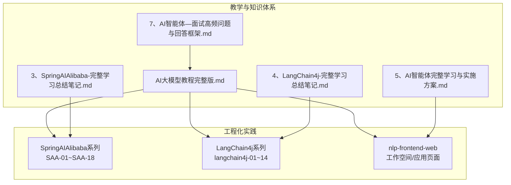
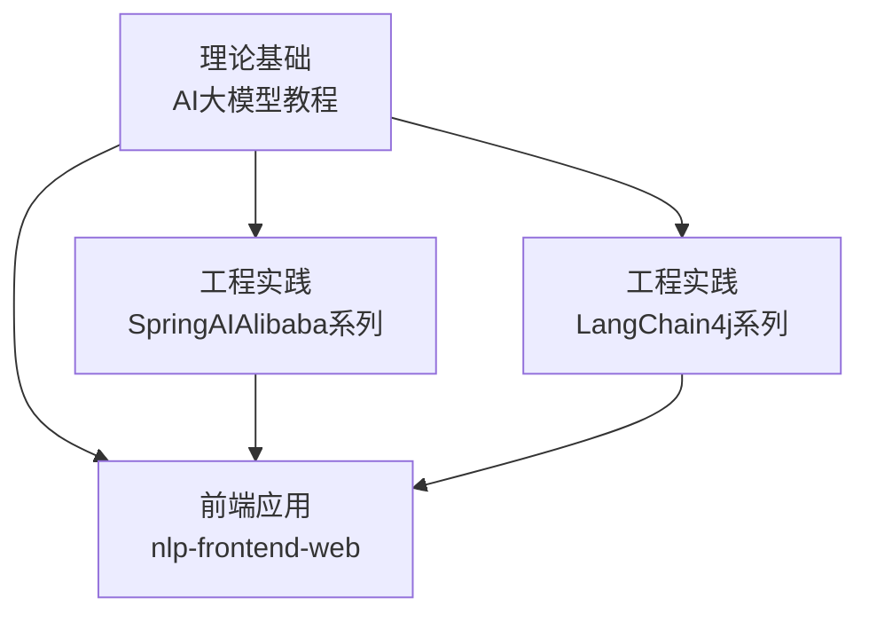
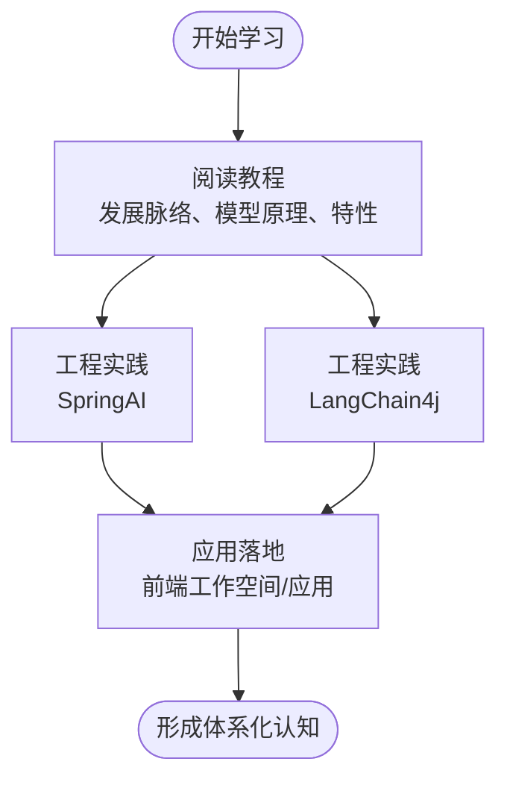
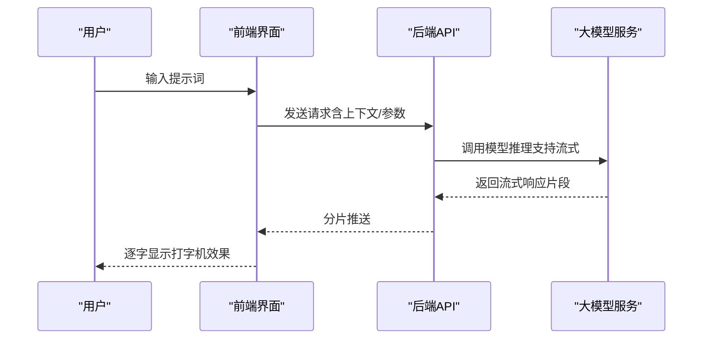
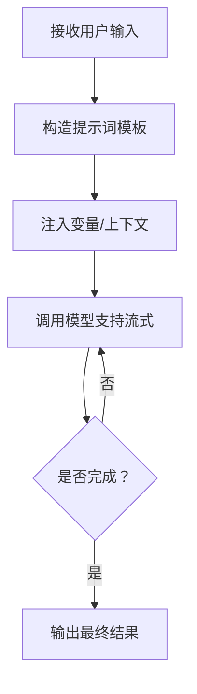
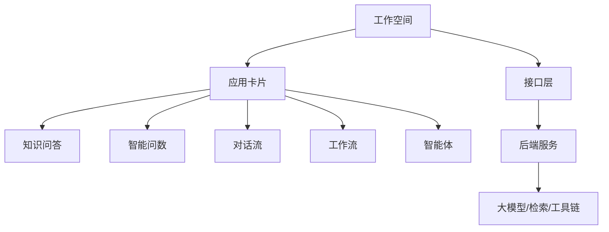
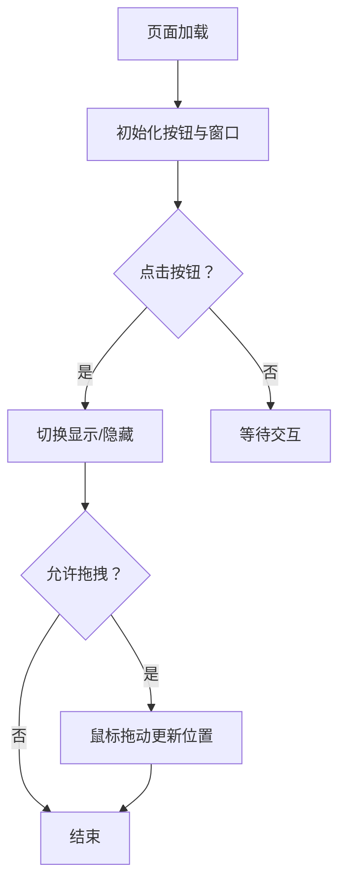

# 大模型基础理论

<cite>
**本文引用的文件**
- [AI大模型教程完整版.md](file://【0】AI大模型教程（指导手册）/AI大模型教程完整版.md)
- [3、SpringAIAlibaba-完整学习总结笔记.md](file://3、SpringAIAlibaba-完整学习总结笔记.md)
- [4、LangChain4j-完整学习总结笔记.md](file://4、LangChain4j-完整学习总结笔记.md)
- [5、AI智能体完整学习与实施方案.md](file://5、AI智能体完整学习与实施方案.md)
- [7、AI智能体—面试高频问题与回答框架.md](file://7、AI智能体—面试高频问题与回答框架.md)
- [index.vue](file://【3】工作资料/code/仓颉智能体/nlp-frontend-web/src/views/workspace/pages/workApps/index.vue)
- [index.vue](file://【3】工作资料/code/仓颉智能体/nlp-frontend-web/src/views/workspace/pages/workApps/pages/index.vue)
- [interfaceData.ts](file://【3】工作资料/code/仓颉智能体/nlp-frontend-web/src/views/workspace/interfaceData.ts)
- [iframe.js](file://【3】工作资料/code/仓颉智能体/nlp-frontend-web/public/iframe.js)
</cite>

## 目录
1. [引言](#引言)
2. [项目结构](#项目结构)
3. [核心组件](#核心组件)
4. [架构总览](#架构总览)
5. [详细组件分析](#详细组件分析)
6. [依赖分析](#依赖分析)
7. [性能考虑](#性能考虑)
8. [故障排查指南](#故障排查指南)
9. [结论](#结论)
10. [附录](#附录)

## 引言
本文件面向希望系统掌握“大模型基础理论”的读者，围绕以下目标展开：梳理从机器学习到深度学习再到大模型时代的演进；深入讲解Transformer、BERT、GPT等关键架构；阐释大模型的核心特性（通用性强、少样本/零样本能力、可拓展性、多模态能力等）；讨论大模型与AGI的关系及AIGC的应用场景；并结合仓库中的教学与工程实践材料，构建从基础概念到前沿技术的完整知识体系。

## 项目结构
该仓库包含三类与大模型学习密切相关的资源：
- 教学与知识体系：【0】AI大模型教程（指导手册）、3、4、5、7号学习笔记
- 工程化实践：SpringAIAlibaba系列、LangChain4j系列、仓颉智能体前端工程
- 智能体与应用：工作资料中的智能体应用类型与前端界面

下图给出与“大模型基础理论”相关的知识与工程资源的组织关系概览：

**章节来源**
- [AI大模型教程完整版.md:120-250](file://【0】AI大模型教程（指导手册）/AI大模型教程完整版.md#L120-L250)
- [3、SpringAIAlibaba-完整学习总结笔记.md:460-500](file://3、SpringAIAlibaba-完整学习总结笔记.md#L460-L500)
- [4、LangChain4j-完整学习总结笔记.md:4050-4510](file://4、LangChain4j-完整学习总结笔记.md#L4050-L4510)

## 核心组件
本节从“理论-实践-应用”三个维度提炼核心知识点，帮助读者建立系统认知。

- 发展脉络与时代划分
  - 机器学习 → 深度学习 → 大模型 → 智能体 → AGI
  - 关键节点：CNN、RNN、LSTM、Transformer、GPT、BERT、扩散模型、多模态
  - 参考：[AI大模型教程完整版.md:120-250](file://【0】AI大模型教程（指导手册）/AI大模型教程完整版.md#L120-L250)

- 架构与模型
  - Transformer：自注意力、编码器-解码器、并行化优势
  - BERT：双向编码、MLM预训练、适合理解类任务
  - GPT：自回归语言建模、单向解码器、适合生成类任务
  - 参考：[AI大模型教程完整版.md:120-250](file://【0】AI大模型教程（指导手册）/AI大模型教程完整版.md#L120-L250)

- 大模型核心特性
  - 通用性强：跨领域迁移能力强
  - Few-shot/Zeroshot：少量示例或无示例即能泛化
  - 可拓展性：参数规模增长带来性能提升
  - 多模态能力：文本、图像、音频、视频统一建模
  - 参考：[AI大模型教程完整版.md:200-240](file://【0】AI大模型教程（指导手册）/AI大模型教程完整版.md#L200-L240)

- 大模型与AGI
  - AGI定义：能像人一样通用地理解世界和解决问题
  - 关系：大模型是迈向AGI的重要阶段，智能体与AIGC是关键桥梁
  - 参考：[AI大模型教程完整版.md:216-245](file://【0】AI大模型教程（指导手册）/AI大模型教程完整版.md#L216-L245)

- AIGC与应用场景
  - AIGC：由AI生成内容（文本、图像、音视频）
  - 应用：智能问答、创作辅助、多模态交互、RAG增强检索
  - 参考：[AI大模型教程完整版.md:200-240](file://【0】AI大模型教程（指导手册）/AI大模型教程完整版.md#L200-L240)

**章节来源**
- [AI大模型教程完整版.md:120-250](file://【0】AI大模型教程（指导手册）/AI大模型教程完整版.md#L120-L250)
- [AI大模型教程完整版.md:200-240](file://【0】AI大模型教程（指导手册）/AI大模型教程完整版.md#L200-L240)
- [AI大模型教程完整版.md:216-245](file://【0】AI大模型教程（指导手册）/AI大模型教程完整版.md#L216-L245)

## 架构总览
下图展示“理论-工程-应用”的整体架构映射：教学与知识体系提供理论基础，工程实践（SpringAI、LangChain4j）验证与落地，前端应用承载业务形态（工作空间、应用类型、RAG/工具链集成）。

**图表来源**
- [AI大模型教程完整版.md:120-250](file://【0】AI大模型教程（指导手册）/AI大模型教程完整版.md#L120-L250)
- [3、SpringAIAlibaba-完整学习总结笔记.md:460-500](file://3、SpringAIAlibaba-完整学习总结笔记.md#L460-L500)
- [4、LangChain4j-完整学习总结笔记.md:4050-4510](file://4、LangChain4j-完整学习总结笔记.md#L4050-L4510)

## 详细组件分析

### 组件A：教学与知识体系（理论基石）
- 内容要点
  - 时代演进：机器学习 → 深度学习 → 大模型 → AGI
  - 关键模型：Transformer、BERT、GPT、扩散模型、多模态
  - 特性总结：通用性、Few-shot/Zeroshot、可拓展性、多模态
  - 关系与应用：大模型与AGI、AIGC与RAG
- 学习建议
  - 先通读教程，再结合工程实践加深理解
  - 重点理解Transformer的自注意力机制与并行化优势

**章节来源**
- [AI大模型教程完整版.md:120-250](file://【0】AI大模型教程（指导手册）/AI大模型教程完整版.md#L120-L250)
- [AI大模型教程完整版.md:200-240](file://【0】AI大模型教程（指导手册）/AI大模型教程完整版.md#L200-L240)
- [AI大模型教程完整版.md:216-245](file://【0】AI大模型教程（指导手册）/AI大模型教程完整版.md#L216-L245)

### 组件B：SpringAIAlibaba系列（工程化验证）
- 能力体现
  - 流式输出：类似ChatGPT的打字机效果
  - 多模型共存：在同一系统内管理不同模型
  - RAG与工具调用：检索增强与外部工具集成
- 实践价值
  - 将理论（如Transformer、GPT）转化为可运行的对话服务
  - 通过流式输出体验“少样本/零样本”的交互体验

**章节来源**
- [3、SpringAIAlibaba-完整学习总结笔记.md:460-500](file://3、SpringAIAlibaba-完整学习总结笔记.md#L460-L500)
- [3、SpringAIAlibaba-完整学习总结笔记.md:470-490](file://3、SpringAIAlibaba-完整学习总结笔记.md#L470-L490)

### 组件C：LangChain4j系列（提示词工程与链式编排）
- 能力体现
  - 提示词工程：结构化提示、模板化提示
  - 链式编排：多步推理、条件分支、错误恢复
  - 流式输出：与SpringAI一致的交互体验
- 实践价值
  - 将“少样本/零样本”能力工程化，通过提示词与链路设计提升稳定性与可控性

**章节来源**
- [4、LangChain4j-完整学习总结笔记.md:4060-4510](file://4、LangChain4j-完整学习总结笔记.md#L4060-L4510)

### 组件D：前端工作空间与应用（业务形态承载）
- 功能概览
  - 工作空间：项目/应用的容器与权限管理
  - 应用类型：知识问答、智能问数、对话流、工作流、智能体等
  - 接口与交互：列表查询、详情加载、版本切换、RAG配置
- 价值
  - 将大模型能力以“应用”的形式呈现，便于团队协作与产品化

**图表来源**
- [index.vue:169-177](file://【3】工作资料/code/仓颉智能体/nlp-frontend-web/src/views/workspace/pages/workApps/index.vue#L169-L177)
- [index.vue:349-353](file://【3】工作资料/code/仓颉智能体/nlp-frontend-web/src/views/workspace/pages/workApps/pages/index.vue#L349-L353)
- [interfaceData.ts:7-22](file://【3】工作资料/code/仓颉智能体/nlp-frontend-web/src/views/workspace/interfaceData.ts#L7-L22)

**章节来源**
- [index.vue:154-221](file://【3】工作资料/code/仓颉智能体/nlp-frontend-web/src/views/workspace/pages/workApps/index.vue#L154-L221)
- [index.vue:249-370](file://【3】工作资料/code/仓颉智能体/nlp-frontend-web/src/views/workspace/pages/workApps/pages/index.vue#L249-L370)
- [interfaceData.ts:1-54](file://【3】工作资料/code/仓颉智能体/nlp-frontend-web/src/views/workspace/interfaceData.ts#L1-L54)

### 组件E：嵌入式聊天窗口（AIGC入口）
- 能力概览
  - 基于iframe的嵌入式聊天机器人
  - 支持拖拽、尺寸定制、默认打开/关闭
- 价值
  - 作为AIGC的前端入口，降低集成门槛，提升用户体验

**章节来源**
- [iframe.js:1-168](file://【3】工作资料/code/仓颉智能体/nlp-frontend-web/public/iframe.js#L1-L168)

## 依赖分析
- 理论对实践的依赖
  - 教程提供模型原理与特性，工程实践（SpringAI/LangChain4j）验证这些原理在真实系统中的表现
- 实践对应用的依赖
  - 工程实践的结果通过前端应用对外呈现，形成闭环
- 数据与接口
  - 前端通过接口层访问后端，后端对接大模型/检索/工具链

**图表来源**
- [AI大模型教程完整版.md:120-250](file://【0】AI大模型教程（指导手册）/AI大模型教程完整版.md#L120-L250)
- [3、SpringAIAlibaba-完整学习总结笔记.md:460-500](file://3、SpringAIAlibaba-完整学习总结笔记.md#L460-L500)
- [4、LangChain4j-完整学习总结笔记.md:4060-4510](file://4、LangChain4j-完整学习总结笔记.md#L4060-L4510)
- [interfaceData.ts:1-54](file://【3】工作资料/code/仓颉智能体/nlp-frontend-web/src/views/workspace/interfaceData.ts#L1-L54)

**章节来源**
- [interfaceData.ts:1-54](file://【3】工作资料/code/仓颉智能体/nlp-frontend-web/src/views/workspace/interfaceData.ts#L1-L54)

## 性能考虑
- 计算与内存
  - 大模型参数规模与显存占用呈正相关，需合理设置批大小与序列长度
- 推理效率
  - 采用KV缓存、分页生成、流式输出减少首 Token 延迟
- 网络与接口
  - 前端与后端接口的超时与重试策略，避免长连接阻塞
- 多模态与RAG
  - 向量化与检索的性能瓶颈通常出现在向量库与索引构建上，需关注倒排/FAISS等优化手段

[本节为通用性能建议，不直接分析具体文件]

## 故障排查指南
- 前端应用异常
  - 检查路由参数与工作空间ID是否正确传递
  - 观察版本切换与历史记录加载流程是否成功
- 接口调用失败
  - 核对后端服务地址与鉴权头
  - 关注流式输出中断或超时问题
- 大模型推理异常
  - 检查提示词长度、上下文截断与Token上限
  - 确认工具调用与RAG检索链路的可用性

**章节来源**
- [index.vue:197-204](file://【3】工作资料/code/仓颉智能体/nlp-frontend-web/src/views/workspace/pages/workApps/index.vue#L197-L204)
- [index.vue:340-370](file://【3】工作资料/code/仓颉智能体/nlp-frontend-web/src/views/workspace/pages/workApps/pages/index.vue#L340-L370)
- [interfaceData.ts:24-54](file://【3】工作资料/code/仓颉智能体/nlp-frontend-web/src/views/workspace/interfaceData.ts#L24-L54)

## 结论
通过“理论-实践-应用”的一体化学习路径，可以系统掌握大模型基础理论，并将其转化为可运行的工程能力与产品形态。建议读者先以教程建立扎实的理论基础，再结合SpringAI与LangChain4j进行工程实践，最后通过前端工作空间与嵌入式聊天窗口完成产品化落地。

[本节为总结性内容，不直接分析具体文件]

## 附录
- 相关学习笔记与教程
  - [AI大模型教程完整版.md](file://【0】AI大模型教程（指导手册）/AI大模型教程完整版.md)
  - [3、SpringAIAlibaba-完整学习总结笔记.md](file://3、SpringAIAlibaba-完整学习总结笔记.md)
  - [4、LangChain4j-完整学习总结笔记.md](file://4、LangChain4j-完整学习总结笔记.md)
  - [5、AI智能体完整学习与实施方案.md](file://5、AI智能体完整学习与实施方案.md)
  - [7、AI智能体—面试高频问题与回答框架.md](file://7、AI智能体—面试高频问题与回答框架.md)

[本节为补充材料索引，不直接分析具体文件]