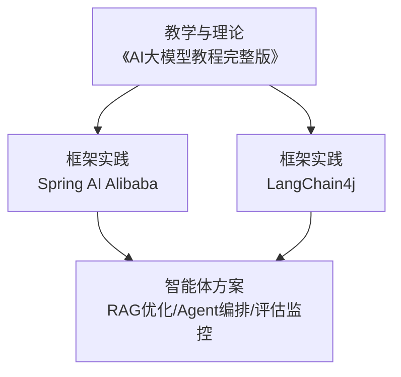
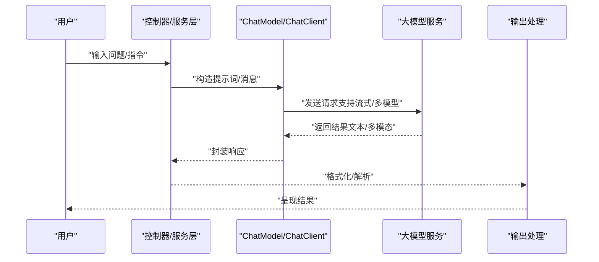
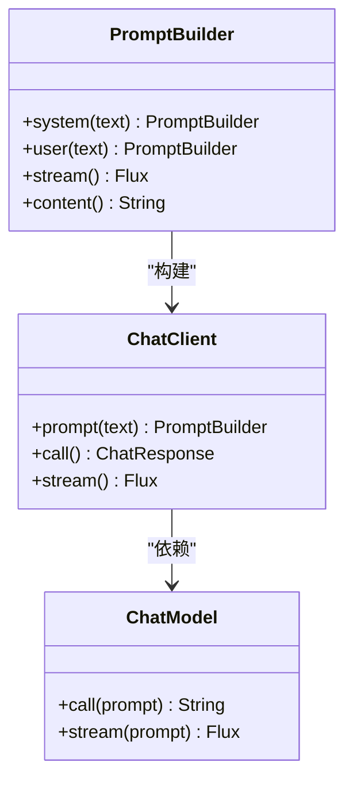
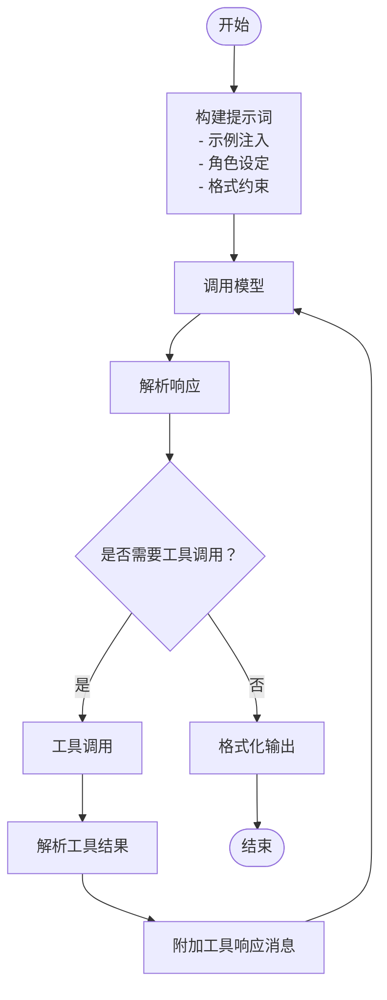
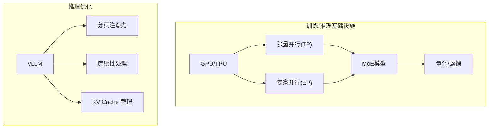
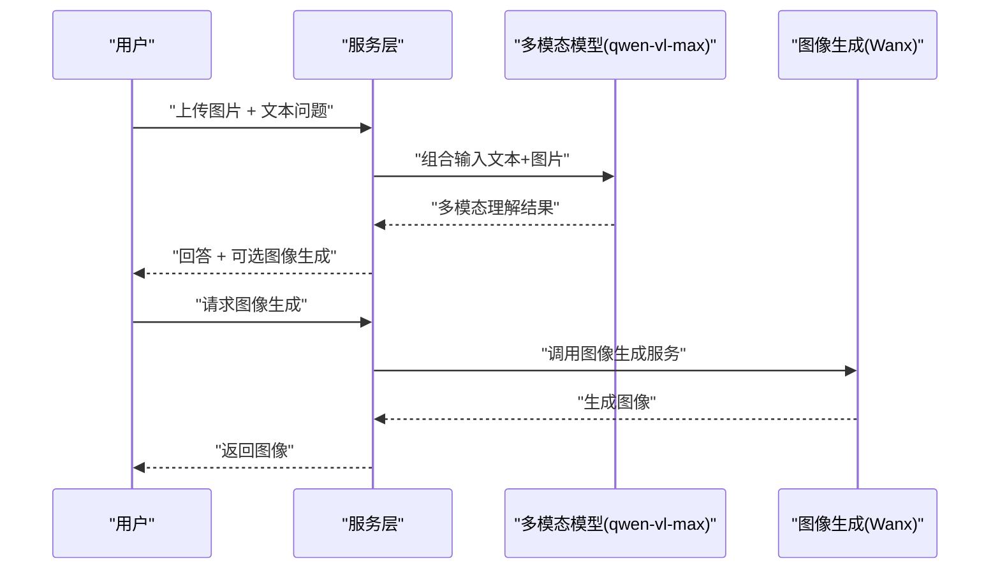
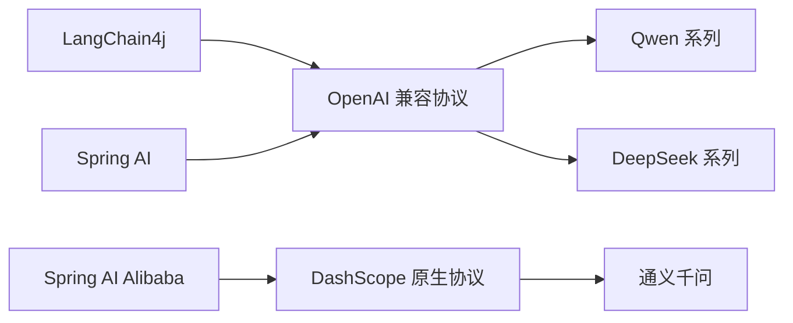

# 大模型核心特性

<cite>
**本文引用的文件**
- [AI大模型教程完整版.md](file://【0】AI大模型教程（指导手册）/AI大模型教程完整版.md)
- [SpringAIAlibaba-完整学习总结笔记.md](file://3、SpringAIAlibaba-完整学习总结笔记.md)
- [LangChain4j-完整学习总结笔记.md](file://4、LangChain4j-完整学习总结笔记.md)
- [AI智能体完整学习与实施方案.md](file://5、AI智能体完整学习与实施方案.md)
- [AI智能体—技能全景与学习路线.md](file://6、AI智能体—技能全景与学习路线.md)
</cite>

## 目录
1. [引言](#引言)
2. [项目结构](#项目结构)
3. [核心组件](#核心组件)
4. [架构概览](#架构概览)
5. [详细组件分析](#详细组件分析)
6. [依赖分析](#依赖分析)
7. [性能考量](#性能考量)
8. [故障排查指南](#故障排查指南)
9. [结论](#结论)
10. [附录](#附录)

## 引言
本文件围绕大模型的四大核心特性——通用性强、Few-shot/Zer-shot能力、可拓展性、多模态能力——进行系统化理论阐述，并结合仓库中的教学与实践资料，解释这些特性在工程中的实现路径与影响。通过对Transformer架构、提示词工程、RAG、工具调用、多模态模型等主题的梳理，帮助读者建立从理论到实践的完整认知。

## 项目结构
本仓库包含三类与大模型密切相关的知识载体：
- 教学与理论：《AI大模型教程完整版》系统讲解大模型基础、架构、术语、训练与推理、部署等
- 框架实践：Spring AI Alibaba 与 LangChain4j 的模块化示例，覆盖提示词、流式输出、工具调用、RAG、多模态等
- 智能体方案：AI智能体完整学习与实施方案，聚焦RAG优化、Agent编排、评估监控与微调

**章节来源**
- [AI大模型教程完整版.md:1-120](file://【0】AI大模型教程（指导手册）/AI大模型教程完整版.md#L1-L120)
- [SpringAIAlibaba-完整学习总结笔记.md:1-120](file://3、SpringAIAlibaba-完整学习总结笔记.md#L1-L120)
- [LangChain4j-完整学习总结笔记.md:1-120](file://4、LangChain4j-完整学习总结笔记.md#L1-L120)
- [AI智能体完整学习与实施方案.md:1-120](file://5、AI智能体完整学习与实施方案.md#L1-L120)

## 核心组件
围绕四大特性，本仓库提供了以下关键支撑：
- 通用性强：通过统一的ChatModel/ChatClient接口与提示词工程，实现多任务、多模态的统一调用
- Few-shot/Zer-shot：通过提示词模板、示例注入与少量样本引导，实现快速适配
- 可拓展性：参数规模、上下文长度、训练数据量的增长趋势与工程化部署（单机/多机张量并行、MoE、量化）
- 多模态能力：图像理解与生成、音频/视频处理的融合路径

**章节来源**
- [AI大模型教程完整版.md:198-216](file://【0】AI大模型教程（指导手册）/AI大模型教程完整版.md#L198-L216)
- [SpringAIAlibaba-完整学习总结笔记.md:134-202](file://3、SpringAIAlibaba-完整学习总结笔记.md#L134-L202)
- [LangChain4j-完整学习总结笔记.md:262-470](file://4、LangChain4j-完整学习总结笔记.md#L262-L470)
- [AI智能体完整学习与实施方案.md:599-766](file://5、AI智能体完整学习与实施方案.md#L599-L766)

## 架构概览
下图展示了从提示词到多模态输出的典型调用链，体现通用性与可拓展性在工程中的落地方式：

**图示来源**
- [SpringAIAlibaba-完整学习总结笔记.md:205-298](file://3、SpringAIAlibaba-完整学习总结笔记.md#L205-L298)
- [LangChain4j-完整学习总结笔记.md:262-470](file://4、LangChain4j-完整学习总结笔记.md#L262-L470)

**章节来源**
- [SpringAIAlibaba-完整学习总结笔记.md:205-298](file://3、SpringAIAlibaba-完整学习总结笔记.md#L205-L298)
- [LangChain4j-完整学习总结笔记.md:262-470](file://4、LangChain4j-完整学习总结笔记.md#L262-L470)

## 详细组件分析

### 通用性强
- 理论基础：大模型通过预训练+微调实现多任务、多模态通用能力，具备跨任务迁移与跨模态理解的潜力
- 工程实现：
  - 统一接口：ChatModel/ChatClient抽象，屏蔽不同模型提供商差异
  - 提示词工程：System/User/Assistant消息类型与模板化，实现角色扮演与格式控制
  - 多模型共存：同一应用内切换不同模型（如DeepSeek/Qwen），满足不同场景需求

**图示来源**
- [SpringAIAlibaba-完整学习总结笔记.md:205-298](file://3、SpringAIAlibaba-完整学习总结笔记.md#L205-L298)
- [LangChain4j-完整学习总结笔记.md:262-470](file://4、LangChain4j-完整学习总结笔记.md#L262-L470)

**章节来源**
- [AI大模型教程完整版.md:198-216](file://【0】AI大模型教程（指导手册）/AI大模型教程完整版.md#L198-L216)
- [SpringAIAlibaba-完整学习总结笔记.md:205-298](file://3、SpringAIAlibaba-完整学习总结笔记.md#L205-L298)
- [LangChain4j-完整学习总结笔记.md:262-470](file://4、LangChain4j-完整学习总结笔记.md#L262-L470)

### Few-shot/Zer-shot能力
- 理论基础：通过少量示例（Few-shot）或零示例（Zer-shot）引导模型在新任务上快速适配
- 工程实现：
  - 示例注入：在提示词中加入示例，约束输出格式与风格
  - 模板化：PromptTemplate/SystemPromptTemplate实现占位符替换与角色设定
  - 工具调用：通过工具响应消息（ToolResponseMessage）扩展模型能力边界

**图示来源**
- [SpringAIAlibaba-完整学习总结笔记.md:492-620](file://3、SpringAIAlibaba-完整学习总结笔记.md#L492-L620)
- [LangChain4j-完整学习总结笔记.md:362-520](file://4、LangChain4j-完整学习总结笔记.md#L362-L520)

**章节来源**
- [SpringAIAlibaba-完整学习总结笔记.md:492-620](file://3、SpringAIAlibaba-完整学习总结笔记.md#L492-L620)
- [LangChain4j-完整学习总结笔记.md:362-520](file://4、LangChain4j-完整学习总结笔记.md#L362-L520)

### 可拓展性
- 理论基础：参数规模、上下文长度、训练数据量呈增长趋势，遵循扩展定律（Scaling Laws）
- 工程实现：
  - 单机/多机张量并行（TP）、专家并行（EP）
  - MoE模型与稀疏激活，降低计算成本
  - 量化（INT4/INT8/BF16/FP8）与蒸馏压缩，兼顾精度与性能
  - vLLM等推理框架的分页注意力、连续批处理、KV Cache优化

**图示来源**
- [AI大模型教程完整版.md:800-980](file://【0】AI大模型教程（指导手册）/AI大模型教程完整版.md#L800-L980)
- [AI大模型教程完整版.md:1387-1599](file://【0】AI大模型教程（指导手册）/AI大模型教程完整版.md#L1387-L1599)

**章节来源**
- [AI大模型教程完整版.md:800-980](file://【0】AI大模型教程（指导手册）/AI大模型教程完整版.md#L800-L980)
- [AI大模型教程完整版.md:1387-1599](file://【0】AI大模型教程（指导手册）/AI大模型教程完整版.md#L1387-L1599)

### 多模态能力
- 理论基础：多模态模型（如GPT-4o、Gemini）支持文本、图像、音频、视频的联合理解与生成
- 工程实现：
  - 图像理解：qwen-vl-max等多模态模型，支持文本+图片组合输入
  - 图像生成：通义万象（WanxImageModel）等工具链
  - 多模态消息：UserMessage.from()组合文本与图片，形成多模态输入

**图示来源**
- [LangChain4j-完整学习总结笔记.md:3399-4046](file://4、LangChain4j-完整学习总结笔记.md#L3399-L4046)

**章节来源**
- [AI大模型教程完整版.md:200-206](file://【0】AI大模型教程（指导手册）/AI大模型教程完整版.md#L200-L206)
- [LangChain4j-完整学习总结笔记.md:3399-4046](file://4、LangChain4j-完整学习总结笔记.md#L3399-L4046)

## 依赖分析
- 框架对比：LangChain4j、Spring AI、Spring AI Alibaba在调用协议、配置方式、API风格上各有侧重，但均可通过OpenAI兼容协议或原生DashScope协议对接多模型
- 技术选型：LangChain4j偏向声明式与高阶API，Spring系列偏向Spring生态与自动配置，三方对比详见学习笔记

**图示来源**
- [LangChain4j-完整学习总结笔记.md:709-766](file://4、LangChain4j-完整学习总结笔记.md#L709-L766)
- [SpringAIAlibaba-完整学习总结笔记.md:767-800](file://3、SpringAIAlibaba-完整学习总结笔记.md#L767-L800)

**章节来源**
- [LangChain4j-完整学习总结笔记.md:709-766](file://4、LangChain4j-完整学习总结笔记.md#L709-L766)
- [SpringAIAlibaba-完整学习总结笔记.md:767-800](file://3、SpringAIAlibaba-完整学习总结笔记.md#L767-L800)

## 性能考量
- 推理优化：vLLM的分页注意力、连续批处理、KV Cache管理显著提升吞吐与降低延迟
- 硬件与精度：BF16/FP16混合精度、INT4/INT8量化、MoE稀疏激活在精度与性能间取得平衡
- 部署策略：单机/多机张量并行、专家并行、PD分离与多Master模式提升可扩展性与可用性

**章节来源**
- [AI大模型教程完整版.md:1418-1599](file://【0】AI大模型教程（指导手册）/AI大模型教程完整版.md#L1418-L1599)
- [AI大模型教程完整版.md:916-980](file://【0】AI大模型教程（指导手册）/AI大模型教程完整版.md#L916-L980)

## 故障排查指南
- 流式输出问题：检查SSE流式输出对接、逐chunk解析与下游节点冲突处理
- 工作流节点：Camunda自定义节点开发与变量赋值，确保节点间数据传递与状态一致性
- 模型调用异常：统一通过ChatModel/ChatClient封装，捕获异常与超时，必要时切换模型或降级策略

**章节来源**
- [AI智能体完整学习与实施方案.md:1-120](file://5、AI智能体完整学习与实施方案.md#L1-L120)
- [AI智能体完整学习与实施方案.md:116-170](file://5、AI智能体完整学习与实施方案.md#L116-L170)

## 结论
大模型的四大特性在本仓库中得到了系统化的理论阐释与工程化落地：
- 通用性强：通过统一接口与提示词工程实现跨任务、跨模态的灵活适配
- Few-shot/Zer-shot：借助示例注入与模板化，实现快速新任务适配
- 可拓展性：参数规模、上下文长度、训练数据量持续增长，工程上通过并行、稀疏、量化与推理优化保障性能
- 多模态能力：图像理解与生成、音频/视频融合处理逐步成熟

这些特性共同推动了AI应用开发从“专用模型”向“通用基础模型+工程化框架”的范式演进。

## 附录
- 技能全景：多模态作为AI智能体必备能力之一，建议在掌握基础后深入RAG优化、Agent编排与评估监控体系
- 学习路线：结合仓库中的模块化示例与实施方案，形成“理论—实践—项目”的闭环

**章节来源**
- [AI智能体—技能全景与学习路线.md:18](file://6、AI智能体—技能全景与学习路线.md#L18)
- [AI智能体—技能全景与学习路线.md:245](file://6、AI智能体—技能全景与学习路线.md#L245)