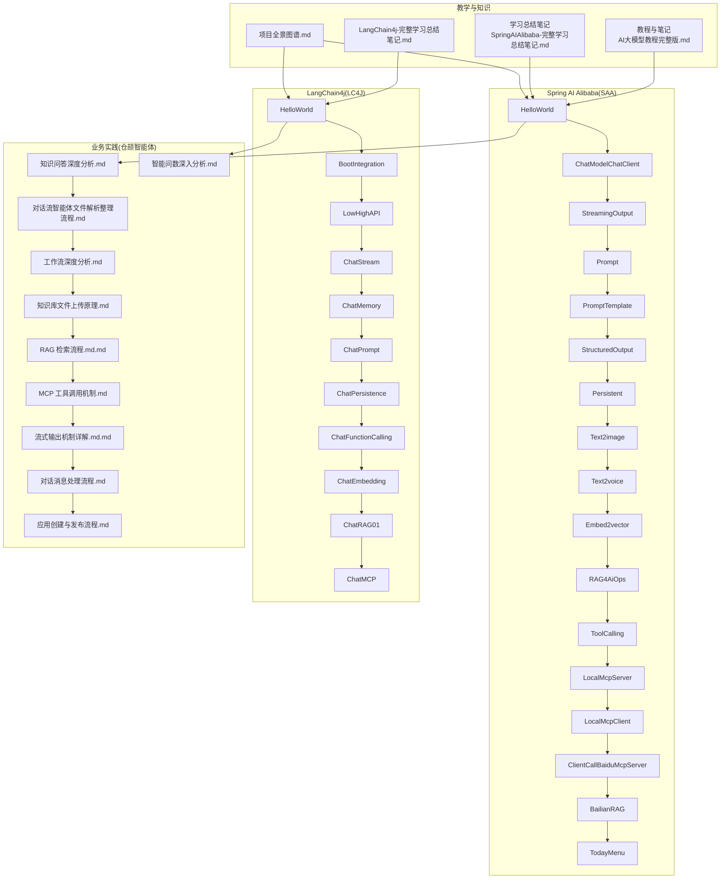
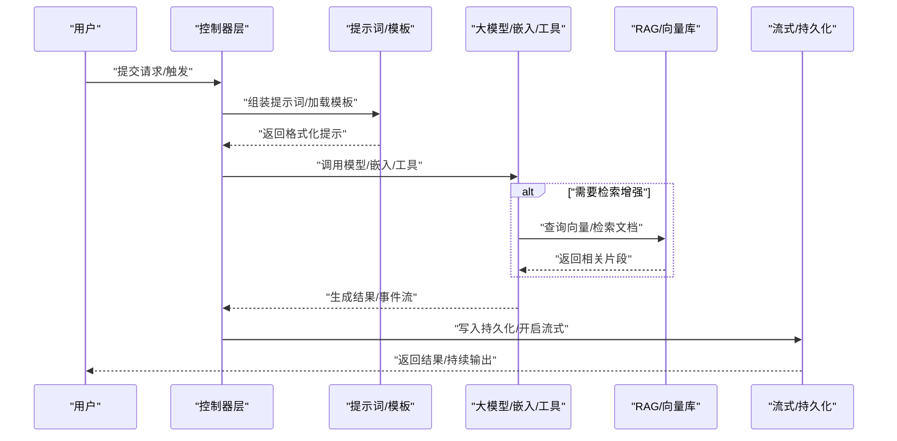
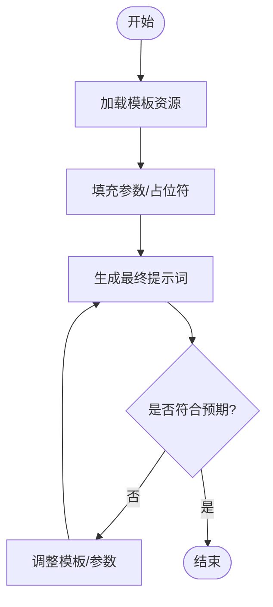
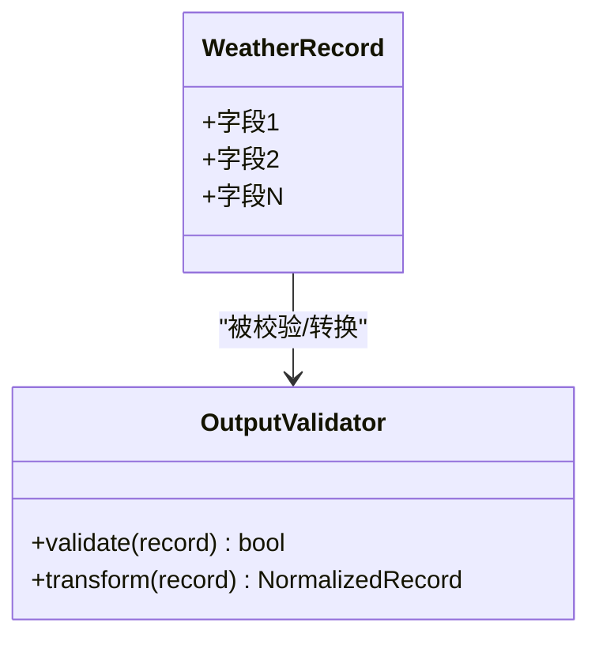
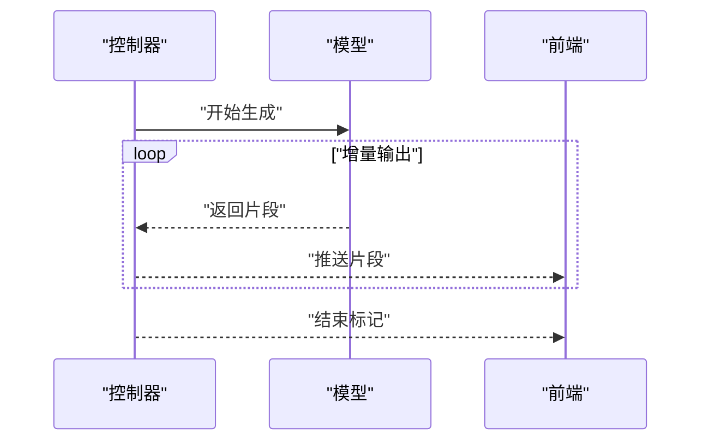
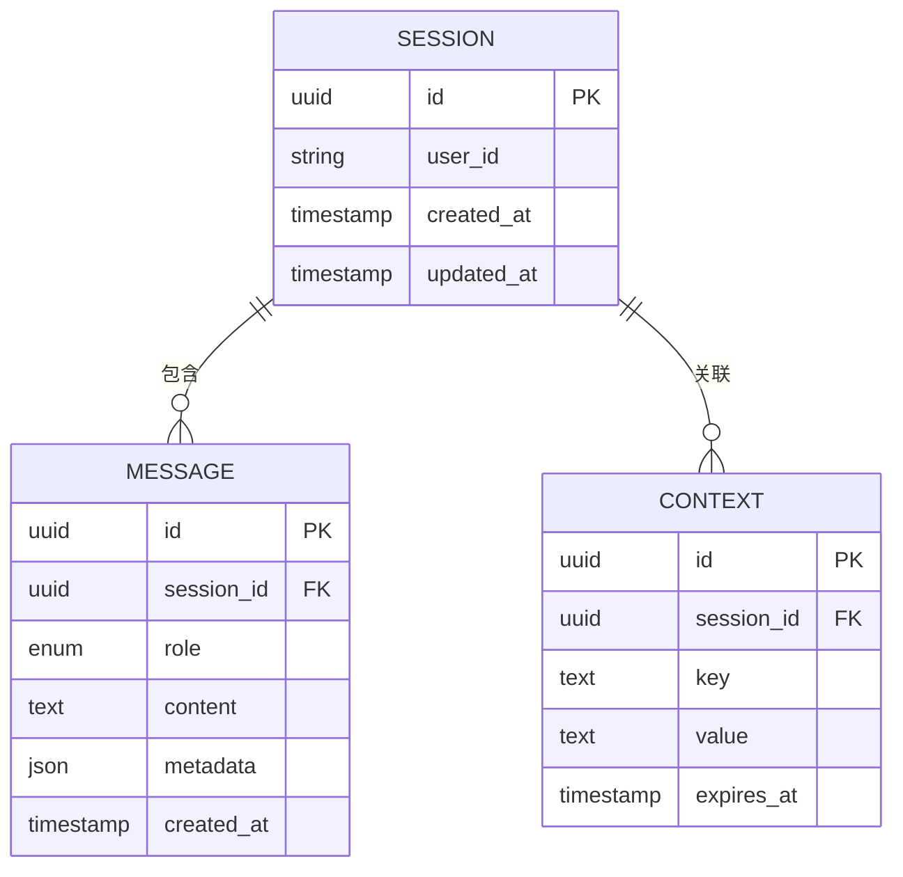
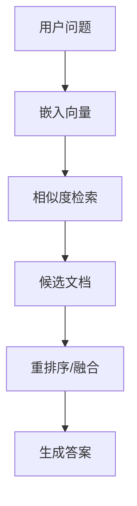
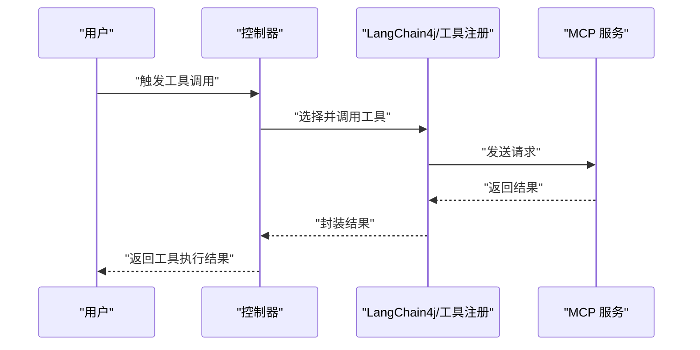
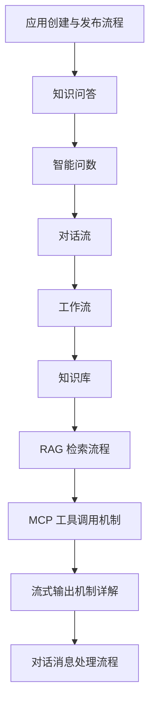
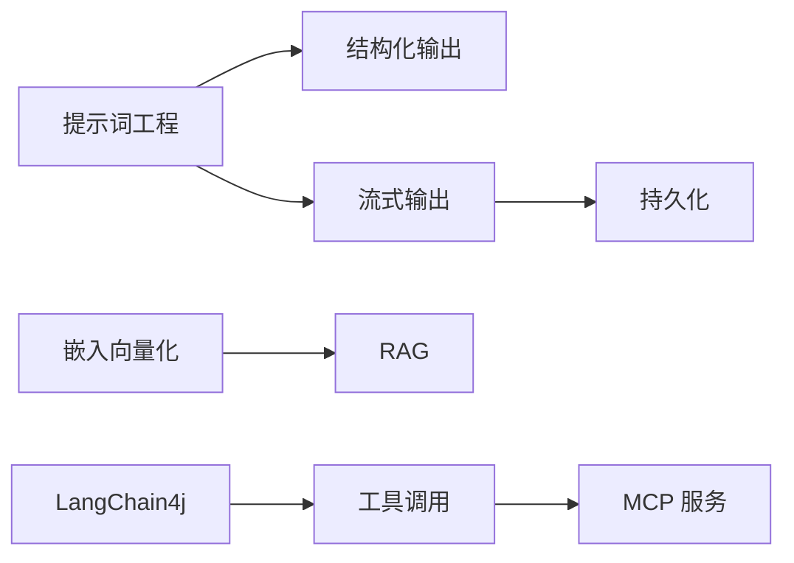

# 实践应用案例

<cite>
**本文引用的文件**
- [0、项目全景图谱.md](file://0、项目全景图谱.md)
- [3、SpringAIAlibaba-完整学习总结笔记.md](file://3、SpringAIAlibaba-完整学习总结笔记.md)
- [4、LangChain4j-完整学习总结笔记.md](file://4、LangChain4j-完整学习总结笔记.md)
- [【0】AI大模型教程（指导手册）/AI大模型教程完整版.md](file://【0】AI大模型教程（指导手册）/AI大模型教程完整版.md)
- [【1】SpringAIAlibaba-atguiguV1/SAA-01HelloWorld/src/main/java/com/atguigu/study/Saa01HelloWorldApplication.java](file://【1】SpringAIAlibaba-atguiguV1/SAA-01HelloWorld/src/main/java/com/atguigu/study/Saa01HelloWorldApplication.java)
- [【1】SpringAIAlibaba-atguiguV1/SAA-03ChatModelChatClient/src/main/java/com/atguigu/study/controller/ChatController.java](file://【1】SpringAIAlibaba-atguiguV1/SAA-03ChatModelChatClient/src/main/java/com/atguigu/study/controller/ChatController.java)
- [【1】SpringAIAlibaba-atguiguV1/SAA-04StreamingOutput/src/main/java/com/atguigu/study/controller/StreamingController.java](file://【1】SpringAIAlibaba-atguiguV1/SAA-04StreamingOutput/src/main/java/com/atguigu/study/controller/StreamingController.java)
- [【1】SpringAIAlibaba-atguiguV1/SAA-05Prompt/src/main/java/com/atguigu/study/controller/PromptController.java](file://【1】SpringAIAlibaba-atguiguV1/SAA-05Prompt/src/main/java/com/atguigu/study/controller/PromptController.java)
- [【1】SpringAIAlibaba-atguiguV1/SAA-06PromptTemplate/src/main/resources/prompttemplate/template.txt](file://【1】SpringAIAlibaba-atguiguV1/SAA-06PromptTemplate/src/main/resources/prompttemplate/template.txt)
- [【1】SpringAIAlibaba-atguiguV1/SAA-07StructuredOutput/src/main/java/com/atguigu/study/records/WeatherRecord.java](file://【1】SpringAIAlibaba-atguiguV1/SAA-07StructuredOutput/src/main/java/com/atguigu/study/records/WeatherRecord.java)
- [【1】SpringAIAlibaba-atguiguV1/SAA-08Persistent/src/main/java/com/atguigu/study/controller/PersistentController.java](file://【1】SpringAIAlibaba-atguiguV1/SAA-08Persistent/src/main/java/com/atguigu/study/controller/PersistentController.java)
- [【1】SpringAIAlibaba-atguiguV1/SAA-09Text2image/src/main/java/com/atguigu/study/controller/ImageController.java](file://【1】SpringAIAlibaba-atguiguV1/SAA-09Text2image/src/main/java/com/atguigu/study/controller/ImageController.java)
- [【1】SpringAIAlibaba-atguiguV1/SAA-10Text2voice/src/main/java/com/atguigu/study/controller/VoiceController.java](file://【1】SpringAIAlibaba-atguiguV1/SAA-10Text2voice/src/main/java/com/atguigu/study/controller/VoiceController.java)
- [【1】SpringAIAlibaba-atguiguV1/SAA-11Embed2vector/src/main/java/com/atguigu/study/controller/EmbeddingController.java](file://【1】SpringAIAlibaba-atguiguV1/SAA-11Embed2vector/src/main/java/com/atguigu/study/controller/EmbeddingController.java)
- [【1】SpringAIAlibaba-atguiguV1/SAA-12RAG4AiOps/src/main/java/com/atguigu/study/controller/AiOpsController.java](file://【1】SpringAIAlibaba-atguiguV1/SAA-12RAG4AiOps/src/main/java/com/atguigu/study/controller/AiOpsController.java)
- [【1】SpringAIAlibaba-atguiguV1/SAA-13ToolCalling/src/main/java/com/atguigu/study/controller/ToolController.java](file://【1】SpringAIAlibaba-atguiguV1/SAA-13ToolCalling/src/main/java/com/atguigu/study/controller/ToolController.java)
- [【1】SpringAIAlibaba-atguiguV1/SAA-14LocalMcpServer/src/main/java/com/atguigu/study/service/McpService.java](file://【1】SpringAIAlibaba-atguiguV1/SAA-14LocalMcpServer/src/main/java/com/atguigu/study/service/McpService.java)
- [【1】SpringAIAlibaba-atguiguV1/SAA-15LocalMcpClient/src/main/java/com/atguigu/study/controller/McpClientController.java](file://【1】SpringAIAlibaba-atguiguV1/SAA-15LocalMcpClient/src/main/java/com/atguigu/study/controller/McpClientController.java)
- [【1】SpringAIAlibaba-atguiguV1/SAA-16ClientCallBaiduMcpServer/src/main/resources/mcp-server.json5](file://【1】SpringAIAlibaba-atguiguV1/SAA-16ClientCallBaiduMcpServer/src/main/resources/mcp-server.json5)
- [【1】SpringAIAlibaba-atguiguV1/SAA-17BailianRAG/src/main/java/com/atguigu/study/controller/BailianRagController.java](file://【1】SpringAIAlibaba-atguiguV1/SAA-17BailianRAG/src/main/java/com/atguigu/study/controller/BailianRagController.java)
- [【1】SpringAIAlibaba-atguiguV1/SAA-18TodayMenu/src/main/java/com/atguigu/study/controller/MenuController.java](file://【1】SpringAIAlibaba-atguiguV1/SAA-18TodayMenu/src/main/java/com/atguigu/study/controller/MenuController.java)
- [【2】langchain4j-atguiguV5/langchain4j-01helloworld/src/main/java/com/atguigu/study/HelloLangChain4JApp.java](file://【2】langchain4j-atguiguV5/langchain4j-01helloworld/src/main/java/com/atguigu/study/HelloLangChain4JApp.java)
- [【2】langchain4j-atguiguV5/langchain4j-03boot-integration/src/main/java/com/atguigu/study/controller/IntegrationController.java](file://【2】langchain4j-atguiguV5/langchain4j-03boot-integration/src/main/java/com/atguigu/study/controller/IntegrationController.java)
- [【2】langchain4j-atguiguV5/langchain4j-04low-high-api/src/main/java/com/atguigu/study/controller/LowHighController.java](file://【2】langchain4j-atguiguV5/langchain4j-04low-high-api/src/main/java/com/atguigu/study/controller/LowHighController.java)
- [【2】langchain4j-atguiguV5/langchain4j-07chat-stream/src/main/java/com/atguigu/study/controller/ChatStreamController.java](file://【2】langchain4j-atguiguV5/langchain4j-07chat-stream/src/main/java/com/atguigu/study/controller/ChatStreamController.java)
- [【2】langchain4j-atguiguV5/langchain4j-08chat-memory/src/main/java/com/atguigu/study/controller/ChatMemoryController.java](file://【2】langchain4j-atguiguV5/langchain4j-08chat-memory/src/main/java/com/atguigu/study/controller/ChatMemoryController.java)
- [【2】langchain4j-atguiguV5/langchain4j-09chat-prompt/src/main/java/com/atguigu/study/controller/ChatPromptController.java](file://【2】langchain4j-atguiguV5/langchain4j-09chat-prompt/src/main/java/com/atguigu/study/controller/ChatPromptController.java)
- [【2】langchain4j-atguiguV5/langchain4j-10chat-persistence/src/main/java/com/atguigu/study/controller/ChatPersistenceController.java](file://【2】langchain4j-atguiguV5/langchain4j-10chat-persistence/src/main/java/com/atguigu/study/controller/ChatPersistenceController.java)
- [【2】langchain4j-atguiguV5/langchain4j-11chat-functioncalling/src/main/java/com/atguigu/study/controller/ChatFunctioncallingController.java](file://【2】langchain4j-atguiguV5/langchain4j-11chat-functioncalling/src/main/java/com/atguigu/study/controller/ChatFunctioncallingController.java)
- [【2】langchain4j-atguiguV5/langchain4j-12chat-embedding/src/main/java/com/atguigu/study/controller/ChatEmbeddingController.java](file://【2】langchain4j-atguiguV5/langchain4j-12chat-embedding/src/main/java/com/atguigu/study/controller/ChatEmbeddingController.java)
- [【2】langchain4j-atguiguV5/langchain4j-13chat-rag01/src/main/java/com/atguigu/study/controller/RagController.java](file://【2】langchain4j-atguiguV5/langchain4j-13chat-rag01/src/main/java/com/atguigu/study/controller/RagController.java)
- [【2】langchain4j-atguiguV5/langchain4j-14chat-mcp/src/main/java/com/atguigu/study/controller/McpController.java](file://【2】langchain4j-atguiguV5/langchain4j-14chat-mcp/src/main/java/com/atguigu/study/controller/McpController.java)
- [【3】工作资料/仓颉项目系统功能文档梳理/1、知识问答/1、知识问答深度分析.md](file://【3】工作资料/仓颉项目系统功能文档梳理/1、知识问答/1、知识问答深度分析.md)
- [【3】工作资料/仓颉项目系统功能文档梳理/2、智能问数/智能问数深入分析.md](file://【3】工作资料/仓颉项目系统功能文档梳理/2、智能问数/智能问数深入分析.md)
- [【3】工作资料/仓颉项目系统功能文档梳理/3、对话流/对话流智能体文件解析整理流程.md](file://【3】工作资料/仓颉项目系统功能文档梳理/3、对话流/对话流智能体文件解析整理流程.md)
- [【3】工作资料/仓颉项目系统功能文档梳理/4、工作流/工作流深度分析.md](file://【3】工作资料/仓颉项目系统功能文档梳理/4、工作流/工作流深度分析.md)
- [【3】工作资料/仓颉项目系统功能文档梳理/5-知识库/20260117_知识库文件上传原理.md](file://【3】工作资料/仓颉项目系统功能文档梳理/5-知识库/20260117_知识库文件上传原理.md)
- [【3】工作资料/仓颉项目系统功能文档梳理/14、RAG 检索流程.md.md](file://【3】工作资料/仓颉项目系统功能文档梳理/14、RAG 检索流程.md.md)
- [【3】工作资料/仓颉项目系统功能文档梳理/13、MCP 工具调用机制.md](file://【3】工作资料/仓颉项目系统功能文档梳理/13、MCP 工具调用机制.md)
- [【3】工作资料/仓颉项目系统功能文档梳理/12、流式输出机制详解.md.md](file://【3】工作资料/仓颉项目系统功能文档梳理/12、流式输出机制详解.md.md)
- [【3】工作资料/仓颉项目系统功能文档梳理/10、对话消息处理流程.md](file://【3】工作资料/仓颉项目系统功能文档梳理/10、对话消息处理流程.md)
- [【3】工作资料/仓颉项目系统功能文档梳理/1、应用创建与发布流程.md](file://【3】工作资料/仓颉项目系统功能文档梳理/1、应用创建与发布流程.md)
- [【3】工作资料/仓颉项目系统功能文档梳理/通义灵码快速熟悉项目记忆/2、仓颉智能体核心功能说明.md](file://【3】工作资料/仓颉项目系统功能文档梳理/通义灵码快速熟悉项目记忆/2、仓颉智能体核心功能说明.md)
- [【3】工作资料/仓颉项目系统功能文档梳理/通义灵码快速熟悉项目记忆/3、仓颉智能体平台 - 五大智能体类型简介.md](file://【3】工作资料/仓颉项目系统功能文档梳理/通义灵码快速熟悉项目记忆/3、仓颉智能体平台 - 五大智能体类型简介.md)
- [【3】工作资料/仓颉项目系统功能文档梳理/通义灵码快速熟悉项目记忆/4、仓颉智能体平台核心记忆.md](file://【3】工作资料/仓颉项目系统功能文档梳理/通义灵码快速熟悉项目记忆/4、仓颉智能体平台核心记忆.md)
- [【3】工作资料/仓颉项目系统功能文档梳理/通义灵码快速熟悉项目记忆/5、通义灵码快速记忆项目（使用指南）.md](file://【3】工作资料/仓颉项目系统功能文档梳理/通义灵码快速熟悉项目记忆/5、通义灵码快速记忆项目（使用指南）.md)
- [【3】工作资料/code/仓颉智能体/nlp-agent/README.md](file://【3】工作资料/code/仓颉智能体/nlp-agent/README.md)
</cite>

## 目录
1. [引言](#引言)
2. [项目结构](#项目结构)
3. [核心组件](#核心组件)
4. [架构总览](#架构总览)
5. [详细组件分析](#详细组件分析)
6. [依赖分析](#依赖分析)
7. [性能考虑](#性能考虑)
8. [故障排查指南](#故障排查指南)
9. [结论](#结论)
10. [附录](#附录)

## 引言
本文件面向希望在实际业务中落地大模型应用的工程团队与技术管理者，围绕自然语言处理、计算机视觉、语音识别、推荐系统等典型场景，系统梳理从需求分析到系统实现的关键路径，并结合仓库中的 Spring AI Alibaba 与 LangChain4j 实战项目，给出可操作的实施策略与评估方法。同时，结合“仓颉智能体”项目的真实业务实践，展示如何在企业内部通过 RAG、工具调用、流式输出等能力构建可扩展的智能体平台。

## 项目结构
该仓库由三大主线构成：
- 教学与知识沉淀：包含大模型教程、学习笔记与全景图谱，帮助理解行业应用与技术要点。
- Spring AI Alibaba 实战：以 SAA 系列项目为主线，覆盖提示词工程、结构化输出、持久化、文生图、文生音、嵌入向量化、RAG、工具调用、MCP 服务与客户端、百炼 RAG、今日菜单等场景。
- LangChain4j 实战：以 langchain4j 系列项目为主线，覆盖 Spring Boot 集成、低/高层 API、流式输出、记忆、提示词、持久化、函数调用、嵌入、RAG、MCP 等场景。
- 业务实践：以“仓颉智能体”为核心，提供知识问答、智能问数、对话流、工作流、知识库、RAG 检索、MCP 工具调用、流式输出等真实业务流程文档与实现思路。

**图表来源**
- [0、项目全景图谱.md](file://0、项目全景图谱.md)
- [3、SpringAIAlibaba-完整学习总结笔记.md](file://3、SpringAIAlibaba-完整学习总结笔记.md)
- [4、LangChain4j-完整学习总结笔记.md](file://4、LangChain4j-完整学习总结笔记.md)
- [【1】SpringAIAlibaba-atguiguV1/SAA-01HelloWorld/src/main/java/com/atguigu/study/Saa01HelloWorldApplication.java](file://【1】SpringAIAlibaba-atguiguV1/SAA-01HelloWorld/src/main/java/com/atguigu/study/Saa01HelloWorldApplication.java)
- [【2】langchain4j-atguiguV5/langchain4j-01helloworld/src/main/java/com/atguigu/study/HelloLangChain4JApp.java](file://【2】langchain4j-atguiguV5/langchain4j-01helloworld/src/main/java/com/atguigu/study/HelloLangChain4JApp.java)
- [【3】工作资料/仓颉项目系统功能文档梳理/1、知识问答/1、知识问答深度分析.md](file://【3】工作资料/仓颉项目系统功能文档梳理/1、知识问答/1、知识问答深度分析.md)
- [【3】工作资料/仓颉项目系统功能文档梳理/2、智能问数/智能问数深入分析.md](file://【3】工作资料/仓颉项目系统功能文档梳理/2、智能问数/智能问数深入分析.md)
- [【3】工作资料/仓颉项目系统功能文档梳理/3、对话流/对话流智能体文件解析整理流程.md](file://【3】工作资料/仓颉项目系统功能文档梳理/3、对话流/对话流智能体文件解析整理流程.md)
- [【3】工作资料/仓颉项目系统功能文档梳理/4、工作流/工作流深度分析.md](file://【3】工作资料/仓颉项目系统功能文档梳理/4、工作流/工作流深度分析.md)
- [【3】工作资料/仓颉项目系统功能文档梳理/5-知识库/20260117_知识库文件上传原理.md](file://【3】工作资料/仓颉项目系统功能文档梳理/5-知识库/20260117_知识库文件上传原理.md)
- [【3】工作资料/仓颉项目系统功能文档梳理/14、RAG 检索流程.md.md](file://【3】工作资料/仓颉项目系统功能文档梳理/14、RAG 检索流程.md.md)
- [【3】工作资料/仓颉项目系统功能文档梳理/13、MCP 工具调用机制.md](file://【3】工作资料/仓颉项目系统功能文档梳理/13、MCP 工具调用机制.md)
- [【3】工作资料/仓颉项目系统功能文档梳理/12、流式输出机制详解.md.md](file://【3】工作资料/仓颉项目系统功能文档梳理/12、流式输出机制详解.md.md)
- [【3】工作资料/仓颉项目系统功能文档梳理/10、对话消息处理流程.md](file://【3】工作资料/仓颉项目系统功能文档梳理/10、对话消息处理流程.md)
- [【3】工作资料/仓颉项目系统功能文档梳理/1、应用创建与发布流程.md](file://【3】工作资料/仓颉项目系统功能文档梳理/1、应用创建与发布流程.md)

**章节来源**
- [0、项目全景图谱.md](file://0、项目全景图谱.md)
- [3、SpringAIAlibaba-完整学习总结笔记.md](file://3、SpringAIAlibaba-完整学习总结笔记.md)
- [4、LangChain4j-完整学习总结笔记.md](file://4、LangChain4j-完整学习总结笔记.md)

## 核心组件
- 提示词工程与模板：通过提示词控制器与模板资源，实现高质量提示词的组织与复用，支撑多场景对话与结构化输出。
- 结构化输出：利用强类型记录对象，约束模型输出格式，便于下游解析与业务集成。
- 流式输出：基于响应式或事件流机制，实现边生成边输出，提升用户体验与交互效率。
- 持久化与记忆：将对话上下文与历史消息持久化，支持跨会话记忆与检索增强。
- 多模态能力：文生图与文生音模块，满足内容创作与语音播报等场景。
- 嵌入与检索：文本向量化与相似度检索，为 RAG 与智能问答提供基础能力。
- 工具调用与 MCP：通过本地或云端 MCP 服务，将外部工具能力注入到智能体中，形成“感知-推理-行动”的闭环。
- RAG 与知识库：结合运维知识、业务文档与向量库，实现面向企业的智能问答与辅助决策。

**章节来源**
- [【1】SpringAIAlibaba-atguiguV1/SAA-05Prompt/src/main/java/com/atguigu/study/controller/PromptController.java](file://【1】SpringAIAlibaba-atguiguV1/SAA-05Prompt/src/main/java/com/atguigu/study/controller/PromptController.java)
- [【1】SpringAIAlibaba-atguiguV1/SAA-06PromptTemplate/src/main/resources/prompttemplate/template.txt](file://【1】SpringAIAlibaba-atguiguV1/SAA-06PromptTemplate/src/main/resources/prompttemplate/template.txt)
- [【1】SpringAIAlibaba-atguiguV1/SAA-07StructuredOutput/src/main/java/com/atguigu/study/records/WeatherRecord.java](file://【1】SpringAIAlibaba-atguiguV1/SAA-07StructuredOutput/src/main/java/com/atguigu/study/records/WeatherRecord.java)
- [【1】SpringAIAlibaba-atguiguV1/SAA-04StreamingOutput/src/main/java/com/atguigu/study/controller/StreamingController.java](file://【1】SpringAIAlibaba-atguiguV1/SAA-04StreamingOutput/src/main/java/com/atguigu/study/controller/StreamingController.java)
- [【1】SpringAIAlibaba-atguiguV1/SAA-08Persistent/src/main/java/com/atguigu/study/controller/PersistentController.java](file://【1】SpringAIAlibaba-atguiguV1/SAA-08Persistent/src/main/java/com/atguigu/study/controller/PersistentController.java)
- [【1】SpringAIAlibaba-atguiguV1/SAA-09Text2image/src/main/java/com/atguigu/study/controller/ImageController.java](file://【1】SpringAIAlibaba-atguiguV1/SAA-09Text2image/src/main/java/com/atguigu/study/controller/ImageController.java)
- [【1】SpringAIAlibaba-atguiguV1/SAA-10Text2voice/src/main/java/com/atguigu/study/controller/VoiceController.java](file://【1】SpringAIAlibaba-atguiguV1/SAA-10Text2voice/src/main/java/com/atguigu/study/controller/VoiceController.java)
- [【1】SpringAIAlibaba-atguiguV1/SAA-11Embed2vector/src/main/java/com/atguigu/study/controller/EmbeddingController.java](file://【1】SpringAIAlibaba-atguiguV1/SAA-11Embed2vector/src/main/java/com/atguigu/study/controller/EmbeddingController.java)
- [【1】SpringAIAlibaba-atguiguV1/SAA-12RAG4AiOps/src/main/java/com/atguigu/study/controller/AiOpsController.java](file://【1】SpringAIAlibaba-atguiguV1/SAA-12RAG4AiOps/src/main/java/com/atguigu/study/controller/AiOpsController.java)
- [【1】SpringAIAlibaba-atguiguV1/SAA-13ToolCalling/src/main/java/com/atguigu/study/controller/ToolController.java](file://【1】SpringAIAlibaba-atguiguV1/SAA-13ToolCalling/src/main/java/com/atguigu/study/controller/ToolController.java)
- [【1】SpringAIAlibaba-atguiguV1/SAA-14LocalMcpServer/src/main/java/com/atguigu/study/service/McpService.java](file://【1】SpringAIAlibaba-atguiguV1/SAA-14LocalMcpServer/src/main/java/com/atguigu/study/service/McpService.java)
- [【1】SpringAIAlibaba-atguiguV1/SAA-15LocalMcpClient/src/main/java/com/atguigu/study/controller/McpClientController.java](file://【1】SpringAIAlibaba-atguiguV1/SAA-15LocalMcpClient/src/main/java/com/atguigu/study/controller/McpClientController.java)
- [【1】SpringAIAlibaba-atguiguV1/SAA-16ClientCallBaiduMcpServer/src/main/resources/mcp-server.json5](file://【1】SpringAIAlibaba-atguiguV1/SAA-16ClientCallBaiduMcpServer/src/main/resources/mcp-server.json5)
- [【1】SpringAIAlibaba-atguiguV1/SAA-17BailianRAG/src/main/java/com/atguigu/study/controller/BailianRagController.java](file://【1】SpringAIAlibaba-atguiguV1/SAA-17BailianRAG/src/main/java/com/atguigu/study/controller/BailianRagController.java)
- [【1】SpringAIAlibaba-atguiguV1/SAA-18TodayMenu/src/main/java/com/atguigu/study/controller/MenuController.java](file://【1】SpringAIAlibaba-atguiguV1/SAA-18TodayMenu/src/main/java/com/atguigu/study/controller/MenuController.java)

## 架构总览
下图展示了从“用户输入/触发条件”到“模型推理/工具执行/结果返回”的整体链路，涵盖提示词工程、结构化输出、流式输出、持久化、RAG、MCP 工具调用与多模态输出等关键环节。

**图表来源**
- [【1】SpringAIAlibaba-atguiguV1/SAA-03ChatModelChatClient/src/main/java/com/atguigu/study/controller/ChatController.java](file://【1】SpringAIAlibaba-atguiguV1/SAA-03ChatModelChatClient/src/main/java/com/atguigu/study/controller/ChatController.java)
- [【1】SpringAIAlibaba-atguiguV1/SAA-05Prompt/src/main/java/com/atguigu/study/controller/PromptController.java](file://【1】SpringAIAlibaba-atguiguV1/SAA-05Prompt/src/main/java/com/atguigu/study/controller/PromptController.java)
- [【1】SpringAIAlibaba-atguiguV1/SAA-06PromptTemplate/src/main/resources/prompttemplate/template.txt](file://【1】SpringAIAlibaba-atguiguV1/SAA-06PromptTemplate/src/main/resources/prompttemplate/template.txt)
- [【1】SpringAIAlibaba-atguiguV1/SAA-11Embed2vector/src/main/java/com/atguigu/study/controller/EmbeddingController.java](file://【1】SpringAIAlibaba-atguiguV1/SAA-11Embed2vector/src/main/java/com/atguigu/study/controller/EmbeddingController.java)
- [【1】SpringAIAlibaba-atguiguV1/SAA-12RAG4AiOps/src/main/java/com/atguigu/study/controller/AiOpsController.java](file://【1】SpringAIAlibaba-atguiguV1/SAA-12RAG4AiOps/src/main/java/com/atguigu/study/controller/AiOpsController.java)
- [【1】SpringAIAlibaba-atguiguV1/SAA-04StreamingOutput/src/main/java/com/atguigu/study/controller/StreamingController.java](file://【1】SpringAIAlibaba-atguiguV1/SAA-04StreamingOutput/src/main/java/com/atguigu/study/controller/StreamingController.java)
- [【1】SpringAIAlibaba-atguiguV1/SAA-08Persistent/src/main/java/com/atguigu/study/controller/PersistentController.java](file://【1】SpringAIAlibaba-atguiguV1/SAA-08Persistent/src/main/java/com/atguigu/study/controller/PersistentController.java)

## 详细组件分析

### 组件A：提示词工程与模板
- 能力概述：通过控制器集中管理提示词构造逻辑，配合模板资源文件，实现提示词的版本化与复用。
- 关键点：
  - 提示词构造：根据业务域与上下文动态拼装提示词。
  - 模板化：将通用结构抽取为模板，降低重复劳动。
  - 参数化：支持占位符替换与条件分支，适配多场景。
- 实施建议：
  - 建立提示词资产库，按领域/任务分类管理。
  - 引入 A/B 测试与效果追踪，持续优化提示词质量。

**图表来源**
- [【1】SpringAIAlibaba-atguiguV1/SAA-05Prompt/src/main/java/com/atguigu/study/controller/PromptController.java](file://【1】SpringAIAlibaba-atguiguV1/SAA-05Prompt/src/main/java/com/atguigu/study/controller/PromptController.java)
- [【1】SpringAIAlibaba-atguiguV1/SAA-06PromptTemplate/src/main/resources/prompttemplate/template.txt](file://【1】SpringAIAlibaba-atguiguV1/SAA-06PromptTemplate/src/main/resources/prompttemplate/template.txt)

**章节来源**
- [【1】SpringAIAlibaba-atguiguV1/SAA-05Prompt/src/main/java/com/atguigu/study/controller/PromptController.java](file://【1】SpringAIAlibaba-atguiguV1/SAA-05Prompt/src/main/java/com/atguigu/study/controller/PromptController.java)
- [【1】SpringAIAlibaba-atguiguV1/SAA-06PromptTemplate/src/main/resources/prompttemplate/template.txt](file://【1】SpringAIAlibaba-atguiguV1/SAA-06PromptTemplate/src/main/resources/prompttemplate/template.txt)

### 组件B：结构化输出
- 能力概述：通过强类型记录对象约束模型输出格式，确保下游解析稳定可靠。
- 关键点：
  - 类型安全：减少解析歧义与错误。
  - 扩展性：新增字段时保持兼容。
  - 与提示词联动：在提示词中明确输出结构，提高成功率。
- 实施建议：
  - 输出模式与数据库 Schema 对齐，便于落库。
  - 引入校验器与回滚策略，保障数据一致性。

**图表来源**
- [【1】SpringAIAlibaba-atguiguV1/SAA-07StructuredOutput/src/main/java/com/atguigu/study/records/WeatherRecord.java](file://【1】SpringAIAlibaba-atguiguV1/SAA-07StructuredOutput/src/main/java/com/atguigu/study/records/WeatherRecord.java)

**章节来源**
- [【1】SpringAIAlibaba-atguiguV1/SAA-07StructuredOutput/src/main/java/com/atguigu/study/records/WeatherRecord.java](file://【1】SpringAIAlibaba-atguiguV1/SAA-07StructuredOutput/src/main/java/com/atguigu/study/records/WeatherRecord.java)

### 组件C：流式输出
- 能力概述：将模型生成过程拆分为多个片段，边生成边推送，显著改善交互体验。
- 关键点：
  - 事件驱动：基于 SSE 或响应式流推送增量内容。
  - 上下文保留：保证流式过程中上下文与历史消息的完整性。
  - 错误恢复：断流重连与状态恢复。
- 实施建议：
  - 前端采用流式渲染，后端采用缓冲与背压策略。
  - 记录流式事件元数据，便于审计与回放。

**图表来源**
- [【1】SpringAIAlibaba-atguiguV1/SAA-04StreamingOutput/src/main/java/com/atguigu/study/controller/StreamingController.java](file://【1】SpringAIAlibaba-atguiguV1/SAA-04StreamingOutput/src/main/java/com/atguigu/study/controller/StreamingController.java)
- [【2】langchain4j-atguiguV5/langchain4j-07chat-stream/src/main/java/com/atguigu/study/controller/ChatStreamController.java](file://【2】langchain4j-atguiguV5/langchain4j-07chat-stream/src/main/java/com/atguigu/study/controller/ChatStreamController.java)

**章节来源**
- [【1】SpringAIAlibaba-atguiguV1/SAA-04StreamingOutput/src/main/java/com/atguigu/study/controller/StreamingController.java](file://【1】SpringAIAlibaba-atguiguV1/SAA-04StreamingOutput/src/main/java/com/atguigu/study/controller/StreamingController.java)
- [【2】langchain4j-atguiguV5/langchain4j-07chat-stream/src/main/java/com/atguigu/study/controller/ChatStreamController.java](file://【2】langchain4j-atguiguV5/langchain4j-07chat-stream/src/main/java/com/atguigu/study/controller/ChatStreamController.java)

### 组件D：持久化与记忆
- 能力概述：将对话历史、上下文与中间结果持久化，支持跨会话记忆与回放。
- 关键点：
  - 数据模型：消息、会话、上下文三者关系清晰。
  - 存储策略：热点数据缓存、冷数据归档。
  - 安全与合规：敏感信息脱敏与生命周期管理。
- 实施建议：
  - 引入分页游标与索引优化，提升查询性能。
  - 支持增量更新与事务一致性。

**图表来源**
- [【1】SpringAIAlibaba-atguiguV1/SAA-08Persistent/src/main/java/com/atguigu/study/controller/PersistentController.java](file://【1】SpringAIAlibaba-atguiguV1/SAA-08Persistent/src/main/java/com/atguigu/study/controller/PersistentController.java)
- [【2】langchain4j-atguiguV5/langchain4j-08chat-memory/src/main/java/com/atguigu/study/controller/ChatMemoryController.java](file://【2】langchain4j-atguiguV5/langchain4j-08chat-memory/src/main/java/com/atguigu/study/controller/ChatMemoryController.java)

**章节来源**
- [【1】SpringAIAlibaba-atguiguV1/SAA-08Persistent/src/main/java/com/atguigu/study/controller/PersistentController.java](file://【1】SpringAIAlibaba-atguiguV1/SAA-08Persistent/src/main/java/com/atguigu/study/controller/PersistentController.java)
- [【2】langchain4j-atguiguV5/langchain4j-08chat-memory/src/main/java/com/atguigu/study/controller/ChatMemoryController.java](file://【2】langchain4j-atguiguV5/langchain4j-08chat-memory/src/main/java/com/atguigu/study/controller/ChatMemoryController.java)

### 组件E：RAG 与知识库
- 能力概述：通过嵌入向量化与相似度检索，将外部知识注入到对话中，提升回答准确性与可信度。
- 关键点：
  - 文档预处理：清洗、切分、去重与元数据保留。
  - 向量化与索引：批量向量化与高效检索。
  - 重排序与融合：多来源结果的融合策略。
- 实施建议：
  - 建立知识入库与更新流水线，保证时效性。
  - 引入溯源与置信度评分，增强可解释性。

**图表来源**
- [【1】SpringAIAlibaba-atguiguV1/SAA-11Embed2vector/src/main/java/com/atguigu/study/controller/EmbeddingController.java](file://【1】SpringAIAlibaba-atguiguV1/SAA-11Embed2vector/src/main/java/com/atguigu/study/controller/EmbeddingController.java)
- [【1】SpringAIAlibaba-atguiguV1/SAA-12RAG4AiOps/src/main/java/com/atguigu/study/controller/AiOpsController.java](file://【1】SpringAIAlibaba-atguiguV1/SAA-12RAG4AiOps/src/main/java/com/atguigu/study/controller/AiOpsController.java)
- [【1】SpringAIAlibaba-atguiguV1/SAA-17BailianRAG/src/main/java/com/atguigu/study/controller/BailianRagController.java](file://【1】SpringAIAlibaba-atguiguV1/SAA-17BailianRAG/src/main/java/com/atguigu/study/controller/BailianRagController.java)
- [【2】langchain4j-atguiguV5/langchain4j-12chat-embedding/src/main/java/com/atguigu/study/controller/ChatEmbeddingController.java](file://【2】langchain4j-atguiguV5/langchain4j-12chat-embedding/src/main/java/com/atguigu/study/controller/ChatEmbeddingController.java)
- [【2】langchain4j-atguiguV5/langchain4j-13chat-rag01/src/main/java/com/atguigu/study/controller/RagController.java](file://【2】langchain4j-atguiguV5/langchain4j-13chat-rag01/src/main/java/com/atguigu/study/controller/RagController.java)

**章节来源**
- [【1】SpringAIAlibaba-atguiguV1/SAA-11Embed2vector/src/main/java/com/atguigu/study/controller/EmbeddingController.java](file://【1】SpringAIAlibaba-atguiguV1/SAA-11Embed2vector/src/main/java/com/atguigu/study/controller/EmbeddingController.java)
- [【1】SpringAIAlibaba-atguiguV1/SAA-12RAG4AiOps/src/main/java/com/atguigu/study/controller/AiOpsController.java](file://【1】SpringAIAlibaba-atguiguV1/SAA-12RAG4AiOps/src/main/java/com/atguigu/study/controller/AiOpsController.java)
- [【1】SpringAIAlibaba-atguiguV1/SAA-17BailianRAG/src/main/java/com/atguigu/study/controller/BailianRagController.java](file://【1】SpringAIAlibaba-atguiguV1/SAA-17BailianRAG/src/main/java/com/atguigu/study/controller/BailianRagController.java)
- [【2】langchain4j-atguiguV5/langchain4j-12chat-embedding/src/main/java/com/atguigu/study/controller/ChatEmbeddingController.java](file://【2】langchain4j-atguiguV5/langchain4j-12chat-embedding/src/main/java/com/atguigu/study/controller/ChatEmbeddingController.java)
- [【2】langchain4j-atguiguV5/langchain4j-13chat-rag01/src/main/java/com/atguigu/study/controller/RagController.java](file://【2】langchain4j-atguiguV5/langchain4j-13chat-rag01/src/main/java/com/atguigu/study/controller/RagController.java)

### 组件F：工具调用与 MCP
- 能力概述：通过 MCP 协议连接本地或云端工具，实现“感知-推理-行动”的闭环。
- 关键点：
  - 本地 MCP 服务：封装业务工具为 MCP 端点。
  - 远程 MCP 服务：对接第三方工具（如百度 MCP）。
  - 函数调用：LangChain4j 的函数调用能力与工具注册。
- 实施建议：
  - 明确工具职责边界与错误处理策略。
  - 建立工具清单与版本管理，确保兼容性。

**图表来源**
- [【1】SpringAIAlibaba-atguiguV1/SAA-13ToolCalling/src/main/java/com/atguigu/study/controller/ToolController.java](file://【1】SpringAIAlibaba-atguiguV1/SAA-13ToolCalling/src/main/java/com/atguigu/study/controller/ToolController.java)
- [【1】SpringAIAlibaba-atguiguV1/SAA-14LocalMcpServer/src/main/java/com/atguigu/study/service/McpService.java](file://【1】SpringAIAlibaba-atguiguV1/SAA-14LocalMcpServer/src/main/java/com/atguigu/study/service/McpService.java)
- [【1】SpringAIAlibaba-atguiguV1/SAA-15LocalMcpClient/src/main/java/com/atguigu/study/controller/McpClientController.java](file://【1】SpringAIAlibaba-atguiguV1/SAA-15LocalMcpClient/src/main/java/com/atguigu/study/controller/McpClientController.java)
- [【1】SpringAIAlibaba-atguiguV1/SAA-16ClientCallBaiduMcpServer/src/main/resources/mcp-server.json5](file://【1】SpringAIAlibaba-atguiguV1/SAA-16ClientCallBaiduMcpServer/src/main/resources/mcp-server.json5)
- [【2】langchain4j-atguiguV5/langchain4j-11chat-functioncalling/src/main/java/com/atguigu/study/controller/ChatFunctioncallingController.java](file://【2】langchain4j-atguiguV5/langchain4j-11chat-functioncalling/src/main/java/com/atguigu/study/controller/ChatFunctioncallingController.java)
- [【2】langchain4j-atguiguV5/langchain4j-14chat-mcp/src/main/java/com/atguigu/study/controller/McpController.java](file://【2】langchain4j-atguiguV5/langchain4j-14chat-mcp/src/main/java/com/atguigu/study/controller/McpController.java)

**章节来源**
- [【1】SpringAIAlibaba-atguiguV1/SAA-13ToolCalling/src/main/java/com/atguigu/study/controller/ToolController.java](file://【1】SpringAIAlibaba-atguiguV1/SAA-13ToolCalling/src/main/java/com/atguigu/study/controller/ToolController.java)
- [【1】SpringAIAlibaba-atguiguV1/SAA-14LocalMcpServer/src/main/java/com/atguigu/study/service/McpService.java](file://【1】SpringAIAlibaba-atguiguV1/SAA-14LocalMcpServer/src/main/java/com/atguigu/study/service/McpService.java)
- [【1】SpringAIAlibaba-atguiguV1/SAA-15LocalMcpClient/src/main/java/com/atguigu/study/controller/McpClientController.java](file://【1】SpringAIAlibaba-atguiguV1/SAA-15LocalMcpClient/src/main/java/com/atguigu/study/controller/McpClientController.java)
- [【1】SpringAIAlibaba-atguiguV1/SAA-16ClientCallBaiduMcpServer/src/main/resources/mcp-server.json5](file://【1】SpringAIAlibaba-atguiguV1/SAA-16ClientCallBaiduMcpServer/src/main/resources/mcp-server.json5)
- [【2】langchain4j-atguiguV5/langchain4j-11chat-functioncalling/src/main/java/com/atguigu/study/controller/ChatFunctioncallingController.java](file://【2】langchain4j-atguiguV5/langchain4j-11chat-functioncalling/src/main/java/com/atguigu/study/controller/ChatFunctioncallingController.java)
- [【2】langchain4j-atguiguV5/langchain4j-14chat-mcp/src/main/java/com/atguigu/study/controller/McpController.java](file://【2】langchain4j-atguiguV5/langchain4j-14chat-mcp/src/main/java/com/atguigu/study/controller/McpController.java)

### 组件G：多模态能力（文生图/文生音）
- 能力概述：将文本描述转化为图像或语音，拓展大模型的应用边界。
- 关键点：
  - 图像生成：提示词到图像的映射与风格控制。
  - 语音合成：文本到语音的自然度与情感表达。
- 实施建议：
  - 与流式输出结合，提供渐进式体验。
  - 控制并发与资源占用，避免阻塞。

**章节来源**
- [【1】SpringAIAlibaba-atguiguV1/SAA-09Text2image/src/main/java/com/atguigu/study/controller/ImageController.java](file://【1】SpringAIAlibaba-atguiguV1/SAA-09Text2image/src/main/java/com/atguigu/study/controller/ImageController.java)
- [【1】SpringAIAlibaba-atguiguV1/SAA-10Text2voice/src/main/java/com/atguigu/study/controller/VoiceController.java](file://【1】SpringAIAlibaba-atguiguV1/SAA-10Text2voice/src/main/java/com/atguigu/study/controller/VoiceController.java)

### 组件H：业务实践（仓颉智能体）
- 能力概述：在真实业务场景中落地知识问答、智能问数、对话流、工作流、知识库与 RAG，形成可复制的智能体平台。
- 关键点：
  - 知识问答：基于 RAG 的精准问答与溯源。
  - 智能问数：SQL 生成与执行的智能辅助。
  - 对话流与工作流：将智能体能力编排为业务流程。
  - 知识库：文件上传、解析、入库与更新。
  - 流式输出与 MCP：提升交互体验与工具接入能力。
- 实施建议：
  - 以“应用创建与发布流程”为纲，标准化交付。
  - 建立运营数据统计与监控告警机制。

**图表来源**
- [【3】工作资料/仓颉项目系统功能文档梳理/1、应用创建与发布流程.md](file://【3】工作资料/仓颉项目系统功能文档梳理/1、应用创建与发布流程.md)
- [【3】工作资料/仓颉项目系统功能文档梳理/1、知识问答/1、知识问答深度分析.md](file://【3】工作资料/仓颉项目系统功能文档梳理/1、知识问答/1、知识问答深度分析.md)
- [【3】工作资料/仓颉项目系统功能文档梳理/2、智能问数/智能问数深入分析.md](file://【3】工作资料/仓颉项目系统功能文档梳理/2、智能问数/智能问数深入分析.md)
- [【3】工作资料/仓颉项目系统功能文档梳理/3、对话流/对话流智能体文件解析整理流程.md](file://【3】工作资料/仓颉项目系统功能文档梳理/3、对话流/对话流智能体文件解析整理流程.md)
- [【3】工作资料/仓颉项目系统功能文档梳理/4、工作流/工作流深度分析.md](file://【3】工作资料/仓颉项目系统功能文档梳理/4、工作流/工作流深度分析.md)
- [【3】工作资料/仓颉项目系统功能文档梳理/5-知识库/20260117_知识库文件上传原理.md](file://【3】工作资料/仓颉项目系统功能文档梳理/5-知识库/20260117_知识库文件上传原理.md)
- [【3】工作资料/仓颉项目系统功能文档梳理/14、RAG 检索流程.md.md](file://【3】工作资料/仓颉项目系统功能文档梳理/14、RAG 检索流程.md.md)
- [【3】工作资料/仓颉项目系统功能文档梳理/13、MCP 工具调用机制.md](file://【3】工作资料/仓颉项目系统功能文档梳理/13、MCP 工具调用机制.md)
- [【3】工作资料/仓颉项目系统功能文档梳理/12、流式输出机制详解.md.md](file://【3】工作资料/仓颉项目系统功能文档梳理/12、流式输出机制详解.md.md)
- [【3】工作资料/仓颉项目系统功能文档梳理/10、对话消息处理流程.md](file://【3】工作资料/仓颉项目系统功能文档梳理/10、对话消息处理流程.md)

**章节来源**
- [【3】工作资料/仓颉项目系统功能文档梳理/1、应用创建与发布流程.md](file://【3】工作资料/仓颉项目系统功能文档梳理/1、应用创建与发布流程.md)
- [【3】工作资料/仓颉项目系统功能文档梳理/1、知识问答/1、知识问答深度分析.md](file://【3】工作资料/仓颉项目系统功能文档梳理/1、知识问答/1、知识问答深度分析.md)
- [【3】工作资料/仓颉项目系统功能文档梳理/2、智能问数/智能问数深入分析.md](file://【3】工作资料/仓颉项目系统功能文档梳理/2、智能问数/智能问数深入分析.md)
- [【3】工作资料/仓颉项目系统功能文档梳理/3、对话流/对话流智能体文件解析整理流程.md](file://【3】工作资料/仓颉项目系统功能文档梳理/3、对话流/对话流智能体文件解析整理流程.md)
- [【3】工作资料/仓颉项目系统功能文档梳理/4、工作流/工作流深度分析.md](file://【3】工作资料/仓颉项目系统功能文档梳理/4、工作流/工作流深度分析.md)
- [【3】工作资料/仓颉项目系统功能文档梳理/5-知识库/20260117_知识库文件上传原理.md](file://【3】工作资料/仓颉项目系统功能文档梳理/5-知识库/20260117_知识库文件上传原理.md)
- [【3】工作资料/仓颉项目系统功能文档梳理/14、RAG 检索流程.md.md](file://【3】工作资料/仓颉项目系统功能文档梳理/14、RAG 检索流程.md.md)
- [【3】工作资料/仓颉项目系统功能文档梳理/13、MCP 工具调用机制.md](file://【3】工作资料/仓颉项目系统功能文档梳理/13、MCP 工具调用机制.md)
- [【3】工作资料/仓颉项目系统功能文档梳理/12、流式输出机制详解.md.md](file://【3】工作资料/仓颉项目系统功能文档梳理/12、流式输出机制详解.md.md)
- [【3】工作资料/仓颉项目系统功能文档梳理/10、对话消息处理流程.md](file://【3】工作资料/仓颉项目系统功能文档梳理/10、对话消息处理流程.md)

## 依赖分析
- 组件耦合：
  - 提示词工程与结构化输出存在强关联：提示词需明确输出结构，结构化输出需与提示词一致。
  - 流式输出与持久化并行：流式输出需与历史消息合并，持久化需保证一致性。
  - RAG 与嵌入向量化紧密耦合：检索依赖向量化质量。
  - 工具调用与 MCP：LangChain4j 的函数调用与本地/远程 MCP 服务协同。
- 外部依赖：
  - 大模型服务：OpenAI、通义千问、百炼等。
  - 向量库：FAISS、Milvus、Pinecone 等。
  - 文件存储：MinIO、S3 等。
- 循环依赖风险：
  - 控制器不应直接依赖服务实现细节，应通过接口抽象解耦。

**图表来源**
- [【1】SpringAIAlibaba-atguiguV1/SAA-05Prompt/src/main/java/com/atguigu/study/controller/PromptController.java](file://【1】SpringAIAlibaba-atguiguV1/SAA-05Prompt/src/main/java/com/atguigu/study/controller/PromptController.java)
- [【1】SpringAIAlibaba-atguiguV1/SAA-07StructuredOutput/src/main/java/com/atguigu/study/records/WeatherRecord.java](file://【1】SpringAIAlibaba-atguiguV1/SAA-07StructuredOutput/src/main/java/com/atguigu/study/records/WeatherRecord.java)
- [【1】SpringAIAlibaba-atguiguV1/SAA-04StreamingOutput/src/main/java/com/atguigu/study/controller/StreamingController.java](file://【1】SpringAIAlibaba-atguiguV1/SAA-04StreamingOutput/src/main/java/com/atguigu/study/controller/StreamingController.java)
- [【1】SpringAIAlibaba-atguiguV1/SAA-08Persistent/src/main/java/com/atguigu/study/controller/PersistentController.java](file://【1】SpringAIAlibaba-atguiguV1/SAA-08Persistent/src/main/java/com/atguigu/study/controller/PersistentController.java)
- [【1】SpringAIAlibaba-atguiguV1/SAA-11Embed2vector/src/main/java/com/atguigu/study/controller/EmbeddingController.java](file://【1】SpringAIAlibaba-atguiguV1/SAA-11Embed2vector/src/main/java/com/atguigu/study/controller/EmbeddingController.java)
- [【1】SpringAIAlibaba-atguiguV1/SAA-12RAG4AiOps/src/main/java/com/atguigu/study/controller/AiOpsController.java](file://【1】SpringAIAlibaba-atguiguV1/SAA-12RAG4AiOps/src/main/java/com/atguigu/study/controller/AiOpsController.java)
- [【1】SpringAIAlibaba-atguiguV1/SAA-13ToolCalling/src/main/java/com/atguigu/study/controller/ToolController.java](file://【1】SpringAIAlibaba-atguiguV1/SAA-13ToolCalling/src/main/java/com/atguigu/study/controller/ToolController.java)
- [【1】SpringAIAlibaba-atguiguV1/SAA-14LocalMcpServer/src/main/java/com/atguigu/study/service/McpService.java](file://【1】SpringAIAlibaba-atguiguV1/SAA-14LocalMcpServer/src/main/java/com/atguigu/study/service/McpService.java)
- [【1】SpringAIAlibaba-atguiguV1/SAA-15LocalMcpClient/src/main/java/com/atguigu/study/controller/McpClientController.java](file://【1】SpringAIAlibaba-atguiguV1/SAA-15LocalMcpClient/src/main/java/com/atguigu/study/controller/McpClientController.java)
- [【1】SpringAIAlibaba-atguiguV1/SAA-16ClientCallBaiduMcpServer/src/main/resources/mcp-server.json5](file://【1】SpringAIAlibaba-atguiguV1/SAA-16ClientCallBaiduMcpServer/src/main/resources/mcp-server.json5)
- [【2】langchain4j-atguiguV5/langchain4j-11chat-functioncalling/src/main/java/com/atguigu/study/controller/ChatFunctioncallingController.java](file://【2】langchain4j-atguiguV5/langchain4j-11chat-functioncalling/src/main/java/com/atguigu/study/controller/ChatFunctioncallingController.java)
- [【2】langchain4j-atguiguV5/langchain4j-14chat-mcp/src/main/java/com/atguigu/study/controller/McpController.java](file://【2】langchain4j-atguiguV5/langchain4j-14chat-mcp/src/main/java/com/atguigu/study/controller/McpController.java)

**章节来源**
- [【1】SpringAIAlibaba-atguiguV1/SAA-05Prompt/src/main/java/com/atguigu/study/controller/PromptController.java](file://【1】SpringAIAlibaba-atguiguV1/SAA-05Prompt/src/main/java/com/atguigu/study/controller/PromptController.java)
- [【1】SpringAIAlibaba-atguiguV1/SAA-07StructuredOutput/src/main/java/com/atguigu/study/records/WeatherRecord.java](file://【1】SpringAIAlibaba-atguiguV1/SAA-07StructuredOutput/src/main/java/com/atguigu/study/records/WeatherRecord.java)
- [【1】SpringAIAlibaba-atguiguV1/SAA-04StreamingOutput/src/main/java/com/atguigu/study/controller/StreamingController.java](file://【1】SpringAIAlibaba-atguiguV1/SAA-04StreamingOutput/src/main/java/com/atguigu/study/controller/StreamingController.java)
- [【1】SpringAIAlibaba-atguiguV1/SAA-08Persistent/src/main/java/com/atguigu/study/controller/PersistentController.java](file://【1】SpringAIAlibaba-atguiguV1/SAA-08Persistent/src/main/java/com/atguigu/study/controller/PersistentController.java)
- [【1】SpringAIAlibaba-atguiguV1/SAA-11Embed2vector/src/main/java/com/atguigu/study/controller/EmbeddingController.java](file://【1】SpringAIAlibaba-atguiguV1/SAA-11Embed2vector/src/main/java/com/atguigu/study/controller/EmbeddingController.java)
- [【1】SpringAIAlibaba-atguiguV1/SAA-12RAG4AiOps/src/main/java/com/atguigu/study/controller/AiOpsController.java](file://【1】SpringAIAlibaba-atguiguV1/SAA-12RAG4AiOps/src/main/java/com/atguigu/study/controller/AiOpsController.java)
- [【1】SpringAIAlibaba-atguiguV1/SAA-13ToolCalling/src/main/java/com/atguigu/study/controller/ToolController.java](file://【1】SpringAIAlibaba-atguiguV1/SAA-13ToolCalling/src/main/java/com/atguigu/study/controller/ToolController.java)
- [【1】SpringAIAlibaba-atguiguV1/SAA-14LocalMcpServer/src/main/java/com/atguigu/study/service/McpService.java](file://【1】SpringAIAlibaba-atguiguV1/SAA-14LocalMcpServer/src/main/java/com/atguigu/study/service/McpService.java)
- [【1】SpringAIAlibaba-atguiguV1/SAA-15LocalMcpClient/src/main/java/com/atguigu/study/controller/McpClientController.java](file://【1】SpringAIAlibaba-atguiguV1/SAA-15LocalMcpClient/src/main/java/com/atguigu/study/controller/McpClientController.java)
- [【1】SpringAIAlibaba-atguiguV1/SAA-16ClientCallBaiduMcpServer/src/main/resources/mcp-server.json5](file://【1】SpringAIAlibaba-atguiguV1/SAA-16ClientCallBaiduMcpServer/src/main/resources/mcp-server.json5)
- [【2】langchain4j-atguiguV5/langchain4j-11chat-functioncalling/src/main/java/com/atguigu/study/controller/ChatFunctioncallingController.java](file://【2】langchain4j-atguiguV5/langchain4j-11chat-functioncalling/src/main/java/com/atguigu/study/controller/ChatFunctioncallingController.java)
- [【2】langchain4j-atguiguV5/langchain4j-14chat-mcp/src/main/java/com/atguigu/study/controller/McpController.java](file://【2】langchain4j-atguiguV5/langchain4j-14chat-mcp/src/main/java/com/atguigu/study/controller/McpController.java)

## 性能考虑
- 响应延迟：
  - 提示词构造与模板加载应尽量本地化，减少网络往返。
  - 流式输出优先采用事件流推送，避免一次性大包传输。
- 吞吐能力：
  - 对嵌入与检索进行批量化与缓存，降低重复计算。
  - 工具调用与 MCP 服务采用连接池与超时控制。
- 资源占用：
  - 多模态生成需限制并发与内存峰值，必要时引入队列与限流。
- 可观测性：
  - 为每个关键步骤埋点，记录耗时、错误与重试次数，便于定位瓶颈。

## 故障排查指南
- 提示词无效或输出格式不符：
  - 检查模板占位符是否正确填充，确认输出结构约束是否与提示词一致。
- 流式输出中断：
  - 检查网络稳定性与前端渲染逻辑，确认后端事件推送是否正常。
- RAG 检索命中率低：
  - 检查嵌入质量、分词策略与向量维度；优化检索参数与重排序策略。
- 工具调用失败：
  - 检查 MCP 服务可达性与协议一致性；确认工具参数与权限。
- 持久化异常：
  - 检查数据库连接、事务隔离级别与索引性能；关注大字段与长文本的存储策略。

**章节来源**
- [【1】SpringAIAlibaba-atguiguV1/SAA-05Prompt/src/main/java/com/atguigu/study/controller/PromptController.java](file://【1】SpringAIAlibaba-atguiguV1/SAA-05Prompt/src/main/java/com/atguigu/study/controller/PromptController.java)
- [【1】SpringAIAlibaba-atguiguV1/SAA-04StreamingOutput/src/main/java/com/atguigu/study/controller/StreamingController.java](file://【1】SpringAIAlibaba-atguiguV1/SAA-04StreamingOutput/src/main/java/com/atguigu/study/controller/StreamingController.java)
- [【1】SpringAIAlibaba-atguiguV1/SAA-11Embed2vector/src/main/java/com/atguigu/study/controller/EmbeddingController.java](file://【1】SpringAIAlibaba-atguiguV1/SAA-11Embed2vector/src/main/java/com/atguigu/study/controller/EmbeddingController.java)
- [【1】SpringAIAlibaba-atguiguV1/SAA-13ToolCalling/src/main/java/com/atguigu/study/controller/ToolController.java](file://【1】SpringAIAlibaba-atguiguV1/SAA-13ToolCalling/src/main/java/com/atguigu/study/controller/ToolController.java)
- [【1】SpringAIAlibaba-atguiguV1/SAA-08Persistent/src/main/java/com/atguigu/study/controller/PersistentController.java](file://【1】SpringAIAlibaba-atguiguV1/SAA-08Persistent/src/main/java/com/atguigu/study/controller/PersistentController.java)

## 结论
通过本仓库中的 Spring AI Alibaba 与 LangChain4j 实战项目，以及“仓颉智能体”的真实业务实践，可以系统地掌握大模型在多模态、提示词工程、结构化输出、流式交互、RAG、工具调用与 MCP 等关键能力上的落地方法。建议在项目初期即建立提示词资产库、结构化输出规范与流式交互标准，中期完善 RAG 与知识库管线，后期打通工具调用与 MCP，最终形成可复制、可扩展、可观测的智能体平台。

## 附录
- 术语速览：
  - 提示词：引导模型产生期望输出的指令与上下文。
  - 结构化输出：限定格式的模型输出，便于下游解析。
  - 流式输出：边生成边推送的交互方式。
  - RAG：检索增强生成，将外部知识注入到生成过程。
  - MCP：模型协作协议，用于工具调用与能力扩展。
- 参考文档：
  - 教程与学习笔记：见“教学与知识”部分。
  - 业务实践：见“仓颉智能体”系列文档。