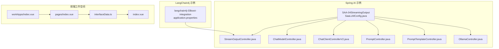
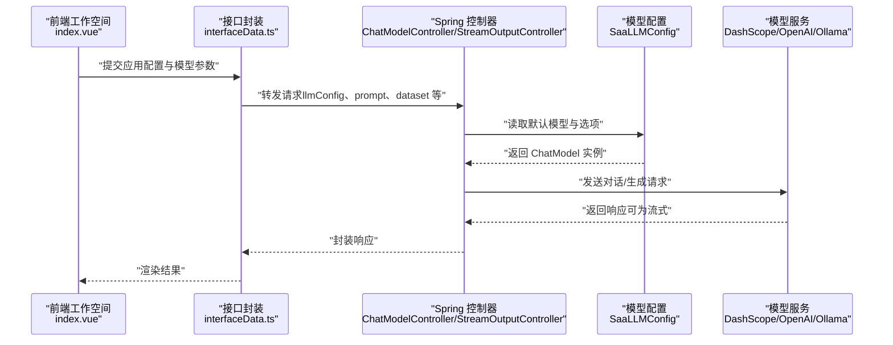
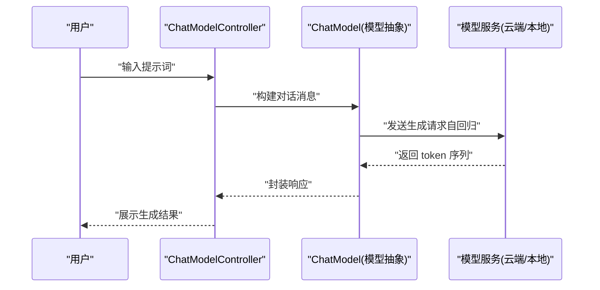
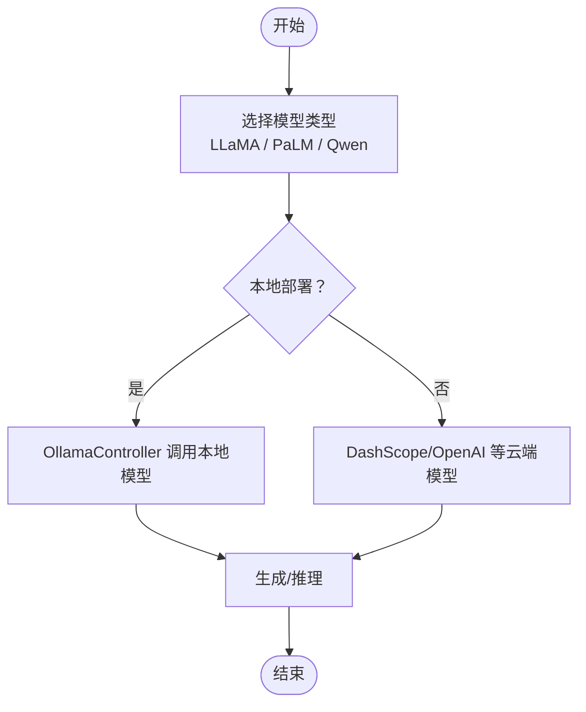
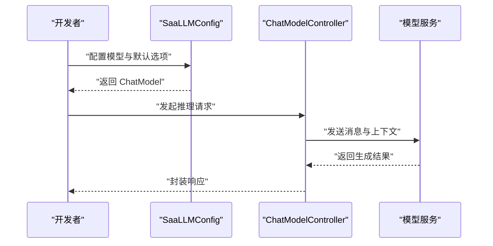
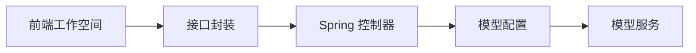

# 核心模型详解

<cite>
**本文引用的文件**
- [application.properties](file://【1】SpringAIAlibaba-atguiguV1/SAA-01HelloWorld/src/main/resources/application.properties)
- [application.properties](file://【1】SpringAIAlibaba-atguiguV1/SAA-02Ollama/src/main/resources/application.properties)
- [application.properties](file://【1】SpringAIAlibaba-atguiguV1/SAA-11Embed2vector/src/main/resources/application.properties)
- [application.properties](file://【1】SpringAIAlibaba-atguiguV1/SAA-12RAG4AiOps/src/main/resources/application.properties)
- [application.properties](file://【2】langchain4j-atguiguV5/langchain4j-03boot-integration/src/main/resources/application.properties)
- [SaaLLMConfig.java](file://【1】SpringAIAlibaba-atguiguV1/SAA-04StreamingOutput/src/main/java/com/atguigu/study/config/SaaLLMConfig.java)
- [SaaLLMConfig.java](file://【1】SpringAIAlibaba-atguiguV1/SAA-05Prompt/src/main/java/com/atguigu/study/config/SaaLLMConfig.java)
- [SaaLLMConfig.java](file://【1】SpringAIAlibaba-atguiguV1/SAA-06PromptTemplate/src/main/java/com/atguigu/study/config/SaaLLMConfig.java)
- [SaaLLMConfig.java](file://【1】SpringAIAlibaba-atguiguV1/SAA-07StructuredOutput/src/main/java/com/atguigu/study/config/SaaLLMConfig.java)
- [ChatModelController.java](file://【1】SpringAIAlibaba-atguiguV1/SAA-03ChatModelChatClient/src/main/java/com/atguigu/study/controller/ChatModelController.java)
- [ChatClientControllerV2.java](file://【1】SpringAIAlibaba-atguiguV1/SAA-03ChatModelChatClient/src/main/java/com/atguigu/study/controller/ChatClientControllerV2.java)
- [StreamOutputController.java](file://【1】SpringAIAlibaba-atguiguV1/SAA-04StreamingOutput/src/main/java/com/atguigu/study/controller/StreamOutputController.java)
- [PromptController.java](file://【1】SpringAIAlibaba-atguiguV1/SAA-05Prompt/src/main/java/com/atguigu/study/controller/PromptController.java)
- [PromptTemplateController.java](file://【1】SpringAIAlibaba-atguiguV1/SAA-06PromptTemplate/src/main/java/com/atguigu/study/controller/PromptTemplateController.java)
- [OllamaController.java](file://【1】SpringAIAlibaba-atguiguV1/SAA-02Ollama/src/main/java/com/atguigu/study/controller/OllamaController.java)
- [index.vue](file://【3】工作资料/code/仓颉智能体/nlp-frontend-web/src/views/workspace/pages/workApps/index.vue)
- [index.vue](file://【3】工作资料/code/仓颉智能体/nlp-frontend-web/src/views/workspace/pages/workApps/pages/index.vue)
- [interfaceData.ts](file://【3】工作资料/code/仓颉智能体/nlp-frontend-web/src/views/workspace/interfaceData.ts)
- [index.vue](file://【3】工作资料/code/仓颉智能体/nlp-frontend-web/src/views/workspace/index.vue)
</cite>

## 目录
1. [引言](#引言)
2. [项目结构](#项目结构)
3. [核心组件](#核心组件)
4. [架构总览](#架构总览)
5. [详细组件分析](#详细组件分析)
6. [依赖分析](#依赖分析)
7. [性能考量](#性能考量)
8. [故障排查指南](#故障排查指南)
9. [结论](#结论)
10. [附录](#附录)

## 引言
本文件围绕“核心模型详解”的目标，系统梳理并解释以下要点：
- BERT的双向编码器架构与预训练任务（Masked Language Model、Next Sentence Prediction）
- GPT系列的自回归生成机制（因果注意力掩码、生成式预训练策略）
- LLaMA、PaLM等现代大模型的技术特点与创新点
- 不同模型架构在参数规模、训练效率、推理速度等方面的差异与适用场景
- 基于仓库中的Spring AI与LangChain4j示例，给出模型加载、微调与推理的实践指引

为便于非专业读者理解，文档采用由浅入深的方式组织内容，并通过图示展示关键流程。

## 项目结构
该仓库包含两套与大模型相关的核心工程：
- Spring AI Alibaba 示例工程：覆盖从配置到控制器的完整链路，演示如何加载与调用多种模型（如DashScope/Qwen、OpenAI、Ollama），并支持流式输出、提示词工程、结构化输出等能力。
- LangChain4j 示例工程：以Boot集成方式接入多模型，演示统一的模型抽象与参数配置。
- 前端工作空间应用：展示如何在业务层进行模型配置持久化、工作流编排与发布。

**图示来源**
- [SaaLLMConfig.java:1-120](file://【1】SpringAIAlibaba-atguiguV1/SAA-04StreamingOutput/src/main/java/com/atguigu/study/config/SaaLLMConfig.java#L1-L120)
- [StreamOutputController.java:1-120](file://【1】SpringAIAlibaba-atguiguV1/SAA-04StreamingOutput/src/main/java/com/atguigu/study/controller/StreamOutputController.java#L1-L120)
- [ChatModelController.java:1-120](file://【1】SpringAIAlibaba-atguiguV1/SAA-03ChatModelChatClient/src/main/java/com/atguigu/study/controller/ChatModelController.java#L1-L120)
- [ChatClientControllerV2.java:1-120](file://【1】SpringAIAlibaba-atguiguV1/SAA-03ChatModelChatClient/src/main/java/com/atguigu/study/controller/ChatClientControllerV2.java#L1-L120)
- [PromptController.java:1-120](file://【1】SpringAIAlibaba-atguiguV1/SAA-05Prompt/src/main/java/com/atguigu/study/controller/PromptController.java#L1-L120)
- [PromptTemplateController.java:1-120](file://【1】SpringAIAlibaba-atguiguV1/SAA-06PromptTemplate/src/main/java/com/atguigu/study/controller/PromptTemplateController.java#L1-L120)
- [OllamaController.java:1-120](file://【1】SpringAIAlibaba-atguiguV1/SAA-02Ollama/src/main/java/com/atguigu/study/controller/OllamaController.java#L1-L120)
- [application.properties:1-20](file://【2】langchain4j-atguiguV5/langchain4j-03boot-integration/src/main/resources/application.properties#L1-L20)
- [index.vue:150-221](file://【3】工作资料/code/仓颉智能体/nlp-frontend-web/src/views/workspace/pages/workApps/index.vue#L150-L221)
- [index.vue:226-252](file://【3】工作资料/code/仓颉智能体/nlp-frontend-web/src/views/workspace/pages/workApps/pages/index.vue#L226-L252)
- [interfaceData.ts:1-54](file://【3】工作资料/code/仓颉智能体/nlp-frontend-web/src/views/workspace/interfaceData.ts#L1-L54)
- [index.vue:71-121](file://【3】工作资料/code/仓颉智能体/nlp-frontend-web/src/views/workspace/index.vue#L71-L121)

**章节来源**
- [application.properties:1-30](file://【1】SpringAIAlibaba-atguiguV1/SAA-01HelloWorld/src/main/resources/application.properties#L1-L30)
- [application.properties:1-20](file://【1】SpringAIAlibaba-atguiguV1/SAA-02Ollama/src/main/resources/application.properties#L1-L20)
- [application.properties:1-20](file://【1】SpringAIAlibaba-atguiguV1/SAA-11Embed2vector/src/main/resources/application.properties#L1-L20)
- [application.properties:1-20](file://【1】SpringAIAlibaba-atguiguV1/SAA-12RAG4AiOps/src/main/resources/application.properties#L1-L20)
- [application.properties:1-20](file://【2】langchain4j-atguiguV5/langchain4j-03boot-integration/src/main/resources/application.properties#L1-L20)

## 核心组件
- 模型配置与加载
  - Spring AI 配置：通过 application.properties 设置模型名称、基础URL、鉴权等；在 Java 配置类中定义 ChatModel Bean 并设置默认选项。
  - LangChain4j 配置：通过 application.properties 统一声明 OpenAI 的 API Key、模型名与 base-url，实现跨模块共享。
- 控制器与服务编排
  - ChatModelController、ChatClientControllerV2：演示一次性对话与多轮会话的调用方式。
  - StreamOutputController：演示流式输出，适合长文本生成与实时反馈。
  - PromptController、PromptTemplateController：演示提示词工程与模板化提示词的组织方式。
  - OllamaController：演示本地模型服务（如 Qwen）的对接。
- 前端工作空间
  - 工作区页面与应用卡片管理，支持知识问答、智能问数、对话流、工作流、智能体等应用类型。
  - 将模型配置（llmConfig、llmModelId）与业务配置（prompt、dataset、variable 等）持久化并参与编排。

**章节来源**
- [SaaLLMConfig.java:1-120](file://【1】SpringAIAlibaba-atguiguV1/SAA-04StreamingOutput/src/main/java/com/atguigu/study/config/SaaLLMConfig.java#L1-L120)
- [ChatModelController.java:1-120](file://【1】SpringAIAlibaba-atguiguV1/SAA-03ChatModelChatClient/src/main/java/com/atguigu/study/controller/ChatModelController.java#L1-L120)
- [ChatClientControllerV2.java:1-120](file://【1】SpringAIAlibaba-atguiguV1/SAA-03ChatModelChatClient/src/main/java/com/atguigu/study/controller/ChatClientControllerV2.java#L1-L120)
- [StreamOutputController.java:1-120](file://【1】SpringAIAlibaba-atguiguV1/SAA-04StreamingOutput/src/main/java/com/atguigu/study/controller/StreamOutputController.java#L1-L120)
- [PromptController.java:1-120](file://【1】SpringAIAlibaba-atguiguV1/SAA-05Prompt/src/main/java/com/atguigu/study/controller/PromptController.java#L1-L120)
- [PromptTemplateController.java:1-120](file://【1】SpringAIAlibaba-atguiguV1/SAA-06PromptTemplate/src/main/java/com/atguigu/study/controller/PromptTemplateController.java#L1-L120)
- [OllamaController.java:1-120](file://【1】SpringAIAlibaba-atguiguV1/SAA-02Ollama/src/main/java/com/atguigu/study/controller/OllamaController.java#L1-L120)
- [index.vue:150-221](file://【3】工作资料/code/仓颉智能体/nlp-frontend-web/src/views/workspace/pages/workApps/index.vue#L150-L221)
- [index.vue:226-252](file://【3】工作资料/code/仓颉智能体/nlp-frontend-web/src/views/workspace/pages/workApps/pages/index.vue#L226-L252)
- [interfaceData.ts:1-54](file://【3】工作资料/code/仓颉智能体/nlp-frontend-web/src/views/workspace/interfaceData.ts#L1-L54)

## 架构总览
下图展示了从前端到后端再到模型服务的整体调用链路，以及本地与云端两种部署形态：

**图示来源**
- [index.vue:150-221](file://【3】工作资料/code/仓颉智能体/nlp-frontend-web/src/views/workspace/pages/workApps/index.vue#L150-L221)
- [index.vue:226-252](file://【3】工作资料/code/仓颉智能体/nlp-frontend-web/src/views/workspace/pages/workApps/pages/index.vue#L226-L252)
- [interfaceData.ts:1-54](file://【3】工作资料/code/仓颉智能体/nlp-frontend-web/src/views/workspace/interfaceData.ts#L1-L54)
- [ChatModelController.java:1-120](file://【1】SpringAIAlibaba-atguiguV1/SAA-03ChatModelChatClient/src/main/java/com/atguigu/study/controller/ChatModelController.java#L1-L120)
- [StreamOutputController.java:1-120](file://【1】SpringAIAlibaba-atguiguV1/SAA-04StreamingOutput/src/main/java/com/atguigu/study/controller/StreamOutputController.java#L1-L120)
- [SaaLLMConfig.java:1-120](file://【1】SpringAIAlibaba-atguiguV1/SAA-04StreamingOutput/src/main/java/com/atguigu/study/config/SaaLLMConfig.java#L1-L120)

## 详细组件分析

### BERT：双向编码器与预训练任务
- 双向编码器架构
  - 通过上下文双向建模，使每个位置同时利用左、右两侧的信息，适用于理解类任务（如分类、序列标注）。
- 预训练任务
  - Masked Language Model（MLM）：随机遮蔽部分 token，训练模型预测被遮蔽位置，提升语言表示能力。
  - Next Sentence Prediction（NSP）：判断两个句子是否连续，增强对语义连贯性的理解。
- 适用场景
  - 文本分类、命名实体识别、自然语言推理等。
- 注意
  - 本仓库未直接包含 BERT 训练/推理代码，但可基于 Spring AI 的 ChatModel 抽象加载 DashScope/Qwen 等模型作为替代方案。

**章节来源**
- [application.properties:1-30](file://【1】SpringAIAlibaba-atguiguV1/SAA-01HelloWorld/src/main/resources/application.properties#L1-L30)

### GPT 系列：自回归生成与因果掩码
- 自回归生成机制
  - 在生成第 t 个 token 时，仅依赖前 t-1 个 token，确保生成过程的时序性与因果性。
- 因果注意力掩码
  - 通过掩码阻止关注未来位置，保证解码时的单向依赖。
- 生成式预训练策略
  - 以语言建模为主，最大化对下一个 token 的条件概率，从而获得强大的生成能力。
- 适用场景
  - 文本续写、摘要、对话、创意写作等。
- 在本仓库中的体现
  - 通过 ChatModelController 与 StreamOutputController 展示一次性与流式生成调用；SaaLLMConfig 中设置默认模型与选项。

**图示来源**
- [ChatModelController.java:1-120](file://【1】SpringAIAlibaba-atguiguV1/SAA-03ChatModelChatClient/src/main/java/com/atguigu/study/controller/ChatModelController.java#L1-L120)
- [SaaLLMConfig.java:1-120](file://【1】SpringAIAlibaba-atguiguV1/SAA-04StreamingOutput/src/main/java/com/atguigu/study/config/SaaLLMConfig.java#L1-L120)

**章节来源**
- [ChatModelController.java:1-120](file://【1】SpringAIAlibaba-atguiguV1/SAA-03ChatModelChatClient/src/main/java/com/atguigu/study/controller/ChatModelController.java#L1-L120)
- [StreamOutputController.java:1-120](file://【1】SpringAIAlibaba-atguiguV1/SAA-04StreamingOutput/src/main/java/com/atguigu/study/controller/StreamOutputController.java#L1-L120)
- [SaaLLMConfig.java:1-120](file://【1】SpringAIAlibaba-atguiguV1/SAA-04StreamingOutput/src/main/java/com/atguigu/study/config/SaaLLMConfig.java#L1-L120)

### LLaMA、PaLM 等现代大模型：技术特点与创新
- LLaMA 系列
  - 开放参数规模，强调高效训练与部署；通过优化 RoPE、SwiGLU 激活等提升性能。
- PaLM 等模型
  - 更大规模参数与更丰富的指令遵循能力；在多任务与零样本泛化方面表现突出。
- 创新点
  - 更高效的注意力实现（如 FlashAttention）、更好的指令微调策略、更强的多语言与多任务能力。
- 在本仓库中的体现
  - 通过 OllamaController 展示本地模型服务对接；通过 SaaLLMConfig 设置模型名称与选项。

**图示来源**
- [OllamaController.java:1-120](file://【1】SpringAIAlibaba-atguiguV1/SAA-02Ollama/src/main/java/com/atguigu/study/controller/OllamaController.java#L1-L120)
- [SaaLLMConfig.java:1-120](file://【1】SpringAIAlibaba-atguiguV1/SAA-04StreamingOutput/src/main/java/com/atguigu/study/config/SaaLLMConfig.java#L1-L120)

**章节来源**
- [OllamaController.java:1-120](file://【1】SpringAIAlibaba-atguiguV1/SAA-02Ollama/src/main/java/com/atguigu/study/controller/OllamaController.java#L1-L120)
- [application.properties:1-20](file://【1】SpringAIAlibaba-atguiguV1/SAA-02Ollama/src/main/resources/application.properties#L1-L20)

### 模型选择指南（参数规模/训练效率/推理速度）
- 参数规模
  - 小模型（<10B）：适合边缘部署与低延迟场景；资源占用小，但表达能力有限。
  - 中型模型（10B~30B）：平衡成本与效果，适合多数企业级应用。
  - 大模型（>30B）：更强的生成与理解能力，但对硬件与显存要求高。
- 训练效率
  - 关注数据并行、流水线并行与混合精度；现代模型普遍采用更高效的优化器与调度策略。
- 推理速度
  - 关注 KV 缓存、分片推理、量化与编译优化；流式输出可显著改善交互体验。
- 本仓库实践建议
  - 使用 SaaLLMConfig 统一管理模型选项；通过 StreamOutputController 进行流式生成以降低首 Token 延迟。
  - 在前端工作空间中持久化 llmConfig 与业务配置，便于复现与回滚。

**章节来源**
- [SaaLLMConfig.java:1-120](file://【1】SpringAIAlibaba-atguiguV1/SAA-04StreamingOutput/src/main/java/com/atguigu/study/config/SaaLLMConfig.java#L1-L120)
- [StreamOutputController.java:1-120](file://【1】SpringAIAlibaba-atguiguV1/SAA-04StreamingOutput/src/main/java/com/atguigu/study/controller/StreamOutputController.java#L1-L120)
- [index.vue:226-252](file://【3】工作资料/code/仓颉智能体/nlp-frontend-web/src/views/workspace/pages/workApps/pages/index.vue#L226-L252)

### 加载、微调与推理（结合代码示例）
- 加载模型
  - 在 application.properties 中设置模型名称与基础 URL；在 SaaLLMConfig 中构建 ChatModel Bean。
- 微调
  - 本仓库未直接提供微调脚本；可在 ChatModelController 中扩展训练数据准备与调用流程。
- 推理
  - 一次性对话：ChatModelController
  - 流式输出：StreamOutputController
  - 提示词工程：PromptController、PromptTemplateController
  - 本地模型：OllamaController

**图示来源**
- [SaaLLMConfig.java:1-120](file://【1】SpringAIAlibaba-atguiguV1/SAA-04StreamingOutput/src/main/java/com/atguigu/study/config/SaaLLMConfig.java#L1-L120)
- [ChatModelController.java:1-120](file://【1】SpringAIAlibaba-atguiguV1/SAA-03ChatModelChatClient/src/main/java/com/atguigu/study/controller/ChatModelController.java#L1-L120)

**章节来源**
- [application.properties:1-30](file://【1】SpringAIAlibaba-atguiguV1/SAA-01HelloWorld/src/main/resources/application.properties#L1-L30)
- [SaaLLMConfig.java:1-120](file://【1】SpringAIAlibaba-atguiguV1/SAA-04StreamingOutput/src/main/java/com/atguigu/study/config/SaaLLMConfig.java#L1-L120)
- [ChatModelController.java:1-120](file://【1】SpringAIAlibaba-atguiguV1/SAA-03ChatModelChatClient/src/main/java/com/atguigu/study/controller/ChatModelController.java#L1-L120)
- [StreamOutputController.java:1-120](file://【1】SpringAIAlibaba-atguiguV1/SAA-04StreamingOutput/src/main/java/com/atguigu/study/controller/StreamOutputController.java#L1-L120)
- [PromptController.java:1-120](file://【1】SpringAIAlibaba-atguiguV1/SAA-05Prompt/src/main/java/com/atguigu/study/controller/PromptController.java#L1-L120)
- [PromptTemplateController.java:1-120](file://【1】SpringAIAlibaba-atguiguV1/SAA-06PromptTemplate/src/main/java/com/atguigu/study/controller/PromptTemplateController.java#L1-L120)
- [OllamaController.java:1-120](file://【1】SpringAIAlibaba-atguiguV1/SAA-02Ollama/src/main/java/com/atguigu/study/controller/OllamaController.java#L1-L120)

## 依赖分析
- 组件耦合
  - 控制器依赖配置类提供的 ChatModel；前端通过接口封装与后端交互。
- 外部依赖
  - DashScope、OpenAI、Ollama 等模型服务；LangChain4j 提供统一的模型抽象。
- 潜在循环依赖
  - 本仓库未发现直接循环依赖；建议保持配置类与控制器的单向依赖。

**图示来源**
- [interfaceData.ts:1-54](file://【3】工作资料/code/仓颉智能体/nlp-frontend-web/src/views/workspace/interfaceData.ts#L1-L54)
- [ChatModelController.java:1-120](file://【1】SpringAIAlibaba-atguiguV1/SAA-03ChatModelChatClient/src/main/java/com/atguigu/study/controller/ChatModelController.java#L1-L120)
- [SaaLLMConfig.java:1-120](file://【1】SpringAIAlibaba-atguiguV1/SAA-04StreamingOutput/src/main/java/com/atguigu/study/config/SaaLLMConfig.java#L1-L120)

**章节来源**
- [application.properties:1-20](file://【2】langchain4j-atguiguV5/langchain4j-03boot-integration/src/main/resources/application.properties#L1-L20)
- [index.vue:150-221](file://【3】工作资料/code/仓颉智能体/nlp-frontend-web/src/views/workspace/pages/workApps/index.vue#L150-L221)

## 性能考量
- 训练效率
  - 数据并行与流水线并行；混合精度与梯度累积；优化器与学习率调度。
- 推理速度
  - KV 缓存复用；分片与量化；编译优化（如 Ahead-of-Time 编译）；流式输出降低首 Token 延迟。
- 本仓库实践
  - 使用流式输出控制器提升交互体验；在前端持久化配置以便快速回放与复现。

**章节来源**
- [StreamOutputController.java:1-120](file://【1】SpringAIAlibaba-atguiguV1/SAA-04StreamingOutput/src/main/java/com/atguigu/study/controller/StreamOutputController.java#L1-L120)
- [index.vue:226-252](file://【3】工作资料/code/仓颉智能体/nlp-frontend-web/src/views/workspace/pages/workApps/pages/index.vue#L226-L252)

## 故障排查指南
- 模型不可用或鉴权失败
  - 检查 application.properties 中的模型名、基础 URL 与 API Key 是否正确。
- 本地模型无法连接
  - 检查 Ollama 服务状态与模型镜像是否拉取完成。
- 流式输出异常
  - 确认控制器中对 ChatModel 的调用与响应封装逻辑；检查网络与超时设置。
- 前端配置未生效
  - 确认 llmConfig 与业务配置已正确持久化并在编排时读取。

**章节来源**
- [application.properties:1-30](file://【1】SpringAIAlibaba-atguiguV1/SAA-01HelloWorld/src/main/resources/application.properties#L1-L30)
- [application.properties:1-20](file://【1】SpringAIAlibaba-atguiguV1/SAA-02Ollama/src/main/resources/application.properties#L1-L20)
- [OllamaController.java:1-120](file://【1】SpringAIAlibaba-atguiguV1/SAA-02Ollama/src/main/java/com/atguigu/study/controller/OllamaController.java#L1-L120)
- [StreamOutputController.java:1-120](file://【1】SpringAIAlibaba-atguiguV1/SAA-04StreamingOutput/src/main/java/com/atguigu/study/controller/StreamOutputController.java#L1-L120)
- [index.vue:226-252](file://【3】工作资料/code/仓颉智能体/nlp-frontend-web/src/views/workspace/pages/workApps/pages/index.vue#L226-L252)

## 结论
本仓库提供了从配置、控制器到前端编排的完整链路，能够支撑多种模型（云端与本地）的加载、微调与推理。结合 BERT、GPT、LLaMA、PaLM 等模型的特点，开发者可根据任务类型、资源约束与性能目标选择合适方案，并通过流式输出与配置持久化提升用户体验与可维护性。

## 附录
- 相关文件路径与用途概览
  - application.properties：模型服务配置（模型名、基础 URL、API Key）
  - SaaLLMConfig.java：ChatModel Bean 定义与默认选项
  - 控制器类：ChatModelController、StreamOutputController、PromptController、PromptTemplateController、OllamaController
  - 前端工作空间：index.vue、pages/index.vue、interfaceData.ts

**章节来源**
- [application.properties:1-20](file://【1】SpringAIAlibaba-atguiguV1/SAA-11Embed2vector/src/main/resources/application.properties#L1-L20)
- [application.properties:1-20](file://【1】SpringAIAlibaba-atguiguV1/SAA-12RAG4AiOps/src/main/resources/application.properties#L1-L20)
- [application.properties:1-20](file://【2】langchain4j-atguiguV5/langchain4j-03boot-integration/src/main/resources/application.properties#L1-L20)
- [index.vue:71-121](file://【3】工作资料/code/仓颉智能体/nlp-frontend-web/src/views/workspace/index.vue#L71-L121)