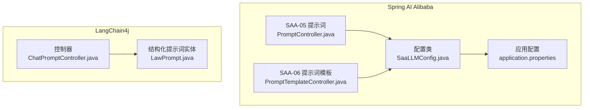
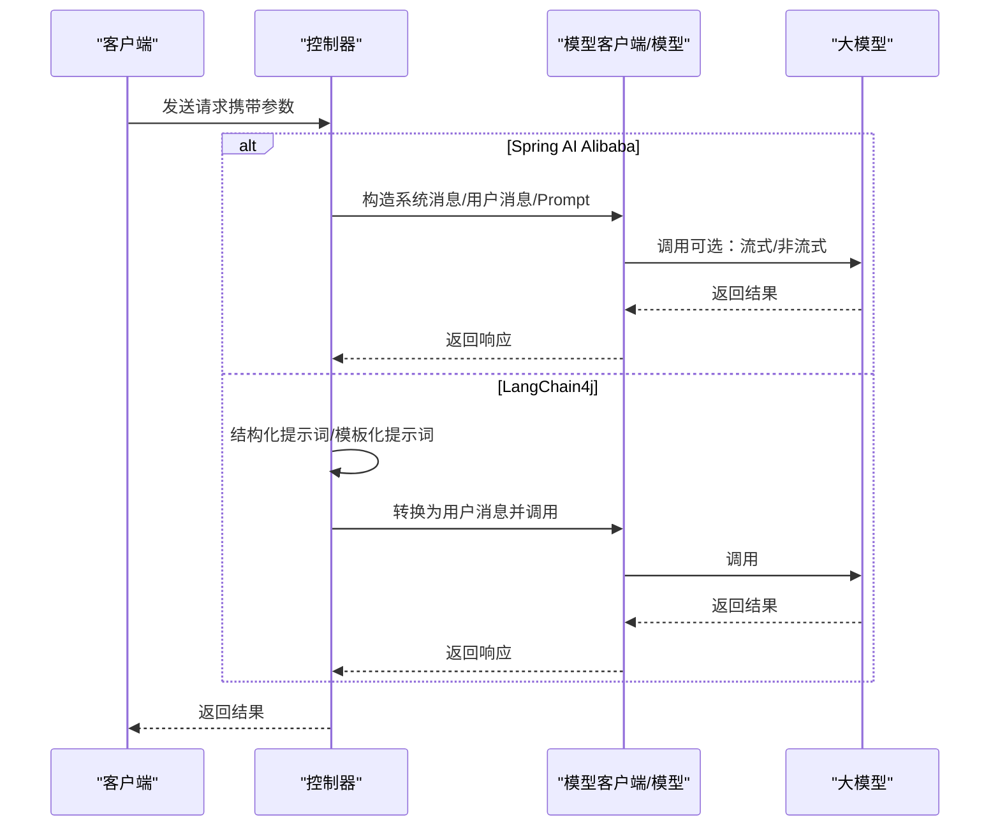
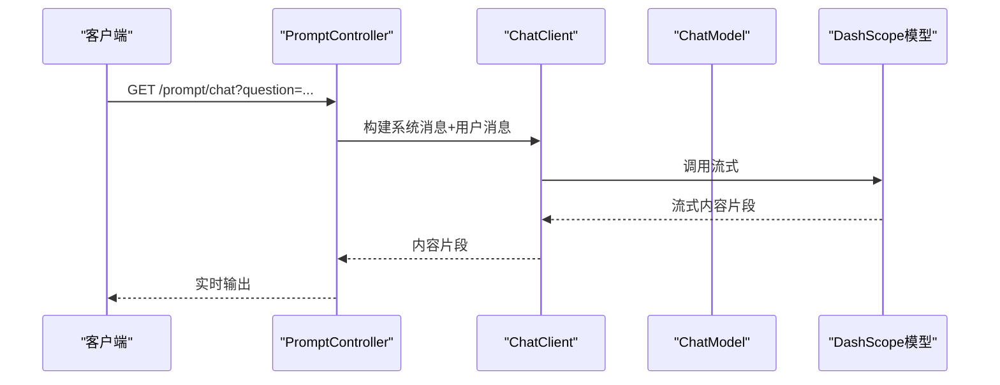
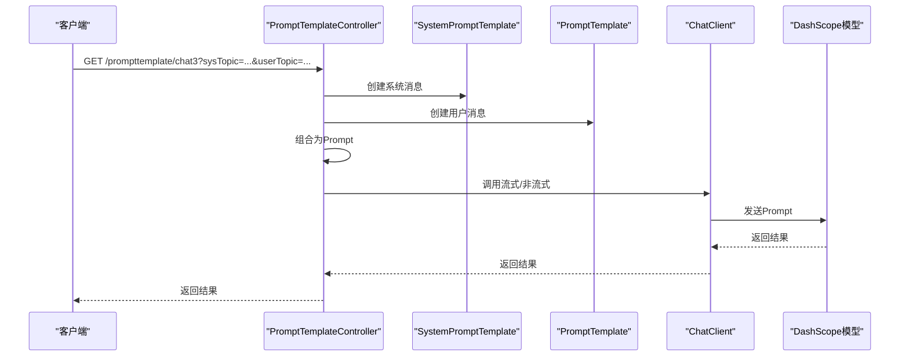
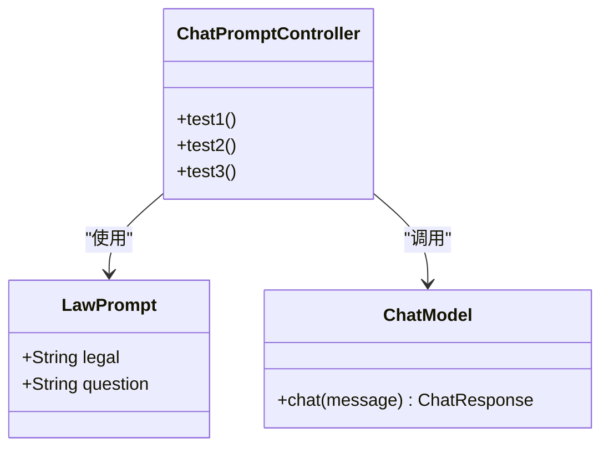
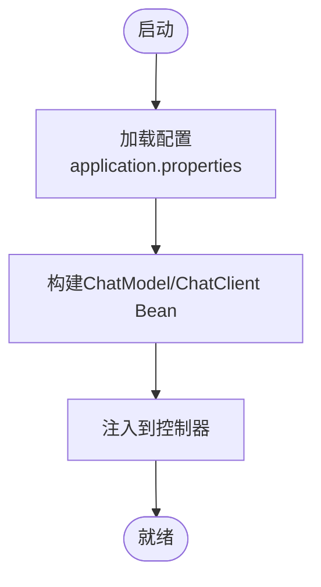
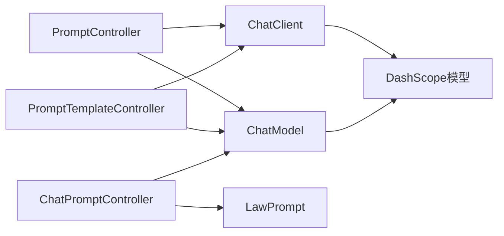

# 提示词工程

<cite>
**本文引用的文件**
- [PromptController.java](file://【1】SpringAIAlibaba-atguiguV1/SAA-05Prompt/src/main/java/com/atguigu/study/controller/PromptController.java)
- [SaaLLMConfig.java](file://【1】SpringAIAlibaba-atguiguV1/SAA-05Prompt/src/main/java/com/atguigu/study/config/SaaLLMConfig.java)
- [application.properties](file://【1】SpringAIAlibaba-atguiguV1/SAA-05Prompt/src/main/resources/application.properties)
- [PromptTemplateController.java](file://【1】SpringAIAlibaba-atguiguV1/SAA-06PromptTemplate/src/main/java/com/atguigu/study/controller/PromptTemplateController.java)
- [SaaLLMConfig.java](file://【1】SpringAIAlibaba-atguiguV1/SAA-06PromptTemplate/src/main/java/com/atguigu/study/config/SaaLLMConfig.java)
- [ChatPromptController.java](file://【2】langchain4j-atguiguV5/langchain4j-09chat-prompt/src/main/java/com/atguigu/study/controller/ChatPromptController.java)
- [LawPrompt.java](file://【2】langchain4j-atguiguV5/langchain4j-09chat-prompt/src/main/java/com/atguigu/study/entities/LawPrompt.java)
</cite>

## 目录
1. [引言](#引言)
2. [项目结构](#项目结构)
3. [核心组件](#核心组件)
4. [架构总览](#架构总览)
5. [详细组件分析](#详细组件分析)
6. [依赖分析](#依赖分析)
7. [性能考量](#性能考量)
8. [故障排查指南](#故障排查指南)
9. [结论](#结论)
10. [附录](#附录)

## 引言
本学习材料围绕提示词工程展开，系统性介绍提示词的基本概念、设计原则与优化策略，并结合 Spring AI Alibaba 与 LangChain4j 的实际项目，演示如何从基础提示词编写到高级提示词优化，逐步构建高质量提示词以提升大模型的性能与稳定性。内容覆盖提示词设计方法、使用案例与安全考虑，帮助读者建立完整的提示词技能体系。

## 项目结构
本仓库包含两套提示词实践项目：
- Spring AI Alibaba 示例（SAA-05、SAA-06）：聚焦提示词与提示词模板的基础与进阶用法，展示系统消息、用户消息、模板化提示词与流式输出等能力。
- LangChain4j 示例（langchain4j-09）：聚焦结构化提示词与实体驱动的提示词设计，演示基于注解的结构化提示词与模板化提示词的组合使用。

**图示来源**
- [PromptController.java:1-147](file://【1】SpringAIAlibaba-atguiguV1/SAA-05Prompt/src/main/java/com/atguigu/study/controller/PromptController.java#L1-L147)
- [PromptTemplateController.java:1-157](file://【1】SpringAIAlibaba-atguiguV1/SAA-06PromptTemplate/src/main/java/com/atguigu/study/controller/PromptTemplateController.java#L1-L157)
- [SaaLLMConfig.java:1-76](file://【1】SpringAIAlibaba-atguiguV1/SAA-05Prompt/src/main/java/com/atguigu/study/config/SaaLLMConfig.java#L1-L76)
- [application.properties:1-12](file://【1】SpringAIAlibaba-atguiguV1/SAA-05Prompt/src/main/resources/application.properties#L1-L12)
- [ChatPromptController.java:1-106](file://【2】langchain4j-atguiguV5/langchain4j-09chat-prompt/src/main/java/com/atguigu/study/controller/ChatPromptController.java#L1-L106)
- [LawPrompt.java:1-18](file://【2】langchain4j-atguiguV5/langchain4j-09chat-prompt/src/main/java/com/atguigu/study/entities/LawPrompt.java#L1-L18)

**章节来源**
- [PromptController.java:1-147](file://【1】SpringAIAlibaba-atguiguV1/SAA-05Prompt/src/main/java/com/atguigu/study/controller/PromptController.java#L1-L147)
- [PromptTemplateController.java:1-157](file://【1】SpringAIAlibaba-atguiguV1/SAA-06PromptTemplate/src/main/java/com/atguigu/study/controller/PromptTemplateController.java#L1-L157)
- [SaaLLMConfig.java:1-76](file://【1】SpringAIAlibaba-atguiguV1/SAA-05Prompt/src/main/java/com/atguigu/study/config/SaaLLMConfig.java#L1-L76)
- [application.properties:1-12](file://【1】SpringAIAlibaba-atguiguV1/SAA-05Prompt/src/main/resources/application.properties#L1-L12)
- [ChatPromptController.java:1-106](file://【2】langchain4j-atguiguV5/langchain4j-09chat-prompt/src/main/java/com/atguigu/study/controller/ChatPromptController.java#L1-L106)
- [LawPrompt.java:1-18](file://【2】langchain4j-atguiguV5/langchain4j-09chat-prompt/src/main/java/com/atguigu/study/entities/LawPrompt.java#L1-L18)

## 核心组件
- 提示词控制器（Spring AI Alibaba）
  - SAA-05：演示系统消息与用户消息组合、直接调用 ChatClient 与 ChatModel、流式输出与非流式输出、工具响应消息拼接等。
  - SAA-06：演示 PromptTemplate 与 SystemPromptTemplate 的使用、模板文件加载、多消息组合与不同调用方式。
- 配置类（Spring AI Alibaba）
  - 定义 DashScope ChatModel 与 ChatClient Bean，支持多模型并存与默认选项配置。
- 控制器与实体（LangChain4j）
  - ChatPromptController：展示结构化提示词实体与模板化提示词的组合使用，以及将提示词转换为用户消息并调用模型。
  - LawPrompt：基于注解的结构化提示词实体，简化提示词参数化。

**章节来源**
- [PromptController.java:38-145](file://【1】SpringAIAlibaba-atguiguV1/SAA-05Prompt/src/main/java/com/atguigu/study/controller/PromptController.java#L38-L145)
- [PromptTemplateController.java:44-155](file://【1】SpringAIAlibaba-atguiguV1/SAA-06PromptTemplate/src/main/java/com/atguigu/study/controller/PromptTemplateController.java#L44-L155)
- [SaaLLMConfig.java:22-75](file://【1】SpringAIAlibaba-atguiguV1/SAA-05Prompt/src/main/java/com/atguigu/study/config/SaaLLMConfig.java#L22-L75)
- [ChatPromptController.java:34-104](file://【2】langchain4j-atguiguV5/langchain4j-09chat-prompt/src/main/java/com/atguigu/study/controller/ChatPromptController.java#L34-L104)
- [LawPrompt.java:11-17](file://【2】langchain4j-atguiguV5/langchain4j-09chat-prompt/src/main/java/com/atguigu/study/entities/LawPrompt.java#L11-L17)

## 架构总览
下图展示了两类项目的典型提示词调用路径：Spring AI Alibaba 通过 ChatClient 或 ChatModel 直接构造提示词；LangChain4j 通过结构化提示词实体或模板化提示词生成用户消息后调用模型。

**图示来源**
- [PromptController.java:38-145](file://【1】SpringAIAlibaba-atguiguV1/SAA-05Prompt/src/main/java/com/atguigu/study/controller/PromptController.java#L38-L145)
- [PromptTemplateController.java:44-155](file://【1】SpringAIAlibaba-atguiguV1/SAA-06PromptTemplate/src/main/java/com/atguigu/study/controller/PromptTemplateController.java#L44-L155)
- [ChatPromptController.java:34-104](file://【2】langchain4j-atguiguV5/langchain4j-09chat-prompt/src/main/java/com/atguigu/study/controller/ChatPromptController.java#L34-L104)

## 详细组件分析

### 组件A：Spring AI Alibaba 提示词控制器（SAA-05）
- 功能要点
  - 系统消息与用户消息组合：通过 ChatClient 的链式 API 设置系统消息与用户消息，实现行为约束与主题输入。
  - 直接调用 ChatModel 与 ChatClient：支持流式输出与非流式输出两种模式，便于对比不同场景下的性能与体验。
  - 工具响应消息拼接：模拟工具调用后的结果拼接到最终输出中，体现提示词在工具协作场景中的作用。
- 设计原则
  - 行为边界明确：系统消息用于限定 AI 的职责范围与输出格式，避免无关话题与格式偏差。
  - 参数化与可扩展：通过资源注入与配置类统一管理模型实例，便于切换与扩展。
- 优化策略
  - 输出格式约束：在系统消息中明确输出格式（如 HTML），减少后处理成本。
  - 字数控制：在系统消息中限制输出长度，提升用户体验与成本控制。
  - 流式输出：在长文本或实时交互场景优先采用流式输出，改善延迟与交互体验。

**图示来源**
- [PromptController.java:38-48](file://【1】SpringAIAlibaba-atguiguV1/SAA-05Prompt/src/main/java/com/atguigu/study/controller/PromptController.java#L38-L48)

**章节来源**
- [PromptController.java:38-145](file://【1】SpringAIAlibaba-atguiguV1/SAA-05Prompt/src/main/java/com/atguigu/study/controller/PromptController.java#L38-L145)

### 组件B：Spring AI Alibaba 提示词模板控制器（SAA-06）
- 功能要点
  - PromptTemplate 与 SystemPromptTemplate：通过占位符实现模板化提示词，支持从外部资源文件加载模板。
  - 多消息组合：将系统消息与用户消息组合为 Prompt，统一传入模型。
  - 角色设定：通过系统消息实现“角色扮演”，限定 AI 的专业领域与输出风格。
- 设计原则
  - 模板化与参数化：将可变参数与固定模板分离，提升复用性与可维护性。
  - 分层设计：系统消息负责规则与边界，用户消息负责具体问题，确保提示词清晰分层。
- 优化策略
  - 模板文件化：将复杂提示词放入独立文件，便于版本管理与团队协作。
  - 多模型适配：通过配置类统一管理多个模型实例，按需选择最优模型。

**图示来源**
- [PromptTemplateController.java:101-114](file://【1】SpringAIAlibaba-atguiguV1/SAA-06PromptTemplate/src/main/java/com/atguigu/study/controller/PromptTemplateController.java#L101-L114)

**章节来源**
- [PromptTemplateController.java:44-155](file://【1】SpringAIAlibaba-atguiguV1/SAA-06PromptTemplate/src/main/java/com/atguigu/study/controller/PromptTemplateController.java#L44-L155)

### 组件C：LangChain4j 结构化提示词（langchain4j-09）
- 功能要点
  - 结构化提示词实体：通过注解定义提示词模板，自动绑定字段，降低模板拼接复杂度。
  - 模板化提示词：支持字符串模板与占位符，灵活适配不同场景。
  - 用户消息转换：将提示词转换为用户消息后调用模型，统一消息格式。
- 设计原则
  - 数据驱动：以实体或模板为中心，参数化提示词，提升可读性与可测试性。
  - 明确边界：通过结构化提示词限定上下文与输出，减少歧义。
- 优化策略
  - 注解化模板：利用注解定义结构化提示词，减少样板代码。
  - 模板复用：将常用提示词抽象为模板，提升团队协作效率。

**图示来源**
- [LawPrompt.java:11-17](file://【2】langchain4j-atguiguV5/langchain4j-09chat-prompt/src/main/java/com/atguigu/study/entities/LawPrompt.java#L11-L17)
- [ChatPromptController.java:25-104](file://【2】langchain4j-atguiguV5/langchain4j-09chat-prompt/src/main/java/com/atguigu/study/controller/ChatPromptController.java#L25-L104)

**章节来源**
- [ChatPromptController.java:34-104](file://【2】langchain4j-atguiguV5/langchain4j-09chat-prompt/src/main/java/com/atguigu/study/controller/ChatPromptController.java#L34-L104)
- [LawPrompt.java:11-17](file://【2】langchain4j-atguiguV5/langchain4j-09chat-prompt/src/main/java/com/atguigu/study/entities/LawPrompt.java#L11-L17)

### 组件D：配置与模型管理（Spring AI Alibaba）
- 功能要点
  - 多模型 Bean 定义：通过配置类注册 DashScope ChatModel 与 ChatClient，支持不同模型实例并存。
  - 默认选项配置：统一设置模型名称与默认参数，便于全局一致性。
  - API Key 管理：从配置文件读取密钥，避免硬编码。
- 设计原则
  - 可替换性：通过 Bean 名称与 Qualifier 实现模型切换与扩展。
  - 配置集中化：将密钥与模型参数集中管理，便于运维与安全控制。
- 优化策略
  - 环境隔离：区分开发、测试、生产环境的配置，避免误用。
  - 参数化：将模型名称与参数抽取为配置项，便于动态调整。

**图示来源**
- [SaaLLMConfig.java:22-75](file://【1】SpringAIAlibaba-atguiguV1/SAA-05Prompt/src/main/java/com/atguigu/study/config/SaaLLMConfig.java#L22-L75)
- [application.properties:10-12](file://【1】SpringAIAlibaba-atguiguV1/SAA-05Prompt/src/main/resources/application.properties#L10-L12)

**章节来源**
- [SaaLLMConfig.java:19-76](file://【1】SpringAIAlibaba-atguiguV1/SAA-05Prompt/src/main/java/com/atguigu/study/config/SaaLLMConfig.java#L19-L76)
- [application.properties:1-12](file://【1】SpringAIAlibaba-atguiguV1/SAA-05Prompt/src/main/resources/application.properties#L1-L12)

## 依赖分析
- 组件耦合
  - 控制器依赖 ChatClient/ChatModel 与配置类，形成清晰的控制层与基础设施层分离。
  - LangChain4j 的控制器依赖结构化提示词实体与 ChatModel，强调数据驱动与模板化。
- 外部依赖
  - DashScope API：通过 ChatModel 与 ChatClient 访问大模型服务。
  - Hutool 时间工具：用于日志时间戳输出（LangChain4j 示例）。
- 潜在风险
  - API Key 泄露：需确保配置文件安全与最小权限原则。
  - 模板参数缺失：模板占位符未正确填充可能导致调用失败，应加入参数校验与默认值处理。

**图示来源**
- [PromptController.java:26-34](file://【1】SpringAIAlibaba-atguiguV1/SAA-05Prompt/src/main/java/com/atguigu/study/controller/PromptController.java#L26-L34)
- [PromptTemplateController.java:28-36](file://【1】SpringAIAlibaba-atguiguV1/SAA-06PromptTemplate/src/main/java/com/atguigu/study/controller/PromptTemplateController.java#L28-L36)
- [ChatPromptController.java:29-32](file://【2】langchain4j-atguiguV5/langchain4j-09chat-prompt/src/main/java/com/atguigu/study/controller/ChatPromptController.java#L29-L32)

**章节来源**
- [PromptController.java:26-34](file://【1】SpringAIAlibaba-atguiguV1/SAA-05Prompt/src/main/java/com/atguigu/study/controller/PromptController.java#L26-L34)
- [PromptTemplateController.java:28-36](file://【1】SpringAIAlibaba-atguiguV1/SAA-06PromptTemplate/src/main/java/com/atguigu/study/controller/PromptTemplateController.java#L28-L36)
- [ChatPromptController.java:29-32](file://【2】langchain4j-atguiguV5/langchain4j-09chat-prompt/src/main/java/com/atguigu/study/controller/ChatPromptController.java#L29-L32)

## 性能考量
- 流式输出优先：在长文本与实时交互场景优先采用流式输出，降低首字节延迟与提升用户体验。
- 模板化与参数化：通过模板与参数分离减少重复计算与字符串拼接开销。
- 模型选择与参数：根据任务特性选择合适模型与参数（如温度、最大生成长度），平衡质量与成本。
- 缓存与去重：对相同提示词的重复请求进行缓存，减少模型调用次数。

## 故障排查指南
- 系统消息未生效
  - 检查系统消息是否正确设置并在 Prompt 中处于首位，确保其优先级高于用户消息。
  - 确认 ChatClient/ChatModel 的调用顺序与参数传递无误。
- 模板参数缺失
  - 确保模板占位符与传入参数键名一致，必要时添加默认值与校验。
  - 对模板文件加载失败的情况，检查资源路径与文件存在性。
- 输出格式不符合预期
  - 在系统消息中明确输出格式（如 HTML、JSON），并在调用后进行必要的格式化或清洗。
- API Key 错误
  - 检查配置文件中的密钥是否正确，确认网络连通性与限流策略。

**章节来源**
- [PromptController.java:42-47](file://【1】SpringAIAlibaba-atguiguV1/SAA-05Prompt/src/main/java/com/atguigu/study/controller/PromptController.java#L42-L47)
- [PromptTemplateController.java:57-68](file://【1】SpringAIAlibaba-atguiguV1/SAA-06PromptTemplate/src/main/java/com/atguigu/study/controller/PromptTemplateController.java#L57-L68)
- [application.properties:10-12](file://【1】SpringAIAlibaba-atguiguV1/SAA-05Prompt/src/main/resources/application.properties#L10-L12)

## 结论
通过 Spring AI Alibaba 与 LangChain4j 的实践案例，我们系统地学习了提示词从基础到进阶的设计与优化方法。建议在实际项目中遵循“行为边界明确、模板化与参数化、流式输出优先、安全与可维护”的原则，持续迭代提示词以提升模型性能与稳定性。

## 附录
- 学习路径建议
  - 基础阶段：掌握系统消息与用户消息、流式输出与非流式输出。
  - 进阶阶段：引入提示词模板与模板文件，实现参数化与复用。
  - 高级阶段：结合结构化提示词与实体驱动，探索工具调用与多轮对话。
- 安全与合规
  - 明确 AI 的职责边界，避免生成敏感或不当内容。
  - 对输出进行合规性校验与二次处理，确保符合业务场景。