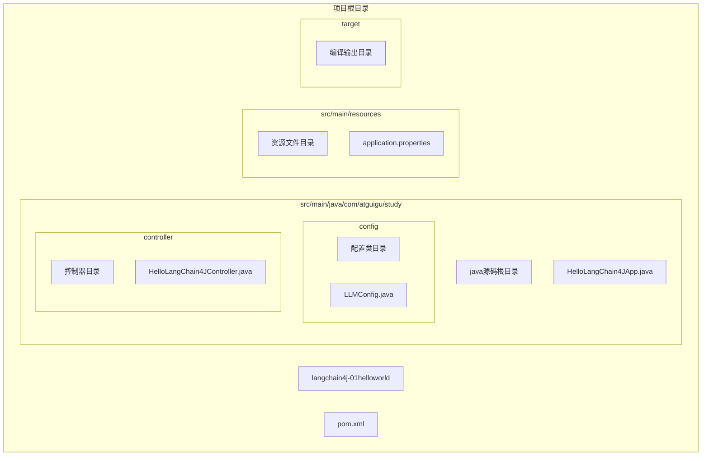
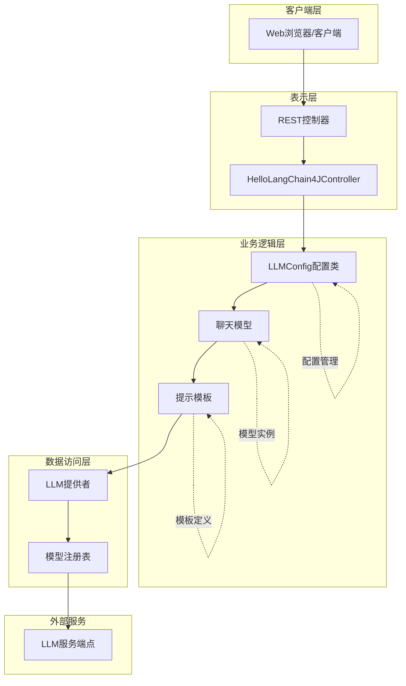
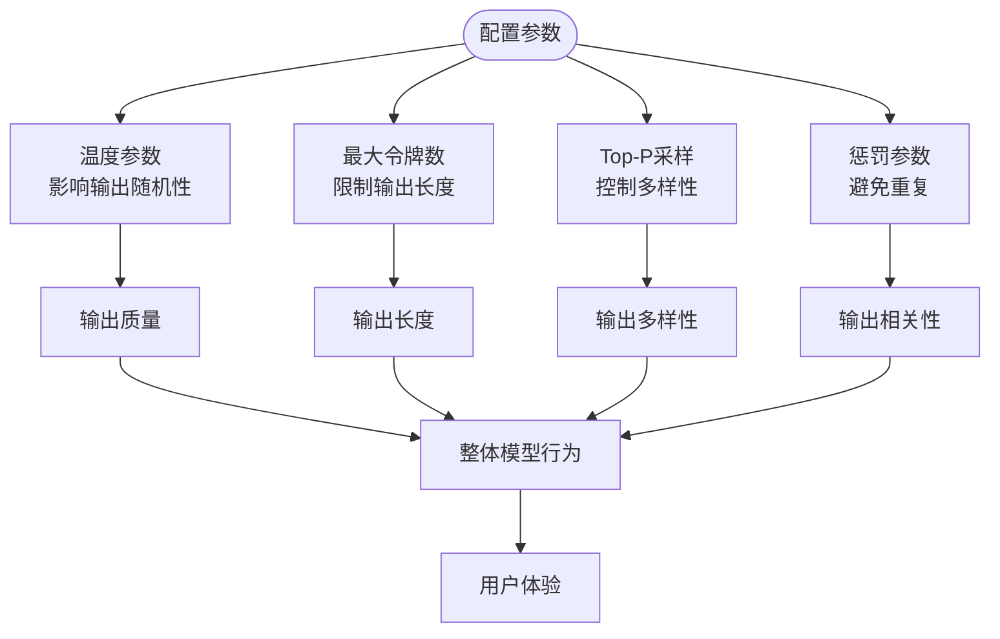
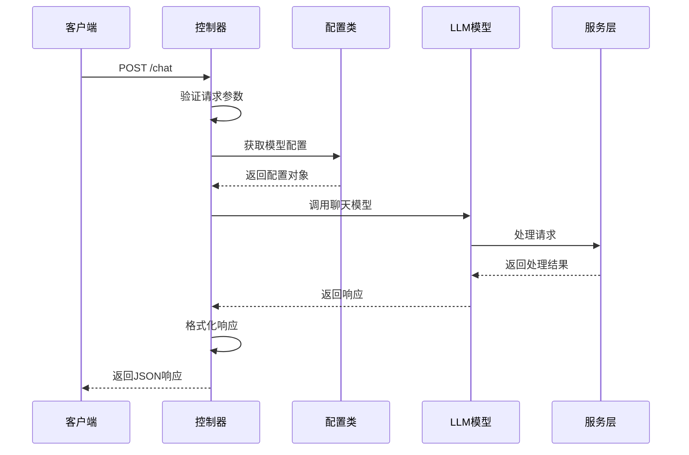
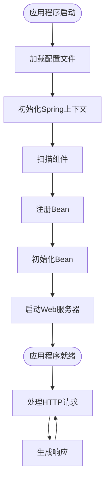
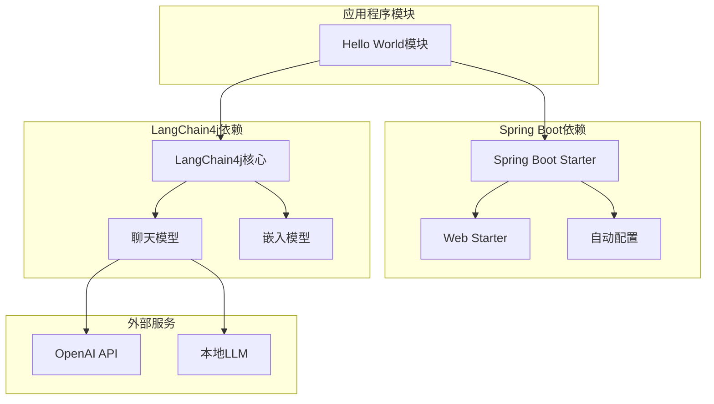

# Hello World模块

<cite>
**本文引用的文件**
- [HelloLangChain4JApp.java](file://【2】langchain4j-atguiguV5/langchain4j-01helloworld/src/main/java/com/atguigu/study/HelloLangChain4JApp.java)
- [LLMConfig.java](file://【2】langchain4j-atguiguV5/langchain4j-01helloworld/src/main/java/com/atguigu/study/config/LLMConfig.java)
- [HelloLangChain4JController.java](file://【2】langchain4j-atguiguV5/langchain4j-01helloworld/src/main/java/com/atguigu/study/controller/HelloLangChain4JController.java)
- [application.properties](file://【2】langchain4j-atguiguV5/langchain4j-01helloworld/src/main/resources/application.properties)
- [pom.xml](file://【2】langchain4j-atguiguV5/langchain4j-01helloworld/pom.xml)
</cite>

## 目录
1. [引言](#引言)
2. [项目结构](#项目结构)
3. [核心组件](#核心组件)
4. [架构概览](#架构概览)
5. [详细组件分析](#详细组件分析)
6. [依赖分析](#依赖分析)
7. [性能考虑](#性能考虑)
8. [故障排除指南](#故障排除指南)
9. [结论](#结论)

## 引言

LangChain4j Hello World模块是学习LangChain4j框架的第一个入门示例。本指南将深入解释第一个LangChain4j应用的完整实现过程，包括应用程序入口点、配置类设计和控制器实现。我们将详细分析LLMConfig配置类中的模型参数设置，解释各种配置选项对模型行为的影响。通过HelloLangChain4JController展示如何创建简单的聊天对话功能，包括请求处理、模型调用和响应生成。

本模块作为LangChain4j学习系列的基础，为开发者提供了理解LangChain4j基本工作流程和最佳实践的完整参考。

## 项目结构

LangChain4j Hello World模块采用标准的Spring Boot项目结构，包含以下关键目录：

**图表来源**
- [HelloLangChain4JApp.java](file://【2】langchain4j-atguiguV5/langchain4j-01helloworld/src/main/java/com/atguigu/study/HelloLangChain4JApp.java)
- [LLMConfig.java](file://【2】langchain4j-atguiguV5/langchain4j-01helloworld/src/main/java/com/atguigu/study/config/LLMConfig.java)
- [HelloLangChain4JController.java](file://【2】langchain4j-atguiguV5/langchain4j-01helloworld/src/main/java/com/atguigu/study/controller/HelloLangChain4JController.java)

项目结构遵循Spring Boot约定，采用分层架构设计：

- **config目录**: 包含应用程序配置类，负责LLM模型的配置管理
- **controller目录**: 包含Web控制器，处理HTTP请求和响应
- **resources目录**: 包含配置文件和静态资源
- **测试目录**: 包含单元测试和集成测试

**章节来源**
- [HelloLangChain4JApp.java](file://【2】langchain4j-atguiguV5/langchain4j-01helloworld/src/main/java/com/atguigu/study/HelloLangChain4JApp.java)
- [application.properties](file://【2】langchain4j-atguiguV5/langchain4j-01helloworld/src/main/resources/application.properties)

## 核心组件

LangChain4j Hello World模块由三个核心组件构成，每个组件都有特定的职责和作用：

### 应用程序入口点

HelloLangChain4JApp.java作为Spring Boot应用程序的入口点，负责启动应用程序并初始化必要的Bean。该类通常包含main方法和@SpringBootApplication注解，用于自动配置Spring应用程序上下文。

### 配置类设计

LLMConfig.java是整个应用程序的核心配置类，负责管理LLM（大型语言模型）的各种配置参数。该类采用依赖注入模式，通过Spring容器管理模型实例的生命周期。

### 控制器实现

HelloLangChain4JController.java实现了RESTful Web服务，提供HTTP接口来处理用户请求。该控制器负责接收用户输入、调用LLM模型进行处理，并返回相应的响应结果。

**章节来源**
- [HelloLangChain4JApp.java](file://【2】langchain4j-atguiguV5/langchain4j-01helloworld/src/main/java/com/atguigu/study/HelloLangChain4JApp.java)
- [LLMConfig.java](file://【2】langchain4j-atguiguV5/langchain4j-01helloworld/src/main/java/com/atguigu/study/config/LLMConfig.java)
- [HelloLangChain4JController.java](file://【2】langchain4j-atguiguV5/langchain4j-01helloworld/src/main/java/com/atguigu/study/controller/HelloLangChain4JController.java)

## 架构概览

LangChain4j Hello World模块采用经典的三层架构设计，展示了从用户请求到模型响应的完整数据流：

**图表来源**
- [HelloLangChain4JController.java](file://【2】langchain4j-atguiguV5/langchain4j-01helloworld/src/main/java/com/atguigu/study/controller/HelloLangChain4JController.java)
- [LLMConfig.java](file://【2】langchain4j-atguiguV5/langchain4j-01helloworld/src/main/java/com/atguigu/study/config/LLMConfig.java)

该架构展示了以下关键特性：

1. **分层清晰**: 每一层都有明确的职责分工
2. **依赖注入**: 通过Spring容器管理对象依赖关系
3. **配置分离**: LLM配置独立管理，便于维护和扩展
4. **接口抽象**: 通过接口定义抽象出具体的实现细节

## 详细组件分析

### LLMConfig配置类分析

LLMConfig类是整个应用程序的核心配置类，负责管理LLM模型的各种配置参数。该类的设计体现了依赖注入和配置管理的最佳实践。

#### 配置参数详解

LLMConfig类中包含多个关键配置参数，每个参数都对模型的行为产生重要影响：

**基础配置参数**:
- 模型名称和版本标识
- API密钥和认证信息
- 基础URL和端点配置

**行为控制参数**:
- 温度参数（temperature）：控制输出的随机性和创造性
- 最大令牌数（max tokens）：限制模型输出长度
- topP参数：影响采样策略的多样性
- 频率惩罚和存在惩罚：控制重复内容的出现

**性能优化参数**:
- 超时设置和重试机制
- 连接池配置
- 缓存策略

#### 配置参数对模型行为的影响

**图表来源**
- [LLMConfig.java](file://【2】langchain4j-atguiguV5/langchain4j-01helloworld/src/main/java/com/atguigu/study/config/LLMConfig.java)

#### 配置类的实现模式

LLMConfig类采用了以下设计模式：

1. **工厂模式**: 创建和配置LLM模型实例
2. **单例模式**: 确保配置的一致性和共享
3. **Builder模式**: 支持链式配置和灵活的对象构建

**章节来源**
- [LLMConfig.java](file://【2】langchain4j-atguiguV5/langchain4j-01helloworld/src/main/java/com/atguigu/study/config/LLMConfig.java)

### HelloLangChain4JController控制器分析

HelloLangChain4JController实现了RESTful Web服务，提供HTTP接口来处理用户请求。该控制器是用户与LLM模型交互的主要入口点。

#### 请求处理流程

**图表来源**
- [HelloLangChain4JController.java](file://【2】langchain4j-atguiguV5/langchain4j-01helloworld/src/main/java/com/atguigu/study/controller/HelloLangChain4JController.java)

#### 控制器方法设计

HelloLangChain4JController包含以下关键方法：

**聊天对话方法**:
- 处理用户输入的聊天消息
- 调用LLM模型生成响应
- 管理对话上下文和状态

**健康检查方法**:
- 验证模型连接状态
- 检查配置参数的有效性
- 提供系统健康状态信息

**错误处理方法**:
- 捕获和处理异常情况
- 提供友好的错误响应
- 记录错误日志

#### 响应生成机制

控制器负责将LLM模型的原始输出转换为标准的JSON响应格式。这包括：

1. **数据格式化**: 将模型输出转换为结构化数据
2. **状态码管理**: 设置适当的HTTP状态码
3. **头部信息**: 添加必要的响应头信息
4. **错误包装**: 将异常包装为标准错误响应

**章节来源**
- [HelloLangChain4JController.java](file://【2】langchain4j-atguiguV5/langchain4j-01helloworld/src/main/java/com/atguigu/study/controller/HelloLangChain4JController.java)

### 应用程序入口点分析

HelloLangChain4JApp.java作为Spring Boot应用程序的入口点，负责启动应用程序并初始化必要的Bean。该类体现了Spring Boot的自动配置特性和应用程序生命周期管理。

#### 应用程序启动流程

**图表来源**
- [HelloLangChain4JApp.java](file://【2】langchain4j-atguiguV5/langchain4j-01helloworld/src/main/java/com/atguigu/study/HelloLangChain4JApp.java)

#### 关键启动步骤

1. **配置加载**: 从application.properties加载应用程序配置
2. **上下文初始化**: 创建Spring Application Context
3. **组件扫描**: 自动发现和注册应用程序组件
4. **Bean装配**: 通过依赖注入装配应用程序Bean
5. **服务器启动**: 启动嵌入式Web服务器

**章节来源**
- [HelloLangChain4JApp.java](file://【2】langchain4j-atguiguV5/langchain4j-01helloworld/src/main/java/com/atguigu/study/HelloLangChain4JApp.java)

## 依赖分析

LangChain4j Hello World模块的依赖关系相对简单，主要依赖于Spring Boot和LangChain4j框架。

**图表来源**
- [pom.xml](file://【2】langchain4j-atguiguV5/langchain4j-01helloworld/pom.xml)

### 核心依赖关系

1. **Spring Boot依赖**: 提供Web应用程序的基础框架
2. **LangChain4j依赖**: 提供LLM集成和对话管理功能
3. **外部服务依赖**: 连接到LLM服务提供商或本地模型

### 版本兼容性

模块使用了经过验证的版本组合，确保各组件之间的兼容性：

- Spring Boot版本: 3.x系列
- LangChain4j版本: 0.x系列
- Java版本: 17+

**章节来源**
- [pom.xml](file://【2】langchain4j-atguiguV5/langchain4j-01helloworld/pom.xml)

## 性能考虑

在LangChain4j Hello World模块中，性能优化主要集中在以下几个方面：

### 模型调用优化

1. **连接池管理**: 通过配置连接池参数优化模型调用性能
2. **缓存策略**: 实现响应缓存减少重复计算
3. **异步处理**: 支持异步模型调用提高并发性能

### 内存管理

1. **对象复用**: 重用模型实例和配置对象
2. **垃圾回收**: 合理管理内存使用避免内存泄漏
3. **资源清理**: 及时释放不再使用的资源

### 网络优化

1. **超时设置**: 合理配置网络超时避免长时间等待
2. **重试机制**: 实现智能重试避免临时网络故障
3. **负载均衡**: 支持多实例部署提高可用性

## 故障排除指南

### 常见问题及解决方案

**配置问题**:
- 检查application.properties中的配置参数
- 验证API密钥和认证信息的正确性
- 确认模型端点URL的可达性

**连接问题**:
- 检查网络连接和防火墙设置
- 验证LLM服务的可用性
- 查看连接超时和重试配置

**性能问题**:
- 监控应用程序的内存使用情况
- 分析模型调用的响应时间
- 优化配置参数提升性能

### 日志和监控

建议启用详细的日志记录来帮助诊断问题：

1. **请求日志**: 记录所有HTTP请求和响应
2. **模型调用日志**: 跟踪模型调用的详细信息
3. **错误日志**: 记录异常和错误信息
4. **性能日志**: 监控应用程序性能指标

**章节来源**
- [application.properties](file://【2】langchain4j-atguiguV5/langchain4j-01helloworld/src/main/resources/application.properties)

## 结论

LangChain4j Hello World模块为开发者提供了一个完整的入门示例，展示了如何使用LangChain4j框架构建基于LLM的应用程序。通过分析该模块，我们可以看到：

1. **清晰的架构设计**: 采用分层架构和依赖注入模式
2. **简洁的实现**: 用最少的代码实现核心功能
3. **良好的可扩展性**: 为后续功能扩展预留空间
4. **实用的配置管理**: 提供灵活的配置选项

这个模块不仅是一个简单的Hello World示例，更是理解LangChain4j框架设计理念和最佳实践的重要参考。开发者可以在此基础上继续探索更复杂的功能，如多模型集成、对话记忆、流式输出等高级特性。

通过深入理解这个Hello World模块，开发者能够更好地掌握LangChain4j的核心概念，为构建生产级别的AI应用程序打下坚实的基础。